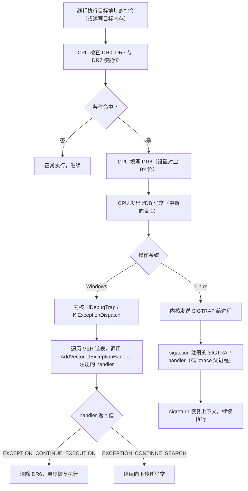
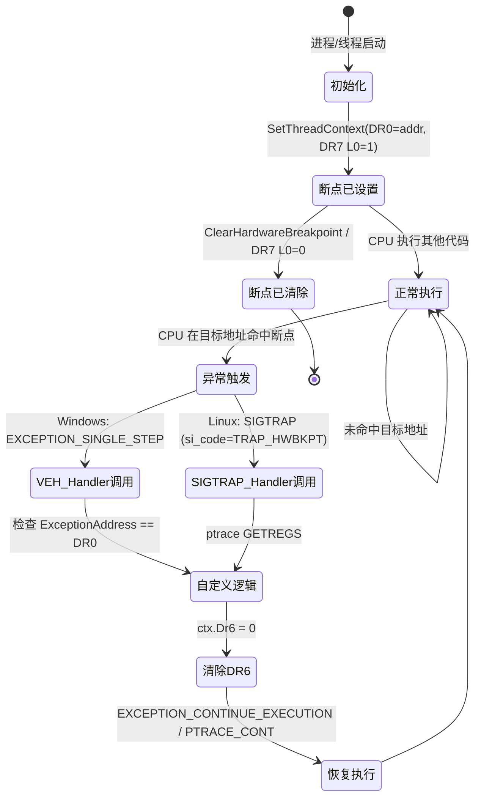

# 10 · 硬件断点 Hook（调试寄存器）

> [!abstract] TL;DR
> 硬件断点 Hook 利用 x86/x64 处理器内置的调试寄存器（DR0–DR7）在特定地址触发 #DB（调试）异常，无需修改任何代码字节即可实现函数拦截。
> DR0–DR3 存放最多 4 个断点地址；DR7 控制每个断点的使能、触发条件（执行/写/读写）和监控长度；DR6 是命中后的状态标志。
> Windows 实现通过 `SetThreadContext` 写 DR 寄存器 + `AddVectoredExceptionHandler` 捕获 `EXCEPTION_SINGLE_STEP`；Linux 通过 `ptrace(PTRACE_POKEUSER)` 写 `u_debugreg` + `SIGTRAP` 信号处理。
> 核心优势：不改代码字节，绕过 CRC/代码完整性检测；硬件级触发，性能优于软件断点（int3）。
> 核心限制：每进程同时只有 4 个槽、每线程独立设置、新线程须补挂。

## 概述与定位

硬件断点（Hardware Breakpoint）是 x86/x64 处理器在硅片层面提供的调试能力——由专用的**调试寄存器**（Debug Registers，DR0–DR7）控制，**完全不依赖被调试代码的内存内容**。与软件断点（`int3`，即 `0xCC` 字节替换）相比，硬件断点是"透明"的：代码字节一个都没改，CRC 校验、代码哈希、完整性检测全部失效。

从 Hook 技术分类的角度，硬件断点 Hook 属于**基于异常分发的 Hook**：通过在目标地址上设置调试寄存器触发条件，使 CPU 在命中时抛出 `#DB`（Debug Exception，中断向量 1），由操作系统异常分发机制将控制权转交给预先注册的 handler，handler 执行自定义逻辑后恢复执行。

**典型应用场景**：
- **反作弊研究（防御视角）**：研究游戏引擎如何检测 hook，以便设计更健壮的保护机制。
- **逆向工程**：观察某个函数的调用参数，特别是在目标有代码完整性保护时。
- **内存访问断点**：监控特定内存地址的写入（"这个变量是被谁改的？"）——这是纯软件 hook 很难优雅实现的功能。
- **调试器核心功能**：所有调试器（WinDbg、x64dbg、GDB、LLDB）的硬件断点功能都基于相同的寄存器机制。
- **安全研究**：在敏感内存区域（如密钥缓冲区）设置读写断点，捕捉对其的访问。

---

## 原理与机制

### x86/x64 调试寄存器全景

x86 架构从 386 时代起提供了 8 个调试寄存器，但并非全部可以直接使用：

| 寄存器 | 宽度 | 功能 | 可直接设置 |
|---|---|---|---|
| DR0 | 64位（32位系统为32位）| 断点 0 线性地址 | 是 |
| DR1 | 同上 | 断点 1 线性地址 | 是 |
| DR2 | 同上 | 断点 2 线性地址 | 是 |
| DR3 | 同上 | 断点 3 线性地址 | 是 |
| DR4 | — | DR6 的别名（已废弃，不要使用）| — |
| DR5 | — | DR7 的别名（已废弃，不要使用）| — |
| DR6 | 32位 | 调试状态寄存器（命中后 CPU 填写）| 通常只读（清零用）|
| DR7 | 32位 | 调试控制寄存器（配置触发条件）| 是 |

**为什么只有 4 个地址槽**：Intel 在设计 386 时将 DR0–DR3 的数量固定为 4，后续架构均保持向后兼容。这是硬件断点最大的使用限制——同时生效的断点地址最多 4 个（但可以动态切换，通过 VEH handler 在命中时重新设置下一组地址）。

### DR6：调试状态寄存器

DR6 是只读状态寄存器（handler 负责清零），CPU 在触发 #DB 异常时自动填写：

```
DR6 位域（32位，高位保留）：
 31     13  12  11  10   9   8   7  ···  3   2   1   0
┌──────┬───┬───┬───┬───┬───┬───┬─────┬───┬───┬───┬───┐
│  保留 │BT │BS │BD │ 0 │ 0 │ 0 │ 保留 │B3 │B2 │B1 │B0 │
└──────┴───┴───┴───┴───┴───┴───┴─────┴───┴───┴───┴───┘
```

- **B0–B3**：对应 DR0–DR3 的断点是否命中（1=是）。同时可有多个置 1（如单步执行经过多个已设地址）。
- **BD**（bit 13）：调试寄存器访问检测——有人试图在 GD=1 时访问 DR 寄存器（反调试检测用）。
- **BS**（bit 14）：单步执行（TF=1 触发的 #DB）。
- **BT**（bit 15）：任务切换时的 TSS T 位触发（极少见）。

**关键点**：进入 #DB handler 后，DR6 的 B0–B3 告诉你是哪个槽命中了。handler **必须在返回前清零 DR6**（否则 CPU 下次可能误报）。Windows 的 VEH 机制会在 `ExceptionRecord` 里提供等价信息，但直接读 DR6 更精确。

### DR7：调试控制寄存器

DR7 是硬件断点最复杂也最关键的寄存器，每个断点槽（0–3）对应若干控制位：

```
DR7 位域（32位，高位在 64 位模式下有扩展，此处以常用 32 位字段为准）：
 31 ··· 24  23·22  21·20  19·18  17·16  15 ··· 10  9   8   7   6   5   4   3   2   1   0
┌────────┬──────┬──────┬──────┬──────┬──────────┬───┬───┬───┬───┬───┬───┬───┬───┬───┬───┐
│  保留   │ LEN3 │ R/W3 │ LEN2 │ R/W2 │  ...保留  │G3 │L3 │G2 │L2 │G1 │L1 │G0 │L0 │GE │LE │
└────────┴──────┴──────┴──────┴──────┴──────────┴───┴───┴───┴───┴───┴───┴───┴───┴───┴───┘
```

为了清晰展示，按位域分组：

| 位 | 名称 | 含义 |
|---|---|---|
| 0 (L0) | 局部使能 0 | 启用 DR0 断点（任务切换时 CPU 自动清零）|
| 1 (G0) | 全局使能 0 | 启用 DR0 断点（任务切换时保持）|
| 2 (L1) | 局部使能 1 | 启用 DR1 断点 |
| 3 (G1) | 全局使能 1 | 启用 DR1 断点 |
| 4 (L2) | 局部使能 2 | ... |
| 5 (G2) | 全局使能 2 | ... |
| 6 (L3) | 局部使能 3 | ... |
| 7 (G3) | 全局使能 3 | ... |
| 16–17 | R/W0 | 断点 0 条件：`00`=执行，`01`=写，`11`=读写，`10`=I/O（需 CR4.DE=1）|
| 18–19 | LEN0 | 断点 0 长度：`00`=1字节，`01`=2字节，`11`=4字节，`10`=8字节（64位）|
| 20–21 | R/W1 | 断点 1 条件 |
| 22–23 | LEN1 | 断点 1 长度 |
| 24–25 | R/W2 | 断点 2 条件 |
| 26–27 | LEN2 | 断点 2 长度 |
| 28–29 | R/W3 | 断点 3 条件 |
| 30–31 | LEN3 | 断点 3 长度 |

**R/W 条件的细节**：
- `00`（执行断点）：LEN 必须为 `00`（1 字节），否则行为未定义。执行断点在 CPU 取指并准备执行目标地址的指令前触发，此时 EIP/RIP 尚未更新到下一条指令。
- `01`（写断点）：仅在向目标地址写入时触发（读取不触发）。
- `11`（读写断点）：任何内存读取或写入目标地址时触发（但不包含指令取指）。

**LEN 字段**：对于写/读写断点，LEN 指定监控的内存宽度（1/2/4/8 字节）。地址必须按 LEN 对齐（2 字节监控需地址为偶数，4 字节监控需 4 字节对齐，否则行为未定义）。

**局部 vs 全局使能**：在用户态 hook 场景中，通常只用**局部使能**（L0–L3）：它们在任务切换（线程切换）时由 CPU 自动清零，因此只在当前线程生效。全局使能（G0–G3）在任务切换后保持，主要用于内核调试器。

### #DB 异常触发与分发路径



**关键细节**：Windows 的 `EXCEPTION_SINGLE_STEP` 异常码（`0x80000004`）是硬件断点触发和单步执行（TF 标志）的共用异常码，通过检查 `ExceptionRecord->ExceptionAddress` 与 DR0–DR3 的值来区分是哪个槽命中。Linux 下 `SIGTRAP` 的 `si_code` 为 `TRAP_HWBKPT`（值为 4）表示硬件断点命中，区别于 `int3` 触发的 `TRAP_BRKPT`（值为 1）。

---

## 结构与算法伪代码详解

### Windows VEH + DR7 完整骨架

下面是一个可编译的 Windows 硬件断点 hook 骨架，使用 VEH（Vectored Exception Handler）捕获 DR0 执行断点：

```c
#include <windows.h>
#include <stdio.h>

/* ─────────────────────────────────────────
 *  全局状态：存储 hook 目标和原始逻辑
 * ───────────────────────────────────────── */
static PVOID  g_hookAddr   = NULL;  // 被 hook 的函数地址
static HANDLE g_targetThread = NULL; // 需要设置 DR 的线程

/* ─────────────────────────────────────────
 *  VEH Handler：捕获 EXCEPTION_SINGLE_STEP
 * ───────────────────────────────────────── */
static LONG CALLBACK VehHandler(EXCEPTION_POINTERS* ep)
{
    PEXCEPTION_RECORD er = ep->ExceptionRecord;
    PCONTEXT          ctx = ep->ContextRecord;

    /* 只处理硬件断点 / 单步异常 */
    if (er->ExceptionCode != EXCEPTION_SINGLE_STEP)
        return EXCEPTION_CONTINUE_SEARCH;

    /* 检查是否是 DR0 命中（通过异常地址对比） */
    if (er->ExceptionAddress == g_hookAddr)
    {
        /* ── 在这里实现 hook 逻辑 ── */
        printf("[HW BP] Hit at %p, RCX=0x%llx, RDX=0x%llx\n",
               er->ExceptionAddress,
               (unsigned long long)ctx->Rcx,  /* 第 1 个参数（x64 Windows ABI）*/
               (unsigned long long)ctx->Rdx); /* 第 2 个参数 */

        /* 如果想替换参数：ctx->Rcx = newValue; */
        /* 如果想替换返回值：需要在 onLeave 设 ctx->Rax（但要先跳过原函数，略复杂）*/

        /* 清除 DR6 状态位，防止重复触发 */
        ctx->Dr6 = 0;

        /* 返回 EXCEPTION_CONTINUE_EXECUTION，CPU 从 ExceptionAddress 重新执行 */
        return EXCEPTION_CONTINUE_EXECUTION;
    }

    return EXCEPTION_CONTINUE_SEARCH;
}

/* ─────────────────────────────────────────
 *  对指定线程设置 DR0 执行断点
 * ───────────────────────────────────────── */
static BOOL SetHardwareBreakpoint(HANDLE hThread, PVOID address)
{
    CONTEXT ctx;
    ctx.ContextFlags = CONTEXT_DEBUG_REGISTERS;

    if (!GetThreadContext(hThread, &ctx))
        return FALSE;

    /* 写 DR0 目标地址 */
    ctx.Dr0 = (DWORD64)(ULONG_PTR)address;

    /* 配置 DR7：
     *   L0 = 1（局部使能 DR0，bit 0）
     *   R/W0 = 00（执行，bits 16-17）
     *   LEN0 = 00（1字节，bits 18-19）
     *
     *  DR7 当前 bit 0 置 1，其余 DR0 相关位已经是 00（执行 + 1字节），
     *  只需确保 L0=1，其他 hook 槽不动。
     */
    ctx.Dr7 |= 0x1;          /* 设置 L0 */
    ctx.Dr7 &= ~(0xF << 16); /* 清除 R/W0 和 LEN0（bits 16-19），确保为"执行，1字节" */

    if (!SetThreadContext(hThread, &ctx))
        return FALSE;

    return TRUE;
}

/* ─────────────────────────────────────────
 *  清除 DR0 断点
 * ───────────────────────────────────────── */
static BOOL ClearHardwareBreakpoint(HANDLE hThread)
{
    CONTEXT ctx;
    ctx.ContextFlags = CONTEXT_DEBUG_REGISTERS;
    if (!GetThreadContext(hThread, &ctx)) return FALSE;

    ctx.Dr0 = 0;
    ctx.Dr7 &= ~0x1;  /* 清除 L0 */

    return SetThreadContext(hThread, &ctx);
}

/* ─────────────────────────────────────────
 *  示例目标函数
 * ───────────────────────────────────────── */
int TargetFunction(int x, int y)
{
    return x + y;
}

int main(void)
{
    /* 1. 注册 VEH（优先级最高：第二个参数 1 表示插入链头）*/
    PVOID vehHandle = AddVectoredExceptionHandler(1, VehHandler);
    if (!vehHandle) { fprintf(stderr, "AddVEH failed\n"); return 1; }

    /* 2. 设置目标地址和目标线程 */
    g_hookAddr     = (PVOID)TargetFunction;
    g_targetThread = GetCurrentThread();

    /* 3. 对当前线程设置硬件断点 */
    if (!SetHardwareBreakpoint(g_targetThread, g_hookAddr))
    { fprintf(stderr, "SetHardwareBreakpoint failed: %lu\n", GetLastError()); return 1; }

    /* 4. 调用被 hook 的函数 */
    printf("main: calling TargetFunction(3, 4)\n");
    int result = TargetFunction(3, 4);
    printf("main: result = %d\n", result);

    /* 5. 清理 */
    ClearHardwareBreakpoint(g_targetThread);
    RemoveVectoredExceptionHandler(vehHandle);
    return 0;
}
```

**编译（MSVC）**：
```bat
cl /nologo /W4 /O2 hw_breakpoint_hook.c /Fe:hw_breakpoint_hook.exe
```

**重要说明——多线程问题**：上面的示例只对 `GetCurrentThread()` 设置了断点，即只有当前线程触发 hook。若目标函数可能被其他线程调用，必须枚举进程中所有线程，对每一个调用 `SetHardwareBreakpoint`：

```c
/* 枚举并对所有线程设置硬件断点（伪代码骨架）*/
HANDLE hSnap = CreateToolhelp32Snapshot(TH32CS_SNAPTHREAD, GetCurrentProcessId());
THREADENTRY32 te = { .dwSize = sizeof(te) };
if (Thread32First(hSnap, &te)) {
    do {
        if (te.th32OwnerProcessID == GetCurrentProcessId()) {
            HANDLE hThread = OpenThread(THREAD_GET_CONTEXT | THREAD_SET_CONTEXT |
                                        THREAD_SUSPEND_RESUME, FALSE, te.th32ThreadID);
            if (hThread) {
                SuspendThread(hThread);  /* 必须先暂停线程才能安全修改 CONTEXT */
                SetHardwareBreakpoint(hThread, g_hookAddr);
                ResumeThread(hThread);
                CloseHandle(hThread);
            }
        }
    } while (Thread32Next(hSnap, &te));
}
CloseHandle(hSnap);
```

新创建的线程不会自动继承 DR 设置（局部使能在任务切换时被 CPU 清零，新线程从全零 DR 开始），因此需要 hook 线程创建（`CreateThread` / `NtCreateThread`）在新线程启动前再次设置。

### 写监控（内存断点）示例

硬件断点的一个独特能力是监控内存**写入**，而不只是执行：

```c
/* 设置对某个 4 字节变量的写监控 */
static BOOL SetWriteWatchpoint(HANDLE hThread, PVOID addr)
{
    CONTEXT ctx;
    ctx.ContextFlags = CONTEXT_DEBUG_REGISTERS;
    if (!GetThreadContext(hThread, &ctx)) return FALSE;

    ctx.Dr1 = (DWORD64)(ULONG_PTR)addr;  /* 使用槽 1 */

    /* DR7 配置：
     *   L1 = 1（bit 2）
     *   R/W1 = 01（写，bits 20-21）
     *   LEN1 = 11（4字节，bits 22-23）
     */
    ctx.Dr7 |=  (1  << 2);   /* L1 = 1 */
    ctx.Dr7 &= ~(0xF << 20); /* 清除 R/W1、LEN1 */
    ctx.Dr7 |=  (0x1 << 20); /* R/W1 = 01（写）*/
    ctx.Dr7 |=  (0x3 << 22); /* LEN1 = 11（4字节）*/

    return SetThreadContext(hThread, &ctx);
}
```

在 VEH handler 中，通过 `er->ExceptionAddress` 可以知道写操作发生时的指令地址（是哪条指令写了这个变量）。

### Linux ptrace 版骨架

在 Linux/Android 上，通过 `ptrace` 向目标进程写调试寄存器：

```c
#include <sys/ptrace.h>
#include <sys/user.h>       /* struct user_regs_struct */
#include <sys/wait.h>
#include <signal.h>
#include <stddef.h>
#include <stdio.h>
#include <stdlib.h>

/* user_debugreg 在 struct user 中的偏移 */
#define DR_OFFSET(n) (offsetof(struct user, u_debugreg[(n)]))

/* 配置 DR7：DR0 执行断点（局部使能）
 *   L0=1, R/W0=00, LEN0=00 → DR7 = 0x00000001 */
#define DR7_L0_EXEC  0x00000001UL

static int set_hw_breakpoint(pid_t pid, uintptr_t addr)
{
    /* 写 DR0 地址 */
    if (ptrace(PTRACE_POKEUSER, pid, (void*)DR_OFFSET(0), (void*)addr) < 0)
        return -1;

    /* 写 DR7 控制字 */
    if (ptrace(PTRACE_POKEUSER, pid, (void*)DR_OFFSET(7), (void*)DR7_L0_EXEC) < 0)
        return -1;

    return 0;
}

static int clear_hw_breakpoint(pid_t pid)
{
    ptrace(PTRACE_POKEUSER, pid, (void*)DR_OFFSET(0), (void*)0);
    ptrace(PTRACE_POKEUSER, pid, (void*)DR_OFFSET(7), (void*)0);
    return 0;
}

int main(int argc, char** argv)
{
    if (argc < 3) {
        fprintf(stderr, "usage: %s <pid> <hex_addr>\n", argv[0]);
        return 1;
    }

    pid_t pid  = (pid_t)atoi(argv[1]);
    uintptr_t target = (uintptr_t)strtoull(argv[2], NULL, 16);

    /* 1. attach */
    if (ptrace(PTRACE_ATTACH, pid, NULL, NULL) < 0) {
        perror("PTRACE_ATTACH"); return 1;
    }
    waitpid(pid, NULL, 0);  /* 等待 SIGSTOP */

    /* 2. 设置硬件断点 */
    if (set_hw_breakpoint(pid, target) < 0) {
        perror("set_hw_breakpoint"); return 1;
    }

    /* 3. 继续运行目标 */
    ptrace(PTRACE_CONT, pid, NULL, NULL);

    /* 4. 等待 SIGTRAP */
    int status;
    while (waitpid(pid, &status, 0) > 0)
    {
        if (WIFSTOPPED(status) && WSTOPSIG(status) == SIGTRAP)
        {
            /* 获取寄存器 */
            struct user_regs_struct regs;
            ptrace(PTRACE_GETREGS, pid, NULL, &regs);
            printf("[HW BP] Hit at RIP=0x%llx, RDI=0x%llx, RSI=0x%llx\n",
                   (unsigned long long)regs.rip,
                   (unsigned long long)regs.rdi,  /* 第 1 个参数（System V AMD64 ABI）*/
                   (unsigned long long)regs.rsi); /* 第 2 个参数 */

            /* 清除 DR6（通过写 0）防止无限重触发 */
            ptrace(PTRACE_POKEUSER, pid, (void*)DR_OFFSET(6), (void*)0);

            /* 继续 */
            ptrace(PTRACE_CONT, pid, NULL, NULL);
        }
        else if (WIFEXITED(status)) {
            printf("[*] target exited\n");
            break;
        }
        else {
            /* 其他信号，透传给目标 */
            ptrace(PTRACE_CONT, pid, NULL, (void*)(long)WSTOPSIG(status));
        }
    }

    clear_hw_breakpoint(pid);
    ptrace(PTRACE_DETACH, pid, NULL, NULL);
    return 0;
}
```

**Linux perf_event_open 替代方案**：Linux 3.4+ 提供 `perf_event_open` 系统调用（`PERF_TYPE_BREAKPOINT`）作为 `ptrace` 的现代替代，可以监控任意进程（需要 `CAP_SYS_PTRACE`）或自身（无需 root）：

```c
#include <linux/perf_event.h>
#include <sys/syscall.h>
#include <unistd.h>

static long perf_event_open(struct perf_event_attr* attr, pid_t pid,
                             int cpu, int group_fd, unsigned long flags)
{
    return syscall(SYS_perf_event_open, attr, pid, cpu, group_fd, flags);
}

/* 对 pid 的 addr 设置执行断点 */
int set_perf_hw_bp(pid_t pid, uintptr_t addr)
{
    struct perf_event_attr attr = {0};
    attr.type           = PERF_TYPE_BREAKPOINT;
    attr.size           = sizeof(attr);
    attr.bp_type        = HW_BREAKPOINT_X;   /* 执行 */
    attr.bp_addr        = addr;
    attr.bp_len         = sizeof(long);       /* 长度（执行断点通常为 sizeof(long)）*/
    attr.sample_period  = 1;
    attr.sample_type    = PERF_SAMPLE_IP | PERF_SAMPLE_REGS_USER;
    attr.disabled       = 0;
    attr.exclude_kernel = 1;
    attr.exclude_hv     = 1;
    attr.wakeup_events  = 1;

    int fd = perf_event_open(&attr, pid, -1 /* 任意 cpu */, -1, 0);
    return fd; /* fd 可以用 read/poll 等待事件 */
}
```

`perf_event_open` 的优势是不需要暂停目标进程（`PTRACE_ATTACH` 会 SIGSTOP 目标），并且可以通过 `mmap` ring buffer 高效地批量读取事件，更适合性能分析场景。

---

## 工具视角与实战

### 状态机：从设置 DR 到命中处理



### 调试器如何使用硬件断点

理解这一机制有助于逆向分析时更好地利用调试器：

**x64dbg / OllyDbg**：右键某行汇编 → "Breakpoint" → "Hardware, on Execution"。调试器内部调用 `GetThreadContext`/`SetThreadContext`，与上面的代码完全等价。最多同时 4 个硬件断点，超过 4 个时调试器会提示"no free debug register"。

**WinDbg**：`ba e1 <address>` 设置执行断点（`e` = execute，`1` = 1字节）；`ba w4 <address>` 设置 4 字节写监控；`bc *` 清除所有断点。

**GDB**：`hbreak *0xdeadbeef`（hardware break）；`watch <var>`（内存写监控，GDB 内部使用 DR）；`rwatch <var>`（读监控）；`awatch <var>`（读写监控）。`info break` 显示当前所有断点及其类型（hw/sw）。

### 与其他 hook 方式的对比

| 维度 | 硬件断点 Hook | Inline Hook (int3) | Inline Hook（trampoline）| IAT Hook |
|---|---|---|---|---|
| 是否修改代码字节 | **否** | 是（0xCC）| 是（jmp 指令）| 否（改 IAT 指针）|
| CRC/哈希检测 | **绕过** | 被检测 | 被检测 | 取决于 IAT 是否被检测 |
| 同时 hook 数量 | **最多 4 个** | 无限 | 无限 | 每导出一个 |
| 性能开销 | 异常（中等）| 异常（中等）| 几乎零 | 几乎零 |
| 读写监控 | **原生支持** | 不支持 | 不支持 | 不支持 |
| 需要目标内存可写 | **否** | 是 | 是 | 是（IAT 段）|
| 跨架构（ARM64） | **是（ARM64 调试寄存器同构）**| 需适配 | 需适配 | 需适配 |

---

## 安全性与正确使用

> [!caution]
> 硬件断点 Hook 通过调试寄存器工作，在 Windows 上需要 `THREAD_SET_CONTEXT` 权限（对其他进程线程操作需管理员权限）；在 Linux 上 `ptrace` 需要 `CAP_SYS_PTRACE` 或同 UID。
> **合规边界**：仅用于自有软件调试、授权渗透测试环境、CTF 靶场、安全研究与教育。
> **禁止**：对未经授权的进程使用；用于规避正版授权保护（违反 DMCA/类似法规）；针对生产系统的恶意 hook。
> 本文所有示例代码以教育为目的，展示原理所需的最小可运行骨架，不提供针对具体软件的武器化实现。

### 陷阱与常见错误

**陷阱 1：忘记清除 DR6**。VEH handler 返回 `EXCEPTION_CONTINUE_EXECUTION` 前必须清零 `ctx->Dr6`，否则 CPU 返回到同一地址时会立即再次触发异常（因为 DR6 中的命中位还置着），造成无限异常循环。

**陷阱 2：执行断点的 LEN 字段**。设置执行断点时，DR7 的 LEN 字段（bits 18-19 for DR0）必须为 `00`（1字节），否则 CPU 行为未定义（可能根本不触发，也可能产生异常行为）。许多初学者的代码因此失效。

**陷阱 3：每线程独立，新线程不继承**。`SetThreadContext` 修改的是指定线程的 DR 寄存器；新创建的线程从零 DR 开始，**不会继承父线程的 DR 配置**。在多线程程序中需要枚举所有线程并逐一设置，并且 hook 线程创建以处理新线程。

**陷阱 4：与调试器冲突**。如果目标程序本身已经在调试器中运行（或目标程序使用了 `IsDebuggerPresent`/`CheckRemoteDebuggerPresent` 检测），调试器可能已经占用了 DR 寄存器。你的 hook 代码写入 DR0 后，下次调试器单步时会覆盖掉你的设置，或者你的 VEH handler 会误触调试器的断点事件。

**陷阱 5：对齐要求**。对于写/读写断点，目标地址必须按 LEN 对齐（LEN=2 → 2字节对齐；LEN=4 → 4字节对齐）。对未对齐地址设置写断点 CPU 会忽略该断点（不触发），不会报错。

**陷阱 6：只有 4 个槽的复用策略**。若需要 hook 超过 4 个地址，需要在 VEH handler 命中后动态切换断点地址（命中 A 时将 DR0 改为 B，命中 B 时改为 C 等轮换），但这会增加逻辑复杂度且命中频率高的情况下性能下降明显。

### 反检测：硬件断点被检测的方式

硬件断点 hook 虽然不改代码字节，但有其自身特征，安全软件可以检测：

1. **读取自身 DR 寄存器**：程序通过 `GetThreadContext` 读取当前线程的 DR0–DR3，如果非零则说明有人设置了断点。这是最简单直接的检测手段。

2. **VEH 链枚举**：通过 `NtQueryInformationThread` 或直接枚举 `LdrpVectorHandlerList` 链表，检测是否有不明 VEH handler 注册。

3. **单步检测（TF 位）**：Frida、VEH hook 等常利用 TF（Trap Flag）配合硬件断点做单步。程序可在自身循环中检查 TF 位是否被设置（触发 `EXCEPTION_SINGLE_STEP`）。

4. **调试器检测 + 硬件断点关联**：若 `IsDebuggerPresent` 返回 true 或 DR 非零，则认为正处于分析中，触发相应对抗行为。

---

## 小结

硬件断点 Hook 是 x86/x64 处理器提供的最"纯净"的 hook 机制：不改一个代码字节，不申请额外可执行内存，完全依赖硬件的 #DB 异常路径。这使它成为唯一能够绕过代码 CRC 完整性检测的 hook 手段，也是实现内存访问监控（"谁写了这个变量"）的最优雅方式。

其核心限制是固定 4 个断点槽和每线程独立性：前者需要动态复用来扩展（以性能为代价），后者需要配合线程枚举和线程创建 hook 来保证覆盖完整。

理解 DR0–DR7 的位域含义（R/W 条件、LEN 字段、局部/全局使能）是正确使用硬件断点的基础；理解 #DB 异常在 Windows 和 Linux 上的分发路径，则是将其变为可靠 hook 框架的关键。

---

## 相关阅读

- [[00.总览|Hook 技术系列总览]]
- [[09-frida|09 · Frida 跨平台动态插桩框架]]
- [[11-process-injection|11 · 进程注入进阶技术]]
- [[32.hooks/02-windows-api-hook.md|02 · Windows API Hook（IAT/EAT/Inline Hook）]]
- [[32.hooks/03-linux-hook.md|03 · Linux 用户态与内核态 Hook]]

---

[[00.总览|⬆ 系列总览]] | [[09-frida|← 上一章]] | [[11-process-injection|→ 下一章]]
