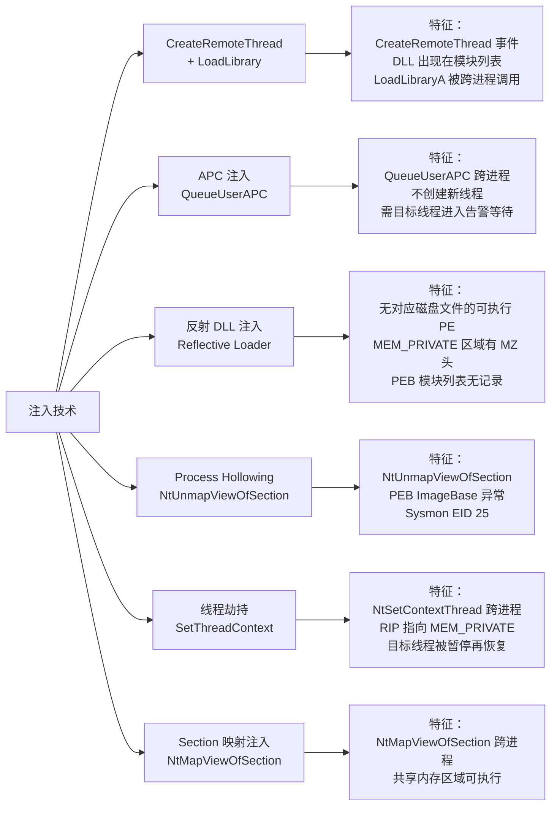

# 11 · 进程注入进阶技术

> [!abstract] TL;DR
> 进程注入是将代码或 DLL 注入到另一个进程地址空间并执行的技术集合，是实现跨进程 Hook 的前提手段。
> 经典三件套（`VirtualAllocEx` + `WriteProcessMemory` + `CreateRemoteThread`）是最基础的方式；APC 注入、Shellcode 反射注入、进程空洞化（Process Hollowing）、Thread Hijacking 是四种进阶变体。
> 每种技术都在 Windows API 调用链上留下可检测的特征：内存权限变化、线程创建事件、模块加载事件、已知 DLL 路径缺失等。
> 安全防护（EDR/AV）正是在这些特征点上建立检测；理解这些机制是构建更健壮防御的基础。
> Linux 进程注入基于 `ptrace` + `mmap` + shellcode 写入；Android 注入借助 ptrace 或 `/proc/<pid>/mem` 直写。

## 概述与定位

进程注入（Process Injection）是一类技术：将**可执行代码**（DLL、shellcode、PE 文件）写入目标进程的地址空间，并迫使目标进程执行它。它是本系列「Hook 技术」的重要组成部分，原因在于：

- **Inline Hook / IAT Hook 等修改目标进程内存的技术，都需要代码首先在目标进程的上下文中执行**。从 hook 代码所在进程到目标进程，必须通过某种注入机制。
- 调试工具（Frida、Cheat Engine 等）的 attach 模式，底层都是进程注入的某种变体。
- 恶意软件的规避手段（把恶意代码寄生在合法进程 svchost.exe 等中）以及 EDR/AV 的检测机制，都建立在对注入技术的理解上。

本文以**防御/检测视角**展开：每介绍一种注入技术，都同步分析其在 Windows 事件日志、ETW 遥测、内存特征上留下的可观测特征，以便防御者构建检测逻辑。**不提供针对真实系统或他人应用的武器化投递步骤**；所有代码骨架仅用于展示技术原理和教学目的。

---

## 原理与机制

### 进程注入的三个核心步骤

无论哪种具体技术，进程注入都可以抽象为三步：

```
1. 在目标进程中获得可写/可执行内存
         ↓
2. 把载荷（DLL 路径、shellcode、PE）写入该内存
         ↓
3. 触发目标进程执行该载荷
```

不同注入技术的差异，本质上是在"哪个 API 做第 1、2、3 步"上的变体选择。

### 操作系统提供的注入原语

Windows 提供了若干设计上用于调试/工具开发的 API，被注入技术广泛利用：

| API | 用途 | 权限要求 |
|---|---|---|
| `OpenProcess` | 获取目标进程 HANDLE | `PROCESS_VM_OPERATION \| PROCESS_VM_WRITE \| PROCESS_VM_READ` |
| `VirtualAllocEx` | 在目标进程中分配内存 | 上述 HANDLE |
| `VirtualFreeEx` | 释放目标进程内存 | — |
| `WriteProcessMemory` | 向目标进程写内存 | — |
| `ReadProcessMemory` | 从目标进程读内存 | — |
| `CreateRemoteThread` | 在目标进程中创建线程 | `PROCESS_CREATE_THREAD` |
| `NtCreateThreadEx` | `CreateRemoteThread` 的底层 ntdll 函数，可绕过部分检测 | — |
| `QueueUserAPC` | 向目标线程投递 APC（Asynchronous Procedure Call）| `THREAD_SET_CONTEXT` |
| `SetThreadContext` | 直接修改线程寄存器（用于劫持线程）| `THREAD_SET_CONTEXT \| THREAD_SUSPEND_RESUME` |
| `NtUnmapViewOfSection` | 解除目标进程的内存区段映射（用于 Hollowing）| — |

Linux 侧的等价原语：
- `ptrace(PTRACE_ATTACH)` → 附加目标进程
- `ptrace(PTRACE_POKETEXT/PTRACE_POKEDATA)` → 写目标内存
- `ptrace(PTRACE_SETREGS)` → 修改寄存器
- `/proc/<pid>/mem` → 直接读写目标进程内存（比 POKETEXT 更高效）

### 关键概念：RWX 内存与内存权限链

注入代码通常需要可执行（X）内存，但直接分配 `PAGE_EXECUTE_READWRITE`（RWX）是已知的高特征操作：

```
PAGE_READWRITE (RW)  →  写入载荷  →  VirtualProtectEx 改为 PAGE_EXECUTE_READ (RX)  →  执行
```

这种"先写后改权限"的模式（W^X 模式）是更规范的做法，也是部分 EDR 检测的规避方式——某些旧版 EDR 只检测 `VirtualAllocEx(RWX)` 而不检测权限变更链。现代 EDR 已通过 ETW 的 `VirtualAllocExNuma` 和 `NtProtectVirtualMemory` 事件覆盖了这两个路径。

---

## 结构与注入技术详解

### 技术一：经典 DLL 注入（CreateRemoteThread + LoadLibrary）

这是最古老也最简单的注入方式，利用 `kernel32.dll` 中的 `LoadLibraryA`/`LoadLibraryW` 函数作为远程线程入口。

**原理**：`CreateRemoteThread` 的第三个参数是线程入口函数指针，其签名为 `LPTHREAD_START_ROUTINE`（`DWORD WINAPI func(LPVOID lpParam)`）——恰好与 `LoadLibraryA` 的签名兼容（同为接受一个 `LPVOID`、返回 `DWORD/HMODULE`）。因此，可以把 DLL 路径字符串写入目标进程，然后以 `LoadLibraryA` 为入口函数、DLL 路径地址为参数创建远程线程，目标进程就会加载该 DLL。

```c
#include <windows.h>
#include <tlhelp32.h>
#include <stdio.h>

/* 根据进程名查找 PID（骨架）*/
static DWORD find_pid(const char* procName)
{
    HANDLE hSnap = CreateToolhelp32Snapshot(TH32CS_SNAPPROCESS, 0);
    PROCESSENTRY32 pe = { .dwSize = sizeof(pe) };
    DWORD pid = 0;
    if (Process32First(hSnap, &pe)) {
        do {
            if (_stricmp(pe.szExeFile, procName) == 0) {
                pid = pe.th32ProcessID; break;
            }
        } while (Process32Next(hSnap, &pe));
    }
    CloseHandle(hSnap);
    return pid;
}

/* 经典 DLL 注入骨架（仅用于教学，目标须为自有/授权进程）*/
int classic_dll_inject(DWORD pid, const char* dllPath)
{
    size_t pathLen = strlen(dllPath) + 1;

    /* 1. 打开目标进程 */
    HANDLE hProc = OpenProcess(
        PROCESS_VM_WRITE | PROCESS_VM_OPERATION | PROCESS_CREATE_THREAD,
        FALSE, pid);
    if (!hProc) return -1;

    /* 2. 在目标进程分配内存写 DLL 路径 */
    LPVOID remoteMem = VirtualAllocEx(hProc, NULL, pathLen,
                                      MEM_COMMIT | MEM_RESERVE,
                                      PAGE_READWRITE);
    if (!remoteMem) { CloseHandle(hProc); return -2; }

    if (!WriteProcessMemory(hProc, remoteMem, dllPath, pathLen, NULL)) {
        VirtualFreeEx(hProc, remoteMem, 0, MEM_RELEASE);
        CloseHandle(hProc); return -3;
    }

    /* 3. 以 LoadLibraryA 为入口函数创建远程线程 */
    HMODULE hKernel32 = GetModuleHandleA("kernel32.dll");
    LPVOID loadLibAddr = (LPVOID)GetProcAddress(hKernel32, "LoadLibraryA");

    HANDLE hThread = CreateRemoteThread(hProc, NULL, 0,
                                        (LPTHREAD_START_ROUTINE)loadLibAddr,
                                        remoteMem, 0, NULL);
    if (!hThread) { VirtualFreeEx(hProc, remoteMem, 0, MEM_RELEASE); CloseHandle(hProc); return -4; }

    WaitForSingleObject(hThread, 5000);

    /* 4. 清理（实际使用时 DLL 已加载，远程内存可释放）*/
    CloseHandle(hThread);
    VirtualFreeEx(hProc, remoteMem, 0, MEM_RELEASE);
    CloseHandle(hProc);
    return 0;
}
```

**可检测特征**：
- Windows Sysmon Event ID 7（ImageLoaded）：目标进程加载了来自非标准路径的 DLL。
- Sysmon Event ID 8（CreateRemoteThread）：`SourceProcessId` ≠ `TargetProcessId`，且 `StartAddress` 指向 `kernel32.LoadLibraryA`。
- ETW `Microsoft-Windows-Kernel-Process` 的 `CreateThread` 事件。
- `LoadLibraryA` 的地址在所有进程中理论上相同（ASLR 后不同，但可以通过枚举得到），容易特征检测。

### 技术二：APC 注入（QueueUserAPC）

APC（Asynchronous Procedure Call，异步过程调用）是 Windows 线程的一种延迟执行机制：某个函数被排队到目标线程的 APC 队列中，当该线程进入**可告警等待状态**（Alertable Wait，如 `SleepEx`、`WaitForSingleObjectEx`、`MsgWaitForMultipleObjectsEx` 且 `bAlertable=TRUE`）时，APC 函数自动被调用。

**与 CreateRemoteThread 的区别**：APC 注入不创建新线程，而是劫持目标进程中的**已有线程**，因此不会触发线程创建相关的 EDR 检测点。

```c
/* APC 注入骨架：向目标进程的所有线程投递 APC（"shotgun 策略"）*/
int apc_inject(DWORD pid, const char* dllPath)
{
    size_t pathLen = strlen(dllPath) + 1;

    HANDLE hProc = OpenProcess(
        PROCESS_VM_WRITE | PROCESS_VM_OPERATION | PROCESS_QUERY_INFORMATION,
        FALSE, pid);
    if (!hProc) return -1;

    LPVOID remoteMem = VirtualAllocEx(hProc, NULL, pathLen,
                                      MEM_COMMIT | MEM_RESERVE, PAGE_READWRITE);
    WriteProcessMemory(hProc, remoteMem, dllPath, pathLen, NULL);

    LPVOID loadLibAddr = (LPVOID)GetProcAddress(
        GetModuleHandleA("kernel32.dll"), "LoadLibraryA");

    /* 枚举目标进程的所有线程，逐一投递 APC */
    HANDLE hSnap = CreateToolhelp32Snapshot(TH32CS_SNAPTHREAD, 0);
    THREADENTRY32 te = { .dwSize = sizeof(te) };
    if (Thread32First(hSnap, &te)) {
        do {
            if (te.th32OwnerProcessID == pid) {
                HANDLE hThread = OpenThread(THREAD_SET_CONTEXT, FALSE, te.th32ThreadID);
                if (hThread) {
                    /* 投递 APC：当线程进入告警等待时执行 LoadLibraryA(remoteMem) */
                    QueueUserAPC((PAPCFUNC)loadLibAddr, hThread, (ULONG_PTR)remoteMem);
                    CloseHandle(hThread);
                }
            }
        } while (Thread32Next(hSnap, &te));
    }
    CloseHandle(hSnap);

    /* 注意：APC 只在线程进入告警等待时才被执行 */
    /* 如果目标线程从不调用 SleepEx 等，APC 永远不会触发 */

    CloseHandle(hProc);
    return 0;
}
```

**APC 注入的局限**：只有线程调用了告警等待函数时 APC 才被处理。游戏进程、高性能服务进程通常不会频繁进入告警等待，APC 注入对这类目标成功率低。实践中常用"shotgun 策略"——向目标进程的所有线程投递 APC，只要有一个线程恰好处于告警等待中就足够。

**Early Bird APC（早期注入变体）**：在 `CreateProcess` 时使用 `CREATE_SUSPENDED` 挂起目标进程，在主线程启动前就通过 APC 注入——此时主线程尚未执行任何代码，整个 APC 队列清空后才进入 `ntdll` 的初始化，属于"极早期注入"，可以 hook 应用程序初始化前的代码。

**可检测特征**：
- ETW `EtwpQueueApc` 事件：跨进程 APC 投递。
- `remoteMem` 内存区域在目标进程中有 `MEM_PRIVATE` 属性但不对应任何已知 DLL。
- 内存 `VirtualAllocEx` 的调用（仍然可以通过 ETW 检测）。

### 技术三：Shellcode 反射注入（Reflective DLL Injection）

反射注入（Reflective DLL Injection，由 Stephen Fewer 于 2008 年首次公开）解决了经典 DLL 注入的一个根本问题：**使用 `LoadLibrary` 会在 PEB 的模块列表中留下记录，枚举进程模块即可发现异常 DLL**。反射注入通过在 DLL 内部实现一个"自装载器"（reflective loader），完全不经过 `LoadLibrary`，因此不在模块列表中出现。

**基本原理**：

```
注入者（Injector）                          目标进程（Target）
─────────────────────────────────────────────────────────────
1. VirtualAllocEx 分配 RWX 内存
2. WriteProcessMemory 写入整个 DLL 的二进制内容
   （PE 文件格式，包含 reflective loader 函数）
3. CreateRemoteThread / APC 以 reflective loader 地址为入口执行

                                      4. reflective loader 在目标进程内运行：
                                         a. 解析自身 PE 头，找到 ImageBase
                                         b. 申请合适的新内存（实际装载位置）
                                         c. 复制各 section 到正确偏移
                                         d. 处理 relocation（若加载地址与 PreferredBase 不同）
                                         e. 解析并填充 Import Table（手动 GetProcAddress）
                                         f. 调用 DllMain(DLL_PROCESS_ATTACH)
                                         g. 返回 DllMain 的返回值

注意：整个过程不调用 LoadLibrary，
      DLL 不出现在 PEB.Ldr 模块链表中
```

反射 loader 的核心挑战是：它运行时只知道自己被加载到某个地址（通过 `call`/`pop` trick 或 `RIP-relative` 获取当前指令地址），必须自行完成 PE 装载器通常由 ntdll 完成的所有工作。

**可检测特征**：
- 内存中存在一个没有对应磁盘文件的可执行 PE 映像（`VAD` 类型为 `MEM_PRIVATE`，但结构是 PE）。
- PE 头扫描（扫描目标进程内存中所有 `MZ` 魔数）。
- 没有 `LoadLibrary` 调用但新出现了可执行的匿名内存区域。
- 现代 EDR 通过内存扫描（`MiniDump` 或 kernel callback）检测此类未注册 PE。

### 技术四：Process Hollowing（进程空洞化）

Process Hollowing 不是把代码注入到**已运行进程**，而是创建一个**挂起状态的合法进程**，然后用恶意代码替换其内存中的可执行内容，再恢复执行——最终执行的是恶意代码，但进程的外壳是合法程序（如 `svchost.exe`、`notepad.exe`）。

```
1. CreateProcess("svchost.exe", ..., CREATE_SUSPENDED)
   → 进程创建但主线程挂起，ntdll 尚未初始化

2. GetThreadContext(hMainThread) 获取 EBX/RBX（指向 PEB）
   ReadProcessMemory 从 PEB 读 ImageBaseAddress

3. NtUnmapViewOfSection(hProc, ImageBaseAddress)
   → 解除原 svchost.exe 的内存映射（"掏空"）

4. VirtualAllocEx 在 (preferredBase || 任意地址) 申请同等大小 RWX 内存

5. WriteProcessMemory 写入我们的 PE（headers + sections）

6. 如果加载基址变了，修正 PE 的 relocation

7. 修改 PEB.ImageBaseAddress = 新 ImageBaseAddress

8. SetThreadContext 修改主线程的入口点寄存器（EAX/RAX）
   指向我们 PE 的 EntryPoint

9. ResumeThread(hMainThread) → 执行我们的代码
```

**为什么仍然可以检测**：
- `NtUnmapViewOfSection` 解除映射后重新申请是极不寻常的模式，ETW 覆盖了此事件。
- 进程 PE 头的 `ImageBaseAddress` 与实际内存内容的 PE 的 `ImageBase` 字段不一致。
- 进程的主模块文件路径（从 PEB.ImagePathName）与实际可执行内容的哈希不匹配。
- Sysmon Event ID 25（ProcessTampering: Image is replaced）直接检测此模式。
- Windows 10 1903+ 的 PsProtectedProcess 机制使 critical system processes 无法被 `NtUnmapViewOfSection`。

### 技术五：线程劫持（Thread Hijacking / Thread Context Injection）

线程劫持不分配新内存，而是：

1. `SuspendThread` 暂停目标进程中的一个线程。
2. `GetThreadContext` 读取其当前寄存器（主要是 `RIP`/`EIP`）。
3. `WriteProcessMemory` 在目标进程某处写入 shellcode。
4. `SetThreadContext` 把 `RIP`/`EIP` 改为 shellcode 地址。
5. `ResumeThread` 恢复线程——线程从 shellcode 开始执行。
6. Shellcode 执行完毕后跳回原 `RIP`，恢复原线程流。

这种方式不创建新线程（无线程创建事件），但它有一个明显的弱点：在 `SuspendThread` 到 `ResumeThread` 之间，目标线程被强行暂停可能造成程序逻辑问题（持有锁的线程被暂停 → 死锁）。此外，shellcode 执行完毕需要正确恢复原 RIP（常用 `push <orig_rip>; ret` 技巧），实现较复杂。

**可检测特征**：
- `SetThreadContext` 修改跨进程线程的 RIP 为非模块内地址（指向 `MEM_PRIVATE` 区域）。
- ETW 覆盖了 `NtSetContextThread`（Kernel-Process provider）。
- RIP 跳转到不属于任何已知模块的内存区域（可通过枚举 `EnumerateModules` 并检查地址范围来检测）。

### 技术六：映射注入（Section / MapView Injection）

创建内存映射（Section 对象），在注入进程中写入载荷，然后把同一个 Section 映射到目标进程。这种方式的特殊之处在于：**WriteProcessMemory 在 ETW 中会被记录，但 `NtMapViewOfSection` 的跨进程映射记录不同**，某些旧版检测工具对映射注入不敏感。

```c
/* 映射注入骨架（示意）*/
// 1. NtCreateSection(SEC_COMMIT, PAGE_EXECUTE_READWRITE, size)
// 2. NtMapViewOfSection → 在注入进程映射 → 写入 shellcode
// 3. NtMapViewOfSection(hSection, hTargetProcess, ...) → 映射到目标进程
// 4. 通过 APC / CreateRemoteThread 执行映射地址
// 5. NtUnmapViewOfSection 从注入进程撤销映射
```

现代 EDR 已通过 ETW `MapViewOfSection` 事件覆盖此路径。

### Linux / Android 进程注入

**Linux ptrace 注入（原理骨架）**：

```c
/* Linux 下把 shellcode 注入目标进程并执行（教学骨架）*/
#include <sys/ptrace.h>
#include <sys/user.h>
#include <sys/wait.h>
#include <string.h>
#include <stdio.h>

/* 通过 PTRACE_POKETEXT 向目标进程写 shellcode（每次 8 字节）*/
static int inject_shellcode(pid_t pid, uintptr_t dest, const uint8_t* sc, size_t len)
{
    for (size_t i = 0; i < len; i += sizeof(long)) {
        long word = 0;
        memcpy(&word, sc + i, (len - i) >= sizeof(long) ? sizeof(long) : (len - i));
        if (ptrace(PTRACE_POKETEXT, pid, (void*)(dest + i), (void*)word) < 0)
            return -1;
    }
    return 0;
}

int linux_inject(pid_t pid, const uint8_t* shellcode, size_t sc_len)
{
    /* 1. attach */
    if (ptrace(PTRACE_ATTACH, pid, NULL, NULL) < 0) return -1;
    waitpid(pid, NULL, 0);

    /* 2. 获取当前寄存器（保存原始 RIP）*/
    struct user_regs_struct orig_regs, regs;
    ptrace(PTRACE_GETREGS, pid, NULL, &orig_regs);
    regs = orig_regs;

    /* 3. 找可执行内存（简化：直接用当前 RIP 处的代码段覆盖，
     *    生产实现应调用 mmap syscall 申请新内存）*/
    uintptr_t inject_addr = orig_regs.rip;
    inject_shellcode(pid, inject_addr, shellcode, sc_len);

    /* 4. 把 RIP 指向 shellcode */
    regs.rip = inject_addr;
    ptrace(PTRACE_SETREGS, pid, NULL, &regs);

    /* 5. 单步执行 / CONT 等待 shellcode 完成（shellcode 末尾通常是 int3 触发 SIGTRAP）*/
    ptrace(PTRACE_CONT, pid, NULL, NULL);
    int status;
    waitpid(pid, &status, 0); /* 等待 SIGTRAP（shellcode 执行完毕的 int3）*/

    /* 6. 恢复原始寄存器 */
    ptrace(PTRACE_SETREGS, pid, NULL, &orig_regs);
    ptrace(PTRACE_DETACH, pid, NULL, NULL);
    return 0;
}
```

生产级实现中，步骤 3 通常不会直接覆盖代码段（会导致目标程序崩溃），而是先在目标进程调用 `mmap` 系统调用来申请新可执行内存：通过 ptrace 在目标进程的 RIP 处写入 `syscall` 指令 + 参数设置指令，执行后获得 `mmap` 返回的新地址，再向新地址写入真正的 payload。

**Android /proc/pid/mem 注入（另一种方式）**：

Android 允许（在有 root 权限时）通过 `/proc/<pid>/mem` 直接读写进程内存，比 `PTRACE_POKETEXT` 效率高：

```c
#include <fcntl.h>
#include <stdio.h>
#include <unistd.h>

int android_mem_write(pid_t pid, uintptr_t addr, const void* data, size_t len)
{
    char path[64];
    snprintf(path, sizeof(path), "/proc/%d/mem", pid);
    int fd = open(path, O_RDWR);
    if (fd < 0) return -1;
    ssize_t written = pwrite(fd, data, len, (off_t)addr);
    close(fd);
    return (written == (ssize_t)len) ? 0 : -1;
}
```

---

## 工具视角与实战

### 各注入技术一览：特征、检测点、防御建议



### 检测框架（防御者视角）

理解各种注入技术后，防御者可以构建多层检测：

**层 1：API 层（用户态）**
- Sysmon / EDR 钩住以下 Windows API：`VirtualAllocEx`（目标进程非自身，分配 RWX）、`WriteProcessMemory`（跨进程）、`CreateRemoteThread`（跨进程）、`QueueUserAPC`（跨进程）、`SetThreadContext`（跨进程，且新 RIP 不在已知模块范围内）。
- 规则：`SourceProcessId ≠ TargetProcessId` + 上述 API 组合 + TargetImage 是高信誉进程（svchost.exe 等）。

**层 2：内存特征层**
- 定期扫描进程内存：`MEM_PRIVATE | MEM_COMMIT | PAGE_EXECUTE_*` 区域中出现 PE 头（`MZ` + `PE` 魔数）→ 反射注入特征。
- 可执行区域不对应任何已知模块的文件路径 → 可疑。
- `PAGE_EXECUTE_READWRITE` 区域的存在本身是高危特征（W^X）。

**层 3：行为层**
- 进程在启动后短时间内主模块被 `NtUnmapViewOfSection` → Process Hollowing 特征。
- 正常进程（notepad.exe 等）连接网络 / 读取敏感注册表 → 行为异常，配合注入检测高置信度。

**层 4：Kernel 层（驱动/ETW-TI）**
- Windows 10+ 提供 **Process Mitigation Policy**：`SetProcessMitigationPolicy(ProcessDynamicCodePolicy, ...)` 阻止进程分配新可执行内存（Block Non-Microsoft Binaries）。
- `VirtualProtect` 从 RW 改为 RX 本身可在内核 `MmProtectVirtualMemory` 回调中检测。

### 实战工具参考

| 工具 | 用途 | 视角 |
|---|---|---|
| Sysmon | 进程、线程、模块加载事件记录 | 防御/检测 |
| Process Hacker / Process Monitor | 实时观察内存区域、线程创建 | 研究/分析 |
| Volatility / Rekall | 内存取证，检测注入痕迹 | 取证/防御 |
| PE-sieve | 扫描进程内存中的 PE 异常（替换、注入）| 防御/取证 |
| Moneta | 枚举进程内存中所有私有可执行区域 | 防御/研究 |
| Frida | 动态插桩，观察注入 API 调用（详见第 9 章）| 研究 |

---

## 安全性与正确使用

> [!caution]
> 进程注入技术对目标进程具有完全的读写/执行控制能力，属于高权限操作。
> **合规边界**：仅用于自有软件（如将 DLL 注入自己编写的程序进行测试）、明确书面授权的渗透测试/红队演练、CTF 靶场、安全研究（分析恶意软件样本）、学术/教育环境。
> **禁止**：对未经授权的进程/系统使用；绕过软件 DRM 或授权验证（违反 DMCA/类似法规）；开发、传播恶意软件或远程访问工具（RAT）；任何针对真实用户设备的非授权操作。
> 本文的所有代码骨架仅用于展示原理，不包含具体载荷或针对特定软件的绕过步骤。

### Windows 进程保护机制

微软在不断加固 Windows 对注入的抵抗能力：

**Protected Processes (PP / PPL)**：通过 `PsProtectedProcess` 内核机制，关键系统进程（如 `lsass.exe`、`MsMpEng.exe`）被设为受保护进程，普通进程无法对其调用 `OpenProcess` 获得 `PROCESS_VM_WRITE` 等权限——即使是管理员权限也不行。只有携带 Windows 签名的驱动才能操作 PPL 进程。

**Arbitrary Code Guard (ACG)**：进程可以通过 `SetProcessMitigationPolicy(ProcessDynamicCodePolicy)` 声明不允许在自己内创建新的可执行代码映射——这直接阻断了大多数 shellcode/反射注入路径。Edge/Chrome 渲染进程已启用 ACG。

**Control Flow Guard (CFG)**：限制间接跳转（`call [rax]`、`jmp [rcx]` 等）的目标只能是编译器生成的合法跳转目标集合，即使 shellcode 被执行，若其中的间接跳转目标不在 CFG 合法集中，会触发 `__fastfail`。

**CIG（Code Integrity Guard）/ Block Non-Microsoft Binaries**：阻止加载未经 Microsoft 签名的 DLL，直接封堵经典 DLL 注入（`LoadLibrary` 返回失败）。许多游戏反作弊（如 Valorant 的 Vanguard）也实现了类似限制。

### 注入检测的误报问题

防御者需要注意，某些合法软件也使用了"类注入"模式：

- 注入式 DLL 的安全产品（AV/EDR 本身就是 DLL 注入到所有进程）；
- 游戏修改工具（如 Steam 的 GameOverlayRenderer.dll 注入到游戏进程）；
- 调试器（WinDbg/x64dbg 的 `ReallyCreateProcess` 流程类似 Hollowing）；
- 输入法软件（注入到前台窗口进程）。

因此，检测规则需要结合进程信誉（数字签名、文件路径、父子进程关系）和行为上下文，而不能仅依赖 API 层面的单一规则。

---

## 小结

进程注入是跨进程 Hook 的前提，也是安全攻防中极重要的技术领域。从最简单的 `CreateRemoteThread + LoadLibrary`，到规避模块列表的反射注入，到完全替换进程可执行内容的 Process Hollowing，每一种技术都对应着操作系统在进程内存管理、线程创建、异常分发上的某个接缝。

防御者的优势在于：这些技术都必须经过 OS 提供的有限 API（`VirtualAllocEx`、`WriteProcessMemory`、`CreateRemoteThread`、`NtMapViewOfSection` 等），而这些 API 无一例外都有对应的 ETW 事件和内核回调。现代 EDR 通过组合 API 监控 + 内存扫描 + 行为分析，构成多层检测；Windows 自身的 PPL、ACG、CFG、CIG 机制则从根本上阻断了部分注入路径。

理解这些技术的原理，是安全工程师设计检测规则、评估 EDR 覆盖盲区、以及构建更健壮系统保护策略的基础。

---

## 相关阅读

- [[00.总览|Hook 技术系列总览]]
- [[10-hardware-breakpoint-hook|10 · 硬件断点 Hook（调试寄存器）]]
- [[09-frida|09 · Frida 跨平台动态插桩框架]]
- [[32.hooks/02-windows-api-hook.md|02 · Windows API Hook（IAT/EAT/Inline Hook）]]
- [[32.hooks/03-linux-hook.md|03 · Linux 用户态与内核态 Hook]]

---

[[00.总览|⬆ 系列总览]] | [[10-hardware-breakpoint-hook|← 上一章]] | [[12-kernel-hook|→ 下一章]]
