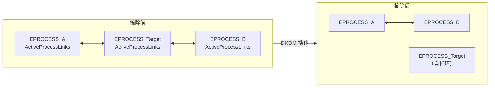

# 12 · 内核 Hook 历史与原理（SSDT/IDT/DKOM）

> [!abstract] TL;DR
> 内核级 Hook 是 rootkit 技术的核心，通过直接修改 SSDT 表项、IDT 中断门、内核 inline 代码或 EPROCESS 链表来拦截/隐藏系统行为。Windows x64 引入 PatchGuard 后，这类篡改在现代系统中会触发 BSOD，合法场景应改用内核通知回调（PsSetCreateProcessNotifyRoutineEx、ObRegisterCallbacks）或 Minifilter 框架。本章为历史与防御性分析视角，不提供武器化步骤。

## 概述与定位

内核 Hook 是指在操作系统内核层面——驱动程序与操作系统之间，或操作系统内部——插入自定义代码，以拦截、修改或监控系统调用、中断处理、驱动 I/O 等关键路径的技术总称。它区别于用户态 Hook（如 IAT Hook、API Inline Hook）的核心特征在于：**运行于 Ring 0**，拥有与操作系统内核相同的特权级别，能够绕过绝大多数用户态防护。

### 历史演进脉络

内核 Hook 的实用化主要出现在 Windows NT 体系（Windows 2000/XP 时代）。彼时内核模块（.sys 驱动）可以直接读写 `KeServiceDescriptorTable` 所指向的 SSDT，也可以使用 `sidt` 指令获取 IDT 基址并直接改写中断向量。这一时期 rootkit 技术被大量用于病毒/木马的自我隐藏（隐藏进程、文件、网络端口）以及安全软件的主动防护（HIPS、杀毒引擎的内核钩子）。

Windows Vista x64 开始引入 **PatchGuard（KPP，Kernel Patch Protection）**，周期性地校验 SSDT、IDT、GDT、关键 MSR 以及内核代码节的完整性，一旦检测到篡改即触发 BUGCHECK（KI_EXCEPTION_NOT_HANDLED / CRITICAL_STRUCTURE_CORRUPTION）。此后内核 Hook 在 x64 Windows 上的合法性通道已基本关闭，安全软件转向使用微软公开的内核回调接口（ETW、回调例程、Minifilter）。

### 本章定位

本章作为 Hook 系列的历史与防御分析章节，目标读者包括：
- 逆向工程师/安全研究员，需要理解 rootkit 的历史手法以进行检测与取证；
- 内核开发者，了解哪些做法已被 PatchGuard 封堵，如何选择合规替代方案；
- CTF 参赛者，理解内核 exploit 题目中的技术背景。

---

## 原理与机制

### Windows 系统调用路径

理解内核 Hook 的前提是掌握 Windows 系统调用的完整路径。用户态程序调用 `NtReadFile` 时，控制流如下：

```
用户态：
  NtReadFile (ntdll.dll)
    → mov eax, 服务号
    → syscall / sysenter / int 2Eh
内核态：
    → KiSystemCall64 / KiSystemService
    → 通过 KeServiceDescriptorTable 查 SSDT
    → 调用 KiServiceTable[服务号] 所指向的内核函数
    → NtReadFile (ntoskrnl.exe)
```

在 32 位 Windows XP 时代，旧款 CPU 使用 `int 0x2E` 进入内核，现代系统均使用 `syscall`（x64）或 `sysenter`（x86）快速系统调用指令。每条路径都曾是 Hook 的切入点。

### SSDT（System Service Descriptor Table）

`KeServiceDescriptorTable` 是 ntoskrnl.exe 导出的全局变量，指向一个 `KSERVICE_TABLE_DESCRIPTOR` 结构数组：

```c
typedef struct _KSERVICE_TABLE_DESCRIPTOR {
    PULONG_PTR  Base;       // 指向服务函数地址表（KiServiceTable）
    PULONG      Count;      // 各服务调用次数（调试用，生产中通常为 NULL）
    ULONG       Limit;      // 表中服务数量
    PUCHAR      Number;     // 参数字节数表
} KSERVICE_TABLE_DESCRIPTOR;
```

索引 0 对应 `ntoskrnl` 的系统服务（`nt!NtReadFile` 等），索引 1 对应 `win32k.sys` 的 GUI 系统服务（`KeServiceDescriptorTableShadow` 指向第二张表）。GUI 应用（凡是调用过 `GDI`/`USER` 系列函数的进程）会使用 Shadow SSDT，普通控制台程序只使用 SSDT 索引 0。

**SSDT Hook 的原理**：将 `KiServiceTable[目标服务号]` 改写为 Hook 函数地址。x86 时代直接写数组元素即可；x64 上 SSDT 存储的是相对偏移（`KiServiceTable + 偏移值/16`），改写格式需相应处理。

### IDT（Interrupt Descriptor Table）Hook

IDT 是 CPU 级别的中断/异常分发表，每个条目（门描述符）保存中断处理程序的段选择子与偏移。`sidt` 指令可在特权模式下读出 IDT 基址，`lidt` 指令可加载新 IDT。

旧式 `int 0x2E` 系统调用入口位于 IDT[0x2E]，Hook 该槽可拦截所有系统调用。同理，IDT[0x03]（断点异常 #BP）、IDT[0x0E]（缺页异常 #PF）都曾是高级调试器/内核 Hook 的目标。

IDT Hook 相比 SSDT Hook 影响面更广，一旦改错（偏移计算错误）会导致即时 BSOD，操作风险更高。

### 内核 Inline Hook

与用户态 inline hook 原理相同，区别在于目标是内核函数（`ntoskrnl.exe`、`win32k.sys` 内部函数或驱动的 `.text` 段）。典型步骤：

1. 将目标函数前 5 字节（32 位：`jmp rel32`）或 14 字节（64 位：`mov rax, abs64; jmp rax`）替换为跳转到 Hook 桩；
2. Hook 桩保存寄存器、执行前置处理；
3. 执行被覆盖的原始字节（Trampoline）；
4. 调用原函数主体；
5. 执行后置处理并返回。

在 x64 Windows 内核中，内核代码默认映射为只读（`WriteProtect` CR0.WP 位），需要先清除 WP 位再写入，之后还原。PatchGuard 会周期检查代码节完整性，因此这类 Hook 存活时间有限。

### IRP 派发函数 Hook

驱动对象（`DRIVER_OBJECT`）中的 `MajorFunction[IRP_MJ_*]` 数组存储各种 I/O 请求的处理函数指针。直接改写该数组中的指针（例如将 `MajorFunction[IRP_MJ_READ]` 替换）即可拦截对应驱动的读请求，常用于文件系统驱动或网络驱动的拦截。与 SSDT Hook 相比，IRP Hook 仅影响特定驱动，粒度更细，但 PatchGuard 对 `DRIVER_OBJECT` 的保护力度弱于 SSDT，历史上存活时间相对较长。

---

## 内核 Hook 结构与算法深度详解

### SSDT Hook 细节（x86 vs x64 对比）

```
x86（Windows XP/2003）：
KiServiceTable: [ptr0][ptr1]...[ptrN]
                  ↑ 直接是绝对函数地址，宽度 4 字节

x64（Windows Vista+）：
KiServiceTable: [off0][off1]...[offN]
                  ↑ 32 位有符号整数，表示：
                    函数地址 = &KiServiceTable + off_i / 16
                （低 4 位是参数字节数的编码）
```

在 x86 时代，SSDT Hook 的核心操作伪码：

```c
// 1. 关闭写保护
KIRQL irql = KeRaiseIrqlToDpcLevel();
__asm { cli }
_asm { mov eax, cr0; and eax, NOT 0x10000; mov cr0, eax }

// 2. 替换表项
KeServiceDescriptorTable.ServiceTableBase[INDEX_NtReadFile] =
    (ULONG_PTR)MyHookedNtReadFile;

// 3. 恢复写保护
_asm { mov eax, cr0; or eax, 0x10000; mov cr0, eax }
__asm { sti }
KeLowerIrql(irql);
```

x64 上 `KeServiceDescriptorTable` 不再导出（PatchGuard 保护），需要通过扫描内存模式或特定偏移推算其地址，并且表项格式改为相对偏移编码，整体复杂度大幅上升，且随时面临 KPP 检测。

### DKOM（Direct Kernel Object Manipulation）

DKOM 不改代码，而是**直接修改内核数据结构**，绕过代码完整性检查。最经典的场景是隐藏进程。

每个进程对应一个 `EPROCESS` 结构（大小随 Windows 版本变化，Windows 10 约 0x900 字节），其中 `ActiveProcessLinks` 字段是一个 `LIST_ENTRY`，将所有运行中的进程串成一个双向循环链表：

```
PsActiveProcessHead ←→ EPROCESS_A.ActiveProcessLinks ←→ EPROCESS_B.ActiveProcessLinks ←→ ...
```

`PsGetNextProcess`、`ZwQuerySystemInformation` 中的进程枚举均通过遍历此链表实现。DKOM 隐藏进程的操作即**将目标进程的节点从链表中摘除**：

```c
// 伪代码：摘除 pTarget 的 EPROCESS 节点
PLIST_ENTRY pEntry = &pTarget->ActiveProcessLinks;
pEntry->Blink->Flink = pEntry->Flink;   // 前驱的 Flink 跳过 pTarget
pEntry->Flink->Blink = pEntry->Blink;   // 后继的 Blink 跳过 pTarget
// 将 pTarget 自指，避免 MmFlushAllPages 遍历时崩溃
pEntry->Flink = pEntry;
pEntry->Blink = pEntry;
```

执行后，`tasklist`、任务管理器、`ZwQuerySystemInformation` 均看不到该进程，但进程本身仍在运行，其线程仍被调度器调度（调度器使用独立的线程链表，不依赖 `ActiveProcessLinks`）。

### Mermaid 示意：SSDT Hook 调用重定向流程

```mermaid
flowchart TD
    A["用户态\nNtReadFile (ntdll.dll)"] --> B["syscall\n系统调用号 eax=0x06"]
    B --> C["KiSystemCall64\n内核入口"]
    C --> D{SSDT 查表\nKiServiceTable[6]}
    D -->|"正常路径（未 Hook）"| E["nt!NtReadFile\n(ntoskrnl.exe)"]
    D -->|"被 Hook 后"| F["MyHookNtReadFile\n(恶意/安全驱动)"]
    F --> G{前置处理\n过滤/记录/修改参数}
    G -->|"允许通过"| E
    G -->|"拦截"| H["直接返回\n伪造结果"]
    E --> I["完成 I/O\n返回用户态"]
    H --> I
```

### DKOM 链表摘除示意



### DKOM 的其他变体

除进程隐藏外，DKOM 还可用于：

- **隐藏驱动**：遍历 `PsLoadedModuleList`（`LDR_DATA_TABLE_ENTRY` 链表）摘除驱动模块节点，使 `ZwQuerySystemInformation(SystemModuleInformation)` 看不到恶意驱动；
- **隐藏网络端口**：在 tcpip.sys 维护的连接对象链表中摘除特定端口项；
- **令牌窃取**：将低权限进程的 `EPROCESS.Token` 替换为 `System`（PID 4）进程的令牌，实现权限提升。

DKOM 的检测关键在于**交叉视图比对**：通过多种独立枚举路径（`ZwQuerySystemInformation` vs 直接遍历内核链表 vs 硬件调试器枚举线程/进程）对比结果，差异项即为被 DKOM 隐藏的对象。工具如 Process Hacker、ARKit（Anti-Rootkit Toolkit）均实现了此逻辑。

### PatchGuard（KPP）原理

PatchGuard 由 Windows x64 内核（从 Vista 开始，Server 2003 x64 亦支持）引入，是一套**运行于内核中的完整性定期校验机制**，非单一模块而是散布于内核各处的加密检验逻辑。

其保护范围涵盖：

| 被保护对象 | 说明 |
|---|---|
| SSDT / KiServiceTable | 防止系统调用表被改写 |
| IDT | 防止中断向量被替换 |
| GDT / TSS | 防止段描述符被篡改 |
| LSTAR / CSTAR MSR | syscall/sysenter 处理函数指针 |
| 内核代码段 `.text` | 防止 inline hook |
| 关键内核数据结构 | 如 `KPCR`、`KPRCB` 等 |

PatchGuard 以**随机定时器**触发检验（时间间隔随机，约 5-10 分钟），且校验代码本身经过混淆/加密，每次启动的执行路径不同，增加静态分析难度。

历史上的绕过思路（仅概述原理，不给可用代码）：

1. **定时器劫持**：定位并修改 PatchGuard 内部定时器，使其永不触发——但查找逻辑本身难度极高且随版本变化；
2. **在校验窗口前还原**：知道 PatchGuard 即将检验时先还原 Hook，检验后再重新安装——需要预测检验时机，实际不可靠；
3. **MSR Hook 协调**：通过 VMX 虚拟化劫持 MSR 写入，使 PatchGuard 的状态读取返回预期值——VT-x Hypervisor 层面绕过，复杂度极高。

**现代现实**：在 Windows 10/11 x64 + Secure Boot + HVCI（Hypervisor-Protected Code Integrity）组合下，内核 Hook 的攻击面已几乎完全关闭。即使加载了签名驱动，HVCI 也会阻止内核页面的可写+可执行权限变更。

### DSE（Driver Signature Enforcement）

DSE 要求加载到内核的驱动必须持有有效的 WHQL 或 EV 签名（测试模式/Testsigning 除外）。其在内核中的实现核心是 `g_CiEnabled` / `CiInitialize` / `SeValidateImageHeader` 等函数。历史上存在通过改写 `g_CiEnabled` 标志位（从 1 改为 0）禁用 DSE 的手法，但同样被 PatchGuard/HVCI 保护。

---

## 工具视角与实战

### 历史分析工具

**ARKit（Anti-Rootkit Toolkit）**（停止维护，Windows XP 时代）：通过遍历 SSDT、直接内存扫描进程链表等方式检测 DKOM 和 SSDT Hook，是交叉视图检测的经典实现。

**RkU（Rootkit Unhooker）**（停止维护）：类似 ARKit，附加 IDT Hook 检测和隐藏驱动扫描。

**Process Hacker / System Informer**（现代，仍维护）：使用内核驱动直接读取 `EPROCESS` 链表，与 `NtQuerySystemInformation` 结果对比，检测 DKOM 隐藏进程。在 Windows 10 上通过签名驱动实现，功能仍部分有效。

**WinDbg Kernel Debugging**：通过 `!process 0 0` 可直接遍历内核进程链表，与 `!kdexts.dpl`（加载模块）等命令结合可进行交叉视图比对。使用 `dd nt!KeServiceDescriptorTable` 可直接查看 SSDT 当前状态。

### Linux 对照：syscall table hook 与 kprobe

Linux 内核的类比路径：

- **sys_call_table Hook**：早期 LKM rootkit（如 knark、adore）直接将 `sys_call_table[]` 中的函数指针替换，内核 2.6 以后 `sys_call_table` 不再导出符号，需通过内存搜索定位。现代内核亦对其所在内存页设置只读（但 x86 上仍可通过清 CR0.WP 绕过，arm64 需要更复杂方式）。
- **ftrace-based hook**（合法）：利用内核内置的 ftrace 框架，通过 `ftrace_ops` 在函数入口/出口插入回调，不修改原始代码。`kprobe` 机制底层即部分依赖此逻辑。
- **kprobe**：Linux 提供的合法内核动态探针机制，可在任意内核函数（或指定偏移）插入前置/后置处理函数，用于调试、性能分析，eBPF/BPF tracing 大量使用此机制。

ftrace/kprobe 是 Linux 内核 Hook 的"正道"，功能上与 Windows 内核回调机制对应。

### 现代合法替代：Windows 内核回调接口

微软为安全软件提供了一套丰富的内核回调 API，功能上覆盖了绝大多数 rootkit 所需的监控能力，且不受 PatchGuard 限制：

| 回调 API | 功能 |
|---|---|
| `PsSetCreateProcessNotifyRoutineEx` | 进程创建/退出通知 |
| `PsSetCreateThreadNotifyRoutine` | 线程创建/退出通知 |
| `PsSetLoadImageNotifyRoutine` | 镜像（PE）加载通知 |
| `ObRegisterCallbacks` | 对象（进程/线程/桌面）句柄操作前置回调 |
| `CmRegisterCallback` | 注册表操作回调（读/写/删除等） |
| `FltRegisterFilter` (Minifilter) | 文件系统 I/O 过滤（读/写/创建/重命名等） |
| `NetEventProviderRegister` (WFP) | 网络数据包过滤与检测 |

这些接口稳定、有文档保障，且是 EDR/AV 产品实际采用的主流方案。

---

## 安全性与正确使用

> [!caution]
> 本章涉及的内核 Hook 技术（SSDT 改写、IDT 改写、DKOM 操作）**在现代 Windows x64 系统上已被 PatchGuard/HVCI 从技术层面封堵**，在未经授权的真实系统上实施将导致：1）系统 BSOD 崩溃（PatchGuard 触发 KeBugCheck）；2）可能触发《计算机信息系统安全保护条例》等相关法律法规。本章内容**仅适用于**：自有虚拟机实验环境、CTF 赛题分析、授权范围内的渗透测试报告编写、安全产品的防御逻辑研究。**禁止**将本章内容用于对真实生产系统、他人设备或未授权环境的攻击行为。

### 合规边界

1. **实验环境**：所有内核级实验必须在隔离虚拟机（VMware/Hyper-V，开启 Kernel Debugging，关闭 Secure Boot）中进行，避免影响宿主机。
2. **测试签名模式**：加载自定义驱动须开启 `bcdedit /set testsigning on`，仅在个人测试机上操作。
3. **授权条件**：渗透测试场景必须持有书面授权协议，范围外绝对不操作。
4. **防御优先**：本章的最终目的是理解攻击原理以构建更强的检测能力（如 EDR 的 DKOM 检测、内存取证工具的跨视图比对），而非构建进攻性工具。

### 防御视角：检测内核 Hook 的关键指标

- **SSDT 完整性**：对比当前 `KiServiceTable` 各项偏移与已知基线（可从未感染内存快照或 PDB 符号中提取），偏离项为 Hook 嫌疑点。
- **代码节哈希**：对 `ntoskrnl.exe` 的 `.text` 节在内存中计算哈希并与磁盘文件对比，差异代表 inline hook 或 patch。
- **交叉视图进程枚举**：比较 `NtQuerySystemInformation`、`ToolHelp32`、直接内存遍历 `EPROCESS` 三者结果，仅存在于内存遍历而不在 API 结果中的进程即为 DKOM 隐藏进程。
- **驱动加载验证**：对比 `ZwQuerySystemInformation(SystemModuleInformation)` 与直接遍历 `PsLoadedModuleList`，差异驱动为 DKOM 隐藏驱动。

---

## 小结

内核 Hook 技术是 rootkit 领域的基石，SSDT Hook 通过改写系统调用分发表拦截系统调用，IDT Hook 从中断层面介入，DKOM 绕过代码检查直接操纵数据结构，三者共同构成了 Windows XP 时代 rootkit 的核心手法。随着 Windows x64 引入 PatchGuard，这些技术路径从合法安全软件中被彻底淘汰，转由规范的内核回调机制（通知例程、Minifilter、WFP）取代。理解这段历史对于掌握内核攻防全貌、编写有效的内存取证与 EDR 检测逻辑至关重要。Linux 侧则以 kprobe 和 ftrace 为合法替代，提供了同等甚至更强的内核可观测性。

---

## 相关阅读

- [[00.总览]]
- [[32.hooks/11-process-injection.md]]
- [[32.hooks/13-android-hook.md]]
- [[32.hooks/10-hardware-breakpoint-hook.md]]
- [[32.hooks/09-frida.md]]
- [[32.hooks/02-windows-api-hook.md]]

---

[[00.总览|⬆ 系列总览]] | [[11-process-injection|← 上一章]] | [[13-android-hook|→ 下一章]]
