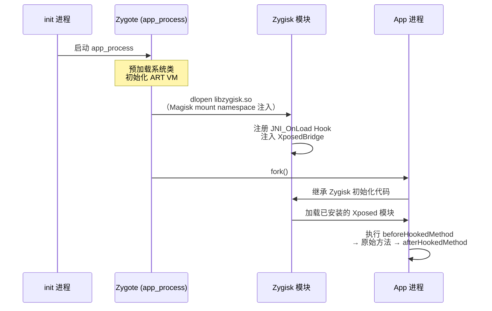

# 13 · Android Hook（Xposed/LSPosed/ART）

> [!abstract] TL;DR
> Android Hook 的核心是在 Zygote 进程孵化 App 时注入自定义代码，通过替换 ArtMethod 结构中的入口点指针来拦截任意 Java 方法调用。Xposed 框架（历史）直接替换 `app_process` 二进制，LSPosed 则基于 Zygisk/Magisk 以 systemless 方式实现同等效果。AArch64 原生层 inline hook 需处理定长 4 字节指令、PC 相对寻址与 trampoline 空间等约束。本章兼顾防御视角，分析反 Hook 检测手段。

## 概述与定位

Android Hook 指在不修改目标 APK 源码的前提下，拦截并修改 Java/Kotlin 方法（或 Native 函数）行为的技术。其应用场景横跨两端：攻击侧用于逆向、破解、作弊；防御侧（安全研究、测试框架、运行时监控）同样需要这类能力。理解 Android Hook 的前提是掌握以下几个层次的知识体系：

1. **Zygote 进程模型**：Android 中所有 App 进程都由 Zygote（第一个 Java 进程）fork 而来，在 fork 前注入的代码会自动出现在每个子进程中，这是框架级 Hook 的基础；
2. **ART 运行时**：Android 5.0 后彻底取代 Dalvik，使用 AOT/JIT 混合编译，方法分发通过 `ArtMethod` 结构实现；
3. **AArch64 指令特性**：移动端主流 64 位 ISA，指令定长 4 字节，与 x86 变长指令的 inline hook 思路有本质差异。

---

## 原理与机制

### Zygote 与 app_process

Android 启动时，`init` 进程启动 `app_process`（位于 `/system/bin/app_process`），后者创建 Dalvik/ART 虚拟机实例并执行 `ZygoteInit.main()`，进入监听 socket 的 Zygote 循环。每次启动一个新 App，`ActivityManagerService` 通过 `LocalSocket` 向 Zygote 发送 fork 请求，Zygote 调用 `fork()` 产生子进程，子进程完成类加载后执行 App 主 Activity。

**早期 Xposed 的注入策略**（Android 2.3—4.x，Dalvik 时代）：直接将系统目录下的 `app_process` 二进制替换为修改版，修改版在虚拟机启动后、Zygote 主循环前调用 `XposedBridge` 的初始化函数，将 Hook 逻辑注入每个子进程。

**ART 时代的演进**：ART 改变了方法编译和分发方式，`XposedBridge` 需要配合 `libxposed_art.so` 重写针对 `ArtMethod` 的操作。rovo89（Xposed 作者）在 Android 5-8 维护了这一兼容层，但随 AOSP 版本碎片化问题加剧，维护成本极高，官方 Xposed 在 Android 9 后实质停止更新。

### Dalvik vs ART 方法分发差异

Dalvik 使用解释执行为主（部分 JIT），方法描述符 `Method` 结构中的 `nativeFunc`/`insns` 指针相对简单，替换容易。ART 引入复杂的方法分发层次：

```
Java 代码 → dex 字节码 → ART 编译（AOT dex2oat / JIT oat）
                                    ↓
                              ArtMethod 结构
                              ├─ entry_point_from_interpreter_  （解释器入口）
                              ├─ entry_point_from_quick_compiled_code_  （快速编译代码入口）
                              └─ entry_point_from_jni_  （JNI 入口）
```

调用一个 Java 方法时，ART 根据方法的编译状态选择最优入口：已 AOT 编译的走 `entry_point_from_quick_compiled_code_`，未编译的走解释器，Native 方法走 JNI 入口。因此替换一个入口点并不能完全保证所有调用路径都被拦截，完整的方法替换需要同时处理多个入口。

### ArtMethod 结构与 Method Hook 原理

`ArtMethod` 是 ART 运行时对每个 Java 方法的内部表示，其关键字段（以 Android 8.1 AOSP 为参考，不同版本偏移有变化）：

```
ArtMethod {
    uint32_t declaring_class_  // 声明该方法的 Class 对象引用
    uint32_t access_flags_     // 访问标志（含 kAccNative、kAccFastNative 等）
    uint32_t dex_method_index_ // dex 方法索引
    uint16_t method_index_     // vtable/itable 索引
    uint16_t hotness_count_    // JIT 热度计数
    // ...（填充字段）
    uint64_t entry_point_from_jni_
    uint64_t entry_point_from_quick_compiled_code_
    // （32 位系统各字段宽度减半）
}
```

YAHFA（Yet Another Hook Framework for ART）等框架的核心思路是**整体替换 ArtMethod**：将 Hook 方法（一个 Java 静态方法）的 `ArtMethod` 内容整体拷贝覆盖目标方法的 `ArtMethod`，同时保留一份"backup"方法供调用原始逻辑。这一方案的优势在于无需关心具体字段偏移，只要 `sizeof(ArtMethod)` 正确即可；劣势是随 AOSP 版本 `ArtMethod` 大小变化而需要适配。

另一种方案（如 SandHook）是仅替换 `entry_point_from_quick_compiled_code_` 指针，同时将 `access_flags_` 中的 `kAccCompileDontBother` 位置位，阻止 ART 对目标方法进行 JIT 重编译（否则会绕过 hook）。

### Zygote 注入时序（LSPosed/Zygisk）



Zygisk 是 Magisk 内置的 Zygote 注入框架（取代早期 Riru），通过在 Zygote 启动早期 `dlopen` 一个 Magisk 管理的共享库来完成注入，全程无需修改 `/system` 分区（systemless）。LSPosed 以 Zygisk 模块形式运行，在每个 App 进程初始化期间加载对应的 Xposed 模块 `.apk` 并调用其 `IXposedHookLoadPackage` 回调。

---

## 结构与算法深度详解

### Xposed API 三件套

Xposed 框架对用户（模块开发者）暴露的核心 API 极简洁：

```java
// 在模块的 handleLoadPackage 中：
XposedHelpers.findAndHookMethod(
    "com.example.TargetApp.SomeClass",  // 目标类名
    lpparam.classLoader,                 // 目标 App 的 ClassLoader
    "targetMethod",                      // 目标方法名
    String.class, int.class,             // 参数类型表（用于方法重载区分）
    new XC_MethodHook() {
        @Override
        protected void beforeHookedMethod(MethodHookParam param) {
            // 在原始方法执行前调用
            // param.args 可读写参数
            // param.setResult(xxx) 可短路原始方法
        }
        @Override
        protected void afterHookedMethod(MethodHookParam param) {
            // 在原始方法执行后调用
            // param.getResult() / param.setResult() 可修改返回值
        }
    }
);
```

底层实现中，`findAndHookMethod` 通过反射获取 `Method` 对象，再调用 `XposedBridge.hookMethod`，最终由本地层（`libxposed_art.so`）修改对应 `ArtMethod` 的入口点，并将 Hook 记录注册到 `XposedBridge` 的全局回调表中。调用原始方法时，`XC_MethodHook.callSuper()` 通过 backup ArtMethod 的入口点直接调用原始 compiled code，绕过 Hook 逻辑。

### AArch64 Inline Hook 约束与 Trampoline

在 Android 原生层（.so 中的 C/C++ 函数），x86 上惯用的 5 字节 `jmp rel32` 方案**不适用于 AArch64**，因为：

1. **指令定长 4 字节**：不存在 1-4 字节的短跳转前缀，任何 patch 必须是 4 字节对齐的完整指令；
2. **PC 相对寻址**：`ADR`、`ADRP`、`LDR(literal)` 等指令的立即数偏移范围有限（`ADRP` 最大 ±4GB 页对齐寻址，`ADR` 仅 ±1MB），直接修改后寻址范围可能越界；
3. **Trampoline 空间**：Hook 桩（蹦床函数）需分配在原始函数的 `±128MB`（`B`/`BL` 的寻址范围）或任意位置（通过 `LDR x16, [PC+8]; BR x16` 方案实现绝对跳转，占 12 字节即 3 条指令）。

AArch64 绝对跳转 trampoline（12 字节版本）：

```asm
; 在目标函数头部写入：
LDR  x16, #8        ; 从 PC+8 处加载 64 位绝对地址
BR   x16            ; 跳转
.quad hook_func_addr ; Hook 函数绝对地址（8 字节）
```

被覆盖的原始 3 条指令需要保存到 backup trampoline 中，并在其后追加一条跳转回目标函数第 4 条指令的跳转指令，构成调用原始函数的通道。若被覆盖的指令中含有 PC 相对指令（如 `ADRP`），还需要**指令修复（instruction fixing）**，将相对偏移重新计算为在 trampoline 位置的正确偏移——这是 AArch64 inline hook 中最复杂的部分。

### 主流 Android Hook 引擎对比

| 引擎 | 方案 | ArtMethod 层 | Native Inline | 维护状态 | 特点 |
|---|---|---|---|---|---|
| YAHFA | ArtMethod 整体替换 | 是 | 否 | 仍维护 | 轻量、兼容性好 |
| SandHook | entry_point 替换 + inline | 是 | 部分 | 仍维护 | 支持 Java + 部分 Native |
| Epic | entry_point 替换 | 是 | 否 | 停止维护 | 曾广泛用于国内 App 热修复 |
| Whale | 多平台 inline hook | 否 | 是 | 仍维护 | 跨平台（Android/iOS/Linux/Windows） |
| Dobby | 多平台 inline hook | 否 | 是 | 活跃 | 指令修复完善，AArch64 支持好 |
| Frida (Interceptor) | ArtMethod + inline | 是 | 是 | 活跃 | 动态注入，支持 JS 脚本 |

Frida 在 Android 上通过 `frida-inject`（或 Magisk 模块 `frida-server`）注入 `frida-agent.so`，提供 `Java.use("com.example.Class").method.implementation = function() {...}` 的 Java API，底层也是 ArtMethod 替换，同时提供 `Interceptor.attach` 实现 C/C++ 层 inline hook。

### Xposed 模块加载与作用域

LSPosed 支持细粒度的模块作用域控制（Scope）：用户可以为每个 Xposed 模块指定它能注入的 App 包名白名单，而非如早期 Xposed 那样注入所有进程。实现上，LSPosed 在 Zygote fork 后、App 初始化前检查当前包名是否在模块的作用域内，决定是否加载该模块的代码。这一机制减少了不必要的模块注入，降低了性能开销和稳定性风险。

---

## 工具视角与实战

### 环境搭建要点

实际使用 LSPosed 进行 Android Hook 研究需要：

1. **Root 权限**：通过 Magisk（推荐 Kitsune Mask/Delta 等衍生版）刷入；
2. **安装 Zygisk + LSPosed 模块**：从 LSPosed 仓库下载对应 ABI 的 zip，通过 Magisk 刷入；
3. **目标设备**：Google Pixel 系列或 AVD（Android Virtual Device，使用 AOSP system-ext 镜像，非 Google Play 镜像）；
4. **关闭 SafetyNet/Play Integrity**（若需测试金融 App）：需配合 MagiskHide / Shamiko 等模块。

### Frida on Android 工作流

```bash
# 在设备上启动 frida-server（需 root）
adb shell "/data/local/tmp/frida-server &"

# 列出进程
frida-ps -U

# 注入脚本
frida -U -f com.example.target -l hook.js --no-pause
```

```javascript
// hook.js 示例：拦截 Java 方法
Java.perform(function() {
    var SomeClass = Java.use("com.example.TargetApp.SomeClass");
    SomeClass.targetMethod.overload("java.lang.String", "int")
        .implementation = function(arg1, arg2) {
            console.log("[*] targetMethod called: " + arg1 + ", " + arg2);
            var result = this.targetMethod(arg1, arg2);  // 调用原始方法
            console.log("[*] result: " + result);
            return result;
        };
});
```

---

## 安全性与正确使用

> [!caution]
> 本章涉及的 Xposed/LSPosed Hook 技术需要设备拥有 Root 权限，实施前必须确认以下条件：1）目标设备是自有设备或测试机；2）测试的 App 是自己开发的，或持有对方的明确书面授权（如漏洞赏金计划范围内）；3）不将 Hook 结果用于修改他人 App 的行为（如游戏作弊、支付绕过）并传播。对他人 App 未经授权的 Hook 及利用，可能违反《网络安全法》等相关法规。CTF 题目中的 Android 逆向分析属于合法实验场景，不受此限制。

### 合规使用场景

- **App 自动化测试**：通过 Hook 拦截关键业务逻辑，无需源码即可插桩测试；
- **移动安全研究**：分析恶意软件行为（在隔离测试机上），提取加解密密钥用于研究报告；
- **CTF / 逆向练习**：分析 APK 的加固/混淆策略，理解 Anti-debug/Anti-tamper 保护机制；
- **开发调试**：通过 Xposed 模块快速验证 App 行为变更，无需重新编译 APK。

### 反 Hook 检测机制（防御视角）

了解 Hook 检测原理是防御侧研究者的必备知识，以下按检测层次列举：

**1. 检测 Xposed 特征类**

```java
// 检测 Xposed Bridge 是否存在
try {
    Class.forName("de.robv.android.xposed.XposedBridge");
    // 发现 Xposed 特征，触发防护
} catch (ClassNotFoundException ignored) {}
```

更隐蔽的检测方式是调用 `ClassLoader.getSystemClassLoader().loadClass()` 并捕获异常，或扫描 dex 中是否存在 Xposed 相关符号。

**2. /proc/self/maps 检测可疑 .so**

```java
try (BufferedReader reader = new BufferedReader(new FileReader("/proc/self/maps"))) {
    String line;
    while ((line = reader.readLine()) != null) {
        // 检测 frida-agent.so、xposed、substrate 等可疑路径
        if (line.contains("frida") || line.contains("xposed") || line.contains("substrate")) {
            // 检测到注入
        }
    }
}
```

**3. 检测方法的 access_flags 异常**

方法被 Xposed Hook 后，其 `access_flags` 中会被置入 `kAccNative` 标志（因为 Hook 桩以 JNI 方法形式注册）。通过反射获取方法的 `modifiers` 并检查 `Modifier.isNative()` 是否为原本不应是 Native 的方法，可检测 Hook：

```java
Method m = SomeClass.class.getDeclaredMethod("normalMethod", String.class);
if (Modifier.isNative(m.getModifiers())) {
    // 该方法不应为 native，疑似被 Hook
}
```

**4. ClassLoader 校验**

检查系统 ClassLoader 的父链中是否存在不可信的 ClassLoader（Xposed 模块的 ClassLoader），以及当前进程加载的类中是否有来自 `/data/user/0/de.robv.android.xposed.installer/` 等路径的类。

**5. 加固对抗思路（防御产品视角）**

- 将关键逻辑下沉到 Native 层（JNI），并在 Native 层增加 AArch64 指令完整性校验（计算关键函数头部字节的 CRC，运行时比对）；
- 使用 DEX VMP（虚拟机保护）将关键方法编译为私有字节码，ART 无法直接分发，Xposed 的入口点替换也无效；
- 周期性调用 `dladdr()` 检测关键函数地址是否仍指向预期模块（检测 inline hook 重定向）。

---

## 小结

Android Hook 的技术核心从 Dalvik 时代的直接替换字节码，演进到 ART 时代对 `ArtMethod` 结构的精准操控。Xposed 框架通过 Zygote 注入实现了全局透明的 Java 方法拦截，LSPosed 将这一能力与 Magisk 的 systemless 方案结合，在无需修改系统分区的前提下提供同等功能。AArch64 平台的 Native inline hook 受制于定长指令和 PC 相对寻址，需要精细的 trampoline 设计和指令修复逻辑。无论是 Xposed/LSPosed 还是 Frida，其底层机制都指向同一个核心：拿到 `ArtMethod` 的内存地址并修改其入口点。理解这一原理是构建有效反 Hook 检测系统的基础。

---

## 相关阅读

- [[00.总览]]
- [[32.hooks/12-kernel-hook.md]]
- [[32.hooks/14-ios-hook.md]]
- [[32.hooks/09-frida.md]]
- [[32.hooks/11-process-injection.md]]
- [[36.Objective-C与iOS运行时/08.Method Swizzling.md]]

---

[[00.总览|⬆ 系列总览]] | [[12-kernel-hook|← 上一章]] | [[14-ios-hook|→ 下一章]]
