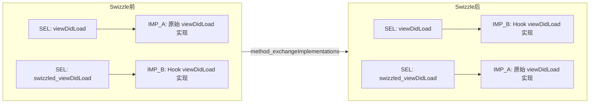
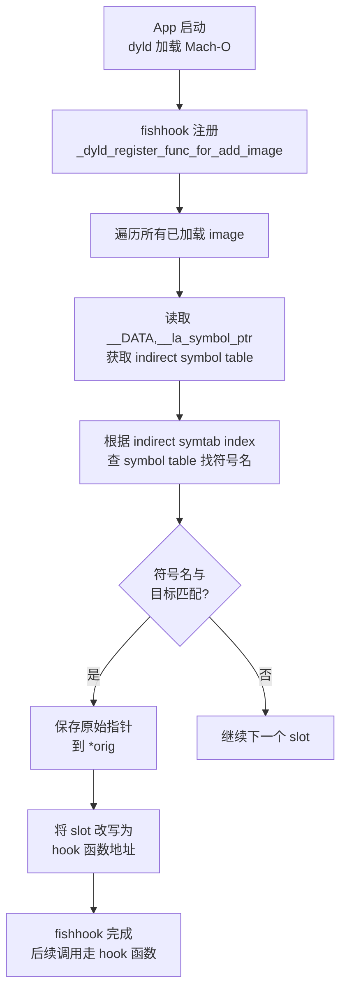

# 14 · iOS Hook（Substrate/Swizzling/PAC）

> [!abstract] TL;DR
> iOS Hook 技术围绕三条技术路线展开：MobileSubstrate（`MSHookFunction` 针对 C/C++ 函数的 inline hook，`MSHookMessageEx` 针对 Objective-C 方法）、纯 ObjC 的 Method Swizzling（运行时交换 IMP 指针）、fishhook（重写 Mach-O `__la_symbol_ptr`/`__got` 中的符号绑定）。arm64e 引入的 PAC（Pointer Authentication）通过为函数指针和返回地址签名，使未经认证的 inline hook 跳转在运行时崩溃，这是目前 iOS Hook 的最大硬件障碍。本章为防御与研究视角。

## 概述与定位

iOS 的安全模型比 Android 更封闭：沙箱隔离、代码签名强制、SIP（System Integrity Protection）以及 arm64e 上的 PAC，共同构成了多层防护体系。在非越狱设备上，动态注入第三方代码的能力被极度限制；在越狱设备（Rootful/Rootless/TrollStore 场景）上，限制有所松动但程度因越狱方案而异。

理解 iOS Hook 需要掌握：

1. **Mach-O 二进制格式**：iOS App 的可执行文件与动态库均为 Mach-O 格式，`__TEXT`/`__DATA` 段布局决定了 fishhook 等工具的操作位置；
2. **dyld 动态链接器**：符号的惰性绑定（Lazy Binding）与非惰性绑定（Non-lazy Binding）机制，是 fishhook 的技术基础；
3. **Objective-C 运行时**：消息发送机制（`objc_msgSend`）、方法列表（`method_list_t`）与 `IMP` 指针，是 Method Swizzling 的操作对象；
4. **PAC（Pointer Authentication Codes）**：arm64e 的硬件安全特性，对函数指针和返回地址进行加密签名，阻止未经授权的指针替换。

---

## 原理与机制

### MobileSubstrate（Cydia Substrate）历史

MobileSubstrate 由 Jay Freeman（saurik）开发，是 iOS 越狱生态最重要的基础设施之一，提供两类核心 Hook API：

**MSHookFunction**（Native C/C++ 函数 inline hook）：

```c
void MSHookFunction(void *symbol,
                    void *hook,
                    void **old);
```

在目标函数 `symbol` 入口写入跳转到 `hook` 的 patch，同时通过 `old` 输出一个 trampoline，调用者可通过 trampoline 调用原函数。底层实现为 ARM/AArch64 inline hook，与 Dobby 等引擎原理相同。

**MSHookMessageEx**（Objective-C 方法 Hook）：

```objc
void MSHookMessageEx(Class _class,
                     SEL message,
                     IMP hook,
                     IMP *old);
```

本质上是对 `class_replaceMethod` 的封装，将指定类的指定 SEL 对应的 IMP 替换为 `hook`，并通过 `old` 输出原始 IMP 供调用链向前传递。

MobileSubstrate 通过 `MobileLoader` 组件在 App 启动时（`dyld` 加载主二进制之前）扫描 `/Library/MobileSubstrate/DynamicLibraries/` 目录，将符合 plist 过滤条件的 `.dylib` 通过 `DYLD_INSERT_LIBRARIES` 机制注入目标进程。

**ellekit** 是 MobileSubstrate 的现代替代品（2022 年起由 opa334 维护），兼容 Substrate API，同时支持 rootless 越狱（`/var/jb` 路径体系），并对 arm64e/PAC 有更好的适配。

### fishhook：Mach-O 符号重绑定

fishhook 由 Facebook 开源（2013 年，现由社区维护），通过重写 Mach-O 的动态符号绑定表来 Hook C 系统函数（如 `open`、`close`、`malloc`）。它不触碰函数代码本身，而是修改 dyld 维护的指针表。

#### dyld 符号绑定机制

Mach-O `__DATA` 段包含两张关键指针表：

- `__la_symbol_ptr`（Lazy Symbol Pointers）：惰性绑定，首次调用时由 dyld stub binder 解析；
- `__got`（Global Offset Table，非惰性绑定）：在 `dyld` 加载镜像时立即解析；
- `__auth_got` / `__auth_stubs`（arm64e）：PAC 签名版本的指针表，指针被 `PACIA`/`PACIZA` 签名。

当 App 调用 `open()` 时，编译器生成的 stub 代码实际跳转到 `__la_symbol_ptr` 中对应 slot 的值。首次调用前该 slot 填充的是 binder stub 地址，binder 解析后将真实 `open` 地址写入该 slot。fishhook 的操作就是：**定位该 slot 并将其改写为 Hook 函数地址**。

#### fishhook 核心逻辑（简化伪代码）

```c
// 遍历所有加载的 image（通过 _dyld_register_func_for_add_image）
// 对每个 image：
//   1. 找到 __DATA,__la_symbol_ptr section
//   2. 通过 indirect_symtab 找到每个 slot 对应的符号名
//   3. 与目标符号名匹配
//   4. 将匹配 slot 改写为 hook 函数地址
//   5. 输出原始地址（原 dyld 已解析的真实函数地址）

struct rebinding rebindings[] = {
    {"open", my_open, (void *)&orig_open},
    {"close", my_close, (void *)&orig_close},
};
rebind_symbols(rebindings, 2);
```

fishhook 的限制：只能 Hook **通过 dyld 动态绑定的符号**，无法 Hook 静态链接进可执行文件的函数（`__text` 段中已编译的内联调用）、非导出的私有函数，以及 arm64e 上 PAC 签名的 `__auth_got` 指针（改写后签名不匹配，调用时崩溃）。

### Objective-C Method Swizzling

Method Swizzling 是 iOS/macOS 开发中最常见的合法 Hook 手段，原理是通过 ObjC 运行时 API 交换两个方法的 `IMP`（Implementation Pointer）：

```objc
// 典型的 Swizzling 实现：
+ (void)load {
    static dispatch_once_t onceToken;
    dispatch_once(&onceToken, ^{
        Class class = [self class];
        SEL originalSelector = @selector(viewDidLoad);
        SEL swizzledSelector = @selector(swizzled_viewDidLoad);

        Method originalMethod = class_getInstanceMethod(class, originalSelector);
        Method swizzledMethod = class_getInstanceMethod(class, swizzledSelector);

        // 先尝试添加方法（防止父类中有该方法但子类未覆写的情况）
        BOOL didAdd = class_addMethod(class,
                                      originalSelector,
                                      method_getImplementation(swizzledMethod),
                                      method_getTypeEncoding(swizzledMethod));
        if (didAdd) {
            class_replaceMethod(class,
                                swizzledSelector,
                                method_getImplementation(originalMethod),
                                method_getTypeEncoding(originalMethod));
        } else {
            method_exchangeImplementations(originalMethod, swizzledMethod);
        }
    });
}
```

#### Swizzling 的正确姿势与常见陷阱

**陷阱一**：直接 `method_exchangeImplementations` 而不先 `class_addMethod`。若被 Swizzle 的 SEL 在当前类的方法列表中不存在（继承自父类），`exchangeImplementations` 会修改父类的方法，影响所有子类实例。

**陷阱二**：在 `swizzled_viewDidLoad` 中调用 `[self swizzled_viewDidLoad]` 时，若 Swizzle 已完成，此调用实际执行原始 `viewDidLoad`（因为两个 SEL 的 IMP 已互换），这是正确的；但若遗忘调用会导致原始逻辑丢失。

**陷阱三**：多个框架/模块各自 Swizzle 同一方法，顺序依赖导致调用链断裂（某个环节没有调用原始方法）。正确做法是始终调用当前 SEL 对应的方法（即互换后的方法名），形成链式传递。

#### Swizzling 前后 IMP 指向示意



调用 `[vc viewDidLoad]` 触发 `objc_msgSend`，查找 `viewDidLoad` 的 IMP，Swizzle 后找到的是 `IMP_B`（Hook 实现），Hook 实现中再调用 `[self swizzled_viewDidLoad]`，此时找到的是 `IMP_A`（原始实现），形成完整的调用链。

---

## 结构与算法深度详解

### fishhook 符号重绑定完整流程



需要注意 `vm_protect` 调用：`__DATA` 段通常是可读写的（与 `__TEXT` 的只读不同），fishhook 直接赋值即可；但在某些系统库中，`__got` 所在页可能被设为只读，需要先 `mprotect` 提权再写入。

### ArtMethod 与 ArtMethod 替换的 iOS 对等物

iOS 没有类似 ART 的 `ArtMethod` 统一结构，但 ObjC 运行时的 `method_t` 结构担当了类似角色：

```c
// objc-runtime-new.h（简化）
struct method_t {
    SEL name;       // 方法选择子（符号字符串指针）
    const char *types; // 类型编码字符串
    IMP imp;        // 指向实现函数的指针
};
```

`method_exchangeImplementations` 实质上就是交换两个 `method_t` 的 `imp` 字段，与 Android 的 `ArtMethod.entry_point_from_quick_compiled_code_` 替换逻辑一一对应。

Swift 方法默认采用静态分发（无运行时 dispatch），无法通过 ObjC 运行时 Swizzle；若 Swift 方法标注 `@objc dynamic`，则会注册到 ObjC 运行时，可被 Swizzle。这是 Swift 时代 Method Swizzling 的重要边界条件。

### PAC（Pointer Authentication Codes）对 inline hook 的阻断

arm64e（Apple A12 及更新的 SoC）引入 PAC 作为硬件安全特性，利用 ARMv8.3-A 的指令扩展，在 64 位指针的高位（通常 11 位，取决于 VA 空间配置）嵌入加密签名：

```
ptr 64bit =
  [63..53] PAC 签名（11 bit）
  [52..0]  实际虚拟地址（53 bit VA，足以覆盖当前 iOS 地址空间）
```

签名过程使用系统密钥（`IA`/`IB`/`DA`/`DB`）和一个上下文修饰符（Context modifier，通常是 PC 或栈指针等）通过 `QARMA` 算法计算。

关键指令：

| 指令 | 功能 |
|---|---|
| `PACIA Xn, Xm` | 用密钥 IA 和修饰符 Xm 对 Xn 中的地址签名，结果存入 Xn |
| `AUTIA Xn, Xm` | 用密钥 IA 和修饰符 Xm 验证 Xn 中的签名，若不匹配触发 trap |
| `BLRAA Xn, Xm` | 跳转并调用 Xn 中的地址（含认证验证）|
| `RETAA` | 弹出返回地址并验证签名后返回 |
| `PACIZA Xn` | 用 IA 密钥和修饰符 0 对 Xn 签名（修饰符为零值） |

**对 inline hook 的影响**：在 arm64e 可执行文件中，函数调用通过 `BLRAA`/`BLRAB` 完成，目标地址在调用前必须通过 `AUTIA`/`AUTIB` 验证。若 inline hook 将函数入口指令修改为 `LDR X16, ...; BR X16`，而 `X16` 中的地址未被合法签名，`BR X16` 可能触发 `PAUTH` trap（行为取决于具体实现，某些情况下会跳转到一个无效地址导致崩溃）。

更具体地说：

- **返回地址**：arm64e 上的 `RETAA` 指令在返回时验证栈上的返回地址签名。inline hook 的 trampoline 保存/恢复返回地址后必须重新签名，否则 `RETAA` 在返回时崩溃；
- **函数指针**：存储在 `__DATA` 中的函数指针（`__auth_got`）被 `PACIZA` 签名，fishhook 改写该指针后签名无效，调用时 `AUTIA` 验证失败。

**绕过思路（仅概述原理）**：

1. 若目标函数不在 arm64e 的 `__TEXT` 段（例如通过 `dlopen` 加载的非 arm64e 编译的 .dylib），PAC 不适用，inline hook 仍可行；
2. 通过 JIT 内存（`MAP_JIT`）分配可执行内存并写入合法签名的 trampoline（需要 `com.apple.security.cs.allow-jit` entitlement）；
3. 利用特定内核漏洞在内核层面获取签名密钥（高级越狱研究范畴，不讨论具体细节）。

**现实约束**：在完全越狱的 iOS 设备（如 palera1n/unc0ver 支持的版本）上，ellekit 等现代工具会检测目标 binary 是否为 arm64e，并相应调整 hook 策略；对 arm64e 系统 dylib 的 hook 仍受 PAC 保护，ellekit 通过复杂的签名协作机制处理部分场景。

### 越狱 vs 无越狱 Hook 可行性

| 场景 | Hook 可用技术 | 限制 |
|---|---|---|
| 完整越狱（Rootful，如 unc0ver） | MobileSubstrate / ellekit / Frida | 最完整，但 iOS 版本受限 |
| Rootless 越狱（如 palera1n） | ellekit（`/var/jb` 路径） | 部分系统保护仍存在 |
| TrollStore（无越狱，利用 CoreTrust 漏洞） | dylib 注入（有限），无完整 Substrate | 只能注入 TrollStore 安装的 App |
| 无越狱（App Store） | Method Swizzling（自身代码）/fishhook（自身进程） | 只能在自己 App 进程内使用 |
| 无越狱 + Frida gadget | 将 frida-gadget.dylib 嵌入重签名 IPA | 需要开发者证书，不可分发 |

### Dobby 在 iOS 上的工作方式

Dobby 是跨平台 inline hook 引擎，对 AArch64 有完整的指令修复支持。在 iOS 上使用时：

1. 通过 `mmap` 或 `vm_allocate` 在目标函数附近分配 trampoline 内存（需可写可执行，iOS 上需 `pthread_jit_write_protect_np` 或 entitlement 支持）；
2. 扫描目标函数头部，解码并修复 PC 相对指令（`ADR`/`ADRP`/`LDR literal`/`B`/`BL`），确保 trampoline 中的这些指令以正确偏移执行；
3. 写入跳转 patch（`LDR X17, [PC+8]; BR X17`，12 字节），覆盖目标函数前 3 条指令；
4. 对于 arm64e，需要额外处理签名（Dobby 4.x 有部分 PAC 适配，但完整支持尚在演进中）。

---

## 工具视角与实战

### Theos 与 iOS tweak 开发

Theos 是专为 iOS 越狱 tweak 开发设计的构建系统，提供 Logos 预处理器简化 Hook 代码编写：

```logos
// Logos 语法（Theos tweak .xm 文件）
%hook UIViewController

- (void)viewDidLoad {
    %orig;  // 调用原始方法
    NSLog(@"[MyTweak] viewDidLoad called on: %@", self);
}

%end
```

Logos 的 `%hook`/`%orig`/`%end` 会被 Theos 预处理为标准的 MSHookMessageEx 调用，生成对应 `.m` 文件后再用 Clang 编译为 `.dylib`，打包为 Cydia/Sileo 可安装的 `.deb`。

详细开发流程参见 [[36.Objective-C与iOS运行时/19.Theos与Frida_iOS插件开发.md]]。

### Frida on iOS

```bash
# 需要在越狱设备上安装 frida-server（通过 Cydia/Sileo）
# 或使用 frida-gadget 嵌入 App

# 枚举 App 进程
frida-ps -U

# Attach 并执行脚本
frida -U -n "TargetApp" -l ios_hook.js
```

```javascript
// ObjC 方法 Hook
ObjC.classes.UIViewController['- viewDidLoad'].implementation = function() {
    this['- viewDidLoad']();  // 调用原始实现
    console.log("[*] viewDidLoad:", this);
};

// C 函数 Hook（使用 Interceptor）
const openPtr = Module.getExportByName(null, "open");
Interceptor.attach(openPtr, {
    onEnter(args) {
        console.log("[*] open:", args[0].readUtf8String());
    }
});
```

### cynject（无 Substrate 的进程注入）

cynject 通过 `task_for_pid` + Mach 消息机制向目标进程注入 dylib，是 Frida 在越狱 iOS 上的底层注入方案之一。`task_for_pid` 需要 `platform-application` entitlement 或内核 patch，在不同越狱环境下可用性不同。

---

## 安全性与正确使用

> [!caution]
> iOS Hook 技术（特别是通过越狱、dylib 注入或 frida-gadget 重签名）必须严格限制于以下合规场景：1）自有越狱测试设备上对自己开发的 App 进行调试；2）苹果官方认可的 App 测试框架（XCTest）范围内的方法插桩；3）有书面授权的移动安全渗透测试项目；4）CTF 比赛题目分析。对他人 App 进行 Hook 并绕过付费/验证逻辑、提取用户数据、修改游戏数值等行为，违反《网络安全法》、App Store 服务条款以及相关知识产权法规，可能承担民事及刑事责任。Method Swizzling 在自己 App 内部使用（用于 AOP 日志、测试桩）属于正常开发实践，不在此限制范围内。

### 防御与检测视角

**检测 MobileSubstrate/ellekit 注入**：

```objc
// 检测 /Library/MobileSubstrate 路径特征
NSFileManager *fm = [NSFileManager defaultManager];
if ([fm fileExistsAtPath:@"/Library/MobileSubstrate/MobileSubstrate.dylib"]) {
    // 设备很可能越狱
}

// 检测已加载的动态库
uint32_t count = _dyld_image_count();
for (uint32_t i = 0; i < count; i++) {
    const char *name = _dyld_get_image_name(i);
    if (strstr(name, "MobileSubstrate") || strstr(name, "ellekit") ||
        strstr(name, "TweakInject") || strstr(name, "frida")) {
        // 检测到可疑注入
    }
}
```

**检测 Method Swizzling**：

```objc
// 检测关键方法的 IMP 是否仍在预期模块中
Method m = class_getInstanceMethod([UIDevice class],
                                    @selector(systemVersion));
IMP imp = method_getImplementation(m);
Dl_info info;
dladdr((void *)imp, &info);
// info.dli_fname 应为 UIKit 或 CoreFoundation 路径
// 若为 /var/jb/... 或 /Library/MobileSubstrate/...，则被 Hook
if (strstr(info.dli_fname, "MobileSubstrate") != NULL) {
    // systemVersion 被 Hook
}
```

**Anti-fishhook 策略**：对于关键 C 函数（如 `fork`、`ptrace`、`sysctl`），可在应用启动时将函数指针存入局部变量（直接引用 `__TEXT` 段内编译进来的地址，而非通过 `__la_symbol_ptr` 的间接调用），后续使用局部变量调用，绕过 fishhook 对 `__DATA` 段指针的修改。

**PAC 的防御价值**：arm64e 设备上的系统进程（launchd、backboardd 等）完整启用 PAC，即使越狱工具也难以对这些进程的 arm64e 编译代码进行无限制 Hook，这大幅提升了系统级保护。

---

## 小结

iOS Hook 生态以三条技术路线为主干：MobileSubstrate 提供了历经十余年的成熟 inline hook 与 ObjC 方法 Hook 基础设施；Objective-C Method Swizzling 作为合法 AOP 工具，通过运行时 IMP 指针交换在自有 App 内广泛使用；fishhook 以 dyld 符号绑定表为切入点，为 C 库函数的 Hook 提供了简洁的实现路径。arm64e 引入的 PAC 是目前最有力的硬件级 Hook 阻断机制，通过为函数指针和返回地址嵌入密码学签名，使未经授权的跳转在运行时崩溃。越狱生态的变化（Rootful→Rootless→TrollStore）持续影响 Hook 的可行范围，理解每种方案的能力边界是 iOS 安全研究的必备基础知识。

---

## 相关阅读

- [[00.总览]]
- [[32.hooks/13-android-hook.md]]
- [[32.hooks/09-frida.md]]
- [[36.Objective-C与iOS运行时/08.Method Swizzling.md]]
- [[36.Objective-C与iOS运行时/17.arm64e_PAC指针认证专题.md]]
- [[36.Objective-C与iOS运行时/19.Theos与Frida_iOS插件开发.md]]
- [[32.hooks/02-windows-api-hook.md]]

---

[[00.总览|⬆ 系列总览]] | [[13-android-hook|← 上一章]] | [[15-etw|→ 下一章]]
