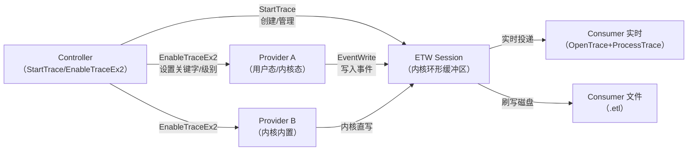

# 15 · ETW 事件追踪（Windows）

> [!abstract] TL;DR
> ETW（Event Tracing for Windows）是 Windows 内核原生的高性能结构化事件总线，支持用户态与内核态同时产生事件，数据通过内核管理的环形缓冲区流向实时消费者或写入 `.etl` 文件。
> 架构分四个角色：Provider（发布事件）/Session（缓冲与路由）/Controller（启停控制）/Consumer（消费读取）。
> 现代 EDR 大量依赖 ETW-TI（Threat Intelligence provider）获取进程注入、远程内存写入等高权限操作的遥测，是 Windows 安全生态的核心观测点。
> 攻击者常通过 patch `ntdll!EtwEventWrite` 首字节来致盲 ETW，防御方则用内核完整性校验和旁路遥测反制。

## 概述与定位

ETW 最早在 Windows 2000 中以粗糙形式出现，在 Windows Vista/2008 中获得大幅重构并成为系统核心基础设施，延续至今的 Windows 11/Server 2025 中几乎每个系统组件都是 ETW Provider。它的设计目标是"零开销等待"——当没有 Consumer 订阅时，Provider 的 `EventWrite` 调用会在内核快速路径中被跳过，对应用程序性能影响接近于零。

ETW 在整个 Windows 可观测性生态中处于什么位置？可以这样来定位：

- **性能监控**：Windows Performance Recorder（WPR）/Windows Performance Analyzer（WPA）、xperf 都以 ETW 为底层数据源，CPU 采样、调度延迟、磁盘 I/O、内存分配都来自 ETW 内核 Provider。
- **安全监控**：微软 Defender ATP、众多第三方 EDR 将 ETW-TI（Threat Intelligence）provider 作为进程注入、代码注入的一级遥测源。
- **APM 与诊断**：.NET CLR、ASP.NET、SQL Server、IIS 均内置 ETW Provider，Azure Monitor Agent 通过 ETW 采集应用诊断数据。
- **逆向与调试辅助**：在没有调试器的生产环境，通过 ETW 可以在极低开销下采集函数级别的调用路径（WPP Tracing）。

与 Linux 同类机制相比：ETW 最接近 Linux 的 tracepoint + perf event + LTTng 的组合，但 ETW 是内核原生 API 统一管理，而 Linux 侧分散在多个子系统。

### ETW 与 Hook 技术的交集

本系列前几篇讨论的 hook 技术（inline patch、IAT hook、内核 SSDT hook）均是"主动插入观测点"，而 ETW 是"被动消费已有观测点"。但两者的交集在于：

1. ETW 本身可以被 hook 来致盲（见第五节），这是攻防对抗的关键战场。
2. 在逆向分析中，消费 ETW 事件可以替代某些 hook——例如通过订阅 `Microsoft-Windows-Kernel-Process` 无需任何 hook 就能监控进程创建/销毁。
3. 对 ETW Provider 注册逻辑的逆向分析，可以帮助理解目标程序的内部状态机（因为 Provider 通常会在关键状态转换时发出事件）。

## 原理与机制

### 四角色架构

ETW 的全部工作由四个角色协作完成，它们通过内核中的 ETW 管理层（位于 `ntoskrnl.exe` 中的 `EtwpXxx` 函数族）连接。



**Provider（提供者）**：任何代码单元（DLL、EXE、驱动）可以调用 `EventRegister` 注册为 Provider，并在关键代码路径处调用 `EventWrite` 发布结构化事件。Provider 由一个 128 位 GUID 唯一标识。Provider 本身是"被动的"——只有当 Controller 通过 Session 启用了它，内核才会将 `EventWrite` 路由到缓冲区，否则调用立即返回（几十纳秒量级开销）。

**Session（会话）**：会话是内核分配的环形缓冲区组（可配置大小，默认 64KB × CPU 核数），负责接收来自所有已启用 Provider 的事件数据，并按策略刷写到磁盘或投递给实时 Consumer。一个系统上可以同时运行多个 Session（通常上限 64 个，其中前 8 个为系统预留）。NT 内核内部的 Session 包括 `NT Kernel Logger`（系统性能分析专用）和 `Circular Kernel Context Logger`（CKCL，用于 WER/崩溃分析）。

**Controller（控制器）**：Controller 是管理 Session 生命周期和 Provider 启用策略的角色，本质上是调用了 `StartTrace`/`ControlTrace`/`EnableTraceEx2` 这组 API 的进程。一个 Session 只能有一个 Controller（创建者）。Controller 在启用 Provider 时可以按以下维度过滤：
- **Level**：事件严重级别（0–5，从 LogAlways 到 Verbose）。
- **MatchAnyKeyword**：64 位关键字掩码，只要事件的 Keyword 与 MatchAny 有重叠就接收。
- **MatchAllKeyword**：事件 Keyword 必须包含此掩码的所有位才接收（通常设 0 表示不限制）。

**Consumer（消费者）**：通过 `OpenTrace` 打开一个实时 Session 或已有的 `.etl` 文件，再调用 `ProcessTrace`（阻塞调用，内部由 ETW 驱动多线程投递回调）逐事件处理。回调函数签名为 `VOID WINAPI EventRecordCallback(PEVENT_RECORD EventRecord)`。

### 内核数据路径

当用户态进程调用 `EventWrite` 时，实际的调用链（64 位 Windows）大致如下：

```
app → EventWrite (sechost.dll)
    → EtwEventWriteTransfer (ntdll.dll)
        → NtTraceEvent (syscall → ntoskrnl.exe)
            → EtwpWriteUserEvent
                → 写入对应 Session 的 per-CPU 缓冲区 (SpinLock 保护)
```

内核态 Provider（驱动）直接调用 `EtwWrite`（内核导出函数），跳过系统调用层，直接写入缓冲区。

内核为每个 CPU 维护一个独立的事件缓冲区（per-processor buffer），避免多 CPU 并发写入竞争。当缓冲区满或达到刷写时间（默认 1 秒）时，内核将缓冲区内容批量刷到日志文件或实时 Consumer 的队列。

### Provider 启用状态的内核表示

在 `ntdll.dll` 内，每个 Provider 的注册表示为一个 `ETW_REG_ENTRY` 结构（内核侧）。Provider 启用后，内核会将 Level、Keyword 掩码写入此结构中的启用标志字段。用户态 `EventWrite` 的快速路径会先检查此字段——若 Provider 未被启用，函数在用户态直接返回，**不进行系统调用**。这就是 ETW 在未被监听时性能开销极低的原因。

## Provider 模型详解与伪代码

### 经典 Provider（MOF-based，已弃用）

Windows XP/2003 时代的设计，Provider 通过 MOF（Managed Object Format）文件描述事件结构，注册通过 `RegisterTraceGuids` API 完成，事件发布用 `TraceEvent`。这套接口已被标记为 Legacy，但在旧版驱动和某些 NT 内部组件中仍可见到。

```c
// 经典 Provider 注册（已弃用，仅供理解历史）
ULONG WINAPI ControlCallback(WMIDPREQUESTCODE RequestCode, 
                              PVOID Context, ULONG *Reserved, PVOID Header) {
    if (RequestCode == WMI_ENABLE_EVENTS) {
        // Controller 启用了我们 → 更新内部启用标志
        g_LoggerHandle = GetTraceLoggerHandle(Header);
        g_TraceEnabled = TRUE;
    } else if (RequestCode == WMI_DISABLE_EVENTS) {
        g_TraceEnabled = FALSE;
    }
    return ERROR_SUCCESS;
}

RegisterTraceGuids(&ControlCallback, NULL, &ProviderGuid, 
                   EventClassCount, EventClasses, NULL, NULL, &g_RegHandle);
```

### Manifest-based Provider（现代标准）

Vista 引入，也称"Crimson"提供者模型。事件元数据通过 XML manifest 描述，用 `mc.exe`（Message Compiler）编译生成头文件和二进制资源，嵌入 DLL/EXE。Provider 在注册表 `HKLM\SOFTWARE\Microsoft\Windows\CurrentVersion\WINEVT\Publishers\{GUID}` 下发布元数据，工具（如 Event Viewer、WPA）据此解码事件字段。

核心 API 三件套：

```c
#include <evntprov.h>

// 1. 注册 Provider
REGHANDLE g_hProv;
// MyProviderGuid 由 mc.exe 从 manifest 生成
EventRegister(&MyProviderGuid, NULL, NULL, &g_hProv);

// 2. 写入事件（manifest 中定义的 EventId=100，级别=信息）
EVENT_DESCRIPTOR evDesc;
EventDescCreate(&evDesc, 100, 0, 0, TRACE_LEVEL_INFORMATION, 
                MY_KEYWORD_NETWORK, EVENTMAP_OPCODE_INFO, 0);

// 附带两个字段：ProcessId(UINT32) + TargetPid(UINT32)
EVENT_DATA_DESCRIPTOR data[2];
EventDataDescCreate(&data[0], &srcPid,    sizeof(UINT32));
EventDataDescCreate(&data[1], &targetPid, sizeof(UINT32));

EventWrite(g_hProv, &evDesc, 2, data);

// 3. 注销
EventUnregister(g_hProv);
```

`EventWriteEx` 是 `EventWrite` 的扩展版本，允许指定 ActivityId（用于跨进程关联事件链路）、RelatedActivityId，以及针对特定会话的过滤（Filter 参数）。

### TraceLogging Provider（自描述，现代推荐）

Windows 10 引入，无需 manifest 文件，事件的字段类型信息内嵌在事件负载本身中（自描述格式），工具无需 manifest 即可解码。这降低了 Provider 的分发成本，Windows SDK 中的 `TraceLoggingProvider.h` 提供宏封装。

```c
#include <TraceLoggingProvider.h>

// 声明 Provider（编译期静态初始化）
TRACELOGGING_DEFINE_PROVIDER(
    g_hMyProvider,
    "MyCompany.MyApp.Component",      // Provider 友好名
    (0xdeadbeef, 0x1234, 0x5678,      // GUID 各字节
     0xab, 0xcd, 0xef, 0x01, 0x23, 0x45, 0x67, 0x89));

// 注册（通常在 DllMain/进程启动时）
TraceLoggingRegister(g_hMyProvider);

// 写入自描述事件（字段名和类型均内嵌在事件中）
TraceLoggingWrite(
    g_hMyProvider,
    "FileOpenAttempt",                // 事件名
    TraceLoggingLevel(TRACE_LEVEL_VERBOSE),
    TraceLoggingKeyword(MY_KEYWORD_IO),
    TraceLoggingWideString(filePath, "FilePath"),
    TraceLoggingUInt32(processId,    "ProcessId"),
    TraceLoggingBool(succeeded,      "Succeeded")
);

TraceLoggingUnregister(g_hMyProvider);
```

TraceLogging 的自描述特性使其特别适合遥测（telemetry）场景，Windows 系统诊断遥测组件 DiagTrack 大量使用此模型。

### 三代 Provider 对比

| 维度 | MOF-based | Manifest-based | TraceLogging |
|---|---|---|---|
| 事件元数据位置 | 注册表 MOF | 注册表（manifest 资源） | 事件负载内嵌 |
| 编译期依赖 | `RegisterTraceGuids` | `mc.exe` 生成头文件 | 仅头文件 |
| 工具解码 | WMI/Perfmon | Event Viewer/WPA 完整支持 | 部分工具需解析自描述 |
| 适用场景 | 遗留代码维护 | 系统组件、驱动、企业软件 | 应用诊断、遥测 |
| Windows 版本 | XP+ | Vista+ | 10+ |

### Controller API 深度解析

Controller 通过以下 API 序列管理 Session：

```c
#include <evntrace.h>

// --- 启动 Session ---
EVENT_TRACE_PROPERTIES *props = 
    (EVENT_TRACE_PROPERTIES*)calloc(1, sizeof(*props) + sizeof(L"MySession"));
props->Wnode.BufferSize    = sizeof(*props) + sizeof(L"MySession");
props->Wnode.Flags         = WNODE_FLAG_TRACED_GUID;
props->LogFileMode         = EVENT_TRACE_REAL_TIME_MODE;  // 实时模式
props->BufferSize          = 64;    // 每个缓冲区 64KB
props->MinimumBuffers      = 4;     // 最少 4 个缓冲区（×CPU核数）
props->FlushTimer          = 1;     // 每 1 秒强制刷新
props->LogFileNameOffset   = 0;     // 实时模式不写文件
props->LoggerNameOffset    = sizeof(EVENT_TRACE_PROPERTIES);
StringCchCopyW((PWSTR)((PBYTE)props + props->LoggerNameOffset), 
               sizeof(L"MySession"), L"MySession");

TRACEHANDLE hSession;
StartTraceW(&hSession, L"MySession", props);

// --- 启用 Provider ---
ENABLE_TRACE_PARAMETERS etp = { ENABLE_TRACE_PARAMETERS_VERSION_2 };
etp.EnableFilterDesc = NULL;   // 不加事件级别过滤器
EnableTraceEx2(
    hSession,
    &MyTargetProviderGuid,
    EVENT_CONTROL_CODE_ENABLE_PROVIDER,
    TRACE_LEVEL_VERBOSE,         // 接收所有级别（Verbose 最详细）
    0xFFFFFFFFFFFFFFFF,          // MatchAnyKeyword：接收所有关键字
    0,                           // MatchAllKeyword
    INFINITE,                    // 不超时
    &etp
);

// --- 停止 Session ---
ControlTrace(hSession, NULL, props, EVENT_TRACE_CONTROL_STOP);
```

`EnableTraceEx2` 是替代 `EnableTraceEx`/`EnableTrace` 的现代接口，支持 `ENABLE_TRACE_PARAMETERS_VERSION_2` 结构中的事件过滤器（`EVENT_FILTER_DESCRIPTOR`），可以在 Controller 侧按进程 ID、有效负载内容等维度做精细过滤，降低 Consumer 侧的处理压力。

命令行工具对应关系：
- `logman start MySession -p {GUID} -rt -ets`：调用 `StartTrace` + `EnableTraceEx2`。
- `logman stop MySession -ets`：调用 `ControlTrace(..., CONTROL_STOP)`。
- `wpr -start GeneralProfile`：启动 Windows Performance Recorder 预置 Profile（多个 Session + Provider）。
- `xperf -on DiagEasy`：通过 xperf（WPT 工具链）启动预置 Provider 集合。

### Consumer API 深度解析

Consumer 通过 `OpenTrace`/`ProcessTrace` 对读取回调流程。

```c
// 实时消费
EVENT_TRACE_LOGFILE logFile = {0};
logFile.LoggerName          = L"MySession";        // Session 名（实时模式）
// logFile.LogFileName      = L"trace.etl";        // 或改为读 .etl 文件
logFile.ProcessTraceMode    = PROCESS_TRACE_MODE_REAL_TIME 
                             | PROCESS_TRACE_MODE_EVENT_RECORD;
logFile.EventRecordCallback = MyEventCallback;     // 事件回调

TRACEHANDLE hTrace = OpenTrace(&logFile);
// ProcessTrace 阻塞，内部多线程投递事件到 MyEventCallback
ProcessTrace(&hTrace, 1, NULL, NULL);
CloseTrace(hTrace);

// 回调函数
VOID WINAPI MyEventCallback(PEVENT_RECORD pEvent) {
    // pEvent->EventHeader.ProviderId  -- Provider GUID
    // pEvent->EventHeader.EventDescriptor.Id  -- 事件 ID
    // pEvent->UserData / pEvent->UserDataLength -- 负载
    // 用 TdhGetEventInformation / TdhFormatProperty 解码字段
    PTRACE_EVENT_INFO pInfo = NULL;
    ULONG bufSize = 0;
    TdhGetEventInformation(pEvent, 0, NULL, pInfo, &bufSize);
    pInfo = (PTRACE_EVENT_INFO)malloc(bufSize);
    TdhGetEventInformation(pEvent, 0, NULL, pInfo, &bufSize);
    // ... 处理字段 ...
    free(pInfo);
}
```

`TdhGetEventInformation`（TDH = Trace Data Helper）是解码事件结构的关键函数，它读取 Provider 注册的 manifest（或 TraceLogging 内嵌元数据），将二进制负载映射为命名字段列表。

## 工具视角与实战

### 内置命令行工具链

**logman**：随 Windows 附带的 ETW Controller 工具，支持创建/启动/停止数据收集器组（DCG）。

```powershell
# 列出当前所有活跃 ETW Session
logman query -ets

# 列出系统中所有已注册 Provider（需管理员）
logman query providers

# 查询特定 Provider 的关键字和级别定义
logman query providers "Microsoft-Windows-Kernel-Process"

# 启动实时追踪并写入文件
logman start MyTrace -p "Microsoft-Windows-Kernel-Process" 0x40 4 `
    -o C:\trace.etl -ets
# 0x40 = WINEVENT_KEYWORD_PROCESS (进程创建/终止)
# 4    = TRACE_LEVEL_INFORMATION
logman stop MyTrace -ets
```

**wpr / wpa**：Windows Performance Recorder/Analyzer，面向性能分析的高级封装。

```powershell
# 使用预置 Profile 采集 CPU + 内存 + 磁盘
wpr -start GeneralProfile -filemode
# ... 等待目标操作 ...
wpr -stop trace.etl
# 用 WPA (Windows Performance Analyzer) GUI 分析 trace.etl
```

**xperf**（Windows Performance Toolkit 的旧版 CLI）：

```cmd
xperf -on DiagEasy+PROC_THREAD+LOADER -f kernel.etl
xperf -start user -on "MyProviderGuid" -f user.etl
xperf -stop user -d merged.etl
xperfview merged.etl
```

**tracelog**（WDK 附带，面向驱动开发）：

```cmd
tracelog -start MySession -guid #GUID -rt -level 5 -flag 0xFFFF
tracelog -stop MySession
```

### 内核 Provider 全景

Windows 内置了数百个 Provider，其中与安全和性能监控最相关的包括：

| Provider 名称 | GUID（简写） | 关键功能 |
|---|---|---|
| `Microsoft-Windows-Kernel-Process` | `22fb2cd6-...` | 进程/线程/镜像加载/Unload 事件 |
| `Microsoft-Windows-Kernel-File` | `edd08927-...` | 文件 I/O 操作（Create/Read/Write/Delete）|
| `Microsoft-Windows-Kernel-Network` | `7dd42a49-...` | TCP/UDP 连接、数据包收发 |
| `Microsoft-Windows-Kernel-Registry` | `70eb4f03-...` | 注册表 Create/Open/SetValue/Delete |
| `Microsoft-Windows-DotNETRuntime` | `e13c0d23-...` | CLR GC/JIT/异常/ThreadPool 事件 |
| `Microsoft-Antimalware-Engine` | `0a002690-...` | Windows Defender 扫描/检测事件 |

`NT Kernel Logger`（固定 GUID `9e814aad-...`，由 `StartTrace` 的 `EVENT_TRACE_FLAG_*` 标志控制）是最古老的内核会话，CPU 采样（`EVENT_TRACE_FLAG_PROFILE`）、进程/线程追踪（`FLAG_PROCESS`/`FLAG_THREAD`）、上下文切换（`FLAG_CSWITCH`）均通过它开启。

### ETW-TI（Threat Intelligence Provider）

`Microsoft-Windows-Threat-Intelligence`（缩写 ETW-TI）是 Windows 10 引入的特殊内核 Provider，GUID 为 `F4E1897C-BB5D-5668-F1D8-040F4D8DD344`（需查阅 WDK 头文件确认版本间差异）。它与普通 Provider 的关键区别：

1. **只能从受保护进程（PPL, Protected Process Light）或早期启动驱动中启用**。普通 `EnableTraceEx2` 会被拒绝访问（`ERROR_ACCESS_DENIED`）。这是微软刻意设计的访问门控：不让普通攻击者订阅，也防止普通进程知道 EDR 在监控什么。
2. **覆盖高危操作**：远程内存写（`NtWriteVirtualMemory` 跨进程）、`NtAllocateVirtualMemory`（尤其是 `PAGE_EXECUTE` 属性）、`VirtualProtect` 更改为可执行权限、APC 注入（`NtQueueApcThread`）、句柄复制（`NtDuplicateObject`）等。这些是注入攻击的通用原语。
3. **微软 Defender ATP（MDE）的核心数据源**：MDE 的 `MsSense.exe` 进程（运行在 PPL 保护下）正是通过订阅 ETW-TI 来实时感知进程注入行为，而无需在每个进程中安装 hook。

### 实战：用 PowerShell + ETW 监控进程创建

```powershell
# 需要管理员权限
$session = [System.Diagnostics.Eventing.Reader.EventLogSession]::GlobalSession
# 更现代的方式：用 .NET 的 TraceEvent 库（NuGet Microsoft.Diagnostics.Tracing.TraceEvent）
# 以下示例用 logman + 解析 .etl 演示概念

logman start ProcMon `
    -p "Microsoft-Windows-Kernel-Process" 0x40 4 `
    -o C:\tmp\proc.etl -ets

# ... 执行目标操作 ...
Start-Process notepad.exe

logman stop ProcMon -ets

# 用 Get-WinEvent 解析
Get-WinEvent -Path C:\tmp\proc.etl -Oldest | 
    Where-Object { $_.Id -eq 1 } |   # ID=1 通常为 ProcessStart
    Select-Object TimeCreated, Message | 
    Format-Table -AutoSize
```

实际生产中，TraceEvent 库（由微软 PerfView 团队维护，开源于 GitHub）提供了完整的 .NET ETW Consumer 实现，是编写 ETW 消费应用的首选。

## 安全性与正确使用

### ETW 作为安全遥测的优势

ETW 在安全监控场景中相对于用户态 hook（API hook、DLL 注入）有明显优势：

1. **抗绕过性更强**：用户态 hook 只需要 patch 函数首字节或恢复 IAT 就能绕过；ETW 的事件在内核态产生，用户态代码无法直接"跳过"内核的事件写入点（除非 patch ntdll 的用户态包装）。
2. **覆盖面更广**：一个 ETW Consumer 可以同时监控系统上所有进程的事件，无需向每个目标进程注入 DLL。
3. **低开销**：内核环形缓冲区的批量写入+异步投递机制使得 ETW 对被监控进程的性能影响极小（通常 < 1% CPU overhead）。
4. **结构化数据**：ETW 事件是强类型的结构化数据，不像 API hook 需要自己解析参数栈，可直接用 TDH 解码。

### 攻击者致盲 ETW 的主要手法

> [!caution]
> 以下内容仅用于防御方理解攻击手法、设计检测逻辑，或在**自有/已获授权的测试环境**中验证防御措施有效性。在未授权系统上实施任何致盲 ETW 的行为均可能违反计算机犯罪相关法律（如中国《网络安全法》、美国 CFAA）。所有安全研究需遵循 responsible disclosure 原则并在授权范围内进行。

**手法一：patch `ntdll!EtwEventWrite` 用户态入口**

最常见也是最早被公开的手法。`EtwEventWrite` 在 ntdll.dll 中是进入内核前的最后一个用户态函数。攻击者将其首字节或前几字节替换为 `ret`（`0xC3`）或 `xor eax,eax; ret`，使所有用户态 Provider 的 `EventWrite` 调用立即返回而不触发系统调用。

```c
// 攻击者视角（仅描述原理，勿在未授权环境使用）：
PVOID pEtwWrite = GetProcAddress(GetModuleHandleA("ntdll.dll"), "EtwEventWrite");
DWORD oldProt;
VirtualProtect(pEtwWrite, 1, PAGE_EXECUTE_READWRITE, &oldProt);
*(PBYTE)pEtwWrite = 0xC3;  // ret
VirtualProtect(pEtwWrite, 1, oldProt, &oldProt);
```

影响范围：同进程内所有通过 `EventWrite` 系列 API 发布的用户态事件均被静默丢弃。不影响内核 Provider 和驱动直接发出的事件。

**手法二：patch `ntdll!EtwEventWriteFull`**

`EtwEventWriteFull` 是 `EtwEventWrite` 的完整实现入口（`EtwEventWrite` 在某些版本中是其薄包装），同样可以被 patch。某些工具会同时 patch 两个函数。

**手法三：通过 `EtwpDisableProvider` 逻辑禁用**

Provider 注册后在内核中维护一个 `ETW_REG_ENTRY` 结构，其中包含 IsEnabled 标志和关键字/级别掩码。如果攻击者能获得指向此内核结构的引用（通过驱动漏洞利用或内核读写原语），直接将 IsEnabled 清零可禁用特定 Provider 而无需修改 ntdll 代码，更难被用户态检测发现。

**手法四：Provider 篡改（针对 ETW-TI）**

由于 ETW-TI 只能由 PPL 进程启用，攻击者若能将自身提升为 PPL（通过 PPN/PPL-Me 等技术），可以向 ETW-TI Session 注入伪造事件或通过修改内核对象阻止 EDR 的 Consumer 正常接收。这是较高权限要求的手法，通常意味着攻击者已有内核级控制。

**手法五：终止或 Crash ETW Consumer 进程**

直接攻击 EDR 的 Consumer 进程（如 MsSense.exe）。由于 MsSense.exe 运行在 PPL-Antimalware 保护级别，普通进程无法直接终止它，但历史上曾有通过 PPL bypass 漏洞（如 CVE-2021-34486 等）实现的案例。

### 防御方的检测策略

**完整性校验（用户态）**：

```c
// 检测 ntdll!EtwEventWrite 是否被 patch
PVOID pFn = GetProcAddress(GetModuleHandleA("ntdll.dll"), "EtwEventWrite");
BYTE firstByte = *(PBYTE)pFn;
if (firstByte == 0xC3 || firstByte == 0x90 /* nop */ || firstByte == 0x33 /* xor */) {
    // 可疑：函数首字节被修改
    ReportAlert("EtwEventWrite may be patched");
}
```

更健壮的做法：从磁盘重新读取 ntdll.dll 的代码段，与内存中的版本做逐字节比较（"clean copy" 对比）。这可以发现不限于 ETW 的所有 inline patch。

**旁路遥测**：ETW-TI 的事件不依赖用户态 ntdll，patch ntdll 对其无效。EDR 同时订阅用户态 ETW 和 ETW-TI——当一个进程的 ETW-TI 事件显示其正在执行内存写入，但同进程的用户态 ETW 事件却完全静默时，这种"信号不一致"本身就是高可信告警信号（见微软 DFIR 博客中的"ETW Tampering Detection"专题）。

**内核级守护**：通过驱动（`PsSetCreateProcessNotifyRoutine`/`ObRegisterCallbacks` 等内核回调）独立验证关键事件，完全不依赖 ETW，与 ETW 信号做交叉验证。Windows Defender 采用多层遥测叠加策略正是出于此考量。

### 与 WPP Tracing 的关系

WPP（Windows Pre-Processor tracing）是 ETW 在驱动/内核模块场景中的简化封装，通过 `WPP_DEFINE_CONTROL_GUID`/`WPP_INIT_TRACING`/`DoTraceMessage` 等宏组织。WPP 事件在内核中也走 ETW 路径，消费时使用 `.tmf`（Trace Message Format）文件解码。在逆向驱动时，查找 `WPP_INIT_TRACING` 调用可以帮助定位驱动的调试 GUID 并订阅其调试输出。

### 与 Linux LTTng / perf 的横向对比

| 维度 | ETW (Windows) | LTTng (Linux) | perf events (Linux) |
|---|---|---|---|
| 内核集成程度 | 原生（ntoskrnl 内置） | 内核模块（可选编译进内核） | 原生（perf_event 子系统）|
| 用户态 Provider | 完整 API（EventRegister/Write）| lttng-ust 库 | 有限（uprobe + perf）|
| 内核 Provider | NT 内核内置数百个 Provider | lttng-modules 提供 tracepoint 前端 | tracepoint/kprobe/uprobes |
| 消费方式 | Consumer API / `.etl` 文件 | `.ctf` 格式（Common Trace Format）| `perf.data`（二进制格式）|
| 性能开销 | 极低（per-CPU buffer + 批量刷写）| 极低（per-CPU lockless buffer）| 极低（ring buffer）|
| 安全监控生态 | ETW-TI + EDR 深度集成 | 无直接对标（需配合 eBPF）| 需 eBPF/auditd 补充 |
| 跨进程事件关联 | ActivityId/RelatedActivityId | 可通过 trace session 关联 | 有限，通常需要 eBPF |

## 小结

ETW 是 Windows 平台最重要的可观测性基础设施，也是现代 Windows 安全生态的核心数据管道。理解其四角色架构（Provider/Session/Controller/Consumer）是深入使用 WPR/WPA 进行性能分析、以及理解 EDR 工作原理的前提。三代 Provider 模型从 MOF 到 manifest-based 再到 TraceLogging，反映了 Windows 可观测性接口从粗糙到精细再到自描述的演进。ETW-TI 作为 PPL 访问门控的特权 Provider，是现代 EDR 感知进程注入的核心遥测源，而针对 `ntdll!EtwEventWrite` 的 patch 是攻击者致盲用户态 ETW 最直接的手法。防御方通过 clean copy 完整性校验、ETW-TI 旁路遥测与多层内核回调的组合来对抗此类致盲。从 hook 技术视角看，ETW 提供了一种"被动消费系统已有观测点"的范式，是在不修改目标代码的前提下获取系统行为信息的最低侵入性方法之一。

## 相关阅读

- [[02-windows-api-hook|02 · Windows API Hook（IAT / Inline Patch）]]
- [[11-process-injection|11 · 进程注入技术全景]]
- [[16-macos-endpointsecurity|16 · macOS EndpointSecurity 框架]]
- [[00.总览|系列总览]]

---

[[00.总览|⬆ 系列总览]] | [[14-ios-hook|← 上一章]] | [[16-macos-endpointsecurity|→ 下一章]]
