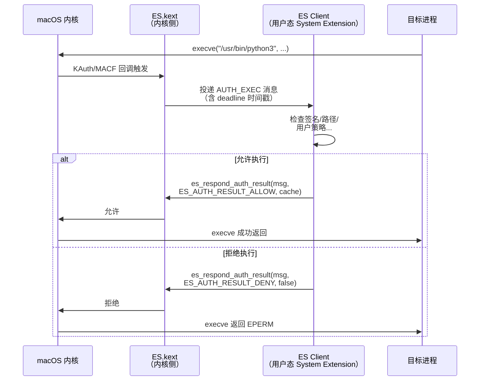

# 16 · macOS EndpointSecurity 框架

> [!abstract] TL;DR
> EndpointSecurity（ES）是 macOS 10.15（Catalina）引入的官方内核安全事件框架，作为 KEXT / kauth 的现代合规替代品，允许用户态 System Extension 订阅和（对 AUTH 类事件）阻止系统操作。
> 事件分两类：AUTH（同步授权，必须在 deadline 内调用 `es_respond_auth_result` 或 `es_delete_client` 否则操作按默认处置）和 NOTIFY（异步观测，不可阻止）。
> 使用 ES 需要 Apple 颁发的 `com.apple.developer.endpoint-security.client` entitlement、用户/MDM 批准以及公证，门槛较高，但这也是其抗滥用性强的根本原因。
> 现代 macOS EDR 产品（CrowdStrike Falcon、SentinelOne、Jamf Protect 等）均以 ES 为核心遥测和阻断引擎。

## 概述与定位

在 EndpointSecurity 出现之前，macOS 的安全软件主要依赖两条路径：

1. **Kernel Extension（KEXT）+ KAuth / MAC Framework（MACF）**：驱动级钩子，直接在内核态拦截 vnode 操作、进程创建等。优点是权限大、覆盖全；缺点是一个 KEXT 崩溃可以拉崩整个系统（内核 panic），且需要内核代码签名证书（门槛高）。Apple 从 macOS 10.15 开始宣布废弃 KEXT，并在 macOS 11（Big Sur）系列硬件上默认禁止加载第三方 KEXT（需用户降低安全策略）。
2. **dtrace**：BSD 风格的动态追踪框架，功能强大，但需要关闭 SIP（System Integrity Protection）才能在生产系统上全量使用，且在 Apple Silicon 设备上受到进一步限制。dtrace 的设计目标是诊断/调试而非生产安全监控，没有"阻止操作"的能力。

EndpointSecurity 的设计目标是填补这个空缺：提供一套**稳定、用户态、高性能、可阻断的安全事件框架**，让安全软件开发者无需写内核代码就能实现进程监控、文件访问控制、网络事件观测等 EDR 核心能力。

### ES 的本质：内核驱动 + 用户态 API

ES 的实现由两部分组成：

- **内核侧**（`/System/Library/Extensions/EndpointSecurity.kext`，系统 KEXT，随 macOS 预装，非第三方）：在内核中注册 KAuth 回调和 MAC 策略回调，拦截系统调用，将事件序列化后通过内核→用户态的安全通道（基于 IOKit/Mach 机制的高效单向/双向通道）投递给用户态客户端。
- **用户态侧**（`EndpointSecurity.framework`，位于 `/System/Library/Frameworks/`）：提供 C API（Swift 友好），客户端调用 `es_new_client` 与内核建立连接，调用 `es_subscribe` 指定感兴趣的事件类型，并在回调中处理事件。

这种架构将"危险代码"（内核侧的 KEXT）掌控在 Apple 手中，第三方开发者只写用户态逻辑，系统稳定性大幅提升。

### 与相关机制的横向定位

| 机制 | 运行位置 | 需关 SIP | 可阻断 | 门槛 | macOS 状态 |
|---|---|---|---|---|---|
| KAuth KEXT | 内核态 | 否 | 是 | 内核签名证书 | 已弃用，11+ 默认受限 |
| MACF KEXT | 内核态 | 否 | 是 | 内核签名证书 | 已弃用，同上 |
| dtrace | 用户态（内核探针）| 是（生产） | 否 | 普通开发者账号 | 可用，受 SIP 限制 |
| OpenBSM audit | 内核→用户态 | 否 | 否 | root 权限 | 可用，但信息量有限 |
| **EndpointSecurity** | **用户态 System Extension** | **否** | **是（AUTH 类）** | **ES entitlement + 公证** | **推荐，主流** |

## 原理与机制

### client 生命周期

ES 客户端的完整生命周期围绕五个关键函数展开：

```c
#include <EndpointSecurity/EndpointSecurity.h>

// 1. 创建 ES 客户端（建立与内核的连接）
es_client_t *client = NULL;
es_new_client_result_t result = es_new_client(&client, ^(es_client_t *c, 
                                                           const es_message_t *msg) {
    // 事件回调（在 ES 框架的私有线程上调用）
    handle_es_message(c, msg);
});

if (result != ES_NEW_CLIENT_RESULT_SUCCESS) {
    // 常见失败原因：
    // ES_NEW_CLIENT_RESULT_ERR_NOT_ENTITLED  → 缺少 entitlement
    // ES_NEW_CLIENT_RESULT_ERR_NOT_PERMITTED → 用户未在系统偏好/MDM 中批准
    // ES_NEW_CLIENT_RESULT_ERR_NOT_PRIVILEGED → 需以 root 运行
    fprintf(stderr, "es_new_client failed: %d\n", result);
    return;
}

// 2. 缓存控制（可选）：对 AUTH 事件，ES 会缓存响应结果加速重复判断
es_clear_cache(client);

// 3. 订阅感兴趣的事件类型
es_event_type_t events[] = {
    ES_EVENT_TYPE_AUTH_EXEC,         // 进程执行授权
    ES_EVENT_TYPE_AUTH_OPEN,         // 文件打开授权
    ES_EVENT_TYPE_AUTH_MOUNT,        // 挂载授权
    ES_EVENT_TYPE_NOTIFY_FORK,       // 进程 fork（异步，不可阻断）
    ES_EVENT_TYPE_NOTIFY_EXIT,       // 进程退出（异步）
    ES_EVENT_TYPE_NOTIFY_WRITE,      // 文件写入完成（异步）
};
es_subscribe(client, events, sizeof(events) / sizeof(es_event_type_t));

// 4. 运行主循环（回调由 ES 框架在后台线程触发，主线程 dispatch_main 维持运行）
dispatch_main();

// 5. 清理（通常在信号处理或应用退出时）
es_unsubscribe_all(client);
es_delete_client(client);  // 断开连接，释放资源
```

`es_new_client` 的回调（block）是核心，ES 框架在其内部的私有 dispatch queue 上调用此 block。对于 AUTH 事件，**必须在 deadline 内响应**（见下节），否则会触发超时处置。

### AUTH 与 NOTIFY 两类事件



**AUTH 类事件**（`ES_EVENT_TYPE_AUTH_*`）：

AUTH 事件是同步的——内核在等待 ES Client 的响应之前，目标进程的系统调用被**挂起**（不是直接阻塞目标进程线程，而是内核侧的 KAuth 回调在等待）。Client 必须通过以下函数之一在 deadline 到期前响应：

```c
// 最常用：允许或拒绝，cache=true 表示对相同 (process, target) 对缓存此结果
es_respond_auth_result(client, msg, ES_AUTH_RESULT_ALLOW, /*cache=*/true);
es_respond_auth_result(client, msg, ES_AUTH_RESULT_DENY,  /*cache=*/false);

// 针对 AUTH_OPEN：可精细控制允许的访问标志位
// 例如：允许读取但拒绝写入
es_respond_flags_result(client, msg, 
                        FREAD,   // 允许的 flags（去掉 FWRITE）
                        /*cache=*/false);
```

**deadline 超时语义**：`es_message_t.deadline` 字段是一个 `uint64_t` 的 Mach absolute time，表示响应截止时间。若 Client 在此时间前未响应，内核会按**系统 deadline_behavior** 处置：

- 默认（`deadline_behavior = es_client_deadline_behavior_allow`）：**放行**操作，并向 Client 发送一个特殊的 `ES_ACTION_TYPE_NOTIFY` 事件通知超时。
- 严格模式（`deadline_behavior = es_client_deadline_behavior_deny`）：**拒绝**操作。在 macOS 13+，某些高安全场景可通过此模式配置更严格的策略。

如果 Client 进程崩溃或退出，内核检测到连接断开后立即对所有挂起的 AUTH 事件执行放行（fail-open），避免系统死锁（例如所有进程启动都被阻塞）。这一 fail-open 设计意味着 EDR 进程被 Kill 后系统能继续正常运行，但监控即时失效。

**NOTIFY 类事件**（`ES_EVENT_TYPE_NOTIFY_*`）：

NOTIFY 事件是异步的，操作**已经发生**，Client 无法阻止，只能记录/告警。涵盖进程 fork/exit、文件写入/删除完成、网络连接建立、TCC 访问等。NOTIFY 事件不需要响应，回调直接处理后返回即可。

### 事件结构深度解析

ES 的核心数据结构是 `es_message_t`，包含公共头部和事件特定 union：

```c
typedef struct {
    uint32_t         version;          // 消息版本（影响字段可用性）
    struct timespec  time;             // 事件时间
    uint64_t         mach_time;        // Mach 时间（高精度）
    uint64_t         deadline;         // AUTH 事件响应截止时间（NOTIFY 为 0）
    es_process_t    *process;          // 发起操作的进程信息
    es_action_type_t action_type;      // ES_ACTION_TYPE_AUTH 或 NOTIFY
    union {
        es_event_exec_t    exec;       // AUTH_EXEC / NOTIFY_EXEC
        es_event_open_t    open;       // AUTH_OPEN / NOTIFY_OPEN
        es_event_write_t   write;      // NOTIFY_WRITE
        es_event_fork_t    fork;       // NOTIFY_FORK
        es_event_exit_t    exit;       // NOTIFY_EXIT
        es_event_mount_t   mount;      // AUTH_MOUNT
        // ... 100+ 个事件 union 成员（macOS 14 约 150 个事件类型）
    } event;
    es_seq_num_t     seq_num;          // 单调递增序列号，用于检测事件丢失
    // macOS 13+ 新增
    uint8_t          *global_seq_num;
} es_message_t;
```

`es_process_t` 包含进程的完整信息：PID、PPID、audit token（包含 UID/GID/ASID，是进程身份的不可伪造标识）、可执行文件路径、代码签名信息（TeamID、SigningID、CDHash）、是否是平台二进制（系统进程）等。

重要：**应优先使用 audit token 而非 PID 来标识进程**。PID 在进程退出后会被重用（PID recycling 攻击），而 audit token 中的 ASID（audit session ID）在进程间唯一，且通过 `audit_token_to_pid` 可以还原 PID。

### 进程 exec 事件详解

`ES_EVENT_TYPE_AUTH_EXEC` 是最重要的 AUTH 事件，拦截点在 `execve`/`posix_spawn` 的内核实现中，此时新的可执行文件已被映射但尚未开始执行。事件负载包括：

```c
typedef struct {
    es_process_t   *target;      // 被 exec 的新进程（不同于 msg->process：后者是发起 exec 的进程）
    es_file_t      *script;      // 如果是脚本（#! 解释器行），这是脚本文件
    es_file_t      *cwd;         // 工作目录
    int             reserved;
    // macOS 13+：
    es_token_t      dyld_exec_path;  // dyld 路径
} es_event_exec_t;
```

获取 exec 的命令行参数需要用辅助函数：

```c
// 获取参数数量
uint32_t argc = es_exec_arg_count(&msg->event.exec);
// 获取第 i 个参数
es_string_token_t arg = es_exec_arg(&msg->event.exec, i);
printf("arg[%d]: %.*s\n", i, (int)arg.length, arg.data);

// 获取环境变量
uint32_t envc = es_exec_env_count(&msg->event.exec);
es_string_token_t env = es_exec_env(&msg->event.exec, i);
```

### 缓存机制

ES 内置了响应缓存（auth result cache），对于同一个 `(process, target)` 对，如果之前已经响应过 ALLOW+cache=true，内核不会再次发送 AUTH 事件给 Client，直接放行。这对性能至关重要——例如频繁执行 `ls`、`cat` 等工具时，缓存命中率极高，Client 只需处理第一次。

缓存的 key 由 `(signing_id, team_id, CDHash, target path)` 等组合决定（具体算法未公开，但实验可以观察）。`es_clear_cache(client)` 可以手动清除缓存，通常在安全策略更新时调用。

## 结构/事件体系与使用模式详解

### 完整 AUTH 事件列表（关键子集）

| 事件类型 | 说明 | 操作阻断 |
|---|---|---|
| `AUTH_EXEC` | 进程执行（execve/posix_spawn）| 是，EPERM |
| `AUTH_OPEN` | 文件打开（open/openat）| 是，可降级标志 |
| `AUTH_KEXTLOAD` | 加载 Kernel Extension | 是（macOS 10.15–12）|
| `AUTH_MMAP` | 内存映射文件（mmap）| 是 |
| `AUTH_MPROTECT` | 修改内存保护属性（mprotect）| 是 |
| `AUTH_MOUNT` | 文件系统挂载 | 是 |
| `AUTH_RENAME` | 文件重命名 | 是 |
| `AUTH_SIGNAL` | 向进程发送信号 | 是 |
| `AUTH_UNLINK` | 删除文件 | 是 |
| `AUTH_CLONE` | 文件克隆（APFS CoW）| 是 |
| `AUTH_COPYFILE` | 文件复制 | 是 |
| `AUTH_PROC_SUSPEND_RESUME` | 进程暂停/恢复 | 是 |
| `AUTH_SEARCHFS` | 文件系统搜索 | 是 |

### 文件系统监控模式

典型的文件完整性监控（FIM）实现模式：

```c
void handle_es_message(es_client_t *client, const es_message_t *msg) {
    switch (msg->event_type) {
    case ES_EVENT_TYPE_AUTH_OPEN: {
        const es_event_open_t *ev = &msg->event.open;
        const char *path = ev->file->path.data;
        
        // 检查是否是受保护路径（如 /etc/sudoers, /Library/LaunchDaemons/）
        if (is_protected_path(path) && (ev->fflag & FWRITE)) {
            // 拒绝对受保护文件的写访问
            es_respond_auth_result(client, msg, ES_AUTH_RESULT_DENY, false);
            log_alert("Blocked write to protected path: %s by PID %d", 
                      path, audit_token_to_pid(msg->process->audit_token));
            return;
        }
        es_respond_auth_result(client, msg, ES_AUTH_RESULT_ALLOW, true);
        break;
    }
    
    case ES_EVENT_TYPE_NOTIFY_WRITE:
        // 记录写入完成事件（无法阻断，已发生）
        log_file_write(msg->event.write.destination->path.data,
                       audit_token_to_pid(msg->process->audit_token));
        break;

    case ES_EVENT_TYPE_NOTIFY_EXIT:
        // 清理进程相关的缓存/状态
        cleanup_process_state(msg->process->audit_token);
        break;

    default:
        // 对于 AUTH 事件必须响应，否则死锁
        if (msg->action_type == ES_ACTION_TYPE_AUTH) {
            es_respond_auth_result(client, msg, ES_AUTH_RESULT_ALLOW, true);
        }
        break;
    }
}
```

### 进程 exec 监控与代码签名验证

EDR 的核心能力之一是"仅允许经过签名的可执行文件运行"：

```c
case ES_EVENT_TYPE_AUTH_EXEC: {
    const es_process_t *target = msg->event.exec.target;
    
    // 平台二进制（Apple 系统二进制）始终放行
    if (target->is_platform_binary) {
        es_respond_auth_result(client, msg, ES_AUTH_RESULT_ALLOW, true);
        return;
    }
    
    // 检查代码签名状态
    // target->codesigning_flags & CS_VALID 表示签名有效
    // target->team_id.data 包含 Apple Developer Team ID（若已签名）
    // target->signing_id.data 包含 Bundle ID 或可执行路径签名标识
    
    bool valid_sig = (target->codesigning_flags & CS_VALID) != 0;
    bool has_team_id = (target->team_id.length > 0);
    
    if (!valid_sig || !has_team_id) {
        // 未签名或签名无效 → 告警或阻断（取决于策略）
        if (g_block_unsigned) {
            es_respond_auth_result(client, msg, ES_AUTH_RESULT_DENY, false);
        } else {
            log_warn("Unsigned exec: %s", target->executable->path.data);
            es_respond_auth_result(client, msg, ES_AUTH_RESULT_ALLOW, false);
        }
    } else {
        es_respond_auth_result(client, msg, ES_AUTH_RESULT_ALLOW, true);
    }
    break;
}
```

### 事件序列号与丢事件检测

`es_message_t.seq_num` 是 ES Client 连接建立后单调递增的序列号（per-client）。如果 Client 处理太慢或内核缓冲区满，内核会丢弃事件并跳跃序列号，之后发送一个 `ES_EVENT_TYPE_NOTIFY_ES_CLIENT_DROPPED_EVENTS` 通知。安全软件应监控此事件并记录告警，因为在高负载下事件丢失可能导致漏报。

## 工具视角与实战

### 系统分发：System Extension 与 entitlement 获取

ES Client 必须以 System Extension 形式分发（macOS 10.15+），不能是普通命令行工具（在开发/测试时可以用 root + `SIP_CONFIG=nvram boot-args="-amfi_get_out_of_my_way 1"` 临时绕过 entitlement 检查，但生产中绝对不可）。

获取 `com.apple.developer.endpoint-security.client` entitlement 的流程：

1. 在 Apple Developer Portal 为 App ID 申请此特殊 entitlement（需联系苹果说明用途，审核周期约 1-2 周）。
2. 用签名配置文件（Provisioning Profile）将 entitlement 嵌入可执行文件。
3. 将 System Extension bundle 嵌入 macOS 应用，通过 `SystemExtensions.framework` 的 `OSSystemExtensionRequest` API 向系统请求激活。
4. 用户在"系统偏好设置→安全性与隐私"（或 MDM 策略）中批准 System Extension 加载。
5. 应用及 System Extension 必须通过 Apple 公证（Notarization），在用户机器上运行时 Gatekeeper 才不报警。

### 开发工具：ESF Playground、Santa、OpenEndpointSecurity

**ESF Playground**（随 macOS 12+ Xcode 样例分发）：Apple 官方 ES 示例项目，展示完整 System Extension + ES 的集成模式，是入门 ES 开发的最佳起点。

**Santa**（Google 开源，[github.com/google/santa](https://github.com/google/santa)）：生产级别的 ES 应用，实现了基于代码签名的二进制允许/拒绝列表（allowlist/blocklist），是研究 ES 实际用法的最佳开源参考。Santa 从 KEXT 迁移到 ES 的过程（2020–2021）也是从旧 KAuth 架构迁移到 ES 的典型案例研究。

**OpenEndpointSecurity**（第三方）：提供 Swift-native 的 ES 封装，简化了回调管理和消息生命周期。

**eslogger**（macOS 13+ 系统自带）：

```bash
# 系统自带工具，无需额外 entitlement（root 即可），输出 JSON 格式的 ES 事件流
sudo eslogger exec fork exit | python3 -m json.tool | head -100
```

`eslogger` 是 Apple 在 macOS 13 中新增的便捷诊断工具，底层调用 ES API，适合开发调试和临时分析，不需要 ES entitlement。

### 与 OpenBSM audit 的对比

macOS 的 audit（`/usr/sbin/auditd`）基于 OpenBSM（基本安全模块），通过 `audit_event` 在内核中记录系统调用，输出二进制 `.trail` 文件，用 `praudit` 解码。

| 维度 | EndpointSecurity | OpenBSM audit |
|---|---|---|
| 事件丰富程度 | 极高（100+ 事件类型，含详细上下文）| 较低（系统调用级，参数有限）|
| 可阻断操作 | 是（AUTH 类）| 否 |
| 实时投递 | 是（callback）| 是（管道/文件）|
| 代码签名信息 | 内置（TeamID/CDHash）| 无 |
| 进程树上下文 | 是（祖先进程链）| 有限 |
| 需要 entitlement | 是（ES entitlement）| 否（root 即可）|
| macOS 未来性 | Apple 主推 | 维护状态，不再扩展 |

OpenBSM 在 macOS 上已进入维护模式，Apple 文档明确建议新开发的安全工具优先使用 ES。

### 与 dtrace 的对比

dtrace 在 macOS 上需要部分或全部关闭 SIP 才能使用 `syscall` / `proc` 等内核探针（`sudo csrutil disable` 或 `csrutil enable --without dtrace`），在生产设备上几乎无法使用。ES 无需修改系统安全策略，这是两者在生产场景下最根本的差异。

此外 dtrace 的 `proc:::exec-success`/`proc:::exec-failure` 探针只是观测，无法阻止；ES 的 `AUTH_EXEC` 可以拒绝 execve。

### ES 与 TCC 的交互

TCC（Transparency, Consent, and Control）是 macOS 的隐私权限框架（控制摄像头、麦克风、联系人、位置等访问）。ES 本身不直接控制 TCC 决策，但：

1. ES 的 `ES_EVENT_TYPE_NOTIFY_TCC_MODIFY_ACCESS` 事件（macOS 14+）可以观测 TCC 数据库修改，某些规避 TCC 的攻击会在此留下痕迹。
2. 运行 ES System Extension 的宿主应用需要在 TCC 数据库中授予"完全磁盘访问"（Full Disk Access），否则 ES 事件中的某些文件路径会被替换为 `<private>`（隐私保护）。

## 安全性与正确使用

### ES 的抗绕过性分析

ES 的安全强度来源于以下设计：

1. **内核侧拦截**：拦截点在内核的 KAuth/MACF 路径上，不是用户态 hook，无法通过 patch 某个用户态函数绕过。攻击者想绕过 ES 必须具有内核代码执行能力（通常意味着 Secure Boot 已被破坏）。
2. **entitlement 门控**：`es_new_client` 在内核侧验证调用进程持有的 entitlement，普通进程（包括 root 进程）无法创建 ES 客户端。
3. **代码签名强制**：ES Client 所在的 System Extension 本身受 Gatekeeper + SIP 保护，攻击者无法替换它（除非绕过 SIP）。

### es_mute_process / es_mute_path 与潜在致盲

> [!caution]
> ES 的 mute 机制在设计上是性能优化工具（让 ES Client 告诉内核"我不关心这个进程/路径"，内核直接放行，减少不必要的事件投递），但若被恶意利用则可导致 EDR 致盲。在**自有或已获授权的测试环境**中研究此机制是合法的；在未授权系统上滥用 es_mute 相关接口，或尝试对第三方 EDR 的 ES 客户端注入 mute 规则，均属于非法入侵行为。所有安全研究应在授权测试环境中进行，遵循 responsible disclosure 原则，并符合中国《网络安全法》、《数据安全法》及适用地区计算机犯罪法规。

```c
// 性能优化用途：告知内核，对某个进程的所有事件不再通知此 Client
// （内核直接放行，不等待 Client 响应）
es_mute_process(client, &target_audit_token);

// 告知内核，对某个路径前缀的 NOTIFY 事件不通知此 Client
// （AUTH 事件不受 mute_path 影响 — AUTH 事件必须响应）
es_mute_path(client, "/private/var/db", ES_MUTE_PATH_TYPE_PREFIX);

// macOS 13+：更精细的 mute，仅 mute 特定事件类型
es_mute_path_events(client, "/tmp", ES_MUTE_PATH_TYPE_PREFIX, 
                    events, event_count);

// 取消 mute
es_unmute_process(client, &target_audit_token);
es_unmute_path(client, "/private/var/db", ES_MUTE_PATH_TYPE_PREFIX);
```

**防御视角**：攻击者若能以某种方式（内核漏洞、PPL bypass 等）向 EDR 的 ES 客户端注入 `es_mute_process` 调用，可以使 EDR 对特定进程完全视而不见。实际上这需要内核级控制，门槛极高。更常见的"致盲"场景是：

1. **ES Client 进程本身被 kill**：如前述 fail-open 语义，ES 客户端崩溃后内核立即放行所有挂起 AUTH 事件，系统继续运行但监控消失。由于 System Extension 通常被 `launchd` 守护（plist `KeepAlive=true`），kill 后会重启，窗口期有限。
2. **用户主动在系统偏好中撤销批准**：需要物理/远程访问用户账户（或 MDM 策略变更），通常有审计日志留存。
3. **通过 TOCTOU 攻击绕过 AUTH_EXEC 缓存**：由于 ES 对 `(signing_id, team_id, CDHash, path)` 缓存 ALLOW 结果，若攻击者能在文件被 ALLOW 缓存后、再次 exec 之前替换可执行文件内容（且保持 inode/路径不变），理论上可绕过。Apple 通过将 CDHash 作为缓存 key 之一来缓解（内容变化 → CDHash 变化 → 缓存失效），但实现细节影响实际效果。

### SIP 与 ES 的关系

SIP（System Integrity Protection）与 ES 是**独立的**两层保护：

- SIP 保护系统文件/目录（`/System`, `/usr`, `/bin` 等）不被任何进程（包括 root）修改。
- ES 是用于**观测和阻断**用户空间操作的事件框架。

关闭 SIP 不会直接削弱 ES 的功能（ES 拦截点在内核，SIP 关闭不影响内核的 KAuth/MACF 路径）。但关闭 SIP 后攻击者可以替换 `/System/Library/Extensions/EndpointSecurity.kext`（系统 ES 内核组件）本身，从根本上摧毁 ES 基础设施——这就是为什么现代 Mac 安全体系将 SIP + Secure Boot 视为整体。

### 与 [[36.Objective-C与iOS运行时/20.iOS沙箱与entitlements.md]] 的交叉

ES 的 entitlement 机制（`com.apple.developer.endpoint-security.client`）与 iOS sandbox entitlement 体系同源——都是 Apple 的代码签名约束系统（AMFI，Apple Mobile File Integrity）的组成部分。iOS 沙箱使用 entitlement 限制进程能做什么；macOS ES entitlement 授权进程"可以观测系统事件"。两者的底层实现均通过内核的 MACF（Mandatory Access Control Framework）策略评估，`proc_enforce` 和 `vnode_enforce` 等宏在两个平台上有共同祖先。深入理解 iOS entitlement 的运作方式有助于理解为何 ES 的 entitlement 检查能在内核中无法绕过。

## 小结

EndpointSecurity 是 Apple 为 macOS 安全生态提供的现代化、稳定的内核事件框架，从根本上解决了旧 KEXT + KAuth 方案"一个崩溃拖垮内核"的稳定性问题，同时通过 entitlement 门控和 System Extension 架构将安全工具的运行约束在用户态，大幅降低了系统风险。AUTH/NOTIFY 两类事件的设计清晰地区分了"需要同步决策的授权操作"和"纯观测记录"，deadline 机制则在保证安全性的同时通过 fail-open 防止了因 EDR 故障导致的系统挂死。现代 macOS EDR（CrowdStrike、SentinelOne、Jamf Protect）均以 ES 为核心遥测和阻断引擎，而 Google Santa 提供了完整的开源参考实现。ES 的主要局限在于分发门槛高（需 Apple 特殊 entitlement + 公证）、AUTH 事件的 deadline 压力要求 Client 高效设计、以及 fail-open 语义意味着 EDR 进程被 kill 后存在窗口期。从 hook 技术视角看，ES 代表了"由系统基础设施提供观测点，安全工具作为合规消费者"的最高形态，是对比本系列前几篇中"手动插入观测点"思路的重要补充。

## 相关阅读

- [[02-windows-api-hook|02 · Windows API Hook（IAT / Inline Patch）]]
- [[11-process-injection|11 · 进程注入技术全景]]
- [[15-etw|15 · ETW 事件追踪（Windows）]]
- [[36.Objective-C与iOS运行时/20.iOS沙箱与entitlements.md|iOS 沙箱与 Entitlements]]
- [[00.总览|系列总览]]

---

[[00.总览|⬆ 系列总览]] | [[15-etw|← 上一章]]
