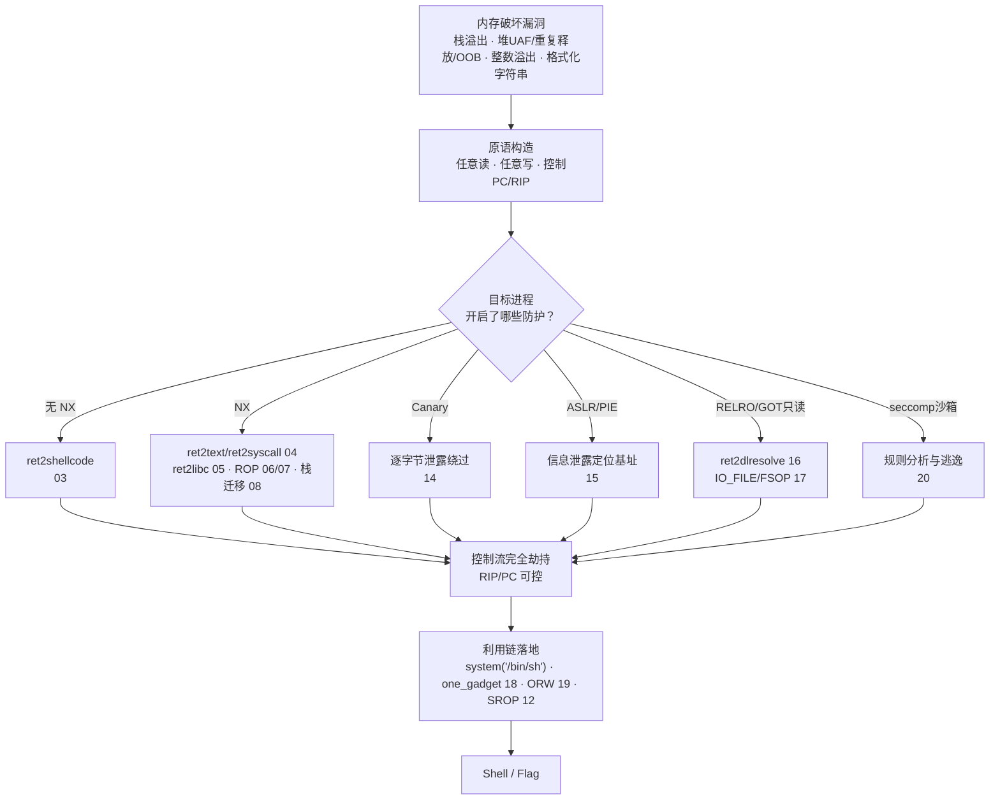
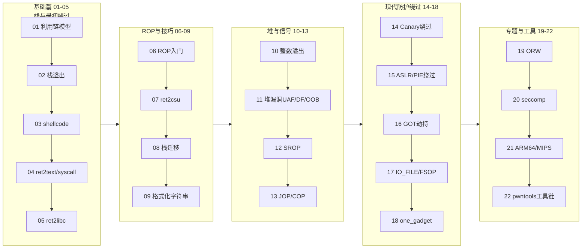

# 二进制漏洞与利用基础 · 系列总览

> 本系列覆盖从栈/堆内存破坏到现代绕过（ASLR/Canary/RELRO/CET）的利用手法与利用链构造，是 [[34.现代二进制防护机制/00.现代二进制防护机制总览|系列 34（防护机制）]] 的攻击面对偶——34 讲每项防护如何工作，本系列讲攻击如何突破；堆部分与 [[24.内存管理与堆分配器/17.堆利用手法体系House_of系列|系列 24]] 深度联动。全 22 章按“漏洞原语 → 控制流劫持 → 防护绕过 → 利用链落地 → 架构与工具”的主线展开，兼顾 CTF pwn 实战与真实世界防护机制的攻防理解。

## 利用链全景

从一个内存破坏漏洞到最终拿到 shell 或 flag，通常要经过“原语构造 → 防护识别 → 对应绕过 → 控制流劫持 → 链条落地”五个阶段，下图给出各阶段间的典型路径与对应章节：

> [!warning] 合规提醒与学习建议
> - 本系列所有利用技术**仅限在自有环境、CTF 靶场（本地部署或授权平台题目）、经授权的安全研究场景中实践**，严禁用于未经授权的系统，相关知识需在法律与授权范围内使用。
> - 学习立足点是**防御视角的对齐**：每一种利用手法都对应 [[34.现代二进制防护机制/00.现代二进制防护机制总览|系列 34]] 中的一项具体防护，建议交替对照阅读，理解“防护为什么会被绕过、为什么能挡住”，而不是死记 payload 模板。
> - 建议在隔离虚拟机或容器中，配合 `pwntools` + `gdb`（`pwndbg`/`peda`/`gef`）实操：先关闭全部防护复现基础手法，再逐项开启 Canary/ASLR/NX/RELRO，体会每项防护把攻击面收窄到什么程度。

## 篇目导航

| # | 章节 | 说明 |
| --- | --- | --- |
| 01 | [[01.内存破坏漏洞全景与利用链模型]] | 漏洞类型学、利用链阶段、读/写/执行原语建模 |
| 02 | [[02.栈溢出原理与经典利用]] | 栈帧布局、返回地址覆盖、RIP 劫持 |
| 03 | [[03.shellcode编写与ret2shellcode]] | 系统调用 shellcode、去坏字节编码、NX 前时代 |
| 04 | [[04.返回导向：ret2text与ret2syscall]] | 复用已有代码与 syscall 门，绕过 NX 的雏形 |
| 05 | [[05.ret2libc]] | 复用 libc 函数，构造 system 与 binsh |
| 06 | [[06.ROP入门]] | gadget 链、返回导向编程基础 |
| 07 | [[07.ROP进阶：ret2csu与通用gadget]] | libc_csu_init 通用 gadget、控制多参数寄存器 |
| 08 | [[08.栈迁移与stack pivot]] | 栈空间不足时迁移到可控内存，leave ret 手法 |
| 09 | [[09.格式化字符串漏洞]] | 百分号n 任意写、泄露与偏移定位 |
| 10 | [[10.整数溢出与类型转换缺陷]] | 回绕、符号与无符号、截断引发越界 |
| 11 | [[11.堆漏洞类型：UAF与double-free与OOB]] | 悬垂指针、重复释放、堆越界，衔接系列 24 |
| 12 | [[12.SROP信号帧伪造]] | sigreturn 伪造寄存器上下文、SROP 链 |
| 13 | [[13.JOP与COP面向跳转与调用编程]] | dispatcher gadget、后向 CFI 之外的思路 |
| 14 | [[14.Canary泄露与绕过]] | 逐字节爆破、泄露、fork 场景、覆盖 TLS |
| 15 | [[15.ASLR与PIE绕过技术]] | 信息泄露、部分覆盖、暴力、非随机区利用 |
| 16 | [[16.GOT劫持与ret2dlresolve]] | 改写 GOT、伪造重定位表项解析任意符号 |
| 17 | [[17.IO_FILE结构利用与FSOP]] | _IO_FILE vtable 劫持、house of orange 相关 |
| 18 | [[18.one_gadget与magic_gadget]] | 一击成型 gadget、约束满足 |
| 19 | [[19.ORW与读取flag]] | 无 system 时用 syscall 打开读出文件 |
| 20 | [[20.seccomp沙箱与逃逸]] | seccomp-bpf 规则、架构切换与绕过 |
| 21 | [[21.ARM64与MIPS架构利用差异]] | 寄存器传参、返回地址在寄存器、跳板差异 |
| 22 | [[22.利用开发工具链：pwntools与ROPgadget]] | 脚本化利用、gadget 搜索、环境搭建 |

## 学习路径

22 章按依赖关系可分为五个阶段，组间建议按序推进，组内可按编号线性阅读；架构专题（21）与工具链（22）可提前穿插预习：

## 与知识库既有体系的衔接

- 防护对偶：[[34.现代二进制防护机制/00.现代二进制防护机制总览]]（NX/ASLR/Canary/RELRO/CFI/CET 的挡与漏）
- 堆内部：[[24.内存管理与堆分配器/06.ptmalloc2的chunk结构]]、[[24.内存管理与堆分配器/08.tcache机制]]、[[24.内存管理与堆分配器/17.堆利用手法体系House_of系列]]
- 底层前置：[[11.ELF文件详解/17.got节]]（GOT/PLT）、[[22.调用规约/06.SystemV_AMD64调用规约]]（传参约定）
- 内核延伸：[[52.Linux内核机制与内核利用/00.Linux内核机制与内核利用总览]]（内核态利用）
