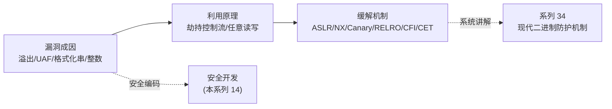

# 二进制漏洞与利用基础 · 系列总览

> 作者原创系列，共 **14** 篇，**安全教育 / 防御 / CTF 学习向**。聚焦"漏洞**为何产生、原理是什么、如何检测与防御**"——攻击技术只讲到理解原理的程度，每篇都配套"缓解与防御"。本系列是 [[11.ELF文件详解/17.got节|GOT]]、[[14.动态链接与加载器详解/08.PLT与GOT与延迟绑定|PLT/GOT]]、[[22.调用规约/00.总览|调用规约]] 等机制的"安全应用层"；防护机制的系统讲解见 [[34.现代二进制防护机制/00.现代二进制防护机制总览|系列 34]]。

> [!warning] 教学环境声明
> 本系列示例多需关闭现代防护（如 `-fno-stack-protector`、`-no-pie`、`-z execstack`）以复现教学现象；**生产环境这些防护默认开启**。所有内容用于理解漏洞成因与加固防御，请勿用于任何非授权测试。

## 一、基础

| # | 章节 | 说明 |
| --- | --- | --- |
| 01 | [[01.内存布局与漏洞概览]] | 进程内存布局、漏洞分类、攻击面与防御全景 |

## 二、栈漏洞

| # | 章节 | 说明 |
| --- | --- | --- |
| 02 | [[02.栈溢出基础]] | 栈帧、覆盖返回地址、经典栈溢出原理与防御 |
| 03 | [[03.Shellcode概念]] | shellcode 是什么、约束、为何 NX 使其失效 |
| 04 | [[04.栈Canary原理]] | stack canary 原理、类型、绕过前提与加固 |

## 三、绕过技术

| # | 章节 | 说明 |
| --- | --- | --- |
| 05 | [[05.ret2libc]] | 返回到 libc 绕过 NX 的原理与 ASLR/RELRO 防御 |
| 06 | [[06.ROP入门]] | gadget、ROP 链原理，及 CFI/Shadow Stack 防御 |
| 07 | [[07.GOT劫持与ret2dl-resolve]] | GOT 改写与 ret2dl-resolve（接 14 系列 15），Full RELRO 缓解 |

## 四、格式化字符串

| # | 章节 | 说明 |
| --- | --- | --- |
| 08 | [[08.格式化字符串漏洞]] | `%n` 任意读写原理、根因与编译器防御 |

## 五、堆漏洞

| # | 章节 | 说明 |
| --- | --- | --- |
| 09 | [[09.堆管理基础]] | glibc malloc/free、chunk、bins（理解堆漏洞的前提） |
| 10 | [[10.堆漏洞入门]] | UAF / double free / 堆溢出原理与防御 |

## 六、其他漏洞类

| # | 章节 | 说明 |
| --- | --- | --- |
| 11 | [[11.整数溢出与类型混淆]] | 整数溢出、类型混淆成因与安全编码 |

## 七、防御与进阶

| # | 章节 | 说明 |
| --- | --- | --- |
| 12 | [[12.缓解机制总览]] | ASLR/NX/Canary/RELRO/CFI/CET 全景（详见系列 34） |
| 13 | [[13.现代利用与信息泄露]] | 信息泄露在现代利用中的核心地位（概念层，防御导向） |
| 14 | [[14.安全开发与防御]] | 如何写不易被利用的代码、加固编译选项、检测工具 |

## 漏洞 → 利用 → 防御 的关系

> 一句话：理解攻击是为了更好地防御——读懂漏洞如何被利用，才知道每一项缓解机制在挡什么。
