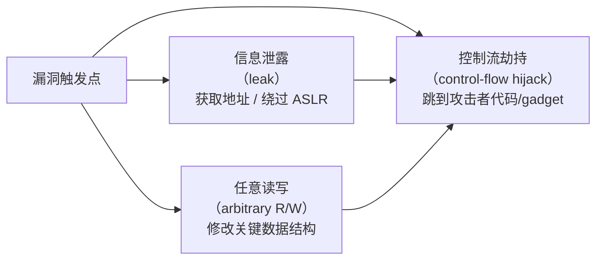
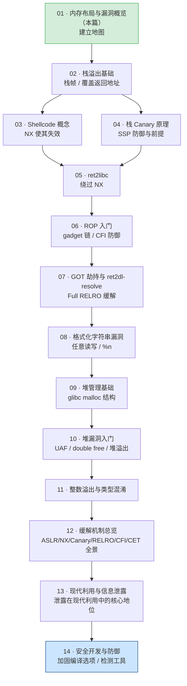

# 二进制漏洞与利用基础（1）· 内存布局与漏洞概览

> [!abstract] TL;DR
> 理解内存漏洞的**前提**，是先看清进程的虚拟地址空间长什么样：哪段只读、哪段可写、哪段在运行时生长，以及每段的边界为什么不是"墙"而是"可破坏的约定"。本篇从 Linux 进程内存布局出发，勾画漏洞大类（内存破坏 / 逻辑 / 侧信道）、攻击者的三类目标（控制流劫持 / 任意读写 / 信息泄露），并给出本系列 14 篇的学习路线。

---

## 概述与定位

漏洞之所以能被利用，归根到底是攻击者能让程序**对不该访问的内存做不该做的操作**。栈溢出能覆盖返回地址，堆漏洞能修改元数据，格式化字符串能任意写——这些技术听起来各异，但本质上都是"越出本段边界、踩到另一段的关键数据"。想看懂这一切，就必须先建立一张清晰的进程虚拟内存地图。

本篇是系列入口。读完之后你会知道：
- 进程的虚拟地址空间如何分段，每段的权限与生长方向。
- 漏洞按大类怎么归纳，各大类的根本成因是什么。
- 攻击者想达成哪些目标，这些目标如何映射到具体的内存操作。
- 本系列 14 篇各讲什么，与防御系列 34 是什么关系。
- 现代系统有哪些纵深防御手段（ASLR / NX / Canary / RELRO / CFI），详解见系列 34。

---

## 原理与机制

### 进程虚拟内存布局

Linux x86-64 上，每个进程独享一块 **64 位虚拟地址空间**（用户态通常可用 0 ~ 0x7fffffffffff，高位给内核）。动态链接可执行文件的典型布局如下（地址从低到高，仅示意——ASLR 开启后各段基址随机化）：

```
地址（示意）          区域                  权限
0x00400000 ──────  .text（代码段）          r-x  ← 只读 + 可执行
0x00401000 ──────  .rodata（只读数据）       r--
0x00402000 ──────  .data（已初始化全局变量）  rw-
0x00403000 ──────  .bss（未初始化全局变量）   rw-  ← 运行前清零
           ──────  [heap]                  rw-  ↑ 向高地址增长（brk/mmap）
           ──────  ...（mmap 区域：          rw-  动态库、匿名映射等）
           ──────  [stack]                 rw-  ↓ 向低地址增长
0x7fffffffffff ── 内核/用户边界
[内核态]            不可直接访问
```

> [!warning] 以上地址仅为教学示意，实际运行时因 ASLR 会完全不同。

各段详解：

| 区域 | 内容 | 权限 | 特性 |
|------|------|------|------|
| `.text` | 机器指令 | `r-x` | 只读共享，代码逻辑在此 |
| `.rodata` | 字符串常量、只读数据 | `r--` | 不可写 |
| `.data` | 已初始化全局/静态变量 | `rw-` | 链接时有初值 |
| `.bss` | 未初始化全局/静态变量 | `rw-` | 文件中无数据，运行时清零 |
| `[heap]` | `malloc`/`new` 分配 | `rw-` | **向高地址增长**；`brk` 扩展 |
| `mmap` 区 | 动态库、匿名映射、文件映射 | 按需 | 动态库 `.text` 可 `r-x` 共享 |
| `[stack]` | 局部变量、返回地址、帧指针 | `rw-` | **向低地址增长**；自动管理 |
| 内核区 | 内核代码/数据 | 内核专有 | 用户态访问即 SIGSEGV |

#### Mermaid 内存布局图


> （图中箭头自上而下对应低地址→高地址，即 `.text` 在最低端，内核区在最高端。）

> [!info] 两个"生长方向"对立的区域（heap 向上、stack 向下）夹着 mmap 区，这种布局使得极端情况下它们各自的边界可能相向碰撞——这正是某些堆 / 栈漏洞利用得以跨区域影响数据的结构基础。

#### 为什么内存布局是理解漏洞的前提

栈溢出之所以能覆盖**返回地址**，是因为局部缓冲区和 saved RIP 在同一个 stack frame 里，且缓冲区地址更低——向高地址溢出就能踩到 saved RIP（见 [[14.动态链接与加载器详解/04.可执行文件的内存映射.md]]，该篇讲解 ELF 段如何被 `mmap` 进来形成以上布局；调用栈帧细节见 [[22.调用规约/00.总览.md]]）。

堆溢出之所以能篡改分配器元数据，是因为 heap chunk 的 header 和 user data 紧邻。格式化字符串之所以能任意读写，是因为格式化参数在 stack 上，而 `%n` 能向任意地址写值。**每一类漏洞都是在"利用布局的局部性"**。不知道布局，就无法理解漏洞能影响什么、攻击者需要跨越什么距离。

---

### 漏洞大类概览

#### 一、内存破坏类（Memory Corruption）

最核心、最常见的一类。根本成因：C/C++ 不做运行时边界检查，允许直接操作裸指针。

| 子类 | 根本成因 | 影响区域 |
|------|----------|----------|
| **栈溢出**（Stack Buffer Overflow） | 固定大小栈缓冲区被超量写入 | 返回地址 / 帧指针 / 局部变量 |
| **堆溢出**（Heap Buffer Overflow） | heap chunk 边界越界写 | 相邻 chunk 元数据 / 用户数据 |
| **UAF**（Use-After-Free） | 指针被 free 后继续使用 | 被重新分配给他人的内存 |
| **Double Free** | 同一指针被 free 两次 | 分配器内部链表 |
| **格式化字符串**（Format String） | `printf(user_input)` 无格式参数 | 任意内存（`%n` 可写） |
| **整数溢出**（Integer Overflow） | 宽度截断 / 符号转换导致计算错误 | 依赖此值的缓冲区大小 / 索引 |

#### 二、逻辑类（Logic / Design Flaw）

不一定破坏内存，但违反程序的设计假设：权限校验缺失、TOCTOU 竞争条件、不安全反序列化、路径穿越等。这类漏洞往往更难用静态分析发现，因为代码语义上是"合法的"——错误在逻辑，不在指针。

#### 三、侧信道类（Side Channel）

不直接破坏内存，而是通过**时序差异、缓存状态、功耗、电磁辐射**等旁路信道推断秘密数据。Spectre / Meltdown 是典型——利用 CPU 推测执行的缓存副作用，越过内存隔离读取内核数据。本系列不深入此类，但在布局理解上它仍与内存息息相关。

---

### 攻击者的三类目标

无论漏洞类型，攻击者的最终目标通常落在以下三类之一，或它们的组合：



1. **信息泄露（leak）**：读出 stack/heap/libc 地址，打破 ASLR 随机化，为后续劫持提供真实地址。格式化字符串 `%p` 泄露、越界读是典型手段。

2. **任意读写（arbitrary read/write）**：能向任意地址写任意值（write-what-where），可篡改函数指针、GOT 表项（参见 [[11.ELF文件详解/17.got节.md]]）、`__free_hook` 等。

3. **控制流劫持（control-flow hijack）**：最终目标，让 CPU 的 IP/PC 跳到攻击者指定的地址（shellcode / libc `system` / ROP gadget）。上述两类往往是达成此目标的前置步骤。

---

## 最小示例

### 查看进程内存映射

> [!warning] 以下命令输出为教学示意，需在 **Linux 环境**（非 Windows）执行；本机为 Windows，未实际运行。

```bash
# 方法一：/proc 伪文件系统（精确，每行一个 VMA）
cat /proc/$(pidof target_binary)/maps

# 示例输出（示意，地址随 ASLR 变化）：
# 55a1b2c3d000-55a1b2c3e000 r--p 00000000 08:01 12345  /path/to/binary
# 55a1b2c3e000-55a1b2c3f000 r-xp 00001000 08:01 12345  /path/to/binary  ← .text
# 55a1b2c3f000-55a1b2c40000 r--p 00002000 08:01 12345  /path/to/binary  ← .rodata
# 55a1b2c40000-55a1b2c41000 rw-p 00003000 08:01 12345  /path/to/binary  ← .data/.bss
# 55a1b2e00000-55a1b2e21000 rw-p 00000000 00:00 0      [heap]
# 7f3a1b000000-7f3a1b200000 r--p 00000000 08:01 99999  /lib/x86_64-linux-gnu/libc.so.6
# 7f3a1b200000-7f3a1b3a0000 r-xp 00200000 08:01 99999  /lib/x86_64-linux-gnu/libc.so.6
# 7ffe12345000-7ffe12366000 rw-p 00000000 00:00 0      [stack]
# 7ffe123f1000-7ffe123f5000 r--p 00000000 00:00 0      [vvar]
# 7ffe123f5000-7ffe123f7000 r-xp 00000000 00:00 0      [vdso]

# 方法二：pmap（更友好的汇总格式）
pmap -x $(pidof target_binary)

# 方法三：在 gdb/pwndbg 调试时
# (gdb) info proc mappings
# (pwndbg) vmmap
```

> [!warning] 示例输出为示意，非本机实际运行结果。地址值因 ASLR 每次运行均不同；关闭 ASLR 可用 `echo 0 | sudo tee /proc/sys/kernel/randomize_va_space`（**仅限测试环境**）。

### 最小漏洞演示代码（栈溢出原型）

以下代码**刻意使用不安全函数**，只用于演示布局概念，生产代码禁止模仿：

```c
// vuln_demo.c — 教学用最小栈溢出 demo
// 编译（教学环境，关闭所有防护）：
//   gcc -o vuln_demo vuln_demo.c \
//       -fno-stack-protector -z execstack -no-pie -m64
// ⚠️  教学环境：生产编译默认开启 SSP / NX / PIE，不需要这些选项
#include <stdio.h>
#include <string.h>

void secret() {
    puts("控制流被劫持到 secret()！");
}

void vulnerable(const char *input) {
    char buf[64];           // 栈上 64 字节缓冲区
    strcpy(buf, input);     // 无边界检查 ← 漏洞根源
    printf("buf: %s\n", buf);
}

int main(int argc, char *argv[]) {
    if (argc < 2) { puts("usage: ./vuln_demo <input>"); return 1; }
    vulnerable(argv[1]);
    return 0;
}
```

关键点：`buf[64]` 在 stack 上，`strcpy` 不检查源长度。当输入超过 64 字节（加上 saved RBP 对齐），就会覆盖 `vulnerable` 的返回地址——这就是第 02 篇《栈溢出基础》的起点（见 [[02.栈溢出基础]]）。

---

## 利用思路（原理层面）

本系列聚焦于理解原理，此处仅描述**为什么这些布局特性可被利用**，不提供武器化步骤：

1. **栈的线性布局**：局部变量与控制数据（返回地址、帧指针）在同一连续内存段，且局部变量地址更低——溢出向高地址写即可踩到控制数据。

2. **堆的元数据紧邻**：`glibc malloc` 的 chunk header（`size`、`fd`/`bk` 指针）与用户数据紧邻，溢出可篡改元数据，影响后续 free/malloc 行为，进而获得任意写能力。

3. **GOT 的可写性**：`.got.plt` 在默认配置（Partial RELRO）下运行期可写，函数指针改写即可劫持所有通过该表项的间接调用（详见 [[11.ELF文件详解/17.got节.md]]、[[14.动态链接与加载器详解/08.PLT与GOT与延迟绑定.md]]）。

4. **格式化串的 stack 可见性**：`printf` 通过 `va_list` 顺序访问 stack，`%p`/`%x` 可遍历 stack 内容（泄露地址），`%n` 可向任意地址写值。

5. **信息泄露→ASLR 失效**：单次泄露出一个已知偏移的 libc 地址，即可推算整个 libc 基址，ASLR 的随机化对同一次运行即无效。

---

## 本系列学习路线图



#### 与防御系列 34 的关系

本系列（33）聚焦**攻击面原理**——每类漏洞为何产生、攻击者如何利用布局。[[34.现代二进制防护机制/00.现代二进制防护机制总览]] 系列是配套的**防御深讲**——ASLR / PIE / NX / Stack Canary / RELRO / CFI / Shadow Stack 的完整实现细节与绕过难度。两个系列相互指引：33 的每篇"缓解与防御"节指向 34 的对应篇；34 的每篇"攻击者视角"节回指 33。

---

## 缓解与防御

> [!tip] 纵深防御总览
> 没有单一技术能防御所有二进制漏洞，现代系统用**纵深防御（Defense in Depth）**——每层缓解独立提高攻击成本，使攻击者必须同时绕过多层才能成功。

### 五大核心缓解机制一览

| 机制 | 防御目标 | 典型开启方式 | 绕过难度 |
|------|----------|-------------|----------|
| **ASLR**（地址空间布局随机化） | 使攻击者无法预知地址，阻断硬编码跳转 | 内核级，`/proc/sys/kernel/randomize_va_space=2` | 需先信息泄露 |
| **NX / DEP**（不可执行栈/堆） | 使注入的 shellcode 无法执行 | 硬件 + 内核默认开启；GCC 链接选项 `-z noexecstack` | 导致攻击转向 ROP/ret2libc |
| **Stack Canary / SSP** | 检测栈溢出覆盖返回地址 | `gcc -fstack-protector-strong`（现代发行版默认） | 需绕过 / 泄露 canary 值 |
| **RELRO**（Relocation Read-Only） | 将 `.got.plt` 等关键数据锁成只读 | `-z relro -z now`（Full RELRO）；Partial RELRO 默认 | Full RELRO 使 GOT 不可写 |
| **CFI**（控制流完整性） | 限制间接调用 / 返回的合法目标集合 | Clang `-fsanitize=cfi`；硬件 CET / IBT / Shadow Stack | 目前覆盖率与兼容性有权衡 |

各机制的完整原理、实现细节与绕过前提，见 [[34.现代二进制防护机制/00.现代二进制防护机制总览]]（系列 34）。

### W^X（可写异或可执行）策略的系统层含义

NX/DEP 条目在上表中仅一行，但它背后的操作系统策略值得单独展开——**W^X（Write XOR Execute，可写异或可执行）**是现代操作系统内存权限模型的核心约定，深刻影响漏洞利用的可行性。

#### 权限分离的来源

x86-64 页表的每个页表项（Page Table Entry，PTE）有三个基本权限位：

| 位 | 含义 | 说明 |
|----|------|------|
| `P`（Present） | 页是否驻留 | 0 = 缺页 |
| `W`（Writable） | 是否可写 | 0 = 只读 |
| `NX`（No-Execute，第 63 位） | 是否**禁止执行** | 1 = 禁止执行该页 |

在 NX 位出现之前（IA-32 早期、x86 纯 32 位保护模式），页表中根本没有独立的执行控制位，"可读"隐含"可执行"——代码和数据都是字节，CPU 不区分。NX 位由 AMD 在 AMD64 架构（x86-64 前身）引入，Intel 随后以 "XD（Execute Disable）"位跟进，64 位模式下 PTE 第 63 位即为 NX 位。

操作系统基于 NX 位实现 W^X 策略：**任一内存页，可写（W=1）则必须禁执行（NX=1），可执行（NX=0）则必须只读（W=0）。** 两种权限绝不同时为真——这就是"可写异或可执行"名字的由来。

```
W^X 的典型权限分配（ELF 进程）：

  .text       → R-X  （NX=0，W=0）  可执行，不可写
  .rodata     → R--  （NX=1，W=0）  只读，不可执行
  .data/.bss  → RW-  （NX=1，W=1）  可写，不可执行
  [stack]     → RW-  （NX=1，W=1）  可写，不可执行
  [heap]      → RW-  （NX=1，W=1）  可写，不可执行
```

#### 违反 W^X 后如何 Fault

当 CPU 取指（instruction fetch）时遇到 NX=1 的页，会产生一个**保护异常（#PF，page fault，错误码第 4 位 I/D=1 表示指令获取）**。Linux 内核的缺页处理程序（`do_user_addr_fault`）判断这是"权限不足的执行请求"，向当前进程发送 **`SIGSEGV`（信号 11，Segmentation Fault）**，进程被强制终止。

攻击者将控制流劫持到栈上 shellcode 时的完整 fault 路径：

```
1. ret 指令弹出篡改后的返回地址（指向栈上 shellcode 起始）
2. CPU 将 rip 设为该地址，开始 instruction fetch
3. 对应页的 PTE NX=1（栈默认 RW-）
4. CPU 触发 #PF（错误码含 I/D=指令访问 + 用户态 + 权限不足）
5. Linux 内核 do_page_fault → bad_area_nosemaphore
6. 向进程发送 SIGSEGV（si_code = SEGV_ACCERR，"地址有效但权限不足"）
7. 进程因未捕获 SIGSEGV 而终止
```

注意区分两种 SIGSEGV：`SEGV_MAPERR`（地址无效，si_addr 对应的 VMA 不存在）和 `SEGV_ACCERR`（地址有效但权限不足）——NX 违规产生的是后者，可通过 `siginfo_t.si_code` 字段区分。

#### JIT 编译器是 W^X 的特殊豁免

JIT（Just-In-Time）编译器需要在运行期生成并执行机器码，因此需要先写后执行——看起来违反 W^X。正确的处理方式是**两阶段权限切换**，不让可写和可执行同时存在：

```c
// 正确的 JIT 流程（两阶段，不违反 W^X）
void *code = mmap(NULL, size, PROT_READ | PROT_WRITE, MAP_ANON | MAP_PRIVATE, -1, 0);
//  ↑ 第一阶段：RW-，写入生成的机器码
memcpy(code, generated_instructions, size);
mprotect(code, size, PROT_READ | PROT_EXEC);
//  ↑ 第二阶段：R-X，转为只执行（去掉写权限）
// 此后 code 页 NX=0, W=0 —— 不违反 W^X
```

若 JIT 代码写入 `mmap(PROT_READ|PROT_WRITE|PROT_EXEC)` 创建的 `RWX` 页，则违反 W^X——这也是浏览器 JIT 引擎历史上被频繁利用的攻击面（攻击者通过 JavaScript 在 `RWX` 的 JIT 区域构造 shellcode）。

#### 与 NX/DEP 命名的关系

- **NX（No-Execute）**：CPU 硬件特性，指 PTE 第 63 位；AMD 称 NX，Intel 称 XD（Execute Disable）。
- **DEP（Data Execution Prevention）**：Windows 操作系统层面的策略，利用 NX 位实现，Vista 起默认强制。
- **W^X**：操作系统层面的策略描述（源自 OpenBSD），比 DEP 更通用，涵盖 Linux/macOS/Windows。
- **三者关系**：NX 是硬件机制，W^X/DEP 是依赖 NX 的软件策略；没有 NX 硬件支持，W^X 无法在硬件级别实施（只能软件模拟，代价高）。

### Linux ASLR 各区域熵差异

`/proc/sys/kernel/randomize_va_space=2`（默认值）开启了 ASLR，但并非所有区域的随机化强度相同——不同区域的随机**熵位数**（entropy bits）存在显著差异，直接决定攻击者暴力猜测的难度。

#### 三大区域的熵位数

在 x86-64 Linux 上（具体数值因内核版本与发行版配置略有差异）：

| 区域 | 典型熵位数 | 可能的随机偏移数量 | 说明 |
|------|------------|-------------------|------|
| **[stack]**（栈） | ~28 位 | ~2.68 亿种 | 最高：ASLR_STACK_BITS，内核从 `random_get_entropy_bytes` 取 28 位随机偏移 |
| **mmap 区**（共享库、匿名映射） | ~28 位 | ~2.68 亿种 | 与栈接近；`mmap_base` 随机化幅度较大 |
| **[heap]（brk）** | ~13 位 | ~8192 种 | **最低**：`brk` 只在原始 brk 基础上加一个小偏移，默认约 13 位 |

> 上述数值来自内核源码 `arch/x86/mm/mmap.c` 中的 `arch_mmap_rnd()` 与 `STACK_RND_MASK`（64 位默认 0xffff，约 28 位）和 `brk` 的随机化范围（通常 0x1000 粒度的 13 位随机值）。精确值可通过 `/proc/<pid>/maps` 多次启动采样统计。

#### 猜测难度的量化推导

攻击者如果想通过暴力枚举猜中某区域的基地址，需要尝试的次数等于随机化空间大小：

```
猜测难度 = 2^(熵位数)  （每次猜中概率 = 1 / 2^熵位数）

具体计算：
  栈/mmap：2^28 ≈ 268,435,456  次（约 2.7 亿次）
  heap(brk)：2^13 = 8,192       次（约 8000 次）

对比：
  若目标程序每次崩溃后立即重启（如某些服务），
  攻击者每秒可发送 1000 次连接，则：
  
  堆暴力枚举：8192 / 1000 ≈ 8 秒     ← 实际可行
  栈/mmap 暴力：268M / 1000 ≈ 74 小时 ← 不现实
```

这一差异解释了为什么**堆漏洞（UAF、堆溢出）在现代利用中往往先需要信息泄露来获取 heap 地址**：即使知道 brk 基址熵低，攻击者仍需要某个 heap 对象的精确地址，而 heap 内部的对象布局（chunk 偏移）通常还需要 heap feng shui 或信息泄露辅助。

#### 区域间熵差异的攻击含义

```
熵位数越低 ↔ 猜测越容易 ↔ 信息泄露价值越低（本来就不难猜）
熵位数越高 ↔ 猜测越难   ↔ 必须配合信息泄露才能绕过

实际攻击链的典型路径：

  1. 通过某漏洞（如格式化字符串、越界读）泄露一个 stack 或 libc 地址
     → 推算整个 libc/stack 基址（ASLR 对该次运行失效）
     → 利用 libc 基址做 ret2libc/ROP

  2. brk 熵低 → 可直接暴力枚举（远程需目标进程崩溃后重启且 ASLR 重新随机化）
     → 但现代 PIE 程序堆内部对象布局仍需精确，单独低 brk 熵帮助有限
```

#### 32 位与 64 位对比

```
32 位 Linux（已淘汰，但理解原理有用）：
  总虚拟地址空间仅 4 GB（2^32）
  用户态可用约 3 GB
  ASLR 熵通常只有 8~16 位（因地址空间本身有限）
  2^16 = 65536 次 → 几十秒内可暴力 ← ASLR 几乎形同虚设
  
64 位 Linux（现代标准）：
  用户态虚拟地址空间 128 TB（2^47）
  栈/mmap 熵 28 位 → 暴力不现实
  → 这是为什么现代利用必须包含信息泄露步骤的根本原因
```

ASLR 熵位数的完整内核实现与 PIE 如何配合，见 [[34.现代二进制防护机制/00.现代二进制防护机制总览]]。

### 安全编码基本原则（C/C++）

```c
// ❌ 危险：无边界检查
char buf[64];
gets(buf);          // POSIX 已废弃，永远不用
strcpy(buf, src);   // 无限制复制

// ✅ 安全替代
char buf[64];
fgets(buf, sizeof(buf), stdin);   // 有最大长度
strncpy(buf, src, sizeof(buf) - 1);  buf[sizeof(buf)-1] = '\0';
// 或使用 strlcpy（BSD/glibc 扩展）
```

### 编译加固清单

```bash
# 推荐的生产编译选项
gcc -Wall -Wextra                \  # 开启警告
    -fstack-protector-strong     \  # Stack Canary（SSP）
    -D_FORTIFY_SOURCE=2          \  # 检测常见不安全库函数
    -fPIE -pie                   \  # PIE（配合 ASLR）
    -z relro -z now              \  # Full RELRO
    -z noexecstack               \  # NX（不可执行栈）
    -o target source.c

# 验证（checksec 工具）
checksec --file=target
```

> [!warning] checksec 输出为示意，需在 Linux 实际运行。

---

## 检测与工具

| 工具 | 用途 | 典型命令 |
|------|------|----------|
| `checksec` | 检查二进制开启了哪些保护 | `checksec --file=./vuln` |
| `readelf` | 查看 ELF 节/段、程序头 | `readelf -l ./vuln`（查 segment） |
| `cat /proc/<pid>/maps` | 查看进程运行时内存映射 | 见"最小示例"节 |
| `pmap` | 友好格式的内存映射摘要 | `pmap -x <pid>` |
| `gdb` + `pwndbg/peda` | 动态调试、查看寄存器/栈/内存 | `vmmap`、`telescope`、`info proc mappings` |
| `AddressSanitizer (ASan)` | 编译期插桩，运行时检测越界 / UAF | `gcc -fsanitize=address` |
| `Valgrind` | 内存访问错误检测（更慢但无需重编译） | `valgrind --leak-check=full ./vuln` |

> [!warning] 以上工具均需 Linux 环境；本机为 Windows，未实际执行。

---

## 小结

- 进程虚拟地址空间从低到高分为：`.text`（r-x）→ `.rodata`（r--）→ `.data`/`.bss`（rw-）→ `heap`（↑ rw-）→ `mmap 区` → `stack`（↓ rw-）→ 内核区。
- heap 向高地址增长，stack 向低地址增长，两者中间夹着 mmap 区（动态库在此映射）。
- 内存漏洞的根本成因：C/C++ 不做运行时边界检查，允许裸指针操作越出合法范围。
- 攻击者的三类目标：信息泄露（打破 ASLR）→ 任意读写（改关键数据）→ 控制流劫持（执行任意代码）。
- 现代系统用 ASLR + NX + Canary + RELRO + CFI 纵深防御；每层都有对应绕过技术，详见系列 34 与本系列后续各篇。
- **理解布局是理解所有内存漏洞的前提**——每一类漏洞都在利用某段内存的局部性和可写性。

---

## 相关阅读

- [[14.动态链接与加载器详解/04.可执行文件的内存映射.md]] — ELF PT_LOAD 段如何被 mmap 进来形成以上布局
- [[22.调用规约/00.总览.md]] — 调用栈帧、寄存器约定（理解栈溢出的前提）
- [[11.ELF文件详解/17.got节.md]] — GOT 结构与安全性（GOT 改写漏洞基础）
- [[14.动态链接与加载器详解/08.PLT与GOT与延迟绑定.md]] — PLT/GOT 延迟绑定（ret2dl-resolve 前置）
- [[14.动态链接与加载器详解/15.加载器视角的安全.md]] — RELRO / ret2dl-resolve / AT_SECURE 全貌
- [[02.栈溢出基础]] — 本系列下一篇，从布局到实际栈帧覆盖
- [[34.现代二进制防护机制/00.现代二进制防护机制总览]] — 配套防御系列，ASLR/NX/Canary/CFI 完整讲解

---

⬅️ 上一篇 [[00.二进制漏洞与利用基础总览]] ｜ 🏠 [[00.二进制漏洞与利用基础总览]] ｜ 下一篇 [[02.栈溢出基础]] ➡️
