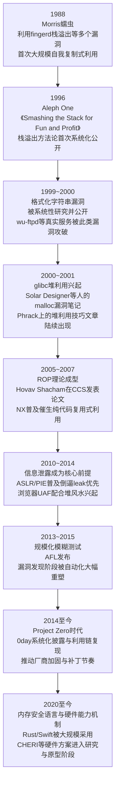
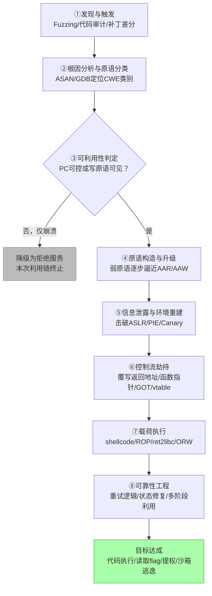
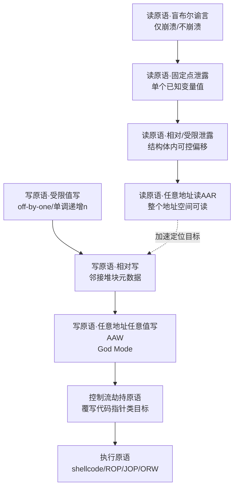
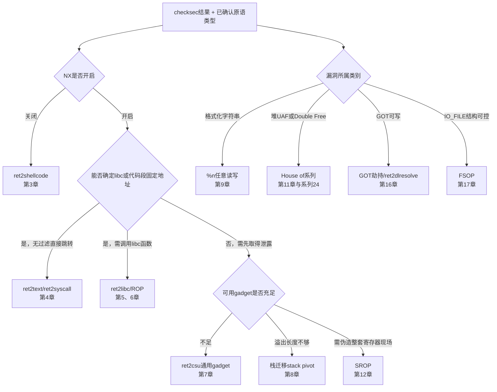

# 二进制漏洞与利用基础（1）· 内存破坏漏洞全景与利用链模型

> [!abstract] TL;DR
> - 内存破坏漏洞的本质，是**空间安全、时间安全、类型安全**三条不变式中至少一条被打破；CWE-787（越界写）、CWE-416（UAF）等编号是这些不变式违反的标准化坐标，而不是彼此孤立的手法清单。
> - 一次完整的利用不是"找到漏洞就等于拿到 shell"，而是一条从触发到目标达成的**多阶段链条**：发现与触发 → 原语分类 → 可利用性判定 → 原语升级 → 信息泄露 → 控制流劫持 → 载荷执行 → 可靠性工程；本系列第 2–22 章都是这条链条上某一环节的纵深展开。
> - **读 / 写 / 执行原语**是贯穿全系列的统一词汇表：任何具体漏洞（栈溢出、堆溢出、UAF、格式化串、整数溢出）最终都要被"翻译"成有限的几种原语——受限读→任意地址读（AAR）、受限写→任意地址任意值写（AAW）、代码指针劫持、执行原语——原语强度的逐级升级才是利用开发真正的工作量所在。
> - 缓解机制（NX/ASLR/Canary/RELRO/CFI/CET）精确地在利用链的某个阶段设卡：理解了阶段模型，就理解了每一种缓解机制到底挡住了什么、又为何仍有残余风险，详见系列 34。
> - "weird machine"（怪异机器）理论把 ROP/JOP 等代码复用技术统一解释为"用漏洞原语对目标程序里一台隐藏的、非预期的指令集编程"，是理解现代二进制利用本质最有解释力的视角。

---

## 概述与定位

### 本篇要解决的问题

《二进制漏洞与利用基础》系列共 22 章，从第 2 章开始，每一章都会讲一种具体的漏洞类型或一种具体的利用技术——栈溢出、shellcode、ret2libc、ROP、格式化字符串、堆漏洞、GOT 劫持……如果没有一个统一的框架，这 21 章很容易被读成 21 个互不相干的"奇技淫巧"清单，背下每一个的操作步骤，却答不上来"这些技术之间到底是什么关系""下一个没见过的 CTF 题该往哪个方向想"。

本篇的任务不是演示任何一种具体的漏洞或利用手法（那是第 2 章起的工作），而是先把"地基"打好：给出一套贯穿全系列的**分类学（漏洞类型学）**、**流程模型（利用链阶段）**和**能力词汇表（读/写/执行原语）**。这三者合起来，构成一张可以随时回来查阅的地图——遇到任何具体技术时，都能立刻定位"这属于地图上的哪一块"，理解它解决的是链条上哪一步的问题、需要哪一级强度的原语作为前提、又会被哪一类缓解机制拦截。

读者应当已经具备进程内存布局、ELF 基本结构、函数调用约定方面的基础知识；若不熟悉，建议先补充 [[11.ELF文件详解/17.got节|ELF 与 GOT/PLT]]、[[22.调用规约/06.SystemV_AMD64调用规约|调用规约]] 等前置章节。本系列聚焦**用户态**漏洞与利用；同一套读/写/执行原语模型向内核态的延伸——特权原语、内核对象 UAF、SMEP/SMAP 绕过——见 [[52.Linux内核机制与内核利用/00.Linux内核机制与内核利用总览]]，本篇不展开。

### 在系列中的位置：一张地图，21 次深入

下表把本系列全部 22 章标注到本篇即将建立的模型坐标上，读者可以在读完本篇后，按自己感兴趣的环节挑选后续章节，而不必严格线性通读：

| # | 章节 | 对应本章模型中的位置 |
|---|---|---|
| 01 | 内存破坏漏洞全景与利用链模型 | 本篇——建立类型学、阶段模型与原语词汇表 |
| 02 | 栈溢出原理与经典利用 | 空间安全违例（栈）→ 控制流劫持原语的最初形态 |
| 03 | shellcode 编写与 ret2shellcode | 执行原语（代码注入型） |
| 04 | 返回导向：ret2text 与 ret2syscall | 执行原语（代码复用，免泄露前提场景） |
| 05 | ret2libc | 执行原语（代码复用）+ 信息泄露阶段 |
| 06 | ROP 入门 | 执行原语（"weird machine" 编程的雏形） |
| 07 | ROP 进阶：ret2csu 与通用 gadget | 执行原语的升级（gadget 稀缺场景） |
| 08 | 栈迁移与 stack pivot | 控制流劫持原语的空间扩展 |
| 09 | 格式化字符串漏洞 | 读原语 + 写原语（`%s`/`%n` 直接产生原语） |
| 10 | 整数溢出与类型转换缺陷 | 原语的间接生成源（污染 size/index） |
| 11 | 堆漏洞类型：UAF 与 double-free 与 OOB | 时间 + 空间安全违例，原语升级的主战场 |
| 12 | SROP 信号帧伪造 | 执行原语（伪造整套寄存器现场） |
| 13 | JOP 与 COP | 执行原语（CFI 存在时的劫持变体） |
| 14 | Canary 泄露与绕过 | 信息泄露阶段 × 控制流劫持前置条件 |
| 15 | ASLR 与 PIE 绕过技术 | 信息泄露阶段 |
| 16 | GOT 劫持与 ret2dlresolve | 控制流劫持原语（代码指针目标） |
| 17 | IO_FILE 结构利用与 FSOP | 控制流劫持原语（vtable 类目标） |
| 18 | one_gadget 与 magic_gadget | 执行原语的构造捷径 |
| 19 | ORW 与读取 flag | 载荷执行阶段的最小化目标 |
| 20 | seccomp 沙箱与逃逸 | 载荷执行阶段的约束突破 |
| 21 | ARM64 与 MIPS 架构利用差异 | 模型的跨架构泛化 |
| 22 | 利用开发工具链：pwntools 与 ROPgadget | 全链条的工程化支撑 |

### 预备知识与边界声明

本篇不包含任何可直接编译运行的漏洞样例或 exploit 脚本——具体的触发代码、payload 构造从第 2 章开始逐章给出。本篇的交付物是概念模型本身：读完之后，读者应当能够看着一份陌生的 CTF pwn 题目或一份崩溃报告，说出"这大概率能升级到什么原语、大致要走哪条技术路线"，而不必等到通读完全部 21 章具体技术之后才具备这种判断力。

---

## 原理与机制

### 为什么 C/C++/汇编的世界会产生内存破坏

内存破坏漏洞几乎是 C、C++ 与手写汇编这类"贴近机器"语言的固有特征，根源在于这些语言把内存安全的责任完全交给了程序员，而编译器和 CPU 都不会在运行时替程序员兜底：

- **指针即整数**：一个指针在机器层面只是一个可以做加减法的数值，CPU 的 `mov`/`load`/`store` 指令不知道、也不关心这个地址是否落在某个对象的合法范围内。
- **数组无边界元数据**：`char buf[16]` 在编译后就是栈帧里的一段偏移量，没有任何随行的"长度"信息跟着这块内存一起被检查；越界访问在机器层面和合法访问执行的是完全相同的一条 `mov` 指令。
- **手工生命周期管理**：`malloc`/`free` 把"这块内存现在是否有效"的判断责任交给程序员的心智模型，而不是语言运行时；一旦心智模型与实际控制流不同步（忘记置空、多线程竞争、复杂的所有权转移），悬垂指针就会出现。
- **变长参数与格式串**：`printf` 系列函数的参数数量和类型完全由格式串这个"数据"决定，这是一种将控制信息和数据混在同一个信道里传递的设计，天然存在信任错位的空间。

这不是某个具体实现的疏忽，而是这些语言在设计之初，为了追求与硬件贴近的高性能和高灵活性所做的取舍——在这些语言诞生的年代，边界检查的运行时开销被认为是不可接受的，威胁模型也远不如今天严峻。理解这一点很重要：内存破坏漏洞不是"程序员犯的一个个孤立错误"，而是语言设计与运行时模型必然会持续产生的一类问题，这也是为什么近十年安全社区的结构性应对是**转向内存安全语言**（Rust 的所有权与借用检查器在编译期强制空间与时间安全、Go/Java/Swift 在运行时做边界检查并配合垃圾回收），而不是指望在 C/C++ 里把每一个具体漏洞都找光。

### 三条内存安全不变式

几乎所有内存破坏类漏洞，都可以归纳为对下面三条不变式中至少一条的违反，这也是本篇漏洞类型学的分类主轴：

- **空间安全（Spatial Safety）**：一次访问必须落在某个已分配对象的 `[base, base+size)` 范围内。越界读写（栈溢出、堆溢出、数组越界索引）都是对空间安全的违反。
- **时间安全（Temporal Safety）**：一次访问必须发生在对象的生存期 `[分配, 释放)` 之内。UAF、double free、未初始化内存使用都是对时间安全的违反。
- **类型安全（Type Safety）**：一段内存必须按照它被创建时的类型来解释。联合体类型双关、C++ 对象在错误的虚表假设下被调用，都是类型安全违反的例子。

这三条不变式在源码层面往往由程序员的"隐含约定"来维持（"这个指针 free 之后我保证不会再用它"），却没有任何编译器或运行时机制强制校验。格式化字符串是一个稍微特殊的类别——它违反的不是内存本身的空间/时间/类型不变式，而是**控制与数据分离**的不变式（格式串本应是纯粹的控制信息，却被允许来自不可信数据），因此本篇把它单独归为第四类"控制数据混淆"。

### 内存破坏利用技术的演进年表

漏洞类型本身并不会随时间改变，但"如何把一个原始漏洞变成可用的利用"这件事，是攻防双方三十多年博弈的结果。了解这条时间线，有助于理解为什么现代利用普遍围绕"信息泄露优先"展开，而不是直接覆盖返回地址：



这条年表的规律很清楚：每当一类原始漏洞被"利用套路化"，防御方就会针对该套路的关键前提上锁（NX 锁住"直接执行注入代码"这一环，ASLR 锁住"地址可预测"这一环），而攻击技术又会针对新增的前提条件继续演化（ROP 绕开 NX，堆风水+信息泄露绕开 ASLR）。这一整条演进史，恰好就是本篇即将给出的"利用链阶段模型"在历史维度上的展开——每一代新技术，本质上都是在链条的某一个具体阶段上找到了新的可行路径。

### 腐蚀与崩溃之间的时间差

内存破坏之所以比逻辑漏洞更难分析，还有一个常被忽视的原因：**内存被破坏的那一刻，程序往往不会立刻崩溃**。一次堆溢出可能只是悄悄改写了相邻 chunk 的一个字段，程序会带着这个"已损坏但尚未触发异常"的状态继续运行很长时间，直到若干次分配、释放之后，某个完全无关的代码路径读到了被污染的数据才最终崩溃——这时候崩溃点的调用栈往往和真正的漏洞点相去甚远，给根因定位带来极大困难。这正是 ASAN（AddressSanitizer）这类工具存在的意义：通过在每个对象周围插入"红区"并保持中毒状态，把"损坏发生"和"检测到损坏"这两个时间点尽可能拉近，工具链层面的具体用法见后文"工具视角与实战"。理解这个时间差，也解释了为什么单纯靠观察"程序在哪崩溃"来判断漏洞类型是不可靠的，必须结合动态插桩或原语分类方法论来倒推真正的原始违例点。

---

## 漏洞类型学与原语升级详解

### 漏洞类型学：三类不变式产出的漏洞族谱

把上一节的三条不变式（加上控制数据混淆这一特殊类）铺开，就得到了内存破坏漏洞的完整分类学。下表同时标注了 MITRE CWE 编号（便于与漏洞库、扫描工具的输出对照）与本系列对应的深入章节：

| 违反的不变式 | 漏洞类别（CWE 编号） | 典型触发部位 | 本系列深入章节 |
|---|---|---|---|
| 空间安全 | 栈缓冲区溢出（CWE-787 / CWE-121） | 栈 | 第 2 章 |
| 空间安全 | 堆缓冲区溢出（CWE-787 / CWE-122） | 堆 | 第 11 章 |
| 空间安全 | 全局 / BSS 溢出（CWE-787） | `.data` / `.bss` | 随第 2、11 章原理旁及，无独立专章 |
| 空间安全 | 越界数组索引（CWE-125 / CWE-787） | 栈 / 堆 / 全局 | 第 10 章（整数类根因） |
| 空间安全 | 差一错误 off-by-one（CWE-193） | 多见于堆 | 第 11 章 |
| 时间安全 | 释放后使用 UAF（CWE-416） | 堆 | 第 11 章 |
| 时间安全 | 重复释放 Double Free（CWE-415） | 堆 | 第 11 章 |
| 时间安全 | 未初始化内存使用（CWE-457 / CWE-908） | 栈 / 堆 | 随第 11 章旁及 |
| 类型安全 | 类型混淆（CWE-843） | 堆对象 / 虚表 | 本系列不展开，深入见系列 54 |
| 控制数据混淆 | 格式化字符串（CWE-134） | 任意可达内存 | 第 9 章 |
| 间接根因（放大器） | 整数溢出 / 符号错误 / 截断（CWE-190 / CWE-191 / CWE-681） | 任意（污染 size/index） | 第 10 章 |

需要特别说明整数问题这一行的定位：它本身并不直接构成一次越界访问，而是一个"放大器"——`malloc(a * b)` 中 `a * b` 溢出成一个很小的值、`memcpy(dst, src, len)` 中 `len` 因有符号数取反变成一个巨大的正值，都是整数缺陷把攻击者的输入转化为空间安全违例的经典路径。这也是为什么整数溢出经常被称为"漏洞的漏洞"——它自己很少直接产生原语，却是很多真实世界高危漏洞链条的第一环。

业界统计也印证了这张表的重要性：微软与 Google 近年的安全报告反复披露，其各自代码库中约 70% 的高危 CVE 根因都属于内存安全问题；MITRE 近年发布的 CWE Top 25 榜单中，CWE-787（越界写）也多次位居榜首。这说明内存破坏并不是一个边缘话题，而是二进制安全的主战场，这也是本系列以此为切入点的原因。

### 利用链的八阶段模型

有了漏洞分类，下一步是理解"从一个原始漏洞到一次完整利用"要走过哪些阶段。本篇把这一过程抽象为八个阶段——这是一个教学用的合成模型，用来串联本系列各章，而非某个不可更改的行业标准流程；真实工作中相邻阶段常常交织甚至反复：



逐阶段展开：

- **①发现与触发**：靠模糊测试（详见系列 49）、人工代码审计或补丁差分找到一个能稳定触发异常行为的输入。这一阶段的产出只是"崩溃"或"异常"，还谈不上任何原语。
- **②根因分析与原语分类**：用 ASAN/GDB 等工具把崩溃现场翻译成本篇类型学表格里的具体一行——是哪一种不变式违反、越界了几个字节、方向是读还是写。
- **③可利用性判定**：并非所有崩溃都值得继续投入——如果既不能控制 PC，也看不到任何可控的写入目标，这个漏洞大概率只能停留在拒绝服务层面。这是一个经常被低估的分岔点，后文"安全性与正确使用"会专门讨论把它轻易归为"低危"的风险。
- **④原语构造与升级**：把③判定为"有戏"的原始能力，通过精心构造的分配/释放序列或结构体布局，逐级升级为更强的原语，这是整个利用开发耗时最长、也最考验功力的一步，下一小节详细展开。
- **⑤信息泄露与环境重建**：现代目标普遍开启 ASLR/PIE，攻击者必须先拿到某个模块的基址（libc、堆、二进制本身、栈）才能计算出后续要用到的绝对地址。这一步并不一定排在④之后——很多时候，④升级出的读原语本身就是这一步的泄露手段，两者互为因果。
- **⑥控制流劫持**：用已经拿到的写原语覆盖某个"代码指针类"目标，让程序在某个时刻跳转到攻击者选择的地址。可选目标包括栈上保存的返回地址、结构体或全局区的函数指针、C++ 虚表指针、GOT 表项、`IO_FILE` 的 vtable 等，具体在第 2、16、17 章展开。
- **⑦载荷执行**：控制流被劫持之后，真正"做事"的一步——注入 shellcode、拼接 ROP/JOP 链调用 libc 函数、或者只完成一次最小化的 open-read-write（详见第 3、5、6、19 章）。
- **⑧可靠性工程**：教学环境里经常被忽略，却在真实攻防和高难度 CTF 中往往决定成败——堆布局噪声、ASLR 每次重随机化、多线程竞争都可能让一次"本地跑通一次"的利用链在目标环境下大概率失败，需要重试逻辑、爆破窗口控制、状态自恢复等工程手段。

### 读 / 写 / 执行原语分级

如果说八阶段模型回答的是"利用开发要走哪些步骤"，那么原语分级回答的是这句话里最关键的一步——"④原语构造与升级"——具体在升级什么。本篇把原语按能力强度分为读、写两条独立的阶梯，外加控制流劫持与执行两个"兑现"环节：



读原语分级：

| 级别 | 能力描述 | 典型来源 |
|---|---|---|
| L0 盲谕言 | 只能获得"崩溃/不崩溃"或响应是否变化等布尔信号，拿不到具体内存内容 | 基于分支条件的旁路信道、部分覆盖后的行为差异 |
| L1 固定点泄露 | 能读到一个位置固定、内容不可选的值 | 打印固定全局变量、崩溃回显里固定出现的栈内容 |
| L2 相对 / 受限泄露 | 能读某个基址附近、偏移受限的一段内存 | 堆题目中"查看"接口在本 chunk 内越界读、格式串在有限参数槽范围内的泄露 |
| L3 任意地址读 AAR | 地址完全由攻击者指定，返回原始内容 | 格式串 `%s` 配合可控参数槽偏移、构造出的伪造对象读接口 |

写原语分级：

| 级别 | 能力描述 | 典型来源 |
|---|---|---|
| W0 受限值写 | 只能写固定值或固定含义的字节，比如只能清零或只能单调递增 | off-by-one 产生的空字节截断、`%n` 的单调计数写 |
| W1 相对写 | 能写自己控制的对象附近的元数据，指不到任意远端地址 | 堆块 `size`/`fd`/`bk` 字段覆盖、链表指针污染 |
| W2 任意地址任意值写 AAW | 地址与内容均完全自由，是利用链追求的终极形态 | tcache poisoning 后的 `malloc` 返回值、fastbin attack 构造出的伪造 chunk |

需要提醒的边界与陷阱：并非每一个原始漏洞都能一路升级到 L3/W2——很多弱原语受限于程序自身的业务逻辑（比如只有一次分配机会、没有可控的读取回显通道），永远到不了任意读写。能否找到升级路径、升级路径有多短，正是 CTF pwn 题目难度分级的核心维度，也是评估一份真实漏洞报告实际风险的关键问题。

### 原语升级实例：一条抽象利用链走查

下面用一条完全抽象、不针对任何具体真实二进制的示例，走查一次典型的堆漏洞原语升级路径，帮助把上面两张图的概念串成一条线。其中的堆块结构与合并规则详见 [[24.内存管理与堆分配器/06.ptmalloc2的chunk结构]]，空闲链表投毒机制详见 [[24.内存管理与堆分配器/08.tcache机制]]，完整的手法族谱见 [[24.内存管理与堆分配器/17.堆利用手法体系House_of系列]]；覆盖控制流目标时用到的 GOT 结构详见 [[11.ELF文件详解/17.got节]]，载荷执行阶段的传参约定详见 [[22.调用规约/06.SystemV_AMD64调用规约]]。

```text
① 原始漏洞能力（W0）
   堆块用户数据区之后可溢出 1 字节，且该字节固定为 \x00
   （典型 off-by-one，如循环写入时的差一错误）

② 原语升级第一跳（W0 → W1）
   \x00 恰好落在下一个 chunk 的 size 字段最低位
   → 清除 PREV_INUSE 标志位，size 语义被篡改
   → free() 时与上一个 chunk 触发合并（chunk 结构与合并规则见前文链接）
   → 两个逻辑对象在物理内存上产生重叠（overlapping chunk）

③ 原语升级第二跳（重叠 → 局部读写雏形）
   对"外层" chunk 的写操作同时改写了仍在使用的"内层" chunk 数据，
   包括内层对象自身保存的堆指针；
   业务原有的查看/编辑接口此刻已等价于对任意地址的读写

④ 原语升级第三跳（→ 完整 AAW）
   利用单向空闲链表结构，将被污染的 fd 指针指向目标地址，
   再连续两次分配：第二次分配的返回值就是目标地址本身，
   此后对该块的任何写入即等价于向目标地址任意写

⑤ 兑现为控制流劫持
   用 AAW 覆盖一个代码指针类目标（如 GOT 表项或 IO_FILE vtable），
   该表项下一次被间接调用时，PC 被完全接管

⑥ 载荷执行
   按目标架构的调用规约布置好参数寄存器，
   跳转至 one_gadget 或已知的 system 型函数完成最终目标
```

这条链条的每一跳，都恰好对应本篇原语分级图里的一条边——这也是为什么第 11 章与系列 24 的 House of 系列技术，本质上都是在"如何从 W0/W1 更快、更稳地跳到 W2"这一个问题上给出的不同答案。

### weird machine：把利用理解为"对隐藏指令集编程"

计算机安全研究者 Sergey Bratus 等人在 2011 年提出了 "weird machine"（怪异机器）理论，为现代二进制利用提供了一个颇具解释力的统一视角：程序在其正常语义之外，内存布局与指令编码本身构成了一台隐藏的、非预期的"计算机"，而内存破坏漏洞正是进入这台隐藏机器的输入通道。一旦攻击者获得了足够强的读写原语，就相当于获得了对这台怪异机器的编程权——ROP 链是最典型的例子：每一个 gadget 相当于这台机器的一条"指令"，栈上精心排布的返回地址序列相当于"程序"，栈指针则扮演了这台隐藏机器的"程序计数器"角色。

这个视角有力地解释了为什么形形色色的具体漏洞（栈溢出、堆溢出、格式化串）一旦被原语化，最终会收敛到同一套通用利用手法（ROP/JOP/ret2libc）——因为它们瞄准的是同一台怪异机器，只是进入它的"门票"（原语的获取方式）不同。理解这一点，也解释了为什么单纯"打补丁修复一个具体的溢出点"并不能从根本上消除风险：只要空间/时间/类型安全不变式在语言层面得不到强制，任何一个新的内存破坏漏洞都可能成为通往同一台怪异机器的又一扇新大门，这也是本系列反复强调"理解原理而非死记步骤"的原因。

---

## 工具视角与实战

### 静态视角：从代码/反编译定位原语候选

在能拿到源码时，代码审计的目标本质上是把前文的漏洞类型学"倒过来用"——像编译器一样扫描每一条可能违反三条不变式的语句：未做长度校验的 `memcpy`/`strcpy`/`sprintf`/`gets`、`malloc(a * b)` 这类可能整数溢出的尺寸计算、`free` 之后未置空又可能被再次使用的指针、格式化函数里格式串参数本身来自外部输入、有符号变量被直接用作数组下标或长度参数。CodeQL、Clang Static Analyzer、Cppcheck 等工具本质上是把这些危险模式编码成了可自动化执行的查询规则，但静态工具的召回率有限，尤其是跨函数、跨文件的对象生命周期追踪（UAF 判定）至今仍是公认的难题。

在只有二进制、需要逆向的场景下（本知识库的常态），IDA/Ghidra/Binary Ninja 反编译之后关注的信号会略有不同：栈帧里局部缓冲区与保存寄存器/返回地址之间的相对偏移（判断溢出能否触达控制数据）、堆块分配与释放调用点是否配对、是否存在明显的用户可控长度参数被直接传入拷贝类函数、`.got.plt` 段是否只读（这直接决定 GOT 是否还是一个可行的劫持目标，即 Full RELRO 与否）。

### 动态视角：从崩溃现场读出原语类型

静态审计只能发现"候选"，真正确认一个漏洞的原语强度必须依靠动态验证。ASAN/UBSAN 在编译期插桩，为每次分配的对象两侧加上处于"中毒"状态的红区，一旦越界访问红区或访问已释放对象，会在损坏发生的瞬间精确报告——这直接解决了前文"腐蚀与崩溃存在时间差"的问题，把诊断粒度从"进程最终在哪里挂掉"提升到"哪一条指令、读还是写、越界了几个字节"。gdb 配合 pwndbg/gef 等插件，可以在真正的 `SIGSEGV` 现场直接检查：程序计数器是否已经变成了攻击者填入的值（若是，说明控制流原语已经直接拿到手）、出错指令究竟是读还是写、出错地址是否等于某个可预测的、攻击者填入的探测模式（如经典的 `0x41414141` 探测法）。`checksec` 回答的是另一个问题——不是"这个漏洞给了我什么原语"，而是"目标开了哪些防护"，这直接决定了原语升级之后应该走下面决策树的哪一条分支。

### 决策树：约束条件到技术路线到章节导航

下图把"已确认的原语类型"与"checksec 反映出的防护开关状态"结合起来，映射到本系列后续具体技术所在的章节，可以作为读完本篇之后挑选下一步阅读顺序的向导：



需要提醒的陷阱：这张决策树给出的只是"常见路径"，不是穷举规则。真实题目经常需要交叉组合多种技术——例如 ret2csu 本身就是 ROP 的一种特化用法，stack pivot 常常是打通 ROP 链长度限制的前置步骤而非独立终点，工程实践中很少有题目严格落在图中某一条单一分支上。

### CTF pwn 通用工作流速查

| 步骤 | 典型工具 | 产出 |
|---|---|---|
| 识别文件与保护 | `file`、`checksec` | 架构、位数、五项缓解开关状态 |
| 静态定位漏洞候选 | IDA / Ghidra / Binary Ninja | 危险函数调用点、栈帧与堆操作模式 |
| 动态复现与分类 | gdb + pwndbg/gef、ASAN | 原语类型（读/写/劫持）与强度级别 |
| 原语升级 | 手工推导 + 本系列对应章节技术 | 达到 AAR/AAW 或直接完成控制流劫持 |
| 编写利用 | pwntools | 可重放、可脚本化的攻击载荷（详见第 22 章） |
| 本地/远程验证 | pwntools 的进程/远程连接封装 | 稳定复现，处理噪声与重试 |

---

## 安全性与正确使用

> [!caution] 适用范围与合规边界
> 本文（含全系列）仅面向自有环境、经授权的靶场与 CTF 比赛、以及安全研究学习使用。文中的"原语升级""利用链"均为原理性、防御导向的概念模型，不包含任何针对真实生产系统或他人系统的可直接套用的武器化步骤，也不为绕过任何商业软件的授权或版权保护机制提供帮助。请勿将本文内容用于未经授权的测试；对任何真实系统开展安全测试之前，都必须先取得书面授权。

### 防御视角：原语模型如何反哺代码审计与应急响应

把"这个漏洞能产生什么原语"作为审计与分诊的第一问题，恰恰是攻防双方共享的方法论——防守方评估一份漏洞报告的真实风险时，同样需要判断它能否被升级为 AAR/AAW，进而决定 CVSS 评分与修复优先级，而不是仅凭 CWE 类别或"是否崩溃"来草率定级。很多安全团队的漏洞分诊流程明确借用了攻击者的原语升级思路——"这只是一次越界读，但能读到多远？能不能碰到返回地址或堆指针？"——用攻击者视角反推补丁的紧迫程度，这正是理解本章模型的现实价值所在，而不仅仅是为了写 exploit。同样，在代码评审阶段，凡是涉及裸指针运算、手工长度计算、`free` 后指针未置空、格式串参数来自外部输入的代码段，都应当被当作原语候选重点复核。

### 常见误区与失败模式

一个常见的错误认知，是把"仅崩溃、未证明可控 PC"的缺陷直接归类为低危——历史上大量最初被判定为"仅可能导致拒绝服务"的缺陷，在后续研究者引入新的原语升级技巧（更精细的堆布局控制、新发现的可劫持代码指针类目标）之后被重新证明可以升级为完整的远程代码执行。这也是为什么现代漏洞管理流程越来越倾向于"先按可能达到的最坏原语定级，再随修复窗口持续复核"，而不是"看到只是崩溃就轻描淡写"。另一个常见的工程误区，是把 exploit 的"本地一次成功"直接等同于"可靠利用"——真实环境中的堆布局噪声、ASLR 每次重随机化、多线程竞争都会让一条未经可靠性工程打磨的利用链在生产条件下大概率失败，这也是为什么八阶段模型里的第⑧阶段在教学场景中常被忽视，却在真实攻防和高难度 CTF 中往往是决定成败的最后一环。

### 合规与免责

在中国大陆开展任何形式的授权渗透测试或攻防演练，均应遵循《中华人民共和国网络安全法》《中华人民共和国数据安全法》及相关行业规范，在书面授权范围内开展工作；CTF 比赛环境与真实生产环境在授权边界上有本质区别，任何情况下都不应混淆两者，也不应把针对靶场/CTF 题目的技巧未经授权地施加于真实系统。

---

## 小结

- 内存破坏漏洞的本质可以还原为三条不变式（空间安全、时间安全、类型安全）中至少一条被打破，CWE 体系提供了标准化的分类坐标，而不是彼此孤立的手法清单；格式化字符串作为控制数据混淆类单列。
- 一次完整的利用不是单点技巧，而是"发现 → 根因与原语分类 → 可利用性判定 → 原语升级 → 信息泄露 → 控制流劫持 → 载荷执行 → 可靠性工程"八阶段链条，本系列第 2–22 章都是链条上某个环节的纵深展开。
- 读 / 写 / 执行原语及其强度分级（盲谕言 → 固定点 → 相对/受限 → 任意地址）是贯穿全系列的统一词汇表：任何具体漏洞最终都要被翻译为这套原语，原语的层层升级才是利用开发真正的工作量所在。
- weird machine 理论把 ROP/JOP 等代码复用技术解释为"对程序里一台隐藏指令集编程"，说明了为何不同类别的原始漏洞最终会收敛到同一套通用利用手法。
- 缓解机制精确地在链条的某个阶段设卡（NX 挡执行原语的直接注入、ASLR 挡信息泄露前的地址假设、Canary/RELRO/CFI 挡特定的控制流劫持路径），理解链条即理解防御，详见系列 34。
- 下一章将把本章的模型第一次落到具体技术上：从最基础的栈空间安全违例讲起，讲清栈帧结构、返回地址覆盖与经典栈溢出利用的完整过程。

---

## 相关阅读

- [[00.二进制漏洞与利用基础总览|系列总览]]
- [[34.现代二进制防护机制/00.现代二进制防护机制总览|系列34·现代二进制防护机制总览]]——本章"利用链阶段模型"的防御对偶
- [[24.内存管理与堆分配器/06.ptmalloc2的chunk结构|ptmalloc2的chunk结构]]——堆原语升级依赖的数据结构基础
- [[24.内存管理与堆分配器/08.tcache机制|tcache机制]]——AAW 原语最经典的构造路径之一
- [[24.内存管理与堆分配器/17.堆利用手法体系House_of系列|堆利用手法体系House_of系列]]——原语升级链的系统化手法集
- [[11.ELF文件详解/17.got节|got节]]——控制流劫持原语的经典目标结构
- [[22.调用规约/06.SystemV_AMD64调用规约|SystemV_AMD64调用规约]]——执行原语（ret2libc/ROP传参）必须遵守的ABI约束
- [[52.Linux内核机制与内核利用/00.Linux内核机制与内核利用总览|系列52·Linux内核机制与内核利用总览]]——同一原语模型向内核态的延伸
- MITRE CWE（Common Weakness Enumeration）——CWE-787/416/415/134/190/843 等条目的官方定义与分类
- Aleph One, "Smashing the Stack for Fun and Profit", *Phrack* 49, 1996
- Hovav Shacham, "The Geometry of Innocent Flesh on the Bone: Return-into-libc without Function Calls (on the x86)", ACM CCS, 2007
- Sergey Bratus et al., "Exploit Programming: From Buffer Overflows to Weird Machines and Theory of Computation", *;login:*, USENIX, 2011
- SEI CERT C Coding Standard——内存安全相关规则条目

---

[[00.二进制漏洞与利用基础总览|⬆ 系列总览]] | [[02.栈溢出原理与经典利用|→ 下一章]]