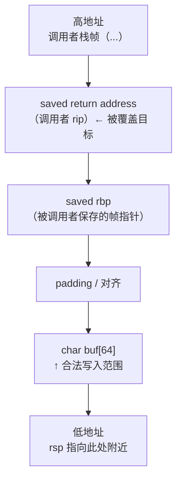
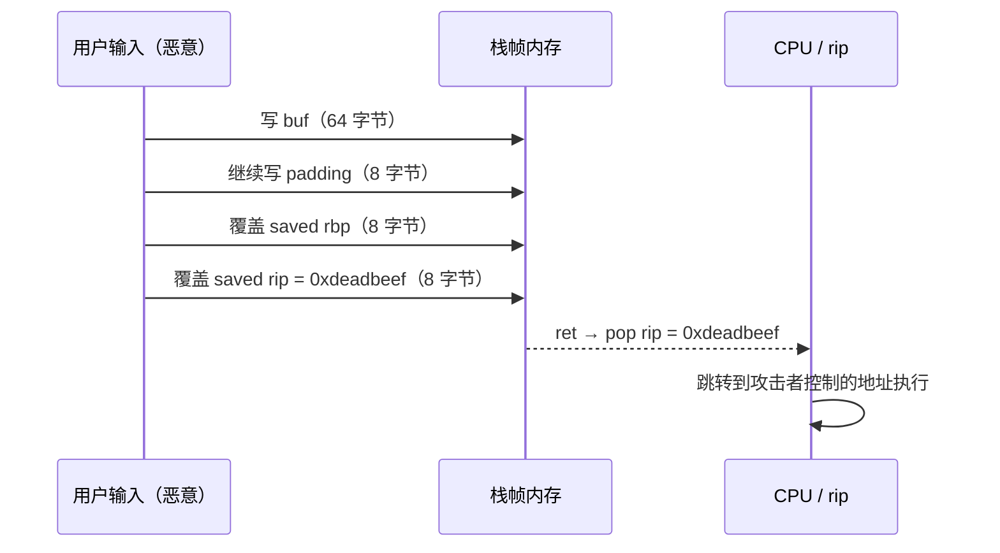
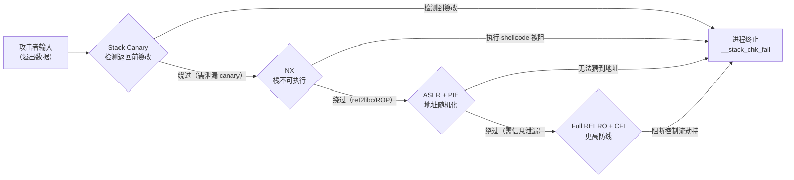

# 二进制漏洞与利用基础（2）· 栈溢出基础

> [!abstract] TL;DR
> - **根因**：C 语言标准库中的若干函数（`gets`、`strcpy`、`scanf("%s",…)` 等）向缓冲区写入时不检查长度，当输入超出缓冲区边界，多余的字节会**向高地址方向**顺序覆盖同一栈帧乃至上层栈帧的内容，直到触碰**保存的返回地址（saved return address）**。
> - **影响**：攻击者精准控制覆盖长度，可将返回地址改写为任意值，从而在当前函数执行 `ret` 时将控制流劫持到任意代码位置——这是一切栈类漏洞利用的最基础形态。
> - **现代防御**：stack canary（金丝雀）、NX（不可执行栈）、ASLR/PIE（地址空间随机化）、安全编码函数、编译告警共同构筑纵深防线，详细原理见 [[03.Shellcode概念]]、[[04.栈Canary原理]] 及 [[34.现代二进制防护机制/00.现代二进制防护机制总览]]。
> - 本篇紧接 [[01.内存布局与漏洞概览]] 的内存模型，调用规约和栈帧结构参见 [[22.调用规约/00.总览.md]]、[[21.Asm/00 总览.md]]。

---

## 概述与定位

栈溢出（stack buffer overflow）是历史最悠久、被研究最透彻的内存安全漏洞之一。1988 年 Morris 蠕虫已将其武器化；1996 年 Aleph One 在 Phrack #49 发表《Smashing the Stack for Fun and Profit》将其系统化，此后数十年操作系统、编译器、C 运行时库才逐步把防线筑起来。

**漏洞本质**：栈上的缓冲区（数组）与函数的控制元数据（返回地址、帧指针）**紧邻存放**在同一块连续内存里；当程序信任外部输入大小时，写入操作会跨越数组边界，**用可控数据覆盖控制元数据**，进而改变程序执行路径。

---

## 原理与机制

### x86-64 栈帧布局

x86-64 System V ABI（Linux/macOS 默认 ABI）规定（详见 [[22.调用规约/00.总览.md]]）：

- 参数前六个整型/指针依次用 `rdi`、`rsi`、`rdx`、`rcx`、`r8`、`r9` 传递，多余的才入栈。
- `call` 指令将**调用点下一条指令的地址（返回地址）**压栈，然后跳转；`ret` 指令将栈顶弹回 `rip`，恢复执行。
- 被调函数通常以 `push rbp; mov rbp, rsp` 建立栈帧，用 `sub rsp, N` 为局部变量分配空间。

一个典型被调函数的栈帧（从低地址 → 高地址）：

```
低地址
┌──────────────────────────────────┐  ← rsp（栈顶）
│  局部变量、缓冲区（char buf[N]）   │
├──────────────────────────────────┤
│  可能的 padding / 对齐填充         │
├──────────────────────────────────┤
│  保存的 rbp（saved frame pointer）│  ← 8 字节
├──────────────────────────────────┤
│  返回地址（saved return address） │  ← 8 字节  ← 攻击目标
└──────────────────────────────────┘
高地址（调用者栈帧继续向上）
```

> **栈生长方向**：x86/x86-64 栈**向低地址生长**（每次 push/call，rsp 减小）。缓冲区在栈帧低地址端；返回地址在高地址端。溢出从低向高写，恰好从缓冲区漫向返回地址。

### Mermaid：栈帧布局与溢出覆盖示意



### 溢出如何覆盖返回地址

以 `gets(buf)` 为例：`gets` 一直读到换行符/EOF 才停，对目标缓冲区**没有任何长度检查**。

若 `buf` 位于 `rbp - 0x48`（即 `buf` 距保存的 rbp 偏移为 `0x48 = 72` 字节），则：

- 输入前 72 字节：填满 `buf`（含 padding）。
- 第 73–80 字节（偏移 72–79）：覆盖保存的 rbp（8 字节）。
- 第 81–88 字节（偏移 80–87）：**覆盖返回地址**（8 字节）。
- 此后：继续覆盖调用者的栈帧……

函数执行到 `ret` 时，弹出的 rip 已被改写为攻击者设定值，控制流被劫持。



---

## 最小教学 Demo

> [!warning] 教学环境声明
> 以下编译命令关闭了多项现代安全防护（stack canary、PIE、可执行栈）。**生产环境这些防护默认开启**，仅用于在隔离的教学/CTF 环境中复现漏洞原理。请勿对任何非授权系统使用。

### `vuln.c`

```c
/* vuln.c — 栈溢出教学 demo（最小化）
 * 故意使用不安全函数 gets()，仅用于理解漏洞成因
 */
#include <stdio.h>
#include <string.h>

void secret_function(void) {
    /* 在真实 CTF 中，这里可能打印 flag 或执行 shell */
    puts("[*] secret_function() called — control flow hijacked!");
}

void vulnerable(void) {
    char buf[64];          /* 缓冲区只有 64 字节 */
    printf("Input: ");
    gets(buf);             /* 危险：无长度检查，超出即溢出 */
    printf("You entered: %s\n", buf);
}

int main(void) {
    vulnerable();
    puts("Normal exit.");
    return 0;
}
```

### 教学编译命令

```bash
# 关闭 stack canary、关闭 PIE、开启可执行栈（教学环境 only）
gcc vuln.c -o vuln \
    -fno-stack-protector \   # 关闭 stack canary（金丝雀）
    -no-pie \                # 关闭地址空间随机化（固定加载地址）
    -z execstack \           # 允许栈可执行（复现注入 shellcode 场景）
    -g                       # 保留调试信息，方便 gdb 观察
```

> 生产构建默认相当于加上 `-fstack-protector-strong`（canary）、`-pie -fPIE`（PIE）、`-z noexecstack`（NX）。

---

## 利用思路（原理层，不武器化）

栈溢出的利用核心是将"数据"写成"控制流"：

1. **定位偏移量**：确定缓冲区起始位置到返回地址之间的字节距离（offset）。常用方法：
   - 用 `cyclic` 模式串（`pwntools cyclic(200)`）触发崩溃，从 core dump 中读崩溃时 `rsp` 附近的值，反查偏移。
   - 直接从源码/反汇编计算：`buf` 相对 `rbp` 的偏移 + 8（saved rbp）= 覆盖到返回地址所需字节数。

2. **控制返回地址**：将第 `offset+1` 到 `offset+8` 字节设为目标地址（教学 demo 即 `secret_function` 的地址）。

3. **后续利用方向**（原理了解）：
   - **ret2shellcode**：返回地址指向栈上/堆上的 shellcode（需 NX 未开启，见 [[03.Shellcode概念]]）。
   - **ret2libc / ret2win**：返回地址指向 libc 中的 `system("/bin/sh")`（绕过 NX，见 [[05.ret2libc]]）。
   - **ROP 链**：串联多个 gadget（`pop rdi; ret` 等）构造任意语义（见 [[06.ROP入门]]）。

> [!warning] 示例操作仅演示原理
> 下文 gdb 命令输出为**示意**，并非本机实际运行结果（本机 Windows）。

---

## 用 gdb 观察栈帧与覆盖

### 1. 查看栈帧布局

```text
(gdb) break vulnerable
(gdb) run
(gdb) info frame
Stack level 0, frame at 0x7fffffffe350:
 rip = 0x401175 in vulnerable (vuln.c:14); saved rip = 0x4011b2
 called by frame at 0x7fffffffe370
 Arglist at 0x7fffffffe340, args:
 Locals at 0x7fffffffe340, previous frame's sp is 0x7fffffffe350
(gdb) print &buf
$1 = (char (*)[64]) 0x7fffffffe300    # 示意地址
(gdb) print $rbp
$2 = (void *) 0x7fffffffe340          # 示意地址
# buf 起始到 rbp = 0x340 - 0x300 = 0x40 = 64 字节（示意，实际偏移取决于编译器对齐与是否插入 canary）
# rbp 到 saved rip = 8 字节
# 总偏移 = 64 + 8 = 72 字节后开始覆盖返回地址
```

> [!warning] 示例输出为示意
> 以上地址为教学示意值，真实运行时因 ASLR/PIE 不同而不同。

### 2. 输入 72+8 字节触发劫持

```text
(gdb) run <<< $(python3 -c "import sys; sys.stdout.buffer.write(b'A'*72 + b'\xcc\x11\x40\x00\x00\x00\x00\x00')")
# 0x4011cc = secret_function 地址（示意，需用 print &secret_function 取真实值）
[*] secret_function() called — control flow hijacked!
```

> [!warning] 示例输出为示意
> 地址 `0x4011cc` 为示意。实际操作需用 `(gdb) print &secret_function` 或 `readelf -s vuln | grep secret` 查真实地址（`-no-pie` 编译后地址固定）。

### 3. checksec 查保护状态

```bash
$ checksec --file=vuln
[*] '/tmp/vuln'
    Arch:       amd64-64-little
    RELRO:      Partial RELRO
    Stack:      No canary found        ← -fno-stack-protector 生效
    NX:         NX disabled            ← -z execstack 生效
    PIE:        No PIE (0x400000)      ← -no-pie 生效
```

> [!warning] 示例输出为示意
> 以上为教学编译参数下的预期输出示意。生产构建应看到 `Canary found`、`NX enabled`、`PIE enabled`。

---

## 缓解与防御

现代防御体系采用**纵深设计**：每一层独立作用，多层叠加使利用代价急剧上升。

### Stack Canary（金丝雀）

在返回地址的低地址侧（即 saved rbp 与局部变量之间）插入一个随机值（canary），函数返回前检查该值是否被篡改，若被改则立即终止进程（`__stack_chk_fail`）。

```
低地址
┌────────────────────────┐
│  char buf[64]          │
├────────────────────────┤
│  **canary（随机值）**  │  ← 溢出必须先覆盖此处
├────────────────────────┤
│  saved rbp             │
├────────────────────────┤
│  saved rip             │
└────────────────────────┘
高地址
```

- 编译器选项：`-fstack-protector`（轻量）/ `-fstack-protector-strong`（推荐）/ `-fstack-protector-all`（最严格）。
- 绕过前提与详细原理见 [[04.栈Canary原理]]。

### x86-64 红区（Red Zone）

在 System V x86-64 ABI（Linux/macOS）中，存在一个鲜为人知但对漏洞利用至关重要的规定：**叶函数（leaf function，即不调用任何其他函数的函数）可以直接使用 `rsp` 下方 128 字节的空间，而无需通过 `sub rsp, N` 调整栈指针**。这片区域称为**红区（red zone）**。

#### 叶函数不调整 rsp 的原因

常规函数在分配局部变量时必须先 `sub rsp, N`，因为任何时刻发生的中断或异常都可能在当前栈顶（`rsp`）以下写入数据（内核压栈 `ss/rsp/rflags/cs/rip`）。但 ABI 做了一个保证：**信号处理程序和异步事件在压栈前会先将 `rsp` 下调 128 字节越过红区**，因此叶函数可以把红区当作临时暂存区，免去调整 `rsp` 的开销。

```
正常栈帧（非叶函数）：

    高地址
    ┌─────────────────────┐
    │  saved return addr  │
    ├─────────────────────┤
    │  saved rbp          │
    ├─────────────────────┤
    │  局部变量            │  ← sub rsp, N 分配的空间
    └─────────────────────┘  ← rsp 指向此处
    
叶函数使用红区（rsp 不变）：

    高地址
    ┌─────────────────────┐
    │  saved return addr  │
    ├─────────────────────┤ ← rsp 始终指向此（即 saved ret addr 下方）
    │  ← 红区开始          │
    │  128 字节临时暂存区   │  ← 叶函数用 [rsp-8], [rsp-16] 等访问
    │  ← 红区结束（-128）  │
    └─────────────────────┘  ← rsp - 128
```

#### 对溢出布局的影响

当目标函数是叶函数且使用红区时，`rsp` 在整个函数执行期间**保持不变**，没有 `sub rsp, N` 指令。此时：

1. **GDB 调试时**：`info frame` 显示的 `rsp` 即函数返回地址的位置；局部变量通过 `rbp` 相对寻址或 `rsp` 负偏移寻址（`[rsp-N]`）。
2. **溢出偏移计算**：`cyclic` 模式字串触发崩溃后，从 core dump 中读到的 `rsp` 指向**保存的返回地址**（而非缓冲区），计算时需注意：`offset = &buf 距 rsp 的距离`，而非 `&buf 距 rbp - 8` 的距离（因为可能根本没有 `push rbp`）。
3. **无 saved rbp**：部分编译优化（`-O2` 以上）或叶函数省略帧指针（`-fomit-frame-pointer`），栈上根本没有 saved rbp 槽位——溢出计算不能假设"buf → padding → saved rbp → saved rip"的固定布局，需要通过 `objdump -d` 或 `gdb disassemble` 核实实际帧布局。

```bash
# 查看函数是否省略帧指针（叶函数 + -O2 常见）
objdump -d vuln | grep -A30 '<vulnerable>'
# 看 prologue 是否含 push rbp / mov rbp,rsp
# 若无 → 叶函数或帧指针省略，没有 saved rbp 槽位
```

#### 对信号处理的影响

在使用红区的叶函数**执行中途**若收到信号，内核在调用信号处理程序前需要保存当前上下文。内核**不会破坏红区**（ABI 保证），但信号处理程序的栈帧会建立在红区之下（`rsp - 128` 以下）。这意味着：

- 信号处理程序本身若有栈溢出，溢出方向向高地址，仍然可能踩到当前叶函数的返回地址（位于红区起点，即 `rsp[0]`）——但中间隔了整个红区的 128 字节。
- 在 CTF 场景中，若题目触发了 shellcode 执行且 shellcode 触发了信号（如 `SIGALRM`），需确认信号处理程序的栈是否与红区重叠。

> [!info] CTF 视角
> 遇到崩溃偏移计算对不上时，首先检查目标函数是否是叶函数（没有 `push rbp; sub rsp, N`）。若是，`cyclic` 找到的偏移直接就是 `buf` 到 `rsp[0]`（即返回地址）的距离，不需要再减去 `saved rbp` 的 8 字节。

### saved RBP 覆盖（frame pointer overwrite）

在溢出长度受限时（如 off-by-one：只能溢出 1 字节，或者受限溢出只能覆盖到 saved rbp 而无法完整覆盖 8 字节的返回地址），直接覆盖 saved RIP 并不总是可行。此时有另一条利用路径：**只改写 saved RBP 的低字节，借助 `leave; ret` 序列把 rsp 引导到可控区域**——这是**栈迁移（stack pivot）**的最简单雏形。

#### 前置知识：leave 指令的语义

x86/x86-64 中，函数 epilogue 通常是：

```asm
leave    ; 等价于 mov rsp, rbp; pop rbp
ret      ; 等价于 pop rip（从栈顶弹出返回地址）
```

`leave` 的执行步骤：
1. `mov rsp, rbp`：将 rsp 设为当前 rbp 的值（丢弃局部变量空间）。
2. `pop rbp`：从 rsp 弹出 8 字节存入 rbp，同时 rsp += 8。

执行完 `leave` 后，rsp 指向原来 saved rbp 上方 8 字节（即原来的 saved rip 位置），`ret` 随后弹出 rip。

#### off-by-one 改 saved rbp 低字节的效果

假设 buf 大小 `N` 字节，off-by-one 允许写入 `N+1` 字节：

```
溢出前栈布局：
    [buf: N 字节] [saved rbp: 8 字节] [saved rip: 8 字节]
                   ↑ 地址如 0x7ffe_0000_1140

off-by-one 写 N+1 字节（最后 1 字节覆盖 saved rbp 最低字节）：
    [AAAA...A: N 字节] [0x?? → 被改写的 saved rbp 低字节]

若原 saved rbp = 0x7ffe_0000_1140，将最低字节改为 0x00：
    新 saved rbp = 0x7ffe_0000_1100
```

函数执行到 `leave` 时：
1. `mov rsp, rbp`：rsp 被设为 `0x7ffe_0000_1100`（攻击者控制的值！）。
2. `pop rbp`：从 `0x7ffe_0000_1100` 弹出 8 字节给 rbp，rsp 变为 `0x7ffe_0000_1108`。
3. `ret`：从 `0x7ffe_0000_1108` 弹出值给 rip。

**关键点**：如果 `0x7ffe_0000_1108` 位于攻击者已经写入数据的 buf 区域内（低字节改写后的地址恰好落在 buf 范围），则 `ret` 弹出的 rip 就是攻击者的数据——**控制流被劫持，即使从未直接覆盖 saved rip**。

```
栈迁移雏形示意（off-by-one 改 saved rbp 低字节）：

  高地址
  ┌─────────────────────────────┐
  │  saved rip（未被覆盖）       │
  ├─────────────────────────────┤  ← 原 rbp 指向此
  │  saved rbp（低字节被改，     │
  │  新值 = 0x...XX00）          │
  ├─────────────────────────────┤
  │  buf[N-1]                   │  ← 新 rsp + 8 可能指向此区域
  │  ...（攻击者数据）            │
  │  buf[0]                     │
  └─────────────────────────────┘
  低地址
  
  leave: rsp ← 0x...XX00（rbp 新值）
         pop rbp ← [0x...XX00]（8 字节），rsp ← 0x...XX08
  ret:   rip ← [0x...XX08]  ← 若此处在 buf 内，攻击者控制 rip
```

#### 与 saved RIP 直接覆盖的区分

| 方式 | 溢出长度要求 | 典型场景 | 局限 |
|------|-------------|----------|------|
| 直接覆盖 saved RIP | `buf_size + 8（saved rbp）+ 8（saved rip）` 字节 | 标准栈溢出 | 需要足够大的溢出量 |
| saved RBP 低字节覆盖 | `buf_size + 1` 字节（off-by-one） | off-by-one、受限写 | 新 rsp 的落点需恰好在可控区域；对齐敏感 |

saved RBP 覆盖的核心限制在于：改写后的 `rbp` 新值（进而 `leave` 后的 `rsp`）必须指向攻击者能控制内容的内存地址，且该地址 +8 处需要是期望的返回目标。在实际 CTF 题中，这通常结合 `scanf("%s", buf)` 类型的输入（可向 buf 写任意长度）实现：buf 里先布置 fake ret address，off-by-one 改 saved rbp 低字节让 rsp 落到 buf 内，随后 ret 取到 fake ret address。

> [!info] CTF 视角
> "partial rbp overwrite → stack pivot"是 off-by-one 类题目的经典解法之一，考察对 `leave; ret` 语义的理解。遇到只能溢出 1 字节的题目时，第一步就是检查：saved rbp 的高 7 字节改为全 0 后（低字节被改为 0x00），新地址是否落在 buf 内。

### NX / DEP（不可执行栈）

将栈内存页标记为不可执行（`W^X` 策略）：即使攻击者把 shellcode 注入栈上，CPU 也拒绝在该页执行指令，触发 `SIGSEGV`。

- Linux：默认开启，`-z noexecstack`；关闭需显式 `-z execstack`。
- 硬件支持：Intel NX bit（AMD 称 Execute Disable, XD）；x86-64 页表项第 63 位。
- 绕过方向：ret2libc、ROP（见 [[05.ret2libc]]、[[06.ROP入门]]）——它们不在栈上执行代码，转而复用已有的可执行代码片段。

### ASLR / PIE（地址随机化）

| 机制 | 作用 | 开关 |
|------|------|------|
| **ASLR**（内核级）| 每次加载时随机化栈、堆、共享库的基地址 | `/proc/sys/kernel/randomize_va_space`（0/1/2） |
| **PIE**（位置无关可执行文件）| 主程序自身也随机加载（须 `-pie -fPIE`）| 编译选项，配合 ASLR 才真正随机化 |

没有 PIE，即使开启 ASLR，主程序代码段地址固定（如 `0x400000`），攻击者仍可用 ret2libc 之类利用主程序代码段的 gadget，ASLR 意义大打折扣。

- 攻击面：若存在信息泄漏能获得某个模块的运行时地址，即可推算全段布局（ASLR 滑动窗口），但这需要额外漏洞配合。

### 使用安全编码函数

| 危险函数 | 安全替代 | 说明 |
|----------|----------|------|
| `gets(buf)` | `fgets(buf, sizeof(buf), stdin)` | 强制指定最大读入字节数 |
| `strcpy(dst, src)` | `strncpy(dst, src, n-1); dst[n-1]='\0'` 或 `strlcpy`（BSD/glibc 2.38+） | 限制复制长度 |
| `sprintf(buf, fmt, ...)` | `snprintf(buf, sizeof(buf), fmt, ...)` | 防止格式化写超界 |
| `scanf("%s", buf)` | `scanf("%63s", buf)` | 用长度限定符 |
| `strcat(dst, src)` | `strncat(dst, src, n)` | 限制追加长度 |

**最佳实践**：优先使用带长度参数的变体；在 C++ 中改用 `std::string`；在 Rust/Go 中由语言运行时消除此类问题。

### 编译告警与静态检测

```bash
# GCC/Clang 启用强化告警
gcc -Wall -Wextra -Wformat=2 \
    -D_FORTIFY_SOURCE=2 \    # 运行时越界检查（_FORTIFY_SOURCE）
    -fstack-protector-strong \
    -pie -fPIE \
    -Wl,-z,relro,-z,now \    # Full RELRO（见 [[14.动态链接与加载器详解/15.加载器视角的安全.md]]）
    vuln.c -o vuln_safe
```

`_FORTIFY_SOURCE=2` 在编译期将 `strcpy`/`memcpy` 等替换为带边界检查的版本（`__strcpy_chk`），若目标缓冲区大小在编译期可知则直接拒绝超限调用；运行期版本会在越界时调用 `__chk_fail` 终止进程。

### 关键：各层防御分工一览



> 详细防护机制原理见 [[34.现代二进制防护机制/00.现代二进制防护机制总览]]；stack canary 深度拆解见 [[04.栈Canary原理]]；RELRO 详见 [[14.动态链接与加载器详解/15.加载器视角的安全.md]]。

---

## 检测与工具

| 工具 | 用途 | 关键命令 |
|------|------|----------|
| **checksec** | 快速查看二进制的防护启用情况 | `checksec --file=<binary>` |
| **GDB + pwndbg/peda** | 动态调试，观察栈帧、寄存器、内存 | `info frame`、`telescope $rsp`、`cyclic` |
| **AddressSanitizer (ASan)** | 编译期插桩，运行时报告越界写 | `gcc -fsanitize=address -g` |
| **Valgrind** | 运行时内存错误检测（偏堆，也可检测栈） | `valgrind --tool=memcheck ./prog` |
| **CodeQL / Semgrep** | 静态分析，检测不安全函数使用 | `codeql analyze`、`semgrep --config=auto` |
| **pwntools** | CTF 利用脚本框架，含 `cyclic`/`flat` 等 | `python3 -c "from pwn import *; cyclic(200)"` |
| **ROPgadget / ropper** | 在二进制中搜索 ROP gadget（原理了解） | `ROPgadget --binary vuln` |

---

## 小结

栈溢出漏洞的根源是 **C 语言内存模型的信任假设**：函数相信调用者传入合法长度的数据，把用户可控输入直接写入栈上固定大小的缓冲区，结果覆盖了同一块连续内存里的控制元数据（返回地址）。掌握这一点，ret2libc、ROP、canary 绕过等进阶技术就都是"在防御层叠加的条件下，如何依然将这一覆盖原语变现"的故事。

关键结论：
- 栈向低地址生长，缓冲区溢出方向向高地址，恰好触及返回地址——这是架构设计的历史遗留，不是偶然。
- 仅有 canary 或仅有 NX 都不够；现代防御需要 canary + NX + ASLR/PIE + 安全编码函数的**组合**。
- 从防御者角度，最省力的修复是**换安全函数**（`fgets` 替换 `gets`）；系统级纵深则是编译选项全开 + Full RELRO + CFI。

---

## 相关阅读

- [[01.内存布局与漏洞概览]] — 进程内存布局、攻击面全景（本系列前篇）
- [[03.Shellcode概念]] — shellcode 是什么、为何 NX 使其失效（本系列下篇）
- [[04.栈Canary原理]] — stack canary 的实现、类型与绕过前提
- [[05.ret2libc]] — 栈溢出 + NX 条件下的进阶利用
- [[06.ROP入门]] — gadget 与 ROP 链原理
- [[22.调用规约/00.总览.md]] — x86/x86-64 调用规约、栈帧建立/拆除详解
- [[21.Asm/00 总览.md]] — x86-64 汇编基础、`push`/`pop`/`call`/`ret` 语义
- [[14.动态链接与加载器详解/15.加载器视角的安全.md]] — RELRO、Full RELRO 的加固原理
- [[11.ELF文件详解/17.got节.md]] — GOT 结构与 GOT 改写攻防
- [[34.现代二进制防护机制/00.现代二进制防护机制总览]] — 防护机制系统讲解（系列 34）

---

⬅️ 上一篇 [[01.内存布局与漏洞概览]] ｜ 🏠 [[00.二进制漏洞与利用基础总览]] ｜ 下一篇 [[03.Shellcode概念]] ➡️
