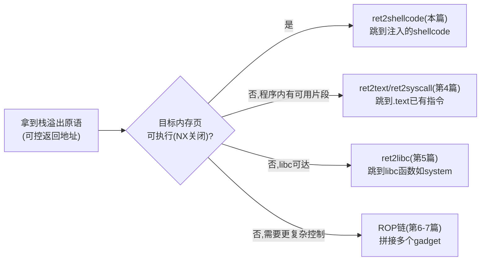
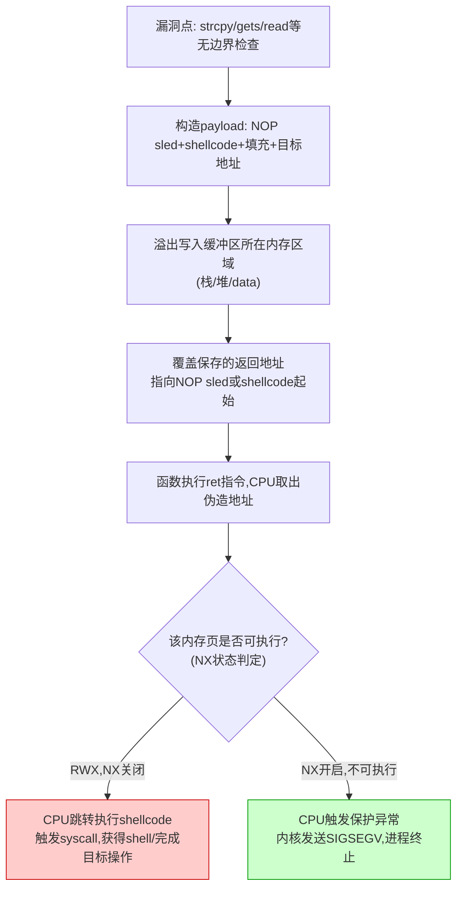
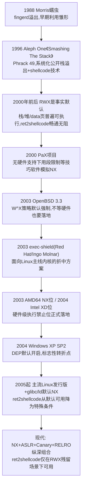

# 二进制漏洞与利用基础（3）· shellcode编写与ret2shellcode

> [!abstract] TL;DR
> - **shellcode** 本质是一段自包含、位置无关、不经过 libc 符号解析、直接触发系统调用的机器码；Linux x86-64 下靠 `syscall` 指令+寄存器传参（`rax` 为调用号，`rdi/rsi/rdx/r10/r8/r9` 为参数）与内核对话，天然不依赖任何地址泄露。
> - **ret2shellcode** 是"栈溢出注入执行"这一利用范式的最朴素实现：一份输入同时携带 shellcode 字节和覆盖返回地址所需的填充与目标地址，`ret` 指令直接把控制权交给攻击者写入的代码本身，而不是复用二进制或 libc 中已有的指令。
> - 编写可用 shellcode 必须解决三个工程约束：**去坏字节**（避开 `\x00`、`\x0a`、`\x0d` 等会截断或触发过滤的字节）、**位置无关寻址**（栈上现造字符串、`rip` 相对寻址、`call/pop` 技巧）、**字符集限制**（可打印/字母数字场景需要自解码 stub）。
> - **NX 前时代**（约 2003 年之前）栈、堆默认 `RWX`，根源不是操作系统"偷懒"而是当时的 x86 硬件在页表级别根本没有独立的执行位，读权限即隐含执行权限；ret2shellcode 因此是那个年代最主流、几乎不需要额外条件的利用范式。
> - AMD64 的 NX 位（2003）、Intel 的 XD 位（2004）与随之而来的 Windows XP SP2 DEP、Linux exec-shield/PaX，是硬件更新反推操作系统默认策略整体翻转的少数案例，标志着 ret2shellcode 从"默认可用"降级为"需要额外条件"。
> - ret2shellcode 与 ret2text/ret2syscall/ret2libc/ROP 的根本分野在于**是否注入全新指令字节**：前者需要一块既可写又可执行的内存页，后者只复用早已存在、从未被写入过的可执行页——这正是 NX 能精准命中前者、对后者完全无效的原因，也是理解本系列后续技术演化方向的关键。

## 概述与定位

本篇是《二进制漏洞与利用基础》系列中第一次把"能够劫持控制流"变成"能够执行任意代码"的一环。第 2 篇建立的能力是：通过栈溢出覆盖保存的返回地址，让函数 `ret` 时跳到攻击者指定的地址——这是一个纯粹的**控制流原语**，它本身并不能做任何事，除非那个地址上恰好有攻击者想要的指令。本篇要回答的问题是：当攻击者不仅能决定"跳到哪里"，还能决定"那里放着什么字节"时，应该放什么、怎么放、放在哪，才能稳定地拿到代码执行——这段被放进去、被执行的字节序列就是 shellcode，而"溢出数据自带 shellcode，覆盖的返回地址又指回这份数据"这一整套组合技法，就是 ret2shellcode。

"ret2shellcode"这个名字沿用了 CTF/pwn 生态里约定俗成的 `ret2xxx` 命名法——`ret2libc`、`ret2syscall`、`ret2csu` 都是"return 到某处"的简写，`ret2shellcode` 里的 `xxx` 直接就是攻击者自己写的 shellcode，因而是这一命名家族里概念上最直接、门槛却也最高（因为需要可执行的可写页）的一种。理解它与同族技术的差异，是给整个系列划分边界的关键：

| 技术 | 控制流跳转目标 | 是否注入全新指令 | 前提条件 | 本系列篇目 |
| --- | --- | --- | --- | --- |
| ret2shellcode | 攻击者写入的缓冲区（栈/堆/data） | 是，全新机器码 | 目标内存页可执行（NX 关闭或残留 RWX 区域） | 本篇（03） |
| ret2text | 二进制自身 `.text` 中已有的代码片段 | 否，复用已有指令 | 程序内恰好存在可直接利用的危险片段 | 04 |
| ret2syscall | 精心挑选的 `.text`/gadget 拼出 syscall 序列 | 否，复用已有指令 | 程序或 libc 中存在能摆好寄存器再 `syscall` 的 gadget | 04 |
| ret2libc | libc 中导出的函数（如 `system`） | 否，复用已有指令 | 已知或可推算 libc 加载基址 | 05 |
| ROP 链 | 多个小 gadget 依次拼接 | 否，复用已有指令 | 足够丰富的 gadget 集合 | 06–07 |



这张分叉图的意义在于：NX 是否开启，是攻击者选择利用范式时的第一个决策点，而 ret2shellcode 恰好占据了"NX 未生效"这一支。因此本篇不重复展开第 2 篇已讲清楚的栈帧结构、返回地址覆盖细节，也不涉及第 4 篇的 `.text` 片段搜寻、第 5 篇的 libc 基址计算、第 6–7 篇的 gadget 拼接方法论——本篇的边界严格限定在三件事上：shellcode 本身如何编写并满足真实注入通道的约束；ret2shellcode 这一控制流+数据一体化模型是如何工作的；以及决定这一切是否可行的历史性开关——NX——是如何从无到有改变整个攻防格局的。

## 原理与机制

### 两个缺一不可的前提

shellcode 能够运行，必须同时满足两个独立的条件，任一个不满足都会导致利用失败：

1. **存放 shellcode 的内存页必须具备执行权限**。这是一个纯粹的硬件/操作系统层面的属性，与攻击者的输入内容无关，只取决于这块内存是怎么被 `mmap`/`brk`/编译期段属性映射出来的。
2. **CPU 的指令指针必须被引导到这段内存的起始地址**。这是攻击者通过溢出等手段主动构造出来的，是"控制流"层面的属性。

把这两个条件做成一张真值表，能更直观地看出为什么两者缺一不可：可执行且可达，shellcode 正常运行；可执行但不可达，攻击者压根没有办法把执行流引过去，这段代码只是内存里一堆惰性字节；可达但不可执行，CPU 试图取指时会因为页表项不含执行位而触发保护异常，内核发送 `SIGSEGV` 终止进程；不可执行也不可达，两个维度都没有意义。NX 防御的巧妙之处正在于：它只需要拿下第一个条件（把所有可写页统一标记为不可执行），就能让第二个条件（无论攻击者的地址算得多精确）彻底失去价值——这也是为什么后续章节要么转向"不需要新执行权限"的代码复用（ret2text/ret2libc/ROP），要么转向"想办法让某页重新变得可执行"（如 ROP 里调 `mprotect`）。

### 为什么 shellcode 直接调用系统调用而不用 libc 函数

shellcode 几乎从不写 `printf("/bin/sh")` 或 `system("/bin/sh")` 这种依赖 libc 的调用，而是直接拼出 `syscall`/`int 0x80`。原因是一条清晰的因果链：调用 libc 函数需要先知道它在内存中的地址；在没有信息泄露的前提下，libc 的加载基址（尤其在 ASLR 开启后）对攻击者是未知的；而查地址这件事本身需要依赖的手段（GOT 读取、格式化字符串泄露等）比"直接找内核要服务"复杂得多。系统调用则完全不同——它由一个固定的、与地址空间随机化无关的软件中断/`syscall` 指令触发，内核根据 `rax` 中的调用号直接分发到对应的内核函数，整个过程不查询任何用户态符号表，不要求 shellcode 知道任何库函数的运行时地址。这正是 shellcode 作为"最基础"利用手段的原因：它把"如何拿到 libc 地址"这个后续章节（ret2libc）才需要解决的难题，从设计上直接绕开了。

反过来看，这也解释了 ret2libc 为什么必然是"更进阶"的技术：一旦 NX 挡住了直接执行 shellcode 的路，攻击者被迫复用已经映射好、地址已知或可推算的代码——而 libc 里现成的 `system()` 恰好能达成同样的"拿到 shell"效果，只是要多解决一步"我怎么知道 `system` 在哪"的问题。

### ret2shellcode 的控制流与数据流合一模型

ret2shellcode 最核心的特征是：承载 payload 的"数据"和劫持"控制流"的地址，是攻击者一次性、同源构造出来的同一份输入的两个部分。典型的溢出 payload 在内存中呈现如下布局：

```text
低地址 ......................................................... 高地址
┌────────────┬────────────┬─────────────┬───────────────────┐
│  NOP sled   │  shellcode  │   填充字节   │    伪造返回地址     │
│ (可选，用于  │ (真正会被    │ (垫到保存的  │  (指向 NOP sled     │
│  降低地址    │  执行的机器  │  返回地址所  │   或 shellcode      │
│  精度要求)   │  码本体)     │  在偏移)     │   起始处)           │
└────────────┴────────────┴─────────────┴───────────────────┘
                                                    │
                                                    ▼
                                     覆盖栈帧中保存的返回地址
```

函数 `ret` 执行时，CPU 从栈顶弹出这个被篡改的值并跳过去；如果该地址落在 NOP sled 范围内，CPU 会一路执行无意义的 `nop` 直到滑入 shellcode 真正的起始字节，再开始执行有意义的指令。这个流程可以用下图完整表达，包括 NX 状态如何在最后一步分叉出两种截然不同的结局：



### ret2shellcode 与"代码复用类"技术的根本分野

这一点值得单独强调，因为它是理解 NX 为什么能精准命中 ret2shellcode、却对 ret2text/ret2libc/ROP 完全无效的关键。NX 检查的对象是"这个内存页有没有被标记为可执行"，它根本不关心"这段字节是刚刚才被攻击者写进去的，还是编译时就一直躺在那里的"。ret2shellcode 用到的每一个字节，都是运行时才由攻击者通过溢出写入目标内存的——这意味着那块内存必须**同时**可写（才能被写入）和可执行（才能被运行），直接撞上了 NX/W^X 策略"可写页禁止执行"的核心红线。而 ret2text、ret2libc、ROP 用到的指令，全部早已存在于 `.text` 段或 libc 的代码段里，这些页从进程启动那一刻起就被映射为 `R-X`（可读可执行、不可写），从来不需要经历"被写入"这一步，因此天然不受 W^X 的约束。这个分野解释了为什么整棵漏洞利用技术树会在 NX 普及之后集体转向"代码复用"（code-reuse attack）——不是因为代码复用类技术更"高级"，而是因为它们从设计上根本不触碰 W^X 想要禁止的那件事。

## shellcode与ret2shellcode实现详解

### 系统调用式 shellcode 的构造：以 execve 为例

Linux x86-64 下的系统调用约定（与 [[22.调用规约/06.SystemV_AMD64调用规约]] 描述的用户态函数调用约定共享寄存器分工，但触发方式不同）大致如下：

| 用途 | 寄存器 |
| --- | --- |
| 系统调用号 | `rax` |
| 参数 1 | `rdi` |
| 参数 2 | `rsi` |
| 参数 3 | `rdx` |
| 参数 4 | `r10`（不是 `rcx`，因为 `syscall` 指令会用 `rcx` 保存返回地址） |
| 参数 5 | `r8` |
| 参数 6 | `r9` |
| 触发指令 | `syscall`（读取 `MSR` 中 `LSTAR` 寄存器配置的内核入口，用户态直接陷入内核） |

32 位/兼容模式下则是另一套约定：`eax` 为调用号，`ebx/ecx/edx/esi/edi/ebp` 依次传参，触发指令是软中断 `int 0x80`（经中断描述符表第 `0x80` 号门）或更快的 `sysenter`（基于 `MSR` 的快速系统调用入口）。两条路径的本质相同，只是 ABI 细节不同——具体到某一架构的寻址与指令编码差异，本系列第 21 篇会专门展开，这里不重复。

以最经典的 `execve("/bin//sh", NULL, NULL)` 为例，构造思路的核心难点不在"怎么触发系统调用"（那只是最后一条 `syscall` 指令），而在"字符串 `/bin//sh` 到底放在哪、shellcode 又怎么知道它的运行时地址"。因为 shellcode 必须位置无关，不能像普通编译产物那样用链接器算好的绝对地址去引用 `.rodata` 里的字符串常量，唯一可靠的办法是**运行时现造**：把字符串本身当作立即数压栈，再用 `rsp` 当指针——因为 `rsp` 永远精确指向"刚刚压栈的那个位置"，无论这段 shellcode 最终被加载到内存的哪个绝对地址，这个相对关系永远成立，这正是位置无关寻址最朴素也最通用的实现方式：

```asm
; execve("/bin//sh", NULL, NULL) 的位置无关构造思路(教学示意, x86-64 Linux)
xor    rdx, rdx                  ; rdx = 0，复用作 envp 参数
push   rdx                       ; 栈上放一段全零的8字节，充当字符串终止符
mov    rbx, 0x68732f2f6e69622f   ; "/bin//sh" 的8字节小端表示
push   rbx                       ; 字符串本体压栈
mov    rdi, rsp                  ; rdi = 运行时才确定的字符串地址，天然位置无关
push   rdx                       ; argv[1] = NULL
push   rdi                       ; argv[0] = "/bin//sh" 的地址
mov    rsi, rsp                  ; rsi = argv 数组本身的地址
xor    rax, rax
mov    al, 0x3b                  ; 59 = execve 的系统调用号
syscall
```

这里有两个容易被教程一带而过、但值得讲清楚"为什么"的细节。第一，字符串写成 `/bin//sh` 而不是 `/bin/sh`：多出来的一个斜杠对 `execve` 的路径解析没有任何影响（连续多个斜杠会被内核当作一个处理），它的真实作用是把字符串长度从 7 字节补齐到 8 字节，正好塞进一个 64 位寄存器/一次 `push`，省掉一条额外的补零或移位指令——这是"凑整数好压栈"的工程技巧，不是路径语法的要求。第二，`rdx` 被复用了两次：先清零压栈作字符串终止符，又直接拿来当 `envp` 参数——这不是偷懒，而是因为 shellcode 的字节数直接决定了它能塞进多小的溢出缓冲区、能不能绕过某些长度限制，少一条指令就多一分成功率，这是 shellcode 编写中"体积即成功率"这一取舍原则的具体体现。

更复杂的场景（比如目标程序禁用了 `execve`，需要打开文件、读取内容再写出到标准输出的组合拳）会拼接多个系统调用（`open`+`read`+`write`），原理与上面完全一致，只是需要维护的寄存器状态更多，这类"读取任意文件"的完整范式留给第 19 篇专门展开，本篇只建立最基础的单系统调用构造方法。

### 去坏字节编码：约束、原理与系统化解决方法

真实的注入通道极少会原封不动地把任意字节都传递给目标缓冲区。常见的"坏字节"（badchar）来源可以分成三类：字符串处理函数在特定字节处截断或停止（`strcpy`/`gets` 遇到 `\x00` 停止复制，`fgets`/按行读取的协议遇到 `\x0a`/`\x0d` 提前结束一行）；协议或解析器主动过滤特定字节（有的输入通道会剥离空格 `\x20`、制表符 `\x09`，或者只放行可打印 ASCII）；还有更严格的场景只允许字母和数字通过。识别坏字节的标准做法是先用 `checksec` 确认 NX 状态、再结合题目给出的输入方式，逐字节比对 shellcode 编码后的输出与已知的坏字节集合。

解决坏字节问题的思路可以归纳为一套系统化的替换表：

| 问题写法 | 坏字节来源 | 替代写法 | 原理 |
| --- | --- | --- | --- |
| `mov rax, 59`（编码为 `48 C7 C0 3B 00 00 00`） | 立即数按 32/64 位编码，高位补零 | `xor eax, eax` 后 `mov al, 59` | 先把整个寄存器清零，再只写非零的最低字节，寄存器最终值依旧正确，但编码里不再出现连续的零字节 |
| 引用固定地址（如 `mov rdi, 0x404000`） | 地址的中间字节恰好是 `0x00` | 栈上现造数据 + `mov reg, rsp`，或 `lea reg, [rip+offset]` | 用相对寻址或运行期压栈代替把地址当立即数硬编码，从根源上避免地址常量出现坏字节 |
| 直接需要一个字面 `0x00` 作为字符串终止符 | 显式零立即数 | `xor reg, reg` 后 `push reg` | 用运行期计算出来的零代替编码阶段写死的零字节，过滤器扫描的是"输入流"，而不是"寄存器运行结果" |
| 需要的数值本身（不是编码方式，而是内容）含坏字节 | 数据内容不可避免含坏字节，例如目标地址中一字节恰好是 `0x0a` | 先 push 该值按位取反后的结果，再执行一条 `not qword ptr [rsp]` 原地取反回真实值 | 一个字节和它的按位取反同时是坏字节的概率很低；用一条额外指令把"运行时才出现"的真实值和"必须经过过滤通道"的编码值分离开 |

最后一种情形值得多说一句：前三种都是"换一种写法达到同样效果"，本质是编码层面的腾挪；但当问题出在数值内容本身时，没有任何指令选择能回避它——因为坏字节过滤发生在数据经过注入通道（网络传输、`strcpy` 复制）的那一刻，而 `not` 指令是在 shellcode 已经落地、开始执行之后才把伪装值还原成真实值，过滤器根本看不到这一步的存在。这也是理解自解码 shellcode（self-decoding shellcode）思路的起点：把"不满足约束的真实 payload"整体加密/编码成满足约束的字节流，前面附上一段本身满足约束的解码器（decoder stub），运行时先执行解码器把后面的数据原地解回真实字节，再跳过去执行。字符集限制越严格（例如要求全部字节都在字母数字范围内），解码器本身能用的指令就越受限，写解码器变成了一个递归难题——解码器自己也必须满足它要解决的那个约束，这正是 alphanumeric 编码器的实现复杂度远高于普通 XOR 编码器的根本原因，历史上由 Rix、obscou 等研究者在 Phrack 上首次系统化公开了对应的构造方法。

### ret2shellcode 的地址难题：如何让 ret 精准落地

知道怎么写 shellcode，只解决了一半问题——伪造的返回地址是攻击者在构造 exploit 时写死的一个数字，而 shellcode 实际落在内存中的哪个地址，取决于栈布局、环境变量、是否开启 ASLR 等一系列运行期因素。让这个数字与运行时地址对上号，是 ret2shellcode 工程实践中真正棘手的部分，常见的应对手段有以下几种：

**NOP sled 容错。** 在 shellcode 前面铺垫一长串 `0x90`（`nop` 的机器码），只要伪造地址落在 sled 覆盖的范围内的任意一字节，CPU 都会连续空转 `nop` 直到滑入真正的 shellcode 起始处再继续执行。这把"地址必须分毫不差"的要求，降低成"地址落在一个几十到几千字节的窗口内即可"，本质上是用空间换取地址精度需求下降的经典工程容错设计。

**跳板寄存器技巧（return-to-register）。** 与其硬猜缓冲区的绝对地址，不如利用一个事实：函数返回的那一刻，某个寄存器（在 32 位里最典型的是 `esp`，在 x86-64 里对应 `rsp`）几乎必然指向紧邻 shellcode 的位置——因为它刚刚被用作栈指针。如果能在一个地址稳定（例如关闭了 ASLR 的系统模块，或者程序本身按非 PIE 方式链接的 `.text`）的地方找到一条像 `jmp esp`/`call esp`（x86-64 下是 `jmp rsp`）这样短短两三字节的指令，把伪造的返回地址指向这条指令而不是直接指向缓冲区，就能把"预测缓冲区绝对地址"这个难题，转化为"找一条早已存在、位置固定的双字节指令"这个容易得多的难题。这一手法在 Windows 平台的 SEH/栈溢出利用史上是教科书级技巧（历史上常用 `mona.py` 之类工具在非 ASLR 模块中搜索这类指令序列），但其思想本质是"借用运行时已经指向目标附近的寄存器做二次跳转"，在任何允许 return-to-register 的场景下都成立，并不局限于某一个操作系统。

**次级载体技巧。** 把 NOP sled 与 shellcode 整体挪到一个地址相对更可预测的载体里——最经典的是环境变量，因为进程的环境变量块在 `main` 之前统一压入栈的高地址区域，受函数调用深度、局部变量布局变化的影响比栈帧内部的局部缓冲区小得多。这样一来，溢出只需要覆盖一个指向该环境变量的地址，而不必精确算出某个局部缓冲区相对于返回地址的偏移，显著降低了对"精确定位"的依赖。

**爆破式打法。** 在没有信息泄露、地址空间熵不高、且服务崩溃后能自动重启（例如 `fork` 型网络守护进程）的场景下，通过反复尝试遍历可能的地址范围，统计上总能命中。这种打法在 32 位系统上更现实——32 位地址空间本身只有 `2^32`，早期 32 位系统的 ASLR 熵往往只有个位数到十几比特，可枚举的空间很小；而 64 位系统地址空间和典型 ASLR 熵都大得多，纯粹爆破所需的期望尝试次数呈指数级上升，这也是 64 位化本身（独立于 NX）在客观上进一步压缩了 ret2shellcode 生存空间的原因之一。

### NX 前时代：为什么 RWX 曾是默认，以及转折如何发生

理解"NX 前时代"不能只停留在"以前不开这个保护"的表面描述，而要追问：为什么当时的操作系统集体选择了不设防？根本原因出在硬件，而不是操作系统设计者偷懒。x86 保护模式理论上支持基于段的代码/数据分离，但绝大多数 Unix 与 Windows 出于简化编程模型和性能考虑，都采用了"平坦内存模型"（flat memory model）——代码段和数据段的基址、界限几乎重叠成同一份地址空间，段级别的执行权限区分因此名存实亡。更关键的是，在页表这一级，早期 x86 的页表项（PTE）格式里根本没有独立的"可执行"标志位——一页内存只要标记为可读，CPU 在取指时就认为它可以执行，读权限隐含了执行权限。这意味着即便某个操作系统的设计者主观上想禁止栈上代码执行，硬件层面也没有开关可用。这是一条纯粹由硬件能力决定的因果链：硬件没有独立执行位 → 操作系统无法在页级别拒绝执行 → 可写的栈/堆天然也可执行 → shellcode 只要能被写进去就能被跳过去执行，几乎不需要克服额外的内存权限障碍。这也是为什么那个年代的 ret2shellcode 教程往往连"检查 NX 状态"这一步都不需要提——因为不存在这个变量。

这一格局的扭转是硬件更新反过来推动操作系统默认策略整体翻转的少数案例之一，时间线大致如下：



值得单独指出的是 OpenBSD 与 PaX 的角色：它们都没有等待硬件厂商——PaX 项目在纯软件层面用巧妙的段限制/地址空间分裂技巧，在完全没有硬件执行位的 x86 上"模拟"出了不可执行页的效果（代价是一定的性能开销和兼容性妥协）；OpenBSD 则在 2003 年的 3.3 版本里就把 W^X 作为默认策略，比 AMD/Intel 硬件执行位大规模铺开还要早。这说明 NX 保护的技术可行性其实一直存在，真正的瓶颈是"要不要为了安全牺牲兼容性和性能"这一取舍——而当硬件把"零成本执行位检查"变成免费的能力之后，这个取舍就不再成立，操作系统在两三年内几乎集体转向默认开启，速度远快于同样重要、但纯软件即可实现、因而推广更渐进的 ASLR。对攻击者而言，这意味着 ret2shellcode 第一次从"随手可用的默认路径"变成"需要先确认前提条件是否成立"的特定场景技术——而确认前提、绕过前提，正是本系列后续章节要逐一展开的内容。

## 工具视角与实战

### pwntools 生成与校验 shellcode

在 CTF 与安全研究场景中，手写并逐字节核对坏字节效率很低，实践中普遍借助 `pwntools` 生成汇编、编译为字节码并自动校验：

```python
from pwn import *
context.update(arch='amd64', os='linux')

# 生成execve("/bin/sh", ...)的汇编文本并汇编为字节码
sc = asm(shellcraft.sh())

badchars = b'\x00\x0a\x0d\x20'
hit = [hex(b) for b in sc if b in badchars]
print(f'shellcode长度: {len(sc)}  命中坏字节: {hit}')
```

这段脚本做的事情，正是上一节"去坏字节"方法论的自动化版本：`shellcraft.sh()` 按照默认策略生成尽量不含 `\x00` 的汇编，`asm()` 把它编译成真实字节，随后逐字节比对目标坏字节集合。如果命中列表非空，说明默认生成结果不满足当前题目的过滤条件，需要结合上一节的替换表手工调整汇编源码，或改用 `shellcraft` 提供的编码参数、或叠加 `encoders` 模块提供的 XOR/alphanumeric 编码器（对应 msfvenom 生态里的 `shikata_ga_nai`、`x86/alpha_mixed` 等编码器思路）。

### 定位缓冲区地址：gdb/pwndbg 调试工作流

确认 shellcode 本身无坏字节之后，下一步是确定伪造返回地址应该填什么值。典型调试流程是：先用 `cyclic` 系列工具定位溢出到返回地址所需的精确偏移，再断在漏洞函数返回前，直接读取栈上内容确认 shellcode/NOP sled 的落点。

```bash
gdb -q ./vuln
(gdb) b *0x004011f0        # 断在漏洞函数返回前的位置
(gdb) run $(python3 -c "print('A'*200)")
(gdb) x/40xg $rsp          # 观察当前栈上的内容,定位NOP sled/shellcode起始
(gdb) p &buf                # 若保留符号信息,直接打印局部缓冲区地址
```

```python
from pwn import *
context.update(arch='amd64', os='linux')

io = process('./vuln')
payload = cyclic(200)
io.sendline(payload)
io.wait()

core = io.corefile
offset = cyclic_find(core.read(core.rsp, 4))
print(f'偏移量: {offset}')
```

### 一个教学用 ret2shellcode 骨架

把前述几步串起来，一个典型 CTF 场景下的 ret2shellcode exploit 骨架大致如下（`buf_addr` 需要通过调试或已知的固定布局确定，这里仅作教学占位，不针对任何具体真实目标）：

```python
from pwn import *
context.update(arch='amd64', os='linux')

io = process('./vuln')          # 本地教学/CTF靶机二进制
sc = asm(shellcraft.sh())
offset = 136                     # 由cyclic_find确定的返回地址偏移
buf_addr = 0x7fffffffe350        # 教学占位地址,实际需由调试/泄露确定

payload = sc.ljust(offset, b'A') + p64(buf_addr)
io.sendline(payload)
io.interactive()
```

这个骨架直观地体现了 ret2shellcode "数据即控制流"的模型：`sc`（shellcode 本体）打头，`ljust` 用无关字节垫到保存返回地址所在的偏移，最后拼上指向 `sc` 起始处的伪造地址——与前文的内存布局图完全对应。

### 常见踩坑：本地 gdb 能打通，直接跑不通

这是 ret2shellcode 实战中最常见、也最容易让初学者困惑的现象：在 `gdb` 里调试出来的缓冲区地址，脱离 `gdb` 直接运行时却对不上。原因在于栈上除了函数局部变量，还紧挨着环境变量块和 `argv` 数组，而 `execve` 在装载一个新进程时，会把当前 shell 的全部环境变量、`gdb` 自身注入的若干变量（如 `LINES`、`COLUMNS`）连同程序路径字符串一并压入栈顶之上——这些内容的总长度直接决定了栈顶的起始地址，进而整体平移了下面所有局部缓冲区的地址。同一个二进制，用 `gdb` 启动和直接在终端启动，两者的环境变量集合往往并不完全相同，哪怕只差几个字节的环境变量总长度，也会让目标缓冲区地址产生几十字节的漂移，超出 NOP sled 的容错范围就会直接崩溃。

工程上应对这一问题的常见做法是：调试时显式清空或固定环境变量（`unset LINES COLUMNS`、或用 `env -i` 启动一个干净环境），并在 `pwntools` 里用 `process(['./vuln'], env={})` 精确控制传给目标进程的环境变量，让调试环境与"实际打的时候"保持一致；此外 `ulimit -s` 设置的栈大小、是否临时关闭 ASLR（教学环境下 `echo 0 > /proc/sys/kernel/randomize_va_space`，仅限于自己完全掌控的容器/虚拟机，不应在共享系统上操作）都会影响栈布局与地址的可预测性，是调试 ret2shellcode 时需要逐项排除的变量。

## 安全性与正确使用

从防御视角看，ret2shellcode 涉及的每一步都对应着现代二进制防护体系里的某一层，各层的作用和边界并不重合，值得逐一对照：

| 层次 | 机制 | 对 ret2shellcode 的效果 |
| --- | --- | --- |
| 内存权限 | NX/DEP、W^X | 直接阻断：注入的 shellcode 所在页不可执行，`ret` 跳过去即触发保护异常 |
| 地址空间 | ASLR/PIE | 让 NOP sled、shellcode、跳板指令的地址不可预测，大幅降低命中率，是对抗爆破式打法的关键 |
| 栈保护 | Stack Canary | 若溢出路径必须经过 canary 所在偏移，篡改会在 `ret` 执行前被 `__stack_chk_fail` 拦下（详见第 2 篇与第 14 篇） |
| 编译期加固 | Full RELRO、`_FORTIFY_SOURCE` | 不直接针对本技术，但压缩了配合利用时可用的其它原语 |
| syscall 层 | seccomp-bpf | 即便 shellcode 真的开始执行，`execve`/`socket` 等危险调用仍可能被拦截，是纵深防御的最后一道闸门 |
| 控制流完整性 | CFI/CET/PAC | 主要针对间接跳转与 ROP，但若 shellcode 需要经由跳板寄存器技巧的间接跳转触发，也可能被间接跳转校验拦下 |

这张表想说明的核心事实是：NX 是阻断 ret2shellcode 最直接、性价比最高的一层，但绝不是唯一需要的一层——单独依赖 NX 而忽视 ASLR，攻击者仍可能通过环境变量技巧或跳板寄存器技巧稳定命中一块残留的可执行页；单独依赖 ASLR 而不开 NX，栈依旧可执行，攻击者只是需要多花一点力气去定位地址。真正稳固的防御永远是纵深组合，而不是指望某一个开关。

> [!caution] 合规边界
> 本文所述原理与示例仅用于自身拥有或已获书面授权的系统、CTF 靶场与安全研究环境下的学习与验证。所有代码均为教学最小复现（占位地址、无信息泄露的通用 execve 范式），不构成、也不应被用作针对真实生产系统或他人资产的可直接使用的攻击配方；不为绕过任何商业软件授权或访问控制提供武器化步骤。搭建、复现本文实验时请确保处于隔离的本地虚拟机/容器环境，并遵循所在机构或平台的安全测试授权流程。未经授权对第三方系统尝试本文技术属于违法行为，本文的视角始终是"理解攻击原理以强化防御"。

从安全编码与运维的视角出发，防御 ret2shellcode 这一类问题不能只靠部署缓解机制，更根本的是从源头收窄攻击面：优先使用带边界检查的字符串/内存函数（`strncpy`/`snprintf`/`fgets` 并正确传入缓冲区长度），或直接采用内存安全语言重写高危解析路径；遵循最小权限原则运行网络服务，即便攻击者拿到了代码执行，运行身份的权限上限也决定了 shellcode 实际能造成的破坏范围；充分意识到 ASLR 的熵在不同位宽和不同操作系统实现下差异巨大——32 位系统的可用熵远低于 64 位系统，评估自身系统风险时不能一概而论；在容器化部署中默认启用 seccomp 白名单（如 Docker 的默认 seccomp profile），作为即便前几层都被突破后的最后兜底；日常开发中用 `checksec`、`ASan`、模糊测试（参见第 49 系列）对自己的二进制做例行体检，把这类问题消灭在上线之前，而不是等待被利用后才补救。

## 小结

ret2shellcode 是把"控制流劫持"这一原语兑现为"任意代码执行"的最直接方式：攻击者自己编写的机器码，通过溢出注入到一块可读可写的内存中，再借助被覆盖的返回地址把执行流引导过去。它对 shellcode 本身提出了系统调用直连、位置无关、避开坏字节三重约束，也对"如何让地址算对"提出了 NOP sled、跳板寄存器、次级载体、爆破等一整套工程手段。它之所以在今天更多是一项"历史与原理"知识而非默认可用的攻击手段，根源在于 NX/DEP 这一由硬件更新驱动、在两三年内席卷主流操作系统的防护措施——它精准地切断了"新写入的字节能否被执行"这一条件，而完全不影响"复用早已存在的指令"这条路，这正是 ret2libc、ROP 等后续技术得以成立、并成为本系列后续篇章主线的根本原因。对实战而言最容易踩的坑，往往不是 shellcode 写错了，而是调试环境与实际运行环境的栈布局差异，以及对 NX/ASLR 当前状态的误判——动手前先用 `checksec` 确认前提条件是否成立，永远是第一步。

## 相关阅读

- [[00.二进制漏洞与利用基础总览]] · 系列总览
- [[02.栈溢出原理与经典利用]] · 本篇依赖的控制流劫持原语来源
- [[04.返回导向：ret2text与ret2syscall]] · NX 生效后的代码复用第一站
- [[05.ret2libc]] · 复用 libc 函数替代直接注入
- [[06.ROP入门]] · gadget 拼接思路的起点
- [[34.现代二进制防护机制/00.现代二进制防护机制总览]] · NX/ASLR/Canary/RELRO/CFI/CET 的系统讲解
- [[11.ELF文件详解/17.got节]] · 除返回地址外另一条控制流劫持路径
- [[22.调用规约/06.SystemV_AMD64调用规约]] · shellcode 传参所依赖的寄存器约定
- [[24.内存管理与堆分配器/17.堆利用手法体系House_of系列]] · "数据即控制流"思想在堆上的延伸演化
- [[52.Linux内核机制与内核利用/00.Linux内核机制与内核利用总览]] · 用户态 shellcode 思想在内核利用中的对应形态
- Aleph One, *Smashing The Stack For Fun And Profit*, Phrack 49（栈溢出与 shellcode 技术的奠基性公开文献）
- Jon Erickson, *Hacking: The Art of Exploitation*（shellcode 编写与调试的经典教材）
- Linux `man 2 syscall`、Intel/AMD 官方架构手册中关于 NX/XD 位的章节

[[00.二进制漏洞与利用基础总览|⬆ 系列总览]] | [[02.栈溢出原理与经典利用|← 上一章]] | [[04.返回导向：ret2text与ret2syscall|→ 下一章]]
