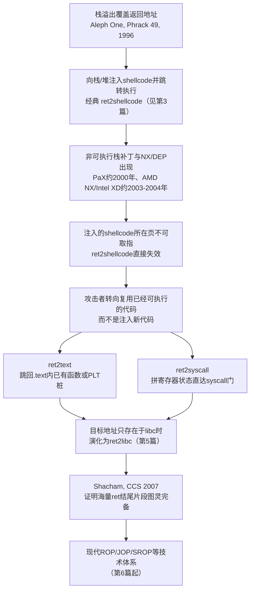
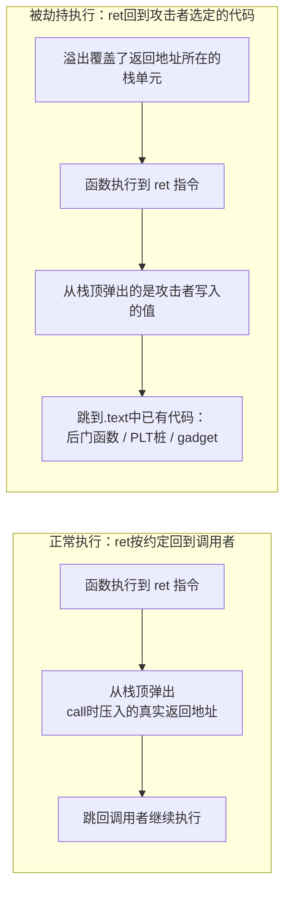
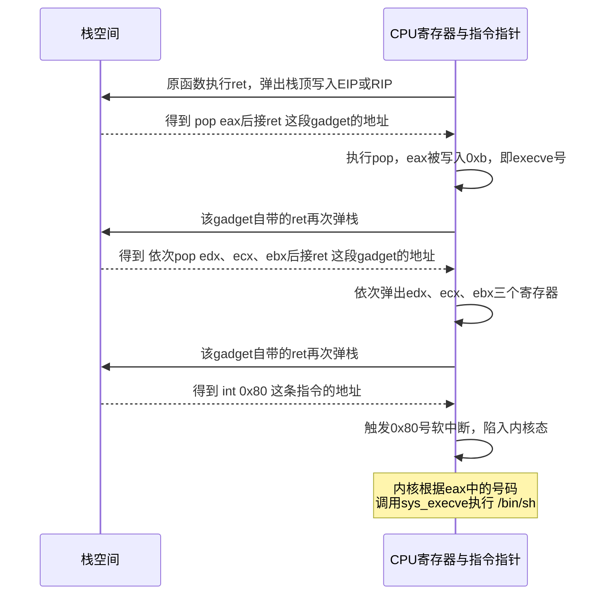

# 二进制漏洞与利用基础（4）· 返回导向：ret2text与ret2syscall

> [!abstract] TL;DR
> - NX/DEP 只做一件事：禁止在栈、堆等数据页上取指执行；它不检查、也管不了控制流被劫持后"跳去哪"，这正是 ret2text 与 ret2syscall 的立足点。
> - ret2text 把返回地址改写为二进制自身 `.text` 段里**已经存在**的代码——可以是一个现成的"赠品"后门函数，也可以是伪造调用帧后直接跳进 `system@plt` 这样的库函数入口，全程不写入一字节新代码。
> - ret2syscall 更进一步：不借助任何已命名的高层函数，只用若干条 `pop reg; ret` 小片段（gadget）把寄存器一个个摆成系统调用要求的样子，再一脚踹进 `int 0x80`/`syscall` 这道用户态到内核态唯一的合法闸门，等价于手写了一次 `execve("/bin/sh", 0, 0)`，却没有向内存注入任何机器码。
> - i386 与 x86-64 的系统调用寄存器约定并不相同，尤其是 x86-64 用 `r10` 而非 `rcx` 传第 4 个参数——因为 `syscall` 指令本身会用 `rcx` 保存返回地址，混淆两者是常见翻车点。
> - 这两种技术能不依赖任何信息泄露生效的前提，是目标地址（无论是二进制自身的函数、PLT 桩，还是 gadget）在构造 payload 时就已知且固定；一旦目标开启 PIE/ASLR，它们立刻退化为"第一步"，需要先接上地址泄露手法。
> - 它们是"返回导向"这条技术脉络里最朴素的雏形：既不需要完整 ROP 的图灵完备编程能力，也不依赖 ret2libc 对 libc 基址的掌握，因而常被当作从"注入 shellcode"迈向"纯代码复用"的第一级台阶。

## 概述与定位

前三篇搭好了这条利用链的地基：第1篇给出了"内存破坏 → 控制流劫持"的通用模型；第2篇具体到栈溢出如何精确覆盖保存的返回地址，拿到"ret 时跳到哪由攻击者说了算"这个原语；第3篇则给出了这个原语最直白的用法——把一段自己写的机器码（shellcode）塞进可控内存，再让返回地址指向它。那套打法有一个从未被单独强调过的隐藏前提：**盛放 shellcode 的那块内存必须是可执行的**。只要这个前提成立，"写入数据"与"执行代码"之间就没有界限，溢出即等于任意代码执行。

NX（No-eXecute，Windows 一侧常称 DEP，Data Execution Prevention）撕掉的正是这层默认成立的前提。它并不试图阻止溢出发生，也不试图恢复被踩坏的返回地址，它只是在硬件页表层面宣布：栈、堆、`.bss`、匿名 `mmap` 出来的普通数据页，一律不允许 CPU 从中取指执行。第3篇里"注入 shellcode 再跳过去"的最后一跳，字面意义上会被 CPU 直接拦下来，进程收到 `SIGSEGV` 而不是拿到 shell。

本篇要讲的，是攻击者面对这堵墙给出的第一版答案，也是最朴素、最容易理解的答案：**既然不让我往内存里塞新代码，那我就不塞——进程的地址空间里本来就已经躺着一大堆合法、可执行、被操作系统信任的代码，我只需要把控制流精确地引到这些代码上，而不是引到我自己写的字节上。** 这就是"代码复用攻击"（code-reuse attack）家族的起点，本篇专门讲其中最基础的两个成员：

- **ret2text**：字面意思是"返回到 `.text`"，把（劫持后的）返回地址指向二进制自身 `.text` 段里已经存在的一段代码——可能是一整个函数，也可能是借着某个库函数入口伪造出一次"合法调用"。
- **ret2syscall**：不满足于调用某个具名函数，而是直接拼凑出内核系统调用所要求的寄存器状态，一路"返回"到 `int 0x80` 或 `syscall` 这条指令上，越过 libc、直接向内核要一个 shell（或做任何内核愿意替你做的事）。



这张图里有一条更早的暗线值得单独点出：非可执行内存的思路其实先于硬件 NX 出现——Solar Designer 在 1997 年就给 Linux 内核写过一个非可执行栈补丁，而他自己几乎同时给出了破解方法：不注入代码，直接把返回地址指向 libc 里已经存在的 `system()`，这就是"return-to-libc"最早的雏形。可见"代码复用"这个思路，从一开始就是作为"非可执行内存"的天生对偶技术出现的，只是当时业界还没有把它系统化、也没有 `int 0x80`/`syscall` 这条更直接的路线讲清楚。本篇的 ret2text/ret2syscall，正是把这条思路收敛到"不需要知道 libc 在哪、只需要知道二进制自己在哪"这个最简单、最不依赖信息泄露的子情形上。

需要明确本篇的边界，避免和相邻章节重复：怎么手写 shellcode 字节属于第3篇；怎么在不知道二进制自身地址、只能在 libc 里找目标属于第5篇 ret2libc；怎么把 gadget 拼接为规模更大、可循环可分支、真正图灵完备的程序属于第6、7篇 ROP；怎么在开了 PIE/ASLR 的目标上先拿到一次地址泄露属于第15篇。本篇只聚焦一件事：**NX 挡住了"注入"这条路之后，最短、最直接的两条"复用"路径长什么样、为什么能生效**。

## 原理与机制

### NX/DEP 在硬件与操作系统层面做了什么

NX 不是一个抽象的"安全策略"，它是实实在在写在页表项里的一个比特位。在 x86-64（以及开启了 PAE 的 32 位 x86）体系结构下，每条页表项是 64 位宽，其中最高位（第 63 位）就是 NX 位；CPU 要先在 `EFER`（Extended Feature Enable Register）里把 `NXE`（No-Execute Enable，第 11 位）置位，NX 位才会被硬件解释为"该页禁止取指"，否则会被忽略。此后每当 CPU 的取指部件试图从某一页读入指令字节，分页部件都会顺带检查这一页对应 PTE 的 NX 位；一旦命中，就在缺页异常（`#PF`）里带上"这是一次指令抓取"的错误码，交给操作系统处理。Linux 内核识别出这种缺页后，不会像处理真正的缺页（比如懒分配、写时复制）那样修复现场，而是直接把 `SIGSEGV` 递给进程——这也是为什么开了 NX 之后，向栈上注入的 shellcode 一旦被跳过去执行，进程立刻崩溃而不是"卡住"或者"报别的错"。

值得一提的是，32 位 x86 的传统（非 PAE）页表项只有 32 位宽，根本没有多余的比特留给 NX，这就是为什么早期 32 位系统要打开硬件 NX，必须先打开 PAE（Physical Address Extension，把物理地址寻址扩展到 64 位页表项）——两者是绑定关系。而在硬件 NX 尚未普及的年代（2003年之前），grsecurity/PaX 项目已经用纯软件手段（`PAGEEXEC`、`SEGMEXEC` 等）模拟出了"不可执行页"的效果，这也是 NX 概念在实践中最早的落地之一。Windows 阵营则是在 XP SP2（约 2004 年）把 DEP 默认打开，才让这道防线第一次进入大众视野。

在 ELF 层面，一个可执行文件是否要求可执行栈，是由程序头表里的 `PT_GNU_STACK` 段描述的：如果这个段的标志位里没有 `PF_X`，链接器和加载器就会把运行时的栈映射为不可执行；`checksec` 一类工具报告的"NX enabled/disabled"，本质上就是在读这个字段（这部分程序头的完整结构见 [[11.ELF文件详解/17.got节]] 所在系列对 ELF 布局的讨论）。现代系统的默认策略早已不止"栈不可执行"这一条，而是广义的 W^X（Writable XOR eXecutable）：堆、`.bss`、匿名 `mmap` 出来的普通内存，默认都不可执行，只有 `.text` 以及显式以 `PROT_EXEC` 映射出来的页才能被取指——这正是 ret2shellcode 全面失效、而 ret2text/ret2syscall 有存在必要的根本原因。

### 代码复用攻击的核心洞察

把 NX 的威胁模型摆开来看，它假设的攻击链条是：攻击者能通过溢出写入任意数据 → 攻击者需要这些数据被当作指令执行 → 于是只要禁止"从攻击者能写的页取指"，链条就断了。这个假设精准地命中了 shellcode 注入，却对另一件事只字未提：**攻击者选择"跳到哪个地址"这件事本身，跟这个地址上的内容是不是攻击者写的，完全是两回事。** 溢出覆盖返回地址，拿到的是"控制流去向由我决定"的能力；shellcode 注入只是这项能力的一种用法，绝不是唯一用法。NX 封死的是"把新代码塞进内存"这条供给线，却完全没有过问进程地址空间里已经躺着的、编译器/链接器早就放好的、操作系统认可其可执行属性的海量现成代码——这些代码从合法性角度看和进程自己调用它们时毫无二致，NX 无从、也无意区分"这次跳转是程序自己安排的，还是攻击者安排的"。



这张对比图的关键是：`ret` 指令本身不知道、也不关心栈顶那个值是谁放上去的，它永远无条件地"弹出并跳转"。CPU 层面根本不存在"这次跳转是正常返回还是被劫持"的区分信号——这正是后面第14、15篇讲 Canary、CFI、CET/Shadow Stack 时要解决的问题：既然硬件本身分不清，就得在软件（Canary）或者更新的硬件机制（影子栈）里额外记一份"真正应该返回到哪"的账本，运行时做比对。本篇讨论的两种技术，恰恰是在这类账本机制尚未出现或被绕过的场景下才成立的（详见 [[34.现代二进制防护机制/00.现代二进制防护机制总览]]）。

这里顺带把后文反复用到的术语钉死：**gadget** 指二进制已有代码中一小段以 `ret`（或其他能把控制权重新交回攻击者手中的间接转移指令）结尾的指令序列。攻击者完全不关心这段字节原本属于哪个函数、编译器当初为什么生成它，只关心两件事——它做了什么（语义效果），以及它的结尾能不能把执行权限交还给栈上下一个由攻击者摆放的地址。把它想象成一块块"跳板"：只要每块跳板落地时脚下（栈顶）又是攻击者铺好的下一块跳板，攻击者就能一路踩着这些原本互不相关的代码碎片，走到自己想去的地方。

### 系统调用门：用户态到内核态唯一的合法通道

理解 ret2syscall 必须先理解操作系统的一个基本设计：用户态进程运行在权限受限的特权环，无法直接调用内核里的函数（内核代码所在的页在用户态压根不可访问，更别说调用），唯一被允许的入口是一小撮专门设计的陷入指令——32 位上是 `int 0x80` 这种软中断，或者 `sysenter`（配合 vDSO 里的 `__kernel_vsyscall` 使用，速度更快）；64 位上是 AMD 设计、Intel 跟进的 `syscall`/`sysret` 指令对。这些指令的共同点是：它们会把执行权交给一个由内核在启动时预先登记好的、固定的内核入口地址（`int 0x80` 通过 IDT 中断描述符表查表跳转；`syscall` 则直接读取 `LSTAR` 这个模型专属寄存器，跳过中断描述符查表，速度明显更快，这也是 x86-64 全面转向 `syscall` 的原因）。

安全相关的关键事实在这里：**内核进入陷入处理程序后，唯一用来判断"该执行哪个服务"的依据，就是当时 `eax`/`rax` 寄存器里的数字（系统调用号），以及随后几个约定寄存器里的参数值。内核完全没有能力、也没有兴趣去追问"程序是怎么走到这条 `int 0x80`/`syscall` 指令上的"——是从函数库里规规矩矩调用来的，还是被 ROP 链一路弹栈弹过来的，在内核看来毫无区别。** 只要陷入那一刻寄存器摆得对，内核就认为这是一次合法请求。这正是 ret2syscall 能够成立的根本原因：它绕过了"必须先调用一个具名的、语义上"看起来危险"的函数"这个中间层，直接在系统调用这道门槛前伪造出内核唯一在乎的凭证——寄存器状态。

不同架构、不同位宽下这套"凭证"的摆放约定并不相同：

```text
i386 (Linux, int 0x80)         x86-64 (Linux, syscall)
------------------------       ------------------------
eax  = 系统调用号                rax  = 系统调用号
ebx  = 第1个参数                 rdi  = 第1个参数
ecx  = 第2个参数                 rsi  = 第2个参数
edx  = 第3个参数                 rdx  = 第3个参数
esi  = 第4个参数                 r10  = 第4个参数   <- 注意不是 rcx！
edi  = 第5个参数                 r8   = 第5个参数
ebp  = 第6个参数                 r9   = 第6个参数
返回值 -> eax                    返回值 -> rax
```

x86-64 用 `r10` 而不是普通函数调用约定里的 `rcx` 承接第 4 个参数，不是内核随意的选择，而是被硬件行为逼出来的：`syscall` 指令本身，在陷入内核的那一瞬间会自动把"返回后应该继续执行的地址"写入 `rcx`、把 `RFLAGS` 写入 `r11`——这是这条快速指令能省去中断门查表、从而更快的代价之一。也就是说，等内核的系统调用处理代码真正开始读取参数寄存器时，`rcx` 早已经被硬件覆盖成了别的东西，任何塞在 `rcx` 里的"第4个参数"都已经丢了。为了绕开这个硬件既成事实，Linux 的系统调用 ABI 干脆把第4个参数的位置从 `rcx` 换成了 `r10`；glibc 里的 `syscall()` 库函数会在你调用它时把 `rcx` 的值悄悄搬到 `r10` 再执行 `syscall`，但通过 ROP 直接手搓系统调用时，没有 libc 帮你做这一步搬运，必须自己把参数摆在 `r10` 而不是 `rcx`。（本篇涉及的 `execve` 只用到 3 个参数，暂时碰不上这个坑，但读到后面章节里参数更多的系统调用——比如 `mmap`——时一定会用到。）

同样要注意，系统调用号本身**在不同位宽下完全不通用**：`execve` 在 i386 上是 11（`0xb`），在 x86-64 上是 59（`0x3b`）。把一份 64 位 exploit 的调用号原样搬到 32 位目标上（或者反过来），寄存器摆得再对也会调错服务，这是初学者极容易踩的坑。

### gadget 与"以栈为程序计数器"的执行模型

把上面几点合在一起看，就能理解 ret2text/ret2syscall 真正精妙的地方：`ret` 指令的语义是"从栈顶弹出一个值，把它当作下一条指令的地址跳过去"，如果攻击者能持续控制栈顶内容，那么每一次 `ret` 都相当于给了攻击者一次"决定下一步执行哪段代码"的机会。栈指针 `esp`/`rsp` 在这种打法下，实际上被当成了第二根"指令指针"在使用——真正的 `eip`/`rip` 只是短暂地落在某个 gadget 上执行几条指令，指令序列末尾的 `ret` 又会立刻把控制权交还给"谁持有栈顶谁说了算"这套逻辑，继续跳到下一个 gadget。这条链可以很短（本篇只需要三五个 gadget），也可以很长很复杂（第6、7篇要讲的完整 ROP，用几十上百个 gadget 拼出循环、分支、算术运算，具备图灵完备的编程能力）——机制完全相同，区别只在于规模和目标是否固定。理解了这一点，就能明白本篇标题里"返回导向"四个字的分量：不是"返回到某个特定地方"这么简单，而是"利用 `ret` 这条指令的固有语义，把栈变成一条可编程的执行轨迹"，本篇只是把这条轨迹用在了最短、最有针对性的两个目的地上。

## 构造技法与指令级详解

### ret2text 的两种形态

**形态 A：直接跳"赠品"函数。** 不少教学/竞赛向的二进制里，会存在一个正常执行路径永远不会调用、但确确实实被编译进 `.text` 段的函数——常见于作者刻意留下的后门（比如一个 `backdoor()`/`magic()`，内部直接 `system("/bin/sh")` 或者打开并输出 flag 文件），偶尔也来自调试代码遗留。定位它只需要静态分析：`objdump -d`/IDA/Ghidra 把所有函数过一遍，重点看有没有函数体内联了 `"/bin/sh"`、`"flag"`之类字符串，或者调用了 `system`/`execve`/`execl`。一旦找到，利用往往简单到"覆盖返回地址为该函数入口"就结束了——如果这个函数不依赖任何调用者传入的参数，甚至连伪造栈帧都不需要。

**形态 B：伪造调用帧，借道 PLT 调用带参数的库函数。** 更常见、也更能体现原理的情形是二进制里没有现成后门，但导入了 `system` 这样的函数（哪怕程序正常逻辑里从未真正调用过它，只要它出现在 PLT/GOT 里，其入口地址就是确定的）。这时候需要自己伪造出一次"看起来像正常调用"的栈状态：

```text
                  低地址（栈顶方向）
        +------------------------------------+
        |  'A' * padding_len                 |  <- 溢出起始，填充到旧saved EBP为止
        +------------------------------------+
        |  junk（原saved EBP，可覆盖为任意值）    |
        +------------------------------------+  <- 原函数ret后，eip指向下一行
        |  system@plt 的地址                   |  <- 覆盖原返回地址，ret一执行，eip=此处
        +------------------------------------+  <- system执行到它自己的ret时会读这里
        |  伪造的"返回地址"（随便填，如exit@plt）  |
        +------------------------------------+  <- system()的第1个参数从这里读
        |  "/bin/sh" 的地址                    |
        +------------------------------------+
                  高地址
```

这个"伪造调用帧"技巧之所以成立，根源在于 x86 cdecl 调用约定把"参数在哪"这件事完全托付给了栈布局本身，而不依赖任何硬件级的调用历史记录：一次正常的 `call system` 会先把参数压栈，再把返回地址压栈，于是 `system` 的序言代码开始执行时，看到的栈顶是返回地址，往上第一个格子是第一个参数。而我们的溢出覆盖直接把 `system@plt` 的地址塞进了"返回地址"这个槽位，一旦原函数 `ret`，`eip` 跳到 `system@plt`、`esp` 恰好指向我们精心摆放的"伪造返回地址"，再往上就是"/bin/sh"的地址——从 `system` 的视角看，这个栈布局和它真的被 `call` 过一模一样，它无法察觉、也没有能力察觉自己是被"骗"来的。这也解释了为什么后面第14篇会讲的 CET 影子栈是专门针对这种手法设计的：影子栈会在硬件层面单独维护一份"真正被 `call` 过的返回地址"，`ret` 时拿明面栈上的值和影子栈比对，一旦不一致立即报错——这恰好是本篇这套"伪造调用帧"手法的天生克星，理解了机制才能理解防御为什么这么设计。

顺带一提，调用 `system@plt` 本质上还是绕不开 PLT/GOT 这层间接跳转：PLT 桩会通过对应 GOT 表项跳到 `system` 在 libc 里的真实地址（首次调用时可能还要经过动态链接器的惰性绑定，除非开了 `BIND_NOW`/Full RELRO）。这一步为什么"通常不需要攻击者操心"，是因为 PLT 桩的地址本身在攻击者构造 payload 时就已知（它是二进制自己 `.plt` 段里的固定偏移，不随 libc 加载到哪里而改变），至于 GOT 表项此刻是否已经解析完毕、libc 究竟被加载到什么地址，都由动态链接器在幕后处理，exploit 不需要知道任何 libc 相关的地址——这正是把这类技巧归入"ret2text"而非"ret2libc"的分类依据，详见后文"与相邻技术的边界"一节。

### "/bin/sh" 从哪来

- **情形一：二进制自带该字符串。** 有些程序本身就在某处调用过 `system`（哪怕是打印帮助信息之类的正常逻辑），或者作者特意在 `.rodata` 里放了一份方便教学，直接用 `ROPgadget --string '/bin/sh'` 或 `strings -a -t x` 就能找到现成地址。
- **情形二：二进制里没有，libc 里一定有，但暂时不想依赖 libc 地址。** 这里可以完全只靠二进制自己的资源，用"两级跳"自己把字符串"种"进内存：第一跳伪造一次到 `read@plt`（或 `gets@plt`）的调用，参数指向一块可写的 `.bss` 地址，把 `/bin/sh\x00` 从攻击者能控制的数据源（比如 socket 输入）读进去；第一跳的"伪造返回地址"这次不再随便填垃圾值，而是精确填成第二个目标——`system@plt` 的地址，紧跟着第二份参数（刚刚写好的 `.bss` 地址），让两次伪造调用首尾相接。

这个"两级跳"值得专门拎出来强调一句，因为它极容易和第3篇的 shellcode 注入混淆，但两者有本质区别：这里通过 `read` 写进 `.bss` 的字节，从头到尾只被当作**字符串参数**去读取，从未被 CPU 当作**指令**去取指执行——它就是纯数据，`.bss` 依然不可执行，NX 全程没有被触碰。真正被执行的，仍然只有 `read`、`system` 这些原本就存在、原本就可执行的库函数代码。这是"代码复用"与"代码注入"的分水岭：前者永远只移动控制流，从不新增可执行内容；后者则必须先让新字节获得可执行权限。

### ret2syscall：不求人，直接叫内核开门

ret2text 至少还依赖一个具名的高层函数（`system`、后门函数……），而 ret2syscall 连这一点依赖都甩开了：只要能在可执行代码中找到若干条形如 `pop reg; ret` 的小片段，把系统调用要求的寄存器逐个摆好，再跳到一条裸的 `int 0x80`/`syscall` 指令上，就等价于凭空写出了一次 `execve("/bin/sh", 0, 0)`——不需要 `system` 存在，甚至不需要这个二进制链接了任何 C 标准库。

**i386 版本**：假设已经找到 `pop eax; ret`、`pop edx; pop ecx; pop ebx; ret`（这类"一次性把 ebx/ecx/edx 都摆好"的组合 gadget，在这类教学向静态二进制里出现频率相当高，是这类题目里最经典的一块拼图）以及一处 `int 0x80` 指令，覆盖返回地址之后的栈内容按顺序排列为：

```text
1) pop eax; ret 的地址
2) 0xb                                    <- 被pop进eax，即execve号（i386）
3) pop edx;pop ecx;pop ebx;ret 的地址      <- gadget1的ret跳到这里
4) 0                                      <- 被pop进edx，即envp
5) 0                                      <- 被pop进ecx，即argv
6) "/bin/sh" 的地址                        <- 被pop进ebx，即第1个参数pathname
7) int 0x80 的地址                         <- gadget2的ret跳到这里，触发系统调用
```

**x86-64 版本**：寄存器换成 `rax/rdi/rsi/rdx`，触发指令换成 `syscall`：

```python
from pwn import *

elf = context.binary = ELF('./vuln64')
rop = ROP(elf)

pop_rdi     = rop.find_gadget(['pop rdi', 'ret'])
pop_rsi_r15 = rop.find_gadget(['pop rsi', 'pop r15', 'ret'])  # 常见的"多弹一个寄存器"编译产物
pop_rax     = rop.find_gadget(['pop rax', 'ret'])
syscall_ret = rop.find_gadget(['syscall'])
binsh       = next(elf.search(b'/bin/sh\x00'))

payload = flat(
    b'A' * offset,
    pop_rdi.address, binsh,
    pop_rsi_r15.address, 0, 0,
    pop_rax.address, 0x3b,       # execve号，x86-64下是59
    syscall_ret.address,
)
```

（`rdx` 需要是 0 才对应 `envp=NULL`，实战中经常发现崩溃现场里 `rdx` 本来就是 0——这类"蹭现成寄存器状态"的机会主义做法在实战里很常见，先用 GDB 看一眼当前寄存器再决定要不要专门花一个 gadget去清零，往往比机械地补全每个寄存器更省事。）

两版对照一张表方便速查：

| 用途 | i386（`int 0x80`） | x86-64（`syscall`） |
|---|---|---|
| 系统调用号 | eax | rax |
| 参数1 | ebx | rdi |
| 参数2 | ecx | rsi |
| 参数3 | edx | rdx |
| 参数4 | esi | r10（不是rcx） |
| 参数5 | edi | r8 |
| 参数6 | ebp | r9 |
| execve 号 | 11（0xb） | 59（0x3b） |



这里有一个经常被忽视的陷阱：64 位 Linux 出于兼容性，依然允许通过 `int 0x80` 陷入内核，但走的是 **32 位兼容调用表**，此时内核只会读取寄存器的低 32 位部分（`eax`/`ebx`/`ecx`……），调用号也要按 i386 的编号体系去理解。如果在一个 64 位进程里手滑用了 `int 0x80` 而不是 `syscall`，很容易出现"调用号看起来没错、行为却完全不对"的诡异现象——本质上是走错了两张不同的系统调用表。

**为什么静态链接二进制是 ret2syscall 的温床。** 一个正常动态链接的程序，自身 `.text` 段通常很小，很难凑齐一整套 `pop` 组合 gadget 与一条现成的 `int 0x80`/`syscall`；而一旦静态编译（CTF 教学关卡里非常偏爱这么做），整个 libc（或者更精简的 musl/dietlibc）都会被打包进同一个 ELF 文件，代码总量从几 KB 膨胀到几百 KB 甚至几 MB，gadget 的绝对数量随之爆炸式增长，几乎总能凑出所需的组合。更关键的是：只要这个静态二进制没开 PIE（或者开了 PIE 但已经拿到一次基址泄露），**所有** gadget 的地址都固定在同一个已知基址的固定偏移处——不需要像面对 libc 那样，还要再单独担心"libc 被加载到哪里"这个独立的随机化维度。这也是为什么很多教学关卡刻意做成静态链接：把"如何构造 gadget 链"这个知识点，和"如何绕过 ASLR 拿到 libc 基址"这个知识点（留给第15篇）彻底解耦。

**ret2syscall 的目标不止是弹 shell。** 把 execve 换成 open/read/write，就是第19篇要讲的 ORW（open-read-write）套路，专门应对"目标环境里根本没有 `/bin/sh` 可用，或者 shell 本身没有用武之地（比如 flag 就是一个文件，读出来打印即可）"的场景；把它换成 `mprotect`，把某块原本不可执行的内存标记为可执行，再跳过去执行事先注入的 shellcode，则是 ret2syscall 的一个常见旁支变体（有时称为 ret2mprotect）——本质上是"先用代码复用能力把 NX 亲手撕开一个口子，再回到第3篇的老办法"，这提醒我们代码复用与代码注入并不是非此即彼，后者往往是前者最终服务的目标之一。

从更宏观的视角看，ret2syscall 比 ret2libc 更"底层"、更"原教旨"：它完全绕开了 libc 这层封装，直接和操作系统的 ABI 对话，因此对不使用 glibc、甚至完全没有传统意义上"libc"符号可用的目标同样有效——比如很多现代 Go/Rust 编译产物默认静态链接、不依赖 glibc，却依然会在二进制里留下裸的 `syscall` 指令与足够的寄存器操作片段。这也是为什么在这类"新语言"二进制的漏洞利用研究里，直接构造系统调用 gadget 链反而是比"找一个叫 system 的符号"更通用、更保底的手段。

### 与相邻技术的边界

- **对比 ret2shellcode（第3篇）**：核心区别只有一句话——注入的字节最终会不会被当作指令取指执行。ret2shellcode 会（因此需要 NX 关闭或目标区域可执行）；ret2text/ret2syscall 不会，被执行的永远是溢出发生之前就已经存在于内存里的代码。
- **对比 ret2libc（第5篇）**：判断标准是"exploit 构造 payload 时必须提前知道哪些地址"。ret2text 只需要知道目标二进制自身的地址（PLT 桩、后门函数、静态链接进来的 gadget），完全不关心 libc 被加载到内存的什么位置；ret2libc 则明确需要 libc 中某个函数（或 one_gadget，见第18篇）的真实地址，通常意味着要么 libc 没开 ASLR，要么已经通过某种手段泄露了它的基址。可以说 ret2text 是"信息需求最小"的一档，ret2libc 是下一档。
- **对比完整 ROP（第6、7篇）**：本篇的 gadget 链规模通常不超过十条，目标单一（摆好几个寄存器，触发一次系统调用），不涉及循环、条件分支等控制结构；完整 ROP 则是用几十上百个 gadget（load/store、算术运算、条件跳转等各类"微指令"）拼出真正意义上图灵完备的程序。机制完全一样（都是靠 `ret` 链式弹栈），差别纯粹在规模和通用性——本篇教的正是这台"返回导向虚拟机"最简单的一段程序。

## 工具视角与实战

### 二进制画像：checksec 先看菜单

拿到一个可能适合本篇技术的目标，第一步永远是确认保护机制组合，这决定了该走哪条路线：

```text
[*] '/path/to/vuln'
    Arch:     i386-32-little
    RELRO:    Partial RELRO
    Stack:    No canary found
    NX:       NX enabled
    PIE:      No PIE (0x8048000)
```

这份典型输出正是 ret2text/ret2syscall 的"理想画像"：NX 开启（逼得你不能再走第3篇的老路）、No PIE（二进制自身的所有地址在编译时就已固定，不需要任何信息泄露）、无 Canary（可以直接一路覆盖到返回地址而不会被栈保护提前拦截）。只要 NX 之外的这几项防护还没跟上，ret2text/ret2syscall 通常就是"命题作者期望的解法"；反过来，一旦看到 PIE 打开或者存在 Canary，就说明本篇技术需要先分别接上第14、15篇的手段才能继续。

### 定位溢出偏移：cyclic 与模式匹配

```bash
# 生成一段De Bruijn序列式的不重复填充
python3 -c "from pwn import cyclic; print(cyclic(200))"
```

把这段序列灌给目标程序，用 GDB（推荐配合 pwndbg/gef 插件）捕获崩溃时的 `eip`/`rip`（或者栈上残留的可疑值），再用 `cyclic_find`（或 pwndbg 的 `cyclic -l <value>`）反查出这个值在序列中的偏移，就是"填充到返回地址"所需的精确字节数——这一步是本篇乃至后续所有基于栈溢出的技术共同的前置步骤，不再赘述其原理（见第2篇）。

### 挖掘目标与 gadget：ROPgadget / ropper / objdump

```bash
# 列出所有可用 gadget，重点看 pop/ret 组合与 int 0x80/syscall
ROPgadget --binary ./vuln --only "pop|ret"
ROPgadget --binary ./vuln | grep "int 0x80"
ROPgadget --binary ./vuln64 | grep "syscall"

# 在二进制自身数据里找现成的 "/bin/sh" 字符串
ROPgadget --binary ./vuln --string '/bin/sh'

# ropper 的等价用法
ropper --file ./vuln --search "pop eax"

# 手动确认某条 int 0x80 附近的上下文
objdump -d ./vuln | grep -B2 "int.*0x80"
```

对于 ret2text 而言，还需要用 `objdump -d`/IDA/Ghidra 通读一遍所有函数（重点关注没有被主流程调用到的"孤儿函数"），或者用 pwntools 的 `ELF` 对象直接读符号表：`elf.symbols`、`elf.plt['system']`、`elf.got['system']` 分别给出符号地址、PLT 桩地址、GOT 表项地址，`elf.search(b'/bin/sh\x00')` 则返回二进制中该字节序列出现位置的生成器。

### 组装 payload：ret2text 示例

```python
from pwn import *

elf = context.binary = ELF('./vuln')
io = process(elf.path)

offset = 112  # 由上一步cyclic定位得到
binsh = next(elf.search(b'/bin/sh\x00'))

rop = ROP(elf)
rop.call('system', [binsh])   # ROP.call会自动摆好伪造调用帧，含返回地址占位
payload = flat(
    b'A' * offset,
    rop.chain(),
)
io.sendline(payload)
io.interactive()
```

`ROP.call(target, args)` 这个高层接口，本质上就是自动生成前文手画的那张"伪造调用帧"ASCII图——它会把目标地址、一个占位返回地址、以及各个参数依次排入 payload，免去了手工计算偏移的麻烦，理解了背后的栈布局原理之后再用这类自动化接口，才不会在它出错时束手无策。

### 组装 payload：ret2syscall 示例

```python
from pwn import *

elf = context.binary = ELF('./ret2syscall')
rop = ROP(elf)

pop_eax_ret        = rop.find_gadget(['pop eax', 'ret'])
pop_edx_ecx_ebx_ret = rop.find_gadget(['pop edx', 'pop ecx', 'pop ebx', 'ret'])
int_0x80            = rop.find_gadget(['int 0x80'])
binsh                = next(elf.search(b'/bin/sh\x00'))

payload = flat(
    b'A' * offset,
    pop_eax_ret.address, 0xb,
    pop_edx_ecx_ebx_ret.address, 0, 0, binsh,
    int_0x80.address,
)
```

（地址均为示意，请以实际目标上 ROPgadget/objdump 的输出为准；x86-64 目标替换成前文"深度详解"一节给出的 `pop rdi`/`pop rsi,r15`/`pop rax`/`syscall` 组合即可。）

### GDB 调试工作流：先在栈上"预演"，再真正投递

远程 CTF 服务往往有连接数或速率限制，直接对着远程盲打 gadget 链效率很低。更可靠的做法是本地先用 GDB 在触发溢出的 `ret` 指令处下断点，用 `x/20xw $esp`（32位）或 `x/20xg $rsp`（64位）逐格核对栈上内容是否与设计一致，再用 `si`/`ni` 单步走过每一个 gadget，实时观察目标寄存器是否被正确赋值，确认无误、且成功触发 `execve` 拿到本地 shell 之后，再把同一份 payload 投给远程目标——这个"先预演、再实战"的习惯几乎贯穿本系列后续所有依赖精确栈布局的章节，越到后面 gadget 链越长，调试环节的价值就越大。

## 安全性与正确使用

> [!caution] 合规边界
> 本篇涉及的所有技术仅用于自己搭建/获得授权的靶机、CTF 竞赛环境与安全研究场景下的攻防学习。文中示例均为通用教学模式，不针对任何真实生产系统给出可直接使用的地址、字符串或可运行的"打靶"脚本。将这些手法用于未经授权的目标系统属于违法行为，任何时候都应在授权范围内验证与使用，并以防御、教育为出发点理解其原理。

理解"每种防护机制到底挡住了哪一环"，是判断一次利用能否成立的核心能力，几种主流机制与本篇技术的关系可以归纳为：

| 防护机制 | 拦截的环节 | 对 ret2text/ret2syscall 是否有效 |
|---|---|---|
| NX/DEP | 阻止在栈/堆等数据页上取指执行注入代码 | 无效——本技术完全不注入代码，只跳转到已映射的可执行页 |
| Stack Canary | 覆盖返回地址前先校验栈上完整性标记 | 有效——覆盖返回地址必然先破坏 canary，触发 `__stack_chk_fail` |
| ASLR（库/mmap基址随机化） | 使目标地址在每次运行时不可预测 | 视情况——目标若位于未随机化的固定二进制（no-PIE）内则无效，否则需要先有一次地址泄露 |
| PIE | 连主程序自身的加载基址也参与随机化 | 同上，开启后连二进制自身地址也需要先泄露 |
| RELRO（Full） | 将 GOT 设为只读，防止被篡改 | 无效——本技术不篡改 GOT，只是正常调用 PLT 桩或直接进入内核门，不涉及写 GOT |
| Seccomp | 按白名单过滤具体系统调用号 | 对 ret2syscall 直接有效，可精确禁止 `execve` 等调用；对调用普通库函数的 ret2text 不一定拦截 |

这张表最容易被忽视的一点是：NX 与 RELRO 各自守住的是完全不同的"门"，本篇技术恰好绕开了两者共同的盲区——它既不注入代码（NX 管不到），也不篡改 GOT（RELRO 管不到），只是"正常地"使用了程序里本就合法存在的调用路径。这提醒我们防护机制之间是正交而非互相覆盖的关系，缺一不可（全景对比见 [[34.现代二进制防护机制/00.现代二进制防护机制总览]]）。

也正因如此，纯粹意义上的 ret2text/ret2syscall——不需要任何信息泄露、一步到位覆盖返回地址就能拿到 shell——在真正现代化、经过加固的生产二进制上已经越来越少见：主流发行版早已默认给可执行文件开启 PIE，Full RELRO 与 Canary 也逐渐成为默认编译选项，容器化与浏览器沙箱环境里 seccomp-bpf 更是标配。但这并不意味着这门技术过时了，恰恰相反：几乎所有更复杂的现代利用链，在完成了泄露地址、绕过 Canary 等前置步骤之后，最后一步"拿到地址后具体怎么触发代码执行"，在机制上往往和本篇讲的伪造调用帧、拼系统调用寄存器完全一样——只是前面多铺垫了几个阶段。理解本篇内容的意义，不在于它能不能直接打穿一个现代加固目标，而在于它是理解后续所有更复杂技术共同的"最后一公里"机制。

对 ret2syscall 而言，最有针对性的防御是 **seccomp**（第20篇专门展开）：它允许进程在启动后主动收窄自己能使用的系统调用集合，比如明确禁止 `execve`/`execveat`，只放行 `read`/`write`/`open` 等少数几个必需调用。这类过滤发生在系统调用真正进入内核处理逻辑之前，与调用是从"正常代码路径"还是"伪造的 ROP 链"发起的无关——所以即便攻击者精确拼出了 `execve` 所需的全部寄存器状态，内核在真正执行之前也会先检查调用号是否在白名单里，命中黑名单直接杀死进程或返回错误。这也是为什么在 seccomp 沙箱普遍化之后，纯粹"弹 shell"的思路逐渐让位于更克制的 ORW（第19篇）——既然拿不到 shell，那就直接用被允许的 `open`/`read`/`write` 把 flag 文件内容读出来打印，同样是系统调用级别的代码复用，只是目标换成了绕过 seccomp 白名单而非绕过 NX。

## 小结

本篇讲的是"代码复用攻击"这条大脉络里最朴素的两个雏形。NX 关上了"往内存里注入新代码"这扇门，但完全没有过问"控制流被劫持后可以跳到进程里任何已经合法存在的可执行代码"这件事——这是所有代码复用攻击共同的立足点。ret2text 把这份自由用在了最直接的目标上：跳回二进制自身 `.text` 段里已经存在的函数，无论是现成的后门，还是借助伪造调用帧"骗过"一个带参数的库函数（如 `system@plt`）。ret2syscall 则更进一步，绕开任何具名函数，只用几条 `pop reg; ret` 拼出系统调用要求的寄存器状态，一路"返回"进内核唯一认可的合法入口 `int 0x80`/`syscall`，实现无需 libc 符号、甚至无需 libc 本身即可成立的最底层代码复用。两者共同的前提，是目标地址在构造 payload 时已知且固定——这决定了它们既是理解代码复用机制最好的起点，也天然是下一篇 ret2libc（当目标地址只存在于 libc 中、需要额外地址知识时）与再下一篇完整 ROP（当需要的不再是固定几步、而是任意计算能力时）的铺垫。

## 相关阅读

- [[00.二进制漏洞与利用基础总览|系列总览]]
- [[02.栈溢出原理与经典利用]] —— 本篇复用的"覆盖返回地址"原语的来源
- [[03.shellcode编写与ret2shellcode]] —— 对照：NX 关闭时最朴素的注入式打法
- [[05.ret2libc]] —— 下一步：当目标地址只存在于 libc 时如何处理
- [[06.ROP入门]] —— gadget 链从"固定几步"走向图灵完备编程
- [[34.现代二进制防护机制/00.现代二进制防护机制总览]] —— NX/ASLR/Canary/RELRO/CFI 的全景与彼此边界
- [[11.ELF文件详解/17.got节]] —— PLT/GOT 机制，理解"借道PLT调用"的前提知识
- [[22.调用规约/06.SystemV_AMD64调用规约]] —— 函数调用寄存器约定，可与本篇系统调用寄存器约定对照
- [[52.Linux内核机制与内核利用/00.Linux内核机制与内核利用总览]] —— 系统调用在内核一侧如何被处理
- 延伸文献：Aleph One, *Smashing the Stack for Fun and Profit*, Phrack 49（1996）；Solar Designer 关于 return-to-libc 与非可执行栈补丁的相关邮件与说明（1997）；Hovav Shacham, *The Geometry of Innocent Flesh on the Bone: Return-into-libc without Function Calls (on the x86)*, ACM CCS 2007；Linux man-pages `syscall(2)`、`execve(2)`；Intel® 64 and IA-32 Architectures Software Developer's Manual, Vol. 3A（分页与 NX/XD 位相关章节）；pwntools 官方文档（ROP 模块）；ROPgadget / ropper 项目文档；ROP Emporium 练习靶场（"syscall" 关卡）

[[00.二进制漏洞与利用基础总览|⬆ 系列总览]] | [[03.shellcode编写与ret2shellcode|← 上一章]] | [[05.ret2libc|→ 下一章]]
