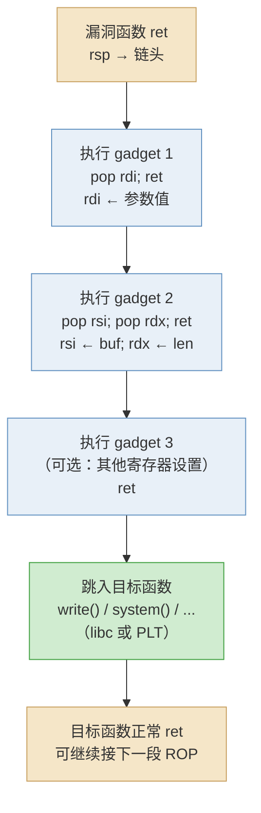
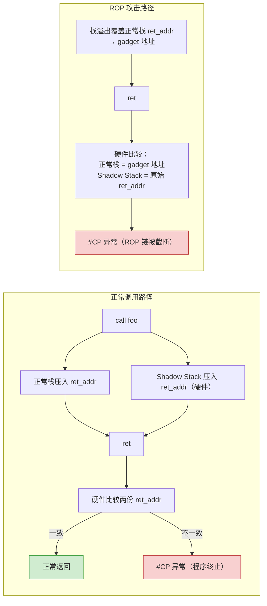

# 二进制漏洞与利用基础（6）· ROP入门

> [!abstract] TL;DR
> - **问题**：NX（不可执行栈）让注入 shellcode 的路走不通了——栈是可写的但不可执行，攻击者无法直接运行自己写进去的代码。
> - **ROP（Return-Oriented Programming）的答案**：不注入新代码，而是把已在内存中的、以 `ret` 结尾的短指令片段（**gadget**）的地址串在栈上，靠每条 `ret` 弹出下一个地址来串联执行，最终组合成期望的语义——这些 gadget 全部来自合法的可执行区域，NX 没有任何意义。
> - **地位**：ROP 是 [[05.ret2libc]] 的泛化——`ret2libc` 只是 ROP 的一个特例（一个 gadget 跳 libc 函数）；完整的 ROP 链可以做任意图灵完备的计算。
> - **缓解三件套**：CFI（Control-Flow Integrity）约束间接跳转的合法目标；Shadow Stack / Intel CET 保护返回地址；ASLR（详见系列 34）让 gadget 地址难以预测。

> [!warning] 教学声明
> 本篇内容用于理解 ROP 技术的**原理与防御**，面向安全教育、CTF 学习和防御导向的工程师。所有示例均为最小化教学 demo，不针对真实软件，不提供即用利用载荷。请勿将本文内容用于任何非授权测试或攻击行为。

---

## 概述与定位

### NX 之后，攻击面去哪了

[[03.Shellcode概念]] 讲过：shellcode 需要栈可执行。开启 NX（`-z noexecstack`，现代编译器默认）后，栈标记为 `W^X`——可写但不可执行，CPU 执行到栈地址时触发缺页异常，shellcode 失效。

看似完美的防御，有一个根本漏洞：**程序已经加载的代码段是可执行的**。攻击者不需要注入新代码，只要能控制"接下来执行哪一段已有代码"就够了。

[[05.ret2libc]] 迈出了这一步：覆盖返回地址跳到 `system()`，让 libc 替你"干活"。但 ret2libc 有局限——它只能直接调用一个函数，参数传递在 x86-64 上还需要把 `rdi` 等寄存器装好。**ROP 把这个思路推到极致**：用若干以 `ret` 结尾的短片段串联，实现任意寄存器设置、任意内存读写、任意调用序列，在不注入任何新代码的前提下达到图灵完备。

### 本篇在系列中的位置

| 维度 | 本篇 | 相邻 |
|---|---|---|
| 前驱 | NX 绕过的完整形态 | [[05.ret2libc]]（最简 ROP） |
| 后继 | GOT/延迟绑定上的精确打击 | [[07.GOT劫持与ret2dl-resolve]] |
| 机制依赖 | PLT/GOT/延迟绑定 | [[14.动态链接与加载器详解/08.PLT与GOT与延迟绑定.md]] |
| 汇编基础 | ret 指令/寄存器/栈 | [[21.Asm/00 总览.md]] |
| 缓解细节 | CET `.plt.sec`、Shadow Stack | [[14.动态链接与加载器详解/08.PLT与GOT与延迟绑定.md]] §PLT.SEC 节 |

---

## 原理与机制

### 什么是 gadget

**Gadget = 以 `ret` 结尾的一段短指令序列**，这些指令已存在于二进制的可执行段（`.text`、libc、ld.so、vdso……）中。

```nasm
; 典型 gadget 举例（x86-64，示意偏移）
0x401234:  pop rdi
0x401235:  ret

0x401291:  pop rsi
0x401292:  pop rdx
0x401293:  ret

0x40abc0:  mov [rdx], rax
0x40abc2:  ret

0x4011f0:  xor eax, eax
0x4011f2:  ret
```

每个 gadget 都很短——一两条真正有用的指令，紧跟一个 `ret`。它们并不是攻击者人为放进去的，而是编译器/链接器产生的正常代码片段（或者字节偏移对齐后"意外"形成的合法指令序列）。

### ret 指令的工作方式

理解 ROP 的核心，是理解 `ret` 做了什么：

```
ret 等价于：
  pop rip       ; 从 [rsp] 取 8 字节 → 放入 RIP（指令指针）
  rsp += 8      ; 栈指针上移
```

正常函数调用时，`ret` 弹出的是 `call` 压入的返回地址。但当攻击者用栈溢出覆盖了栈内容，`ret` 弹出的就是攻击者精心布置的 **gadget 地址**。执行完那个 gadget 的几条指令后，再次 `ret`，弹出下一个 gadget 地址——如此循环。

### ROP 链的串联原理

设攻击者想执行 `write(1, buf, len)`（syscall 或 libc 调用），需要在调用前把寄存器设好：`rdi=1, rsi=buf, rdx=len`。

栈上布置如下（由低地址到高地址，当漏洞函数 `ret` 时 `rsp` 指向这里）：

```
┌───────────────────────────────────┐  ← rsp（漏洞函数 ret 时）
│  gadget_1 地址：pop rdi; ret      │  ← 弹入 rip，执行 pop rdi
├───────────────────────────────────┤
│  0x0000000000000001               │  ← pop rdi 消耗，rdi = 1
├───────────────────────────────────┤
│  gadget_2 地址：pop rsi; pop rdx; ret │
├───────────────────────────────────┤
│  buf 的地址                       │  ← pop rsi 消耗，rsi = buf
├───────────────────────────────────┤
│  len 的值                         │  ← pop rdx 消耗，rdx = len
├───────────────────────────────────┤
│  write 函数地址（libc 或 plt）    │  ← 最终 ret 跳入 write
└───────────────────────────────────┘
```

每次 `ret` 弹出下一个地址放入 `rip`，然后执行那段 gadget，gadget 末尾的 `ret` 再弹出下下个地址……控制流就被 gadget 链"串"了起来，全程不需要任何注入代码，一切都在已有的可执行区域里发生。

### Mermaid：ROP 链在栈上的布局与串联



### 为什么绕过了 NX

NX 的约束是："不允许执行标记为不可执行的内存页中的代码"。ROP 从来不执行不可执行的内存——每一个 gadget 都位于 `.text`、libc、ld.so 等**本来就可执行**的代码段。CPU 和操作系统没有理由拒绝执行它们。NX 保护的是"别让栈/堆上的数据被当代码执行"，而 ROP 复用了"已有的合法代码片段"，完全绕开这一约束。

### ret2libc 是 ROP 的特例

[[05.ret2libc]] 是最简单的 ROP：只有"一个 gadget"——直接跳到 `system()`。但它在 x86-64 上还需要先设置 `rdi` 寄存器（x86-64 调用约定：第一个参数走 `rdi`，参见 [[21.Asm/00 总览.md]] 中汇编调用约定部分）。严格来说，完整的 x86-64 ret2libc 本身就已经是一条两节点的 ROP 链：

```
栈布局（x86-64 ret2libc）：
  [ pop rdi; ret 的地址 ]   ← 第一个 gadget
  [ "/bin/sh\0" 地址    ]   ← pop rdi 消耗 → rdi = &"/bin/sh"
  [ system 地址         ]   ← 第二个 gadget（即 system 函数入口）
```

从这里可以清楚地看出 ROP 的泛化关系：ret2libc = 链长为 2 的 ROP 链。

---

## 最小示例（教学 demo）

> [!warning] 教学环境声明
> 以下示例**关闭了所有现代防护**以演示 ROP 原理。**生产环境必须开启这些防护**（默认即开启）。仅用于理解漏洞成因，请勿在非授权环境运行真实利用。

### 存在漏洞的 C 程序

```c
// vuln_rop.c —— 教学 demo，演示 ROP 利用的目标结构
// 刻意不安全：用 gets()，关闭所有现代防护编译
#include <stdio.h>
#include <unistd.h>

void vuln(void) {
    char buf[64];
    gets(buf);       // 无边界检查，典型缓冲区溢出
}

int main(void) {
    vuln();
    return 0;
}
```

**教学环境编译命令（关闭防护）：**

```bash
# 仅教学演示：关闭栈保护、NX、PIE，以便观察 ROP 原理
# 生产环境绝不应如此编译
gcc vuln_rop.c -o vuln_rop \
    -fno-stack-protector \
    -no-pie \
    -Wl,-z,norelro
# 注意：此处未加 -z execstack——ROP 不需要可执行栈，这正是它绕过 NX 的关键
```

> [!warning] 示例输出为示意
> 以下所有地址、偏移均为代表性示意值，非本机实跑；实际值随编译器版本、系统库、ASLR 而变。

### 用 checksec 验证防护状态

```bash
checksec --file=vuln_rop
```

```text
[*] 'vuln_rop'
    Arch:     amd64-64-little
    RELRO:    No RELRO
    Stack:    No canary found
    NX:       NX enabled          ← NX 仍然开启！ROP 就是来绕过它的
    PIE:      No PIE
```

> [!warning] 示例输出为示意

关键观察：**NX 是开启的**——这个 demo 的意义正在于：即使 NX 阻止了 shellcode，ROP 仍能完成控制流劫持。

### 溢出偏移的计算

`vuln()` 的栈帧示意（x86-64，示意值）：

```
  [buf: 64 字节]
  [saved rbp: 8 字节]    ← 共需 72 字节填充
  [返回地址: 8 字节]     ← 从这里开始放 ROP 链
```

填充量 = `sizeof(buf)` + `sizeof(saved rbp)` = 64 + 8 = 72 字节。

### gadget 查找概念

实际构造 ROP 链时，需要用工具在二进制（以及已加载的 libc）中扫描所有以 `ret` 结尾的指令片段：

- **ROPgadget**：`ROPgadget --binary vuln_rop --rop` 输出所有 gadget 及其地址。
- **ropper**：`ropper -f vuln_rop` 类似功能，支持多种过滤。

这些工具本质上是**静态扫描字节序列**：在所有可执行节中，找出每个 `c3`（`ret` 的字节码）之前的若干字节，反汇编后按"有用性"过滤。

---

## 利用思路（原理层）

### 构造 ROP 链的一般步骤

以下仅描述原理，**不提供可直接复用的载荷**：

1. **确定溢出偏移**：计算从 buf 起点到返回地址的距离（gdb/pwndbg 的 `cyclic` 辅助）。
2. **扫描 gadget**：用 `ROPgadget` 或 `ropper` 在二进制和 libc 中找 `pop rdi; ret`、`pop rsi; ret`、`pop rdx; ret` 等参数设置 gadget。
3. **定位目标函数**：在 libc 中找 `system()`、`execve()` 等，或者通过 PLT/GOT 条目访问（参见 [[14.动态链接与加载器详解/08.PLT与GOT与延迟绑定.md]]）。
4. **定位数据**：找 `/bin/sh\0` 字符串在 libc 或 `.data`/`.bss` 中的地址。
5. **拼装链**：按调用约定顺序（见 [[21.Asm/00 总览.md]]）在栈上排布：`[gadget 地址][参数值][gadget 地址][参数值]…[函数地址]`。
6. **触发**：通过漏洞（溢出 / 格式化字符串写返回地址等）把精心构造的栈内容送入，等待 `ret`。

### ASLR 打破 gadget 地址

现代系统开启 ASLR 后，libc 加载基址每次都不同，直接硬编码 gadget 地址失效。实际利用还需要：

- 先通过**信息泄露**（[[13.现代利用与信息泄露]]）获取 libc 某个已知函数的运行期地址；
- 计算 libc 基址偏移，再加上 gadget 在 libc 内的静态偏移，得到运行期 gadget 地址；
- 这也是 ROP 与信息泄露必须配合的原因——ASLR 的详细机制见系列 34（[[34.现代二进制防护机制/00.现代二进制防护机制总览]]）。

### gadget 来源的多样性

| 来源 | 特点 |
|---|---|
| 主二进制 `.text` | 偏移固定（无 PIE 时）；gadget 数量少 |
| libc | gadget 极为丰富（`pop rdi; ret` 等几乎必有）；受 ASLR 影响 |
| ld.so（动态链接器） | 也是可执行段，常被忽略但 gadget 可用 |
| vdso | 内核映射的辅助代码，地址相对稳定（部分场景） |
| 目标二进制依赖的其他 .so | 按需选用 |

---

## JOP 与 COP 简述

ROP 依赖 `ret` 串联。防御者可以针对 `ret` 特别防护（如 Shadow Stack 校验返回地址）。于是有了两个变体：

### JOP（Jump-Oriented Programming）

用**间接跳转**（`jmp [reg]`）替代 `ret` 串联控制流。每个 JOP gadget 以某条间接跳转结尾，靠"调度器（dispatcher）"gadget 统一推进"虚拟 PC"。JOP 可绕过只监控 `ret` 的后向 CFI，但对前向 CFI（约束间接跳转目标的合法集合）有抵抗力弱的问题。

### COP（Call-Oriented Programming）

用**间接调用**（`call [reg]`）串联。与 JOP 思路类似，利用间接 call 的语义推进链。

这两种技术都说明：只要攻击者能控制间接转移指令的目标，就能串联"已有代码片段"绕过 NX。这正是**前向 CFI** 要重点解决的问题（约束间接 call/jmp 的合法目标集合）。

---

## 缓解与防御

ROP 利用了三个前提：①能覆盖控制流转移（栈溢出等）；②gadget 地址可预测；③`ret` 不受校验。针对这三点有对应的缓解层次：

### 1. 防止覆盖控制流

| 机制 | 防的是什么 | 启用方式 |
|---|---|---|
| Stack Canary | 检测栈溢出覆盖返回地址 | `-fstack-protector-strong`（gcc 默认） |
| SafeStack | 把返回地址放到隔离的"安全栈" | Clang `-fsanitize=safe-stack` |
| 栈上边界检查 | 越界写入提前报错 | AddressSanitizer（调试期） |

Canary 本身不能彻底防 ROP（可以先泄漏 canary 值再绕过），但它使直接的栈溢出利用门槛大幅提高。详见 [[04.栈Canary原理]]。

### 2. 让 gadget 地址不可预测

| 机制 | 原理 | 依赖 |
|---|---|---|
| **ASLR**（地址空间布局随机化） | 每次加载 libc/ld.so/栈/堆的基址随机，gadget 绝对地址不可预测 | 内核 `randomize_va_space=2` |
| **PIE**（位置无关可执行文件） | 主二进制本身也随机加载，与 ASLR 协同 | `-fpic -pie` |

ASLR 单独不能防住"先泄漏再 ROP"的组合拳，但大幅提高了单次利用成功的难度。ASLR 细节见系列 34（[[34.现代二进制防护机制/00.现代二进制防护机制总览]]）。

### 3. 校验/约束控制流转移

这是最根本的对抗层次，分"前向 CFI"（约束间接跳转/调用的合法目标）和"后向 CFI"（保护返回地址完整性）：

#### 前向 CFI（Control-Flow Integrity，约束间接 call/jmp）

CFI 在编译期分析程序的调用图，为每个间接跳转/调用插入运行期检查：**目标地址必须在事先计算好的合法目标集合中**，否则终止程序。

```
有 CFI：
  call rax                    ; 间接调用
  → 编译器插入运行期检查：rax 是否在合法目标集合内？
  → 合法：继续；非法：abort / trap
```

- Clang：`-fsanitize=cfi`，多种粒度（`-fsanitize=cfi-icall` 保护间接调用）
- GCC：`-fcf-protection=full`（配合 Intel CET IBT，见下）
- Microsoft MSVC：Control Flow Guard（CFG）

> [!warning] CFI 的局限
> CFI 约束的是"合法调用目标的集合"，但不能把集合缩小到"每个调用点唯一的目标"（类型精度有限）。精巧的 ROP 链有时可以找到在 CFI 合法目标集合内的 gadget（称为 **CFI 合规 ROP**）。因此 CFI 提高了攻击难度，但不是银弹。

#### 后向 CFI（Shadow Stack / Intel CET）

后向 CFI 的核心思路：**把返回地址的"可信副本"存在攻击者无法改写的地方**，`ret` 执行前把栈上的返回地址与副本对比，不一致就终止。

**Intel CET（Control-flow Enforcement Technology）** 提供硬件级支持：

- **IBT（Indirect Branch Tracking）**：所有合法的间接跳转落点必须有 `endbr64` 指令（前向保护）。链接器为此在 `.plt.sec` 中为每个 PLT 条目加 `endbr64`——这正是 [[14.动态链接与加载器详解/08.PLT与GOT与延迟绑定.md]] 中讲解 `.plt.sec` 节时提到的原因。
- **Shadow Stack（SHSTK）**：CPU 维护一个独立的"影子栈"，`call` 时同时向影子栈压入返回地址，`ret` 时对比，不一致触发 `#CP` 异常。影子栈位于受 `WRSS` 保护的特殊内存页，普通写指令无法修改，攻击者通过栈溢出覆盖的只是正常栈上的返回地址——影子栈副本完好，`ret` 时必然检测到不一致。



**Linux 内核支持**：从内核 6.6 起，对 shadow stack（`SHADOW_STACK_ENABLE`）有完整支持；glibc 2.39+ 对 CET 做了集成适配；需要 CPU（Ice Lake+ 或 Alder Lake+）和内核同时支持。

**编译器选项**：

```bash
# GCC/Clang：启用 CET 支持
gcc -fcf-protection=full ...

# 链接时指定（生成 GNU_PROPERTY_X86_FEATURE_1_SHSTK 属性）
gcc -fcf-protection=full -Wl,-z,shstk ...
```

**检查二进制是否带 CET 标记**：

```bash
readelf -n vuln_rop | grep -A2 "PROPERTY"
```

```text
Displaying notes found in: .note.gnu.property
  ...
  Properties: x86 feature: IBT, SHSTK
```

> [!warning] 示例输出为示意

### 4. Full RELRO（保护 GOT）

在 ROP 链中，一个常见的进阶操作是改写 GOT 槽位（参见 [[11.ELF文件详解/17.got节.md]] 第 12 节；以及下一篇 [[07.GOT劫持与ret2dl-resolve]]）。**Full RELRO** 在 libc 加载完成后把 `.got.plt` 锁成只读，使这条路失效：

```bash
gcc vuln_rop.c -o vuln_rop_hardened \
    -fstack-protector-strong \
    -Wl,-z,relro,-z,now \
    -fpie -pie
```

### 防御汇总

| 层次 | 机制 | 针对 ROP 哪个前提 | 启用方式 |
|---|---|---|---|
| 防溢出 | Stack Canary | 防返回地址覆盖 | `-fstack-protector-strong` |
| 地址随机化 | ASLR + PIE | gadget 地址不可预测 | 内核默认；`-fpie -pie` |
| 前向 CFI | Clang CFI / IBT | 约束间接跳转目标 | `-fsanitize=cfi`；`-fcf-protection=full` |
| 后向 CFI | Shadow Stack / CET SHSTK | `ret` 时校验返回地址 | `-fcf-protection=full -Wl,-z,shstk` |
| GOT 保护 | Full RELRO | 防 GOT 改写配合 ROP | `-Wl,-z,relro,-z,now` |

没有单一机制能完全阻止 ROP；**深度防御（多层叠加）** 才是现实方案。

---

## 检测与工具

| 目标 | 工具 | 命令示例 |
|---|---|---|
| 查 gadget | ROPgadget | `ROPgadget --binary ./vuln --rop` |
| 查 gadget | ropper | `ropper -f ./vuln --search "pop rdi"` |
| 检查防护状态 | checksec | `checksec --file=./vuln` |
| 检查 CET 属性 | readelf | `readelf -n ./vuln` |
| 调试 / 观察 ROP 执行 | gdb + pwndbg | `pwndbg` 插件的 `rop` / `telescop` 命令 |
| 反汇编找 gadget | objdump | `objdump -d -M intel ./vuln \| grep -B5 "ret"` |

> [!warning] 示例输出为示意
> 以上命令输出随目标二进制、系统版本、工具版本而变，均需在对应环境中实际运行以获取真实结果。

---

## 小结

1. **ROP = 复用已有代码片段**：gadget 是以 `ret` 结尾的短指令序列，来自程序/libc/ld.so 等可执行区域，不需要注入任何新代码，因此 NX 完全无效。
2. **串联机制**：`ret` 弹出栈上的 gadget 地址送入 `rip`，执行后再 `ret` 弹下一个，借此串联任意语义——图灵完备。
3. **ret2libc 是特例**：ret2libc = 链长为 2 的 ROP（先 `pop rdi; ret` 装参数，再跳 `system`）；完整 ROP 是其泛化。
4. **x86-64 传参需要 gadget**：x86-64 调用约定参数走寄存器（`rdi/rsi/rdx…`），与 x86-32 压栈传参不同，因此 x86-64 ROP 必须先用 `pop rX; ret` gadget 把寄存器设好。
5. **JOP/COP**：用间接 jmp/call 替换 `ret` 串联，可绕过只监控 `ret` 的后向防护。
6. **缓解三层**：①Canary/SafeStack 防覆盖；②ASLR+PIE 让地址不可预测；③CFI（前向）+ Shadow Stack/CET（后向）约束控制流——缺一不可，深度防御是唯一现实方案。

---

## 相关阅读

- **前驱：最简 ROP（ret2libc）**：[[05.ret2libc]]
- **后继：GOT/PLT 上的精确打击**：[[07.GOT劫持与ret2dl-resolve]]
- **PLT/GOT/延迟绑定 + .plt.sec（CET 前向保护）**：[[14.动态链接与加载器详解/08.PLT与GOT与延迟绑定.md]]
- **汇编基础（ret 指令/寄存器/调用约定）**：[[21.Asm/00 总览.md]]
- **GOT 改写攻防基础**：[[11.ELF文件详解/17.got节.md]]
- **信息泄露（ASLR 下 ROP 必须配合）**：[[13.现代利用与信息泄露]]
- **防护机制系统讲解（ASLR/CET/CFI）**：[[34.现代二进制防护机制/00.现代二进制防护机制总览]]
- **栈 Canary（防止返回地址覆盖）**：[[04.栈Canary原理]]

---

⬅️ 上一篇 [[05.ret2libc]] ｜ 🏠 [[00.二进制漏洞与利用基础总览]] ｜ 下一篇 [[07.GOT劫持与ret2dl-resolve]] ➡️
