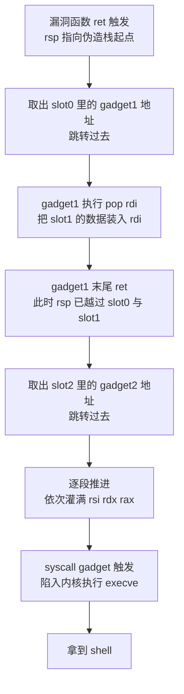
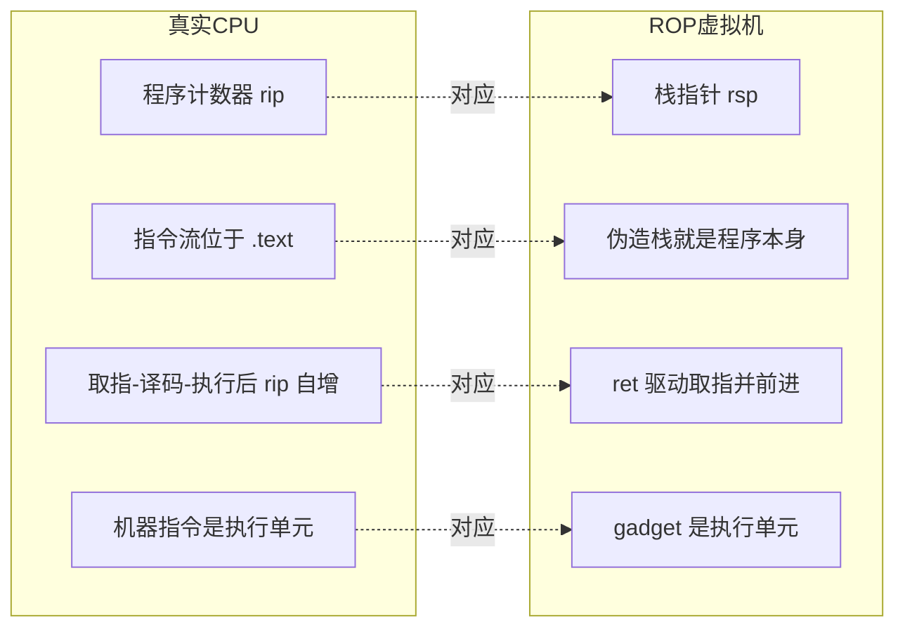
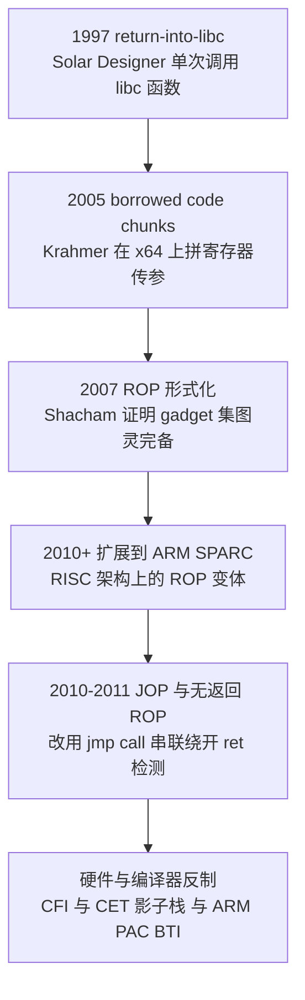

# 二进制漏洞与利用基础（6）· ROP入门
> [!abstract] TL;DR
> - ROP（Return-Oriented Programming，返回导向编程）的本质是把**栈**变成新的指令流、把 `rsp` 变成新的程序计数器：每条 `ret` 从栈上取下一个 gadget 地址跳过去执行。攻击者不注入任何字节，只**重排既有可执行代码碎片的执行顺序**，因此天然绕过 NX/DEP。
> - gadget 是以 `ret`（`0xC3`）等控制转移指令结尾的短序列；x86/x64 变长指令让 `0xC3` 能出现在指令中部，从**非对齐偏移**切入可"变出"编译器从未生成的非预期指令，gadget 密度因此极高——Shacham 2007 证明仅凭 libc 的 gadget 集就**图灵完备**。
> - 一条 gadget 链在栈上呈"gadget 地址 + 数据 + 下一个地址 + 数据……"交替排布；`ret` 负责取指与前进，`pop` 类 gadget 负责把栈上数据灌进寄存器，为后续系统调用或函数调用备好参数。
> - x86 靠栈传参，ROP 链几乎等于"函数地址 + 参数序列"；x64 靠寄存器传参（`rdi/rsi/rdx/rcx/r8/r9`），必须先用 `pop rdi; ret` 之类 gadget 灌寄存器——这是两平台 ROP 手感差异的根源，也是 `rdx` gadget 稀缺、催生下一篇 ret2csu 的原因。
> - ret2syscall / ret2libc 是 ROP 的退化特例（极短链、单次调用）；本篇要建立的是"**gadget 目录 + 链式组合**"的通用计算观，把利用从"跳到某个点"升级为"用碎片编程"。
> - 现代防御正面掐 ROP：CET 影子栈让被篡改的返回地址在 `ret` 时与硬件副本比对即崩，IBT/CFI 收窄间接转移目标；但在无影子栈、且能信息泄露绕过 ASLR 的环境里，ROP 仍是 pwn 的主干骨架。

## 概述与定位

如果把二进制利用的历史看成一场攻防军备竞赛，ROP 处在一个关键的"相变点"上。最早的栈溢出（本系列第 2 篇）把 shellcode 直接写进栈里，再让返回地址跳回栈上执行——这是"注入并运行我的代码"。防御方随即祭出 **NX/DEP**（数据执行保护，详见 [[34.现代二进制防护机制/00.现代二进制防护机制总览]]），把栈、堆等数据页标为不可执行，注入式 shellcode 当场哑火。攻击方的反击思路发生了根本转向：**既然不能运行"我的"代码，那就运行"你的"代码，只是按"我的"顺序**。这类攻击统称**代码复用攻击（code-reuse attack）**，ROP 就是它的集大成形态与通用框架。

本系列前几篇其实已经让你尝过 ROP 的味道。第 4 篇的 ret2text 是"跳回程序自身既有的一段逻辑"，ret2syscall 则已经用 `pop; pop; pop; ret` 加 `int 0x80/syscall` 拼出了一条**三四段的迷你 gadget 链**；第 5 篇 ret2libc 是"跳回一整个 libc 函数"。这些都是 ROP 的**具体招式或退化特例**。而本篇要做的是**退后一步、给这套方法命名并抽象**：返回导向编程不是某一招，而是一种**通用计算范式**——把散落在可执行段里的指令碎片当作一套"虚拟指令集"，用被劫持的栈把它们**编排成任意程序**。理解这一层，你才能在找不到现成 `system` 或 `int 0x80` 时，自己"用碎片编程"造出想要的效果。

为界定边界，本篇聚焦**通用原理、gadget 分类与链式构造理论、图灵完备性、x86/x64 差异**。而**通用 gadget 与 ret2csu**（解决 `rdx` 难找问题）留给第 7 篇；**栈空间不够时的栈迁移/stack pivot** 留给第 8 篇；**用 `jmp/call reg` 而非 `ret` 串联的 JOP/COP** 留给第 13 篇；**ASLR/PIE 的地址随机化与信息泄露绕过**留给第 15 篇；**pwntools 与 ROPgadget 的工具链细节**留给第 22 篇。本篇默认攻击环境为经典 x86-64 Linux、NX 开启、暂不考虑 ASLR（或已拿到泄露），以便把 ROP 的骨架讲透。

## 原理与机制

要理解 ROP，先把 `ret` 这条指令拆到微观。`ret` 在 x86-64 上等价于 `pop rip`：它从 `[rsp]` 取出 8 字节装入指令指针 `rip`，同时 `rsp += 8`。也就是说，**`ret` 一条指令同时干了两件事——决定"跳到哪"、并把"读取位置"往前推进一格**。正常函数返回时，`[rsp]` 存的是调用者压入的合法返回地址；而当栈溢出把保存的返回地址及其后连续若干槽位全部改写成攻击者数据后，`ret` 就成了一台听话的"取指-跳转-前进"引擎，源源不断地从伪造栈上取地址、跳过去执行。

**gadget（小配件/指令碎片）** 就是一段以 `ret` 结尾的短指令序列，例如经典的 `pop rdi; ret`。它的妙处在于：执行完自身逻辑后，末尾的 `ret` 会自动取出栈上**下一个** gadget 地址并跳过去。于是只要把栈布置成"gadget1 地址、gadget1 要吃的数据、gadget2 地址、gadget2 要吃的数据……"这样地址与数据交替的序列，控制流就会像多米诺骨牌一样，从一个 gadget 精确地滑向下一个。这条被精心排布、驱动一连串 gadget 依次执行的栈数据，就叫 **gadget 链（ROP chain）**。

这里藏着 ROP 最优雅的洞察——**栈就是程序，`rsp` 就是程序计数器**。在真实 CPU 里，`rip` 指向 `.text` 里的指令流，取指-译码-执行后 `rip` 自动前进；在 ROP 构筑的"虚拟机"里，`rsp` 指向伪造栈里的**地址流**，每条 gadget 末尾的 `ret` 充当"取下一条指令并前进"的时序驱动，而每段 gadget 就是这台虚拟机的一条"指令"。攻击者不再往 `rip` 喂字节，而是往 `rsp` 喂地址——控制流的操纵权，从"写指令"降维成了"写数据"。

NX 之所以拦不住 ROP，正因为**全程没有任何"数据被当作代码执行"**：真正被 CPU 取指执行的每一个字节都躺在合法的、带执行权限的 `.text` 或 libc 代码段里；而攻击者写进栈的只是**地址和整型数据**，它们始终作为数据被 `pop`/`ret` 读取，从不被译码成指令。NX 检查的是"执行的页有没有执行权限"，ROP 执行的页恰恰都有——防线被完美绕开。

下面这张图展示一条链如何被 `ret` 逐段驱动执行：



把它和真实 CPU 并排映射，"栈即程序"的类比会更清晰：



## gadget 语义、发现与链式构造详解

这一节把 ROP 从"能跑通一条链"深化到"理解它为何是一套完整的计算体系"。

### gadget 的解剖：结尾指令决定它属于哪种复用范式

一段 gadget 由"**若干有用的工作指令 + 一条控制转移的结尾指令**"构成。结尾指令的种类，直接决定了它属于哪一族代码复用技术：

- 结尾是 `ret`（`0xC3`），或带弹栈的 `ret imm16`（`0xC2 iw`，弹出返回地址后再把 `rsp` 额外加上 `imm16`）——这就是**ROP** 的标准 gadget，本篇主角。
- 结尾是 `jmp reg` / `jmp [reg]`——归为 **JOP（面向跳转编程）**；因为 `jmp` 只跳不"前进 `rsp`"，JOP 必须额外准备一个**分发器（dispatcher）gadget** 来充当调度中枢（详见第 13 篇）。
- 结尾是 `call reg`——归为 **COP（面向调用编程）**。

对比之下就能体会 `ret` 为何是最顺手的串联原语：**它把"跳转"与"程序计数器前进"合二为一**，天然形成流水线；而 `jmp`/`call` 缺了"前进"这一半，必须靠额外机制补偿。这也解释了为什么在影子栈（专防 `ret`）普及后，攻击者会转向 JOP/COP。

### 非预期指令：x86 变长编码给出的"免费" gadget 海洋

Shacham 2007 那篇奠基论文最反直觉的贡献，是指出 **gadget 根本不必是编译器有意生成的指令**。x86/x64 是**变长指令集**，指令边界由 CPU 从 `rip` 当前位置**顺序译码**才确定。这意味着：只要某个字节恰好是 `0xC3`，哪怕它原本是某条长指令里的立即数、偏移量或 ModRM 字节的一部分，只要让控制流**跳到它前面某个偏移**，CPU 就会从那个偏移开始重新译码，得到一串**原程序里从未"打算"存在的指令**——这叫**非预期指令流（unintended instruction stream）**。

举个直观例子：编译器生成的 `mov $0x000000C3, %eax` 其机器码里含有一个 `0xC3` 字节；若把它当普通指令，它只是给寄存器赋值，但若控制流精准落到那个 `0xC3` 上，它就摇身变成一条 `ret`。再如某些指令的 ModRM/SIB 字节里天然嵌着 `0x5F`（`pop rdi`）后跟 `0xC3`，于是"`pop rdi; ret`"这段 gadget 可能**根本不对应源码里任何一行**。正因如此，gadget 的可用密度远超"函数返回点数量"的量级——Shacham 据此证明：**仅用一份标准 libc 里的 gadget，就能构造出图灵完备的指令集**（算术、访存、赋值、乃至基于标志位改写 `rsp` 实现的条件分支一应俱全）。ROP 由此从"少数几次函数复用"跃升为"任意计算"。

对应地，gadget 挖掘工具的核心算法就是：**扫描整个可执行段里所有的结尾字节**（`0xC3`、`0xC2`、以及 JOP 关心的 `0xFF /4`、COP 的 `0xFF /2`），对每个结尾**向前回溯**若干字节，尝试把这段字节译码成"长度有界、无非法/无分支中断"的合法指令序列，逐一登记入库。这就是 ROPgadget、ropper 背后干的事。

### gadget 分类：把碎片看成一套"虚拟指令集"

真正让 ROP 好用的心法，是**按语义给 gadget 归类，建立一份 gadget 目录**，把它当作一套虚拟 ISA 来"编程"。常见类别：

- **立即数载入寄存器**：`pop reg; ret`——从栈上取一个受控值灌进寄存器。这是备参数的主力。
- **寄存器间搬运**：`mov rdi, rax; ret`、`xchg`——在寄存器之间倒腾数据。
- **内存写原语**：`mov [reg1], reg2; ret`——把 `reg2` 的值写进 `reg1` 指向的地址。用它可把 `/bin/sh` 字符串写进一块可写内存（如 `.bss`），或篡改 GOT 表项（详见 [[11.ELF文件详解/17.got节]]）。
- **内存读原语**：`mov reg1, [reg2]; ret`——从内存读值，常用于把 libc 地址读进寄存器辅助计算。
- **算术/逻辑**：`add reg1, reg2; ret`、`sub`、`xor`、`inc`——做加减异或，绕开坏字节或凑出需要的常量。
- **系统调用门**：`syscall; ret`（x64）或 `int 0x80`（x86）——万链归宗的收尾（细节见第 4 篇 ret2syscall）。
- **控制/收尾**：`leave; ret`（等价 `mov rsp, rbp; pop rbp; ret`，是栈迁移的关键，见第 8 篇）、以及基于 `rsp` 改写的"分支"。

有了这份目录，构造利用就变成一道"**用现有指令拼出目标语义**"的搭积木题。想调用 `execve("/bin/sh", NULL, NULL)`，无非是"把 `/bin/sh` 地址灌进 `rdi`、把 0 灌进 `rsi` 和 `rdx`、把系统调用号 59 灌进 `rax`、再触发 `syscall`"——每一步都能在目录里找到对应 gadget。

### 链在栈上的字节布局：地址与数据为何交替

理解链构造的关键，是想清楚 `pop` 会**消费掉紧跟在 gadget 地址之后的那个栈槽**。以 x64 下拼一个 `execve("/bin/sh",0,0)` 为例，栈（低地址在上、`ret` 自上而下依次消费）的布局是：

```
偏移     栈内容                       语义作用
+0x00    addr(pop rdi; ret)           gadget1 地址：漏洞函数的 ret 跳到这里
+0x08    addr("/bin/sh")              被 gadget1 的 pop 吃掉 -> 装入 rdi（filename）
+0x10    addr(pop rsi; ret)           gadget2 地址
+0x18    0                            被 gadget2 的 pop 吃掉 -> 装入 rsi（argv=NULL）
+0x20    addr(pop rdx; ret)           gadget3 地址
+0x28    0                            被 gadget3 的 pop 吃掉 -> 装入 rdx（envp=NULL）
+0x30    addr(pop rax; ret)           gadget4 地址
+0x38    59                           被 gadget4 的 pop 吃掉 -> 装入 rax（__NR_execve）
+0x40    addr(syscall; ret)           gadget5：陷入内核，execve 执行
```

看懂这张布局图，就抓住了 ROP 链的全部秘密：**每个 gadget 地址后面紧跟它 `pop` 要吃的数据**，`ret` 把 `rsp` 一格格往下推，控制流与数据消费严丝合缝地咬合前进。参数落在 `rdi/rsi/rdx` 而非栈上，是因为 x86-64 遵循 System V AMD64 调用规约用寄存器传前六个整型参数（详见 [[22.调用规约/06.SystemV_AMD64调用规约]]）；系统调用号 59 是 x86-64 的 `__NR_execve`（32 位下则是 `eax=11` 配 `int 0x80`）。

### 副作用与"gadget 卫生"：链断在哪、怎么补

理想 gadget 如 `pop rdi; ret` 干净利落，但现实往往只能找到带**副作用**的，例如 `pop rdi; pop rbp; ret`。这条会连弹两格：第一格进 `rdi`（想要的），第二格进 `rbp`（不想要，但栈会被多消费一格）。**必须在链里为这多出来的 `pop` 补一个填充值（padding）**，否则栈错位、`ret` 取到错误地址、链当场崩掉。这就是所谓的"**gadget 卫生**"：每选一段 gadget，都要把它**全部**指令的副作用（多弹几格、改了哪些寄存器、动了标志位）算进后续布局。一条链是否 robust，取决于你有没有把每段的副作用逐一记账。

此外还有几类实战约束：**栈预算**——链是线性向高地址增长的，若溢出能覆盖的空间不足以放下整条链，就得靠栈迁移把 `rsp` 挪到一块更大的可控内存（第 8 篇）；**坏字节**——若溢出是通过 `strcpy` 等函数写入的，地址里含 `0x00`/`0x0a`/`0x20` 等会被截断的字节时该 gadget 不可用，只能换一个等效地址或用算术 gadget 现场凑出目标值；**gadget 不可达**——某些寄存器（尤其 `rdx`）的干净 `pop` 在小型静态二进制里可能压根不存在，这正是下一篇 **ret2csu** 要解决的痛点：`__libc_csu_init` 里有一段"万能 gadget"能借 `mov` 序列把值搬进 `rdx/rsi` 等。顺带一提，最常用的 `pop rdi; ret`、`pop rsi; pop r15; ret` 往往就藏在 `__libc_csu_init` 尾部，逆向时可优先去那一带翻找。

### 图灵完备与"奇异机器"：ROP 的理论重量

需要点破一个理论层面的深意：ROP 的图灵完备**在实战中大多用不上，但它决定了 ROP 的表达上限**。Shacham 证明可以用 gadget 实现条件分支——基本思路是让某段 gadget 依据标志位（如比较结果）去**有条件地改写 `rsp`**，从而"跳过"或"跳回"一段链，等价于 `if`/循环。这类"由数据驱动、在既有代码之上涌现出的、非设计者预期的计算能力"，安全理论里称为**奇异机器（weird machine）**——漏洞利用的本质，就是把程序**逼进一个开发者从未设想的状态**，让它成为攻击者可编程的机器。不过实战中绝大多数利用链是**直线型**的（灌参数、调函数、触发 syscall），完整的分支/循环 ROP 程序极少手写，图灵完备更多是"证明这条路没有表达力天花板"的定心丸。

### 历史演进：从单次调用到通用范式，再到防御反制

ROP 不是一夜之间出现的，它是代码复用思想逐级抽象的产物：



1997 年 Solar Designer 的 return-into-libc 只是"跳回一个 libc 函数"（第 5 篇的 ret2libc 即其直系后代）；2005 年 Krahmer 的 "borrowed code chunks" 首次系统性地在 x86-64 上**借用代码片段拼装寄存器参数**，已具 gadget 链雏形；2007 年 Shacham 正式提出 ROP 之名并给出图灵完备证明，把它从"几次函数复用"升华为"通用计算范式"；随后学界把 ROP 移植到 ARM、SPARC 等 RISC 架构（第 21 篇会谈架构差异）；2010-2011 年 Checkoway 等人的"无返回 ROP"与 Bletsch 等人的 JOP 进一步摆脱对 `ret` 的依赖，为的正是绕开当时出现的针对 `ret` 的检测（第 13 篇）。这条演进线的每一步，几乎都对应着防御方前一步的封堵——攻防的螺旋始终在转。

## 工具视角与实战

> 以下命令与代码仅用于自有/授权靶场与 CTF 环境的学习复现。

**第一步：给二进制画像，确认 ROP 是否是正确解法。** 用 `checksec` 看保护：NX 开（否则直接 ret2shellcode 更省事）、有没有 PIE（无 PIE 则 `.text` gadget 地址固定，无需泄露）、Full RELRO 与否（影响能否打 GOT）。是否静态编译决定 gadget 富矿在哪——静态大二进制自带海量 gadget，动态小程序则常需先泄露 libc 再用 libc 的 gadget。

**第二步：挖 gadget、建目录。** 常用两件套：

```bash
# ROPgadget：列出全部 gadget，重点筛 pop/ret 与 syscall
ROPgadget --binary ./vuln --only "pop|ret"
ROPgadget --binary ./vuln | grep ": syscall"
# 在二进制自身数据段里找现成的 "/bin/sh" 字符串
ROPgadget --binary ./vuln --string "/bin/sh"

# ropper：支持语义化搜索，找"能把值弄进 rdi"的 gadget
ropper -f ./vuln --search "pop rdi"
ropper -f ./vuln --search "mov qword ptr [%], %"   # 找内存写原语
```

**第三步：用 pwntools 的 ROP 模块自动装链。** 手工排布字节偏移极易出错，pwntools 的 `ROP` 对象能把"我要调用哪个函数、参数是什么"翻译成正确的 gadget 序列并自动处理 `pop` 副作用：

```python
from pwn import *
context.arch = 'amd64'
elf = ELF('./vuln')
rop = ROP(elf)

# 声明式表达意图：pwntools 自动挑 gadget、排布栈、补 padding
binsh = next(elf.search(b'/bin/sh\x00'))
rop.call('system', [binsh])          # 等价一条 ret2libc
print(rop.dump())                    # 打印人类可读的链布局，逆向核对利器

# 或手工点名 gadget，精细控制
rop.raw(rop.find_gadget(['pop rdi', 'ret']).address)
rop.raw(binsh)
rop.raw(rop.find_gadget(['ret']).address)   # 有时需一个纯 ret 做栈对齐
payload = flat({ 0x48: rop.chain() })        # 0x48 为溢出到返回地址的偏移
```

这里有个 x86-64 特有的**栈对齐陷阱**值得单独点名：System V ABI 要求 `call` 指令执行时 `rsp` 16 字节对齐，而 ROP 链里每 `ret` 一次 `rsp` 只动 8 字节，很容易让进入 `system`/`printf` 等函数时 `rsp` 恰好错位到 8 字节边界，触发 libc 内部 `movaps` 指令的对齐异常而崩溃。经典解法是在链里**多塞一个纯 `ret` gadget** 补 8 字节把对齐扳回来——`rop.dump()` 出来的链若在函数调用前有一个孤零零的 `ret`，多半就是干这个的。

**逆向/调试视角：如何在内存里"认出"一条 ROP 链。** 在 gdb 里，一个强特征是**栈上出现一长串落在 `.text`/libc 代码段区间内的地址，彼此间还夹着规整的小整数或字符串指针**——正常栈不会这样。调试链时的标准工作流：在漏洞函数的 `ret` 处下断，`ret` 单步后观察 `rip` 是否精确落到你的第一个 gadget；随后对 `rsp` 用 `watch $rsp` 或反复单步，**盯着每条 gadget 末尾 `ret` 时 `[rsp]` 是不是下一个预期地址**——链断掉的地方，99% 是某段 gadget 的副作用（多弹一格）没记账、导致 `rsp` 与你的布局错位。先在纸面/脚本里把整条链的"每步 `rsp` 值 + 每步寄存器状态"预演一遍，再真正投递，是老手省时间的关键习惯。

## 安全性与正确使用

ROP 的攻防对偶，是理解现代防护体系（[[34.现代二进制防护机制/00.现代二进制防护机制总览]]）的最佳切入点。逐层看它面对的封堵：

- **NX/DEP**：ROP 存在的全部理由就是绕它，对 ROP 无效。
- **ASLR/PIE**：随机化 libc 与 `.text` 基址，让 gadget 地址不再固定。这是 ROP 在真实系统上最现实的障碍——**没有信息泄露就没有可用地址**，因此实战 ROP 几乎总要先配一个泄露原语（第 15 篇）。但无 PIE 的二进制其 `.text` 段地址固定，纯 `.text` gadget 仍可直接用。
- **Stack Canary**：在返回地址前埋随机哨兵值，线性溢出改到返回地址前必先破坏它、函数退出即 abort，掐断"能覆盖返回地址"这个前提（绕过见第 14 篇）。
- **CFI（控制流完整性）**：给间接跳转/调用加"合法目标白名单"。粗粒度 CFI 仍留有可用 gadget（大量函数入口是合法目标），细粒度 CFI 才显著压缩攻击面。
- **Intel CET —— 影子栈（Shadow Stack）**：这是对经典 ROP 的**正面致命一击**。CPU 维护一份受保护的、与普通栈平行的返回地址副本；每次 `call` 同时压两份，每次 `ret` 都拿普通栈上的返回地址与影子栈副本**硬件比对**，一旦被 ROP 篡改就不一致、立即触发 `#CP` 异常。它直接摧毁了"改写栈上返回地址"这一 ROP 的根基，也正是攻击者转向 JOP/COP（不依赖 `ret`）的直接动因。CET 的另一半 **IBT（间接分支跟踪）** 用 `ENDBR64` 标记合法间接跳转落点，进一步压制 JOP。ARM 侧的对偶是 **PAC（指针认证）** 与 **BTI（分支目标识别）**。

> [!caution] 合规红线与使用边界
> 本篇讲解 ROP 的原理、gadget 分类与链式构造，**目的是防御研究与安全教育**：唯有理解攻击者如何用碎片编程，才能读懂 NX/CFI/CET/影子栈这些防护"挡住了什么、又漏了什么"，进而写出更抗打的软件、做出更准的检测。
> - 文中所有技法**仅限在你自有或已获明确书面授权的环境、CTF 靶场与隔离实验环境中**复现学习。
> - **严禁**将其用于攻击任何未经授权的生产系统、他人系统或网络；也**不得**用于绕过商业软件授权、破解正版校验等武器化用途。
> - 本篇刻意只讲通用原理与教学级示例，**不提供针对任何真实目标的成品利用配方或武器化步骤**。将安全知识用于非授权攻击，在几乎所有司法辖区都构成犯罪，后果自负。
> - 秉持负责任披露：研究中若发现真实漏洞，应通过厂商 SRC 或 CVE 等正规渠道上报，而非公开或滥用。

## 小结

- ROP 的一句话内核：**把栈变成程序、把 `rsp` 变成 PC、把 `ret` 变成取指引擎、把散落的 gadget 变成虚拟指令**——不注入代码，只重排既有代码的执行顺序，从而绕过 NX。
- gadget 是以 `ret` 结尾的短序列；x86 变长编码带来的**非预期指令**让 gadget 密度极高，Shacham 据此证明其**图灵完备**。实战心法是**建 gadget 目录、按语义分类、像搭积木一样拼出目标计算**。
- 链在栈上"地址+数据"交替排布，`pop` 消费紧随其后的槽位；构造 robust 链的关键是**为每段 gadget 的全部副作用记账**（多弹格补 padding、坏字节规避、x64 的 16 字节栈对齐）。
- ret2syscall/ret2libc 是 ROP 的退化特例；本篇建立的是通用范式。**下一篇 ret2csu** 解决 `rdx` 等 gadget 稀缺问题，**第 8 篇栈迁移**解决栈空间不足，**第 13 篇 JOP/COP** 应对影子栈掐死 `ret` 后的困局。
- 防御对偶：ASLR 逼你先泄露、Canary 掐前提、**CET 影子栈从硬件层面正面终结经典 ret-ROP**。理解 ROP，本质是理解这场攻防螺旋的骨架。

## 相关阅读

- 本系列：[[00.二进制漏洞与利用基础总览|系列总览]] · [[04.返回导向：ret2text与ret2syscall|第4篇 ret2text与ret2syscall（gadget链的初体验）]] · [[05.ret2libc|第5篇 ret2libc（ROP 的退化特例）]] · [[07.ROP进阶：ret2csu与通用gadget|第7篇 ret2csu与通用gadget]] · [[08.栈迁移与stack pivot|第8篇 栈迁移]] · [[13.JOP与COP面向跳转与调用编程|第13篇 JOP/COP]] · [[15.ASLR与PIE绕过技术|第15篇 ASLR/PIE 绕过]] · [[22.利用开发工具链：pwntools与ROPgadget|第22篇 pwntools与ROPgadget]]
- 防护对偶：[[34.现代二进制防护机制/00.现代二进制防护机制总览]]（NX/ASLR/Canary/CFI/CET 的挡与漏）
- 底层前置：[[11.ELF文件详解/17.got节]]（GOT/PLT 表结构，内存写 gadget 的常见靶点）· [[22.调用规约/06.SystemV_AMD64调用规约]]（x64 寄存器传参约定，理解为何要 `pop rdi`）
- 内核延伸：[[52.Linux内核机制与内核利用/00.Linux内核机制与内核利用总览]]（内核态 ROP 与 KROP）
- 奠基论文：Hovav Shacham, *The Geometry of Innocent Flesh on the Bone: Return-into-libc without Function Calls (on the x86)*, ACM CCS 2007；Roemer, Buchanan, Shacham, Savage, *Return-Oriented Programming: Systems, Languages, and Applications*, ACM TISSEC 2012（综述）。
- 工具官方文档：ROPgadget（github.com/JonathanSalwan/ROPgadget）、ropper、pwntools 的 `ROP` 模块（docs.pwntools.com）。
- 书目：《The Shellcoder's Handbook》《Hacking: The Art of Exploitation》相关章节。

[[00.二进制漏洞与利用基础总览|⬆ 系列总览]] | [[05.ret2libc|← 上一章]] | [[07.ROP进阶：ret2csu与通用gadget|→ 下一章]]
