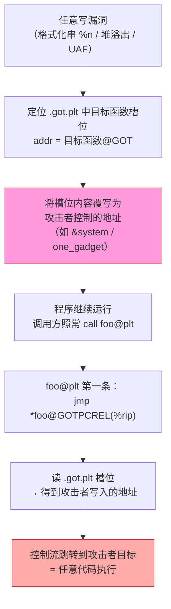
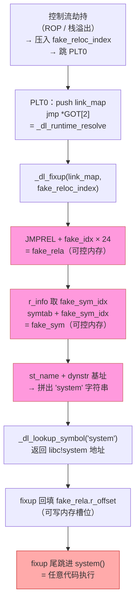

# 二进制漏洞与利用基础（7）· GOT劫持与ret2dl-resolve

> [!abstract] TL;DR
> - **GOT 改写劫持**：延迟绑定下 `.got.plt` 可写，攻击者利用任意写漏洞覆盖某函数的 GOT 项，下次调用该函数即跳转到攻击者控制的地址——控制流被无声劫持。Partial RELRO **拦不住**这条路径，唯有 Full RELRO（`-z relro -z now`）将 `.got.plt` 锁成只读。
> - **ret2dl-resolve**：无需改写 GOT，转而伪造 `Elf64_Rela`/`Elf64_Sym`/符号名字符串，骗动态链接器的 `_dl_runtime_resolve` 自己去解析并执行任意符号（如 `system`）。Full RELRO + `BIND_NOW` 使 `_dl_runtime_resolve` 在运行期不再被调用，从根本上截断这条链。
> - **两种手法共同前提**：延迟绑定开启（默认）且 `.got.plt` 可写（Partial RELRO 或无 RELRO）。

> [!warning] 教学环境声明
> 本篇示例均使用特意关闭现代防护的教学 demo（如 `-no-pie`、`-z norelro`），用于理解漏洞成因与防御原理。**生产环境默认开启 ASLR、PIE、Full RELRO、Stack Canary 等多重防护。** 所有内容仅用于安全教育与防御研究，请勿用于任何非授权测试。

本篇建立在 [[06.ROP入门]] 之上——ROP 解决"代码执行"问题，而 GOT 劫持和 ret2dl-resolve 解决"**用什么地址执行**"的问题，两者在真实利用链中常常配合出现。延迟绑定机制的完整原理见 [[14.动态链接与加载器详解/08.PLT与GOT与延迟绑定.md]]；GOT 的静态结构与防御见 [[11.ELF文件详解/17.got节.md]]；Full RELRO 与 ret2dl-resolve 的加载器视角见 [[14.动态链接与加载器详解/15.加载器视角的安全.md]]。

---

## 概述与定位

### 为什么 GOT 会成为劫持目标

Linux ELF 可执行文件调用共享库函数（如 `puts`、`system`）时，默认启用**延迟绑定（lazy binding）**：函数的真实地址不在程序启动时就填入，而是等到第一次被调用时才由 `_dl_runtime_resolve` 解析并**回填**到 `.got.plt` 的对应槽位。

这个"回填"机制要求 `.got.plt` 在解析完成之前保持**可写**，于是产生了一个直接的安全推论：

> 在延迟绑定的默认配置（或 Partial RELRO）下，`.got.plt` 在程序整个运行期都是可写的——任何能写任意内存的漏洞，都可以把它当成跳板。

当攻击者把 `puts@got` 从 `libc!puts` 的地址覆写成 `libc!system` 的地址，下一次 `puts(user_input)` 就变成了 `system(user_input)`。控制流劫持不需要修改任何代码段，也不需要破坏任何返回地址——完全在数据段完成。

### 两种手法的关系

| 手法 | 目标 | 前提 | 被 Full RELRO 拦截？ |
|---|---|---|---|
| GOT 改写劫持 | 直接覆盖 `.got.plt` 函数槽位 | `.got.plt` 可写 + 任意写漏洞 | 是（`.got.plt` 只读后不可写） |
| ret2dl-resolve | 伪造重定位/符号，骗解析器执行目标函数 | 任意写漏洞 + 能控制 `reloc_index` + 延迟绑定路径仍可触发 | 是（`_dl_runtime_resolve` 不再被调用） |

---

## 原理与机制

### GOT 改写劫持

#### 延迟绑定的数据流（正常路径）

每个外部函数在 `.got.plt` 里有一个专属槽位（8 字节，x86-64）。首次调用前，该槽位的值**回指 `.plt` 慢路径**；`_dl_fixup` 解析完成后把真实地址**回填进同一个槽位**。之后每次调用 `foo@plt`，第一条指令 `jmp *foo@GOTPCREL(%rip)` 直接读该槽位跳转，零额外开销。

这一机制的完整时序图见 [[14.动态链接与加载器详解/08.PLT与GOT与延迟绑定.md]]；这里只关注"槽位可写"带来的攻击面。

#### GOT 改写数据流



> **图解**：红色节点是攻击者注入的数据（覆写 GOT 槽位），橙色是被劫持的跳转。整个过程代码段不变、返回地址不变，只有 `.got.plt` 中 8 字节被替换。调用方和被调用函数（攻击目标）对此完全无感——**透明劫持**。

#### 前提条件与限制

1. **`.got.plt` 可写**：无 RELRO 或仅 Partial RELRO 时满足；Full RELRO 后 `.got.plt` 变为只读，该手法失效。
2. **任意写原语**：需要能向任意地址写任意值的漏洞（格式化字符串 `%n`、越界写、UAF 等）。
3. **地址已知（非 PIE / 已泄露）**：若开了 PIE+ASLR，需要先通过信息泄露确定 `.got.plt` 的运行时基址；无 PIE（`-no-pie`）时 `.got.plt` 地址在编译期固定。
4. **目标参数可控**（可选）：若要调用 `system("/bin/sh")`，还需让被劫持函数的第一个参数（`rdi`）恰好是 `"/bin/sh"` 字符串的地址——通常通过控制调用点上下文实现。

### ret2dl-resolve

#### 核心思路

当目标开启 Full RELRO（`.got.plt` 只读，直接改写失效），或攻击者想绕过 ASLR 不需要泄露 libc 地址，可以转而攻击**解析过程本身**：

`_dl_runtime_resolve(link_map, reloc_index)` 是延迟绑定解析器（详见 [[14.动态链接与加载器详解/08.PLT与GOT与延迟绑定.md]] 的逐步拆解）。它的工作逻辑是：

1. 按 `reloc_index` 在 `.rela.plt` 中定位一条 `Elf64_Rela` 重定位；
2. 从重定位的 `r_info` 高 32 位取符号索引，在 `.dynsym` 中找到 `Elf64_Sym`；
3. 用 `Elf64_Sym.st_name + .dynstr` 基址拼出符号名字符串；
4. 在所有已加载 DSO 中查找该名称，找到后把地址**回填到 `r_offset` 指向的位置**并**尾跳进入**。

攻击者的思路是：**把这条链上的数据全部伪造**，让解析器以为它在解析一个叫 `"system"` 的正常符号，然后自动执行回填+尾跳——借动态链接器之手完成任意函数调用。

这一攻击手法的加载器视角分析见 [[14.动态链接与加载器详解/15.加载器视角的安全.md]]（伪造链结构体字段完整列出在那里）；本篇从**漏洞利用角度**复述其威胁模型。

#### 伪造链结构

攻击者在可写内存（通常是 `.bss` 段或栈上可控区域）布置三层伪造数据：

```
可写内存（如 .bss + 某偏移）：
┌──────────────────────────────────────────────────────┐
│  fake_rela（Elf64_Rela）                              │
│    r_offset = writable_slot   ← fixup 把解析结果写这里 │
│    r_info   = (fake_sym_idx << 32) | 7               │  ← 7 = R_X86_64_JUMP_SLOT
│    r_addend = 0                                       │
├──────────────────────────────────────────────────────┤
│  fake_sym（Elf64_Sym）                                │
│    st_name  = offset_to_name  ← 指向下面的字符串       │
│    st_info  = 0x12            ← STB_GLOBAL|STT_FUNC  │
│    st_other = 0                                       │
│    st_shndx = 0               ← SHN_UNDEF → 跨DSO查   │
│    st_value = 0                                       │
│    st_size  = 0                                       │
├──────────────────────────────────────────────────────┤
│  "system\0"                   ← 目标符号名字符串        │
└──────────────────────────────────────────────────────┘
```

然后构造控制流走向 PLT0 或直接调用 `_dl_runtime_resolve`，同时把 `reloc_index` 设为让 `_dl_fixup` 定位到 `fake_rela` 的越界值：

```
调用方控制的 ROP 或直接跳转：
  push  fake_reloc_index   ← 越界索引：JMPREL + index × 24 = &fake_rela
  jmp   PLT0               ← PLT0: push link_map; jmp *GOT[2]
         ↓
  _dl_runtime_resolve(link_map, fake_reloc_index)
         ↓
  _dl_fixup 按伪造数据解析 "system" → 回填 writable_slot → 尾跳进 system()
```

#### ret2dl-resolve 数据流



> **图解**：粉色节点是攻击者在可控内存中伪造的三层数据（`fake_rela`、`fake_sym`、`"system"` 字符串），解析链从 PLT0 出发经三次"越界"重定向后落入伪造数据，最终由 `_dl_fixup` 的正常代码路径执行了攻击者指定的函数。

---

## 最小示例

> [!warning] 教学环境声明
> 以下示例**故意关闭**现代防护以复现教学现象。生产环境 **不应** 使用这些编译选项。这仅是展示漏洞成因的最小 demo，不含任何针对真实软件的利用载荷。

### 教学 demo：GOT 改写漏洞场景

```c
// vuln_got.c —— 教学用，演示 GOT 可写的危险
// 编译（教学环境，关闭防护）：
//   gcc -o vuln_got vuln_got.c -no-pie -z norelro -fno-stack-protector
// 注意：-no-pie 固定地址，-z norelro 不保护 GOT，生产禁用。
#include <stdio.h>
#include <string.h>

// 简化演示：程序有一个任意写函数（模拟漏洞）
void write_anywhere(unsigned long *addr, unsigned long val) {
    *addr = val;   // 任意写原语——真实漏洞中来自格式化字符串/溢出等
}

int main(void) {
    char buf[64];
    printf("input: ");
    fgets(buf, sizeof(buf), stdin);

    // 正常逻辑：用 puts 打印输入
    puts(buf);
    return 0;
}
```

**利用思路（原理层，非完整武器化）**：

1. 用 `readelf -r vuln_got` 或 `objdump -R vuln_got` 找到 `puts@GOTPCREL` 的槽位地址（无 PIE 下固定）；
2. 用 `write_anywhere` 把该槽位从 `libc!puts` 地址覆盖为 `libc!system` 地址（需泄露或已知 libc 基址）；
3. 下次调用 `puts(buf)` 时，`buf` 内容若为 `"/bin/sh\n"`，效果等价于 `system("/bin/sh\n")`。

> [!warning] 示例输出为示意
> 以下工具输出代表性示意，非本机实跑：
>
> ```bash
> $ readelf -r vuln_got | grep puts
> 000000404018  000200000007 R_X86_64_JUMP_SLOT  0000000000000000 puts@GLIBC_2.2.5 + 0
>
> $ checksec --file=vuln_got
> [*] 'vuln_got'
>     Arch:     amd64-64-little
>     RELRO:    No RELRO        ← 故意关闭，生产禁用
>     Stack:    No canary found
>     NX:       NX enabled
>     PIE:      No PIE (0x400000)
> ```

### 教学 demo：ret2dl-resolve 的伪造布局

```c
// ret2dl_demo.c —— 仅演示伪造数据的内存布局概念
// 不可直接运行，仅作结构示意
#include <elf.h>
#include <stdint.h>

// 攻击者在 .bss 或堆上构造的伪造数据（概念示意）
// 实际利用中这些地址由漏洞原语写入可控内存

static char fake_str[] = "system";  // 目标符号名

static Elf64_Sym fake_sym = {
    .st_name  = 0,                     // 偏移：fake_str 相对 dynstr 基址的差值
    .st_info  = 0x12,                  // STB_GLOBAL(1<<4) | STT_FUNC(2)
    .st_other = 0,
    .st_shndx = 0,                     // SHN_UNDEF → 触发跨 DSO 查找
    .st_value = 0,
    .st_size  = 0,
};

static Elf64_Rela fake_rela = {
    .r_offset = (Elf64_Addr)0xdeadbeef,  // 示意：回填目标（可写地址）
    .r_info   = ELF64_R_INFO(0, 7),      // sym_idx=0（越界指向 fake_sym）, type=R_X86_64_JUMP_SLOT(7)
    .r_addend = 0,
};

// 攻击者构造 reloc_index，使 JMPREL + index × sizeof(Elf64_Rela) == &fake_rela
// 然后通过 ROP/控制流将 reloc_index 压栈后跳 PLT0，触发 _dl_runtime_resolve
```

> [!warning] 示例输出为示意
> 上述代码是**概念结构示意**，非可运行利用代码。`r_info` 中的符号索引、`st_name` 偏移都需要根据目标二进制实际的 `.dynsym`/`.dynstr` 布局精确计算。

---

## 利用思路（原理层）

### GOT 改写劫持的三步模型

1. **信息收集**：确认 `.got.plt` 可写（无 RELRO / Partial RELRO）；确定目标函数（`printf`、`puts`、`strlen` 等常被调用函数）的 GOT 槽位地址；若开 PIE 需先泄露基址。
2. **地址准备**：确定写入目标（通常是 `system` 或 one_gadget，需已知或泄露 libc 基址）；确认目标函数调用时参数可控（如 `puts(buf)` 且 `buf` 可控）。
3. **改写触发**：通过任意写漏洞覆盖 GOT 槽位；让程序执行到该函数调用点，触发跳转。

**与 ROP 的关系**（呼应 [[06.ROP入门]]）：GOT 改写常与 ROP 配合——ROP 链首先构造一次 `write` 原语写 GOT，然后 `ret` 到触发调用的位置，或直接 `ret` 到被劫持的函数地址。

### ret2dl-resolve 的四步模型

1. **布置伪造数据**：在可写内存（`.bss`）中按序放置 `fake_rela`、`fake_sym`、目标符号名字符串；计算各结构体的对齐和偏移关系。
2. **计算 reloc_index**：使 `base(JMPREL) + reloc_index × 24 == &fake_rela`（`24 = sizeof(Elf64_Rela)`）；同理使符号索引指向 `fake_sym`（对齐要求：`fake_sym` 需按 `sizeof(Elf64_Sym) = 24` 字节对齐）。
3. **控制流到 PLT0**：通过 ROP 或栈溢出，把 `reloc_index` 压栈后跳转到 PLT0 入口（`push link_map; jmp *GOT[2]`），触发 `_dl_runtime_resolve`。
4. **参数准备**：确保调用 `system` 时 `rdi` 指向 `"/bin/sh\0"` 字符串——可放在伪造数据附近的 `.bss` 区域。

**绕过 ASLR 的价值**：ret2dl-resolve 最大的优点是**不需要泄露 libc 地址**——它借助动态链接器自己去查找 `system`，链接器知道 libc 在哪，无需攻击者告知。在 32 位 Linux（无 ASLR 或熵很低）时代这是经典必杀；64 位下因结构体对齐要求更严格，利用复杂度上升，但在无地址泄露的限制条件下仍有参考价值。

---

## 缓解与防御

### Partial RELRO vs Full RELRO

这是本篇最核心的防御分界线，与 [[14.动态链接与加载器详解/15.加载器视角的安全.md]] 和 [[11.ELF文件详解/17.got节.md]] 的论述完全一致：

| 防护级别 | 链接参数 | `.got` 状态 | `.got.plt` 状态 | 延迟绑定 | 对 GOT 改写 | 对 ret2dl-resolve |
|---|---|---|---|---|---|---|
| 无 RELRO | —（或 `-z norelro`） | 可写 | 可写 | 开启 | 完全暴露 | 有效（路径可触发） |
| Partial RELRO | `-Wl,-z,relro`（GCC 默认） | **只读** | 仍可写 | 开启 | `.got.plt` 仍可改 | 仍有效 |
| Full RELRO | `-Wl,-z,relro,-z,now` | **只读** | **只读** | 关闭（`BIND_NOW`） | 失效 | **基本失效**（见注） |

> [!note] 为什么 Partial RELRO 挡不住 GOT 改写
> Partial RELRO 把 `.got`（数据 GOT，`GLOB_DAT`/`RELATIVE` 重定位，含全局变量地址）设为只读，但 `.got.plt`（函数 GOT，`JUMP_SLOT` 重定位）**仍可写**——因为延迟绑定要继续回填。因此 **Partial RELRO 无法防御函数 GOT 改写**，这是一个极常见的误区。`checksec` 看到 `RELRO: Partial RELRO` 仍需将函数 GOT 视为攻击面。

> [!note] Full RELRO 对 ret2dl-resolve 的缓解逻辑
> Full RELRO 的缓解不是"检测越界 reloc_index"，而是**消除运行期 `_dl_runtime_resolve` 调用路径**：`-z now` 在启动时解析全部 `JUMP_SLOT`，PLT 慢路径（`push reloc_index; jmp PLT0`）永远不会被执行；`.got.plt` 只读后 `fake_rela.r_offset` 即使指向真实 GOT 槽位也无法写入。现代 glibc（2.35+）还在 `_dl_fixup` 中增加了 `reloc_index` 合法范围校验，但这是深度防御，**不能替代 Full RELRO**。

### BIND_NOW 与 `LD_BIND_NOW` 的区别

```bash
# 链接期关闭延迟绑定（Full RELRO 的组成部分，.got.plt 最终只读）
gcc -o demo demo.c -Wl,-z,relro,-z,now

# 运行时环境变量（只改解析时机，.got.plt 仍可写！）
LD_BIND_NOW=1 ./demo
```

`LD_BIND_NOW=1` 让加载器加载时解析全部函数 GOT，但**不改变节的可写属性**，`.got.plt` 仍可写。要让 `.got.plt` 真正只读，必须链接期 `-z now`（配合 `-z relro`），即 Full RELRO。详见 [[14.动态链接与加载器详解/15.加载器视角的安全.md]]。

### 编译参数推荐

```bash
# 最小强制推荐（现代工具链启动延迟代价极小）
gcc -o target target.c \
    -Wl,-z,relro,-z,now \   # Full RELRO：.got.plt 只读，关闭 lazy
    -fPIE -pie \             # PIE：代码/数据地址随机化
    -fstack-protector-strong \  # Stack Canary
    -D_FORTIFY_SOURCE=2 -O2     # Fortify：危险函数边界检查
```

对于现有无法重编译的二进制，可在部署时配合系统级 ASLR（`/proc/sys/kernel/randomize_va_space = 2`）提高利用难度，但这**不能替代** Full RELRO。

### 其他辅助防御

| 机制 | 对 GOT 改写的作用 | 说明 |
|---|---|---|
| **ASLR + PIE** | 增加定位 GOT 槽位的难度 | 需配合信息泄露才能精确改写；不直接阻止 |
| **CET / IBT** | 限制间接跳转落点合法性 | 即使 GOT 被改写，跳转目标若无 `endbr64` 则触发 `#CP` 异常（需 CPU + 内核 + 编译器同时支持） |
| **CFI（控制流完整性）** | 限制间接调用的合法目标集合 | Clang CFI / LLVM CFI 可进一步收窄 |
| **Full RELRO** | **根本消除** `.got.plt` 可写性 | 最直接有效，推荐优先启用 |

---

## 检测与工具

### checksec：一键验证加固状态

```bash
checksec --file=./target
```

```text
# 示意输出（非本机实跑）
[*] './target'
    Arch:     amd64-64-little
    RELRO:    Full RELRO       ← 看这里：Full = .got.plt 只读
    Stack:    Canary found
    NX:       NX enabled
    PIE:      PIE enabled
```

> [!warning] 示例输出为示意
> 地址、字段值随工具版本和编译选项而变，应在自己的 Linux 环境实跑。

**判读规则**：
- `RELRO: Full RELRO`：GOT 改写与 ret2dl-resolve 均被缓解；
- `RELRO: Partial RELRO`：`.got.plt` 仍可写，函数 GOT 改写有效；
- `RELRO: No RELRO`：连数据 GOT 也可写，风险最高。

### readelf / objdump：手动定位 GOT 槽位

```bash
# 查看 .got.plt 的 JUMP_SLOT 重定位（函数 GOT 项）
readelf -r target | grep JUMP_SLOT

# 查看 BIND_NOW 标志（Full RELRO 的标志性特征）
readelf -d target | grep -E 'BIND_NOW|FLAGS'

# 反汇编 PLT，观察 jmp *GOT 指令
objdump -d -j .plt -j .plt.sec target
```

```text
# 示意输出（非本机实跑）
$ readelf -r target | grep JUMP_SLOT
000000404018  000200000007 R_X86_64_JUMP_SLOT  0000000000000000 puts@GLIBC_2.2.5 + 0
000000404020  000300000007 R_X86_64_JUMP_SLOT  0000000000000000 printf@GLIBC_2.2.5 + 0

$ readelf -d target | grep FLAGS
 0x000000000000001e (FLAGS)       BIND_NOW    ← Full RELRO 的标志
 0x000000006ffffffb (FLAGS_1)     Flags: NOW
```

> [!warning] 示例输出为示意

### GDB / pwndbg：运行时观察 GOT 槽位

```bash
# pwndbg 中查看 GOT 表（观察哪些函数 GOT 可写）
gdb ./target
(gdb) got                   # pwndbg 命令：列出所有 GOT 项与当前值

# 手动查看 puts 的 GOT 槽位（偏移从 readelf -r 获取）
(gdb) x/gx 0x404018        # 首次调用前：应为 PLT 慢路径地址
(gdb) break puts            # 在 puts 处断点触发一次解析
(gdb) continue
(gdb) x/gx 0x404018        # 首次调用后：应为 libc!puts 真实地址
```

> [!warning] 示例输出为示意
> 以上 GDB 地址为示意；Full RELRO 的二进制在 `main` 断点命中时 GOT 槽位已是真实地址（加载时即填满），且尝试写入会报 `Cannot access memory`。

---

## 小结

1. **GOT 改写劫持的本质**：延迟绑定为了"首次调用能回填"而保持 `.got.plt` 可写，任意写漏洞可利用这一点把函数地址替换为攻击者目标——整个过程在数据段完成，对代码段和调用方透明。这是 Linux 控制流劫持最经典的手法之一（参见 [[11.ELF文件详解/17.got节.md]] § 12）。

2. **Partial RELRO 的盲区**：它保护数据 GOT（`GLOB_DAT`），但 `.got.plt`（函数 GOT）仍可写；**函数 GOT 改写在 Partial RELRO 下完全有效**，这是审计时最常见的误判点。

3. **ret2dl-resolve 的威力与边界**：不需要改写 GOT，而是伪造三层 ELF 数据结构骗 `_dl_runtime_resolve` 自主完成解析——借加载器之手调用任意符号（参见 [[14.动态链接与加载器详解/15.加载器视角的安全.md]] § ret2dl-resolve）。64 位下对齐约束更严格，但在无 libc 地址泄露的约束场景仍有研究价值。

4. **唯一根治：Full RELRO**：`-Wl,-z,relro,-z,now` 在启动时解析全部函数 GOT，随后把 `.got.plt` 锁成只读——GOT 改写失效（无法写入），`_dl_runtime_resolve` 在运行期不再被调用（ret2dl-resolve 路径不存在）。启动延迟代价通常可忽略（< 10 ms），强烈推荐作为默认选项。

5. **与上下篇的关系**：[[06.ROP入门]] 解决"执行哪段代码"，本篇解决"劫持哪条跳转路径"；二者在真实利用链中常常串联——ROP 提供任意写原语，GOT 改写或 ret2dl-resolve 提供最终跳转目标。[[08.格式化字符串漏洞]] 将展示提供"任意写原语"的另一种经典漏洞来源。

---

## 相关阅读

- **GOT 机制与攻防全景（深度基准）**：[[11.ELF文件详解/17.got节.md]]
- **延迟绑定完整机制（PLT/GOT/`_dl_runtime_resolve` 逐步拆解）**：[[14.动态链接与加载器详解/08.PLT与GOT与延迟绑定.md]]
- **Full RELRO / ret2dl-resolve / AT_SECURE 防御体系（加载器视角）**：[[14.动态链接与加载器详解/15.加载器视角的安全.md]]
- **提供任意写原语的另一类经典漏洞**：[[08.格式化字符串漏洞]]
- **ROP 链原理（与本篇常配合出现）**：[[06.ROP入门]]
- **RELRO / BIND_NOW 等防护机制系统讲解**：[[34.现代二进制防护机制/00.现代二进制防护机制总览]]
- **系列总览与导航**：[[00.二进制漏洞与利用基础总览]]

---

⬅️ 上一篇 [[06.ROP入门]] ｜ 🏠 [[00.二进制漏洞与利用基础总览]] ｜ 下一篇 [[08.格式化字符串漏洞]] ➡️
