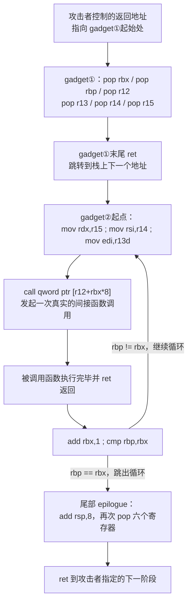
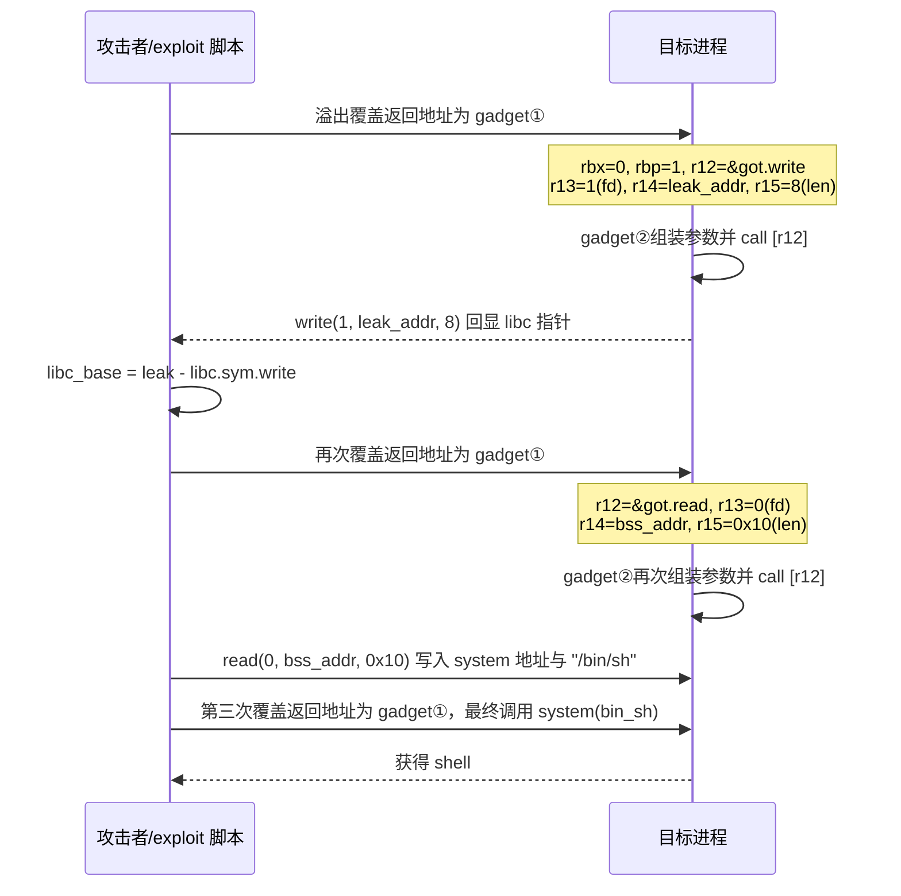
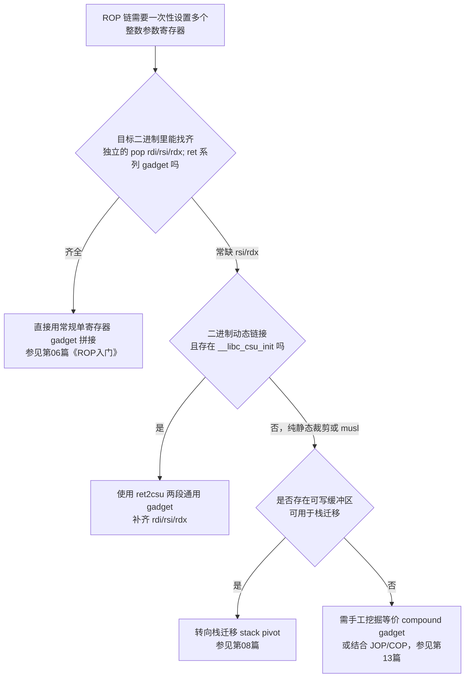

# 二进制漏洞与利用基础（7）· ROP进阶：ret2csu与通用gadget

> [!abstract] TL;DR
> - ret2csu 复用几乎每个动态链接 x86-64 可执行文件自带的 `__libc_csu_init` 启动代码，把其中两段固定指令当作"复合 gadget"，无需在题目逻辑里现找 `pop rsi`/`pop rdx` 这类稀缺 gadget，即可一次性控制 `rdi`/`rsi`/`rdx` 三个整数参数寄存器。
> - 两段 gadget 分工明确：**gadget①**一次性 `pop` 六个 callee-saved 寄存器（`rbx`/`rbp`/`r12`~`r15`）；**gadget②**把 `r15`/`r14`/`r13d` 分别搬进 `rdx`/`rsi`/`edi`，再 `call [r12+rbx*8]`——二者必须级联使用，且 `call` 会强制真实执行一次调用，调用返回后还要再消耗尾部 6 个垃圾栈槽才能继续后续 ROP。
> - `edi` 只经 32 位的 `mov edi, r13d` 写入，高 32 位被硬件自动清零——无法直接塞入完整 64 位指针，是这个技巧最容易被忽视、也最容易导致利用链"莫名其妙"崩溃的限制。
> - gadget 命中率高但绝非绝对：具体偏移随编译器版本、是否插入 `endbr64`（CET）、是否 PIE 而变化，必须现场反汇编目标二进制确认，照抄网上的固定十六进制偏移是常见翻车原因。
> - `__libc_csu_init` 本身位于**程序自身**而非 libc.so 中，PIE 关闭时其地址是编译期常量，往往可以在完全不泄露 libc 基址的情况下先行使用；但最终调用目标若落在 libc（如 `system`），仍需另外解决 libc 基址泄露问题——ret2csu 只解决"怎么传参调用"，不解决"目标地址在哪"。
> - 该技巧只覆盖前三个整数参数（`rdi`/`rsi`/`rdx`），第四个参数起（`rcx`/`r8`/`r9`）不在覆盖范围内；好在 `read`/`write`/`open`/`mprotect`/`execve`/`system` 等高频利用目标恰好都不超过三参数，唯有 `mmap` 这类六参数函数需要额外手段配合。

## 概述与定位

ret2csu 是 x86-64 Linux 平台下一种针对"gadget 稀缺"场景的 ROP 补丁式技巧：它不去目标程序的业务逻辑代码里现找 `pop rsi; ret`、`pop rdx; ret` 这类单寄存器 gadget，而是直接复用几乎每个动态链接可执行文件都会自带的一段 C 运行时启动代码——`__libc_csu_init`——把它拆成两段首尾相接的"复合 gadget"，一次性拿下 `rdi`/`rsi`/`rdx` 三个整数参数寄存器，外加 `r12`~`r15`、`rbx`、`rbp` 六个 callee-saved 寄存器的完整控制权。

"csu"是"C runtime Start Up"的缩写，`__libc_csu_init` 的原始职责是在 `main()` 执行之前遍历 `.init_array` 表、依次调用所有静态构造函数——这是一段完全合法、几乎不含题目自定义逻辑的"胶水代码"，其形状由编译器/glibc 版本决定，与具体题目代码基本无关。正因如此，只要对题目二进制反汇编一次，就几乎能立刻确认这条 gadget 链是否可用，且其结构在大量不同题目、不同 CTF 赛事之间高度相似——这正是标题里"通用 gadget"（universal gadget）一词的含义：不是"保证在任意二进制上都存在"，而是"来自工具链而非题目逻辑，因而在同一工具链构建出的大量二进制间高度可复用、可预测"，不必像挖掘题目专属 gadget 那样每道题重新地毯式搜索。

第06篇《ROP入门》建立的模型是：只要凑齐若干条 `pop reg; ret` 单寄存器 gadget，再加上目标函数地址，就能拼出任意的三参数 libc 调用。但现实中的小型 CTF 二进制往往只自然产生 `pop rdi; ret`（常来自某个函数尾声或恰好凑够的字节），`pop rsi; ret` 已属幸运，独立的 `pop rdx; ret` 在 x86-64 世界里几乎是稀有品——因为编译器很少生成"连续 pop 两个非相邻用途寄存器后接 ret"这种字节序列，rdx 也不是任何常规函数序言/尾声里典型会保存/恢复的寄存器。本篇要解决的正是这个缺口：**当常规单寄存器 gadget 凑不齐时，如何仍然完成一次完整的三参数函数调用**。

命名上，ret2csu 延续了 ret2text/ret2libc/ret2syscall 的"ret2X"家族习惯，但与前几者不同——那些名字描述的是"跳到哪类目的地"（文本段/libc函数/系统调用），ret2csu 描述的却是"gadget 的来源"（`__libc_csu_init` 内部）。这一命名错位本身就提示了它是一种**手段**而非**目标**：拿到 ret2csu 提供的寄存器控制权之后，后续通常仍要接上 ret2libc（调用 `system`/`execve`）或 ret2syscall（直接触发 syscall）才能真正拿到 shell 或读到 flag。它和第08篇的栈迁移解决的是完全不同维度的问题——栈迁移应对"可写栈空间不足以摆下整条 ROP 链"，ret2csu 应对"可用 gadget 种类不足以设置所有参数寄存器"，二者经常在同一道题里配合使用而非互斥。

本篇边界：不重复第06篇已讲的 ROP 拼接原理与 pwntools ROP 类基础用法，聚焦 `__libc_csu_init` 本身的结构、两段 gadget 的精确语义、由此产生的独有限制（尤其是 32 位 `edi` 截断陷阱）、与相邻章节技巧的分工，以及它作为"通用 gadget"这一更大类别里最著名实例所揭示的通用原理。

## 原理与机制

要理解 ret2csu 为什么可行，需要先回到 System V AMD64 调用约定（详见 [[22.调用规约/06.SystemV_AMD64调用规约]]）的两个基本事实：其一，整数/指针类参数按 `rdi, rsi, rdx, rcx, r8, r9` 顺序传递；其二，`rbx, rbp, r12, r13, r14, r15` 是 ABI 规定的 callee-saved（被调用者保存）寄存器——任何函数只要用到它们，就必须在入口 `push`、在出口 `pop` 回原值，否则会破坏调用者的状态。`__libc_csu_init` 恰好把这两条约定"撞"在了一起：它在循环里调用每个构造函数时传入 `(argc, argv, envp)` 三个参数（构造函数可选地采用与 `main` 相同的三参数签名），因此需要设置 `edi/rsi/rdx`；同时它自己作为一个会调用子函数、且被 `__libc_start_main` 调用的函数，又必须遵守 callee-saved 约定去保存 `rbx/rbp/r12~r15`。攻击者要利用的，正是这两组寄存器操作留下的、语义上"顺手"的字节序列——ROP 的核心思想从不关心一段代码原本要做什么，只关心它的字节效果以及是否会流转到攻击者可控的下一跳（`ret` 或等价的间接跳转/调用）。第06篇已经建立了这个"任意指令序列皆可为 gadget"的基本认知，ret2csu 把它推向了一个极端案例：被复用的不是手工挑出的两三条指令，而是一整段**带循环、带间接调用的合法函数片段**，证明 ROP gadget 完全可以是"大块头"，只要进入前攻击者能完全掌控它所依赖的全部寄存器与内存状态。

`__libc_csu_init` 内部依次可以拆出两段可独立复用的 gadget：

- **gadget①（寄存器批量装载）**：形如 `pop rbx; pop rbp; pop r12; pop r13; pop r14; pop r15; ret`，出现在函数尾声。六个 `pop` 对应的正是前面提到的六个 callee-saved 寄存器——这不是巧合而是必然：ABI 规定了这六个寄存器需要在函数尾声恢复，编译器就必然会生成恢复它们的 `pop` 序列，攻击者只是把这段"恢复现场"的代码提前劫持，用来"装载攻击载荷"而非"恢复原值"。
- **gadget②（参数搬运 + 间接调用）**：形如 `mov rdx, r15; mov rsi, r14; mov edi, r13d; call [r12+rbx*8]`，紧跟着循环控制的 `add rbx,1; cmp rbp,rbx; jne ...`。这是原函数里"取出当前构造函数指针并调用它"的循环体：`r12` 是构造函数指针表基址，`rbx` 是下标，`r15/r14/r13` 是要传给每个构造函数的 `envp/argv/argc`。攻击者伪造这三者的值，就等价于伪造了"传给某个函数的三个参数"。

两段 gadget 必须级联使用而不能单独调用 gadget②，因为 gadget②入口处并不重新从栈上取值——`r12/r13/r14/r15/rbx/rbp` 六个寄存器的值必须在进入 gadget②之前就已经被设置好，这正是 gadget①存在的意义：它是 gadget②的"参数装载器"。这种"一个 gadget 负责搬数据到寄存器、另一个 gadget 负责消费这些寄存器"的两段式结构，是理解所有复合 gadget（包括后面会提到的其他通用 gadget 变体）的通用范式。

还有一个容易被忽略的间接性：`call [r12+rbx*8]` 调用的不是 `r12` 本身的值，而是 **`r12` 所指向内存里存放的那个值**——也就是说 `r12` 必须指向一处"已经存有目标函数真实地址"的内存单元，而不能直接填目标函数地址本身。这与第16篇要讲的 GOT 劫持/ret2dlresolve 思路是同一枚硬币的两面：GOT（详见 [[11.ELF文件详解/17.got节]]）天然就是"一张存着函数真实地址的表"，因而是 `r12` 最方便的落点——只要挑一个**程序此前已经调用过、已被动态链接器解析过**的库函数，它的 GOT 槽位里存的就是该函数在 libc 中的真实地址，可以直接拿来当"目标函数指针的指针"使用而无需额外写内存。

`__libc_csu_init` 的调用者是 `__libc_start_main`，构造函数的调用约定之所以恰好是三参数、恰好是 `edi/rsi/rdx`，源头可以追溯到 glibc 允许构造函数以 `(int argc, char **argv, char **envp)` 形式接收启动参数——这也解释了为什么 ret2csu 天生只能覆盖前三个参数：不是 ROP 本身有三参数上限，而是这个被复用的"顺手函数"原本就只准备了三个参数的传递逻辑，第四个参数起的 `rcx/r8/r9` 在这段代码里根本没有被触及，也就无法通过它来设置。好在 `read`/`write`/`open`/`mprotect`/`execve`/`system` 等 CTF 高频目标函数都不超过三个参数，真正需要四参数以上的场景（如六参数的 `mmap`，常用于在 NX 关闭受限场景里申请可执行内存）反而是少数，此时需要另寻他法（例如结合原生 `syscall` gadget，或多次调用拼凑）。

### 通用 gadget 的本质：不只是 csu

把视野拉高一层看，"通用 gadget"并非 `__libc_csu_init` 独享的头衔，而是一类现象的统称：**工具链在编译期无条件注入、与题目业务逻辑无关、但因为要遵守 ABI 或运行时约定而顺带包含了"寄存器批量存取 + 控制转移"的代码片段**，都有潜力被当作跨题目复用的 gadget 来源。除 `__libc_csu_init/__libc_csu_fini` 外，gcc 的 crtstuff 还会在几乎每个动态链接可执行文件里生成 `frame_dummy`、`register_tm_clones`、`deregister_tm_clones`、`__do_global_dtors_aux` 等同样"面目相似"的启动/析构辅助函数，它们各自的函数序言/尾声里同样可能藏着有价值的 `pop`/`mov` 序列，是 ret2csu 主 gadget 不够用或偏移被破坏时值得顺手查看的"邻居"。这类 gadget 的共性是：**其存在性和形状由编译器与 C 运行时版本决定，而非题目作者的代码风格决定**，这也是它们比"从题目函数里现挖的 gadget"更值得优先记忆、更适合被称为"通用"的根本原因。

## __libc_csu_init结构与ret2csu链构造详解

下面给出 `__libc_csu_init` 的典型结构示意（符号化标注，非某个具体二进制的真实字节偏移——实战中必须以 `objdump -d`/IDA/Ghidra 对目标二进制的反汇编结果为准，切勿照搬网络教程里的固定十六进制地址）：

```asm
<__libc_csu_init>:
    push   r15
    push   r14
    mov    r15, rdx                 ; 保存 envp
    push   r13
    push   r12
    lea    r12, [rip+0x????]        ; r12 = __init_array_end
    push   rbp
    lea    rbp, [rip+0x????]        ; rbp = __init_array_start
    push   rbx
    mov    ebx, edi                 ; 保存 argc
    sub    rsp, 0x8
    sub    rbp, r12
    sar    rbp, 0x3                 ; rbp = 构造函数个数
    call   _init
    test   rbp, rbp
    je     csu_fini
    xor    ebx, ebx
    nop    dword ptr [rax]

gadget2:                            ; ---- 通用 gadget②：参数搬运 + 间接调用 ----
    mov    rdx, r15
    mov    rsi, r14
    mov    edi, r13d
    call   qword ptr [r12+rbx*8]
    add    rbx, 0x1
    cmp    rbp, rbx
    jne    gadget2

csu_fini:
    add    rsp, 0x8

gadget1:                            ; ---- 通用 gadget①：六寄存器批量装载 ----
    pop    rbx
    pop    rbp
    pop    r12
    pop    r13
    pop    r14
    pop    r15
    ret
```

下面的控制流图展示了攻击者一次完整 ret2csu 调用中，控制权如何在两段 gadget 之间流转：



### 栈布局：一次调用要摆多少个 qword

构造一次完整的 ret2csu 调用，需要在栈上依次摆放 15 个 qword（含两个跳转地址、6 个进入 gadget①的取值、以及 gadget②循环退出后 epilogue 消耗掉的 6 个垃圾槽）：

```
高地址方向
 ...
 [+0x00]  返回地址①  -> gadget① (pop rbx...pop r15; ret)
 [+0x08]  rbx_val    -> 0                    循环起始下标，call 时取 [r12+0]
 [+0x10]  rbp_val    -> 1                    循环次数，需满足 rbp == rbx初值+1
 [+0x18]  r12_val    -> &target_func_ptr     指向"存有目标函数真实地址"的内存
 [+0x20]  r13_val    -> arg1                 写入 edi，仅低 32 位有效
 [+0x28]  r14_val    -> arg2                 写入 rsi，完整 64 位
 [+0x30]  r15_val    -> arg3                 写入 rdx，完整 64 位
 [+0x38]  返回地址②  -> gadget②起点（mov+call 序列首指令）
 [+0x40]  junk1      -> 任意值，epilogue pop rbx 消耗
 [+0x48]  junk2      -> 任意值，epilogue pop rbp 消耗
 [+0x50]  junk3      -> 任意值，epilogue pop r12 消耗
 [+0x58]  junk4      -> 任意值，epilogue pop r13 消耗
 [+0x60]  junk5      -> 任意值，epilogue pop r14 消耗
 [+0x68]  junk6      -> 任意值，epilogue pop r15 消耗
 [+0x70]  next_stage -> 下一段 ROP 链继续执行的位置
 ...
低地址方向（栈顶）
```

其中最容易被初学者遗漏的正是 `junk1`~`junk6` 这六个垃圾槽：gadget②的 `call` 返回后会继续往下跑到 `csu_fini` 的 `add rsp,8` 和紧接着的 6 条 `pop`，这段 epilogue 是原函数自身要恢复 `main` 调用现场的正常逻辑，攻击者无法跳过，只能顺着喂够 6 个占位 qword，再把第 7 个位置留给真正想跳转的下一阶段地址。很多"参数明明设对了、函数也确实被调用了、但利用链后续却跑飞"的诡异现象，根源往往就是漏摆了这 6 个垃圾槽，导致 epilogue 把攻击者原本安排给下一阶段的地址错当成了某个寄存器的值弹走。

`rbx`/`rbp` 的关系必须精确配平：`rbx` 是循环下标（发起首次调用时几乎总取 0，对应 `call [r12+0]`），`rbp` 是循环次数上界，二者需满足"执行一次调用后 `rbx+1 == rbp`"才能让 `cmp rbp,rbx; jne` 在恰好一轮后退出循环。若误将 `rbp` 设为等于 `rbx` 的初值（例如都为 0），第一次调用后 `rbx` 变为 1，`cmp` 发现二者不等会再次循环，进而尝试 `call [r12+8]`——如果这个位置不是攻击者预先准备好的第二个合法函数指针，大概率直接崩溃。反过来，这也是一个可以主动利用的高阶变体：只要让 `r12` 指向一段攻击者可控、连续摆放了两个函数指针的伪造表，并把 `rbp` 设为 `rbx初值+2`，gadget②会在一次进入里自动连续发起两次调用——但受限于 `mov` 只在循环体最前面执行一次，这两次调用会使用**完全相同**的 `edi/rsi/rdx`，只适用于两次调用恰好需要相同参数的场景，实战中较为少见，了解即可。

还有一个进阶技巧值得一提：既然 `call` 目标本质是"`r12` 指向的内存里存的值"，攻击者不一定需要知道目标函数的绝对地址才能构造 `r12`——如果只知道某函数在 `.got.plt` 表里的**相对槽位**，完全可以让 `r12` 直接指向 `.got.plt` 基址、`rbx` 填对应下标，无需额外一次内存读取即可完成调用，这在只掌握二进制自身基址、尚未获得该 GOT 槽位具体数值时尤其有用。

### edi 的 32 位截断陷阱（重点陷阱）

gadget②里设置 `rdi` 的指令是 `mov edi, r13d`——注意操作数是 32 位的 `edi`/`r13d` 而非 64 位的 `rdi`/`r13`。x86-64 架构规定：任何对 32 位子寄存器的写入都会**零扩展**到完整 64 位，清空高 32 位。举例说明：若 `r13 = 0x0000555555556004`（一个典型的 PIE 加载后的堆/代码指针），`r13d` 只是其低 32 位 `0x55556004`；`mov edi, r13d` 执行后 `rdi = 0x0000000055556004`，而不是原本期望的 `0x0000555555556004`——高 32 位的 `0x00005555` 部分被彻底丢弃，得到的是一个完全不同、大概率无效的地址。

这意味着 gadget②对 `rdi` 的控制**只在参数值不超过 `0xFFFFFFFF` 时才是精确可靠的**——例如文件描述符（0/1/2）、小整数标志位、较小的长度值，都能安全通过这条路径设置；但如果某次调用的第一个参数必须是一枚完整的 64 位指针（比如把字符串地址、堆地址直接作为 `rdi` 传给某函数），gadget②单独是做不到的。相比之下，`mov rsi, r14` 与 `mov rdx, r15` 都是完整 64 位寄存器间的搬运，不存在截断问题，`rsi`/`rdx` 可以放心传递任意 64 位指针。这一非对称性直接决定了实战中的参数分配策略：**优先把需要完整 64 位精度的参数（缓冲区地址等）安排在 `rsi`/`rdx` 位置，把 `rdi` 留给小整数（如 `read`/`write` 的 fd）**——而这恰好和 `read(fd, buf, len)`/`write(fd, buf, len)` 这类高频目标函数的参数顺序天然吻合，所以在最常见的"用 ret2csu 发起 `read`/`write` 泄露或写入"场景里，这个限制往往不构成实际阻碍；真正会踩雷的是试图单纯靠 gadget②去精确设置一个大地址值给 `rdi` 的场景（例如直接把字符串地址作为唯一参数传给单参数函数），此时应当优先寻找题目里独立的 `pop rdi; ret` gadget，把 ret2csu 留给它更擅长的 `rsi`/`rdx`。

### 偏移不是常数：CET、PIE 与工具链差异

`__libc_csu_init` 相对于自身符号起始地址的具体字节偏移**不是**一个跨二进制通用的常量。较新的工具链默认在函数入口插入 4 字节的 `endbr64`（Intel CET 的 Indirect Branch Tracking 着陆点标记），会把后续所有指令的偏移整体后移；不同 glibc/gcc 版本对 `.init_array` 相关 `lea` 指令是否使用 RIP 相对寻址、循环体 `nop` 填充长度是否一致，也都会造成字节级差异。这是初学者最常踩的坑：抄一份网络教程里"gadget① 在 `csu_init+0x3a`"这样的固定偏移，直接套到自己的题目二进制上，往往因为工具链版本不同而对不上，必须以 `objdump -d`/反汇编结果现场核实为准。

## 工具视角与实战

定位两段 gadget 最直接的方式是对目标二进制按符号反汇编：

```bash
objdump -d ./chall -M intel | grep -A 30 '<__libc_csu_init>:'
```

或使用 pwntools 直接拿到符号地址后手工核对相邻指令：

```python
from pwn import *
elf = ELF('./chall', checksec=False)
print(hex(elf.symbols['__libc_csu_init']))
```

也可以用 ROPgadget/ropper 按指令模式搜索，二者对多指令组合 gadget 的检索比手工翻页反汇编更快：

```bash
ROPgadget --binary ./chall | grep "pop rbx"
ropper --file ./chall --search "mov edi"
```

拿到两段 gadget 地址后，可以手工拼装一次调用（示意代码，`gadget1`/`gadget2` 的偏移必须替换为对目标二进制反汇编确认后的真实值）：

```python
from pwn import *

context.binary = elf = ELF('./chall', checksec=False)
io = process(elf.path)

csu_base = elf.symbols['__libc_csu_init']
gadget1  = csu_base + 0x3a   # pop rbx;pop rbp;pop r12;pop r13;pop r14;pop r15;ret（示例偏移，需核实）
gadget2  = csu_base + 0x20   # mov rdx,r15;mov rsi,r14;mov edi,r13d;call [r12+rbx*8]（示例偏移，需核实）

def csu_call(func_ptr_addr, a1, a2, a3, ret_next):
    """构造一次 ret2csu 调用：func_ptr_addr 处需已存放目标函数的真实地址"""
    chain  = p64(gadget1)
    chain += p64(0)              # rbx = 0，call [r12+0]
    chain += p64(1)              # rbp = 1，只循环一次
    chain += p64(func_ptr_addr)  # r12 -> 指向目标函数地址的内存（常取一个已解析的 GOT 槽位）
    chain += p64(a1)             # -> edi，仅低 32 位有效
    chain += p64(a2)             # -> rsi，完整 64 位
    chain += p64(a3)             # -> rdx，完整 64 位
    chain += p64(gadget2)
    chain += p64(0) * 6          # 消耗 epilogue 的 6 次 pop
    chain += p64(ret_next)       # 下一阶段继续执行的位置
    return chain

payload  = b'A' * offset_to_ret
# 第一阶段：write(1, &got['write'], 8) 泄漏 libc 指针
payload += csu_call(elf.got['write'], 1, elf.got['write'], 8, elf.symbols['_start'])
io.send(payload)

leak = u64(io.recvn(8))
libc = ELF('./libc.so.6', checksec=False)
libc.address = leak - libc.symbols['write']
log.success(f'libc base = {hex(libc.address)}')
# 后续第二、第三阶段可复用 csu_call() 构造 read(0, bss, N) 注入数据，
# 再构造 system(bin_sh_addr) 完成利用，思路与第一阶段一致，此处从略。
```

完整的两阶段"先泄露、后调用"流程可以用下面的时序图表达：



调试阶段建议在 gdb/pwndbg 里直接在 gadget②地址下断点，`call` 指令执行前用 `info registers r12 r13 r14 r15 rbx rbp` 核对六个寄存器是否与预期一致，再用 `x/8gx $rsp` 核对栈上接下来的垃圾槽和下一跳地址是否摆对位置；对 `call` 单步（`si`）而不是直接 `continue`，能第一时间确认间接调用是否真的跳到了预期的库函数入口，避免在完全不清楚崩在哪一步的情况下反复盲试。

是否需要动用 ret2csu，可以按下面的决策路径判断：



另外两个容易被忽视的前置条件值得展开说明。第一，`__libc_csu_init` 本身位于**可执行文件自身**的代码段，而非 libc.so——这是它名字里带"libc"却容易让人误解的地方。因此 PIE 关闭时，两段 gadget 的地址是编译期固定值，完全不需要任何信息泄露即可直接使用；PIE 开启时，只需要泄露**程序自身**的加载基址（例如利用栈上残留的返回地址、或任意一处指回代码段的指针），而不必一开始就拿到 libc 基址——这比很多人默认认为"ROP 利用必须先泄露 libc"要宽松。但要注意，这只解决了"gadget 在哪"的问题，如果调用链的最终目标（如 `system`）落在 libc 里，迟早还是要单独解决 libc 基址泄露，两件事不能混为一谈。第二，`r12` 指向的 GOT 槽位必须是**已经被动态链接器解析过**的——如果目标程序采用延迟绑定（Lazy Binding）且该函数在触发溢出之前从未被程序主动调用过，其 GOT 槽位此时仍指向 PLT 桩代码而非真实库函数地址，直接拿来当调用目标会跳去 PLT 解析流程而非预期函数。实战中应当优先选择程序本身早已调用过的函数（如已经用过的 `read`/`write`/`puts`）对应的 GOT 槽位，或者在 Full RELRO（所有槽位加载时即时绑定）的二进制上则不受此限制。

## 安全性与正确使用

> [!caution] 合规边界
> 本文所述 ret2csu 技术仅用于自有资产、经授权的安全评估环境，以及 CTF/安全研究靶场中的教学与研究目的。文中出现的地址、偏移、函数名均为示意性占位，不针对任何真实生产系统或第三方软件给出可直接使用的攻击载荷；请勿将本文内容用于未经授权的系统。防御者应当把它当作"攻击者在栈可控前提下具备的能力上限模型"来指导加固思路，而非可直接复制的作案说明书。

ret2csu 是一种**利用阶段**（weaponization）技巧，它的前提永远是"攻击者已经拿到了对返回地址/栈内容的完全控制"——真正的根因始终是更早发生的内存破坏原语（栈溢出、格式化字符串、堆溢出等）。因此第一道、也是最根本的防线不在于对抗 ret2csu 本身，而在于消除或缓解产生这种控制能力的漏洞：严格边界检查、优先使用带长度限制的输入/拷贝函数、`_FORTIFY_SOURCE` 编译期检查、以及从源头上用内存安全语言重写高风险解析逻辑。

就针对 ROP 这一利用手段本身的缓解措施而言，需要逐项厘清各自到底挡住了什么，避免似是而非的"这个防护开了应该就安全了"的误判：

- **栈保护（Canary）**：与 ret2csu 无关的正交防护——它检测的是"缓冲区是否越界写到了返回地址"，而不关心返回地址一旦被覆盖后具体会跳去哪类 gadget；只要溢出点本身能绕过或泄露 canary（详见后续 Canary 泄露专题），ret2csu 照常可用。
- **Full RELRO**：只解决 GOT **可写性**问题（运行时把 `.got.plt` 设为只读，配合立即绑定），阻止的是运行时篡改 GOT 内容（详见 [[11.ELF文件详解/17.got节]] 与后续 ret2dlresolve 专题）。ret2csu 只是**读取**已存在的合法 GOT 值当调用目标，不涉及写入，Full RELRO 对它没有直接阻断作用；某种意义上 Full RELRO 反而让所有 GOT 槽位在加载时就已完成解析，消除了前一节提到的"延迟绑定未解析"障碍。
- **ASLR/PIE**：把 `__libc_csu_init` 的地址纳入随机化范围，攻击者需要先取得一次指向二进制自身的信息泄露才能定位两段 gadget，抬高了利用门槛，但并未从结构上消除可利用性——一旦泄露到位，后续步骤与 PIE 关闭时完全一致。这也印证了防护体系里的普遍规律：单一缓解措施提高的是"利用成本"，而非提供"结构性免疫"，真正的纵深防御需要多层缓解叠加（详见 [[34.现代二进制防护机制/00.现代二进制防护机制总览]]）。
- **Intel CET**：需要拆开两个子机制分别看待。IBT（Indirect Branch Tracking）只校验间接 `call`/`jmp` 的落点是否为 `endbr64` 标记的合法入口，而 ROP 是通过 `ret` 而非 `call`/`jmp` 转移控制的，天然不在 IBT 的监管范围内——这也是为什么"CET 上线后 ROP 依然可行、但传统 JOP/COP 的跳板选择被大幅收窄"（对照第13篇）。真正针对 `ret` 劫持的是 Shadow Stack（SS）子机制：硬件维护一份只能由 `call`/`ret` 隐式读写的影子栈，每次 `ret` 会比对影子栈与常规栈上的返回地址是否一致，不一致则触发异常——这才是能从根本上让包括 ret2csu 在内的所有"篡改返回地址"类 ROP 失效的机制，但其部署依赖硬件与操作系统支持，目前覆盖率仍在逐步提升中，不能假设所有目标环境都已启用。

对防御者的实践建议可以归纳为：**不要指望单一开关，把 Canary、Full RELRO、PIE/ASLR、CET-SS 当作互补的纵深防御层叠加部署**，同时把工程投入优先花在消灭内存破坏原语本身——毕竟没有一个可控的返回地址，ret2csu 这类"如何优雅地利用控制权"的技巧就无从谈起。

## 小结

ret2csu 的核心洞察是：ROP gadget 不必是手工从题目代码里挖出的两三条指令，工具链自己在编译期塞进每个二进制的 C 运行时启动代码，同样可以拆解成攻击者可控的复合 gadget——`__libc_csu_init` 尾部"六寄存器批量 pop"与循环体内"三参数搬运 + 间接调用"这两段代码，合起来补齐了常规单寄存器 gadget 经常凑不齐的 `rsi`/`rdx` 控制能力。用好它需要精确掌握三件事：栈上 15 个 qword 的摆放顺序（尤其是容易被遗漏的 6 个 epilogue 垃圾槽）、`rbx`/`rbp` 的循环配平关系，以及 `edi` 只能通过 32 位写入、无法承载完整 64 位指针的截断限制。它对 ASLR 的依赖也和常规 ret2libc 不同——两段 gadget 本身位于二进制自身而非 libc，PIE 关闭时可以完全绕开信息泄露直接使用。作为"通用 gadget"这一类别里最著名的实例，它揭示的更普遍原理是：任何由工具链无条件注入、且需要遵守 ABI 寄存器保存约定的代码片段，都值得在 gadget 搜索时被优先检视。下一篇《栈迁移与stack pivot》将处理一个正交的约束——当可写栈空间本身不足以摆下整条 ROP 链时如何把执行流迁移到攻击者另行准备的内存区域，二者常常需要配合使用而非二选一。

## 相关阅读

- [[06.ROP入门|← 上一章：ROP入门]]——ROP 基本模型与单寄存器 gadget 拼接方法，本篇的直接前置。
- [[08.栈迁移与stack pivot|→ 下一章：栈迁移与stack pivot]]——解决"栈空间不够摆链"的正交问题。
- [[13.JOP与COP面向跳转与调用编程]]——间接 call/jmp 驱动的控制流劫持，与 CET-IBT 的对抗关系。
- [[16.GOT劫持与ret2dlresolve]]——同样围绕 GOT 表间接性展开的利用手法。
- [[22.调用规约/06.SystemV_AMD64调用规约]]——`rdi/rsi/rdx/rcx/r8/r9` 参数顺序与 callee-saved 寄存器约定的权威依据。
- [[11.ELF文件详解/17.got节]]——GOT/PLT 结构详解，理解 `call [r12+rbx*8]` 间接调用落点的基础。
- [[34.现代二进制防护机制/00.现代二进制防护机制总览]]——Canary/RELRO/ASLR/CET 等缓解措施的整体图景与相互关系。
- [[52.Linux内核机制与内核利用/00.Linux内核机制与内核利用总览]]——ROP/通用 gadget 思路在内核态利用（kROP）中的延伸。

[[00.二进制漏洞与利用基础总览|⬆ 系列总览]] | [[06.ROP入门|← 上一章]] | [[08.栈迁移与stack pivot|→ 下一章]]
