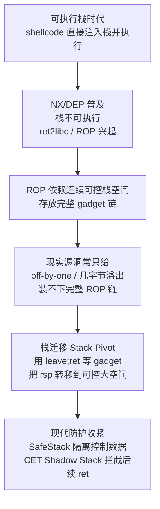
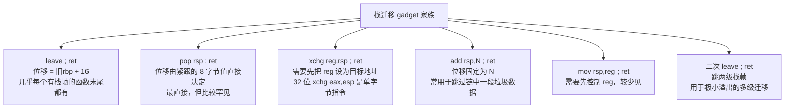

# 二进制漏洞与利用基础（8）· 栈迁移与stack pivot

> [!abstract] TL;DR
> - **问题定位**：栈迁移解决的是"控制流已能劫持，但可控栈空间装不下完整 ROP 链"这一具体约束——常见于 off-by-one、极小固定长度溢出、格式化字符串写入次数受限等场景，是与"gadget 稀缺"（见 [[07.ROP进阶：ret2csu与通用gadget]]）正交的另一维度问题。
> - **核心机制**：`leave` 等价于 `mov rsp,rbp; pop rbp`，紧跟的 `ret` 等价于 `pop rip`；只要控制了 saved rbp 的值为 `X`，`leave;ret` 执行后必然 `rsp = X+16`、`rip = *(X+8)`——控制 rbp 就同时控制了新栈基址和第一跳目标。
> - **两个正交维度**：触发场景可按"可控字节精度"（1 字节部分覆盖 / 完整 8 字节覆盖 / 任意地址写）与"利用阶段数"（单阶段直接迁移 / 先旁路写数据再触发迁移的两阶段）拆解；1 字节 NUL 型 off-by-one 只能让 rbp 落在同一 256 字节对齐块内，够不到 heap/BSS 这类远处目标，且落点本身还有约 16 种等概率的可能值。
> - **gadget 家族**：`leave;ret` 只是其中一种，`pop rsp;ret`、`xchg reg,rsp;ret`、`add rsp,N;ret`、`mov rsp,reg;ret` 各有不同的"迁移位移"特性与出现频率，实战中常需要组合甚至二级迁移。
> - **实战陷阱**：16 字节栈对齐（SSE 指令 `movaps` 的对齐要求）、坏字符截断、目标区域数据的写入时序、setjmp/longjmp 劫持在现代 glibc 下受 `PTR_MANGLE` 指针混淆保护，都是构造迁移链时容易踩的坑。
> - **防御边界**：Stack Canary 只校验自身 8 字节，对没有经过 canary 位置的 rbp/ret addr 覆盖完全无效；SafeStack 把控制数据隔离到独立安全栈，是目前对栈迁移最直接有效的防御；CET Shadow Stack 拦截的是迁移之后继续用 `ret` 串联的 ROP，对"迁移"这个动作本身并不设防。

> [!warning] 教学声明
> 本篇内容用于理解栈迁移技术的**原理与防御**，面向安全教育、CTF 学习和防御导向的工程师。所有示例均为最小化教学 demo，不针对真实软件，不提供即用利用载荷。请勿将本文内容用于任何非授权测试或攻击行为。

---

## 概述与定位

### 从"控制了 PC"到"有地方放链"

先复盘一下这条系列走到这里解决了什么问题、还剩什么问题：[[05.ret2libc]] 解决了"NX 开启后往哪跳"（跳已加载的 libc 代码）；[[06.ROP入门]] 把这个思路推广成"任意语义"——用一串以 `ret` 结尾的 gadget 拼出图灵完备的效果；[[07.ROP进阶：ret2csu与通用gadget]] 解决了"gadget 不够用"——当二进制本身干净、libc 又不可用时，靠一个几乎必然存在的 `__libc_csu_init` 片段撑起整条链的寄存器摆位。

这三篇有一个共同的隐含前提：**攻击者能在栈上连续摆放足够多的 gadget 地址**。ret2libc 只需要两三个 8 字节槽位；一条像样的 `execve("/bin/sh", NULL, NULL)` ROP 链，在 x86-64 上轻松需要 8~15 个槽位（100~150 字节）。这个前提在 CTF 和真实漏洞里经常不成立：

- 溢出函数本身只有一个 `char buf[0x20]` 大小的缓冲区，且只多允许覆盖返回地址后再多几个字节；
- 经典的 **off-by-one**——只多出 1 个字节的可控空间；
- 格式化字符串漏洞里，`%n` 一次调用能写的次数和地址都有限，装不下一整条链；
- 出题人故意把"溢出点"和"能放数据的大缓冲区"设计在两个不相干的位置。

**栈迁移（Stack Migration / Stack Pivoting）** 的答案是：与其在这一丁点空间里硬塞 ROP 链，不如换个思路——只用这点空间控制 `rsp` 本身的落点，把执行现场"搬"到别处一块攻击者完全掌控、足够大的内存（BSS、堆，甚至同一栈帧里更靠前的地方），完整的 ROP 链提前布置在那里等着。这条"搬家"路径最常用的工具，就是几乎在每个有栈帧的函数结尾都存在的 `leave; ret`。

"pivot"这个词本身来自杠杆的"支点"：只需要很小的力（几个字节的精确覆盖），就能撬动一个大得多的结果——整条执行流被转移到攻击者真正想要的战场。

### 本篇的边界

新系列把"栈迁移"和"JOP/COP"拆成了两个独立的问题维度，这里需要先划清界限：

- 本篇只讲 **rsp 本身如何被转移**——通过 `leave;ret` 或它的兄弟 gadget，把执行现场从原栈搬到别处。控制流转移的"载体"依然是 `ret`。
- 如果这个"载体"本身被防御方针对（例如 Shadow Stack 专门盯着 `ret`），改用间接 `jmp`/`call` 串联 gadget，那是 [[13.JOP与COP面向跳转与调用编程]] 要讲的内容，本篇不展开其调度器（dispatcher）机制。
- 栈迁移的诱因如果来自格式化字符串的 `%n` 任意写，`%n` 本身的机制、参数定位、宽度控制留给 [[09.格式化字符串漏洞]]，本篇只把它作为"触发场景"的一个例子简要提及。
- 迁移之后如何把寄存器摆到位、如何应对 gadget 稀缺，回看 [[07.ROP进阶：ret2csu与通用gadget]]；迁移之后如果直接伪造整个寄存器上下文（包括 rsp 本身），那是更暴力的 [[12.SROP信号帧伪造]]——某种意义上 SROP 是"终极栈迁移"，不需要 `leave`/`pop rsp` 这类 gadget 的迂回，一次 `sigreturn` 就能把 rsp 设成任意值。

### 定位表

| 维度 | 本篇 | 相关篇章 |
|---|---|---|
| 解决什么约束 | 可控栈空间不够摆完整链 | —— |
| 前驱：gadget 从哪来 | 假设已具备基础 ROP 能力 | [[06.ROP入门]] |
| 前驱：gadget 不够用怎么办 | 迁移后依然可能需要通用 gadget | [[07.ROP进阶：ret2csu与通用gadget]] |
| 触发诱因之一 | 小溢出 / off-by-one | [[02.栈溢出原理与经典利用]] |
| 触发诱因之二 | 格式化字符串写入受限 | [[09.格式化字符串漏洞]] |
| `ret` 被针对时的替代方案 | 不在本篇展开 | [[13.JOP与COP面向跳转与调用编程]] |
| 更暴力的"整体迁移" | rsp 只是 sigcontext 的一个字段 | [[12.SROP信号帧伪造]] |
| 迁移后拿 shell 的收尾 | 迁移只是搬家，不是终点 | [[18.one_gadget与magic_gadget]] |

---

## 原理与机制

### leave;ret 的指令级语义——从两条指令推导出"净效果"

要理解栈迁移，必须先把 `leave` 和紧随其后的 `ret` 拆开揉碎看。`leave` 是 x86/x86-64 函数标准 epilogue 的组成部分，等价于两条指令：

```nasm
mov rsp, rbp   ; 用 rbp 的值重置 rsp（"收起"当前栈帧的局部变量空间）
pop rbp        ; 从新 rsp 处弹出 8 字节到 rbp，rsp += 8（恢复调用者的 rbp）
```

紧跟其后的 `ret`（无参数版本）：

```nasm
pop rip        ; 从 rsp 弹出 8 字节到 rip，rsp += 8
```

把攻击者已经完全控制的 saved rbp 值记作 `X`（这是攻击者通过溢出/任意写覆盖进去的值），逐步推导 `leave;ret` 三步之后寄存器的最终状态：

```
初始条件：溢出后，saved_rbp 槽位的值被覆盖为 X

第 1 步（leave 的 mov rsp,rbp）：
    rsp <- rbp = X

第 2 步（leave 的 pop rbp）：
    rbp <- *(rsp) = *(X)        从地址 X 读 8 字节，成为新 rbp（通常只是占位，不重要）
    rsp <- rsp + 8 = X + 8

第 3 步（ret 的 pop rip）：
    rip <- *(rsp) = *(X + 8)    从地址 X+8 读 8 字节，这就是下一跳要执行的地址！
    rsp <- rsp + 8 = X + 16

净效果：
    rip = *(X + 8)     第一个被执行的 gadget / 函数地址
    rsp = X + 16       后续 ret 继续从这里弹出下一个地址
```

这个推导揭示了栈迁移的全部秘密：**只要攻击者能把 saved rbp 覆盖成 `X`，就同时决定了两件事——下一条要执行的指令（从 `X+8` 处读取），以及此后执行现场使用的"新栈"起点（`X+16`）**。这两件事合起来，就是"把 rsp 迁移到了以 `X` 为基准的一整块新内存"。

### 为什么 rbp 是"支点"——从数据平面到控制平面的一次跃迁

在函数体内部执行期间，`rbp` 通常只是一个"无害"的寄存器——它是局部变量寻址的基址（形如 `[rbp-0x10]` 的访存），攻击者即便能覆盖它，只要函数体内没有再通过 `rbp` 寻址读写关键数据，这个覆盖看起来"没有直接效果"。很多人在遇到"只能溢出到 saved rbp、够不到返回地址"的题目时会误判为"这个漏洞打不了"——这正是遗漏了 `leave;ret` 这一步。

问题在于：**一旦函数执行到 epilogue，rbp 的角色发生了质变**——它不再是"数据平面"上一个普通的寻址基址，而是即将被写入 `rsp` 本身、变成"控制平面"下一个栈指针来源。这个转换点只隔一条指令（`leave`），却是整个栈迁移技术的支点所在。理解这一点，也就理解了为什么"只能覆盖 saved rbp"从来都不是"打不了"，而是"要多想一步"。

### 触发场景的两个正交维度

与其把触发场景当成一份互不相关的清单去背，不如把它拆成两个正交的维度，任何一道具体的题目/漏洞都可以往这个坐标系里放。

**维度一：可控精度**——攻击者到底能多精确地决定 `X` 的值？

| 精度等级 | 典型成因 | 能到达的范围 |
|---|---|---|
| 完整 8 字节覆盖 | 常规栈溢出连续覆盖 saved_rbp | 内存空间任意地址（受限于是否知道该地址） |
| 部分覆盖 2~7 字节 | 溢出长度恰好卡在中间 | 覆盖字节数对应的地址范围内可选，其余高位沿用原值 |
| 部分覆盖 1 字节（常为 NUL） | 经典 off-by-one，字符串写入多了 1 个终止符 | 仅能改写最低字节，见下节精确推导 |
| 任意地址写（`%n` 等） | 格式化字符串漏洞 | 不受"连续偏移"约束，但受写入次数/单次写入宽度限制 |

**维度二：利用阶段数**——完整 ROP 链的数据是"顺路"写进去的，还是需要专门"先垫后跳"两步走？

- **单阶段**：溢出点本身就能顺带把 ROP 链摆到栈上邻近位置，只是这次"邻近位置"恰好因为空间不够放不下全部，需要用 pivot 把 rsp 指向数据实际存放的地方（可能就是同一次溢出写入的更靠后部分）。
- **两阶段（旁路写 + 小溢出触发）**：程序存在另一个"顺路"的大容量写入点（例如某个"备注""用户名"功能，允许写入几百字节到 BSS/堆的固定缓冲区），攻击者先用这个功能把完整 ROP 链摆放好，再触发那个只能覆盖 saved_rbp+ret addr（合计 16 字节）的小溢出，让 `leave;ret` 把 rsp 精确指向第一步已摆好数据的地方。这是 CTF 里最常见的组合模式，也最能体现"栈迁移"的价值——没有旁路写，两阶段思路根本无从谈起。

把两个维度叠加看：**"精度=1 字节部分覆盖"×"阶段=单阶段"的组合能做的事情其实很有限**（下一节精确推导范围）；而 **"精度=完整 8 字节"×"阶段=两阶段"是最强、最常见、也最值得优先掌握的组合**。

### 迁移目标的选择与横向对比

选定要迁移到"别处"，"别处"具体选哪里？三个候选各有取舍：

**BSS/.data 段**：无 PIE 时是编译期就确定的绝对地址，直接硬编码进 payload；开 PIE 时地址相对程序基址的偏移依然是编译期固定值，只需要泄露一次程序基址（比如从 GOT 表里读出某个已解析函数的地址，反推程序装载基址，参见 [[11.ELF文件详解/17.got节]]）即可算出绝对地址。BSS 通常在程序生命周期里不会被无关逻辑频繁读写，"占地为营"的数据不容易被意外覆盖——**这是实战中最常被优先选择的迁移目标**。

**堆（heap）**：地址的不确定性来自两层——一是 ASLR 整体随机化堆基址，二是堆本身的分配历史（之前调用过多少次 malloc/free、走了 fastbin 还是 tcache 还是 mmap 阈值）会影响某次分配实际落在哪里，比 BSS 更难在"编译期"预测。如果一定要迁移到堆，还需要留意 chunk 本身的内存布局——chunk header（`prev_size`/`size` 两个字段，共 16 字节开销，详见 [[24.内存管理与堆分配器/06.ptmalloc2的chunk结构]]）会占用一部分你以为"完全可控"的空间，摆放 ROP 链时如果算错偏移、覆盖到不该碰的 chunk 元数据，可能引发堆本身的完整性检查失败，导致程序在到达你的 ROP 链之前就已经因为别的原因崩溃。

**栈自身**（迁移到同一栈帧内更靠前的位置，或另一个自己完全控制的栈上缓冲区）：优点是完全不需要额外的地址泄露——只要知道当前 rbp 和目标数据之间的相对偏移（这个偏移在没有其它随机化干扰的前提下是稳定的），就能算出目标地址，哪怕整个进程开了 ASLR 也无所谓，因为要的只是"相对当前 rbp 的偏移"，不是绝对地址。缺点是空间有限，通常只够多摆几个 gadget，多用于"多要几个字节"的场景，或作为二级迁移链的第一跳（先跳到栈上另一处稍大的可控区域，再从那里二次跳到 BSS）。

| 目标 | 地址可预测性 | 是否需要泄露 | 典型限制 |
|---|---|---|---|
| BSS/.data | 高（编译期固定偏移） | 仅 PIE 时需要泄露基址 | 段大小通常够用 |
| 堆 | 低（受分配历史影响） | 通常需要 | 需避开 chunk 元数据 |
| 栈自身 | 中（相对偏移稳定） | 通常不需要 | 空间有限，常作跳板 |



---

## 迁移链与gadget家族详解

### pivot gadget 家族总览与"迁移位移"

`leave;ret` 只是"能改变 rsp 落点"这个大家族里最常见的一种。理解这个家族的关键，是给每种 gadget 定义一个统一的比较维度——不妨称之为**迁移位移**：执行完这个 gadget 之后，rsp 相对于"进入 gadget 之前的某个已知量"净移动了多少、移到了什么表达式所指向的地方。



- **`leave;ret`**：位移固定为"旧 rbp 值 + 16"，唯一的可变量是攻击者填入 saved_rbp 的 `X`。它几乎必然存在——任何以 `push rbp; mov rbp,rsp` 开场、又在函数体里使用了 `rbp` 寻址局部变量的函数，编译器都会在结尾生成对应的 `leave;ret`（或等价的分开写法 `mov rsp,rbp` + `pop rbp` + `ret`）。这是它成为"标配"迁移手段的根本原因：不需要额外去找，几乎每个二进制自带。
- **`pop rsp;ret`**：语义最直白——直接把栈顶的 8 字节值弹进 rsp。它不依赖 rbp 这道"中间商"，理论上更灵活。但代价是这条 gadget **本身很少见**：正常编译产物里几乎不会主动生成"弹出到 rsp"这种指令，多数情况下只能从"意外的指令流"（见下文"非对齐字节流找 gadget"）里挖到。可以把它和 `leave;ret`的关系概括为：**`leave;ret` 几乎总能找到但依赖 rbp 这层间接；`pop rsp;ret` 直给但可遇不可求。**
- **`xchg reg,rsp;ret`**：交换某寄存器和 rsp 的值。只要事先能通过别的 gadget 把 `reg` 设成目标地址（例如 `rax` 常因为 `read`/`recv` 的返回值残留、或被某次 `malloc` 调用后残留而"顺路"带上一个有用的值），执行 `xchg` 后 rsp 就变成了 `reg` 原来的值。32 位下 `xchg eax, esp` 的机器码只有 **1 字节**（`0x94`），是所有 pivot gadget 里编码最短的，因此即便不是编译器主动生成的语义指令，也常能作为"意外字节流"里的一部分被找到；64 位下加了 REX 前缀变成 2 字节（`48 94`），仍然算短。
- **`add rsp, N; ret`**：不改变 rsp 所在的"区域"，只是在**同一块栈**上向前跳过 `N` 字节。这类严格意义上不叫"迁移到别处"，而是"栈内跳跃"——常见用途是跳过 ROP 链中间一段你不打算使用、但又不得不"路过"的垃圾数据（比如某个库函数调用会消耗掉若干栈槽位作为局部变量暂存区，你懒得在那些槽位里精确摆放无害值，就用一个 `add rsp,N;ret` 直接跨过去）。这提醒我们：**广义的"栈迁移"泛指任何能非常规改变 rsp 的 gadget，狭义的"栈迁移"特指迁移到完全不同的内存区域**——两者在技术手法上同源，只是目的地远近不同。
- **`mov rsp, reg; ret`**：与 `xchg` 类似但更直接（不需要保留旧 rsp 值），出现频率同样偏低，多见于特定手写汇编或经过特殊优化的代码路径。
- **二次 `leave;ret`**：当一次迁移仍不足以到达最终目标（例如中间必须先落到一个空间有限的跳板区域），可以让第一跳落地的"假栈帧"里继续摆放下一组 `(fake_rbp, leave;ret 地址)`，形成链式的多级迁移，下文单独展开其抽象模型。

一个重要的横向结论：**`leave;ret` 之所以是教材里的"标准答案"，本质上是因为它是这些 gadget 里唯一一个"零查找成本"的——不需要去挖意外指令流，任何一个像样大小的二进制里都能用 `ROPgadget` 或 `objdump` 直接找到至少一处。** 其余变体更多是在 `leave;ret` 缺席或不满足特定条件（比如目标地址算不出与 rbp 的简单关系）时的备选。

### 字节码层面：为什么这些 gadget 天然短小

从机器码编码角度看，`leave` 和 `ret` 都是**单字节指令**——`leave` 编码为 `0xC9`，`ret`（近返回、无立即数版本）编码为 `0xC3`。这意味着 `leave;ret` 在二进制里只占 **2 个字节**，是所有可能的双指令 gadget 里最短的组合之一，天然容易在指令流中"存活"，也天然容易被编译器在每个函数结尾原样生成。

`pop rsp` 同样是单字节指令 `0x5C`（`POP r64` 系列操作码 `0x58+rd`，`rsp` 对应寄存器编号 4，`0x58+4=0x5C`）；32 位下 `pop esp` 编码完全相同。`add rsp, imm8; ret` 在 64 位下形如 `48 83 C4 <imm8> C3`，多了 REX.W 前缀和立即数，稍长但依然紧凑。

这些编码上的"短小"不是巧合——x86 变长指令集里，越短的指令越容易在**任意对齐位置**被"意外"解码出来：把指令指针指向某条长指令中间的某个字节，后续字节可能恰好重新组成一段完全不同、但合法可执行的短指令序列（这正是 ROP/JOP gadget 挖掘工具"非对齐扫描"模式的理论基础）。`pop rsp`、`xchg eax,esp` 这类罕见但极短的 gadget，往往就是通过这种"跳进指令中间"的方式从看似不含它们的代码区里硬找出来的——这也是为什么工具在扫描 gadget 时不会只按函数边界对齐去反汇编，而是从每一个可能的字节偏移都尝试反汇编一遍。

### partial overwrite 的到达范围：为什么 1 字节清零只能"就近下探"

对"维度一：可控精度"里最弱的那一档——1 字节部分覆盖——需要给出精确的数学刻画，而不能只停留在"能改一点点"的模糊描述上。

设原始（未被覆盖的）saved rbp 值为 `old_rbp`，一次典型的 off-by-one（字符串写入多打了 1 个 NUL 终止符）把它的最低字节强制清零，新值为：

```
new_rbp = old_rbp & 0xFFFFFFFFFFFFFF00
```

这个按位与操作的含义是：**无论 `old_rbp` 具体是多少，`new_rbp` 必然落在同一个以 0x100（256 字节）对齐的地址区间内，且相对 `old_rbp` 只会向低地址方向移动，移动量等于 `old_rbp` 原本的最低字节值（0~255 之间的某个数）**。这个变换本身与地址的绝对数值无关——不管 ASLR 把整个栈基址搬到宇宙的哪个角落，这次"归零"造成的相对位移，只取决于清零前那一个字节恰好是多少。

再往下追问一层：x86-64 Linux 下栈地址服从 **16 字节对齐**（System V AMD64 ABI 的硬性要求，详见 [[22.调用规约/06.SystemV_AMD64调用规约]]），所以 `old_rbp` 的最低 4 位恒为 0；但次低的 4 位（对应 0x10~0xF0 这一档）依然受 ASLR 影响，每次进程启动都会重新随机。这意味着"归零最低字节"的下探量并不是单次必然命中的确定值，而是大致 **16 种等概率的可能落点之一**。

那么这项技术为什么在实战中仍然可靠？关键在于：**函数内部局部变量到 saved_rbp 的相对偏移是编译期决定的常量，不受 ASLR 影响**。攻击者完全可以在自己本地编译的同一份二进制上用 gdb 提前量出"`buf` 到 `saved_rbp` 差几个字节"；只要这个差值明显小于 256，运行时不管 ASLR 把整个栈搬到哪里，这次归零下探都有很大概率落在 `buf` 自己的地盘上——这正是 1 字节 off-by-one 依然能可靠构造攻击的原因：拼的不是"绝对地址"，而是"相对偏移在 ASLR 打乱前后保持不变"这个结构性事实。

对付剩下的约 16 分之一的不确定性，实战中通常有两种做法：

1. **重试**：大多数 CTF 服务端每次新连接都对应一次全新的地址随机化，重连重试成本很低，期望在 16 次以内命中；
2. **让假栈帧内容自身对多种落点都成立**：把可能被落到的那 256 字节区间统一填充为"无论具体停在哪个字节，后续解释出来的假 rbp / 下一跳地址都一致或都无害"的重复/自洽模式，从根本上消除对具体落点的依赖。

这也是为什么很多 1 字节 off-by-one 的利用脚本里都会看到一个失败自动重连的循环——这不是代码写得不严谨，而是这类攻击固有的概率特性所决定的。

**结论**：1 字节部分覆盖只能实现"就近下探"（最多回退 255 字节，且落在同一 256 字节对齐块内），常用于扩展当前帧内的可控范围、或跳到附近另一个自己也控制的缓冲区，**够不到 heap/BSS 这类隔着几十 KB 甚至几 MB 的远处目标**——要迁移到那么远，必须回到"维度一"里精度更高的那几档（完整 8 字节覆盖，或任意地址写）。

### 二级/多级迁移链的抽象模型

当一次迁移仍然不够（例如中转跳板空间也很有限），可以把栈迁移抽象成一条**迁移链**：若干个 `(fake_rbp_i, gadget_i)` 二元组依次排列，每一跳消耗掉一对 `leave;ret`，其中 `fake_rbp_i` 处的 8 字节将成为下一跳新的 rbp。


对应的两阶段利用时序（先写数据，再触发迁移）：

```mermaid
sequenceDiagram
    participant Atk as 攻击者
    participant Prog as 漏洞程序
    participant Mem as 目标内存(BSS/堆)

    Atk->>Prog: 阶段一：调用"旁路写"功能<br/>发送完整 ROP 链
    Prog->>Mem: 将数据原样写入固定地址
    Note over Mem: ROP 链已就位，等待跳转

    Atk->>Prog: 阶段二：触发小溢出<br/>覆盖 saved_rbp / ret_addr
    Prog->>Prog: 函数返回，执行 leave;ret
    Prog->>Mem: rsp 迁移，指向 Mem 起始地址
    Mem-->>Prog: 从 Mem 读取第一个 gadget 地址
    Prog->>Prog: 继续执行迁移后的 ROP 链
```

栈上内存布局用代码块表达更直观：

```text
迁移前（原栈帧，溢出空间不足以放完整链）：
  高地址
  +--------------------+
  |  ... 正常栈数据 ...  |
  +--------------------+
  |  saved_rbp         |  <- 覆盖为 X = bss_addr - 8
  +--------------------+  <- rbp+8
  |  ret_addr          |  <- 覆盖为 leave;ret 的地址
  +--------------------+  <- rbp+16（溢出到此为止，装不下 ROP 链）
  低地址

迁移后（rsp 已迁到 BSS，提前布置好）：
  BSS 段：
  +------------------------+
  |  占位 8 字节（被pop rbp消耗）|  <- bss_addr + 0x00
  +------------------------+
  |  gadget_1 地址          |  <- bss_addr + 0x08，leave;ret 后 rip 落这里
  +------------------------+
  |  gadget_1 的参数/后续    |  <- bss_addr + 0x10 起
  +------------------------+
  |  ... 完整 ROP 链其余部分 |
  +------------------------+
  |  "/bin/sh\x00"          |  <- 字符串数据
  +------------------------+
```

若第一跳落地的空间仍然有限，只需在"占位 8 字节"处不再放无意义值，而是放**下一跳的 `fake_rbp`**，紧跟一个指向第二个 `leave;ret` 地址的槽位，即可让第一段小空间充当"跳板"，二次迁移到真正宽敞的区域——这就是所谓的"两段式迁移"，本质上是把上面的抽象模型递归应用了两次。

### 栈对齐：最容易被忽视、却最常"看似构造正确却拿不到 shell"的坑

System V AMD64 ABI 要求：在执行一次真正的 `call` 指令时，`rsp` 必须是 16 字节对齐的（`call` 自身压入 8 字节返回地址后，被调用函数入口处 `rsp % 16 == 8`）。glibc 内部一些被编译器用 SSE 指令优化过的路径（比如某些字符串/内存操作，或者函数序言里保存 XMM 寄存器）会用到 `movaps` 这类**要求 16 字节对齐**的访存指令。

ROP/栈迁移链本质上是用一串 `ret` 模拟"跳转"而非真正的 `call`，因此**没有硬件自动帮你维持这份对齐关系**——如果整条迁移链消耗的槽位数是奇数个 8 字节而不是偶数个，最终落到目标函数入口时的 `rsp` 就会和"正常被 call 过一次"时的对齐状态相差 8 字节。这类错位不会在构造阶段暴露任何异常，往往是执行到 `system()`/`printf()` 内部某条 `movaps` 时毫无预兆地触发 `#GP` 段错误——这是许多人"payload 看起来完全正确却怎么也拿不到 shell"最常见的元凶之一。

排查与修正的思路很直接：在链尾（或迁移落地点）多插入一个只含 `ret` 的单字节 gadget（`0xC3`）作为 8 字节垫片，把总槽位数从奇数拨回偶数，使最终对齐关系恢复正常。上文迁移状态图里专门画出的"检查栈对齐"分支，对应的就是这一处理步骤。

### 变体与横向对比：架构差异、结构体劫持、意外指令流

**32 位与 64 位的差异**：x86-64 下调用约定把返回地址、栈帧的角色进一步强化了寄存器化传参，但 `leave;ret` 的语义在 32 位（`mov esp,ebp; pop ebp; ret`）下完全对应，只是每个槽位从 8 字节变成 4 字节；`xchg eax,esp`（32 位单字节 `0x94`）在早期 CTF 题目里比 64 位版本（`xchg rax,rsp`，需要 REX.W 前缀变成 2 字节 `48 94`）更常被当作示范用例，原因也在于它编码更短、更容易在指令流里"顺手"出现。

**结构体劫持型 pivot：setjmp/longjmp**：如果目标程序使用了 `setjmp`/`longjmp`，`jmp_buf` 结构体里保存了调用 `setjmp` 那一刻的执行上下文（包括 `rsp`/`rip` 等），一旦攻击者能覆盖这个结构体的内容，后续的 `longjmp` 相当于一次"直接跳转到任意 rsp/rip"的超级 pivot——不需要 `leave`/`pop rsp` 这类 gadget 的迂回。但现代 glibc（自很早的版本起）对这一攻击面做了针对性加固：`jmp_buf` 里保存的指针字段会先经过 `PTR_MANGLE` 混淆——与从线程本地存储（`fs:0x30` 附近的 `pointer_guard`）读出的一个随机 cookie 做异或与循环移位，而不是明文存储。这意味着直接覆写 `jmp_buf` 明文伪造跳转目标在现代 glibc 下并不可行，除非先设法拿到 `pointer_guard` 的值——而这个值本身往往又需要另一次独立的信息泄露才能获得。这个例子很好地说明了：**攻击面和缓解措施是成对演进的**，一个听起来"更暴力"的 pivot 变体，可能反而比朴素的 `leave;ret` 面对更专门的防护。

**非对齐指令流找 gadget**：当二进制里"看起来"没有需要的 pivot gadget（比如死活找不到 `pop rsp;ret`）时，一个进阶技巧是把扫描起点从"函数/指令边界"放宽到"任意字节偏移"——x86 变长指令集允许把指令指针指向一条长指令的中间某个字节，后续字节可能被重新解码成完全不同、却合法可执行的短指令序列。`ROPgadget`/`ropper` 默认就会做这种"非对齐扫描"，这也是为什么运气好的时候能在一段看似"人畜无害"的代码里挖出 `pop rsp;ret` 这类原本不存在于任何函数语义里的 gadget。

**ARM 与其它架构的简要对比**：ARM/ARM64 没有 x86 意义上强制的 "rbp 帧指针写回 rsp" 惯例，`SP` 的调整通常靠显式的 `add sp, sp, #imm` 或函数序言里的 `sub sp, sp, #imm` 完成，`LR`（链接寄存器）默认不在栈上、需要显式 `push {..., lr}` 才会出现在栈里；因此严格意义上的"leave;ret 式"pivot 在 ARM 上并不常见，更多依赖能直接操作 `SP` 的 gadget（如 `pop {..., sp, pc}`，且这类同时弹出 SP 和 PC 的组合本身就相对少见）。架构层面的利用差异详见 [[21.ARM64与MIPS架构利用差异]]，本篇不展开。

---

## 工具视角与实战

### 用 ROPgadget / ropper 搜索各类 pivot gadget

```bash
# 搜索 leave;ret —— 几乎总能找到
ROPgadget --binary ./target --rop | grep "leave ; ret"

# 搜索直接控制 rsp 的 gadget（相对少见）
ROPgadget --binary ./target --rop | grep "pop rsp"

# 搜索寄存器交换型 pivot（x86 常见，x64 需 REX 前缀）
ROPgadget --binary ./target --rop | grep -E "xchg (eax|rax), (esp|rsp)"

# 搜索"栈内跳跃"型 gadget，用于跳过链中垃圾数据
ROPgadget --binary ./target --rop | grep "add rsp"

# ropper 的等价用法，支持更细粒度过滤
ropper --file ./target --search "pop rsp"
```

`leave;ret` 几乎在所有编译出栈帧的函数末尾都存在，是命中率最高、最不需要"碰运气"的一类；其余几种的检索命中率明显更低，实战中通常先无脑试 `leave;ret`，找不到再退而求其次。

### 确定两个偏移，而不是一个

普通 ROP 利用只需要确定"到返回地址的偏移"一个数字；栈迁移需要**同时确定两个偏移**——到 `saved_rbp` 的偏移和到 `ret_addr` 的偏移（通常后者比前者多 8 字节，但如果溢出路径经过了额外的对齐 padding 或结构体字段，不能想当然认为一定是"+8"）。用 `pwntools` 的 `cyclic`/`cyclic_find` 定位两个坐标：

```python
from pwn import *

context.arch = 'amd64'

# 生成足够长的 De Bruijn 序列，观察崩溃时 rbp / rip 的值分别对应哪个偏移
payload = cyclic(200)
io = process('./vuln_pivot')
io.sendline(payload)
io.wait()

core = io.corefile
rbp_offset = cyclic_find(core.rbp)
rip_offset = cyclic_find(core.read(core.rsp, 4))   # 视崩溃点具体寄存器状态而定
print(f"offset to saved_rbp: {rbp_offset}, offset to ret_addr: {rip_offset}")
```

### pwntools 的 ROP.migrate() 原理

`pwntools` 的 `ROP` 对象提供 `migrate()` 方法：调用者只需要指定"希望 rsp 最终落在哪里"，它会自动在链尾寻找可用的 pivot gadget（优先 `pop rsp;ret` 这类直接手段，找不到则构造基于 `leave;ret` 的迁移序列），把计算 `fake_rbp`/gadget 地址这些繁琐工作接管过去。使用者只需要专注于"目标地址在哪"和"目标地址里应该预先摆好什么内容"这两个问题：

```python
from pwn import *

elf = ELF('./vuln_pivot')
rop = ROP(elf)

bss_addr = elf.bss(0x400)          # 避开程序自身可能使用的靠前 BSS 区域

# 先在 BSS 上构造完整 ROP 链
bss_rop = ROP(elf)
bss_rop.raw(p64(0))                                    # 占位，被第一次 pop rbp 消耗
bss_rop.call(elf.plt['system'], [next(elf.search(b'/bin/sh\x00'))])
bss_payload = bytes(bss_rop)

# 迁移链：负责把 rsp 打到 bss_addr
rop.raw(b'A' * padding)     # 到 saved_rbp 前的填充
rop.migrate(bss_addr)       # pwntools 自动选取 leave;ret 或 pop rsp;ret 并计算 fake_rbp

io = process('./vuln_pivot')
io.send(bss_payload)        # 阶段一：写入 BSS
io.send(bytes(rop))         # 阶段二：触发迁移
io.interactive()
```

### gdb / pwndbg 调试观察

栈迁移是否成功，最直观的验证方式是在 `leave` 指令处下断点，单步观察 `rsp`/`rbp` 的变化：

```text
pwndbg> break *0x401234        # 断在目标函数 leave 指令处
pwndbg> run
pwndbg> stack 20               # 迁移前查看当前栈内容
pwndbg> ni                     # 单步执行 leave
pwndbg> print $rsp             # 确认 rsp 是否已经等于预期的目标地址
pwndbg> telescope $rsp 10      # 查看新栈区域指向的数据链是否符合预期
```

> [!warning] 示例输出为示意
> 以上地址、偏移均为代表性示意值，非本机实跑；实际值随编译器版本、系统库、ASLR 而变，需在对应环境中实际运行获取真实结果。

### 一个最小教学 demo

```c
// vuln_pivot.c —— 教学 demo：off-by-one 触发栈迁移
// 刻意不安全，仅用于理解原理，关闭现代防护编译
#include <stdio.h>
#include <unistd.h>

char bss_buf[0x400];      // BSS 段，无 PIE 时地址编译期固定，用作迁移目的地

void fill_bss(void) {
    read(0, bss_buf, sizeof(bss_buf));   // 旁路写：一次性读入足够大的数据
}

void vuln(void) {
    char buf[0x40];
    int len = read(0, buf, sizeof(buf)); // len 可等于 sizeof(buf)
    buf[len] = 0;                        // 经典 off-by-one：越界写 1 个 NUL 字节
    printf("%s\n", buf);
}

int main(void) {
    fill_bss();
    vuln();
    return 0;
}
```

```bash
# 仅教学演示：关闭栈保护、NX、PIE，便于观察栈迁移原理
gcc vuln_pivot.c -o vuln_pivot \
    -fno-stack-protector \
    -no-pie \
    -Wl,-z,norelro
```

构造思路（原理层，不给可直接复用的完整载荷）：

1. 先用 `fill_bss()` 把完整 ROP 链写入 `bss_buf`；
2. 用 `ROPgadget`/`objdump` 在 `vuln_pivot` 中找一处 `leave;ret`；
3. 计算 `buf` 到 `saved_rbp` 的偏移（`cyclic`/gdb 均可）；
4. 触发 `vuln()`，让恰好等于 `sizeof(buf)` 的 `len` 使 `buf[len]=0` 落在 `saved_rbp` 的最低字节（或者构造能完整覆盖 `saved_rbp`+`ret_addr` 的溢出，视具体偏移关系而定）；
5. `vuln()` 返回时执行 `leave;ret`，rsp 迁移到 `bss_buf`，继续执行第 1 步预置的 ROP 链。

### 与相邻技术的组合

栈迁移解决的是"有没有地方放链"的问题，而不是"链本身怎么摆寄存器"的问题——迁移落地之后，如果目的地本身 gadget 依然稀缺（比如迁移到了一块只放了数据、旁边没有多少可用指令的内存），[[07.ROP进阶：ret2csu与通用gadget]] 里的 `__libc_csu_init` 通用 gadget 依然可以在迁移后的新栈上继续发挥作用，负责把最后一击的寄存器摆到位。迁移链的终点，通常是收尾获取 shell 的一步——那部分内容进一步展开见 [[18.one_gadget与magic_gadget]]。

---

## 安全性与正确使用

> [!caution]
> 本节涉及真实的二进制利用技术（栈迁移及其变体），仅用于 CTF 学习、漏洞分析与防御研究。实际复现须严格限定在以下场景：
> - 自己编写和编译的测试程序；
> - 有明确书面授权的渗透测试；
> - CTF 官方靶机 / 离线题目；
> - 隔离的安全研究虚拟机或容器环境。
>
> 禁止在未授权系统上使用。本文所有代码均为教学示例，仅供防御研究和 CTF 学习，不构成攻击授权，也不提供针对真实生产系统或他人系统的武器化步骤。

### Stack Canary 为什么挡不住多数栈迁移

这里有一个经常被误解的点，值得单独讲清楚：**canary 检查校验的对象只是它自己那 8 个字节，不是 saved_rbp，也不是返回地址本身**。函数返回前，编译器插入的检查逻辑做的事情永远是"读出栈上 canary 位置的值，和进程启动时保存的原始值比较，不一致就调用 `__stack_chk_fail` 终止"——它不会去校验 `rbp`/`ret_addr` 有没有被篡改。

于是任何一种**没有touch 到 canary 所在内存位置、却 touch 到了更高地址处的写入原语**，无论这个写入原语的表现形式是"连续溢出恰好停在 1 字节"，还是"数组下标越界写了固定偏移的 1 个元素"，还是压根没有canary保护的相邻栈帧，都能完整、无声地滑过 canary 检查——因为 canary 检查从头到尾都不知道 `rbp`/`ret_addr` 已经变了。这也是为什么"精度=1 字节部分覆盖"类的 off-by-one，在很多明明开启了 canary 保护的题目里依然可以被用来触发栈迁移：只要那一个多出来的字节精确落在 `saved_rbp` 而不经过 canary 的位置，游戏规则对攻击者依然公平。

### 防御机制逐项

| 机制 | 针对什么 | 对栈迁移的实际效果 |
|---|---|---|
| Stack Canary | 检测覆盖到 canary 自身的连续溢出 | 有限——不经过 canary 位置的部分覆盖完全绕过（见上） |
| **SafeStack** | 把返回地址、saved_rbp 等控制数据放进独立的"安全栈" | **最直接有效**——普通缓冲区溢出根本摸不到安全栈上的 rbp/ret_addr，栈迁移的前提条件不成立 |
| `_FORTIFY_SOURCE` | 在编译期/运行期对危险函数（如 `strcpy`/`sprintf`）做目标缓冲区大小检查 | 能堵住一部分能构造 off-by-one 的写入路径，但不是通用防护，取决于具体函数是否被 `_chk` 版本覆盖 |
| ASLR / PIE | 随机化 BSS/堆/栈/程序本身的加载基址 | 让迁移目标地址不可预测，需配合信息泄露才能定位；对"迁移到栈自身"的相对偏移手法效果有限 |
| Full RELRO | 加载完成后把 `.got.plt` 设为只读 | 与栈迁移本身正交，防的是迁移之后如果打算改写 GOT 这条路 |
| **CET Shadow Stack** | 每次 `call` 同步压入只读的返回地址副本，`ret` 时比对 | **对"迁移"这个动作本身不设防**——它管的是每次 `ret` 时正常栈与影子栈是否一致，与 rsp 具体指向哪块内存无关；但迁移落地后，如果继续用 `ret` 串联 ROP 链，由于这些"伪造调用"从未在影子栈里留下匹配记录，后续的 `ret` 会被立刻拦截。换句话说：**Shadow Stack 挡的不是"搬家"，是"搬完家之后还想用 ret 继续走 ROP"** |

这张表里最值得记住的两条：一是 canary 的防护边界很窄，只有"覆盖路径必须经过 canary 所在内存"这一种攻击才会被它拦下；二是现代 CET 环境下，栈迁移这个动作本身依然可以成功（它就是几条普通指令的正常执行结果，硬件无法区分"正常的函数返回"和"被劫持后的函数返回"），真正被拦截的是迁移之后如果还想继续依赖 `ret` 的后续链——这也是为什么 [[13.JOP与COP面向跳转与调用编程]] 里讨论的、完全不依赖 `ret` 的串联方式，在有 Shadow Stack 的环境下会重新变得有价值。系统性的防护机制讲解见 [[34.现代二进制防护机制/00.现代二进制防护机制总览]]。

---

## 小结

1. **本质**：栈迁移解决的是"控制流已能劫持，但可控栈空间装不下完整 ROP 链"这一具体约束，与 gadget 稀缺（[[07.ROP进阶：ret2csu与通用gadget]]）是正交的两个维度问题。
2. **核心推导**：`leave;ret` 的净效果是 `rsp = X+16`、`rip = *(X+8)`（`X` 为攻击者写入 saved_rbp 的值）——控制 rbp 就同时控制了新栈基址与第一跳目标，这是理解一切变体的起点。
3. **两个正交维度**：可控精度（1 字节部分覆盖 / 完整覆盖 / 任意写）与利用阶段数（单阶段 / 两阶段旁路写+触发）共同决定了一个具体场景该怎么打；1 字节 NUL 型覆盖只能"就近下探"、够不到远处目标，且存在约 16 种等概率落点的不确定性。
4. **gadget 家族**：`leave;ret` 因为"零查找成本"成为标准答案，`pop rsp;ret`/`xchg reg,rsp;ret`/`add rsp,N;ret` 等是补充手段，各有不同的出现频率和适用条件。
5. **实战陷阱**：16 字节栈对齐、坏字符截断、数据写入时序、setjmp/longjmp 在现代 glibc 下受 `PTR_MANGLE` 保护，都是构造迁移链时的常见坑点。
6. **防御认知**：Canary 只护得住自己，护不住相邻的 rbp/ret_addr；SafeStack 是目前最直接有效的防御；Shadow Stack 拦的是迁移后继续用 `ret` 的行为，不是迁移本身。

栈迁移之所以值得单独成篇，是因为它代表了 ROP 工具箱里一种"以退为进"的思路——当空间不够摆下想要的东西时，先想办法搬到空间足够的地方,再摆。这种"先解决场地问题，再解决内容问题"的分层思考方式，在后续 SROP（[[12.SROP信号帧伪造]]）、JOP/COP（[[13.JOP与COP面向跳转与调用编程]]）等更复杂的利用技术里会反复出现。

---

## 相关阅读

- [[06.ROP入门]] —— gadget 与 ROP 链的基础概念，本篇的直接前提
- [[07.ROP进阶：ret2csu与通用gadget]] —— gadget 稀缺时的通用手法，常与栈迁移组合使用
- [[09.格式化字符串漏洞]] —— 另一种可触发栈迁移的漏洞类型（`%n` 任意写）
- [[12.SROP信号帧伪造]] —— sigreturn 可视为"终极栈迁移"，直接伪造包含 rsp 在内的整个寄存器上下文
- [[13.JOP与COP面向跳转与调用编程]] —— 当 `ret` 本身被防御方针对时的替代串联方式
- [[18.one_gadget与magic_gadget]] —— 栈迁移落地之后收尾拿 shell 的常见方式
- [[21.ARM64与MIPS架构利用差异]] —— 非 x86 架构下栈迁移思路的差异
- [[34.现代二进制防护机制/00.现代二进制防护机制总览]] —— SafeStack / ASLR / CET 等防御机制的系统讲解
- [[24.内存管理与堆分配器/06.ptmalloc2的chunk结构]] —— 若选择迁移到堆，需理解 chunk 结构以避免破坏堆元数据
- [[22.调用规约/06.SystemV_AMD64调用规约]] —— 迁移后继续 ROP 传参所依赖的寄存器调用约定，也是栈 16 字节对齐要求的来源
- [[52.Linux内核机制与内核利用/00.Linux内核机制与内核利用总览]] —— 内核态存在类似的栈迁移思路，但内核栈更小、约束更严格

---

[[00.二进制漏洞与利用基础总览|⬆ 系列总览]] | [[07.ROP进阶：ret2csu与通用gadget|← 上一章]] | [[09.格式化字符串漏洞|→ 下一章]]
