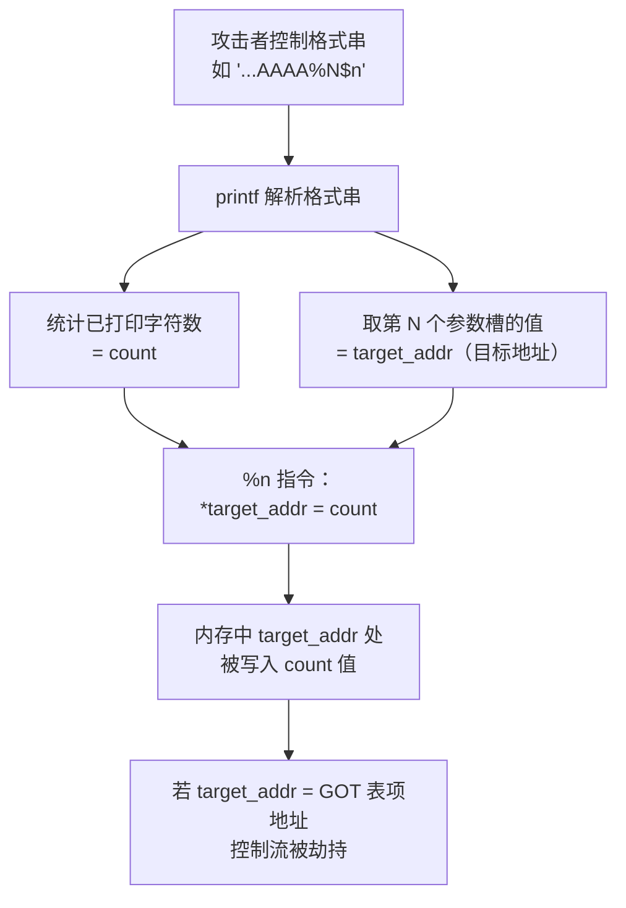
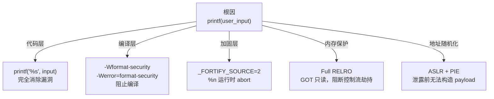

# 格式化字符串漏洞

> [!abstract] TL;DR
> 格式化字符串漏洞（Format String Vulnerability）的根因是一行代码：`printf(user_input)`——把用户可控字符串直接当作格式串传给 `printf`。`printf` 内部按格式串中的说明符（`%x`、`%s`、`%n` 等）主动读取或写入栈上（及寄存器中）的参数槽，而攻击者完全控制格式串内容，就能以此为杠杆实现**任意地址读**和**任意地址写**两种原语，进而改写 GOT 表项劫持控制流。

---

## 概述与定位

### 漏洞为何会出现

C 标准库的 `printf` 家族函数（`printf`、`fprintf`、`sprintf`、`snprintf`、`vprintf` 等）以格式串（format string）为核心工作：格式串里每个 `%` 说明符对应一个后续参数。**函数本身无法知道格式串是否可信——它只会机械地消费参数槽**。

```c
// 正确写法：格式串由程序员控制
printf("%s", user_input);   // user_input 只当数据，永远安全

// 漏洞写法：用户输入直接当格式串
printf(user_input);         // user_input 含 %x/%n 则引发漏洞
```

`printf(user_input)` 等价于程序员把格式串的解释权拱手交给了攻击者。

### 在本系列中的位置

本篇是第 08 篇，衔接：
- 上游：[[07.GOT劫持与ret2dl-resolve]] 讲解了 GOT 改写如何实现控制流劫持；本篇揭示**格式化字符串写 GOT** 是最经典的任意写手段之一。
- 下游：[[09.堆管理基础]] 进入堆漏洞领域。
- 横向：信息泄露在现代利用链中的核心地位见 [[13.现代利用与信息泄露]]；GOT/RELRO 机制详见 [[11.ELF文件详解/17.got节.md]]；参数传递方式（x86 栈 vs x86-64 寄存器）见 [[22.调用规约/00.总览.md]]。

---

## 原理与机制

### printf 的参数消费模型

`printf` 通过 `va_list`/`va_arg` 从调用帧读取可变参数。在 x86（32 位，cdecl）下，所有参数按从右向左顺序压栈，`printf` 按格式串从左向右逐一读取——**它不知道参数实际有几个，只按格式串中 `%` 说明符的数量依次取**。

```
x86 栈帧（调用 printf(fmt, a, b, c) 之后）
  高地址
  ┌──────────────┐
  │   c (arg3)   │  ← 第三个参数
  ├──────────────┤
  │   b (arg2)   │  ← 第二个参数
  ├──────────────┤
  │   a (arg1)   │  ← 第一个参数
  ├──────────────┤
  │  fmt（地址）  │  ← 格式串指针（第0参数）
  ├──────────────┤
  │  返回地址    │  ← caller 的返回地址
  └──────────────┘
  低地址
```

如果格式串包含 4 个 `%x`，而调用者只传了 1 个参数，`printf` 仍会继续向高地址读取栈上后续位置（即调用者的栈帧内容）——**越界读取栈数据**，这就是信息泄露的根源。

### x86-64 的区别

x86-64（System V AMD64 ABI，Linux/macOS）前 6 个整型参数走寄存器：`rdi`（格式串）、`rsi`、`rdx`、`rcx`、`r8`、`r9`，之后才落到栈上。见 [[22.调用规约/00.总览.md]] 中对 64 位 ABI 的描述。

```
x86-64 printf 参数布局（无额外参数时）：
  rdi = fmt（格式串指针）
  rsi = 参数1（若存在）
  rdx = 参数2
  rcx = 参数3
  r8  = 参数4
  r9  = 参数5
  栈  = 参数6, 7, ...（从低地址到高地址）
```

**对漏洞利用的影响**：
- x86-64 下前几个 `%p`/`%x` 会泄露寄存器内容（`rsi`、`rdx`…），而非纯栈内容。
- 用 `%N$` 直接定位第 N 个参数时，**N=1 对应 `rsi`，N=6 往后才是栈**（`%6$` 为第一个栈上参数；具体偏移与编译器/ABI 有关，需实测）。
- x86（32 位）下从 `%1$`（或 `%x`）第一个就是栈上紧接格式串指针之后的内容，偏移计算更简单。

### 常用说明符及其危害

| 说明符 | 语义 | 危害 |
|--------|------|------|
| `%x` / `%p` | 按整数/指针打印对应参数槽的值 | **泄露栈内容**：地址、canary、返回地址等（信息泄露） |
| `%s` | 把对应参数槽的值当作字符串指针，读取该地址处的字符串 | **任意地址读**：将任意地址内容以字符串形式输出 |
| `%n` | 把**已打印的字符数**写入对应参数槽所指向的地址 | **任意地址写**：核心利用原语 |
| `%hn` | 写 16 位 short | 细粒度任意写 |
| `%hhn` | 写 8 位 byte | 细粒度任意写（逐字节） |
| `%N$` | 直接定位第 N 个参数（位置参数，POSIX 扩展） | 精确控制读/写哪个参数槽，降低利用噪声 |

### %n 任意写的直觉



通过控制格式串中填充字符的数量（如 `%50c`、`%2000c`）可以精确控制写入的值（已打印字符数），再配合 `%hn`/`%hhn` 分次写，就能将任意 4 字节/8 字节值写入任意地址。

---

## 最小示例（教学 demo）

> [!warning] 教学环境声明
> 以下示例需关闭多项现代防护以复现漏洞行为（`-fno-stack-protector`、`-no-pie`、`-z norelro`）。**这些防护在生产环境默认开启**，本示例仅用于理解漏洞原理，请勿用于非授权测试。

### vuln.c — 漏洞程序

```c
// vuln.c  — 格式化字符串漏洞教学 demo
// 编译（教学环境，关闭防护）：
// gcc -m32 -fno-stack-protector -no-pie -z norelro -o vuln vuln.c
#include <stdio.h>
#include <string.h>

void secret() {
    puts("You reached secret()!");
}

int main(void) {
    char buf[128];
    printf("Input: ");
    fgets(buf, sizeof(buf), stdin);
    buf[strcspn(buf, "\n")] = '\0';

    // ⚠️ 漏洞根因：把用户输入当格式串
    printf(buf);           // BUG: should be printf("%s", buf)
    putchar('\n');
    return 0;
}
```

### 步骤一：用 %x/%p 泄露栈内容（信息泄露）

```
输入：%x.%x.%x.%x.%x.%x.%x.%x
输出（示意，非真实地址）：
f7fa3580.0.ffffd534.8049228.0.25782e25.2e782578.782578...
```

> [!warning] 示例输出为示意
> 地址值为教学示意，非本机实跑。

观察：第 6、7、8 个槽开始出现 `25782e25`（ASCII：`%x.%`），说明格式串本身已经出现在栈的某个位置——这是"格式串在栈上"的经典特征（x86-32 下 `fgets` 读入的 `buf` 在栈上，`printf` 参数链最终会扫描到 `buf` 自身）。

### 步骤二：用 %N$ 定位格式串所在的参数偏移

精确测试：输入 `AAAA.%1$x`、`AAAA.%2$x`……逐步增加 N，直到输出中出现 `41414141`（`AAAA` 的十六进制），即找到格式串在参数列表中的偏移 **k**。

假设 k=6，则输入 `\xef\xbe\xad\xde.%6$x` 输出应为 `deadbeef`——此时 `%6$n` 就能向地址 `0xdeadbeef` 写入已打印字符数。

### 步骤三：%s 任意地址读

```
输入（地址以原始字节嵌入）：<4字节目标地址>%6$s
```

`printf` 将第 6 个参数（即嵌入的地址值）当作字符串指针，打印该地址处的内容——实现任意地址读。

### 步骤四：%n 任意地址写（写 GOT）

```
// 目标：把 puts@GOT 改写为 secret() 的地址
// 设 secret() = 0x080491a0，puts@GOT = 0x0804c018
// 已知偏移 k=6
// 构造：<puts@GOT 4字节> + padding（让已打印字符数 = secret地址低字节） + %6$n
```

具体构造需分多步（`%hn`/`%hhn`）将目标值逐半字节写入，防止打印天文数字的字符——这是 CTF 中格式化字符串利用的标准范式，本篇只讲原理层，不提供即用载荷。

---

## 利用思路（原理层）

### 第一步：确定参数偏移

向程序输入 `AAAA.%1$x.%2$x.%3$x...` 逐步枚举，找到 `41414141` 出现时的偏移 k——之后 `%k$n` 就能写入格式串开头 4 字节所代表的地址。

### 第二步：信息泄露（呼应系列 13）

在现代有 ASLR/PIE 的场景，需要先泄露地址才能构造 payload：
- `%p` / `%x` 连续泄露，找栈上的返回地址或 libc/程序段地址；
- `%s` 加上已知地址读取 GOT 表项当前值（libc 已解析地址），反推 libc 基址。

### 第三步：任意写升级为控制流劫持

格式化字符串写 GOT 的流程（接 [[07.GOT劫持与ret2dl-resolve]]）：

1. 确定目标函数的 GOT 表项地址（`objdump -R` / `readelf -r`）。
2. 用 `%N$n` 将该地址写入目标值（如 `system` 地址、`one_gadget`）。
3. 下次程序调用该函数，实际执行攻击者指定的代码。

```
printf(fmt) --[%n]--> writes to got.plt[puts] --> next puts() jumps to system()
```

GOT 的结构与 RELRO 的防护关系，详见 [[11.ELF文件详解/17.got节.md]] §11/§12。

### x86 vs x86-64 的偏移差异总结

| 特性 | x86（32位） | x86-64（Linux） |
|------|------------|----------------|
| 格式串指针位置 | 栈（cdecl 第0参数） | `rdi` |
| 第1参数位置 | 栈（格式串指针+4字节） | `rsi` |
| 前6个参数 | 全在栈上 | 寄存器（rsi/rdx/rcx/r8/r9） |
| 格式串在栈上时的典型偏移 | 通常 k=4\~8 | 通常 k=6\~10（跳过寄存器后） |
| `%n` 写入限制 | 无（glibc 默认允许） | 受 FORTIFY 限制 |

---

## 缓解与防御

### 1. 编码层：永远不要把用户输入当格式串

这是**唯一的根本性防御**，其他所有缓解都只是"让利用更难"而非"让漏洞消失"。

```c
// ❌ 永远不要写
printf(user_input);
fprintf(fp, user_input);
sprintf(buf, user_input);

// ✅ 正确写法：格式串固定，数据单独传
printf("%s", user_input);
fprintf(fp, "%s", user_input);
snprintf(buf, sizeof(buf), "%s", user_input);
```

### 2. 编译器警告与错误选项

GCC/Clang 对格式化字符串漏洞有内置静态检测：

```bash
# 开启格式串安全警告
gcc -Wall -Wformat -Wformat-security -o prog prog.c

# 将格式串警告升级为编译错误（推荐在 CI/项目中强制）
gcc -Wall -Wformat -Wformat-security -Werror=format-security -o prog prog.c
```

`-Wformat-security` 专门检测「非字符串字面量用作格式串」这一模式，即 `printf(var)` 会产生：
```
warning: format not a string literal and no format arguments [-Wformat-security]
```

加 `-Werror=format-security` 后编译直接失败，强制开发者修正。

### 3. FORTIFY_SOURCE 对 %n 的限制

`_FORTIFY_SOURCE` 是 glibc 提供的编译时/运行时加固机制，用加固版函数替换 `printf`、`strcpy` 等：

```bash
gcc -D_FORTIFY_SOURCE=2 -O1 -o prog prog.c
```

在 `_FORTIFY_SOURCE=2` 下，glibc 的 `__printf_chk` 实现会：
- **拒绝格式串来自可写内存段**（非 `.rodata`）时使用 `%n`——若检测到格式串不在只读段，且包含 `%n`，直接调用 `abort()`。
- 这使得格式串来自栈/堆（即用户可控）时，`%n` 写原语被运行时拦截。

> [!warning]
> `_FORTIFY_SOURCE=2` 对 `%n` 的限制是**运行时检查**，只能减弱利用，不能消除漏洞本身（`%x`/`%s` 信息泄露仍然有效）。根本修复还是正确使用格式串。

### 4. RELRO — 保护 GOT 不被改写

如 [[11.ELF文件详解/17.got节.md]] §11 所述：

| RELRO 级别 | 链接参数 | 对格式化字符串写 GOT 的效果 |
|-----------|---------|--------------------------|
| 无 RELRO | — | .got.plt 可写，函数 GOT 可被 `%n` 改写 |
| 部分 RELRO | `-Wl,-z,relro` | .got（GLOB_DAT）只读；.got.plt 仍可写 |
| **完全 RELRO** | `-Wl,-z,relro,-z,now` | .got 与 .got.plt 启动后全部只读，**从根本上阻断写 GOT** |

```bash
# 完整的防护编译命令（生产建议）
gcc -Wall -Wformat -Wformat-security -Werror=format-security \
    -D_FORTIFY_SOURCE=2 -O2 \
    -fstack-protector-strong \
    -Wl,-z,relro,-z,now \
    -pie -fPIE \
    -o prog prog.c
```

### 5. 纵深防御总览



---

## 检测与工具

### 静态检测

```bash
# GCC 编译期检测
gcc -Wformat -Wformat-security -Werror=format-security prog.c

# Clang 同理
clang -Wformat -Wformat-security -Werror=format-security prog.c

# 使用 CodeQL / Semgrep 等 SAST 工具查找 printf(var) 模式
semgrep --config=p/c prog.c
```

### 二进制保护状态检查

```bash
checksec --file=vuln
```

```
# 示例输出（示意，非本机实跑）
[*] './vuln'
    Arch:     i386-32-little
    RELRO:    No RELRO          ← 可写 GOT，易受格式化字符串写 GOT 攻击
    Stack:    No canary found
    NX:       NX enabled
    PIE:      No PIE
```

> [!warning] 示例输出为示意
> 以上 checksec 输出为教学示意，非本机实跑。

### 动态调试（GDB/pwndbg）

```bash
gdb ./vuln

# 在 printf 下断点，检查格式串参数
(gdb) break printf
(gdb) run
# 查看调用时的栈内容
(gdb) x/20wx $esp      # x86
(gdb) x/20gx $rsp      # x86-64

# 观察 GOT 表项当前值
(gdb) x/gx 0x0804c018  # puts@GOT（示意地址）
```

> [!warning] 示例输出为示意
> 断点地址与寄存器值为教学示意，非本机实跑。

### 模糊测试（Fuzzing）

针对格式化字符串漏洞，以 `%x%x%x%x`、`%s%s%s`、`%n%n%n` 作为种子输入进行模糊测试，崩溃（SIGSEGV、程序 abort）往往直接指向漏洞位置。AFL++/LibFuzzer 均适用。

---

## 小结

| 知识点 | 要点 |
|--------|------|
| **根因** | `printf(user_input)`——用户输入当格式串，`printf` 机械消费参数槽 |
| **`%x`/`%p`** | 泄露栈/寄存器值，实现信息泄露 |
| **`%s`** | 任意地址读：把参数槽值当指针，读取目标地址内容 |
| **`%n`** | 任意地址写：将"已打印字符数"写入参数槽所指地址 |
| **`%N$`** | 位置参数，精确定位第 N 个参数槽，是高效利用的前提 |
| **x86 vs x86-64** | 32 位全栈传参，偏移从 1 开始；64 位前 5 个参数走寄存器，第 6+ 才在栈上 |
| **写 GOT** | `%n` 改写 `.got.plt` 中的函数地址，劫持控制流（见 [[07.GOT劫持与ret2dl-resolve]]） |
| **根本防御** | `printf("%s", input)`，永远不让用户输入成为格式串 |
| **编译防御** | `-Wformat-security -Werror=format-security`，FORTIFY `%n` 检测 |
| **内存防御** | Full RELRO 使 GOT 只读，ASLR+PIE 增加信息泄露前提 |

> [!warning] 教学声明
> 本篇所有利用技术均在**教学环境下关闭防护**的最小化示例中讲解，目的是理解漏洞原理以便更好地防御。请勿将任何技术手段用于未经授权的系统测试。格式化字符串漏洞已有成熟的编译器静态检测手段，新代码中这类漏洞完全可以在编译期消灭。

---

## 相关阅读

- **GOT/RELRO 详解（任意写的目标）**：[[11.ELF文件详解/17.got节.md]]
- **GOT 改写攻击的利用链**：[[07.GOT劫持与ret2dl-resolve]]
- **调用规约与参数布局（理解偏移的基础）**：[[22.调用规约/00.总览.md]]
- **信息泄露在现代利用中的地位**：[[13.现代利用与信息泄露]]
- **堆漏洞（%n 任意写也可结合堆布局）**：[[09.堆管理基础]]
- **缓解机制系统讲解**：[[34.现代二进制防护机制/00.现代二进制防护机制总览]]
- **PLT/GOT/延迟绑定**：[[14.动态链接与加载器详解/08.PLT与GOT与延迟绑定.md]]

---

⬅️ 上一篇 [[07.GOT劫持与ret2dl-resolve]] ｜ 🏠 [[00.二进制漏洞与利用基础总览]] ｜ 下一篇 [[09.堆管理基础]] ➡️
