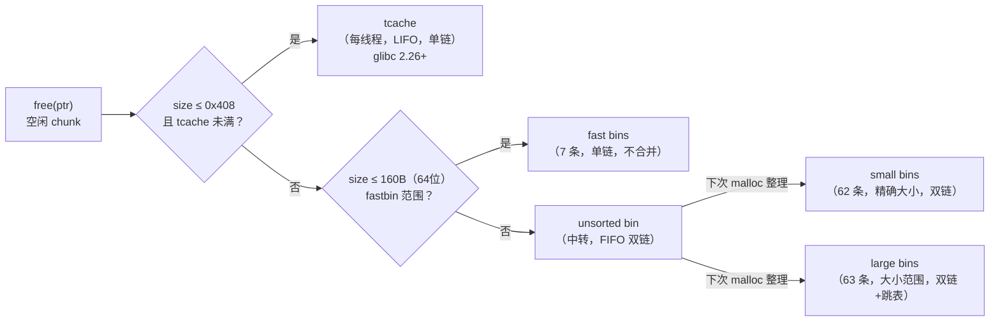
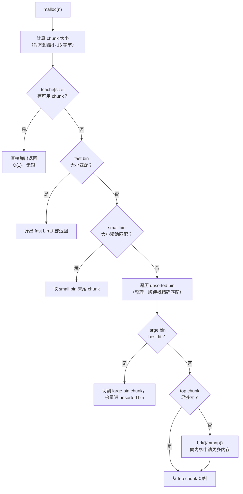
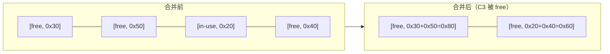
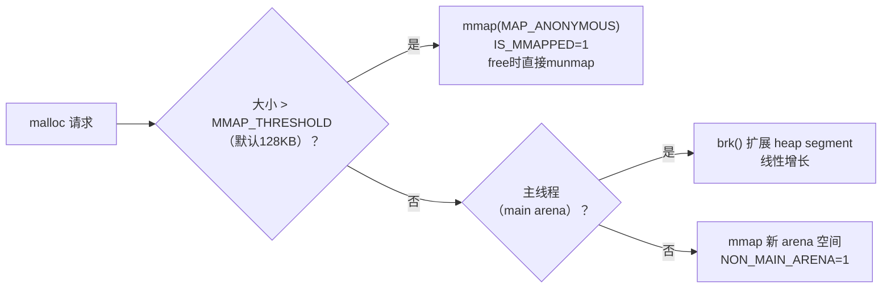
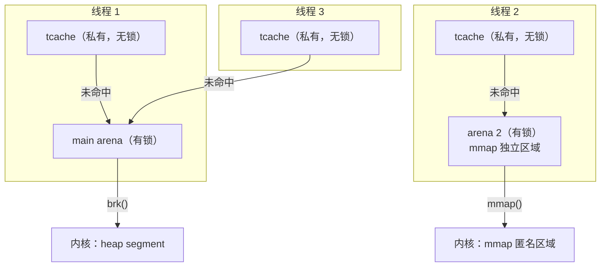

# 二进制漏洞与利用基础（9）· 堆管理基础

> [!abstract] TL;DR
> - **堆**（heap）是程序运行期通过 `malloc`/`free` 动态申请/释放的内存区域，由用户态堆管理器（Linux 上是 glibc ptmalloc2）在内核提供的原始内存上维护。
> - 堆管理器以 **chunk** 为最小单位组织内存；每个 chunk 头部含 `prev_size`/`size` 字段，`size` 低 3 位是 PREV_INUSE、IS_MMAPPED、NON_MAIN_ARENA 标志位。
> - 空闲 chunk 按大小入不同的 **bin**：glibc 2.26+ 的 tcache（每线程，容量 7 条）→ fast bins（16–160 字节，单链）→ unsorted bin（回收中转）→ small/large bins（精确/范围大小）→ 最后从 **top chunk** 切割。
> - 相邻空闲 chunk 会被**合并**（consolidate）以减少碎片；`free()` 通过 PREV_INUSE 位和 `prev_size` 字段感知前驱 chunk 是否空闲。
> - 堆通过 `brk()`（主 arena）或 `mmap()`（大块分配或非主 arena）向内核申请原始内存，呼应 [[14.动态链接与加载器详解/04.可执行文件的内存映射.md]] 的内存映射机制。
> - 理解这些机制是读懂堆漏洞（[[10.堆漏洞入门]]）的前提：几乎所有堆漏洞都在利用或破坏上述数据结构的语义。

---

## 概述与定位

### 堆在进程地址空间中的位置

进程虚拟地址空间（详见 [[14.动态链接与加载器详解/04.可执行文件的内存映射.md]]）从低到高大致为：

```
低地址
  ┌──────────────┐
  │  .text/.data │  ← 由 ELF PT_LOAD 段 mmap 映射（含 .bss，见 [[11.ELF文件详解/08.bss节.md]]）
  │  .bss        │
  ├──────────────┤
  │   堆 (heap)  │  ← brk 向上增长；malloc/free 在此管理
  │      ↓       │
  │      ...     │
  │      ↑       │
  │  mmap 区     │  ← 共享库、大块 malloc、非主 arena
  ├──────────────┤
  │    栈 (stack)│  ← 向下增长
  └──────────────┘
高地址
```

`.bss` 是静态零初始化变量（文件中无内容，加载时匿名映射清零）；**堆是运行期动态申请的**，两者都是 "零成本初始化" 的内存，但来源和生命周期截然不同——前者由加载器在 `execve` 时建立，后者由堆管理器响应 `malloc` 请求在程序运行期创建。

### 为什么学堆管理是学堆漏洞的前提

堆漏洞（堆溢出、UAF、double free、tcache poisoning…）的本质是**破坏或伪造堆管理器的内部数据结构**，让管理器在下次分配或释放时执行攻击者期望的操作（如返回一个任意地址作为堆指针）。不理解 chunk 结构和 bin 组织，就无法理解"写哪里、改什么、下次 malloc 返回什么"。本篇是后续 [[10.堆漏洞入门]] 的地基。

---

## 原理与机制

### `malloc_chunk` 结构

glibc ptmalloc2 以 `malloc_chunk` 为内存管理的原子单位，其 C 定义（简化自 `malloc/malloc.c`）如下：

```c
struct malloc_chunk {
    size_t  prev_size;  /* 前驱 chunk 的大小（仅当前驱空闲时有效） */
    size_t  size;       /* 本 chunk 的大小（含头部），低3位是标志位 */

    /* 以下字段仅空闲 chunk 使用（分配时这块内存归用户使用） */
    struct malloc_chunk *fd;   /* forward，指向 bin 中下一个空闲 chunk */
    struct malloc_chunk *bk;   /* backward，指向 bin 中上一个空闲 chunk */

    /* 仅 large bin 使用 */
    struct malloc_chunk *fd_nextsize;  /* large bin 跳表，指向下一个更小的 chunk */
    struct malloc_chunk *bk_nextsize;
};
```

#### `size` 字段的低 3 位标志

```
bit 0 = PREV_INUSE (P)     ── 前驱 chunk 是否正在使用（1=在用，0=空闲）
bit 1 = IS_MMAPPED (M)     ── 本 chunk 是否由 mmap 直接分配（大块）
bit 2 = NON_MAIN_ARENA (A) ── 本 chunk 是否属于非主 arena
```

chunk 的真实大小 = `size & ~0x7`（掩去低 3 位标志）。chunk 大小最小对齐至 16 字节（64 位系统）。

#### chunk 布局示意


> [!note] `malloc` 返回的指针指向 `size` 字段之后的用户数据区，而不是 chunk 头部。因此对 `malloc(n)` 实际消耗 `n + 16 字节`（64 位，两个 `size_t` 头）并按 16 字节对齐。

#### `prev_size` 与 PREV_INUSE 的配合

当相邻的前驱 chunk 空闲时，本 chunk 的 `prev_size` 记录前驱 chunk 的大小（供 `free` 时向后合并定位前驱头部）；`size` 字段的 bit 0（PREV_INUSE）为 0 表示前驱空闲。两者配合完成 **backward consolidation**（向前合并）。

### Bins：空闲 chunk 的管理

空闲 chunk 按大小和来源插入不同的 bin（链表/数组结构），`malloc` 优先从 bin 中取用，避免频繁向内核申请内存。



#### tcache（glibc 2.26+）

tcache（Thread Cache）是每个线程私有的缓存，优先级最高：

| 属性 | 值 |
|---|---|
| 引入版本 | glibc 2.26（2017） |
| bin 数量 | 64 条（对应大小 0x20–0x410，步长 0x10） |
| 每条最大容量 | 7 个 chunk |
| 链表类型 | 单链（LIFO，类似栈） |
| 合并行为 | **不合并**（速度优先） |
| 指针存储 | 在 chunk 的 `fd` 字段存放下一个 tcache chunk 的地址（glibc 2.32+ 使用 safe-linking 混淆） |

tcache 的引入大幅提升了小块分配的速度（无锁，线程私有），但也引入了新的攻击面（tcache poisoning，见 [[10.堆漏洞入门]]）。

#### fast bins

| 属性 | 值 |
|---|---|
| 大小范围 | 16–160 字节（64 位，默认 MALLOC_FAST_MAX = 160） |
| bin 数量 | 7 条（每条对应一种大小） |
| 链表类型 | 单链（LIFO），`fd` 指向下一个 |
| 合并行为 | **不合并**（不清 PREV_INUSE） |
| 特点 | 速度快，延迟合并；`malloc_consolidate` 触发时才并入 unsorted bin |

#### unsorted bin

所有不进 tcache/fastbin 的空闲 chunk，`free` 时先进 unsorted bin（双链，FIFO）。下次 `malloc` 遍历 unsorted bin 时，大小精确匹配则直接返回；否则整理分流进 small/large bin。

#### small bins

- 约 62 个精确大小的 small bin（index 0/1 留给 unsorted，有效范围 0x20–0x3F0，步长 0x10）
- 双链（FIFO），插入尾、取出头
- 适合快速的精确大小匹配

#### large bins

- 63 条，每条覆盖一个大小范围（从 1KB 起）
- 双链 + 跳表（`fd_nextsize`/`bk_nextsize`），同条内按大小降序排列
- 分配时取最合适（best fit）的 chunk

### largebin 的 skip-list（跳表）结构详解

#### 为什么 large bin 需要额外的跳表

small bin 每条链表内的 chunk 大小完全相同（精确匹配），遍历任意一个节点都足以判断能否满足请求。large bin 则不同：同一 bin 覆盖一个大小范围（如 bin 65 覆盖 512–576 字节），链表内部包含多种不同大小的 chunk。如果全链遍历寻找最合适（best fit）的 chunk，最坏情况是 O(n)，在 bin 内 chunk 数量多时性能很差。

ptmalloc2 为此在 large bin 内部叠加了一条**按 size 排序的双向跳表索引**：`fd_nextsize` / `bk_nextsize`。

#### `fd_nextsize` / `bk_nextsize` 的组织方式

```
large bin（以某一 bin 为例，内含不同 size 的 chunk）：

双向 fd/bk 链（所有 chunk，FIFO 顺序）：
  bin_head ←→ chunkA(0x520) ←→ chunkB(0x520) ←→ chunkC(0x4f0) ←→ chunkD(0x4f0) ←→ chunkE(0x4a0)

fd_nextsize / bk_nextsize 跳表（仅每种大小的"代表节点"，按 size 降序）：
  chunkA(0x520) ←nextsize→ chunkC(0x4f0) ←nextsize→ chunkE(0x4a0)
```

规则：
- **只有每种大小的第一个出现的 chunk（在 fd/bk 链中最靠近 bin_head 的那个）才加入 nextsize 跳表**；相同大小的后续 chunk 的 `fd_nextsize`/`bk_nextsize` 为 NULL（标记"不是代表节点"）。
- 跳表按 size **降序**排列（bin_head 方向是最大值）：`fd_nextsize` 指向更小的代表节点，`bk_nextsize` 指向更大的代表节点。

#### best fit 分配的遍历方式

`malloc` 从 large bin 分配时，需要找到大小 ≥ 请求 size 中最小的那个 chunk（best fit）：

```
1. 从 bin_head->bk 开始（链表尾部，即最小的 chunk）
2. 沿 bk_nextsize 向前跳（跳过同 size 的重复节点，每次跳到更大一级的代表节点）
3. 找到第一个 chunk_size >= request_size 即停止 ──── O(种类数)，而非 O(chunk总数)
4. 如果这个代表节点本身就是唯一的该 size chunk，取之；
   否则取它的 fd 邻居（同 size 的下一个，不需要更新 nextsize 链）
5. 若该 chunk 比请求大，切割剩余部分插入 unsorted bin
```

这样的遍历代价是 O(不同大小的种类数)，而不是 O(该 bin 内 chunk 总数)，显著加速了 best fit 查找。

#### 插入 large bin 时的跳表维护

向 large bin 插入一个新 chunk 时，glibc 需同时维护 fd/bk 链和 nextsize 跳表：

```c
/* 插入逻辑示意（简化自 glibc malloc.c _int_malloc） */
// 1. 在 fd/bk 链中按 size 降序找到合适位置插入
// 2. 判断新 chunk 的 size 是否已有代表节点：
//    a. 有：插到该代表节点的 fd/bk 链中（nextsize 字段留 NULL）
//    b. 无：插入跳表（更新前后代表节点的 fd_nextsize/bk_nextsize）
```

**边界陷阱**：largebin attack（堆利用手法之一）正是利用了插入时对 `bk_nextsize->fd_nextsize` 的赋值操作——伪造 `bk_nextsize` 可让 glibc 向任意地址写入新 chunk 的地址，构成任意地址写原语。这是 large bin 跳表在 CTF 和真实漏洞利用中最重要的攻击面。

#### top chunk

堆末尾的剩余大块，不属于任何 bin。`malloc` 无法从 bin 中满足时，从 top chunk 切割；top chunk 耗尽时触发 `brk()` 扩展或 `mmap()`（见下文）。

### `malloc` 分配流程概览



### `free` 释放流程与合并（consolidate）

```
free(ptr):
  1. 计算 chunk 头部（ptr - 0x10）
  2. 若 size 满足 tcache 范围且 tcache 未满 → 插入 tcache，完毕（glibc 2.26+，优先级最高）
  3. 若 size 满足 fast bin 范围 → 插入 fast bin 头部，完毕（不合并）
  4. 否则，尝试合并：
     a. 检查 size.PREV_INUSE == 0：前驱空闲 → 用 prev_size 定位前驱 chunk，
        从其 bin 中 unlink，合并
     b. 检查下一 chunk 的 PREV_INUSE 位：后继空闲 → 从其 bin 中 unlink，合并
     c. 合并后的大 chunk 进 unsorted bin
  5. 若合并后紧邻 top chunk → 并入 top chunk
```

#### 为什么合并（consolidate）重要

不合并会导致**堆碎片**：反复分配/释放小块后，大量不连续的小空闲 chunk 无法满足一次较大的分配。合并把相邻空闲 chunk 变成一个大块，重新投入使用。



### 堆通过 `brk` / `mmap` 增长

堆的原始内存来自内核，有两条路径（呼应 [[14.动态链接与加载器详解/04.可执行文件的内存映射.md]] 的映射机制）：

| 路径 | 触发条件 | 系统调用 | 说明 |
|---|---|---|---|
| `brk()` | 主 arena（主线程堆）top chunk 耗尽 | `brk` 移动数据段结束地址 | 堆以线性方式向高地址扩展，起始地址固定（ASLR 随机化堆基址） |
| `mmap()` | 分配大块（默认 > 128 KB）或非主 arena | `mmap(MAP_ANONYMOUS)` | 独立映射，`free` 后直接 `munmap` 归还内核；IS_MMAPPED 标志位置 1 |



### Arena：多线程下的堆管理

单个全局 heap 在多线程下会因锁竞争而成为瓶颈。ptmalloc2 引入 **arena** 概念：

- **main arena**：主线程使用，通过 `brk` 扩展，唯一。
- **非主 arena**：其他线程按需通过 `mmap` 创建（最多 `8 * CPU数`），各自独立管理一块内存，线程间竞争减少。
- **tcache**（线程缓存）：更上层的优化，每线程私有，不需要 arena 锁。



---

## 最小示例（教学 demo）

> [!warning] 教学环境免责声明
> 以下 demo 旨在让你通过 GDB + pwndbg 直接观察 chunk 结构和 bins，没有故意引入漏洞。需在 **Linux 环境**（glibc 2.26+）中运行，本机 Windows 上可用 WSL 或虚拟机。

```c
/* heap_demo.c — 教学 demo，观察 chunk 布局与 bins */
#include <stdio.h>
#include <stdlib.h>
#include <string.h>

int main(void) {
    /* 分配三块 */
    char *a = malloc(0x20);   /* chunk 大小 = 0x30（含头部，16字节对齐） */
    char *b = malloc(0x50);   /* chunk 大小 = 0x60 */
    char *c = malloc(0x20);

    memset(a, 'A', 0x20);
    memset(b, 'B', 0x50);
    memset(c, 'C', 0x20);

    /* 释放 b，进 unsorted bin（不在 tcache 范围：0x60 < 0x410，实际进 tcache） */
    free(b);

    /* 释放 a，若 tcache 未满则进 tcache，否则尝试合并 */
    free(a);

    /* 再分配，观察是否从 bin 中取用（tcache 优先） */
    char *d = malloc(0x50);

    return 0;
}
```

```bash
gcc -g -o heap_demo heap_demo.c
gdb -q heap_demo
```

---

## 利用思路（原理层面）

> [!note] 本节只描述"机制被破坏时会发生什么"，不提供完整 exploit 链，符合本系列安全教育定位。完整讨论见 [[10.堆漏洞入门]]。

堆漏洞的核心思路：**通过损坏 chunk 元数据，让 `malloc` 返回一个攻击者控制的任意地址**（任意地址写原语），或触发 `free` 时的 `unlink` 操作向任意地址写入特定值。

典型思路链：

1. **堆溢出**：写超出 chunk 用户区，破坏相邻 chunk 的 `size`/`fd`/`bk`。
2. **UAF（use-after-free）**：`free` 后的 chunk 仍可被写，修改 `fd` 指针指向目标地址；下次 `malloc` 从 bin 中"正常"弹出这个伪造地址，作为返回值。
3. **double free**：同一 chunk 被 `free` 两次，导致 bin 链表出现环，可被塑造成任意地址写。

理解 chunk 结构（`fd`/`bk`）和 bin 操作（unlink/弹出）是分析所有这些路径的前提，这正是本篇所讲的内容。

---

## 缓解与防御

### 现代 glibc 的堆加固

随着堆利用技术的演进，glibc 在堆管理器层面加入了多项加固措施：

#### tcache key / count（glibc 2.29+）

```c
/* glibc 2.29+ tcache_entry 结构 */
typedef struct tcache_entry {
    struct tcache_entry *next;  /* fd 指针（safe-linking 混淆后） */
    struct tcache_perthread_struct *key;  /* 指向本线程 tcache 头，double free 检测用 */
} tcache_entry;
```

- **`key` 字段**：`free` 时设置 chunk 的 `key` 为当前线程 tcache 结构的地址；再次 `free` 同一 chunk 时检测到 `key` 非零（且指向当前 tcache），即判定 double free，触发 `abort()`。
- **`count` 限制**：每个 tcache bin 最多 7 个条目，超出走 fastbin/unsorted bin 路径，防止 tcache 被无限填充绕过后续检查。

#### safe-linking 指针混淆（glibc 2.32+）

tcache 和 fast bin 的 `fd` 指针在存储时被混淆（protect/reveal）：

```c
/* 混淆 */
#define PROTECT_PTR(pos, ptr) \
    ((__typeof__(ptr))((((size_t)pos) >> 12) ^ ((size_t)ptr)))
/* 还原 */
#define REVEAL_PTR(ptr)  PROTECT_PTR(&ptr, ptr)
```

存储时将 `fd` 与 `(chunk地址 >> 12)` 异或；取出时再异或还原。攻击者若直接伪造 `fd` 指针，取出后的地址是错误的（被异或混淆），无法精确控制返回地址——**除非同时泄露堆地址**（获得 `chunk地址 >> 12` 的值）。

### glibc 2.32+ safe-linking 深度解析

#### 为什么用"chunk 地址右移 12 位"作密钥

safe-linking 的设计目标是"用最小成本让伪造 `fd` 的攻击者必须先泄露堆地址"。密钥的选取有三层考量：

**1. 为何是 chunk 自身地址（`pos`），而非随机数？**

真随机密钥需要额外存储，增加内存开销，且 glibc 不想引入新的状态。用 chunk 自身的地址作密钥——这个值对堆管理器是天然已知的（管理器持有 chunk 指针），对外部攻击者则是秘密（需要泄露才能获得）。

**2. 为何右移 12 位（而不是其他位数）？**

x86-64 系统上堆页面按 4 KB（2¹²）对齐，因此 chunk 地址的低 12 位永远是 0——这 12 位不携带有效的随机化信息（对攻击者来说不需要猜）。右移 12 位后，密钥的低位来自地址中携带 ASLR 随机化信息的部分，最大化密钥的不可预测性。同时这个操作只需一条 SHR 指令，性能开销极小。

**3. 为何是异或（XOR），而非加法或其他运算？**

异或是对合运算：`(A XOR B) XOR B = A`，加/解密逻辑完全对称（都是同一个 `PROTECT_PTR` 宏）。加法则需要另一个反操作，且存在进位带来的信息泄露风险。

#### 对 tcache poisoning 的具体影响

未有 safe-linking 时（glibc < 2.32），攻击者修改 `fd` 为目标地址 `evil_addr`，下次 `malloc` 直接返回 `evil_addr`——只需 UAF 写能力即可。

有 safe-linking 后，tcache chunk 的 `fd` 存储的是：

```
stored_fd = PROTECT_PTR(chunk_addr, real_next)
           = (chunk_addr >> 12) XOR real_next
```

取出时，glibc 执行 `REVEAL_PTR` 还原：

```
real_next = (stored_fd_addr >> 12) XOR stored_fd
```

攻击者若写入 `evil_addr` 作为 `stored_fd`，glibc 解混淆得到：

```
revealed = (&stored_fd >> 12) XOR evil_addr
```

这不等于 `evil_addr`——除非攻击者知道 `(&stored_fd >> 12)`，即堆地址的 ASLR 随机化部分。

**因此 tcache poisoning 在 glibc 2.32+ 须满足两个条件才能精确控制返回地址**：

1. **堆地址泄露**：需先通过其他手段（如 UAF 读 tcache chunk 的 `fd`，或 unsorted bin 的 `main_arena` 泄露）获取一个堆地址，计算出 `heap_base >> 12`。
2. **写入值须 16 字节对齐**：glibc 在从 tcache 弹出 chunk 时会校验还原后的地址是否满足 `MALLOC_ALIGNMENT`（16 字节）对齐，不对齐则 `abort()`。这要求 `evil_addr` 本身是 16 字节对齐的，限制了可控目标地址的范围（如 GOT 表项通常对齐，栈变量则不一定）。

```c
/* 攻击者写入 stored_fd 的值：需先泄露 heap_leak，再计算 */
size_t heap_key  = heap_leak >> 12;        /* 从已泄露堆地址中得到密钥 */
size_t poison_fd = heap_key ^ evil_addr;   /* 计算混淆后应写入的值 */
/* 将 poison_fd 写入目标 chunk 的 fd 字段（须 evil_addr 16字节对齐） */
```

> [!note] CTF 视角
> 在 glibc 2.32+ 的堆题中，safe-linking 通常要求选手先完成"堆地址泄露"这一步（例如通过 UAF 读取 tcache 中第二个 chunk 的 `fd`——此时 `fd` 存的是下一 chunk 的混淆值，而一条全零的 tcache bin 末尾 chunk 的 `fd` 为 `heap_base >> 12 XOR 0 = heap_base >> 12`，直接读出即为密钥）。得到密钥后，写入 `target XOR key` 作为 `fd`，才能让 `malloc` 精确返回目标地址。

#### chunk size 完整性校验（多版本持续加强）

```
free(ptr) 时的典型校验（示意）：
  1. chunk size 不为 0，不超过 system_mem（已分配总量）
  2. PREV_INUSE 合法性校验
  3. 下一 chunk 的 size 字段与当前 chunk 的位置/大小一致
  4. small/large bin 的 fd/bk 双向链表完整性（unlink 时 fd->bk == chunk && bk->fd == chunk）
```

unlink 操作的双向链表检查（`fd->bk == P && bk->fd == P`）是对老版本"任意写"的根本性修补——攻击者伪造 `fd`/`bk` 后，`unlink` 前的校验会检查反向指针是否一致，不一致则直接 `abort()`。

#### 其他加固

| 加固点 | 版本 | 说明 |
|---|---|---|
| 对齐检查 | 较早 | `free` 指针必须对齐到 `MALLOC_ALIGNMENT`（16 字节） |
| top chunk 完整性 | 较早 | top chunk `size` 非法则 `abort` |
| fastbin 大小检查 | 较早 | 从 fast bin 取出时校验 size 是否与该 bin 对应 |
| malloc hook 弃用 | glibc 2.34 | `__malloc_hook`/`__free_hook` 被移除（之前是经典攻击靶点） |

### 应用层最佳实践

```
[  编码规范  ]
  ✓ 分配后记录 size，释放前不越界写
  ✓ free 后立即置 NULL（防 UAF）：  ptr = NULL;
  ✓ 不 double free（检查指针是否为 NULL）
  ✓ 用 valgrind / ASan 检测堆错误

[  编译加固  ]
  ✓ -D_FORTIFY_SOURCE=2        堆缓冲区溢出运行期检查
  ✓ AddressSanitizer (ASan)    开发/测试阶段检测所有堆越界和 UAF
  ✓ -fstack-protector-strong   栈 canary（不保护堆，但配合 ASan 构成纵深）

[  运行期  ]
  ✓ ASLR（/proc/sys/kernel/randomize_va_space = 2）随机化堆基址
  ✓ glibc 新版本（2.32+）的 safe-linking 默认开启
```

防护详解见 [[34.现代二进制防护机制/00.现代二进制防护机制总览]]（系列 34，尚待建立）。

---

## 检测与工具

### GDB + pwndbg：观察堆状态

> [!warning] 示例输出为示意
> 以下命令输出为代表性示意，非本机实跑（本机 Windows 环境）；具体地址随 ASLR 和 glibc 版本变化。在 Linux 上安装 pwndbg 后运行 `gdb ./heap_demo` 获取真实输出。

```bash
# 在 GDB + pwndbg 中运行 heap_demo，在 free(b) 后设断点
$ gdb ./heap_demo
(gdb) break *main+72     # 设在 free(b) 之后
(gdb) run
```

```
pwndbg> heap             # 列出所有 chunk
Allocated chunk | PREV_INUSE
Addr: 0x555555559000     # 示意地址
prev_size: 0x0
size: 0x291              # tcache_perthread_struct

Allocated chunk | PREV_INUSE
Addr: 0x555555559290
prev_size: 0x0
size: 0x31               # chunk a (0x20 + header = 0x30，PREV_INUSE=1 → 0x31)

Allocated chunk | PREV_INUSE
Addr: 0x555555559290+0x30 = 0x5555555592c0
prev_size: 0x0
size: 0x61               # chunk b (0x50 + header = 0x60，PREV_INUSE=1 → 0x61)
...
```

> [!warning] 示例输出为示意

```
pwndbg> bins             # 查看各 bin 的内容
tcachebins
0x60 [  1]: 0x5555555592d0  ◂— 0x0    # chunk b 已进入 tcache 0x60 bin
fastbins
Empty.
unsortedbin
Empty.
smallbins
Empty.
largebins
Empty.
```

> [!warning] 示例输出为示意

#### 常用 pwndbg 命令

| 命令 | 作用 |
|---|---|
| `heap` | 列出当前 arena 的所有 chunk（含头信息） |
| `bins` | 列出 tcache / fast bins / unsorted / small / large bins |
| `vis_heap_chunks` | 可视化 chunk 布局（颜色区分已分配/空闲） |
| `malloc_chunk <addr>` | 解析指定地址的 chunk 结构 |
| `arena` | 显示 main arena 的元信息（top chunk 地址、大小等） |
| `tcache` | 显示当前线程 tcache 的所有 bin 内容 |

### ASan（AddressSanitizer）

```bash
gcc -g -fsanitize=address -fno-omit-frame-pointer -o heap_asan heap_demo.c
./heap_asan
```

ASan 在每次堆分配前后插入 **redzone**（红区），访问 redzone 立即报告；对 UAF（free 后访问）、double free、堆缓冲区溢出均有检测能力，是开发期最有效的堆错误工具。

### valgrind memcheck

```bash
valgrind --tool=memcheck --leak-check=full ./heap_demo
```

检测内存泄漏、非法读写、未初始化内存使用，开销较大（约 10–20 倍运行时间），适合测试阶段全量扫描。

---

## 小结

1. **ptmalloc2 以 chunk 为原子单位**：`prev_size`/`size`（含 PREV_INUSE/IS_MMAPPED/NON_MAIN_ARENA 三标志）+ 空闲时的 `fd`/`bk` 指针，构成堆的全部元数据。理解这几个字节是读懂一切堆漏洞的起点。
2. **Bins 是空闲 chunk 的分级缓存**：tcache（最快，线程私有）→ fast bins（小块，不合并）→ unsorted bin（回收中转）→ small/large bins（精确/范围匹配）→ top chunk（兜底）。`malloc` 按此顺序依次尝试。
3. **合并（consolidate）防碎片**：PREV_INUSE 位和 `prev_size` 字段协作，让相邻空闲 chunk 在适当时机合并成大块，重新可用。
4. **堆内存来自 `brk` 或 `mmap`**：主 arena 用 `brk` 线性扩展，大块和非主 arena 用 `mmap` 独立映射——两者均受 ASLR 随机化堆基址影响。
5. **Arena 机制减少多线程竞争**：每线程 tcache 无锁，主/非主 arena 分离锁，是现代高并发程序的堆性能基础。
6. **现代 glibc 加固持续演进**：tcache key 防 double free、safe-linking 混淆指针、`__malloc_hook` 弃用，每代加固都是针对已知攻击技术的直接回应。

---

## 相关阅读

- **可执行文件内存映射（堆的原始内存来源）**：[[14.动态链接与加载器详解/04.可执行文件的内存映射.md]]
- **bss 节（与堆对比：同为"零初始化"但来源不同）**：[[11.ELF文件详解/08.bss节.md]]
- **上一篇：格式化字符串漏洞**：[[08.格式化字符串漏洞]]
- **下一篇：堆漏洞入门（本篇是其地基）**：[[10.堆漏洞入门]]
- **防护机制全貌**：[[34.现代二进制防护机制/00.现代二进制防护机制总览]]

---

⬅️ 上一篇 [[08.格式化字符串漏洞]] ｜ 🏠 [[00.二进制漏洞与利用基础总览]] ｜ 下一篇 [[10.堆漏洞入门]] ➡️
