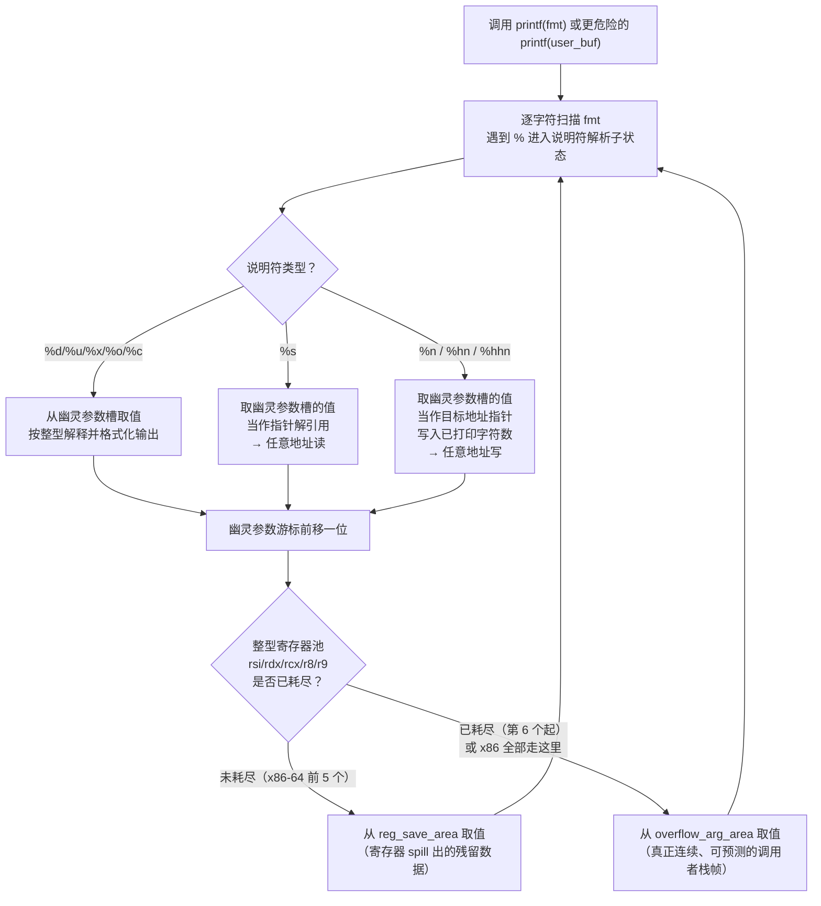
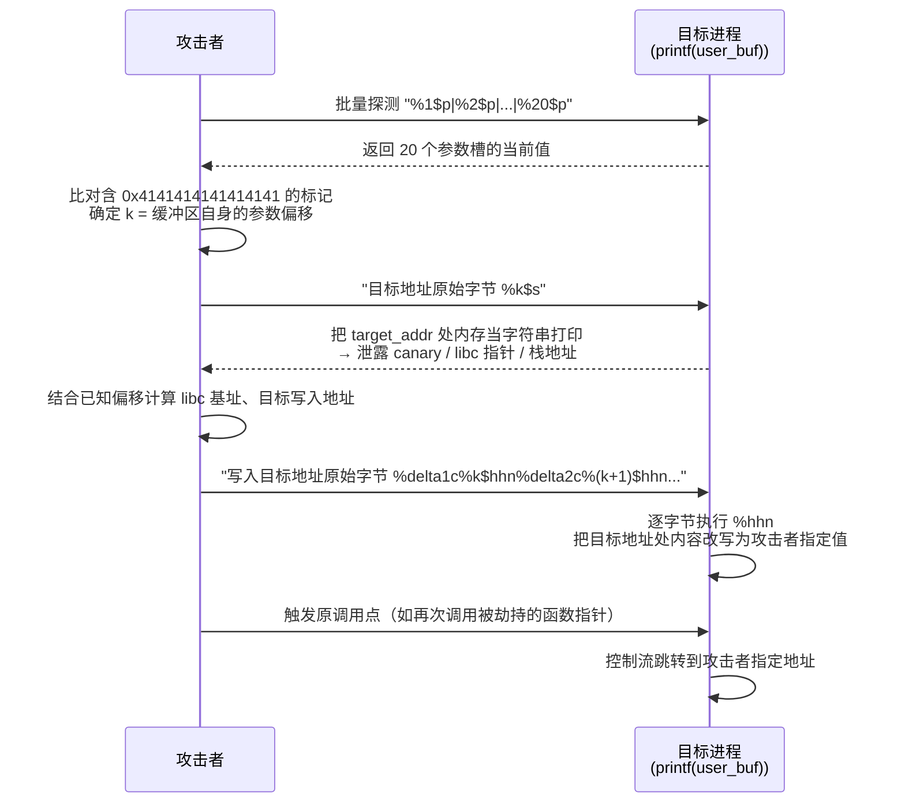
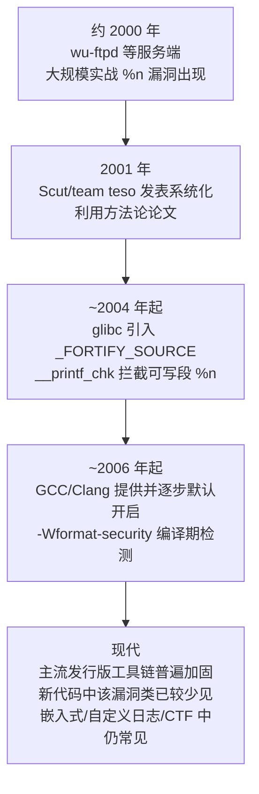

# 二进制漏洞与利用基础（9）· 格式化字符串漏洞

> [!abstract] TL;DR
> - 根因是一次信任错位：程序把**不可信输入直接当格式串**传给 `printf` 系列函数——`printf(user_input)` 而非 `printf("%s", user_input)`，等于把参数解释权拱手让给攻击者。
> - `%x`/`%p` 让攻击者按参数槽位置遍历栈与寄存器中残留的"幽灵参数"；`%s` 把参数槽的值当指针解引用，由此获得**任意地址读**（信息泄露）。
> - `%n`（及宽度变体 `%hn`/`%hhn`/`%ln`）把"已打印字符数"写入参数槽指向的地址，是本类漏洞的核心——**任意地址写**原语，靠宽度域填充精确控制写入数值。
> - `%N$` 直接参数访问（POSIX 扩展）把"探测偏移"和"精确打击"解耦：先批量 `%p` 探测格式串自身在参数序列中的下标，再用 `%k$n`/`%k$s` 一步到位，无需逐个陪跑填充。
> - 与栈溢出等空间型内存破坏不同，格式化字符串是**单个漏洞同时给出读和写两种原语**，不依赖额外的信息泄露漏洞配合，就能自成一条从泄露到控制流劫持的完整利用链。
> - 根本防御只有一条：格式串必须是常量字面量，用户输入只能作为 `%s` 的参数值；`-Wformat-security`/`-Werror=format-security` 能在编译期彻底消灭这类漏洞，`_FORTIFY_SOURCE=2` 只能运行时拦截可写内存中的 `%n`，并不拦截 `%p`/`%s` 泄露。

## 概述与定位

### printf 家族的信任模型

C 标准库的 `printf`/`fprintf`/`sprintf`/`snprintf`/`syslog`/`vprintf` 等函数都是**可变参数函数**（variadic function）：调用方传入一个格式串和数量不定的后续参数，函数内部完全依据格式串中 `%` 说明符的数量和类型，去调用帧里"按位取值"。这里有一个从设计之初就存在、却长期被忽视的信任假设：**格式串本身必须是可信的**，因为格式串不仅是"要打印的文字"，同时也是"要读多少个参数、怎么解释这些参数"的**执行指令**。函数本身没有任何机制去验证"格式串里声明要读 8 个参数"和"调用方实际压了几个参数"是否一致——它只会机械地按格式串向调用帧后续位置取值，取多少、怎么解释，完全由格式串的文本内容决定。

一旦这个格式串本身来自不可信输入（网络包、文件内容、用户键盘输入、环境变量……),攻击者就不再是"数据"的提供者，而摇身变成了"指令"的编写者：

```c
// 安全写法：格式串是编译期常量，user_input 只是数据
printf("%s", user_input);

// 漏洞写法：user_input 本身被当成格式串解释
printf(user_input);        // 若 user_input 含 %x / %n，漏洞被触发
```

这一行代码级别的疏漏，是格式化字符串漏洞（Format String Vulnerability）几乎全部危害的唯一根源。

### 与前序章节漏洞模型的本质差异

[[02.栈溢出原理与经典利用]] 到 [[08.栈迁移与stack pivot]] 覆盖的都是**空间型内存破坏**：程序对缓冲区边界的检查缺失或不足，写入的数据"越过"了本应止步的边界，覆盖了相邻的返回地址、栈帧指针或函数指针。这类漏洞的第一步永远是"如何造成一次越界写"，随后才是"覆盖什么、跳到哪里"的控制流劫持技巧。

格式化字符串漏洞完全不同：它**不需要任何越界**。`buf[128]` 装得下用户输入,`fgets` 老老实实地在边界内读取，没有一个字节溢出到相邻内存——问题出在**函数调用本身的语义被滥用**。这更接近于一种"confused deputy"（受骗的代理人）模式：`printf` 是一个被高度信任、拥有强大能力（读任意栈内容、写任意内存地址）的"代理人"，攻击者不需要突破任何边界检查，只需要让这个代理人**误以为**攻击者提供的内容是合法指令即可。这也是它在漏洞分类上通常被单独列为一类，而不与栈溢出、堆溢出并列讨论"越界"细节的原因。

也正因为不依赖内存越界，格式化字符串漏洞往往比栈溢出更"划算"：一次漏洞同时给出读和写两种原语，不必像 [[05.ret2libc]] 那样还要额外找一个信息泄露漏洞才能算出 libc 基址。历史上（约 2000 年前后）它一度是 CTF 与实战中"一击致命"的漏洞类型，wu-ftpd、ProFTPD、Samba 等知名服务都因此类缺陷被完整攻陷过。

### 在系列中的位置

| 维度 | 本章 | 关联章节 |
|---|---|---|
| 漏洞根因类型 | API 语义误用（逻辑层），非空间越界 | 对比 [[02.栈溢出原理与经典利用]]（空间越界）、[[10.整数溢出与类型转换缺陷]]（算术语义误用） |
| 提供的原语 | 任意地址读 + 任意地址写，二合一 | 读原语可直接服务 [[14.Canary泄露与绕过]]、[[15.ASLR与PIE绕过技术]] |
| 写原语的常见落点 | GOT 表项、返回地址、`.fini_array`、旧版 `__malloc_hook`/`__free_hook` | [[16.GOT劫持与ret2dlresolve]]、[[11.ELF文件详解/17.got节]]、[[24.内存管理与堆分配器/08.tcache机制]] |
| 参数寻址依赖的 ABI 细节 | 寄存器传参 vs 栈传参决定偏移计算方式 | [[22.调用规约/06.SystemV_AMD64调用规约]] |
| 工具链自动化 | pwntools `fmtstr` 模块 | [[22.利用开发工具链：pwntools与ROPgadget]] |

上一章 [[08.栈迁移与stack pivot]] 讨论的是"已经拿到控制流劫持能力后，栈空间不够时怎么办"；本章则回到更早的阶段——介绍一类完全不需要溢出就能直接获得读写原语的漏洞。下一章 [[10.整数溢出与类型转换缺陷]] 同样属于"逻辑语义误用"而非"空间越界"的漏洞谱系，二者可以对照阅读，理解"内存破坏"并不是二进制漏洞的唯一根因。

## 原理与机制

### 可变参数函数如何"找到"参数

要理解格式化字符串漏洞，必须先理解 `va_list`/`va_arg` 在底层做了什么。C 语言的可变参数机制不携带任何类型或数量的运行期元信息——`printf` 在编译期签名里只声明了 `(const char *fmt, ...)`，函数体内完全依赖 `va_arg(ap, type)` 宏，按调用约定规定的位置"盲取"下一个参数,并按调用者指定的 `type` 重新解释这段比特。这意味着：**参数的数量和类型完全是格式串告诉 `va_arg` 的，而不是调用帧真实携带的元数据**。

在 x86（32 位，`cdecl` 约定）下，所有参数（包括格式串指针本身）从右向左压栈，`printf` 内部的取参过程等价于沿着栈从低地址向高地址逐个读取：

```text
x86 栈帧（call printf(fmt, a, b) 之后，printf 视角）
  高地址
  ┌──────────────┐
  │   b（arg2）   │
  ├──────────────┤
  │   a（arg1）   │
  ├──────────────┤
  │ fmt（格式串指针）│  ← printf 自己的第 0 个参数
  ├──────────────┤
  │  返回地址     │
  └──────────────┘
  低地址（printf 内部 esp 附近）
```

若格式串里出现了 4 个 `%x` 而调用者只传了 2 个真实参数，`printf` 并不会报错，而是继续沿着栈向高地址方向"借用"后续本不属于这次调用的栈内容——这些内容可能是调用者更早的局部变量、上一层函数的栈帧残留，甚至是格式串缓冲区自身。这些被误读出来的值,在圈内俗称"幽灵参数"（phantom argument）。

### x86-64：寄存器池 + 栈溢出区的两段式取参

x86-64 下（System V AMD64 ABI，详见 [[22.调用规约/06.SystemV_AMD64调用规约]]），前 6 个整型/指针参数走寄存器：`rdi`（格式串本身）、`rsi`、`rdx`、`rcx`、`r8`、`r9`，第 7 个及以后才落到栈上。可变参数函数为了让 `va_arg` 能"透明"地按顺序取值，在函数入口 prologue 会把这些寄存器整体 spill（保存）到栈上一块连续区域，再配合一个游标结构体驱动后续取值：

```c
/* x86-64 System V ABI 规定的 va_list 底层结构（简化自 <stdarg.h> 展开后的实现） */
typedef struct {
    unsigned int gp_offset;     /* 下一个未消费的整型寄存器，在 reg_save_area 中的偏移 */
    unsigned int fp_offset;     /* 下一个未消费的浮点寄存器，在 reg_save_area 中的偏移 */
    void *overflow_arg_area;    /* 寄存器耗尽后，指向栈上后续参数区的指针 */
    void *reg_save_area;        /* prologue 中 spill 出的 rdi..r9 / xmm0..xmm7 保存区首地址 */
} __va_list_tag[1];
```

`va_arg` 每次调用时先看 `gp_offset` 是否小于寄存器池大小（整型池 6×8=48 字节，浮点池 8×16=128 字节)：没耗尽就从 `reg_save_area + gp_offset` 取值并递增游标；耗尽后转向 `overflow_arg_area`，也就是真正的调用者栈帧，按 8 字节步进读取。**这正是 x86-64 与 x86 在格式化字符串利用上的最大差异来源**：x86 下"第几个 `%`"直接对应"栈上第几个 8/4 字节槽"，偏移是线性且直观的；x86-64 下前 5～6 个 `%` 对应的是**调用点当时寄存器里的残留值**（往往是调用链上更早某个函数留下的无关数据），只有位置排到寄存器池之后，才开始对应到真正连续、可预测的栈内容。这也是为什么 x86-64 环境下用格式化字符串定位偏移，通常需要跳过前 5～8 个位置才能摸到有意义的栈数据。

### 格式说明符的解析文法与幽灵参数消费

`printf` 对格式串的扫描本质是一个逐字符状态机，每遇到 `%` 就进入说明符解析子状态，语法结构如下：

```text
%[argnum$][flags][width][.precision][length]conversion

argnum$    直接参数访问（POSIX 扩展），如 %3$x，跳过顺序消费直接定位第 3 个参数槽
flags      - + 空格 # 0        （左对齐/强制符号/空格占位/#前缀/0填充）
width      最小输出宽度，数字或 *（从参数取）
.precision 精度，数字或 *
length     hh h l ll L j z t q （决定 va_arg 按哪种宽度取值/写入）
conversion d i u o x X c s p n %  等
```

每类说明符对"幽灵参数槽"的语义完全不同，这张表是理解利用原语来源的核心：

| 说明符 | 取值方式 | 结果 | 危害类别 |
|---|---|---|---|
| `%d`/`%u`/`%x`/`%o` | 按整型宽度取值并格式化打印 | 打印栈/寄存器中的原始整数 | 信息泄露（数值层面） |
| `%p` | 按指针宽度取值，打印为十六进制地址 | 打印指针形态的原始值 | 信息泄露（定位地址、判断 ASLR 基址） |
| `%c` | 按 `int` 取值，截断为一字节字符打印 | 常用于精确控制"已打印字符数" | 写原语的辅助（配合宽度域） |
| `%s` | 取值后**当作指针解引用**，读取该地址处以 `\0` 结尾的字符串 | 打印任意地址处的内存内容 | **任意地址读** |
| `%n` | 取值后**当作指针**，把"当前已打印的字符总数"写入该地址 | 修改任意地址处的内存内容 | **任意地址写**（核心原语） |
| `%hn`/`%hhn`/`%ln`/`%lln` | 同 `%n`，但写入宽度分别为 2/1/8/8 字节 | 细粒度写 | 精确控制写入位宽，避免溢出污染相邻字节 |

`%n`（"write-what-where"里的"write"部分完全由 `printf` 自己维护的内部计数器提供，"where"部分则来自调用者本应传入、实则被攻击者伪造的参数槽）是这套机制里唯一"反向"的说明符——所有其它说明符都是"读栈上的值 → 输出"，只有 `%n` 是"printf 内部状态 → 写入栈上值所指向的内存"，这正是它成为任意写原语的根本原因。



## 利用原语详解：偏移定位、泄露与%n任意写

### "偏移"的两种含义与常见混淆

初学者极易把格式化字符串的"偏移"和栈溢出的"偏移"混为一谈,这是一个值得专门点出的陷阱：栈溢出的偏移是**字节距离**——从缓冲区起始到被覆盖目标（如返回地址）之间隔了多少字节的填充；而格式化字符串的偏移是**参数序号（index）距离**——格式串自身（或攻击者放入缓冲区的伪造指针）恰好排在 `printf` 幽灵参数序列的第几位。两者单位不同、计算方式也不同：前者靠 `cyclic()` 之类的唯一子串定位字节；后者靠逐位置探测 `%N$p` 找到某个已知标记值出现在哪个 N。混用这两个概念,会导致"明明栈溢出偏移量对了，格式化字符串 payload 却怎么都打不中"的调试困境。

### 批量探测与直接参数访问

朴素的探测方式是逐个尝试 `%1$p`、`%2$p`、`%3$p`……观察哪一个位置打印出了攻击者预先在缓冲区里放置的标记值（例如让缓冲区以 `"AAAAAAAA"` 开头，标记值即为 `0x4141414141414141`）。但这需要多次往返，效率很低。更常见的实战做法是**一次性把一整段位置全部探测出来**：

```text
输入： AAAAAAAA-%1$p.%2$p.%3$p.%4$p.%5$p.%6$p.%7$p.%8$p.%9$p.%10$p

输出（示意，非本机实跑）：
AAAAAAAA-0x7f2a1b4c05a0.0x1.0xa.0x7ffd3c9e1120.(nil).0x4141414141414141.0x2e70243725...
                                                                    ↑
                                                      第 6 个位置命中 0x4141414141414141
```

> [!warning] 示例输出为示意，非本机实跑

一次请求即可看清所有位置的当前内容，既能确定标记值所在的下标 k，又能顺带观察邻近位置是否有形似指针（如 `0x7f...`、`0x55...`）或形似 canary（低字节固定为 `0x00`）的残留值，为后续泄露做准备。

需要留意 glibc 对定位参数的一条容易被误解的规则：使用 `%N$` 直接跳到某个下标**不需要**先"路过"更低的下标——glibc 在真正执行输出前会对整个格式串做一次预扫描,汇总所有出现过的 `argnum$`，据此构建一张参数类型表，再统一从 `reg_save_area`/`overflow_arg_area` 取值。也就是说完全可以直接写 `%20$n` 而不必先写 9 个陪跑的 `%1$x…%19$x`。真正的限制是另一条：**同一格式串里如果使用了 `$` 定位语法，就不应再混用不带 `$` 的顺序消费写法**，否则两种取值游标互相干扰，行为未定义——实战中养成"要么全部不用 `$`，要么全部用 `$`"的习惯,可以规避这个陷阱。

### %s 泄露与探测阶段的崩溃风险

`%s` 把参数槽里的值当指针解引用，若这个值恰好不是一个合法的可读地址（比如是一个小整数、或指向未映射页），`printf` 内部的 `strlen`/拷贝逻辑会直接触发段错误，导致整个探测进程崩溃退出。因此实战中的标准流程是**先用 `%p` 探测**——`%p` 只打印数值本身,不做任何解引用，绝对安全；观察哪些下标的值"长得像"合法指针（Linux x86-64 下用户态地址典型落在 `0x7f...`、`0x55...`/`0x56...` 等区间），确认形态后再把该下标换成 `%s` 进行真正的解引用读取。跳过 `%p` 阶段直接批量 `%s` 是新手最常见的"程序莫名其妙就崩了"的原因。

### %n 写原语的内部机制：从计数器到任意字节

`printf` 内部维护一个从函数调用开始持续累加的"已打印字符总数"计数器（glibc 实现中常见于 `done` 一类的累加变量）。每处理完一个说明符或字面字符，这个计数器就相应增加；一旦扫描到 `%n`，就把**这个计数器当前的值**，写入到本该是"输出目标"、实则被攻击者伪造为任意地址的参数槽所指向的位置：

```text
计数器 count 从 0 开始，随每个已输出字符递增
遇到 %n（或 %hn / %hhn / %ln）：
    target_ptr = 取幽灵参数槽的值      # 攻击者伪造成想写入的目标地址
    *target_ptr = count                # 写入宽度由 h/hh/l/ll 决定
```

不同长度修饰符决定写入的位宽，这是构造"任意值"而非"只能写入巨大数字"的关键：

| 修饰符 | 目标指针类型 | 写入宽度 |
|---|---|---|
| （无） | `int *` | 4 字节 |
| `h` | `short *` | 2 字节 |
| `hh` | `signed char *` | 1 字节 |
| `l` | `long *` | 8 字节（64 位平台） |
| `ll` | `long long *` | 8 字节 |

由于攻击者能通过字段宽度（如 `%97d`、`%2000c`）人为撑大"已打印字符数"，`%n` 写入的值本质上是**可控**的——难点只在于：直接把计数器堆到一个 4 字节甚至 8 字节的目标数值,往往需要打印几万甚至几十亿个填充字符，这既不现实也会超时。真正实用的手法是配合 `%hhn` 做**逐字节写**，把计数器每次只撑到 0～255 之间的某个值，写完一字节后再撑向下一字节——这正是下一节的核心算法。

### 字节级分治写入算法

设目标地址 `A` 需要写入一个 4 字节值 `V`（小端表示为 `v0 v1 v2 v3`，`v0` 是最低字节)，标准做法是对 `A、A+1、A+2、A+3` 各执行一次 `%hhn`，每次写入前用宽度域把"计数器 mod 256"垫到目标字节值：

```text
设当前累计打印字符数为 cur（初始 0），本次要写入的字节值为 b：

  delta = (b - cur) mod 256        # 保证 delta 非负，计数器只能单调递增
  输出 "%{delta}c"                  # 打印 delta 个填充字符，把 cur 推高到 b
  cur   = (cur + delta) mod 256     # 更新累计（对 256 取模，因为 %hhn 只关心低 8 位）
  输出 "%{k}$hhn"                   # 将 cur（此时等于 b）写入第 k 个参数指向的地址 A

对 A、A+1、A+2、A+3 各重复一遍上述过程，
四个目标地址预先作为"伪参数"编码进格式串本身（作为其原始字节，
被 %k$、%k+1$、%k+2$、%k+3$ 分别引用）。
```

一个直接影响 payload 效率的优化点：**四次写入不必按地址顺序 `A→A+1→A+2→A+3` 进行，而应按目标字节的数值大小重新排序**，让每一步的 `delta` 尽量小，从而让总打印字符数最小。这正是 pwntools `fmtstr_payload` 内部默认做的事——它会计算全排列或贪心排序，使总输出长度最短，避免"打印几万字符导致管道超时/性能低下"的问题。

常见的 `%n` 写入目标包括：

- **GOT 表项**：改写某个尚未绑定的库函数入口，下次调用时跳到攻击者指定地址（详见 [[16.GOT劫持与ret2dlresolve]]、[[11.ELF文件详解/17.got节]]），前提是该表项未被 Full RELRO 锁为只读。
- **栈上保存的返回地址**：若能定位到某次未返回函数的返回地址所在栈位置，直接覆写为跳板地址，效果等同于栈溢出劫持返回地址。
- **`.fini_array`/`.init_array` 表项**：程序退出或加载时会被调用，是 RELRO 遗漏或部分开启场景下的替代打击面。
- **glibc 2.34 之前的 `__malloc_hook`/`__free_hook`**：一旦被覆写为攻击者控制地址，下次 `malloc`/`free` 调用即触发，是格式化字符串漏洞与堆利用交叉的经典结合点，可与 [[24.内存管理与堆分配器/08.tcache机制]]、[[24.内存管理与堆分配器/17.堆利用手法体系House_of系列]] 中的堆布局技巧配合使用。

### 格式串自引用：把缓冲区自己当参数

一个格式化字符串利用中很"精妙"、也很常见于 CTF 的技巧是**自引用**：如果攻击者控制的输入缓冲区本身就是被传给 `printf` 的格式串（`printf(buf)` 这种最经典的漏洞形态），那么这块缓冲区在内存里的地址，往往也会作为"某个较大下标位置的幽灵参数"被 `printf` 自己读到——因为缓冲区所在的栈空间，本身就处于 `printf` 内部继续向高地址扫描时会经过的范围内。

利用步骤：先在缓冲区**最前面**塞入 8 字节（64 位下）想要读取/写入的目标地址原始字节，紧接着在格式串的**文本部分**写上 `%k$s`（读）或若干 `%…$hhn`（写)——其中 `k` 是通过前述批量 `%p` 探测得到的、缓冲区自身在参数序列中的下标。此时 `%k$` 引用到的"参数"，其数值恰好就是缓冲区最前面那 8 个原始字节，也就是攻击者精心摆放的目标地址。整个漏洞变成了"用自己的输入数据构造出指向自己想要的任意地址的伪参数"，不再需要栈上恰好存在一个现成的、指向目标地址的指针——彻底把"读写哪里"的决定权交还给攻击者自己。



### 平台与位宽差异

不同架构、不同位宽下"幽灵参数"落在寄存器还是栈上，直接决定偏移探测的起点和难度：

| 平台/ABI | 前若干参数的位置 | 对偏移定位的影响 |
|---|---|---|
| x86（32 位，cdecl） | 全部在栈上，格式串指针之后紧跟真实参数 | 偏移与栈上物理位置基本线性对应，探测最直观 |
| x86-64（System V，Linux/macOS） | 前 6 个整型参数在 `rdi/rsi/rdx/rcx/r8/r9`，第 7 个起才在栈 | 前 5～6 个位置对应寄存器残留值，需跳过才能摸到有意义的栈内容 |
| AArch64（AAPCS64） | 前 8 个整型参数在 `X0-X7`，格式串本身占 `X0` | 与 x86-64 思路一致，但寄存器池更大（8 个），幽灵参数起点更靠后 |
| MIPS O32 | 前 4 个参数在 `$a0-$a3`，但调用者按惯例仍为它们在栈上预留"影子空间" | 即便参数走寄存器，栈上对应位置也存在预留槽位，可变参数函数的 spill 落点更规整、更易预测，是 MIPS O32 这一 ABI 设计上的历史遗留特性 |

这也是 [[21.ARM64与MIPS架构利用差异]] 值得单独展开的原因之一——同一个格式化字符串漏洞，在不同架构上定位偏移的成本和方法并不相同。

## 工具视角与实战

### pwntools 的 fmtstr 模块

手工计算填充字节数、处理写入顺序、拼接多次 `%hhn` 极易出错，pwntools 提供了 `fmtstr_payload` 函数把整套算法自动化：

```python
from pwn import fmtstr_payload

payload = fmtstr_payload(
    offset,             # int：格式串自身在参数序列中的下标（前述批量 %p 探测得到）
    writes,             # dict：{目标地址: 目标值, ...}，支持一次 payload 内写多个地址
    numbwritten=0,      # int：这次 printf 调用中，payload 之前已经打印过的字符数
    write_size='byte',  # str：写入粒度，'byte' → %hhn，'short' → %hn，'int' → %n
)
```

| 参数 | 含义 | 备注 |
|---|---|---|
| `offset` | 格式串自身的参数下标 | x86 通常较小；x86-64 因寄存器池存在，通常需要跳过 5～8 个位置 |
| `writes` | `{地址: 值}` 字典 | 常见目标：GOT 表项、返回地址、`__free_hook` 等 |
| `write_size` | `'byte'`（默认）打印字符最少、速度最快；`'short'`/`'int'` 适合地址数量需要压缩、或规避某些字节截断问题的场景 | 64 位地址常含 `\x00`，若地址区域被放在格式串**前面**，`printf` 读到 `\x00` 提前截断，因此新版 pwntools 默认把地址区域放在格式串**末尾** |

对于需要"先探测偏移、再动态构造写入"的交互式场景，`FmtStr` 类进一步封装了探测过程——它会自动发送一系列携带唯一标记的探测 payload，比对回显定位偏移，随后管理多轮写入请求，合并成尽量少的 `printf` 调用次数完成全部目标写入。这套自动化本质上就是把上一节手工描述的"批量探测 → 排序写入"流程工程化。

### GDB/pwndbg 调试工作流

```bash
gdb ./vuln
(gdb) break vfprintf         # 或 break printf，取决于符号是否可见
(gdb) run
(gdb) x/20gx $rsp            # 查看 printf 视角下即将读取的栈内容（x86-64）
(gdb) x/20wx $esp            # 32 位对应查看方式
(gdb) info registers rsi rdx rcx r8 r9   # 观察寄存器池中的残留值，对照探测结果
```

> [!warning] 示例输出为示意，非本机实跑

调试时的关键观察点：确认 payload 缓冲区在栈上的实际地址，与探测阶段推算出的偏移 k 交叉验证；若命中的下标读出的不是缓冲区地址而是别的残留值，通常意味着栈帧因编译器优化、局部变量重排或额外的保护变量（如 canary）而与预期不同，需要结合反汇编重新核实。

### 静态检测与代码审计

现代编译器和静态分析工具都已经把"非字面量格式串"作为高优先级的检测模式：

```bash
# GCC / Clang：专门检测非字符串字面量用作格式串
gcc -Wall -Wformat -Wformat-security -Werror=format-security -o prog prog.c

# 触发的诊断信息类似：
# warning: format not a string literal and no format arguments [-Wformat-security]
```

Semgrep、CodeQL 等 SAST 工具内置了污点分析规则，追踪"外部输入 → 未经 `%s` 包装 → 直接进入 `printf`/`fprintf`/`syslog` 等函数的格式串位置"这条路径；IDA Pro、Ghidra、Binary Ninja 等反编译器也会对"传给 `printf` 系列函数的第一个参数不是字符串常量地址"的调用点给出提示，是二进制审计中排查此类漏洞效率最高的入口。模糊测试则通常以 `%x%x%x%x`、`%n%n%n`、`%s%s%s` 之类的种子输入投喂目标程序，一旦触发段错误或异常终止，几乎可以直接定位到漏洞调用点。

## 安全性与正确使用

### 唯一的根本修复

所有缓解手段中，只有一条能真正"消灭"漏洞而非仅仅"提高利用难度"：**格式串必须是编译期常量，用户输入永远只能作为 `%s` 等说明符的数据参数**。

```c
// 错误：用户输入被当作格式串解释
printf(user_input);
fprintf(fp, user_input);
sprintf(buf, user_input);
syslog(LOG_INFO, user_input);

// 正确：格式串固定，用户数据仅作为参数值
printf("%s", user_input);
fprintf(fp, "%s", user_input);
snprintf(buf, sizeof(buf), "%s", user_input);
syslog(LOG_INFO, "%s", user_input);
```

### 编译期与运行期的两道加固

```bash
# 编译期：把格式串警告升级为编译错误，从源头堵死此类代码进入代码库
gcc -Wall -Wformat -Wformat-security -Werror=format-security -O2 \
    -D_FORTIFY_SOURCE=2 \
    -fstack-protector-strong \
    -Wl,-z,relro,-z,now \
    -pie -fPIE \
    -o prog prog.c
```

`_FORTIFY_SOURCE=2` 会把 `printf` 等调用替换为加固版本（如 `__printf_chk`），在解析到 `%n` 时额外检查**格式串本身所在内存段是否只读**：若格式串位于 `.rodata` 等只读段（正常的字符串字面量本应如此），放行；若格式串位于栈、堆或 `.bss`/`.data` 等可写段（说明它极可能来自运行期拼接或用户输入），直接 `abort()` 终止进程。这一检查精确针对 `%n` 的**写**能力，因此有明确边界：

- `%p`/`%x`/`%s` 等**读**原语完全不受影响，泄露 canary、libc 地址、栈地址在开启 `_FORTIFY_SOURCE=2` 的程序里依然畅通无阻。
- 只有级别 2（`_FORTIFY_SOURCE=2`）才检查 `%n`；级别 1 只做编译期可推导的缓冲区大小检查，不涉及此项。
- 非 glibc 的 C 库（如 musl）没有 `__printf_chk` 机制，这项检查不存在。

配合 [[16.GOT劫持与ret2dlresolve]] 中讨论过的 **Full RELRO**，可以在"即便 `%n` 侥幸绕过 FORTIFY 检查"的情形下,依然让 `.got`/`.got.plt` 保持只读，从落点上再堵一道：

| RELRO 级别 | `.got.plt` 状态 | 格式化字符串写 GOT 是否可行 |
|---|---|---|
| 无 RELRO | 可写 | 可行 |
| 部分 RELRO（多数发行版默认） | 仍可写 | 可行（常见误区，很多人以为默认已安全） |
| 完全 RELRO | 只读 | 不可行 |

### 横向对比：语言与平台层面的天然免疫差异

不同语言、不同 C 库对这一漏洞类的"天生抵抗力"差异很大，理解原因有助于判断迁移/引入新组件时的风险面：

- **Rust**：`println!`/`format!` 是编译期宏，格式串参数在宏展开阶段就必须是字符串字面量（或至少是编译器可静态解析的模板），运行期字符串不能作为格式串传入——这从语言机制上直接杜绝了"用户输入变成格式串"的可能性，是结构性免疫，而非依赖运行期检查。
- **Go**：`fmt.Sprintf`/`fmt.Printf` 的格式串只是普通字符串参数，`fmt.Sprintf(userInput)` 完全能通过编译——语言层面**没有**结构性免疫；但 Go 的 `fmt` 包动词集合中不存在等价于 `%n` 的"写"动词，即便格式串被攻击者操纵，最坏情况是输出异常内容或触发 `%!` 错误提示，不会导致内存写入。
- **musl libc**：出于安全考虑，其 `printf` 实现从设计上就不支持 `%n`，无论格式串位于什么内存段——直接从实现层面切断了写原语，比 glibc 依赖运行期检查更彻底。
- **Windows / MSVC CRT**：自 Visual Studio 2005 起，CRT 的 `printf` 系列默认**禁用** `%n`（未显式调用 `_set_printf_count_output(1)` 启用时，遇到 `%n` 会返回错误而非执行写入），是微软在多起安全公告后做出的默认加固。
- **Linux 内核 `printk`/`vsnprintf`**：内核态的格式化输出函数同样识别 `%n`，但会直接忽略并打印告警，不执行任何写入——内核认为合法代码路径中不存在需要 `%n` 的场景，直接从格式化输出的核心实现里拔掉了这颗雷，可与 [[52.Linux内核机制与内核利用/00.Linux内核机制与内核利用总览]] 中的内核加固思路对照阅读。

### 历史案例与现状

格式化字符串漏洞在 2000 年前后曾是最具影响力的漏洞类型之一：wu-ftpd（`CVE-2000-0573` 一类的站点执行相关缺陷）、ProFTPD 1.3.0（调试日志路径的格式串问题）、多款早期防火墙与游戏服务端（如 Half-Life 系列引擎的日志函数）都曾因这一模式被完整攻陷。Scut（team teso）在 2001 年发表的系统化利用论文，第一次把"偏移探测 → 泄露 → `%n` 任意写"整理成可复现的方法论，此后这类漏洞逐渐从"随处可见"演变为"审计过的新代码中已属罕见，但嵌入式设备固件、内部日志/调试接口、遗留 C 代码中仍时有发现"。



> [!caution] 合规边界
> 本章所有原理、公式与工具用法，仅用于**自有环境、经授权的靶场（含 CTF 题目）与安全研究**中的学习与验证，目的是理解漏洞成因以便更好地审计与修复代码。文中不提供针对任何真实生产系统、他人系统或商业软件授权机制的可直接使用的武器化载荷；涉及地址、偏移的示例均为教学示意值，不对应任何真实目标。请勿将本章内容用于未经授权的测试、攻击或绕过他人系统与商业授权保护的行为。

## 小结

- **根因**：把不可信输入直接当格式串传给 `printf` 系列函数，函数按格式串"盲取"参数,读写权被拱手让给攻击者；不依赖任何内存越界，是一种 API 语义误用型漏洞。
- **读原语**：`%x`/`%p` 遍历幽灵参数（栈残留 + x86-64 下的寄存器残留），`%s` 把参数当指针解引用，实现任意地址读、泄露 canary/libc/栈地址。
- **写原语**：`%n`/`%hn`/`%hhn` 把 `printf` 内部的"已打印字符数"写入参数所指地址，配合宽度域填充可控制写入数值，配合逐字节分治与按值排序可高效构造任意 4/8 字节写。
- **偏移定位**：格式化字符串的"偏移"是参数序号而非字节距离；`%N$` 直接参数访问 + 批量探测可一次性定位；x86-64 因寄存器传参需跳过前若干个位置。
- **自引用技巧**：把目标地址原始字节嵌入缓冲区自身，再用探测得到的偏移引用回这段字节，摆脱"栈上必须恰好有现成指针"的限制。
- **防御**：根本修复是格式串常量化（`printf("%s", x)`）；`-Wformat-security`/`-Werror=format-security` 编译期堵死；`_FORTIFY_SOURCE=2` 只挡运行时可写段中的 `%n`，不挡泄露；Full RELRO 保护 GOT 这一常见落点；Rust 等语言从机制上结构性免疫，musl/Windows CRT/Linux 内核则从实现层面直接禁用或忽略 `%n`。

## 相关阅读

- [[08.栈迁移与stack pivot]] —— 上一章：已有控制流劫持能力后的栈空间约束应对
- [[10.整数溢出与类型转换缺陷]] —— 下一章：另一类不依赖空间越界的逻辑语义漏洞
- [[16.GOT劫持与ret2dlresolve]] —— `%n` 任意写最常见的落点与后续控制流劫持
- [[11.ELF文件详解/17.got节]] —— GOT/RELRO 结构与只读保护的实现细节
- [[22.调用规约/06.SystemV_AMD64调用规约]] —— 理解 x86-64 幽灵参数寄存器池的 ABI 基础
- [[14.Canary泄露与绕过]] —— 格式化字符串是 canary 泄露的经典手段之一
- [[15.ASLR与PIE绕过技术]] —— 泄露的指针如何反推基址、绕过地址随机化
- [[24.内存管理与堆分配器/08.tcache机制]]、[[24.内存管理与堆分配器/17.堆利用手法体系House_of系列]] —— `%n` 写堆内 hook/元数据时的下游利用
- [[34.现代二进制防护机制/00.现代二进制防护机制总览]] —— RELRO/FORTIFY/ASLR 等缓解机制的系统讲解
- [[52.Linux内核机制与内核利用/00.Linux内核机制与内核利用总览]] —— 内核态 `printk`/`vsnprintf` 对 `%n` 的处理方式
- [[22.利用开发工具链：pwntools与ROPgadget]] —— `fmtstr_payload`/`FmtStr` 等自动化工具的完整用法
- 官方文档/书目：`man 3 printf`、`man 3 vfprintf`（Linux man-pages）；POSIX.1-2017 `fprintf` 规范（The Open Group Base Specifications）；glibc manual "Formatted Output" 一章；Scut (team teso), *Exploiting Format String Vulnerabilities*（2001，格式化字符串利用方法论的经典系统化论文）

---

[[00.二进制漏洞与利用基础总览|⬆ 系列总览]] | [[08.栈迁移与stack pivot|← 上一章]] | [[10.整数溢出与类型转换缺陷|→ 下一章]]
