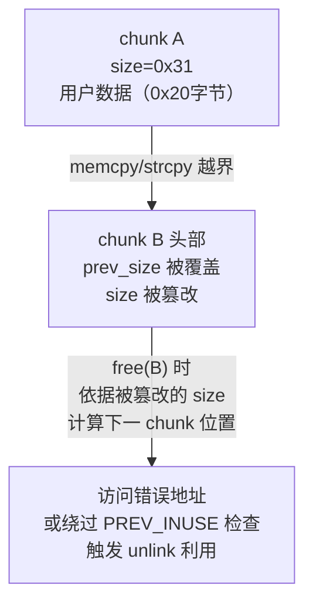
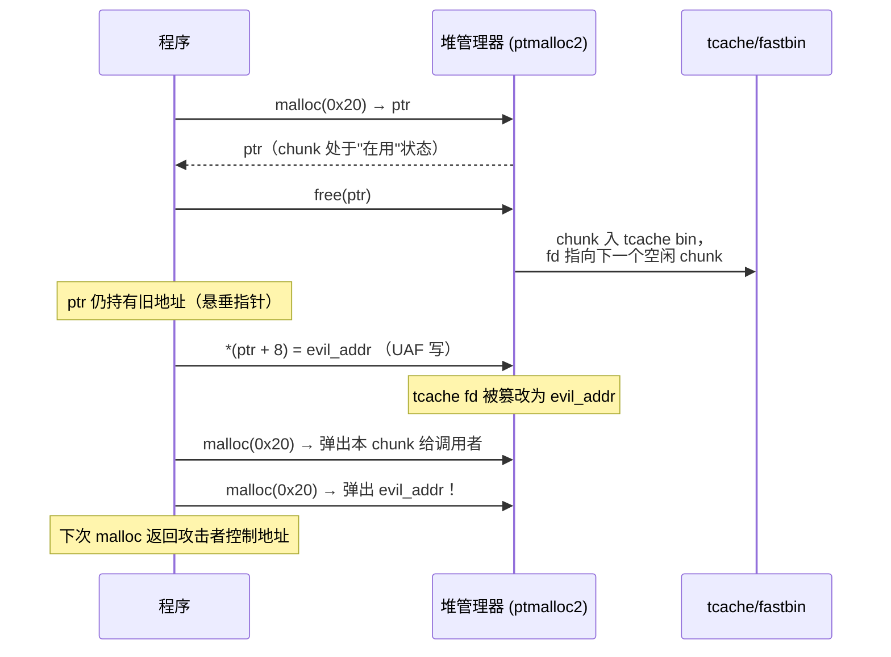
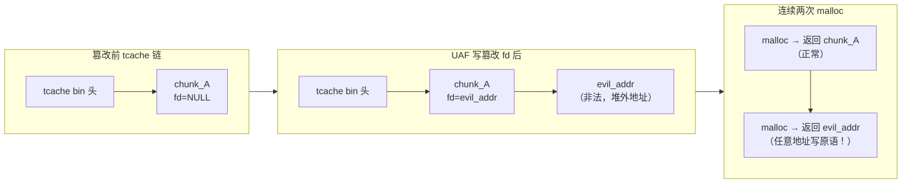

# 二进制漏洞与利用基础（10）· 堆漏洞入门

> [!abstract] TL;DR
> - **堆漏洞**的本质是破坏 ptmalloc2 内部数据结构，使 `malloc` 返回攻击者控制的地址，或触发向任意地址的写操作。
> - 三类基础漏洞：**堆溢出**（越界写相邻 chunk 元数据）、**UAF**（释放后使用悬垂指针）、**double free**（对同一 chunk 调用两次 `free`）。
> - 经典利用概念：**tcache poisoning**（篡改空闲 chunk 的 `fd` 指针 → 下次 `malloc` 返回受控地址）、**fastbin dup**（制造 fastbin 环使 `malloc` 能返回任意地址）——本篇只讲原理，不提供完整 exploit。
> - 现代 glibc（2.26–2.34+）针对每类手法都加入了直接对抗的缓解：tcache key 防 double free、safe-linking 混淆 `fd`、unlink 校验防越界写利用。
> - 防御首选：智能指针/RAII、free 后置 NULL、编译期 ASan/Valgrind、生产开启 Full RELRO + PIE + NX。

---

> [!warning] 教学声明
> 本篇属安全教育 / 防御 / CTF 学习向内容。所有示例均为**最小化教学 demo**，演示"漏洞为什么发生"，**不针对真实软件，不含武器化利用载荷，不提供即用攻击链**。利用"概念"小节仅描述原理级思路。

---

## 概述与定位

上一篇 [[09.堆管理基础]] 详细介绍了 ptmalloc2 的 chunk 结构（`prev_size`/`size`/`fd`/`bk`）、bins 分级（tcache → fastbin → unsorted → small/large）以及 `malloc`/`free` 的内部流程。本篇在此基础上讨论：当这些内部数据结构被破坏时，会发生什么？攻击者如何利用这种破坏？防御方又如何应对？

堆漏洞广泛存在于 C/C++ 程序中，原因在于：

1. **手动内存管理**：程序员负责 `malloc`/`free` 的正确配对，稍有疏失就产生 UAF 或 double free。
2. **边界无硬件保护**：相邻 chunk 共享连续内存，溢出写入相邻 chunk 头部不会立即触发硬件异常。
3. **元数据与用户数据混居**：chunk 头部的 `size`/`fd`/`bk` 就在用户数据旁边，溢出即可篡改。
4. **堆管理器信任元数据**：glibc（2.26 以前尤其明显）对 chunk 字段的校验相对宽松，导致伪造的元数据能控制分配器行为。

---

## 原理与机制

### 3.1 堆溢出（Heap Overflow）

**定义**：写入超过 `malloc` 分配的 chunk 用户区范围，越界数据覆盖相邻 chunk 的元数据（`prev_size`/`size`/`fd`/`bk`）。

#### 内存布局

```
低地址
┌─────────────────────────────────────────┐
│  chunk A（已分配，用户持有 ptr_a）       │
│  prev_size │ size (0x31)                 │
│  ←── 用户数据区（0x20 字节）──────────→  │
│                                          │
├─────────────────────────────────────────┤  ← ptr_a + 0x20
│  chunk B（已分配，用户持有 ptr_b）       │  ← 溢出目标
│  prev_size │ size (0x31)                 │  ← 被覆盖！
│  ←── 用户数据区（0x20 字节）──────────→  │
└─────────────────────────────────────────┘
```



**关键后果**：`size` 字段被篡改后，`free(B)` 时堆管理器用伪造的大小定位"下一个 chunk"，可能指向任意内存；PREV_INUSE 位被清零会触发向前合并，此时若 `prev_size` 也被伪造，`unlink` 操作会操作攻击者指定的地址。

---

### 3.2 UAF（Use-After-Free，释放后使用）

**定义**：`free(ptr)` 之后，程序仍通过 `ptr`（悬垂指针）读写该内存。由于 freed chunk 已回归 bin 管理（`fd`/`bk` 由堆管理器维护），UAF 写入会**直接篡改 bin 的链表指针**。

#### UAF 时间线



**悬垂指针的危险**：C 语言 `free(ptr)` 只把 chunk 还给堆管理器，**不清零指针本身**；后续程序仍能通过 `ptr` 访问该内存，此时写入的数据会被堆管理器当作合法的 bin 元数据处理。

---

### 3.3 Double Free（双重释放）

**定义**：对同一个 chunk 调用两次 `free`，导致该 chunk **同时出现在 bin 链表的两个位置**（或同一链表出现环）。

#### 示意：tcache 中的 double free（glibc 2.28 以前，未加 key 防护）

```
初始状态：tcache[0x30] 为空

free(ptr):   tcache[0x30] →  chunk_A → NULL
free(ptr):   tcache[0x30] →  chunk_A → chunk_A （环！）

malloc(0x30) → 返回 chunk_A，弹出后 tcache[0x30] → chunk_A
               （chunk_A 既被用户持有，又仍在 tcache 链中）
```

**后果**：chunk_A 被分配给用户后，tcache 链表头仍指向 chunk_A。程序对 chunk_A 的写（修改 `fd`）会直接篡改 tcache 链，下次 `malloc` 可返回任意地址。

---

### 3.4 经典利用概念：tcache poisoning

> [!warning] 原理讲解，不提供完整利用代码。以下内容描述"为什么能发生"，不是可直接使用的 exploit 片段。

**前提**：攻击者能在某个已释放的 chunk 上执行 UAF 写（或通过 double free 获得对 chunk 的控制权）。

**核心思路**：

1. 释放 chunk_A，使其进入 tcache 链（`fd` 字段此时由管理器维护）。
2. 通过 UAF 写，把 chunk_A 的 `fd` 改为目标地址 `target_addr`。
3. 连续两次 `malloc(同尺寸)`：
   - 第 1 次弹出 chunk_A（正常 chunk，返回给调用者）。
   - 第 2 次弹出 `target_addr`（堆管理器误认为这是一个合法的空闲 chunk，返回给调用者）。
4. 调用者写入这块"内存"，实际上写入的是 `target_addr` 处——任意地址写原语。



**safe-linking（glibc 2.32+）的对抗**：`fd` 存储时被异或混淆（`fd ^ (chunk_addr >> 12)`），攻击者直接写入 `evil_addr` 取出后会被异或成乱地址——除非同时泄露堆地址，否则无法精确控制目标。

---

### 3.5 经典利用概念：fastbin dup

**前提**：fastbin 不检查 double free（某些 glibc 版本只检查链表头与即将插入的 chunk 是否相同，不遍历整个链表）。

**核心思路**：

1. 分配三个 fastbin 大小的 chunk：A、B、A'（A' 地址同 A）。
2. `free(A)` → fastbin: A → NULL
3. `free(B)` → fastbin: B → A → NULL（绕过 double free 检查：链表头是 B，不是 A）
4. `free(A)` 再次释放 → fastbin: A → B → A → …（环）
5. 连续 `malloc` 三次，第三次返回 A；此时 A 既在用户手中，又是 fastbin 头，写 A 的 `fd` 即控制下次 `malloc` 返回的地址。

> 现代 glibc（2.32+）在 fastbin 的取出路径上也引入了 safe-linking，且 2.29+ 对 tcache 的 double free 已有 `key` 防护，这两个经典手法的可用条件越来越苛刻。

---

### 3.6 与堆管理的衔接

本节漏洞与 [[09.堆管理基础]] 的对应关系：

| 漏洞类型 | 利用的堆结构 | 破坏的字段 |
|---|---|---|
| 堆溢出 | chunk 头部 / unlink 操作 | `size`、`prev_size`、`fd`/`bk`（双向链表） |
| UAF | tcache / fastbin 单链 | `fd`（下一空闲 chunk 指针） |
| double free | tcache / fastbin 单链 | `fd`（制造链表环） |
| tcache poisoning | tcache 单链 | `fd`（指向任意地址） |
| fastbin dup | fastbin 单链 | `fd`（制造链表环） |

堆管理器把被释放的 chunk 的**用户数据区重复利用为管理元数据**（`fd`/`bk` 存在原用户数据的头 8/16 字节），这正是 UAF 和 double free 能控制堆行为的根本原因。

---

## 最小示例（教学 demo）

> [!warning] 教学环境免责声明
> 以下 demo 只用于演示漏洞如何产生，**刻意关闭了现代保护以复现教学现象**，生产环境默认开启这些防护。需在 Linux 环境（glibc 2.26+）中运行，本机 Windows 可用 WSL/虚拟机。

### Demo 1：UAF 悬垂指针

```c
/* uaf_demo.c — 教学 demo，演示 UAF 读/写悬垂指针 */
#include <stdio.h>
#include <stdlib.h>
#include <string.h>

typedef struct {
    char name[16];
    void (*greet)(void);   /* 函数指针 */
} User;

void hello(void) { puts("Hello, I am a User."); }
void evil(void)  { puts("[UAF] function pointer hijacked!"); }

int main(void) {
    User *u = malloc(sizeof(User));
    strncpy(u->name, "Alice", 16);
    u->greet = hello;
    u->greet();           /* 正常调用：输出 "Hello, I am a User." */

    free(u);              /* chunk 进入 tcache */
    /* u 仍持有旧地址 —— 悬垂指针 */

    /* 重新分配同尺寸 chunk（从 tcache 取回同一块内存） */
    char *reuse = malloc(sizeof(User));
    /* 攻击者通过 reuse 指针写入 evil 函数地址 */
    *(void **)(reuse + 16) = (void *)evil;   /* 覆盖 greet 字段 */

    /* 通过悬垂指针调用函数指针 —— UAF */
    u->greet();           /* 输出 "[UAF] function pointer hijacked!" */

    free(reuse);
    return 0;
}
```

```bash
# 教学环境（关闭 ASLR 以便观察，生产不应关闭）
gcc -g -no-pie -o uaf_demo uaf_demo.c
echo 0 | sudo tee /proc/sys/kernel/randomize_va_space   # 教学用，非生产操作
./uaf_demo
```

> [!note] 此 demo 中 `u` 和 `reuse` 指向同一块内存（tcache LIFO 复用），写 `reuse` 等价于修改 `u` 的内部状态，模拟"第三方对空闲 chunk 的写入"→ 悬垂指针调用被劫持的函数指针。

---

### Demo 2：堆溢出覆盖相邻 chunk size 字段

```c
/* heap_overflow_demo.c — 教学 demo，演示溢出覆盖相邻 chunk 元数据 */
#include <stdio.h>
#include <stdlib.h>
#include <string.h>

int main(void) {
    char *a = malloc(0x10);  /* chunk A，用户区 16 字节 */
    char *b = malloc(0x10);  /* chunk B，紧随其后 */

    printf("chunk B header address (示意): %p\n", b - 0x10);
    printf("chunk B size before overflow: 0x%zx\n",
           *(size_t *)(b - 0x10 + 8));   /* 读 size 字段 */

    /* 故意溢出：写 17 字节进 16 字节的 chunk A */
    memcpy(a, "AAAAAAAAAAAAAAAA\x61", 17);  /* 最后一字节覆盖 B.prev_size 低位 */
    /* 若再多写 8 字节，可覆盖 B.size 字段 */

    printf("chunk B size after overflow:  0x%zx\n",
           *(size_t *)(b - 0x10 + 8));

    free(a);
    free(b);
    return 0;
}
```

```bash
# 教学环境（关闭安全编译选项，生产不应这样编译）
gcc -g -no-pie -fno-stack-protector -D_FORTIFY_SOURCE=0 \
    -o heap_overflow_demo heap_overflow_demo.c
./heap_overflow_demo
```

> [!warning] 示例输出为示意
> 以下输出非本机实跑（本机 Windows 环境），地址标"示意"，实际随 ASLR/glibc 版本变化。

```
chunk B header address (示意): 0x555555559030
chunk B size before overflow: 0x21
chunk B size after overflow:  0x61     ← size 被覆盖为更大值
```

> [!warning] 示例输出为示意

---

### Demo 3：Double Free 触发 abort

```c
/* double_free_demo.c — 演示现代 glibc 如何检测 double free */
#include <stdio.h>
#include <stdlib.h>

int main(void) {
    char *p = malloc(0x20);
    free(p);
    /* glibc 2.29+ tcache key 检测：再次 free 同一指针会 abort */
    free(p);   /* ← 触发 "free(): double free detected in tcache 2" */
    return 0;
}
```

```bash
gcc -g -o double_free_demo double_free_demo.c
./double_free_demo
# glibc 2.29+ 输出：
# free(): double free detected in tcache 2
# Aborted (core dumped)
```

> [!warning] 示例输出为示意（实际错误信息随 glibc 版本略有差异）

现代 glibc 的 tcache key 防护让 double free 在检测点立即 `abort`，这正是第 5 节介绍的缓解机制在起作用。

---

## 利用思路（原理层面）

> [!warning] 本节仅描述攻击路径的**概念原理**，不提供完整 exploit 代码，不针对真实软件或 CVE。

### 堆漏洞的通用目标

几乎所有堆利用技术最终目标之一是获得"**任意地址写**"（Arbitrary Write）原语：让 `malloc` 返回一个程序员未预期的地址（如函数指针所在位置、GOT 表项——但需注意 Full RELRO 已将 GOT/PLT 锁只读，详见 [[14.动态链接与加载器详解/15.加载器视角的安全.md]]），使后续写操作落在攻击者选定的位置。

### 利用路径概述

```
漏洞类型          →  破坏目标             →  效果
─────────────────────────────────────────────────────────
堆溢出            →  相邻 chunk size/fd   →  free 触发 unlink 向任意地址写
UAF               →  tcache fd            →  下次 malloc 返回受控地址
double free       →  tcache/fastbin 链表环 →  多次 malloc 可控相同 chunk
tcache poisoning  →  fd 指向目标地址      →  malloc 返回目标地址（任意写）
fastbin dup       →  fastbin 环           →  malloc 返回可控地址
```

### 与 GOT/PLT 的关系

在未开启 Full RELRO 的程序中，`.got.plt` 可写，攻击者若能将 `malloc` 返回地址落在 GOT 表项上，即可改写函数指针（将 `puts@got` 改为 `system` 地址等）。Full RELRO 锁定 `.got.plt` 后，这一路径被封堵——这正是 [[14.动态链接与加载器详解/15.加载器视角的安全.md]] 中 RELRO 防御的意义。现代堆利用往往需要先信息泄露（绕过 ASLR/safe-linking）再寻找其他可写目标（如 `__malloc_hook` 在 glibc 2.33 前、或程序自身的函数指针）。

---

## 缓解与防御

### 5.1 现代 glibc 加固措施

#### tcache key 防 double free（glibc 2.29+）

每个进入 tcache 的 chunk，其 `bk`（或专门的 `key` 字段，视版本）被写入当前线程 tcache 结构的地址。再次 `free` 同一 chunk 时，管理器检查该字段是否非零（且指向当前 tcache 头），若是则判定 double free 并调用 `abort()`。

```
free(ptr):
  1. tcache_entry.key == tcache_perthread → double free，abort()
  2. 否则写入 key，插入 tcache 链
```

**绕过难点**：攻击者需先通过 UAF 清除 key 字段，才能再次 free 而不触发检测。

#### tcache count 限制（glibc 2.26+）

每个 tcache bin 最多 7 个 chunk（`tcache_perthread_struct.counts[]`）。超出后 free 的 chunk 走 fastbin/unsorted 路径，这些路径有更严格的完整性校验。

#### safe-linking 指针异或混淆（glibc 2.32+）

tcache 和 fastbin 的 `fd` 指针存储时被混淆：

```c
/* 伪代码：存储时混淆，取出时还原 */
stored_fd = (chunk_addr >> 12) ^ real_fd;   /* 写入 chunk.fd */
real_fd   = (chunk_addr >> 12) ^ stored_fd; /* 读出时还原 */
```

攻击者若直接写入 `evil_addr` 作为 `fd`，取出后实际地址 = `evil_addr ^ (chunk_addr >> 12)`，偏离预期目标。要精确控制，必须**先泄露堆地址**（知道 `chunk_addr >> 12`）。

#### unlink 校验（classic fix）

`free` 中对 small/large bin 执行 unlink（双链表摘除）时，强制校验双向链表的一致性：

```c
/* unlink 校验（示意）*/
assert(fd->bk == p);   /* fd 的 bk 必须反指 p */
assert(bk->fd == p);   /* bk 的 fd 必须反指 p */
```

伪造 `fd`/`bk` 后，这两个断言会失败，触发 `abort()`。这一校验封堵了经典的"unlink 任意写"技巧（在老版 glibc（<2.3.6）上，伪造 `fd`/`bk` 可在 unlink 时向任意地址写任意值）。

#### chunk size 完整性校验

`free` 时对 size 字段做多项合规性检查：

```
1. chunk size != 0
2. chunk size 不超过已申请的 system_mem（防"膨胀 size"）
3. 本 chunk 末尾位置 + next_chunk.size 与 prev_chunk 的位置一致
4. 对齐检查（MALLOC_ALIGNMENT = 16）
5. fastbin 取出时复查 size 是否匹配该 bin 对应大小
```

堆溢出篡改 `size` 后，若值异常大或违反对齐规则，`free` 时会触发上述任一检查并 `abort()`。

#### `__malloc_hook` / `__free_hook` 弃用（glibc 2.34+）

glibc 2.34 移除了 `__malloc_hook`、`__free_hook`、`__realloc_hook` 这三个全局函数指针，在 2.34 以前它们是堆利用的经典目标（overwrite 后 `malloc`/`free` 就调用攻击者函数）。现代 glibc 已没有这个直接跳板。

### `__malloc_hook` / `__free_hook` 劫持原理（glibc < 2.34）

#### 机制原理

在 glibc 2.33 及以前，glibc 在 `malloc`/`free`/`realloc` 的入口处都有如下检查：

```c
/* glibc malloc.c __libc_malloc 入口（简化示意） */
void *__libc_malloc(size_t bytes) {
    void *(*hook)(size_t, const void *) = atomic_forced_read(__malloc_hook);
    if (__builtin_expect(hook != NULL, 0))
        return (*hook)(bytes, RETURN_ADDRESS(0));  /* 直接调用 hook */
    /* 正常分配逻辑... */
}
```

`__malloc_hook`、`__free_hook`、`__realloc_hook` 是位于 `libc` `.bss`/`.data` 段的全局函数指针，地址固定（libc 基址已知后即可计算）。glibc 设计它们原本是为了方便调试工具（如 mtrace、Electric Fence）注入自定义分配逻辑，但也成了攻击者的利用靶点。

#### 经典利用路径（glibc < 2.34）

一旦攻击者通过任意地址写原语（tcache poisoning / fastbin dup 等）将 `__malloc_hook` 或 `__free_hook` 改写为 `one_gadget` 或 `system` 的地址，下次程序调用 `malloc`/`free` 时即劫持控制流：

```
利用链（概念）：
  UAF/double free → tcache poisoning → malloc 返回 &__malloc_hook
  → 写入 one_gadget 地址（libc 中满足约束条件的 execve gadget）
  → 下次 malloc(n) 调用 → one_gadget → execve("/bin/sh", ...)
```

`one_gadget` 是 libc 中可直接 `execve("/bin/sh", NULL, NULL)` 的单条 gadget，只要寄存器/栈满足特定约束（不同版本、不同 gadget 约束不同）。将 `__malloc_hook` 写为 `one_gadget` 地址，触发 `malloc` 即得 shell。

将 `__free_hook` 写为 `system` 地址时，需确保调用 `free(ptr)` 时 `ptr` 指向含 `/bin/sh\0` 的 chunk（`free` 的第一参数即传给 `system`）：

```c
/* 概念示意（教学） */
char *sh = malloc(8);
strcpy(sh, "/bin/sh");
/* 已通过任意写把 __free_hook 改为 system */
free(sh);   /* → system("/bin/sh") */
```

#### glibc 2.34 移除 hook 后的替代终点

glibc 2.34 彻底删除了这三个 hook 变量，以前以它们为终点的利用链全部失效。现代（glibc 2.34+）堆利用须寻找其他"可写且调用后影响控制流"的目标。主流替代终点如下：

**1. `_IO_list_all` + FSOP（FILE Stream Oriented Programming）**

`_IO_list_all` 是 libc 中维护所有打开 `FILE` 结构链表的全局指针。伪造一个 `_IO_FILE` 结构并将其插入链表后，在 `exit()`、`fflush(NULL)` 或未捕获异常时，glibc 会遍历 `_IO_list_all` 链表并调用每个 `FILE` 的虚表（vtable）中的函数指针，从而劫持控制流。这一手法已独立成篇，详见 `[[18.FSOP与IO_FILE劫持]]`。

**2. `tls_dtor_list` + `__call_tls_dtors`（PTR_MANGLE 保护）**

glibc 的线程局部存储（TLS）支持注册线程退出时的析构函数链 `tls_dtor_list`。`__call_tls_dtors` 在线程退出时遍历此链表依次调用。

关键障碍：glibc 对存入 `tls_dtor_list` 中的函数指针使用 **PTR_MANGLE**（指针混淆）保护：

```c
/* PTR_MANGLE 示意（x86-64，glibc 内部） */
/* 加密存储：  stored = (ptr ROL 17) XOR fs_base_cookie */
/* 解密取用：  real   = (stored XOR fs_base_cookie) ROR 17 */
```

`fs_base_cookie` 是 TLS 段基址偏移处的一个随机值（程序启动时随机生成），存储在 `fs:0x30`。攻击者若要伪造 `tls_dtor_list` 中的函数指针，必须先泄露 `fs_base_cookie` 才能正确混淆写入值——这要求额外的信息泄露步骤（通常需要已能读取 TLS 段内容）。

**3. exit handlers（`__exit_funcs` 链表）**

`exit()` 调用时，glibc 遍历 `__exit_funcs` 链表执行已注册的 `atexit()` 回调。与 `tls_dtor_list` 类似，链表中的函数指针同样经过 PTR_MANGLE 保护。伪造此链表中的条目可在程序正常退出时劫持控制流，但同样需要 `fs_base_cookie` 的泄露。

> [!note] CTF 视角
> 在 glibc 2.34+ 的堆题中，"控制流劫持终点"的选择通常按信息泄露条件决定：能泄露 TLS cookie 时优先考虑 `tls_dtor_list` 或 `exit handlers`；更常见的是转向 FSOP（不依赖 PTR_MANGLE，伪造 `_IO_FILE` 的 vtable 即可），详见 `[[18.FSOP与IO_FILE劫持]]`。

### 堆喷射（Heap Spray）概念

堆喷射是一种**提高利用成功概率**的辅助技术，而非独立漏洞类型。其核心思路是：大量重复分配包含 shellcode（或 NOP sled + payload）的堆块，用这些内容"淹没"（spray）大片堆内存，使目标地址范围内充满攻击者数据，从而降低对精确地址的依赖。

#### 原理：用密度换精度

在 ASLR 不存在或熵较低的环境中（如早期浏览器 JIT 喷射、32 位系统），攻击者无法预知堆的确切布局，但可以分配数千乃至数万个 chunk，每个 chunk 填充相同的 payload，使堆地址空间中的绝大部分都被覆盖。当后续利用步骤将控制流导向一个"大约在堆中"的地址时，大概率命中某个填充了 payload 的 chunk。

```
堆内存（示意）

低地址 ──────────────────────────────────────────── 高地址
| NOP sled + payload | NOP sled + payload | NOP sled + payload | ... |
                    ^              ^
                    任意一个地址都可能命中 payload
```

典型结构：

```
[NOP sled（大量无操作指令）] + [shellcode/payload]
```

NOP sled 的作用是"着陆缓冲"：控制流只要落在 sled 范围内的任何位置，都会顺序滑到 shellcode 执行。sled 越长，容错范围越大。

#### 与占位（Heap Grooming）的区别

堆喷射强调**数量和密度**（大量分配，覆盖尽量多的地址范围）；堆占位（Grooming）则强调**精确布局**——通过有序地分配/释放特定大小的 chunk，让目标 chunk 紧邻或精确落在期望位置。两者常配合使用：先用喷射填充大面积，再用占位精确控制关键 chunk 的前后布局。

#### 现代防护对堆喷射的遏制

| 防护机制 | 对堆喷射的影响 |
|---------|--------------|
| 高熵 ASLR（64 位） | 堆基址 28–30 bit 随机化，覆盖概率从"高"降为"极低" |
| NX/DEP | 堆内存不可执行，shellcode 喷射无法直接运行（须配合 ROP/JOP） |
| 堆地址随机化 | 即使大量喷射，也难预测特定 chunk 的地址 |
| 内存限制（rlimit/cgroups） | 限制进程可分配内存总量，阻止海量喷射 |

现代 64 位 Linux/Windows 环境下，纯堆喷射已很难独立成功。堆喷射更多出现在：
- 浏览器 JIT 喷射（喷射 JIT 编译的可执行内存，而非普通堆）
- 内核漏洞利用（内核 slab/page 喷射）
- 与信息泄露配合（先泄露地址缩小范围，再精确占位）

> [!note] House of 系列
> 多种以堆占位为核心的高级利用技术（House of Force、House of Orange 等）已独立成篇，详见 `[[17.House-of堆利用系列]]`。

### 5.2 应用层最佳实践

#### 使用智能指针 / RAII（C++）

```cpp
#include <memory>

// 推荐：RAII，离开作用域自动释放，无需手动 free，根本杜绝 UAF 和 double free
{
    auto user = std::make_unique<User>("Alice");
    user->greet();
}   // user 在此自动析构，不产生悬垂指针

// 避免：手动管理
User *user = new User("Alice");
delete user;
user->greet();   // UAF！user 已是悬垂指针
```

#### free 后立即置 NULL

```c
free(ptr);
ptr = NULL;   /* 防止悬垂指针被意外解引用 */

/* 之后任何对 ptr 的解引用立即触发 SIGSEGV，而非静默破坏堆结构 */
```

#### 编译期 / 测试期检测

```bash
# AddressSanitizer：检测 UAF、double free、堆溢出（开发/测试阶段）
gcc -g -fsanitize=address -fno-omit-frame-pointer -o prog prog.c

# Valgrind memcheck：检测非法读写、内存泄漏（开销较大，~10–20x）
valgrind --tool=memcheck --leak-check=full ./prog
```

#### 生产编译加固清单

```bash
# Full RELRO + PIE + NX + Canary（基础四件套）
gcc -fPIE -pie \
    -Wl,-z,relro,-z,now \
    -fstack-protector-strong \
    -D_FORTIFY_SOURCE=2 \
    -o prog prog.c

# checksec 验证（在 Linux 环境）
checksec --file=prog
```

> [!note] `-z relro -z now`（Full RELRO）锁定 `.got.plt`，堆利用即使获得任意写也无法改写 GOT 中的函数地址，需另寻可写目标。与 [[14.动态链接与加载器详解/15.加载器视角的安全.md]] 的 RELRO 机制对应。

防护机制详解见 [[34.现代二进制防护机制/00.现代二进制防护机制总览]]（系列 34，尚待建立）。

---

## 检测与工具

### ASan 检测 UAF

```bash
gcc -g -fsanitize=address -fno-omit-frame-pointer -o uaf_asan uaf_demo.c
./uaf_asan
```

> [!warning] 示例输出为示意

```
=================================================================
==12345==ERROR: AddressSanitizer: heap-use-after-free on address 0x603000000020
READ of size 8 at 0x603000000020 thread T0
    #0 0x... in main uaf_demo.c:25
    #1 0x... in __libc_start_main

0x603000000020 is located 16 bytes inside of 32-byte region [0x603000000010,0x603000000030)
freed by thread T0 here:
    #0 0x... in free
    #1 0x... in main uaf_demo.c:20
```

> [!warning] 示例输出为示意

ASan 在 chunk 前后插入**红区（redzone）**，并在 `free` 后将内存标记为"已释放不可访问"——任何读写已释放内存的操作立即报告，精确定位到源码行号。

### GDB + pwndbg：观察堆损坏

> [!warning] 示例输出为示意（非本机实跑，本机 Windows 环境）

```
pwndbg> heap
...
Free chunk (tcache) | PREV_INUSE
Addr: 0x55555555a290   ← 示意地址
fd: 0x7fffffffe000     ← 被 UAF 篡改，fd 指向栈！（正常应指向堆内地址）
```

> [!warning] 示例输出为示意

```
pwndbg> bins
tcachebins
0x30 [1]: 0x55555555a2a0 ◂— 0x7fffffffe000    ← 受控地址出现在链中
```

> [!warning] 示例输出为示意

#### 常用工具命令速查

| 工具 | 命令 | 用途 |
|---|---|---|
| pwndbg | `heap` | 列出 arena 全部 chunk |
| pwndbg | `bins` | 查看各 bin 当前内容 |
| pwndbg | `vis_heap_chunks` | 可视化 chunk 布局 |
| pwndbg | `tcache` | 显示 tcache 所有 bin |
| ASan | `fsanitize=address` | 编译期插桩，运行时检测 UAF/溢出 |
| Valgrind | `--tool=memcheck` | 无需重编译，检测非法读写 |
| checksec | `checksec --file=<bin>` | 检查 NX/RELRO/Canary/PIE 状态 |

---

## 小结

1. **三类基础堆漏洞的本质**均是破坏 ptmalloc2 对 chunk 元数据的信任：堆溢出篡改相邻 chunk 的 `size`/`fd`/`bk`；UAF 通过悬垂指针修改已释放 chunk 的 `fd`；double free 在 bin 链表中制造环。
2. **tcache poisoning 和 fastbin dup** 是在 UAF/double free 基础上的进一步利用——核心都是将 `fd` 指针篡改为受控地址，诱使 `malloc` 返回任意位置。
3. **glibc 的防御是渐进式演化**：每一代加固（tcache key、safe-linking、unlink 校验、hook 弃用）都直接针对已公开的攻击手法，攻防在持续交替进行。
4. **防御最根本的手段**：C++ 智能指针/RAII 从语言层消除 UAF 和 double free；free 后置 NULL 防悬垂指针；ASan/Valgrind 在测试阶段捕获剩余漏洞；生产开启 Full RELRO + PIE + NX 缩小利用面。
5. 本篇是后续 [[11.整数溢出与类型混淆]] 的铺垫：整数溢出常用于制造"请求分配比实际需要小的 chunk"，从而变相触发堆溢出。

---

## 相关阅读

- **堆结构前置知识（chunk / bins / 分配流程）**：[[09.堆管理基础]]
- **加载器视角的安全（RELRO / Full RELRO / GOT 保护）**：[[14.动态链接与加载器详解/15.加载器视角的安全.md]]
- **GOT/PLT 机制（与堆利用的 GOT 改写关系）**：[[11.ELF文件详解/17.got节.md]]
- **下一篇：整数溢出与类型混淆（可变相触发堆溢出）**：[[11.整数溢出与类型混淆]]
- **防护机制全貌**：[[34.现代二进制防护机制/00.现代二进制防护机制总览]]

---

⬅️ 上一篇 [[09.堆管理基础]] ｜ 🏠 [[00.二进制漏洞与利用基础总览]] ｜ 下一篇 [[11.整数溢出与类型混淆]] ➡️
