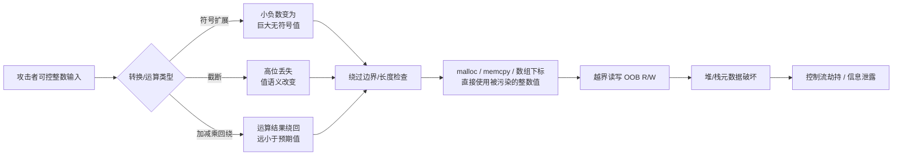
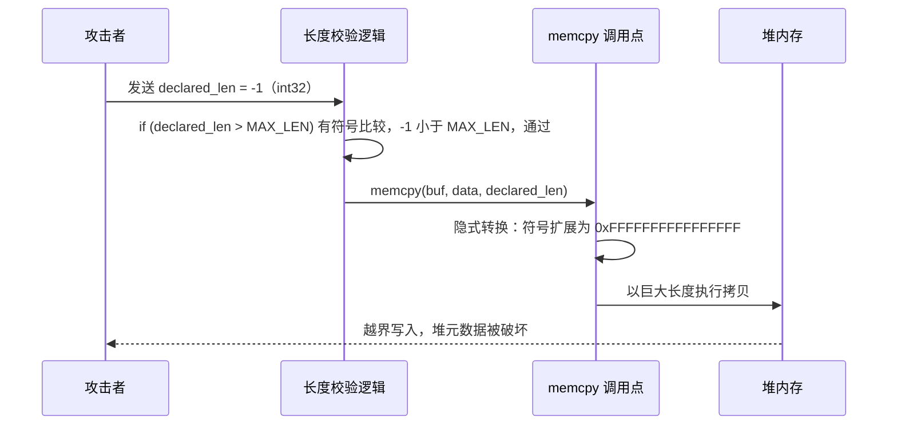
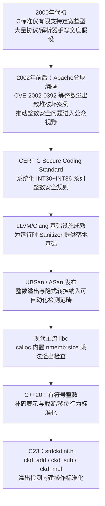

# 二进制漏洞与利用基础（10）· 整数溢出与类型转换缺陷

> [!abstract] TL;DR
> - 整数溢出的本质是定长存储单元上的模运算回绕（wraparound），"是否溢出"取决于同一比特模式被解读为有符号还是无符号——同一次加法在两种语义下可能一个正常、一个越界。
> - C/C++ 的整数提升与"寻常算术转换"规则会在有符号数与无符号数混合运算/比较时，静默地把有符号数转换为无符号数，这是绝大多数边界检查被绕过（signedness confusion）的语言根源。
> - 宽转窄的截断与窄转宽的符号/零扩展是方向相反、同样危险的两类转换缺陷：前者丢失高位信息，后者可能把一个小负数放大成 `size_t` 域上的天文数字。
> - 整数缺陷本身极少直接破坏内存，而是充当"利用原语放大器"——污染 `malloc`/`memcpy` 的长度参数或数组下标，间接触发堆/栈越界读写，是后续利用链的起点而非终点。
> - UBSan/ASan、`-Wsign-compare`/`-Wconversion` 等编译告警、以及配合边界值字典的模糊测试，是目前检测这类缺陷性价比最高的组合；C23 的 `ckd_add` 系列内建操作把"先检查后计算"标准化为语言特性。
> - 反汇编视角下，`movsx`/`movzx`/`cdqe` 等扩展指令与 `jl`/`jb` 等有符号/无符号跳转助记符的混用，是审计代码时定位 signedness confusion 的关键信号。

## 概述与定位

整数溢出与类型转换缺陷是一类和前几章讨论的漏洞形态很不一样的"漏洞"。栈溢出（[[02.栈溢出原理与经典利用]]）、格式化字符串（[[09.格式化字符串漏洞]]）这些漏洞的共同点是，一旦触发，攻击者立刻拿到某种直接的内存读写或控制流劫持能力；而整数溢出/类型转换缺陷绝大多数情况下并不直接破坏内存，它破坏的是一个**数值**——这个数值随后被当作分配大小传给 `malloc`，被当作拷贝长度传给 `memcpy`，被当作下标传给数组索引，或者被当作循环边界控制一次拷贝/清零操作要执行多少轮。换句话说，整数缺陷更像是利用链上的"钥匙"或"信号污染点"，而不是"门"本身——它把一个原本受到检查、看起来被约束在合理范围内的数值，转换成实际上完全失控的巨大值或负值，再由紧随其后的内存操作把这次"数值层面的失控"兑现成真正的越界读写。

这也是它在 CWE 体系里被单独分类的原因：`CWE-190`（整数回绕）、`CWE-191`（整数下溢）、`CWE-192`（整数强制转换错误）、`CWE-194`~`CWE-197`（意外符号扩展、有符号转无符号错误、无符号转有符号错误、数值截断错误）、`CWE-681`（数值类型间的错误转换）等编号描述的都是"数值语义"层面的缺陷，它们通常需要与 `CWE-787`（越界写）、`CWE-125`（越界读）等"后果类"缺陷组合，才构成一条完整的可利用链条。这种"原因-后果"两段式结构，正是本章要讲的内容与本系列前后章节的分野：前面几章讲的多是后果本身（栈溢出即是越界写），本章讲的是后果之前的那次不起眼的数值污染。

正因为整数缺陷本身"看起来无害"，它是所有输入验证类漏洞里最考验审计功力的一种。栈溢出往往能从"这里用了 `strcpy` 且没有长度检查"一眼看出问题；而整数缺陷经常隐藏在一段"看起来做了完整校验"的代码里——校验逻辑确实存在，`if` 语句确实执行了，只是校验用的类型/符号性/宽度与后续实际使用该数值时的类型/符号性/宽度不一致，校验本身在数学上"没有错"，却和它想要防御的操作对不上号。这类缺陷广泛出现在协议解析器、文件格式解析器、驱动与内核 `ioctl`/`setsockopt` 一类系统调用参数校验、以及几乎所有"用户提供长度，程序据此分配/拷贝内存"的场景里，是自本世纪初持续被发现至今的一大类真实世界漏洞的根源，也是本系列从"直接内存破坏"过渡到"堆漏洞"（[[11.堆漏洞类型：UAF与double-free与OOB]]）之前，一个必须补齐的"输入侧"知识点——很多堆漏洞题目乃至真实 CVE，追根溯源第一步往往就是一次不起眼的整数运算。

## 原理与机制

**补码表示与范围。** 现代几乎所有平台都使用二进制补码（two's complement）表示有符号整数：正数的补码等于其原码，负数的补码等于其绝对值原码按位取反再加一。对 n 位存储单元，无符号数的可表示范围是 `[0, 2^n − 1]`，有符号数的可表示范围是 `[−2^(n−1), 2^(n−1) − 1]`——注意这两个范围的元素个数相同（都是 `2^n` 个），只是同一组比特模式被赋予了两套完全不同的数值含义，最高位（符号位）为 1 的比特模式，无符号语义下是一个很大的正数，有符号语义下却是负数。这意味着"溢出"从来不是比特层面的属性，而是**解读方式**的属性：

```
8位补码示例（十六进制/十进制对照）：
  0111 1111  =  0x7F  ->  无符号: 127        有符号: 127   （有符号最大值）
  1000 0000  =  0x80  ->  无符号: 128        有符号: -128  （有符号最小值，符号位翻转）
  1111 1111  =  0xFF  ->  无符号: 255        有符号: -1

加法回绕的例子： 0111 1111 (127) + 0000 0001 (1) = 1000 0000
  -> 按无符号语义读：127 + 1 = 128，结果 128，仍在 8 位无符号范围内，未溢出
  -> 按有符号语义读：127 + 1 理论上应是 128，但 8 位有符号数最大只能到 127，
     实际结果被解读为 -128，发生了回绕（wraparound）
```

同一次加法指令，硬件层面只是做了一次朴素的二进制加法，产生的比特模式完全相同；"溢出没溢出"完全取决于程序后续把这个比特模式当有符号数还是无符号数使用。这正是整数溢出漏洞难以从"数值直觉"上被发现的根本原因——**回绕的本质是所有定长整数运算实际上都是模 `2^n` 意义下的运算**，无符号加减法在 C/C++ 标准里明确定义为模运算语义（回绕是"良定义行为"），而有符号整数的溢出在 C 标准中被划为**未定义行为（UB）**。这个差异看似只是标准措辞上的区别，实际后果很严重：编译器可以合法地假设"有符号溢出永远不会发生"，并据此做激进优化。一个经典陷阱：

```c
/* 程序员意图：检测 x + 1 是否发生了有符号溢出 */
if (x + 1 < x) {
    handle_overflow();
}
```

如果 `x` 是 `int`，编译器在 `-O2`/`-O3` 下可以依据"有符号溢出是 UB、因此不会发生"这一假设，推导出 `x + 1 < x` 恒为假，从而把整个 `if` 分支连同 `handle_overflow()` 调用一起优化删除——程序员精心写下的溢出检查代码，在编译后的二进制里完全消失，这在多个主流编译器的历史版本中都是真实可复现的行为，也是"有符号数比较溢出前后关系"这种直觉写法在生产代码中被明确禁止的原因。相比之下，无符号数的回绕虽然"良定义"，但良定义不等于"符合业务预期"——`unsigned` 减法下溢同样会产生一个远超预期的巨大值，只是这次编译器不会把检查逻辑优化掉，问题依然在运行时真实发生。

**整数提升与寻常算术转换。** C 语言里几乎所有反直觉的符号相关 bug，根源都在这两条转换规则。"整数提升"（Integer Promotions）规定：`char`、`short` 等 rank 低于 `int` 的类型，参与任何运算前一律先提升为 `int`（如果 `int` 能装下原类型的所有值）；"寻常算术转换"（Usual Arithmetic Conversions）规定：当二元运算符两侧类型提升后仍不同，如果一侧有符号、一侧无符号，且无符号操作数的 rank 不小于有符号操作数的 rank，那么**有符号操作数会被转换为无符号类型**。在最常见的 32 位 `int`/`unsigned int` 场景中，二者 rank 相同，规则直接命中：

```c
int x = -1;
unsigned int y = 1;

if (x < y) {
    puts("x < y");
} else {
    puts("x >= y");   /* 实际会打印这一行 */
}
```

`x` 的比特模式全 1，在与 `unsigned int` 比较时被重新解读为 `UINT_MAX`（`0xFFFFFFFF`，即 4294967295），于是 `x < y` 实际比较的是 `4294967295 < 1`，结果为假。这与"负一肯定比一小"的直觉完全相反，却是标准规定的确定性行为。这类混合比较/运算在真实代码里极其常见——尤其是在一侧是 `int` 类型的长度/计数变量、另一侧是 `size_t`/`unsigned` 类型的容量常量或函数返回值时，几乎必然踩中这条规则。

**符号扩展与零扩展。** 窄类型转换为宽类型时，如果源类型有符号，扩展时用符号位填充高位（sign extension）；如果源类型无符号，扩展时用 0 填充高位（zero extension）。x86-64 对应指令为 `movsx`/`movsxd`/`cdqe`（符号扩展）与 `movzx`（零扩展），ARM64 对应 `sxtw`/`sxth`/`sxtb`（符号扩展）与 `uxtw`/`uxth`/`uxtb`（零扩展）。这一步转换是 `int` 型长度参数传入期望 `size_t` 的函数（`malloc`/`memcpy`/`read` 等）时最经典的陷阱来源：一个 32 位 `int` 值 `-1`（比特模式 `0xFFFFFFFF`）符号扩展到 64 位后变成 `0xFFFFFFFFFFFFFFFF`，被无符号重新解读即为 `SIZE_MAX`；而如果错误地做了零扩展，则会变成 `0x00000000FFFFFFFF`（约 4GB），同样是一个远超预期、足以让分配失败或触发巨量拷贝的异常值，只是具体数值不同。**扩展方向选错，或者程序员误以为某个宽度转换是"安全的零填充"而实际编译器按有符号语义做了符号扩展，是本章要反复强调的核心风险点之一。**

**截断。** 反方向的宽转窄，直接丢弃高位比特。无符号数的截断等价于对 `2^n` 取模，是良定义行为；有符号数的截断在 C++20 之前属于实现定义行为（尽管几乎所有主流平台在实践中都采用与无符号截断等价的补码语义），C++20 起正式将有符号整数的表示与截断/移位行为标准化为补码语义，消除了这部分历史上的标准模糊地带。截断常见于协议/文件格式解析：一个字段先按较宽类型完成运算与校验，随后赋值给较窄的字段类型用于存储或跨函数传递，若这一步截断没有被显式检查，宽类型运算阶段"看起来通过"的校验，在窄化后可能对应完全不同的数值。

**平台数据模型差异。** 不同平台上基础类型的宽度并不一致，这直接影响回绕/截断的触发阈值：

```
数据模型对照（常见宽度，单位：bit）
              char  short   int   long  long long  pointer/size_t
LP64  (Linux/macOS x86-64)   8    16     32    64      64            64
LLP64 (Windows x64)          8    16     32    32      64            64
ILP32 (常见 32 位平台)        8    16     32    32      64            32

要点：size_t/指针宽度在 64 位 Linux 上是 64 位，但 int 依旧是 32 位——
"int 溢出"与"size_t/指针溢出"的触发阈值相差 2^32 与 2^64 两个数量级。
一段 int 中间计算即便先行回绕，之后隐式转换进 64 位 size_t 参数时，
也只是把"已经错误的 32 位结果"符号/零扩展到 64 位，而不会在 64 位层面重新得到正确值。
```

这也是为什么"用 `int` 做中间计算、结果最终交给 `size_t` 形参使用"这种写法特别危险：溢出发生在窄类型阶段，而后续代码往往因为参数类型是宽类型而放松了警惕。

下图概括了整数缺陷从"输入"到"内存破坏"的典型传导路径：



## 缺陷分类与利用原语详解

整数缺陷虽然表现形式繁多，但归纳起来只有两条主线的变体：**回绕**（同一运算在不同宽度/符号解读下产生分歧）与**转换**（窄化丢信息、加宽选错填充位）。下面按具体触发场景逐类展开。

### 加减法回绕

最直接的形式：`size` 类计算里存在一次加法，操作数由攻击者影响，结果绕回一个很小的值，从而骗过"总大小不能超过某上限"的检查。例如 `total = header_len + payload_len`，当 `payload_len` 接近 `SIZE_MAX` 时，`total` 会绕回一个很小的数，`if (total > MAX_ALLOWED)` 检查通过，但代码后续仍按未回绕前的语义分别处理 `header_len` 与原始 `payload_len`，导致依据 `total` 分配的缓冲区远小于实际写入量。减法下溢是同一主线的镜像形式，且更隐蔽，因为"减出负数"这件事本身在无符号语境下不会以任何形式报错：

```c
void dump_tail(uint8_t *buf, unsigned int len, unsigned int n) {
    /* 意图：打印 buf 最后 n 个字节 */
    for (unsigned int i = len - n; i < len; i++) {
        putchar(buf[i]);
    }
}
```

当调用者传入 `n > len`（如 `len = 4`、`n = 10`）时，`len - n` 在 `unsigned int` 语境下发生下溢回绕，结果是 `4 − 10 + 2^32 = 4294967290` 而非直觉上的 `-6`。本例中循环条件 `i < len` 首次判断即为假，看似"安全失败"；但只要循环结构稍有不同（条件写反、改成 `do-while`、或起始值被别处逻辑复用），`i` 就会从接近 `UINT_MAX` 的值开始递增，`buf[i]` 几乎必然立即越界，且会持续执行数十亿次直至撞上不可访问页面才崩溃——这种"连接建立后长时间无响应、随后崩溃"的行为模式，是黑盒测试中推测目标内部存在无符号下溢的经验性信号。

### 乘法溢出与分配计算

"元素个数 × 元素大小"是历史上最著名的整数溢出触发点，尤其常见于图像/音视频/压缩格式解析（宽 × 高 × 每像素字节数）与结构化数据的批量分配：

```c
struct record { char tag[16]; uint64_t value; };

size_t n = attacker_controlled_count;
struct record *arr = malloc(n * sizeof(struct record));   /* n * 32，可能回绕 */
for (size_t i = 0; i < n; i++) {
    arr[i].value = compute(i);        /* malloc 实际分配远小于 n*32 字节时，此处越界写 */
}
```

若 `n` 足够大（例如接近 `2^64 / 32`），`n * sizeof(struct record)` 在 `size_t` 宽度下依然会回绕为一个很小的数，`malloc` 按这个小数值分配出一块远小于预期的堆块并成功返回；但循环仍按原始、未回绕的 `n` 执行，从某个 `i` 开始写入位置就已越过实际堆块边界，形成堆越界写。这是整数溢出触发堆破坏的教科书模式，历史上包括 Apache 分块编码处理（`CVE-2002-0392`）在内的多起著名漏洞都属于这一大类"整数运算结果被用作分配依据，而实际写入量另有其账"的模式变体。现代主流 libc 实现（glibc、musl 等）的 `calloc(nmemb, size)` 会在内部对 `nmemb * size` 做乘法溢出检测，溢出时直接返回 `NULL`，因此在"元素个数 × 元素大小"这种天然是乘法关系的分配场景中，应当优先使用 `calloc` 而非手写 `malloc(a * b)`——这是少数可以把安全检查直接下放给库函数、无需自己重新实现的场景。

### 符号混淆（Signedness Confusion）

有符号数被当无符号数解释、或反之，是最典型的"检查用的语义"与"消费该值时的语义"不一致的情形：

```c
int recv_and_copy(char *net_data, int declared_len) {
    char local_buf[512];

    if (declared_len > (int)sizeof(local_buf)) {
        return -1;                                  /* 看似完整的边界检查 */
    }
    memcpy(local_buf, net_data, declared_len);       /* 第三参数隐式转换为 size_t */
    return 0;
}
```

当攻击者把 `declared_len` 构造为负数（如 `-1`），`declared_len > (int)sizeof(local_buf)` 这一**有符号**比较为假（`-1` 小于 `512`），检查被顺利通过；但 `memcpy` 的第三个形参类型是 `size_t`（无符号），调用时 `declared_len` 会先按 `int → size_t` 规则做隐式转换：宽度不同时先符号扩展到 64 位，再整体按无符号重新解读，`-1` 变为 `0xFFFFFFFFFFFFFFFF`，`memcpy` 将尝试拷贝这么多字节。这条链路把"符号扩展"和"边界检查绕过"两个机制串在了一起，是本章讨论的所有模式里现实世界出现频率最高的一种，网络协议解析、文件格式解析、IPC 消息处理中反复出现同一骨架的变体。

### 截断与宽度不一致

数值先按较宽类型完成运算/校验，随后被赋值给较窄类型用于存储或跨接口传递，截断发生在这一步而非运算本身：例如协议里的长度字段在线上是 16 位，内部处理逻辑却用 32/64 位变量做中间计算，如果某处存在"宽类型算完再截断赋值回窄字段"的操作，就可能构造出与真实数据长度不匹配的两套长度语义——一套用于本地校验（截断前，或校验发生在赋值之后但用了另一处未截断的宽变量），一套用于实际拷贝/索引，两者失配后果与符号混淆类似，都是"检查的是一个值，实际用的是另一个值"。这与经典的 TOCTOU（time-of-check-time-of-use）竞争条件不同，是纯数值语义层面的不一致，不涉及多线程时序，因此更容易在单线程程序中稳定复现。

### 索引与边界检查绕过

```c
int get_item(int idx) {
    static char table[256];
    if (idx < 256) {           /* 只约束了上界 */
        return table[idx];     /* idx 为负数时，此处发生越界读 */
    }
    return -1;
}
```

检查只约束了上界 `idx < 256`，遗漏了下界 `idx >= 0`。当 `idx` 传入负数（如 `-100`），检查通过，`table[idx]` 等价于指针运算 `*(table + idx)`，负下标意味着访问 `table` 起始地址之前的内存——若 `table` 是全局/静态数组，读到的是该数据段内声明在其前面的其它变量；若是栈上数组，可能读到栈帧内的返回地址、保存寄存器或金丝雀值；若同样的模式出现在写路径（`table[idx] = value`），就直接构成一个**相对地址任意写**原语，是许多内核提权漏洞（尤其是带用户可控索引参数的 `ioctl`/`setsockopt` 一类接口）里反复出现的根因模式。"检查了上界却漏了下界"（或反过来）比"完全没检查"更隐蔽，因为代码审查时"看到一个 `if`"很容易产生已经做了防护的错觉，这正是本类缺陷考验审计功力的地方。

### 循环计数器回绕

无符号计数器在到达 0 之后继续递减，或计算起始值时发生下溢，都会导致循环边界失控：

```c
while (count--) {
    process(buf[idx++]);
}
```

若 `count` 是无符号类型且调用方传入 `0`，`count--` 的后缀自减会先返回 `0`（循环条件为假，看似正常退出），但 `count` 本身已经变为 `UINT_MAX`；一旦这个已经回绕的 `count` 被其它路径（如递归调用、状态复用）重新读取用作循环判断，就会引发数十亿次循环体执行，实际表现为长时间挂起后崩溃。这类问题的排查关键在于分清"表达式求值顺序"与"变量最终落地的值"——很多程序员只关注了循环条件当次求值是否正确，而忽视了变量本身已经处于一个异常状态、可能被后续代码复用。

### 浮点-整数转换缺陷

"类型转换缺陷"不止发生在整数之间，浮点与整数之间的转换同样受标准约束且同样能被构造成缺陷：

```c
double ratio = compute_ratio();               /* 攻击者可影响其值 */
int32_t count = (int32_t)(ratio * total_items);
char *buf = malloc(count * item_size);
```

若 `ratio` 被构造为异常大的浮点值或 `NaN`/`Inf`，`(int32_t)(...)` 这一浮点到整型的转换，当源值的整数部分超出 `int32_t` 可表示范围时属于未定义行为（`NaN`/`Inf` 转换同样是 UB）。x86 的 `cvttsd2si` 一类指令在源值不可转换时会返回该整型的"不确定值"（实践中常见为该类型的最小负值），于是 `count` 可能变为负数，随后 `count * item_size` 在有符号乘法下同样为负，传给 `malloc`（形参 `size_t`）时再经历一次符号扩展式隐式转换，变为天文数字，大概率导致分配失败；若调用方未检查 `NULL` 直接使用返回指针，则是另一层面的可利用崩溃。这条链路叠加了浮点截断、有符号乘法、隐式转 `size_t` 三次转换，说明类型转换缺陷可以跨越整数与浮点的边界组合出更隐蔽的构造。UBSan 的 `float-cast-overflow` 检测项专门针对此类问题。

### 从利用原语到完整利用链

单独一次整数缺陷很少是利用链的终点。下图以"符号混淆导致 `memcpy` 越界"为例，展示一次典型触发时序：



一旦获得越界写原语，后续走向就与前几章、以及即将展开的堆漏洞章节汇合：可能是破坏相邻 chunk 的元数据引出 [[24.内存管理与堆分配器/17.堆利用手法体系House_of系列|House of 系列]] 手法，也可能是直接命中 [[11.ELF文件详解/17.got节|GOT]] 一类只读性较弱的目标区域。理解这一点，能帮助我们在审计时建立正确的心智模型：**发现一次整数缺陷，不等于发现了一个完整漏洞，还需要继续追踪它污染的数值最终流向了哪个内存操作、该操作的可控范围与可控内容各有多大。**

## 工具视角与实战

整数缺陷的检测工具链是随着编译器基础设施成熟而逐步完善的，理解这条脉络有助于选择合适的工具组合：



### 静态分析与编译期告警

`cppcheck` 在 `--enable=all` 下能检出 `integerOverflow`、`signConversion` 等分类的问题；`clang-tidy` 的 `bugprone-narrowing-conversions`、`cert-*` 规则族（对应 CERT C 编号）能标注可疑的窄化转换；CodeQL 标准查询包中的 `cpp/integer-multiplication-cast-to-long` 精确针对"两个整型相乘之后才转换为宽类型"这种典型的晚 cast 乘法溢出模式；商业工具 Coverity 里著名的 `OVERFLOW_BEFORE_WIDEN` 检查器名字直译即"先溢出后加宽"，对应的正是本文反复强调的这条主线。编译期告警方面，`-Wsign-compare`（有符号无符号比较）、`-Wsign-conversion`（改变符号性的隐式转换）、`-Wconversion`（可能改变值的隐式转换，含窄化）、Clang 独有的 `-Wshorten-64-to-32` 都能在不运行程序的情况下标出可疑代码行。这些告警默认大多不开启，原因是历史遗留代码中窄化/符号转换写法极其普遍，全量打开噪音过大；实践中更现实的策略是在 CI 中对新增/修改的代码增量启用，而不是对整个历史代码库一次性开启。

### 运行时检测：UBSan 与 ASan

UBSan（`-fsanitize=undefined`）细分为多个子选项：`signed-integer-overflow` 检测有符号溢出（UB），`shift-exponent`/`shift-base` 检测移位越界，`implicit-conversion`（需要额外开启，聚合在 `-fsanitize=integer` 里）检测隐式收窄/符号变化，`float-cast-overflow` 检测浮点转整数越界。值得特别注意的是 `unsigned-integer-overflow` **不在默认的 `undefined` 聚合集合里**，需要显式添加——因为无符号运算的回绕在 C 标准中是良定义的模运算语义，并非 UB，UBSan 把它归类为"可选的健全性诊断"而非"检测未定义行为"，这也是理解 UBSan 选项分层设计的关键：不是所有"程序员大概率不想要的行为"都等于"标准意义上的未定义行为"。实战中通常将 UBSan 与 ASan 一起编译（`-fsanitize=address,undefined`），因为整数缺陷的下游后果（越界读写）正是 ASan 最擅长捕获的目标。

### Fuzzing 与边界值探测

整数缺陷相对是"对模糊测试友好"的一类漏洞，因为触发条件往往集中在若干边界值附近：`0`、`1`、`-1`、`INT_MAX`、`INT_MIN`、`UINT_MAX`、`SIZE_MAX` 等应作为 AFL++/libFuzzer 种子字典（`-x` 参数加载）的固定条目，能显著提高命中率；AFL++ 的 `cmplog`/`laf-intel` 一类特性能帮助突破"比较指令针对的是复杂中间计算结果"这类难以被随机字节变异覆盖到的路径。对协议类目标，结构感知（structure-aware）的输入生成比纯随机变异更有效，因为随机字节流很难凑出"长度字段的值恰好等于其它字段特定组合"这种语义相关性，而长度字段正是整数缺陷最常见的触发点。

### 逆向工程视角：反汇编中的整数缺陷线索

对已编译二进制做静态/动态分析时，识别整数缺陷有一套相对固定的检查清单：追踪"长度/大小"类参数从函数入口到危险调用（`malloc`/`memcpy`/数组访问）之间的数据流，重点关注中间是否插入了 `movsx`/`movsxd`/`cdqe`（符号扩展）或 `movzx`（零扩展）——这决定了原始值的符号性假设；观察 `cmp` 之后紧跟的跳转助记符，`jl`/`jle`/`jg`/`jge`/`js` 系列是**有符号**跳转（依据 `SF`/`OF` 标志位组合判断），`jb`/`jbe`/`ja`/`jae`/`jc` 系列是**无符号**跳转（依据 `CF` 标志位判断）——一次比较用了有符号跳转，而该值随后被传给期望无符号语义的函数（如作为 `memcpy` 第三参），就是最典型的 signedness confusion 信号；`imul`/`mul` 之后若编译器针对溢出标志 `OF` 生成了检查跳转（`jo`/`jno`），说明源码里存在有意识的溢出检测，反之则是乘法溢出未被检查的强烈提示。Ghidra/IDA 的反编译输出中，留意"看起来多余"的强制类型转换标注，如 `(int)(long)var`，或 Ghidra P-code 风格的 `SUB84`/`ZEXT48`/`SEXT48`（`SUB` 表示截断取低位，`ZEXT`/`SEXT` 表示零/符号扩展）——它们精确对应源码里的宽度转换点，是快速定位"这里发生了截断/扩展"的高信号锚点。一个简短示例：

```asm
; C 源码等价形式：void *p = malloc((size_t)declared_len);
; declared_len 是 int32_t，已知在寄存器 edi 中（System V AMD64 调用约定第一参数）

test   edi, edi
js     .negative_len       ; 有符号跳转：若 SF=1（即 declared_len<0）则跳转
jmp    .continue

.negative_len:
movsxd rax, edi             ; 关键指令：32->64 位符号扩展
                             ; edi=0xFFFFFFFF(-1) -> rax=0xFFFFFFFFFFFFFFFF
mov    rdi, rax
call   malloc                ; malloc(0xFFFFFFFFFFFFFFFF) 几乎必然返回 NULL

.continue:
```

这段代码展示了一种"看似有检查"的场景：确实用 `test`+`js` 识别了负数输入并跳转到单独分支，但该分支紧接着做的是符号扩展后直接传给 `malloc`，如果本意是"报错退出"却被误写成"继续走相同的分配逻辑"（例如分支缺失 `return`，或两个分支被意外合并），负数长度依然会一路符号扩展进 `malloc` 调用；即便 `malloc` 因请求过大返回 `NULL`，若后续代码未检查 `NULL` 就解引用，则是另一层面的可利用崩溃。这提示我们：**看到了看似合理的符号检查指令，不代表漏洞不存在，还要继续跟踪检查分支具体做了什么。**

### 脚本化利用与 pwntools 技巧

构造触发整数缺陷的 payload 时，理解"字节层面有符号数与无符号数没有区别"至关重要——`p32(0xffffffff)` 生成的四个字节，接收方既可以解读为 `-1` 也可以解读为 `UINT_MAX`，区别只在于接收方的解读方式，构造 payload 时只需要想清楚目标程序会以多宽、什么符号性来解释这几个字节即可，不需要用 Python 大整数做额外的补码换算。黑盒场景下探测长度字段的实际宽度与符号性，标准做法是分别发送 `0x7FFFFFFF`（`int32` 最大值）、`0x80000000`（`int32` 最小负数/`uint32` 分界点）、`0xFFFFFFFF`（`-1` 或 `UINT_MAX`）等几个关键边界值，观察响应差异（拒绝/崩溃/挂起/正常但结果异常）反推服务端内部的处理宽度与符号性：

```python
from pwn import *

io = remote('target', 1337)
payload  = p32(0xFFFFFFFF)        # declared_len = -1（小端）
payload += b'A' * 16              # 实际发送的数据体，远小于"声明"长度
io.send(payload)
io.interactive()
```

这里只发送了 16 字节的实际数据，但长度字段声明为 `0xFFFFFFFF`；若目标程序对该字段做的是有符号比较式的上限检查，随后又把该字段原样传给按无符号解释的拷贝/接收长度参数，就会触发前文讨论过的越界拷贝，或是陷入等待更多数据的挂起状态。"声明长度远大于实际发送数据"这一组合，是黑盒测试中识别 integer overflow 导致挂起型 DoS 的典型特征：连接建立后长时间无响应，往往意味着内部在一个基于回绕后巨大长度的循环里空转或等待。

## 安全性与正确使用

### 语言与标准库层面的防御

GCC/Clang 提供 `__builtin_add_overflow`/`__builtin_sub_overflow`/`__builtin_mul_overflow` 系列内建函数，返回布尔值表示是否发生溢出，且不依赖任何 UB：

```c
int a, b, sum;
if (__builtin_add_overflow(a, b, &sum)) {
    handle_error();     /* 溢出发生，sum 的值是回绕结果，但业务上应视为错误 */
} else {
    /* 安全使用 sum */
}
```

C23 标准新增 `<stdckdint.h>` 头文件，提供 `ckd_add`/`ckd_sub`/`ckd_mul` 类型泛型宏，语义与上述内建函数等价，把此前 GCC/Clang 专有的扩展统一为跨编译器的标准 API，是"整数安全应当是语言一等公民"这一诉求长期推动后的直接成果。作为横向参照，Rust 提供 `checked_add`（返回 `Option`）、`wrapping_add`（显式回绕）、`saturating_add`（饱和于类型边界）、`overflowing_add`（返回值与溢出标志的元组）四种语义择一，且 debug 构建默认对 `+`/`-`/`*` 运算符插入溢出检测并 panic；这种"默认安全、显式选择不安全"的设计哲学与 C "默认危险（UB）、需要程序员主动调用安全 API"形成鲜明对比，也是安全社区近年推动用内存安全语言重写关键解析器的重要论据之一。分配场景中，能用 `calloc(nmemb, size)` 就不要手写 `malloc(a * b)`，前者的乘法溢出检查是"免费"获得的。`-ftrapv`（GCC/Clang 均支持）可以让有符号溢出在运行时直接触发 abort 而非静默回绕，但因需在相关运算后插入检查指令，有实际性能开销，生产环境启用的不多，更多见于安全测试与模糊测试构建。

### 编码规范与检测清单

CERT C Secure Coding Standard 中与本章直接相关的规则包括：`INT30-C`（确保无符号整数运算不发生意外回绕）、`INT31-C`（确保整数转换不丢失或误解数据）、`INT32-C`（确保有符号整数运算不发生溢出）、`INT33-C`（确保除法/取余不发生除零或溢出）、`INT34-C`（不对表达式做负数位移或超出类型宽度的位移）。对应的 CWE 编号体系——`CWE-190`（整数回绕）、`CWE-191`（整数下溢）、`CWE-192`（整数强制转换错误）、`CWE-194`（意外符号扩展）、`CWE-195`/`CWE-196`（有符号转无符号/无符号转有符号错误）、`CWE-197`（数值截断错误）、`CWE-681`（数值类型间错误转换）——基本覆盖了本文讨论的所有模式，审计报告归类时可直接引用。嵌入式/车规领域常用的 MISRA C 也有对应的 "Essential Type Model" 规则族，强制要求算术运算前显式声明类型转换意图，思路与 CERT C 一致，此处不再展开。

### 防御性编程模式

最重要的原则是"先检查后计算"而非"算后检查"：无符号加法场景下，`if (a > SIZE_MAX - b) error(); else sum = a + b;` 是可靠的，因为无符号减法本身良定义，只要 `b <= SIZE_MAX` 该表达式就不会出问题；相对地，"算后检查"写法 `sum = a + b; if (sum < a) error();` 在无符号语境下同样成立（回绕后 `sum` 必然小于任一加数，这是模运算的数学性质保证），但如果误用在有符号语境下就是前文提到的、会被编译器优化掉的危险写法——需要清楚区分两种检查方式各自的可靠性边界，而不是记住一种"万能公式"到处套用。另一个通用技巧是用宽一倍的中间类型承接计算结果再收窄检查：两个 `int32_t` 相乘，中间过程用 `int64_t` 承接，算完检查是否超出 `int32_t` 范围，简单可靠；代价是中间类型本身也可能溢出（两个 `int64_t` 相乘就没有标准整型可以再承接），此时必须依赖 `__builtin_mul_overflow`/`ckd_mul` 或编译器扩展的 `__int128`。命名与类型选择上存在两种流派：一种主张"不应为负"的容量/长度/索引语义统一用 `size_t`/无符号类型，代价是引入减法下溢这一新坑；另一种（历史上部分风格指南持此立场）反而不鼓励滥用 `unsigned` 表示数量，理由是下溢比"值域异常但形式上仍是正常整数"更难在代码审查中被发现。两种流派各有取舍，关键是在项目内统一约定并配合静态检查强制执行，而非在同一代码库里混用。

> [!caution]
> 本文所述整数溢出与类型转换缺陷的识别、检测与利用原理，仅用于自有环境、经授权的渗透测试、CTF 靶场与安全研究场景下的学习与防御验证；文中全部代码片段均为最小化原理演示，不构成针对任何真实生产系统或他人系统的可直接使用的利用步骤，也不为绕过任何商业授权提供武器化方法。将上述技术用于未经授权的系统属于违法行为，请严格遵守所在地法律法规与目标系统的授权范围。本篇的落脚点始终是"如何识别、检测与修复"这类缺陷，而非"如何针对特定目标构造攻击"。

## 小结

整数溢出与类型转换缺陷的本质，是"有限表示范围"与"语言转换规则"共同作用下产生的语义陷阱：它本身很少直接构成内存破坏，而是给后续的内存操作——分配大小、拷贝长度、数组下标、循环边界——喂入了一个偏离程序员意图的数值，是许多真实漏洞链条的第一环而非终点。所有具体表现形式（加减法回绕、乘法溢出、符号混淆、截断、下标越界、循环计数器回绕、浮点转换缺陷）归根结底都是"回绕"与"转换"这两条主线在不同场景下的变体，理解了补码表示、整数提升规则、符号/零扩展的差异，就掌握了识别所有变体的通用钥匙。检测手段构成一个互补矩阵：静态分析与编译告警负责标出"看得见的可疑代码模式"，UBSan/ASan 负责"运行时抓现行"，模糊测试配合边界值字典负责"撞出未曾设想的组合"，人工审计——尤其是对反汇编层面符号/无符号跳转指令与扩展指令的敏感度——负责补齐前三者覆盖不到的业务语义盲区。防御路线可以并行推进：语言与库层面用 `ckd_add` 一类内建操作把"检查"变成不容易被遗忘的语言特性，规范与流程层面用 CERT C/CWE 体系统一团队对"哪些转换是危险的"的认知并纳入代码评审清单。下一章将转向另一大类根因不同、但同样以"看似正常的操作序列"悄然破坏内存状态的缺陷——堆上的悬垂指针与重复释放。

## 相关阅读

- [[00.二进制漏洞与利用基础总览]] —— 系列总览与利用链全景
- [[02.栈溢出原理与经典利用]] —— 直接内存破坏类漏洞的对照参照
- [[09.格式化字符串漏洞]] —— 另一类隐藏在"看似正常"调用里的输入验证缺陷
- [[11.堆漏洞类型：UAF与double-free与OOB]] —— 整数溢出常作为触发堆越界写的前置条件，衔接系列 24
- [[34.现代二进制防护机制/00.现代二进制防护机制总览]] —— ASan/UBSan 等运行时防护与整数缺陷检测的关系
- [[24.内存管理与堆分配器/06.ptmalloc2的chunk结构]] —— 整数溢出导致的堆越界写如何破坏 chunk 元数据
- [[24.内存管理与堆分配器/08.tcache机制]]
- [[24.内存管理与堆分配器/17.堆利用手法体系House_of系列]] —— 越界写原语落地后的经典后续手法
- [[11.ELF文件详解/17.got节]] —— 溢出获得的写原语常见落点之一
- [[22.调用规约/06.SystemV_AMD64调用规约]] —— 理解参数在寄存器间传递时符号/零扩展发生的位置
- [[52.Linux内核机制与内核利用/00.Linux内核机制与内核利用总览]] —— 内核态整数溢出提权案例的延伸阅读
- 延伸参考（书目/规范）：CERT C Secure Coding Standard（INT30-C ~ INT36-C）；ISO/IEC 9899（C11/C17/C23 标准，含 C23 `stdckdint.h`）；ISO/IEC 14882（C++20 有符号整数表示标准化）；CWE-190/191/192/194/195/196/197/681

[[00.二进制漏洞与利用基础总览|⬆ 系列总览]] | [[09.格式化字符串漏洞|← 上一章]] | [[11.堆漏洞类型：UAF与double-free与OOB|→ 下一章]]
