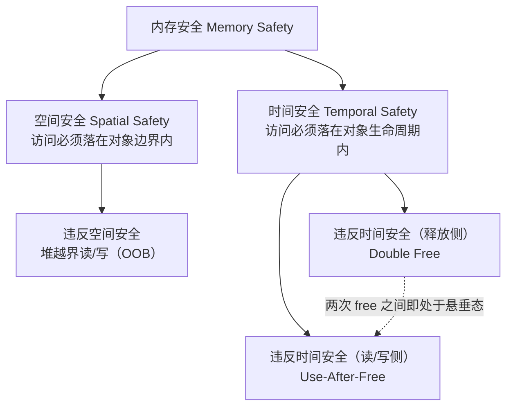
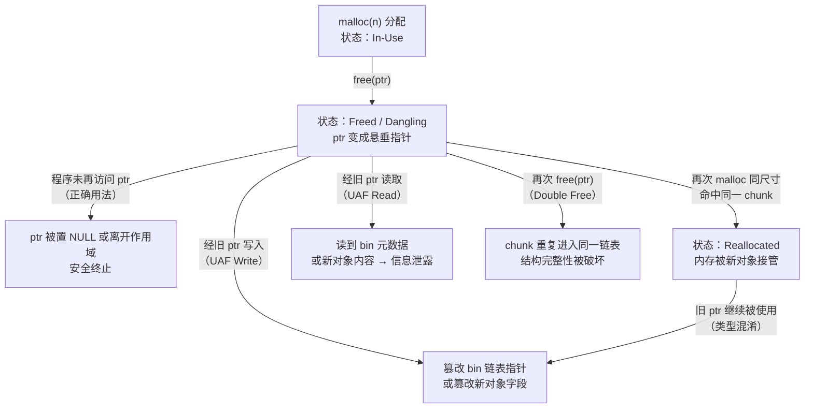
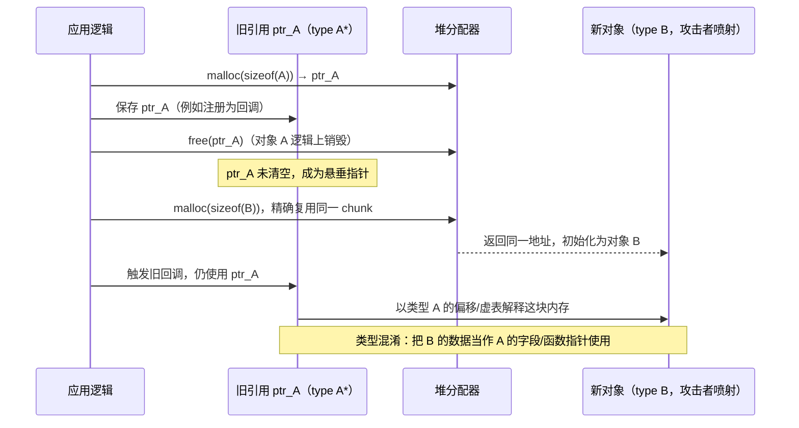
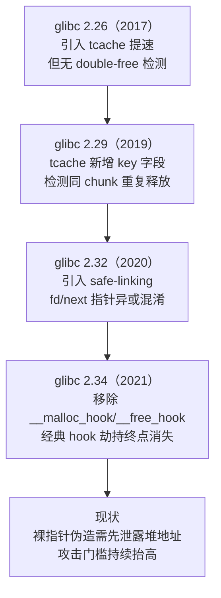
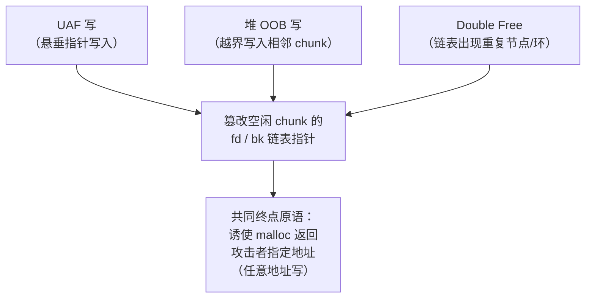

# 二进制漏洞与利用基础（11）· 堆漏洞类型：UAF与double-free与OOB

> [!abstract] TL;DR
> - 三类堆漏洞的本质都是"打破分配器对元数据完整性的信任假设"：UAF 是**时间维度**越界（对象生命周期结束后仍被访问），OOB 是**空间维度**越界（访问越过分配边界），double free 则是对同一块内存的所有权发生撞车——三者常组合出现、可相互转化为同一种利用原语。
> - UAF 的核心是**悬垂指针**：`free()` 只是把内存的所有权归还给分配器，既不清空指针变量本身，通常也不清空内存内容，语言运行时无法区分"合法指针"与"僵尸指针"，这是 C/C++ 手动内存管理模型的根本性缺陷。
> - double free 可以理解为 **UAF 的一个退化子集**——两次 `free(p)` 之间那块内存已经处于悬垂态，第二次 `free(p)` 本质上是对悬垂指针的一次特殊"使用"（use），因此本篇不把它当作与 UAF 并列的独立机制，而是同一问题在释放语义上的特例。
> - 堆 OOB 分读、写两个方向：OOB Write 篡改相邻 chunk 的元数据或数据是几乎所有堆利用链的起点；OOB Read 是绕过 ASLR/safe-linking 的信息泄露利器；off-by-one、off-by-null 是最容易被忽视也最经典的边界条件变体。
> - 现代 glibc（tcache key、safe-linking、size 完整性校验）与语言层方案（C++ RAII/智能指针、Rust 所有权模型）分别代表"运行时检测"与"编译期消除"两条防御路线；理解检测点具体卡在哪一步，就理解了对应的绕过条件是什么。
> - 本篇是 [[24.内存管理与堆分配器/17.堆利用手法体系House_of系列|House of 系列]] 等高阶利用手法的地基原语——不吃透 UAF/double free/OOB 这三种"写入能力从哪来"，后续 tcache poisoning、unlink attack 都只是死记硬背的口诀。

## 概述与定位

本篇上承 [[10.整数溢出与类型转换缺陷]]：整数溢出、符号扩展错误、类型转换截断经常是堆 OOB 的**根因**之一——用一个被错误计算的 `size_t` 去 `malloc`，分配到的 chunk 比业务逻辑预期的小，后续按"预期大小"写入就自然越界。本篇下启 [[12.SROP信号帧伪造]] 等一系列建立在"已经拿到某种内存破坏原语"之上的控制流劫持技术。

在系列结构上需要先划清边界：ptmalloc2 的 `malloc_chunk` 字节布局、`size` 字段标志位、bins 分级体系（tcache/fastbin/unsorted/small/large）、`malloc`/`free` 内部决策流程，这些**机制性**内容已经在 [[24.内存管理与堆分配器/06.ptmalloc2的chunk结构|系列 24 第 06 篇]]、[[24.内存管理与堆分配器/07.ptmalloc2的bins与空闲管理|第 07 篇]]、[[24.内存管理与堆分配器/08.tcache机制|第 08 篇]] 里系统讲过，本篇不重复推导。以这些结构为基础、进一步组合出的系统化利用手法体系（House of Force/Orange/Spirit/Einherjar、largebin attack、unlink attack 等）也已独立成篇，见 [[24.内存管理与堆分配器/17.堆利用手法体系House_of系列|系列 24 第 17 篇]]。本篇要回答的是介于两者之间的问题：**三类堆漏洞本身是什么、为什么会产生、在源码和二进制层面长什么样、有哪些变体、如何被识别与防御**——它们是从"程序员的一个疏忽"到"分配器内部结构被系统性操控"之间的第一级火箭。

为什么把 UAF、double free、OOB 放在同一篇讲，而不是各开一篇：三者是"内存安全"（memory safety）问题在堆场景下的三种具体表现形式，分属**时间安全**（temporal safety，UAF/double free）与**空间安全**（spatial safety，OOB）两大类，并且在真实利用链中经常协同出现、相互转化——下文"三类漏洞的相互转化关系"一节会展开这种转化关系，这正是理解现代堆利用"殊途同归"的关键。

这三类漏洞的现实重要性也值得强调：Google Project Zero、Microsoft MSRC、Chromium 安全团队多次公开的统计口径都指向同一个结论——各自产品线中**约六至七成的高危安全漏洞属于内存安全问题**，其中 UAF 长期占大类的三分之一左右。这不是历史遗留问题，而是每年仍在持续新增的现实攻击面，也正是 Chrome 推 MiraclePtr、Android/ChromeOS 大规模转向 Rust 重写关键组件、ARM 推 MTE 硬件标签的直接动因。对 CTF pwn 方向而言，这三类漏洞更是"堆题"分类下的第一道门槛：几乎所有 add/edit/show/delete 菜单式题目，第一步都是从题目逻辑中挑出这三类漏洞里的至少一种，之后才谈得上 tcache poisoning 或更复杂的 House of 手法。

## 原理与机制

### 内存安全的时间与空间两个维度

理解这三类漏洞最省力的框架，是先把"内存安全"拆成两条独立的不变量（invariant）：

- **空间安全**：一次访问必须落在对象被分配的 `[ptr, ptr + size)` 范围内。违反它就是 OOB（越界读/写）。
- **时间安全**：一次访问必须发生在对象生命周期"已分配、未释放"的区间内。违反它就是 UAF（在释放之后访问）；double free 则是在释放语义本身上违反了"每次分配至多被释放一次"这条更细的时间不变量。



之所以要先讲这个框架，是因为它能立刻解释一个初学者常见的困惑："double free 为什么和 UAF 放在一起讲、而不是和 OOB 放一起？"——因为 double free 与 UAF 共享同一个根源：**一段本该被当作"已死"的内存，被程序当作"仍然合法"来操作**。OOB 则完全是另一个维度的问题：即便所有指针都严格遵守生命周期，只要写入范围算错，照样出事。

### UAF（Use-After-Free）深度机制

**`free()` 的真实语义**：`free(ptr)` 做的事情只是"归还所有权"——把这块内存标记为空闲，按大小插入 tcache/fastbin/unsorted bin 等相应链表（细节见 [[24.内存管理与堆分配器/08.tcache机制|tcache 机制]]）。它**不会**清空 `ptr` 这个指针变量本身（`ptr` 依然是一个语法上合法、指向某个虚拟地址的值），也**通常不会**清空内存内容（除非之后该 chunk 被重新分配并显式 `memset`/`calloc`）。C 语言标准把 `free` 之后再使用该指针定义为未定义行为（undefined behavior），但"未定义"不等于"立刻崩溃"——绝大多数情况下这块内存原样存在，读写都会"成功"，只是语义已经不再属于原来的对象。这正是 UAF 危险的根源：它不产生任何硬件级异常信号，程序会带着一个逻辑错误静默地继续跑下去。

这里要澄清一个常被混淆的概念：**悬垂指针（dangling pointer）不是野指针（wild pointer）**。野指针是从未被正确初始化、指向未知随机地址的指针；悬垂指针则是曾经合法、指向一个真实存在过的对象，但对象的生命周期已经终结。两者对开发者造成的心理陷阱完全不同——野指针的错误通常在第一次使用时就会暴露（地址随机、大概率立即崩溃），悬垂指针却像一颗定时炸弹：只要没人动过这块内存，程序看起来完全正常，直到某次分配恰好复用了同一地址。

UAF 按访问方向和后果可以归纳为三种子类型：

**a）Write-after-free（写后再用）**：通过悬垂指针写入数据。如果该内存尚未被复用，等价于直接篡改分配器的内部链表指针（`fd`/`bk`，参见 [[24.内存管理与堆分配器/06.ptmalloc2的chunk结构|chunk 结构]]）——这是 tcache poisoning 一类手法的入口。如果该内存已被复用为其他对象，则等价于篡改了那个新对象的字段——这是下面要讲的"类型混淆"场景。

**b）Read-after-free（读后再用）**：通过悬垂指针读取数据。如果内存尚未复用，读到的是分配器写入的 bin 元数据（比如 `fd`/`bk` 指针值），这正是经典 CTF 套路里"泄露 libc 基址"的常见入口之一——`free` 一个进入 unsorted bin 的 chunk 而不清空原指针，随后通过该指针把 `fd`/`bk`（此时指向 `main_arena` 内部）读出来，即可反推 libc 加载基址。如果内存已被复用为其他对象，读到的就是该对象的真实数据，构成越权信息泄露。

**c）类型混淆（Type Confusion via UAF）**：这是浏览器一类大型 C++ 项目里最常见、也是危害最大的 UAF 高级形态。对象 A 被释放后，如果攻击者能够精确控制随后的堆分配序列（俗称"堆风水"/heap grooming），用一个**大小相同但类型不同**的对象 B 去占据同一块内存槽位；此后代码继续通过旧引用以类型 A 的字段布局或虚表（vtable）去解释这块内存，实际读到的却是类型 B 的数据——如果 A 的某个偏移原本是虚函数指针，而 B 在同一偏移处恰好放着攻击者可控的数据，调用虚函数就等价于直接跳转到攻击者指定地址。这本质上是"类型系统被内存复用击穿"：C++ 的类型安全建立在"这块内存的类型不会变"这个假设上，而堆分配器完全不知道、也不关心"类型"这个概念，它只关心字节和大小。



下面用一条时序图展示"类型混淆"发生的完整时间线，这也是理解浏览器 UAF 类漏洞报告时最常见的叙事结构：



多线程场景下 UAF 还有一种**竞态变体**：线程 A 正在使用某对象的同时，线程 B 并发地将其释放，两者之间没有恰当的同步（锁/引用计数），窗口期内任一方都可能踩中一次"半有效"的内存状态。这类问题本质上是"释放时机"与"使用时机"之间缺乏互斥，属于竞态类漏洞在堆上的特殊表现，内核态的对应场景（并发系统调用竞争同一对象的引用计数）在 [[52.Linux内核机制与内核利用/00.Linux内核机制与内核利用总览|内核利用总览]] 及其 UAF/竞态专篇中有更系统的讨论，本篇不展开内核锁语义细节。

### Double Free（双重释放）深度机制

沿用上一节的"自我 UAF"视角来定义会更准确：对同一块内存调用两次 `free`，第二次调用发生时，这块内存**已经处于悬垂态**——所以 double free 不是一种与 UAF 平级的独立机制，而是"对悬垂指针执行的操作恰好是 `free` 本身"这种特殊情况。它之所以值得单独讨论，是因为后果和检测方式与普通的读写型 UAF 有明显差异。

需要区分两种触发路径：**直接 double free**（同一个指针变量被连续 `free` 两次，常见于异常处理路径 `goto fail` 却忘记之前已经清理过、或者信号处理函数与主逻辑各自释放同一资源）；**间接/别名 double free**（两个不同名字的指针 `p`、`q` 实际指向同一块内存，分别在不同代码路径被 `free(p)` 与 `free(q)`）。后者在代码审计中远比前者难发现，因为审计者看不到"同一个变量被 free 两次"这种直观模式，必须先做指针别名分析（alias analysis）才能意识到 `p` 和 `q` 其实是同一个对象——这类问题常见于错误的资源所有权设计（谁该负责释放没有明确约定）、多重继承/组合结构中子对象指针泄漏给外部持有、以及多线程下同一对象被两个"owner"各自当作独占资源清理。

double free 的后果是让**同一 chunk 同时出现在同一个 bin 链表的两个节点位置**，或者说链表出现了环：


这本身还不是一个可利用的原语，但它破坏了 bin 链表"每个物理 chunk 只对应一个链表节点"这一隐含假设——一旦分配器把这个 chunk 分配出去，用户对它的写入会同时"污染"链表中的另一份引用（因为两者是同一块物理内存），后续的空闲 chunk 被"弹出"两次，为进一步的 fastbin dup / tcache dup 攻击铺平了道路；具体如何把这个链表异常状态转化为任意地址写原语，属于系统化手法层面的内容，见 [[24.内存管理与堆分配器/17.堆利用手法体系House_of系列|House of 系列]]，本篇只讲清"重复插入使链表结构失去唯一性"这个原语本身。

double free 的检测历史很能说明"性能优化引入新攻击面，随后逐步补课"这一演进规律：fastbin 长期以来只做一个很弱的检测——若待插入的 chunk 恰好等于链表**当前头部**，直接判定 double free 并 `abort`；但只要中间插入一次对另一个不同 chunk 的 `free`，链表头部就会变化，再次 `free` 最初的 chunk 就绕过了这个"仅查头部"的检测（这正是 fastbin dup 需要"三明治"式 free 顺序的原因）。更值得注意的是，glibc 2.26（2017）引入 tcache 之初，tcache 路径**完全没有任何 double free 检测**——这在当时相当于比原有的 fastbin 检测还倒退了一步；直至 glibc 2.29（2019）才补上基于 `key` 字段的检测（`free` 时把 chunk 的 `key` 设为指向当前线程 `tcache_perthread_struct` 的地址，再次 `free` 同一 chunk 时若 `key` 命中当前 tcache 头即判定 double free）。这段历史很好地体现了"新特性先追求性能，攻击面被公开利用后才补齐防护"的现实节奏——下图按时间顺序汇总这条加固演进链，也是第五节讨论现代 glibc 缓解措施时的背景：



这条时间线也说明了一个反直觉的现实：**tcache 从诞生到拥有基本的 double free 防护，中间有将近两年的窗口期**——性能特性往往先于安全特性上线，这不是 glibc 独有的现象，而是几乎所有追求高性能的系统软件在"新增一层缓存/快速路径"时的共性代价：快速路径为了省掉锁和校验开销而变得更薄，也就更容易被绕过，这也是本篇后文强调"三类漏洞相互转化"的现实背景之一。

### 堆 OOB（越界读写）深度机制

堆 OOB 泛指一次内存访问越过了 `malloc` 返回块的合法范围 `[ptr, ptr + size)`。按方向可以分为写和读：

**OOB Write（越界写）**的典型成因与变体：

- **经典连续溢出**：`memcpy`/`strcpy`/`sprintf` 等函数在没有边界检查的情况下，把长度超过目标缓冲区的数据写入堆块，直接覆盖紧邻的下一个 chunk 的 `prev_size`/`size`/`fd`/`bk` 字段。这是堆利用里最"原始"也最常见的入口。
- **off-by-one**：仅越界写入 1 个字节，通常源于循环边界写成 `i <= len` 而不是 `i < len`，或者字符串长度计算漏算了终止符所占的一位。虽然只多写 1 字节，但如果这一字节恰好落在下一 chunk 的 `size` 字段最低位，依然可以篡改该字段的部分数值或标志位。
- **off-by-null**：off-by-one 的一种特殊形式——越界写入的那一字节恰好是 `\x00`（常见于字符串拼接后补 `'\0'` 终止符时少算了一位，例如申请了恰好 `len` 字节的缓冲区却在 `buf[len]` 处写终止符）。由于 x86-64 是小端序，`size` 字段的最低字节正好对应 `PREV_INUSE` 等标志位所在的那一段；被清零的这一个字节可能同时清除 `PREV_INUSE` 标志、又砍掉 `size` 数值的低位，让下一个 chunk"看起来"以为自己的前驱是空闲的、且大小被错误计算——这是构造 chunk overlap（两个逻辑 chunk 共享同一段物理内存）的经典起点，具体如何利用见 House of 系列（如 House of Einherjar），本篇只说明这个写入原语本身为什么危险，不展开完整的重叠构造过程。
- **有符号/无符号混淆导致的负索引**：数组下标被当作有符号数处理、又缺乏下界检查，攻击者传入负值即可让索引"越过左边界"，等价于对分配块之前的内存进行越界写——这与 [[10.整数溢出与类型转换缺陷|上一章]] 讨论的符号扩展、截断问题是同一个根因在堆场景下的具体表现，此处不重复展开符号位机制本身。
- **`realloc` 相关**：`realloc(ptr, new_size)` 缩小时可能原地不搬迁，只是逻辑上砍掉尾部——如果代码后续仍按旧的长度去写这块内存，尾部数据在语义上已"越界"（虽然物理内存还在原 chunk 范围内，但已超出新对象的合法长度）；`realloc` 扩大且原地空间不足时会分配新块并释放旧块，如果程序里还保留了指向旧块的其他别名指针并继续使用，就是 `realloc` 诱发的一种常见 UAF 变体。

**OOB Read（越界读）**的典型用途：

- **越界读取相邻 chunk 内容用于信息泄露**：这是绕过 ASLR 最直接的手段之一——如果能读到某个空闲 chunk 的 `fd`/`bk`（进入 unsorted bin 后其值指向 `main_arena` 内部，属于 libc 地址空间），或读到某个已分配 chunk 里存放的堆/栈/代码段指针，就能反推出对应模块的加载基址。值得注意的是这个场景经常与 UAF Read **协同出现**（见上一节），二者在"读到不该读到的分配器/对象内部数据"这一效果上是等价的，只是越界方式不同：一个是空间维度多读了相邻内存，一个是时间维度读了已注销对象的残留内容。
- **越界读导致的越权信息**：如果相邻内存放着权限标志位、cookie、认证令牌等敏感字段，越界读同样可以直接窃取这些数据，不需要控制流劫持就能造成实质危害——这也是为什么很多安全评估把"任意读"和"任意写"分开评级，前者往往是后者的前置步骤。

值得和栈溢出（本系列 [[02.栈溢出原理与经典利用|第 02 章]]）做一个横向对比：栈上至少还有 canary 这种硬件无关但编译器插入的"卫兵"机制，一旦溢出覆盖到返回地址前会先撞上 canary 触发检测；堆上默认**没有等价物**——chunk 头部与用户数据处于同一片可读写内存，分配器本身不会在每次访问时做任何边界检查（那是运行时性能开销无法承受的），这正是"元数据与数据混居"这一设计选择付出的代价，也是 ASan 软件红区（redzone）、ARM MTE 硬件内存标签等补救方案存在的直接动机（详见下文"工具视角与实战""安全性与正确使用"两节）。

### 三类漏洞的相互转化关系

前面三节分别定义了 UAF、double free、OOB，但真正理解现代堆利用"殊途同归"的关键在于看清它们如何**汇聚到同一个终点**：



- UAF 写可以在悬垂指针指向的、已被复用的 chunk 上实现和 OOB 写完全等价的效果——因为攻击者实际上是在写一块"逻辑上不再属于自己"的内存，只是越界的维度是时间而不是空间。
- OOB 写可以直接篡改相邻空闲 chunk 的 `fd` 字段，达到和 UAF 写相同的"控制下一次 `malloc` 返回值"的效果——这说明 tcache poisoning 这种手法，入口既可以是 UAF，也可以是 OOB，二者在"篡改 `fd` 指针"这个动作上是同一个技术终点，只是最初的漏洞类型不同。
- double free 可以看作三者里"入场门槛最低"的一种：它不需要额外的越界读写能力，只需要一处代码逻辑错误（多调用了一次本该只调用一次的 `free`），就能达到和前两者相似的链表结构破坏效果。

这也是为什么本篇要把三者放在一起、并强调它们的相互转化关系，而不是孤立地各自讲解——CTF 或真实漏洞分析里，"这个漏洞到底是 UAF 还是 OOB"有时并不是非黑即白的判断题，很多题目会把一个 UAF 和一个 OOB 组合起来使用（比如用 UAF 拿到堆地址泄露，再用 OOB 完成精确的 `fd` 篡改）。

## 堆漏洞机制与利用原语详解

### 从源码模式到漏洞：常见诱发代码模式对照

下面六段最小化教学代码分别对应六类真实项目中反复出现的反模式，均为演示"为什么错"，不构成可直接使用的利用代码。

**模式一：回调/事件处理器持有悬垂指针**（简化版浏览器式 UAF 模式）：

```c
typedef struct { void (*on_event)(void *ctx); void *ctx; } Handler;
Handler *g_handler;

void cleanup(Handler *h) {
    free(h);
    /* 忘记：g_handler = NULL; */
}

void dispatch_event(void) {
    if (g_handler)
        g_handler->on_event(g_handler->ctx);  /* UAF：调用已释放内存中的函数指针 */
}
```

这类模式的共性是"注册"和"注销"发生在代码的不同位置、甚至不同模块，注销时只清理了对象本身，忘了清理所有指向它的外部引用——大型项目里一个对象常常被多处持有引用（观察者模式、事件总线、缓存），只要漏掉一处清理就会留下悬垂指针，这也是为什么浏览器引擎的 UAF 修复补丁绝大多数是"在某个原本没有的位置补一行置空"。

**模式二：异常/错误路径重复释放**：

```c
int process(char *input) {
    char *buf = malloc(256);
    if (!buf) return -1;
    if (validate(input) < 0) {
        free(buf);
        goto fail;          /* validate 失败路径已经 free 过一次 */
    }
    ...
fail:
    free(buf);               /* double free */
    return -1;
}
```

`goto` 式的统一清理是 C 语言里管理多资源释放的常见写法，但一旦某条分支在跳转前已经手动释放过，统一清理段就会造成 double free——这是**间接触发**的一种，代码里并没有连续两行 `free(buf)`，需要跨越控制流路径才能看出问题，纯文本 diff/grep 很难直接发现，是审计中最容易漏掉的一类。

**模式三：容器扩容导致引用悬垂（库层 UAF，不涉及裸指针）**：

```cpp
std::vector<int> v = {1, 2, 3};
int &ref = v[0];
for (int i = 0; i < 1000; ++i)
    v.push_back(i);      /* 多次触发扩容：重新分配底层数组 + 拷贝 + 释放旧数组 */
std::cout << ref;         /* UAF：ref 指向的旧底层数组早已被 free */
```

这个例子说明 UAF 不是"malloc/free 没配对"的专利，只要一个抽象在内部做了"释放旧存储、切换到新存储"这件事（`std::vector` 扩容、字符串写时拷贝、任何自定义的动态数组），对外暴露的迭代器/引用/指针就都可能在用户毫无察觉的情况下悬垂——C++ 标准明确规定 `push_back` 触发重新分配后所有既有迭代器、指针、引用均失效，但这条规则极容易被忽视。

**模式四：长度参数用户可控且未校验上限**：

```c
void handle_packet(char *dst /* 固定 64 字节的堆缓冲区 */,
                    char *src, size_t len /* 来自网络包头，用户可控 */) {
    memcpy(dst, src, len);   /* 未校验 len <= 64：len 过大即堆越界写 */
}
```

**模式五：循环边界写成 `<=`**：

```c
char *buf = malloc(len);
for (size_t i = 0; i <= len; ++i)   /* 应为 i < len */
    buf[i] = fill_byte;              /* i == len 时越界写 1 字节 */
```

**模式六：拼接/截断时漏算终止符位置（off-by-null）**：

```c
char *buf = malloc(len);              /* 恰好申请 len 字节，未预留终止符空间 */
memcpy(buf, src, len);
buf[len] = '\0';                       /* 越界写 1 个 \x00，落入下一 chunk 的 size 字段最低字节 */
```

这六个模式覆盖了回调持有、异常路径、C++ 容器、网络协议解析、循环边界、字符串终止符六个完全不同的场景，而这几乎穷尽了真实世界里 UAF/double free/OOB 出现的主要"栖息地"——历史上这类问题反复出现在浏览器 DOM 引擎、图片/音视频解析库、协议解析器（HTTP/TLS/自定义二进制协议）、以及各种手写的对象池/引用计数实现里，本篇只做归类说明，不指向任何具体 CVE 编号，避免把技术原理科普变成"配方"。

### 攻击者能力矩阵与崩溃信息速查表

从攻击者视角看，三类漏洞提供的"原语"强弱不同：

| 漏洞类型 | 典型触发条件 | 能拿到的原语 | 常见下一步 |
|---|---|---|---|
| 堆 OOB Write | 长度计算错误/边界判断错误 | 越界写（可控偏移、可控长度、可控内容） | 篡改相邻 chunk 元数据 → tcache poisoning / unlink attack（见 24/17） |
| 堆 OOB Read | 同上，方向为读 | 越界读（信息泄露） | 泄露堆/libc 地址，为绕过 ASLR/safe-linking 做准备 |
| UAF Write | 释放后未置空且仍被写 | 等价于对复用对象的任意字段写，或对空闲链表的写 | 类型混淆劫持控制流，或篡改 `fd` 实现 tcache poisoning |
| UAF Read | 释放后未置空且仍被读 | 读到分配器元数据或复用对象内容 | 地址泄露、越权信息读取 |
| Double Free | 同一 chunk 被释放两次 | 链表重复节点/环，为"一次分配、多次持有"铺路 | fastbin dup / tcache dup（见 24/17） |

实战中更常见的场景是**先看到一个崩溃或异常终止信息，再反推是哪类漏洞**。下表是从 glibc 报错文本和 ASan 报告类型反推漏洞类型的速查表，这是审计与 CTF 中非常实用的第一手线索：

| 报错信息 | 触发原因 | 指向的漏洞类型 |
|---|---|---|
| `free(): invalid pointer` | `free` 参数不是一个合法 chunk 起点（未对齐/不在堆范围/size 校验失败） | 多为 OOB 写篡改了 size，或传入了完全错误的指针 |
| `free(): double free detected in tcache 2` | tcache `key` 字段检测命中 | Double Free |
| `free(): invalid next size (fast)` | fastbin 链下一 chunk 的 `size` 字段不合法 | OOB 写篡改了相邻 chunk 的 `size` |
| `malloc(): unsorted double linked list corrupted` | unsorted bin 的 `fd`/`bk` 反向校验失败 | OOB 写破坏了双向链表指针 |
| `malloc(): unaligned tcache chunk detected` | safe-linking 还原后的地址未按 16 字节对齐 | UAF/OOB 写伪造了 `fd`，但未正确处理 safe-linking 编码 |
| `corrupted size vs. prev_size` | 前驱/后继 chunk 大小字段互相矛盾 | OOB 写破坏了 `prev_size`/`size` 一致性 |
| ASan `heap-use-after-free` | 访问了 quarantine 隔离区中的地址 | UAF（读或写，见下文"工具视角与实战"一节 ASan 原理） |
| ASan `heap-buffer-overflow` | 访问越过了 redzone | OOB（读或写） |
| ASan `attempting double-free` | `free` 了一个已在 quarantine 中的 chunk | Double Free |

### 从二进制/逆向视角识别

没有源码时，识别这三类漏洞依赖不同层次的手段：

**静态审计层面**：在反编译伪代码里定位每一处 `free(x)` 调用，标记 `x` 对应的变量或寄存器，随后沿控制流图（CFG）往后检查是否存在对 `x` 的解引用、且路径上没有对 `x` 重新赋值——这本质上是简化版的"到达定值 + use-after-free"数据流分析。IDA 的 Hex-Rays 伪代码、Ghidra 的反编译视图都可以人工完成这个过程；工具化方案里，CodeQL 提供了专门的 UseAfterFree 查询包，Semgrep 社区也维护了对应的模式规则，两者的底层思路都是"以 `free` 调用为 source，以之后可达且未被重新定值的解引用为 sink"的可达性分析。

**二进制层面（无符号/被 strip 场景）**：先通过 `__libc_start_main` 参数或已知的 libc 特征码定位 `malloc`/`free` 在 `.plt` 中的入口，再在反汇编视图里对这两个入口做交叉引用（XRef）分析，寻找"同一个堆指针变量对应的地址被两次传给 `free`"的代码路径；对 OOB，则重点检视循环边界比较指令（`cmp`/`jle`/`jbe` 等）和长度参数的数据来源（是否来自不受信任的输入，且缺乏与目标缓冲区大小的比较）。

**差分/补丁比对（patch diffing）**：在真实漏洞分析（尤其是分析已修复的 1-day）中，对比同一个程序或开源库在补丁前后的版本差异是最高效的起手式——如果差异集中在"`free` 后补了一行 `ptr = NULL`"或"`memcpy` 前补了一次长度检查"，几乎可以直接反推出补丁前版本存在的漏洞类型，不需要从零开始逆向整个函数。

**fuzzing 与人工结合**：目前工业界发现这三类漏洞的主力手段是 AFL++/libFuzzer 配合 ASan 做大规模模糊测试——ASan 能在崩溃发生的第一时间直接给出"这是 UAF 还是 OOB 还是 double free"以及精确的分配/释放调用栈，免去大量人工猜测的成本；人工逆向更多用于 fuzzing 难以触达的深层状态机，或完全没有源码、无法插桩的闭源二进制场景。这三种手段（人工审计 → 静态分析工具 → 动态模糊测试）构成了从"经验驱动"到"规模驱动"的完整能力谱系，实践中通常组合使用而非互斥选择。

## 工具视角与实战

**AddressSanitizer（ASan）** 是开发/测试阶段发现这三类漏洞性价比最高的工具，理解其原理有助于理解"为什么它能查、查不到什么"：ASan 在编译期于每次堆分配前后插入不可访问的**红区**（redzone），通过一张按 1:8 比例映射的**影子内存**（shadow memory）记录每 8 字节真实内存的可访问状态；越界访问会先命中 redzone 对应的影子字节而被立即拦截。更关键的设计是 **quarantine（隔离区）**：`free` 发生时不会立刻把这块内存物理归还给分配器复用，而是先塞进一个有容量上限、先进先出的隔离队列，期间该地址被标记为不可访问；只有当隔离队列满员、这块内存被挤出队列时才会真正参与复用。这个设计把"复用窗口"从"下一次同尺寸分配就可能立刻发生"人为拉长为"需要经过大量其他分配才会被复用"，从而让绝大多数 UAF 访问都精确落在仍受保护的隔离期内，这是 ASan 检出率远高于"事后靠 crash 撞运气"的核心原因。三类漏洞在 ASan 下分别报告为 `heap-buffer-overflow`（OOB）、`heap-use-after-free`（UAF）、`attempting double-free`（double free），每份报告都会同时给出出错点、分配调用栈、释放调用栈三份信息，定位效率远高于裸 GDB 调试。

**Valgrind memcheck** 不需要重新编译插桩，而是在指令解释执行层面拦截所有内存访问，因此可以直接用于第三方或遗留的二进制文件；代价是开销比 ASan（约 2 倍）大得多（约 10–50 倍），但额外具备检测未初始化内存读取的能力（ASan 需要搭配 MemorySanitizer 才能做到同等效果）。两者定位不同：ASan 适合日常持续集成里的快速反馈，Valgrind 适合没有源码、或需要更全面检测项时的补充扫描。

**GWP-ASan** 解决的是"ASan 开销太大、生产环境用不起"的问题：ASan 通常带来数倍的 CPU 和内存开销，线上服务无法承受，但线上又是"用户真实输入分布"最完整的地方，测试阶段覆盖不到的边角案例可能只在生产环境的极端输入下才触发。GWP-ASan 的思路是**极低采样率**——只对千分之一量级的分配走特殊的 guard page 路径（该次分配的前后各放一个用 `mprotect` 设为不可访问的页面），绝大多数分配完全走原始路径、零额外开销；一旦某次被采样命中的分配触发了 UAF 或越界，会直接产生 `SIGSEGV` 并由信号处理器 dump 出详细的分配/释放调用栈。这是一种用极小的性能代价换取"生产环境也能偶发抓到内存错误"的工程折衷，Chrome 与 Android 平台都在生产环境常态化部署。

**pwndbg/GDB 实战**：确认一个"疑似 UAF"的猜想时，最直接的手段是在 `free(ptr)` 之后对该地址下硬件观察点——`watch *(long*)addr`——观察后续是否存在意料之外的写入命中；配合 `heap`（列出当前 arena 全部 chunk）、`bins`/`tcache`（查看各链表当前内容）快速定位某个 chunk 当前处于什么状态，用 `x/8gx addr` 直接核对 `fd`/`bk` 字段是否被篡改成了非预期值。这一套命令组合是 CTF pwn 分析阶段的标准动作。

**pwntools 脚本化验证**：面对一个 add/edit/show/delete 菜单式程序，通常先写一段与目标交互的 Python 脚本，按特定顺序发送请求、观察程序行为来做黑盒/灰盒式的二分确认——例如"连续 delete 同一个 index 两次是否 abort"可以验证是否存在 double free 检测缺口，"delete 后立即 show 是否还能读到原内容"可以验证是否存在 UAF 读——这是一种原理性的验证方法论，不等同于给出完整利用代码，本篇不展开具体 payload 构造。

**静态分析工具**：CodeQL 的 UseAfterFree 查询包本质上是在程序的数据流图上，把每个 `free` 调用当作 source，在其支配的所有后继基本块里查找同一变量的解引用作为 sink，且要求路径上不存在对该变量的重新定值；Coverity 使用思路类似但工程化程度更高的路径敏感（path-sensitive）静态分析，能够跨函数边界追踪指针别名关系，因此对"间接/别名 double free"这类跨路径问题的发现能力强于人工审计和简单的模式匹配工具。

## 安全性与正确使用

> [!caution] 合规边界声明
> 本篇所有原理性描述仅用于帮助读者理解漏洞成因与检测手段，适用范围严格限定在**自有环境、CTF 靶场与经授权的安全研究**，全篇采取防御与教育视角。文中不提供、也不会提供针对真实生产系统或他人系统的武器化利用步骤，不为绕过任何商业软件授权提供武器化思路。理解"检测点卡在哪里"是为了知道该往哪个方向加固，而不是为了构造一条打真实目标的成品利用链——任何脱离授权范围的实际攻击行为均可能违反《中华人民共和国网络安全法》及相关法律法规。

**分配器侧缓解**（机制细节参见 [[24.内存管理与堆分配器/08.tcache机制|系列 24 第 08 篇]]，此处只做定位性小结）：tcache `key` 字段针对同 chunk 重复释放做检测，safe-linking 对 `fd`/`next` 指针做异或混淆迫使攻击者必须先拿到一次堆地址泄露，`free` 路径上的一系列 size/对齐/双向链表一致性校验则把"伪造的元数据"尽早暴露出来触发 `abort`。这些都是**运行时检测**思路：漏洞已经发生，靠额外的校验逻辑在被滥用前拦下来。

**MiraclePtr / BackupRefPtr（UAF 专杀缓解，工程上极具代表性）**：Chrome 团队的公开数据长期显示，其高危安全漏洞里 UAF 占比接近七成，而传统的 ASan/fuzzing 虽然能在测试阶段发现大部分，但仍然存在"漏网之鱼"流入生产版本的风险。MiraclePtr 的核心思路是把关键裸指针字段替换为 `raw_ptr<T>`——一种通过运算符重载在编译期插入额外逻辑的轻量包装类型；其中一种具体实现算法 BackupRefPtr 在底层分配器（PartitionAlloc）的每个分配槽头部维护一个引用计数：只有当指向该槽位的所有 `raw_ptr<T>` 引用计数都归零，这块内存才会真正被归还进 freelist 参与复用；如果业务代码执行了逻辑上的 `delete`/析构，但引用计数尚未归零（说明还有其他 `raw_ptr` 仍悬空指着它），该槽位会被标记为 quarantined 并从正常分配路径中剔除。后续任何一个悬垂 `raw_ptr` 的访问读到的是一段安全的填充内容，而不会是被复用对象的真实数据——这就把原本可能导致类型混淆、进而控制流劫持的 UAF，**降级**为一次不可利用的越界读或可控崩溃。代价是每个受保护指针额外的引用计数存储与构造/析构开销，Chrome 团队公开的数据显示这是个位数百分比级别的性能与内存代价，换回的是对应漏洞类别可利用性的显著下降——这是一次教科书式的"用可控性能代价换安全性"工程取舍，也说明现代大型项目对抗 UAF 已经从"事后检测"进化到"运行时结构性缓解"。

**硬件层缓解**：ARM MTE（Memory Tagging Extension）为每 16 字节内存关联一个 4 bit 标签，指针高位存放对应标签，访存时硬件直接比对标签是否匹配，不匹配立即产生 fault——内存被释放并重新分配时标签会被重新随机化，悬垂指针携带的是旧标签，一次访问就会被硬件拦下；相邻 chunk 通常持有不同标签，越界访问命中不同标签的概率也很高。这是把原本纯软件（ASan 影子内存）的检测思路下沉到硬件、从而做到可以在生产环境常态化开启而不是仅靠低采样率的方向，详见 [[34.现代二进制防护机制/13.MTE内存标签扩展|系列 34 MTE 专篇]]。

**加固分配器**：除标准 glibc 外，专门为对抗内存安全问题设计的分配器还包括默认在 `free` 后即用 `mprotect` 设置 guard page 的 OpenBSD malloc、面向移动端设计的 hardened_malloc（quarantine 队列 + 按大小分类隔离 + 写/执行权限分离），以及 LLVM/Android/Fuchsia 生态下的 Scudo（quarantine + chunk header 校验和 + 更强的地址随机化）。这些方案的共同代价是显著的内存膨胀和一定的性能损失，属于"愿意用更多资源换更强隔离"的另一种取舍，具体结构细节见 [[24.内存管理与堆分配器/18.硬化分配器hardened_malloc与OpenBSD|系列 24 第 18 篇]]、[[24.内存管理与堆分配器/15.Scudo分配器原理|第 15 篇]]。

**语言层对比是理解防御纵深的另一个重要维度**——同样是对付 UAF/double free，不同内存管理模型给出的答案完全不同：

| 模型 | 代表语言 | 对 UAF 的应对方式 | 对 double free 的应对方式 | 代价 |
|---|---|---|---|---|
| 手动管理 | C | 无内建机制，完全依赖程序员纪律 | 无内建机制，完全依赖程序员纪律 | 零运行时开销，但缺陷率历史上最高 |
| RAII / 智能指针 | C++（`unique_ptr`/`shared_ptr`） | 作用域/引用计数在编译期或运行时保证释放时机；但裸指针别名仍可绕过 | `shared_ptr` 引用计数保证只析构一次；混用裸指针 `delete` 仍会破坏该保证 | 引用计数的原子操作开销；仍可被 `reinterpret_cast`/裸指针操作绕过 |
| 所有权 + 借用检查 | Rust（safe 子集） | 编译期静态证明：值被 move 后旧绑定不可再用，借用不能超出所有者生命周期 | `Drop` 只会被自动调用一次，所有权在任一时刻唯一 | 学习曲线陡峭；`unsafe` 块内退回到 C 级别的风险 |
| 垃圾回收 | Java/Go/Python | 对象只要存在可达引用就不会被回收，根本不存在"提前释放"这个动作 | 没有显式 `free` 概念，天然不存在重复释放 | GC 暂停/吞吐开销；部分场景（如循环引用+终结器）仍需额外处理 |

从这张表能看出一个清晰的趋势：**把内存安全责任从程序员转移给编译器或运行时的程度越高，UAF/double free 的生存空间就越小，付出的代价则从"零"逐级过渡到"运行时开销"再到"设计约束"**。这也是为什么近年来 Android、Windows、ChromeOS 等大型 C/C++ 代码库不约而同地选择用 Rust 重写新增的高风险组件——不是因为 Rust 性能更好（往往和 C++ 相当），而是因为它在编译期就消灭了这一整类漏洞的根源。

**应用层编码规范**同样重要，即便有分配器和语言层缓解，第一道防线仍然是代码本身：`free` 后立即置 `NULL`（但要清楚它只能防住"同一个变量"的 UAF，防不住间接别名——这正是本文反复强调"直接 vs 间接"区分的现实意义）；坚持单一所有权原则，用文档或类型系统明确"谁负责释放"；需要共享所有权时用引用计数类型显式表达"共享"语义而不是简单复制裸指针；容器发生扩容/重分配之后不要缓存迭代器或引用，应改为缓存索引、需要时重新解引用。

## 小结

- UAF、double free、OOB 分属内存安全的时间与空间两个维度：UAF/double free 违反时间安全（生命周期外的访问），OOB 违反空间安全（边界外的访问），这是理解三者关系的第一性框架。
- double free 不是与 UAF 并列的独立机制，而应理解为"对处于悬垂态的内存执行了一次 `free` 操作"——这个视角能帮助解释为什么它的检测手段（tcache key）会和 UAF 检测手段（quarantine）走向完全不同的技术路线：前者检测"重复释放"这个动作本身，后者检测"释放之后的任意访问"。
- UAF 按方向和后果可细分为 write-after-free、read-after-free、类型混淆三种子类型，其中类型混淆是浏览器等大型 C++ 项目里危害最大的形态，本质是"内存复用击穿了类型系统的隐含假设"。
- 堆 OOB 的读写两个方向服务于不同目的：写用于篡改元数据构造利用原语，读用于绕过 ASLR/safe-linking 的信息泄露；off-by-one/off-by-null 是最容易被忽视的边界条件变体。
- 三类漏洞在真实利用中经常收敛到同一个终点——篡改空闲 chunk 的 `fd`/`bk` 从而诱使 `malloc` 返回受控地址，这是它们作为 [[24.内存管理与堆分配器/17.堆利用手法体系House_of系列|House of 系列]] 等高阶手法"地基原语"的根本原因。
- 防御呈现清晰的分层结构：分配器侧做运行时检测与加固（tcache key/safe-linking/ASan quarantine/GWP-ASan）、硬件侧下沉检测能力（ARM MTE）、语言侧从根源消除（C++ RAII 部分缓解，Rust 所有权系统编译期根治）——层层递进，代价也逐级升高。
- 实战中"从崩溃信息反推漏洞类型"是高价值的速查技能，本文"攻击者能力矩阵与崩溃信息速查表"一节的对照表可作为审计与 CTF 分析的起手参考。
- 本篇是承上启下的一篇：向上依赖 [[24.内存管理与堆分配器/06.ptmalloc2的chunk结构|chunk 结构]]、[[24.内存管理与堆分配器/08.tcache机制|tcache 机制]]的机制性知识，向下为 [[24.内存管理与堆分配器/17.堆利用手法体系House_of系列|House of 系列]] 及本系列后续依赖内存破坏原语的控制流劫持技术提供地基。

## 相关阅读

- [[24.内存管理与堆分配器/06.ptmalloc2的chunk结构]] · chunk 字节布局与标志位，理解 `fd`/`bk` 为何能被篡改的前提知识
- [[24.内存管理与堆分配器/07.ptmalloc2的bins与空闲管理]] · bins 分级体系，理解不同大小 chunk 落入哪条链表
- [[24.内存管理与堆分配器/08.tcache机制]] · tcache key 与 safe-linking 的完整实现细节
- [[24.内存管理与堆分配器/17.堆利用手法体系House_of系列]] · 以本篇三类原语为地基的系统化利用手法与 glibc 加固对抗史
- [[24.内存管理与堆分配器/13.内存安全与调试]] · 分配器视角的内存错误检测原理，与本篇工具章节互补
- [[34.现代二进制防护机制/00.现代二进制防护机制总览]] · ASLR/NX/CFI 等通用缓解机制全景
- [[34.现代二进制防护机制/13.MTE内存标签扩展]] · ARM 硬件级 UAF/OOB 检测机制详解
- [[11.ELF文件详解/17.got节]] · GOT/PLT 结构，堆利用任意写原语的常见改写目标之一
- [[22.调用规约/06.SystemV_AMD64调用规约]] · 理解后续利用链中函数调用参数传递的前置知识
- [[52.Linux内核机制与内核利用/00.Linux内核机制与内核利用总览]] · 内核态 UAF/OOB（slab/slub 分配器）的延伸阅读
- 标准与文档（按名称提及，不作外链）：CWE-416（Use After Free）、CWE-415（Double Free）、CWE-787（Out-of-bounds Write）、CWE-125（Out-of-bounds Read）；glibc 源码 `malloc/malloc.c` 与各版本 `NEWS` 变更记录；AddressSanitizer 项目文档中的 Algorithm 章节；《Hacking: The Art of Exploitation, 2nd Edition》堆相关章节；Phrack 经典综述文章《Malloc Maleficarum》；CTF-Wiki 堆漏洞章节

[[00.二进制漏洞与利用基础总览|⬆ 系列总览]] | [[10.整数溢出与类型转换缺陷|← 上一章]] | [[12.SROP信号帧伪造|→ 下一章]]