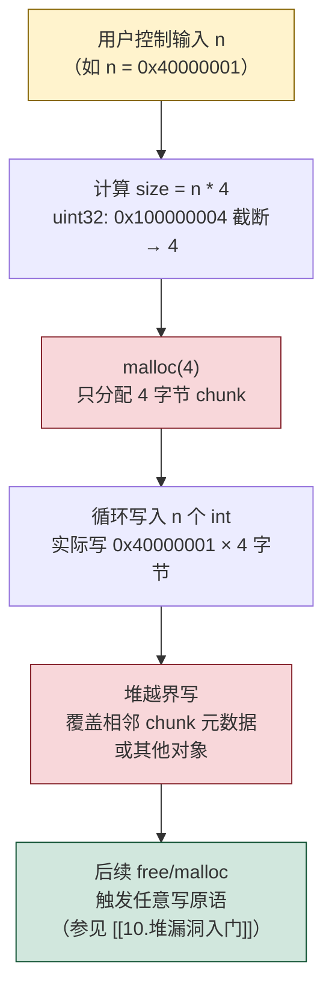

# 二进制漏洞与利用基础（11）· 整数溢出与类型混淆

> [!abstract] TL;DR
> 整数溢出（Integer Overflow）和类型混淆（Type Confusion）是两类"逻辑层面"的漏洞：程序的内存操作本身没有语法错误，但**数值计算或类型假设出了偏差**，最终间接导致内存越界、虚表劫持或任意读写。理解它们的关键在于：C/C++ 整数运算不会自动报警；类型系统在缺乏运行时校验时形同虚设。

---

## 概述与定位

前面各篇（[[01.内存布局与漏洞概览]]、[[10.堆漏洞入门]]）介绍的漏洞——栈溢出、堆溢出、UAF——大多是**空间维度**的越界：指针走出了合法范围。本篇的两类漏洞则是在**数值维度**（整数溢出）和**类型维度**（类型混淆）出了问题，而后才映射到内存破坏。

- **整数溢出**：整数运算的结果超出该类型的表示范围，导致值"回绕"或截断，后续以这个错误值分配缓冲区或做边界判断，就会引发堆/栈内存越界。
- **类型混淆**：将一个对象当成另一种类型来解读（读字段、调虚函数），导致用错误偏移访问内存，或调用伪造的虚函数表指针。

两类漏洞在真实软件中极为常见：浏览器引擎的 JIT 编译器、内核的 `ioctl` 长度参数、网络协议的数据包长度字段……都是高价值攻击面。本篇以最小教学 demo 讲透原理，并给出对应的编译期/运行期防御手段（详细缓解机制见 [[12.缓解机制总览]]）。

---

## 原理与机制

### 一、整数溢出

#### 1.1 三种基本形式

C/C++ 整数运算遵循**固定宽度截断**语义——结果超出类型范围时，行为依符号性而不同：

| 形式 | 描述 | C 标准行为 |
|------|------|------------|
| **无符号回绕（Wraparound）** | `uint32_t` 加法结果 ≥ 2³²，高位截断，结果从 0 重新计数 | 定义行为（modulo 2ⁿ） |
| **有符号溢出（Signed Overflow）** | `int32_t` 加法结果超 INT_MAX 或低于 INT_MIN | **未定义行为（UB）**，编译器可任意优化 |
| **截断（Truncation）** | 宽类型赋给窄类型，高位被截：`uint32_t n = 0x10001; uint8_t b = n; // b == 1` | 定义行为，但值改变 |

还有一类经常被忽视的：

| 形式 | 描述 |
|------|------|
| **有符号↔无符号转换错误** | 负的 `int` 被隐式转换为 `size_t`（无符号），变成超大正数；或反之，`size_t` 的大值转 `int` 变负数导致长度校验被绕过 |

#### 1.2 乘法溢出→小分配→堆越界写

最经典的利用链：

```
n * element_size  →  溢出回绕得到小值  →  malloc(小值)  →  实际写入 n 个元素  →  堆越界
```



> [!warning] 以上 Mermaid 图为原理示意，地址/大小值仅作教学说明。

#### 1.3 有符号整数校验绕过

另一种常见模式——用有符号整数做长度校验：

```c
// 错误：len 为 int，攻击者传入负值绕过上界检查
int len = user_provided_len();
if (len > MAX_LEN) return ERROR;  // 负值通过了这个检查！
memcpy(dst, src, len);            // len 隐式转 size_t → 超大正数 → 越界复制
```

当 `len = -1` 时，`-1 > MAX_LEN` 为假（校验通过），但 `memcpy` 的第三个参数是 `size_t`，`(size_t)(-1) = SIZE_MAX = 0xFFFFFFFFFFFFFFFF`，复制几乎无限字节。

---

### 二、类型混淆

#### 2.1 根本成因

类型混淆发生在程序**持有一个指针/引用，却按照错误的类型布局来读写它的字段或调用其虚函数**。C++ 编译器在没有运行时类型信息（RTTI）校验的情况下，相信程序员给出的类型断言——这是性能设计，但也是漏洞温床。

#### 2.2 三种典型场景

**场景 A：不安全向下转型（Unsafe Downcast）**

```cpp
class Base   { public: virtual void f(); int base_field; };
class Derived: public Base { public: int extra_field; void g(); };

Base *b = get_object();          // 实际可能返回 Base，也可能返回 Derived
Derived *d = (Derived *)b;       // C 风格强转，无运行时检查
d->g();                          // 若 b 实际是 Base，g() 按 Derived 布局读 vtable → 混乱
```

**场景 B：union / 内存复用**

```cpp
union Value {
    int   as_int;
    float as_float;
    void *as_ptr;
};

Value v;
v.as_int = user_input;   // 攻击者写入一个整数
use_as_pointer(v.as_ptr); // 被当指针解引用 → 任意读或崩溃
```

**场景 C：反序列化后缺乏类型校验**

网络/文件数据流中携带"类型字段"，服务端直接按该字段 `switch` 分配并使用对象，而不校验请求方是否有权指定该类型，或不校验载荷长度是否与该类型的 `sizeof` 匹配。

#### 2.3 虚表混淆（vtable Confusion）

C++ 虚函数通过 vtable 实现：每个多态对象开头存一个指向该类 vtable 的隐藏指针（`__vptr`）。类型混淆若让 `__vptr` 指向攻击者控制的"假 vtable"，则虚函数调用即变成任意跳转——这与 [[07.GOT劫持与ret2dl-resolve]] 中 GOT 改写的原理异曲同工，都是通过控制间接跳转目标劫持控制流。

```
合法对象内存布局：
[ __vptr → 真实 vtable ][ 字段1 ][ 字段2 ] ...

类型混淆后（对象 A 被当 B 解读）：
[ B::__vptr 偏移 ] 实际读到的是 A 的字段1（非指针）
调用 B::虚函数 → 按错误偏移取值 → 调用地址不可控 → crash / 利用
```

调用约定和栈帧的背景知识见 [[22.调用规约/00.总览.md]]，虚函数调用本质是从 vtable 取地址再 `call [rax]`，与普通间接调用机制相同。

---

## 最小示例

### Demo 1：整数乘法溢出导致堆越界写

> [!warning] 教学环境：以下代码刻意关闭现代防护以复现漏洞现象；生产编译默认开启 AddressSanitizer / UBSan / PIE 等保护，不需要这些选项。

```c
// int_overflow_demo.c — 整数乘法溢出 → 堆越界写
// 编译（教学环境，关闭防护）：
//   gcc -o int_overflow_demo int_overflow_demo.c \
//       -fno-stack-protector -no-pie -O0
// ⚠️  教学环境：生产代码务必用 -fsanitize=address,undefined 检测此类问题
#include <stdio.h>
#include <stdlib.h>
#include <stdint.h>
#include <string.h>

// 模拟：从网络读到一个"元素数量"，随后分配 n 个 int 的数组
char *alloc_buffer(uint32_t n) {
    // 漏洞：n * sizeof(int) 可能溢出 uint32_t
    uint32_t total = n * (uint32_t)sizeof(int);  // ← 危险：乘法溢出
    printf("[alloc] n=%u, total=%u (uint32)\n", n, total);
    return malloc(total);  // total 很小（溢出后），但调用者认为有 n 个 int 的空间
}

int main(void) {
    // 0x40000001 * 4 = 0x100000004，uint32 截断 → 4
    uint32_t n = 0x40000001u;
    char *buf = alloc_buffer(n);
    if (!buf) { perror("malloc"); return 1; }

    printf("[buf]  allocated %p (actually ~4 bytes)\n", (void *)buf);
    printf("[write] writing %u ints...\n", n);

    // 写 n 个 int → 实际只有 4 字节，大量越界写堆
    for (uint32_t i = 0; i < n; i++) {
        ((int *)buf)[i] = (int)i;  // ← 堆越界写
    }

    printf("[done] (in real exploit: heap metadata corrupted)\n");
    free(buf);
    return 0;
}
```

> [!warning] 上方示例在真实运行中会触发 SIGSEGV 或堆破坏（具体表现依 glibc 版本/地址布局而异）；输出仅为原理说明。本机为 Windows，未实际运行。

编译并用 ASan 捕获：

```bash
gcc -o int_overflow_demo int_overflow_demo.c \
    -fsanitize=address,undefined -g
./int_overflow_demo
# ASan 会在第一次越界写时输出 heap-buffer-overflow 报告
```

> [!warning] 以上命令及输出为示意，需在 Linux 环境实际执行。

---

### Demo 2：有符号整数校验绕过

```c
// signedness_bypass_demo.c — 有符号长度绕过
// 编译：gcc -o signedness_bypass_demo signedness_bypass_demo.c -O0
// ⚠️  教学用，生产中应使用 size_t 做长度，并用 UBSan 检测
#include <stdio.h>
#include <string.h>
#define MAX_LEN 256

void copy_data(const char *src, int user_len) {
    char dst[MAX_LEN];
    // 漏洞：user_len 为 int，负值能绕过上界检查
    if (user_len > MAX_LEN) {
        printf("rejected: too large\n");
        return;
    }
    // user_len=-1 时：(size_t)(-1) = SIZE_MAX → memcpy 超量复制
    memcpy(dst, src, (size_t)user_len);  // ← 隐式转换是漏洞根源
    printf("copied %d bytes\n", user_len);
}

int main(void) {
    copy_data("AAAA", -1);   // 负值绕过检查
    copy_data("AAAA", 300);  // 正常被拒绝
    return 0;
}
```

> [!warning] `user_len=-1` 的实际行为（`memcpy` 传入 `SIZE_MAX`）依平台而异，通常会立即崩溃或触发 AddressSanitizer 报警。本机未实际运行，以上为原理示意。

---

### Demo 3：C++ 类型混淆（不安全向下转型）

```cpp
// type_confusion_demo.cpp — 向下转型类型混淆
// 编译：g++ -o type_confusion_demo type_confusion_demo.cpp \
//       -fno-rtti -O0 -no-pie
// ⚠️  -fno-rtti 关闭 RTTI 是教学用，生产中应保留 RTTI 并使用 dynamic_cast
#include <cstdio>

class Animal {
public:
    virtual void speak() { printf("Animal speaks\n"); }
    int age = 5;
};

class Dog : public Animal {
public:
    virtual void speak() override { printf("Woof! tricks=%d\n", tricks); }
    int tricks = 42;   // Dog 独有字段，偏移 sizeof(vtpr)+sizeof(age)
};

class Cat : public Animal {
public:
    virtual void speak() override { printf("Meow! lives=%d\n", lives); }
    int lives = 9;     // Cat 独有字段，偏移与 Dog::tricks 相同
};

int main(void) {
    Animal *a = new Cat();          // 真实类型：Cat
    Dog    *d = (Dog *)a;           // C 风格强转，无检查

    printf("d->tricks = %d\n", d->tricks);  // 实际读的是 Cat::lives
    d->speak();                              // 调用 Cat::speak（vtable 还是 Cat 的）
    // 若攻击者能控制 Cat::lives（如通过堆溢出），
    // 且 tricks 参与了危险操作，即造成可利用状态

    delete a;
    return 0;
}
```

> [!warning] 示例输出为原理示意，非本机实际运行结果。

预期行为（原理说明）：

```
d->tricks = 9        ← 读到的是 Cat::lives，不是 Dog::tricks
Meow! lives=9        ← vtable 仍是 Cat 的，speak() 调用正确，但若 vtable 也被混淆…
```

---

## 利用思路（原理层面）

> [!note] 本节仅描述**为何这些机制可被利用**，不提供武器化步骤或完整利用链。

### 整数溢出的利用路径

1. **控制 `malloc` 参数**：使分配量远小于预期写入量，后续的正常写操作即变成堆越界写（Heap Buffer Overflow）。之后可套用 [[10.堆漏洞入门]] 中的堆元数据伪造原语。

2. **绕过长度校验**：负值或超大值通过有符号/无符号转换骗过 `if (n < MAX)` 检查，之后的 `memcpy` / `memmove` 以错误长度执行，覆盖相邻内存。

3. **数组索引越界**：`arr[user_idx]` 若 `user_idx` 是有符号整数且为负值，或无符号整数溢出后变小，均可导致数组越界访问（读/写均可利用）。

### 类型混淆的利用路径

1. **读取敏感字段**：将对象解读为另一类型，按该类型的字段偏移读内存——若字段语义上是"指针"，即完成一次信息泄露，打破 ASLR（参见 [[01.内存布局与漏洞概览]] 的"信息泄露"目标）。

2. **伪造 vtable**：若攻击者能在内存中放置伪造的 vtable（通过堆溢出或 UAF），再触发类型混淆使 `__vptr` 指向该假表，则下次虚函数调用即跳向任意地址——等效于 GOT 改写（[[07.GOT劫持与ret2dl-resolve]]）的控制流劫持效果。

3. **结合 JIT/反序列化**：浏览器 JIT 引擎的类型混淆漏洞通常允许攻击者在 JavaScript 层面触发，因为 JIT 为性能而省略了类型检查；反序列化中的类型混淆同理。

---

## 缓解与防御

### 整数溢出的缓解

#### 编译期工具

| 工具 / 选项 | 作用 | 触发条件 |
|------------|------|---------|
| `-fsanitize=undefined` (UBSan) | 检测有符号溢出、移位越界、非法转换等 UB | 运行时发现即报告，适合测试阶段 |
| `-fsanitize=integer` (UBSan 扩展) | 额外检测无符号整数溢出、截断 | Clang 支持，GCC 部分支持 |
| `-ftrapv` | 有符号溢出时插入 `SIGABRT` 陷阱 | 运行时直接崩溃，便于 fuzzing 发现 |
| `-Wconversion` / `-Wsign-conversion` | 静态警告类型隐式转换 | 编译期，需手动修复 |

#### 安全算术原语

```c
#include <stdint.h>

// ✅ GCC/Clang 内建安全乘法（溢出时返回 true）
uint32_t n   = user_input();
uint32_t size;
if (__builtin_mul_overflow(n, sizeof(int), &size)) {
    // 溢出：拒绝请求
    return ERROR;
}
void *buf = malloc(size);

// ✅ C23 / POSIX：reallocarray（glibc 2.26+）
// 内部做溢出检查
void *buf = reallocarray(NULL, n, sizeof(int));
if (!buf) { /* n*sizeof(int) 溢出或 OOM */ }

// ✅ C++ 标准库容器自动处理大小
std::vector<int> v(n);   // 若 n*sizeof(int) 溢出，抛 std::bad_alloc
```

#### 显式范围校验要点

```c
// ❌ 错误：用有符号 int 做长度
int len = get_len();
if (len > MAX) return ERR;
memcpy(dst, src, len);      // 负值绕过

// ✅ 正确：使用 size_t，且同时检查上下界
size_t len = get_len_unsigned();
if (len == 0 || len > MAX) return ERR;
memcpy(dst, src, len);

// ✅ 正确：显式强转 + 立即校验
int raw = get_raw_len();
if (raw <= 0 || (size_t)raw > MAX) return ERR;
size_t len = (size_t)raw;
memcpy(dst, src, len);
```

**原则**：凡与内存大小、数组索引相关的变量，**统一使用 `size_t`（无符号、平台宽度）**；在使用前同时校验上界和下界（避免 0 长度特殊行为）。

---

### 类型混淆的缓解

#### C++ `dynamic_cast` + RTTI

```cpp
// ❌ 危险：C 风格强转，无运行时检查
Derived *d = (Derived *)base_ptr;

// ✅ 安全：dynamic_cast 利用 RTTI 在运行时验证类型关系
Derived *d = dynamic_cast<Derived *>(base_ptr);
if (!d) {
    // base_ptr 实际类型不是 Derived，拒绝操作
    return;
}
```

`dynamic_cast` 要求：
- 基类必须有至少一个虚函数（启用 RTTI）。
- 编译时不能用 `-fno-rtti`（关闭 RTTI 则 `dynamic_cast` 总是 UB 或直接不可用）。

#### 编译期静态分析

```bash
# Clang Static Analyzer / clang-tidy 检测不安全向下转型
clang-tidy -checks='cppcoreguidelines-pro-type-cstyle-cast' \
           -warnings-as-errors='*' source.cpp

# AddressSanitizer + UBSan 组合（捕获运行时类型混淆导致的越界）
g++ -fsanitize=address,undefined -g source.cpp
```

#### CFI（控制流完整性）对虚表混淆的防御

Clang 的 `-fsanitize=cfi-vcall` 在每次虚函数调用前插入对象类型合法性检查，确保 vtable 属于预期的类层次结构。这使得伪造 vtable 的类型混淆利用在 CFI 开启时直接崩溃（详见 [[12.缓解机制总览]]）。

```bash
# 启用虚函数调用 CFI
clang++ -flto -fvisibility=hidden \
        -fsanitize=cfi-vcall \
        -o target source.cpp
```

> [!warning] CFI 需要 LTO（链接时优化），且要求所有编译单元都用 Clang 编译；与部分第三方库存在兼容性问题。

#### union 的安全使用

```cpp
// ❌ 危险：通过 union 进行隐式类型双关（type punning）
union { float f; uint32_t u; } pun;
pun.f = 1.0f;
use_as_int(pun.u);   // C++ 未定义行为（不同于 C99）

// ✅ 安全：用 memcpy 进行类型双关（标准合规、编译器会优化为零开销）
float f = 1.0f;
uint32_t u;
memcpy(&u, &f, sizeof(u));   // 合法的 type punning
use_as_int(u);

// ✅ C++20：std::bit_cast<T>（最简洁）
#include <bit>
uint32_t u = std::bit_cast<uint32_t>(1.0f);
```

---

## 检测与工具

| 工具 | 目标漏洞 | 典型用法 |
|------|----------|---------|
| **UBSan** (`-fsanitize=undefined`) | 有符号溢出、非法转换、数组越界 | `gcc/clang -fsanitize=undefined -g ./vuln` |
| **UBSan integer** (`-fsanitize=integer`) | 无符号溢出、截断（Clang 专有） | `clang -fsanitize=integer ./vuln` |
| **ASan** (`-fsanitize=address`) | 溢出导致的堆/栈越界读写 | 配合 UBSan 同时开启 |
| **`-ftrapv`** | 有符号溢出直接崩溃 | 适合 fuzzing 阶段（GCC/Clang） |
| **Clang CFI** (`-fsanitize=cfi`) | 类型混淆→vtable 劫持 | 需 `-flto -fvisibility=hidden` |
| **clang-tidy** | 静态检测不安全强转 | `cppcoreguidelines-pro-type-cstyle-cast` 规则 |
| **Coverity / CodeQL** | 静态整数溢出 / 类型混淆路径分析 | CI 集成 |
| **`__builtin_*_overflow`** | 安全算术，溢出时返回 true | 嵌入代码，零性能损失（GCC/Clang） |

> [!warning] 以上工具均需 Linux/macOS 编译环境；本机为 Windows，未实际执行。工具输出均为示意。

---

## 小结

- **整数溢出**分三类：无符号回绕（定义行为）、有符号溢出（UB，编译器可优化掉）、截断。最危险的利用链是"乘法溢出 → 小 `malloc` → 后续堆越界写"，以及"有符号校验被负值绕过 → `memcpy` 超量复制"。
- **类型混淆**通过"把对象当成另一种类型解读"绕过字段/虚函数的语义约束，严重时可实现信息泄露或任意控制流劫持（伪造 vtable）。
- **防御三要素**：
  1. 安全算术原语（`__builtin_mul_overflow`、`reallocarray`、`std::bit_cast`）。
  2. `size_t` 正确使用 + 同时校验上下界。
  3. C++ 运行时类型校验（`dynamic_cast` / RTTI）+ 编译期 CFI（`-fsanitize=cfi-vcall`）。
- 检测工具首选 **UBSan + ASan 组合**（测试阶段），生产阶段追加 **CFI**（若兼容性允许）。
- 本类漏洞与堆漏洞（[[10.堆漏洞入门]]）常组合出现：整数溢出制造小 chunk，堆漏洞原语完成后续利用；类型混淆结合 UAF 可实现浏览器级别的高危利用链。

---

## 相关阅读

- [[01.内存布局与漏洞概览]] — 内存布局基础，漏洞大类概览（整数溢出归属"内存破坏类"）
- [[10.堆漏洞入门]] — 整数溢出后的堆越界/UAF 利用原语
- [[12.缓解机制总览]] — ASLR / NX / Canary / CFI 完整防御体系
- [[22.调用规约/00.总览.md]] — 调用约定与栈帧（虚函数调用机制的底层基础）
- [[07.GOT劫持与ret2dl-resolve]] — GOT 改写（类型混淆→vtable 劫持的类比参照）
- [[34.现代二进制防护机制/00.现代二进制防护机制总览]] — CFI / ShadowStack 完整讲解（系列 34）

---

⬅️ 上一篇 [[10.堆漏洞入门]] ｜ 🏠 [[00.二进制漏洞与利用基础总览]] ｜ 下一篇 [[12.缓解机制总览]] ➡️
