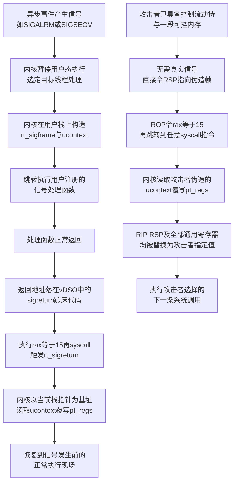
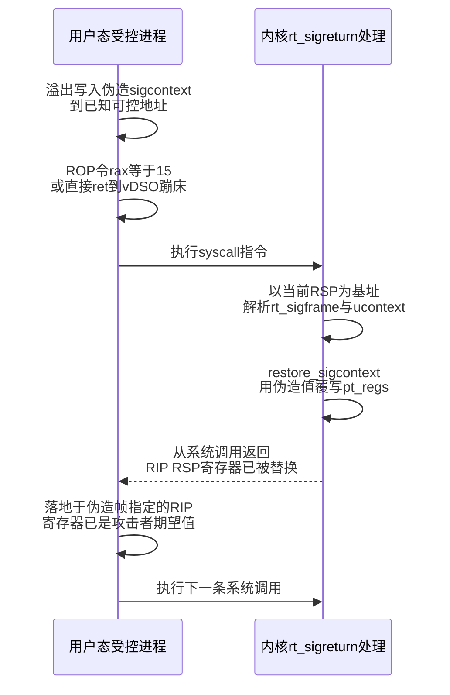

# 二进制漏洞与利用基础（12）· SROP信号帧伪造

> [!abstract] TL;DR
> - SROP（Sigreturn-Oriented Programming）滥用 Linux 内核 `rt_sigreturn` 系统调用"无条件按栈上数据整体恢复用户态寄存器现场"的语义：只用一条 `syscall` 指令加一段可控内存里伪造的 `sigcontext`，即可一次性控制全部通用寄存器、`RIP` 与 `RSP`。
> - 与传统 ROP 必须为每个寄存器单独搜集 `pop reg; ret` gadget 不同，SROP 只依赖一个与具体二进制无关、几乎必然存在的"通用 gadget"，因而天生跨二进制可移植——2014 年 Bosman 与 Bos 那篇奠基论文标题就叫《A Return to Portable Shellcode》。
> - 内核在 `sys_rt_sigreturn` 中直接用伪造的 `ucontext` 覆写内核态的 `pt_regs`，伪造帧的 `rip`/`rsp` 字段因此可以直接指向下一次系统调用或下一顶伪造帧，串成不依赖额外寄存器 gadget 的"SROP 链"——是 `execve` 被禁用场景下 open-read-write（ORW）取 flag 的首选手法。
> - SROP 不解决控制流劫持、地址泄露、Canary 绕过这些前置问题，也不能绕过 ASLR/RELRO——它解决的只是"已经劫持了控制流之后，如何一次性摆布好全部寄存器"这一环节。
> - 最直接的防御是用 seccomp 显式屏蔽 `rt_sigreturn`，代价是连带破坏依赖真实信号处理的程序功能；Intel CET 影子栈能挡住"`pop rax;ret` 再落到 `syscall`"这条最常见的经典触发路径。

## 概述与定位

SROP 全称 Sigreturn-Oriented Programming，中文常译作"面向信号返回编程"或"信号帧伪造"，指攻击者在已经拥有栈溢出/任意写等控制流劫持原语的前提下，构造一段符合内核 ABI 的假"信号上下文"（`sigcontext`/`ucontext`），诱导内核执行 `rt_sigreturn` 系统调用，把这段伪造数据当成真实的、由内核自己保存的寄存器现场原样恢复回 CPU。这个动作原本是操作系统信号机制里再普通不过的一环——用户注册的信号处理函数返回后，必须有人把执行流"缝合"回信号发生前的样子——但由于内核对这段现场数据的来源缺乏强验证，攻击者只要能控制内存与一次系统调用，就能把它变成一枚威力极大的"万能寄存器写入原语"。

这一技术由 Erik Bosman 与 Herbert Bos 在 2014 年 IEEE S&P（Oakland）会议上系统化提出，论文标题《Framing Signals — A Return to Portable Shellcode》里的"portable"二字点出了它最核心的价值主张：传统 ROP 链高度依赖目标二进制自身的 gadget 分布，换一个程序、换一次编译，整条链基本要重新搜集；而 SROP 所依赖的唯一"神奇 gadget"——一条裸的 `syscall`/`int 0x80` 指令，或者内核本身通过 vDSO 提供的信号返回蹦床——是操作系统 ABI 层面的常量，只要目标运行在同一内核/同一架构上，这个 gadget 的语义就是稳定且几乎必然可用的，因此 SROP payload 具有远超普通 ROP 链的可移植性，某种意义上重新找回了"注入式 shellcode"那种"一份 payload 打遍所有目标"的便利，却完全不需要可写可执行内存。

在本系列的位置上，SROP 建立在前面几章的基础之上：它需要 [[06.ROP入门]]、[[07.ROP进阶：ret2csu与通用gadget]] 中讨论的控制流劫持与 gadget 拼接能力作为前提，是 [[04.返回导向：ret2text与ret2syscall]] 中"单次系统调用劫持"思路的自然延伸——如果说 ret2syscall 是"手工搭一次系统调用"，SROP 就是"一次性把整个 CPU 现场连同若干次系统调用的参数一起写好"。它常常还需要 [[08.栈迁移与stack pivot]] 中的栈迁移技巧配合，因为伪造的 `sigcontext` 体积远大于典型的返回地址覆盖窗口。往后看，它与下一章 [[13.JOP与COP面向跳转与调用编程]] 一同构成"传统 ROP 之外的另类代码复用"家族：JOP/COP 是在 CPU 指令级别绕开 `ret` 指令的限制，而 SROP 走的是完全不同的路——不在 CPU 指令层面做文章，而是直接滥用操作系统内核提供的一个特权级"数据恢复"接口。本章聚焦 Linux x86-64 场景讲透原理与构造方法，i386 与 ARM/ARM64 只做机制性对比，架构专属的细节留给 [[21.ARM64与MIPS架构利用差异]] 展开。

## 原理与机制

### 信号投递与用户态现场保存

理解 SROP 必须先理解 Unix 信号机制里一个容易被忽视的细节：当内核决定向一个正在用户态运行的进程投递一个异步信号（无论是硬件产生的 `SIGSEGV`，还是软件发出的 `SIGALRM`、`SIGCHLD`），它必须先把这个进程"正在做的事"完整地存起来，再跳转去执行用户注册的信号处理函数，处理函数返回后还得把原来的执行现场精确复原，否则程序就没法继续正常运行下去。这个"现场"不只是几个通用寄存器那么简单，它包括 `RIP`（马上要执行的下一条指令）、`RSP`（当前栈顶）、`RFLAGS`（条件标志位）、段寄存器，乃至浮点/向量寄存器状态——凡是信号处理函数可能污染到的一切，都得先备份。

内核选择把这份备份直接写在**用户态自己的栈上**（或者进程通过 `sigaltstack` 指定的备用信号栈），而不是藏在内核态某个进程私有的内核栈区域里。这个设计决策有其历史合理性：一来用户栈本就是该线程私有、天然按需增长的内存，内核不需要额外分配持久化存储；二来更关键的是，这样一来"信号处理函数返回"这个动作可以完全复用 CPU 原生的"函数返回"语义——处理函数最后执行的 `ret`，弹出的返回地址不是指向调用者，而是指向内核精心安排的一小段"蹦床"（trampoline）代码，这段蹦床代码所做的事情就是执行 `sigreturn`/`rt_sigreturn` 系统调用，告诉内核"现场已经用完，请把之前存的那份现场读回来"。换句话说，Unix 信号处理在设计上就是"伪装成一次普通函数调用"，这既复用了现有的调用约定，也是它今天能被 SROP 利用的根源——因为整套机制的可信边界完全建立在"栈上这份数据一定是内核自己刚存的"这一假设上，而这个假设并没有任何密码学或权限层面的保证。

### sigreturn 与 rt_sigreturn：内核如何"撤销"一次信号

早期 Unix 只有 `sigreturn`（Linux i386 上是系统调用号 119），后来 POSIX 实时信号引入了携带更多元数据（`siginfo_t`）的 `rt_sigreturn`（i386 上是 173，x86-64 上只保留了这一个版本，系统调用号为 15）。二者作用相同：从当前 `RSP` 指向的内存位置读出一整套此前保存的寄存器状态，原样写回 CPU。在 x86-64 上，触发它的方式是把 15 放进 `rax`、执行一条 `syscall` 指令；在 i386 上传统上是 `int 0x80` 软中断。

这里有一个非常值得展开的历史细节：蹦床代码——也就是信号处理函数返回后要执行到的那几条"设置 rax、发起系统调用"的指令——最早是由内核（后来是 glibc）直接**写在用户栈上**的，`sigaction` 结构体里的 `sa_restorer` 字段指向这段栈上代码。这在栈可执行的年代毫无问题，但 NX/DEP 成为标配之后，栈上有一段必须被执行的机器码就成了明显的兼容性障碍——这也是为什么现代 Linux 改为把这段蹦床代码固定编译进 **vDSO**（`__kernel_rt_sigreturn` 符号），vDSO 是内核映射进每个进程地址空间、始终带有执行权限的一小段代码页，`sa_restorer` 从此指向 vDSO 而不是栈。这个演进本身就是"防护机制倒逼攻击手法转移阵地"的一个缩影：NX 关闭了"栈上放代码"这条路，但也间接给 SROP 留下了一个稳定、不受 ASLR 之外任何机制约束、天然可执行的"官方 gadget"——`__kernel_rt_sigreturn` 里那两条指令原本就是 `mov rax, 15; syscall`，这恰好是攻击者最想要的东西。

从内核实现的角度看（以 x86-64、`arch/x86/kernel/signal.c` 一带的逻辑为例），`sys_rt_sigreturn` 处理函数做的事情概括起来就是：以当前 `RSP` 为基址，把这块内存解释成一个 `struct rt_sigframe`，取出其中的 `ucontext`，调用类似 `restore_sigcontext()` 的例程，把 `ucontext.uc_mcontext` 里的每一个字段——`r8`~`r15`、`rdi`、`rsi`、`rdx`、`rax`、`rcx`、`rsp`、`rip`、`eflags`、段选择子等——逐一写回内核为这次系统调用维护的 `pt_regs` 结构。`pt_regs` 正是内核"从系统调用返回用户态"这条路径最终会读取的那份寄存器映像，所以只要 `rt_sigreturn` 把 `pt_regs` 覆写成攻击者想要的样子，系统调用一"返回"，CPU 落地的位置、栈顶、乃至传给下一条指令的所有寄存器值，就都是攻击者说了算。

### 从可信机制到攻击原语

SROP 的关键洞察在于：内核并没有对这块被解释为 `ucontext` 的内存做任何强身份校验——它不检查这份数据是不是真的由某次真实信号投递写下的，也没有类似签名或计数器的机制去证明"这确实是我刚保存的现场"。内核只做了少量合理性检查（比如确保 `cs`/`ss` 段选择子是合法的用户态选择子，避免把特权级悄悄提升；比如识别 `fpstate` 是否带有扩展状态的魔数，避免把浮点/向量恢复搞乱），除此之外完全信任 `RSP` 处那块内存的内容。这个信任模型在信号机制刚被设计出来时是合理的：一个进程原本就能通过其它手段（比如直接执行代码）任意设置自己的寄存器，"进程能控制自己的寄存器状态"从来都不是一条安全边界；真正构成安全问题的，是攻击者本不该拥有的"控制流劫持"能力——SROP 只是在攻击者已经拿到这项能力之后，提供了一种异常高效的方式去把它兑现成任意寄存器控制，而不是凭空创造了一个新漏洞。

把这一点讲透，也就理解了 SROP 与传统 ROP 的本质差异：传统 ROP 要控制 `rdi`/`rsi`/`rdx` 这些参数寄存器，必须逐个去搜集 `pop rdi; ret`、`pop rsi; ret` 这类 gadget，遇到 gadget 稀缺的小体积或经过裁剪的二进制（静态链接的精简程序、`musl` 编译的题目、去除了大部分 libc 符号的题目）常常无从下手；而 SROP 用一次系统调用就能把十几个寄存器全部设置到位，唯一的门槛是"找到一条可执行的 `syscall` 指令并让 `RSP` 在恰当时机指向一段攻击者完全掌控的内存"——前者几乎在任何链接了系统调用的程序里都存在，后者只是普通的栈溢出/任意写就能满足。这也是为什么 SROP 常被视为解决"gadget 稀缺问题"的标准答案。



## 信号帧结构与SROP链构造详解

### x86-64 rt_sigframe/ucontext/sigcontext 逐层剖析

要手工伪造一份能被内核接受的现场，首先得清楚这份数据在内存里到底长什么样。x86-64 Linux 下，从外到内大致嵌套三层结构（字段顺序与具体数值可能随内核版本略有出入，实际构造时以 pwntools 源码或目标内核头文件为准，这里给出的是被广泛验证、教学上普遍采用的布局）：

```c
// 最外层:内核态识别的信号帧
struct rt_sigframe {
    char              *pretcode; // 指向sigreturn蹦床(通常在vDSO内),
                                  // 对触发方来说该字段本身不参与校验
    struct ucontext    uc;
    struct siginfo     info;     // 信号元数据,寄存器恢复阶段基本不关心
};

// 中间层:标准POSIX上下文
struct ucontext {
    unsigned long      uc_flags;
    struct ucontext   *uc_link;
    stack_t             uc_stack;     // 备用信号栈描述,可全零(SS_DISABLE)
    struct sigcontext   uc_mcontext;  // 核心:即将写回pt_regs的寄存器现场
    sigset_t             uc_sigmask;  // 恢复后的信号屏蔽字,可选设置
};

// 最内层:真正的寄存器现场,是攻击者唯一需要精心填写的部分
struct sigcontext {
    unsigned long r8, r9, r10, r11, r12, r13, r14, r15;
    unsigned long rdi, rsi, rbp, rbx, rdx, rax, rcx, rsp;
    unsigned long rip;
    unsigned long eflags;
    unsigned short cs, gs, fs, ss;
    unsigned long err, trapno, oldmask, cr2;   // 故障相关字段,攻击场景下多可清零
    unsigned long fpstate;                     // 指向扩展FP/向量状态,置0走默认路径最安全
    unsigned long reserved[8];
};
```

对攻击者而言，这三层里绝大多数字段都是"填充"：`pretcode` 只在信号**投递**阶段被使用（决定处理函数返回后跳到哪里），一旦攻击者是直接触发 `rt_sigreturn`（而非走完整的投递-处理-返回流程），这个字段内核根本不读；`uc_stack` 描述备用信号栈，正常情况下清零表示"不使用备用栈"即可；`err`/`trapno`/`oldmask`/`cr2` 是给调试器和处理函数本身查看故障原因用的元数据，与寄存器恢复无关；`fpstate` 指向扩展浮点/向量状态区，内核会用一个魔数判断这块区域是否存在合法的 XSAVE 数据，攻击者一般直接置空让内核走默认（不恢复扩展状态）路径，避免因为构造了一份格式不对的伪 XSAVE 区域触发额外校验失败。真正决定"劫持之后 CPU 长什么样"的，只有 `sigcontext` 里那十几个整数寄存器加 `rip`/`rsp`/`eflags`/段选择子——这也是 pwntools `SigreturnFrame` 类把接口设计成"按寄存器名逐一赋值"的原因，它内部按目标架构自动处理好三层嵌套与填充字段，使用者只需要关心自己真正要控制的那部分。

需要特别提醒一点容易踩的坑：`cs`/`ss` 这两个段选择子不能随便填。内核会校验它们是否是合法的用户态代码段/数据段选择子（在标准 x86-64 Linux 上通常分别是 `0x33` 与 `0x2b`），一旦给出内核态选择子或者压根无效的值，轻则在恢复阶段触发一般保护异常导致进程崩溃收到新的 `SIGSEGV`，重则打乱后续利用链的节奏。pwntools 的 `SigreturnFrame` 默认会填好这些"环境字段"的合理值，手工构造时如果不清楚具体数值，直接复用它生成的默认帧、只覆盖自己关心的寄存器，是最稳妥的做法。

### 触发 sigreturn 的三条路径

让内核真正走进 `sys_rt_sigreturn` 分支，实践中有三种常见方式，威力和适用条件各不相同：

第一种也是最简洁的方式，是直接把控制流 `ret` 到 vDSO 里 `__kernel_rt_sigreturn` 的地址。前文提过，这段代码本身就是 `mov rax, 15; syscall` 两条指令，也就是说攻击者甚至**不需要**自己找一条"pop rax; ret"去设置寄存器——只要把这个地址塞进被劫持的返回地址位置，紧跟着摆好伪造帧，就完成了触发。唯一的门槛是要知道 vDSO 的加载基址：如果目标关闭了 ASLR/是非 PIE 的场景，这个地址是固定的；如果开启了 ASLR，则需要通过某个信息泄露（比如读栈上残留的返回地址、`/proc/self/maps`、或者程序自身打印的指针）先拿到 vDSO 或附近的基址。

第二种是退化形式：找不到方便利用的 vDSO（某些容器化/沙箱化环境可能不映射 vDSO，或者目标干脆是极简的裸机式二进制），就退回到"手工设置 + 裸 syscall"的组合——用一条已有的 `pop rax; ret` gadget 把 `rax` 置为 15，再 `ret` 到程序、libc 或任意可执行段里一条裸的 `syscall`（机器码只有两字节 `0f 05`，在带有系统调用包装函数的静态链接二进制、甚至动态链接的 libc 内部都极其常见）。只要执行到这条指令时 `rax` 恰好是 15，效果与走 vDSO 完全等价。

第三种路径是"借用真实信号"：如果目标程序本身会触发一次真正的信号投递——设置了 `alarm()` 超时、注册了 `SIGSEGV`/`SIGCHLD` 处理函数、或者在某个系统调用上被信号打断——内核会自动把返回地址设成 vDSO 蹦床，攻击者完全不需要在 ROP 链里显式写这个地址，只需要保证信号处理函数运行期间或者返回前，`RSP` 恰好指向一块攻击者能控制内容的内存即可。这条路径在某些"控制流劫持窗口很窄，写不进一整条 ROP"的场景里格外有用，因为触发动作完全由内核原生流程代劳。



### 单帧到 SROP 链：为什么一个 gadget 能连着做好几件事

理解了 `rt_sigreturn` 直接覆写 `pt_regs` 这件事，SROP 链的构造思路就水到渠成：既然 `rip` 和 `rsp` 也是被覆写的对象，伪造帧就完全可以把 `rip` 指向另一条 `syscall` 指令、把 `rsp` 指向精心安排好的下一段内存——这意味着"下一步做什么"完全由攻击者写在帧里，不再需要额外的跳转 gadget。

对于像 `execve` 这样**一旦成功就不会返回**的终结性调用，处理起来最简单：伪造帧的 `rax` 直接填成 59（`SYS_execve`）、`rdi`/`rsi`/`rdx` 填好 `"/bin/sh"` 地址与两个空指针，`rip` 指回同一条触发用的 `syscall` 指令即可——`rt_sigreturn` 恢复完寄存器后控制流重新落到这条指令，此时 `rax` 已经是 59，CPU 再次执行到它就变成一次真正的 `execve` 调用，进程镜像被整体替换，之前 `rsp` 填的是什么已经无关紧要。

但如果目标是像 `open`→`read`→`write` 这样**会正常返回、后续还要继续干活**的多步系统调用链（`execve` 被 seccomp 屏蔽时的 ORW 场景，见 [[19.ORW与读取flag]]），就需要多想一步：某次真实系统调用执行完毕后，`rax` 已经被内核改写成了这次调用的返回值（比如 `open` 返回的文件描述符），不再是 15，无法自动触发下一次 `rt_sigreturn`。实践中的做法是：让伪造帧的 `rip` 落在一个 **`syscall; ret`** 组合上（这类 3 字节序列在 libc 内部裸系统调用包装函数末尾非常常见）——真实系统调用执行完之后紧跟的那条 `ret`，会从**此刻的 `RSP`**（也就是帧里设定的 `rsp` 值）弹出一个地址并跳过去；只要把这个 `rsp` 安排指向 vDSO 的 `__kernel_rt_sigreturn`（同样是那句"本身就是 `mov rax,15; syscall`"的老朋友），紧跟着再摆放下一顶伪造帧，就重新触发了一次 `rt_sigreturn`，装载下一顶帧、开始下一次真实调用。如此往复，就构成了完整的 SROP 链：


这条链路自始至终只依赖两类东西反复复用：一条 `syscall; ret` 组合，以及 vDSO 天然提供的"置 15 再 syscall"蹦床（找不到 vDSO 时退化为自己的 `pop rax; ret`）。无论链有多长、要串多少次系统调用，都不需要为新增的每一步单独去找新 gadget——这正是 SROP 链相较纯 ROP 链的威力所在：纯 ROP 想做到同样的事，理论上需要为每一次调用的每一个参数寄存器单独找 `pop` gadget，链条会随着步骤数线性膨胀，而 SROP 链的"gadget 成本"几乎是常数。代价则是空间：每顶伪造帧本身有几百字节大小，加上必要的胶水指针，SROP 链对可控内存区域的连续性和大小要求比等价的纯 ROP 链高得多，这也是它常常要与 [[08.栈迁移与stack pivot]] 搭配、把栈迁移到一段容量更大的 bss/堆区域的原因。

### 32 位、ARM 与跨平台差异速览

i386 上 `sigreturn`（119）与 `rt_sigreturn`（173）两个系统调用并存，触发手段是 `int 0x80`，`sigcontext` 布局也相应是 32 位寄存器集合；由于历史包袱更重、`sigreturn`（不带 `siginfo`）版本的帧结构更紧凑，早期很多公开的 SROP 教学例子反而是从 32 位场景讲起的。x86-64 上还有一个容易被忽视的细节：原始系统调用的参数传递约定是 `rdi, rsi, rdx, r10, r8, r9`，第四个参数用的是 `r10` 而不是普通函数调用 ABI（参见 [[22.调用规约/06.SystemV_AMD64调用规约]]）里的 `rcx`——这是因为 `syscall` 指令本身会用 `rcx` 暂存返回地址、用 `r11` 暂存标志位，二者在系统调用语境下不能再挪作参数使用。伪造 `sigcontext` 时这两个字段依然都存在、也都会被恢复，但只有 `r10` 会被内核当成第 4 个系统调用参数读取，`rcx` 只是被恢复了值但在这次调用里不参与传参，这是手工排布帧内容时很容易搞混的一个点。ARM64 上 `rt_sigreturn` 是系统调用号 139，`sigcontext`/`ucontext` 换成了 `regs[31]`、`sp`、`pc`、`pstate` 加一段可扩展的 `fpsimd_context` 区域，整体思路完全一致但寄存器命名与触发指令（`svc`）不同；MIPS 也有类似的信号返回机制。这些架构专属的寄存器布局与触发方式差异，留到 [[21.ARM64与MIPS架构利用差异]] 详细展开，这里只需要记住一点：SROP 的核心原理——"内核信任栈上数据、覆写现场"——在所有支持 Unix 信号语义的内核/架构组合上都成立，变的只是结构体字段名和触发指令。

## 工具视角与实战

### pwntools SigreturnFrame 实战片段

pwntools 内建了 `pwnlib.rop.srop.SigreturnFrame` 类，把上一节讲的三层嵌套结构与架构差异都封装掉了，使用者只需要按寄存器名赋值，再用 `bytes()` 序列化即可拿到可以直接拼进 payload 的原始字节。以下是一个（教学示意、地址均为占位符）针对自建/CTF 靶场的最小可用骨架：

```python
from pwn import *

context.arch = 'amd64'
elf = context.binary = ELF('./vuln')
io = process(elf.path)

offset = 72                      # 溢出到返回地址前的填充长度,需结合具体目标测定

pop_rax_ret    = 0x4011a3        # "pop rax; ret" 的地址,示意值
syscall_gadget = 0x401235        # 裸 "syscall" 指令的地址,示意值(也可换成vDSO蹦床)
binsh_addr     = 0x404100        # 已知/已泄露的可写内存,预先写好 "/bin/sh\x00"

frame = SigreturnFrame()
frame.rax = constants.SYS_execve   # 59
frame.rdi = binsh_addr
frame.rsi = 0
frame.rdx = 0
frame.rip = syscall_gadget
frame.rsp = binsh_addr             # execve成功后镜像整体替换,此值已不再重要

payload  = b'A' * offset
payload += p64(pop_rax_ret) + p64(15)     # 先用一小段ROP把rax置为__NR_rt_sigreturn
payload += p64(syscall_gadget)            # ret到syscall,此刻RSP恰好指向紧随其后的伪造帧
payload += bytes(frame)                   # 内核会把这段数据当作rt_sigframe整体读取

io.sendline(payload)
io.interactive()
```

如果目标能定位到 vDSO 基址，第二行 `payload` 可以简化成一次 `ret` 直接落到 `__kernel_rt_sigreturn`，省掉 `pop_rax_ret` 这一步。

### 链式 SROP 构造 ORW payload

当 `execve` 被 seccomp 过滤（见 [[20.seccomp沙箱与逃逸]]）而 `rt_sigreturn` 本身还放行时，链式 SROP 是完成 open-read-write 最直接的手段：

```python
# 三顶伪造帧依次相连,分别完成 open -> read -> write
frame1 = SigreturnFrame(); frame1.rax = constants.SYS_open;  frame1.rdi = flag_path_addr; frame1.rsi = 0
frame2 = SigreturnFrame(); frame2.rax = constants.SYS_read;  frame2.rdi = 3; frame2.rsi = buf_addr; frame2.rdx = 0x100
frame3 = SigreturnFrame(); frame3.rax = constants.SYS_write; frame3.rdi = 1; frame3.rsi = buf_addr; frame3.rdx = 0x100

for f in (frame1, frame2, frame3):
    f.rip = syscall_ret_gadget        # 每帧落地点都是同一条"syscall; ret"

# pivot为可控内存起始地址,三顶帧与"下一跳"指针依次紧邻摆放
frame2_addr = pivot + len(bytes(frame1)) + 8
frame3_addr = frame2_addr + len(bytes(frame2)) + 8
frame1.rsp, frame2.rsp = frame2_addr, frame3_addr

payload  = bytes(frame1) + p64(sigreturn_trampoline)
payload += bytes(frame2) + p64(sigreturn_trampoline)
payload += bytes(frame3)
# 整体写入pivot处,首次触发仍是ret到sigreturn_trampoline,再读入frame1
```

`open` 返回的文件描述符具体是几，取决于目标程序此前已经打开了多少个文件——这里假设是常见的 `fd=3`，实战中需要结合目标程序的启动行为核实，必要时通过反复尝试或改用 `dup2` 归一化描述符号。

### 辅助工具与调试核查清单

实战中围绕 SROP 常用的一套工具组合与排查步骤：

- **gadget 搜索**：`ROPgadget --binary ./vuln --only "syscall"` 或 `ropper --file ./vuln --search "syscall"` 定位裸 `syscall`/`syscall; ret` 指令；`objdump -d` 配合符号表可以直接确认 vDSO 内 `__kernel_rt_sigreturn` 的相对偏移。
- **seccomp 过滤核查**：`seccomp-tools dump ./vuln` 把目标注册的 BPF 过滤规则反汇编成可读形式，先确认 `rt_sigreturn`（15）是否在放行名单里——如果连它都被 `SECCOMP_RET_KILL`，SROP 这条路直接被堵死，得换别的思路。
- **静态/PIE 状态核查**：`checksec ./vuln` 看是否静态链接、是否开启 PIE。静态链接且非 PIE 的二进制是 SROP 的"理想场景"——地址固定、且静态链接体积里往往自带大量裸 `syscall` 指令，是这类题目频繁搭配 SROP 出现的原因。
- **调试验证**：用 `gdb`/`pwndbg` 在触发 `rt_sigreturn` 之后的下一条指令处下断点，`info registers`/`context` 核对寄存器是否如预期被写入，比事后靠程序行为反推更可靠；`strace` 可以直接观察到 `rt_sigreturn` 调用是否发生、发生了几次。
- **常见失败模式**：`cs`/`ss` 段选择子给错导致恢复瞬间触发新的保护异常；`fpstate` 指向了一块格式不合法的内存导致扩展状态恢复失败；伪造帧序列化后长度与实际预留空间不一致导致覆盖了不该覆盖的相邻数据；链式构造时忘记同步更新"下一跳"地址导致后续帧读取到错位的数据。

## 安全性与正确使用

> [!caution] 使用边界
> 本文所述 SROP 原理与代码骨架仅用于自有环境、经授权的安全研究以及 CTF/pwn 靶场的教学与练习。文中出现的地址、偏移、gadget 位置均为示意性占位符，不构成针对任何真实生产系统或他人资产的可用攻击载荷。将本文所述技术用于未经授权的目标属于违法行为；本章始终站在防御与教育视角讨论该技术的原理、检测与缓解方式，不提供、也不应被用于对真实目标的武器化攻击配方。

把 SROP 放进现代二进制防护体系（参见 [[34.现代二进制防护机制/00.现代二进制防护机制总览]]）里逐项对照，能帮助建立准确的心智模型，避免把它错当成"万能绕过技巧"：

- **NX/DEP**：SROP 不需要可写可执行内存，它恰恰是 NX 生效之后"代码复用"这条路径的产物——真正被执行的只有那一两条 `syscall` 指令（本就是可执行段的合法代码），伪造的 `sigcontext` 从头到尾只是被内核当**数据**读取，从未被当作指令执行。可以说 SROP 是比普通 ROP 更彻底的"NX 兼容"方案：普通 ROP 尚需拼接多个不同代码片段，SROP 理论上只需要复用一条指令。
- **ASLR/PIE**：SROP 完全不解决地址泄露问题，构造 payload 依然需要知道 gadget、vDSO、字符串等地址，PIE/ASLR 开启时该有的信息泄露前提一个都少不了，参见 [[15.ASLR与PIE绕过技术]]。
- **Stack Canary**：与 SROP 无关，控制流劫持能否发生（能否覆盖到返回地址/触发任意写）是更前置的问题，参见 [[14.Canary泄露与绕过]]。
- **RELRO/GOT**：SROP 不触碰 GOT，也不依赖延迟绑定，与 [[16.GOT劫持与ret2dlresolve]] 是完全独立的两条技术路线，只是在"gadget 稀缺时的备选方案"这个问题上二者常被放在一起比较——GOT 相关技术依赖程序本身的动态链接结构，SROP 则完全依赖内核 ABI，适用面更广也更"平台化"。
- **CFI / Intel CET**：影子栈（Shadow Stack）对经典触发路径杀伤力很大——`pop rax; ret` 这一步依赖的正是一次"合法"的 `ret`，如果每次 `ret` 都要和硬件影子栈比对、发现伪造的返回地址后直接终止，这条路径就被掐断了；间接分支追踪（IBT）主要约束 `call`/`jmp` 类间接跳转的落地点，对纯粹靠 `ret` 到达的 `syscall` 指令影响相对有限，但如果攻击者改用 `jmp`/`call` 方式触达同一条指令，也会被要求落地点带有 `endbr64` 标记。
- **seccomp**：这是专门针对 SROP 最直接有效的手段——既可以直接把 `rt_sigreturn` 本身列入黑名单（`SECCOMP_RET_KILL`），也可以只放行 `rt_sigreturn` 但严格限制它之后能触达的目标系统调用（比如仍然禁止 `execve`，那么攻击者即使能任意摆布寄存器，最终能做的事也被收窄到 ORW 这类受限操作）。这里有一个现实约束：如果程序本身依赖真实信号处理（`alarm()` 超时保护、子进程回收等常见于服务端程序），完全屏蔽 `rt_sigreturn` 会直接破坏这些功能，这也是为什么不少刻意设计的 SROP 类 CTF 题目会显式保留对 `rt_sigreturn` 的放行——防御与功能之间需要权衡取舍，不存在零成本的一刀切方案。

从检测角度看，一次并非紧跟在真实异步信号之后发生的 `rt_sigreturn` 调用，本身就是一个相当强的异常信号——静态代码审计很难判断，但运行时监控（`ptrace` 沙箱、`SECCOMP_RET_TRACE`/日志模式、内核审计子系统）可以对"`rt_sigreturn` 触发频率/上下文是否匹配预期的信号注册情况"做启发式判断。作为一项在学术界被公开系统化研究、并在 CTF/pwn 教学中被广泛使用的技术，SROP 的价值更多体现在帮助防御者理解"控制流劫持之后攻击者还能做什么"，从而在设计防护策略时把 seccomp 白名单、CET 影子栈这类缓解措施纳入统一考量，而不是把它当作某个孤立漏洞去"打补丁"了事。

## 小结

SROP 的核心心智模型可以浓缩成一句话：**内核在 `rt_sigreturn` 里毫无保留地信任栈上那块内存就是它自己刚保存的现场，而攻击者只需要一次系统调用触达 + 一段可控内存，就能让内核替自己完成一次覆盖全部寄存器的"写入"**。这把它和普通 ROP 区分开来——普通 ROP 是"用很多小片段拼出想要的效果"，SROP 是"用一个稳定存在的官方接口一次性达成"；也把它和地址泄露、Canary 绕过这些前置技术区分开来——SROP 从不负责"如何拿到控制流"，只负责"拿到控制流之后如何最高效地摆布寄存器"。实战中判断要不要上 SROP，一个实用的经验法则是：当目标是静态链接/裁剪严重、常规参数寄存器 gadget 稀缺，或者需要一次性完成多次系统调用（尤其是 ORW 这类 `execve` 被禁用后的取 flag 场景）时，SROP 往往比死磕零散 gadget 效率高得多；反过来，如果目标 gadget 丰富、只需要控制少数几个寄存器完成单次调用，传统 ROP 可能更直接。理解了 SROP 如何把"控制流劫持"兑现成"任意寄存器写"，也就为下一章要讲的 JOP/COP——另一条绕开 `ret` 依赖、在指令级别做文章的代码复用路线——打下了很好的对照基础。

## 相关阅读

- [[00.二进制漏洞与利用基础总览|系列总览]]
- [[04.返回导向：ret2text与ret2syscall]] — SROP 是"单次系统调用劫持"思路的延伸，可对照理解从单一 gadget 到整帧伪造的演进
- [[06.ROP入门]] / [[07.ROP进阶：ret2csu与通用gadget]] — SROP 依赖的控制流劫持与首段触发仍需 ROP 基础
- [[08.栈迁移与stack pivot]] — 伪造帧体积较大，常需先把栈迁移到容量充足的可控区域
- [[13.JOP与COP面向跳转与调用编程]] — 另一条绕开 `ret` 依赖的代码复用路线，与 SROP 构成对照
- [[14.Canary泄露与绕过]] / [[15.ASLR与PIE绕过技术]] — SROP 的前置条件而非替代方案
- [[16.GOT劫持与ret2dlresolve]] — gadget 稀缺时的另一条备选路线，适用场景与 SROP 互补
- [[19.ORW与读取flag]] — 链式 SROP 最典型的落地场景
- [[20.seccomp沙箱与逃逸]] — 针对 SROP 最直接的过滤与缓解手段
- [[21.ARM64与MIPS架构利用差异]] — 本章从简的跨架构信号帧细节在此展开
- [[22.利用开发工具链：pwntools与ROPgadget]] — `SigreturnFrame`、ROPgadget 等工具的系统介绍
- [[34.现代二进制防护机制/00.现代二进制防护机制总览]] — NX/ASLR/CFI/CET/seccomp 与 SROP 的逐项对照
- [[52.Linux内核机制与内核利用/00.Linux内核机制与内核利用总览]] — `rt_sigreturn`/`pt_regs` 所处的内核机制全貌
- [[22.调用规约/06.SystemV_AMD64调用规约]] — 系统调用参数寄存器（`r10` 而非 `rcx`）与函数调用 ABI 的差异
- 官方与学术资料（不提供外部链接，请自行检索）：`man 2 sigreturn`、`man 7 signal`、`man 2 sigaction`；Erik Bosman, Herbert Bos.《Framing Signals — A Return to Portable Shellcode》, IEEE S&P 2014；Linux 内核源码 `arch/x86/kernel/signal.c`、`arch/x86/include/asm/sigframe.h`；pwntools 官方文档 `pwnlib.rop.srop`

[[00.二进制漏洞与利用基础总览|⬆ 系列总览]] | [[11.堆漏洞类型：UAF与double-free与OOB|← 上一章]] | [[13.JOP与COP面向跳转与调用编程|→ 下一章]]
