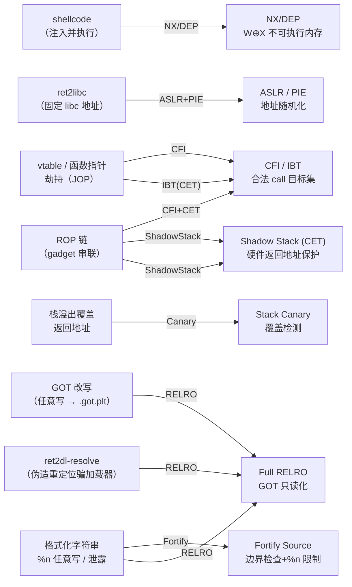

# 二进制漏洞与利用基础（12）· 缓解机制总览

> [!abstract] TL;DR
> - 前 11 篇每讲一类漏洞都顺带提及缓解机制。本篇把它们全部汇拢，梳理成一张**"攻击手法 → 对应缓解"全景图**，便于理解各机制的设计意图与残余风险。
> - 七大缓解机制：**NX/DEP**（挡 shellcode）、**ASLR/PIE**（挡固定地址）、**Stack Canary**（挡栈覆盖返回地址）、**RELRO/BIND_NOW**（挡 GOT 改写与 ret2dl-resolve）、**Fortify Source**（挡部分溢出与 `%n`）、**CFI**（挡间接调用劫持）、**Intel CET**（Shadow Stack + IBT，挡 ROP/JOP）。
> - 没有任何单一机制能单独防住一切；**纵深防御**是核心理念——多层机制叠加才能让利用成本急剧上升。
> - `checksec` 是读取目标二进制防护状态的首选工具，一行输出反映七维防护状态。
> - **系列 34《现代二进制防护机制》** 将对上述每项进行逐项深入讲解。

> [!warning] 教学环境声明
> 本系列示例演示时常需关闭现代防护（`-fno-stack-protector`、`-no-pie`、`-z norelro`、`-z execstack` 等）以复现教学现象。**生产环境这些防护默认开启**。本文所有内容用于理解漏洞成因与加固防御，请勿用于任何非授权测试。

---

## 概述与定位

前 11 篇沿着"漏洞类型 → 利用原理 → 缓解防御"的脉络逐篇展开：

| 篇章 | 漏洞/技术 | 引入的主要缓解 |
|---|---|---|
| 02 | 栈溢出 | Stack Canary、NX |
| 03 | Shellcode | NX/DEP |
| 04 | Stack Canary 原理 | Canary 细节与绕过前提 |
| 05 | ret2libc | ASLR + PIE |
| 06 | ROP | CFI、Shadow Stack/CET、ASLR |
| 07 | GOT 劫持与 ret2dl-resolve | Full RELRO、BIND_NOW |
| 08 | 格式化字符串漏洞 | Fortify Source、编译器 `%n` 限制 |
| 09–10 | 堆漏洞 | Heap metadata 保护、tcache guard |
| 11 | 整数溢出与类型混淆 | 编译器 UBSan、语言层安全整数类型 |

本篇承上启下：把上述机制**统一分类、梳理残余风险**，并指向 [[34.现代二进制防护机制/00.现代二进制防护机制总览]] 做逐项深入。

---

## 原理与机制

### 七大缓解机制：挡什么、被什么绕过、残余风险

#### 1. NX / DEP（不可执行内存）

| 维度 | 内容 |
|---|---|
| **挡什么** | 攻击者把 shellcode 注入栈/堆后直接执行 |
| **实现** | Linux：`PT_GNU_STACK` 无 `PF_X`，内核/MMU 把栈/堆页标记 `W^X`；Windows：DEP/`IMAGE_DLLCHARACTERISTICS_NX_COMPAT`（`/NXCOMPAT`）；硬件：Intel XD bit / AMD NX bit |
| **被什么绕过** | ret2libc、ROP——不注入代码，只复用已有的可执行代码页 |
| **残余风险** | 只要有可写可执行（`mmap(PROT_WRITE\|PROT_EXEC)` 或 JIT 缓冲区），NX 对该区域无效；`mprotect` gadget 可在运行时把内存改为可执行 |

Linux 编译确认：`gcc -o demo demo.c`（默认开启）；关闭（教学用）：`gcc -z execstack`。

#### 2. ASLR / PIE（地址空间随机化）

| 维度 | 内容 |
|---|---|
| **挡什么** | 固定地址的 ret2libc、ROP 链（gadget 地址硬编码）、GOT 改写（需先知道 GOT 所在地址） |
| **实现** | 内核随机化 mmap/栈/堆基址；PIE（`-fPIE -pie`）使主程序也享受 ASLR（`ET_EXEC` 主程序固定在 `0x400000`，无 ASLR）；完整机制见 [[14.动态链接与加载器详解/09.ASLR与位置无关代码.md]] |
| **被什么绕过** | 信息泄露漏洞（格式化字符串读栈上 libc 指针、UAF 读 fd 指针等）；fork 服务子进程继承父进程地址布局（暴力爆破熵） |
| **残余风险** | Linux 上 brk 堆熵仅约 13 bit；macOS DSC 系统库整体共享一个 slide，泄漏任意系统库地址即暴露全部；Windows 32 位约 8 bit 熵（较低） |

#### 3. Stack Canary（栈金丝雀）

| 维度 | 内容 |
|---|---|
| **挡什么** | 栈溢出覆盖函数返回地址（返回前检测 canary 是否被篡改） |
| **实现** | GCC `-fstack-protector-strong`：在函数入口从 `%fs:0x28`（TLS 段）读取随机 canary 压栈，返回前比对，不一致则调用 `__stack_chk_fail` 终止；原理详见 [[04.栈Canary原理]] |
| **被什么绕过** | 信息泄露读出 canary 值再原样覆盖；格式化字符串漏洞读 `%fs:0x28`；逐字节爆破（fork 场景） |
| **残余风险** | 只保护**线性覆盖到返回地址**的路径；帧指针（`%rbp`）溢出覆盖后 canary 检查通过也可能劫持控制流；`setjmp/longjmp` 不受保护 |

#### 4. RELRO / BIND_NOW（重定位只读）

| 维度 | 内容 |
|---|---|
| **挡什么** | GOT 改写劫持（直接覆盖 `.got.plt` 函数槽位）；ret2dl-resolve（伪造重定位结构骗加载器）；`.init_array`/`.fini_array` 改写 |
| **实现** | `-Wl,-z,relro`（Partial）：加载器 `mprotect` 锁定 `.got`（数据 GOT）；`-Wl,-z,relro,-z,now`（Full）：同时用 `BIND_NOW` 提前解析全部函数 GOT，再把 `.got.plt` 也锁只读；完整机制见 [[14.动态链接与加载器详解/15.加载器视角的安全.md]] 和 [[11.ELF文件详解/17.got节.md]] |
| **被什么绕过** | Full RELRO 不保护 `.data`/`.bss` 中的函数指针（malloc hook、C++ vtable 等）；DSO 自身的 Partial RELRO（如旧版 libc）；`__malloc_hook`/`__free_hook`（glibc < 2.34） |
| **残余风险** | Full RELRO 是"最彻底的 GOT 防线"但并非"终点"：`.data` 区域的函数指针、vtable 仍是合法攻击面 |

> [!warning] 工具输出为示意
> 下面 checksec 输出见"检测与工具"节，均为代表性示意，非本机实跑。

#### 5. Fortify Source（危险函数边界检查）

| 维度 | 内容 |
|---|---|
| **挡什么** | 部分栈/堆溢出（`strcpy`/`memcpy`/`sprintf` 等超过目标缓冲区大小）；`%n` 格式化字符串写（glibc 在 `FORTIFY_SOURCE` 下默认拒绝 `%n` 写入非只读格式串） |
| **实现** | `-D_FORTIFY_SOURCE=2 -O1+`：编译器将 `strcpy(dst, src)` 替换为 `__strcpy_chk(dst, src, dst_size)`，运行时越界则调用 `__chk_fail()` 终止；需编译器能静态推断目标大小 |
| **被什么绕过** | 编译器推断不出大小时（目标是指针、动态分配的 buffer）自动降级为无保护版本；`snprintf` 等函数本身安全的调用仍可被攻击者控制格式串 |
| **残余风险** | 对"大小已知"的固定数组有效，对动态分配路径无效；不能替代输入验证与安全编码 |

#### 6. CFI（控制流完整性）

| 维度 | 内容 |
|---|---|
| **挡什么** | 间接调用/跳转劫持（`call rax`、`jmp [rbx]`）——JOP（Jump-Oriented Programming）、vtable 劫持、函数指针覆盖 |
| **实现** | 粗粒度 CFI：LLVM/Clang `-fsanitize=cfi`，为每次间接调用插入目标类型合法性检查（type-based CFI）；粗粒度变体：Linux IBT 配合 `endbr64` 指令（见下 CET）；Windows CFG（`/guard:cf`）在运行时检查间接调用目标是否在合法函数入口集合 |
| **被什么绕过** | 粗粒度 CFI 只检查函数签名兼容性，攻击者可找到签名相同但语义不同的合法目标（type confusion 利用）；CFI 策略越细粒度越难绕过但开销越大 |
| **残余风险** | CFI 不保护**直接调用**和**返回地址**；需与 Shadow Stack 结合才能同时防 ROP（ret 劫持） |

#### 7. Intel CET：Shadow Stack + IBT

| 维度 | 内容 |
|---|---|
| **挡什么** | **Shadow Stack**：ROP 中的 `ret` 劫持（返回地址被覆盖）——影子栈中保存 `ret` 目标，函数返回时 CPU 硬件比对影子栈与实际栈，不一致则产生 `#CP` 异常；**IBT（Indirect Branch Tracking）**：JOP 与间接调用劫持——合法间接调用/跳转目标处必须有 `endbr64` 指令，否则触发 `#CP` |
| **实现** | GCC/Clang `-fcf-protection=full`（`branch` + `return`）；需 CPU 支持（Intel Ice Lake+ / Tiger Lake+）；Linux 内核 5.18+ 支持用户态 Shadow Stack（SHSTK）；Windows CET 从 Windows 10 21H1 + 第 11 代 Intel/AMD Zen 3 支持 |
| **被什么绕过** | 合法的 `endbr64` gadget 仍可被 IBT 允许（任意合法函数入口），只减少了可用 gadget 数量；Shadow Stack 对直接内存泄露/RCE 无效；JIT 代码需要 CET 感知才能正确运行 |
| **残余风险** | IBT 是粗粒度 CFI 的硬件实现，减少 gadget 库但无法完全消灭；Shadow Stack 是目前最接近"消灭 ROP"的机制，残余攻击面是 CET 未覆盖的特权切换路径 |

---

## 攻击手法 → 缓解机制映射图



> [!warning] 示例输出为示意
> Mermaid 图为教学示意，实际攻击手法与缓解机制的对应关系更复杂；单一手法往往同时被多个机制制约，且可能被信息泄露漏洞绕过 ASLR 后组合其他手法。

---

## 最小示例：教学环境下的对比

下面用一个最小化 demo 说明**打开与关闭防护的区别**。

```c
// mitig_demo.c（教学 demo，勿用于生产）
#include <stdio.h>
#include <string.h>

void vuln(const char *input) {
    char buf[32];
    strcpy(buf, input);     // 危险调用，无边界检查
    puts(buf);
}

int main(int argc, char **argv) {
    if (argc > 1) vuln(argv[1]);
    return 0;
}
```

```bash
# ===== 教学环境：关闭所有防护（复现教学现象） =====
gcc -o demo_unsafe mitig_demo.c \
    -fno-stack-protector \
    -no-pie \
    -z norelro \
    -z execstack \
    -O0
# 说明：这是教学环境配置，生产中绝对不能这样编译。
# 关闭 Canary：-fno-stack-protector
# 关闭 PIE：-no-pie
# 关闭 RELRO：-z norelro
# 开启可执行栈（让 shellcode 可执行）：-z execstack

# ===== 生产环境：默认开启所有防护 =====
gcc -o demo_safe mitig_demo.c
# GCC 现代版默认：-fstack-protector-strong, -pie, -z relro, NX
# 建议再加：-D_FORTIFY_SOURCE=2 -O2 -Wl,-z,relro,-z,now
```

> [!warning] 示例输出为示意
> 以上编译命令在 Linux 环境下运行，本机为 Windows，为示意。教学关闭防护选项**仅用于理解漏洞原理**，生产环境绝不应使用这些选项。

---

## 利用思路（原理层面）

理解缓解机制最有效的方法是看**攻击者如何逐层突破**：

1. **NX 已开启** → shellcode 直接执行失效 → 攻击者转向 ret2libc/ROP（复用已有代码）。
2. **ASLR + PIE 已开启** → libc/代码基址随机 → 攻击者需要**先信息泄露**获取 libc 地址，再计算 gadget 偏移。
3. **Stack Canary 已开启** → 线性栈溢出覆盖返回地址在函数返回时被检测 → 攻击者需先泄露 canary 值（格式化字符串、信息泄露）。
4. **Full RELRO 已开启** → GOT 不可改写 → 攻击者转向 `.data`/`.bss` 中的函数指针、堆上 vtable、malloc hook（旧版）。
5. **CFI + CET 已开启** → 间接调用和 `ret` 受保护 → gadget 数量大幅减少，间接调用目标集受限；利用难度指数级上升。

**信息泄露（information leak）是现代利用链的核心前置条件**：只要能泄露一个 libc 地址，ASLR + PIE 对库地址的随机化即被破解。这是 [[13.现代利用与信息泄露]] 的主题。

---

## 缓解与防御

### 纵深防御理念

没有任何单一机制能单独防住一切。每个机制都有残余风险：

| 机制 | 单独使用时的残余风险 |
|---|---|
| 仅 NX | ret2libc、ROP 仍可行 |
| 仅 ASLR | 无 PIE 时主程序地址固定；有信息泄露时失效 |
| 仅 Canary | 越过 canary 区域的非线性写（如堆漏洞）绕过 |
| 仅 Full RELRO | `.data`/`.bss` 函数指针仍可改写 |
| 仅 CFI | 不保护返回地址；粗粒度 CFI 可被签名兼容目标绕过 |
| 仅 Shadow Stack | 不保护间接调用；JOP 仍可构造 |

**纵深防御的价值**：NX + ASLR/PIE + Canary + Full RELRO + CFI + Shadow Stack 叠加时，攻击者面临的前提条件急剧增加——需要信息泄露、需要可控的间接跳转目标、需要绕过 canary、需要绕过 CFI，同时满足这些条件的利用链在工程上极为困难。

### 推荐最小防护清单

```bash
# Linux 推荐编译选项（生产环境）
# 各选项说明：
#   -fstack-protector-strong   Stack Canary（强保护）
#   -fPIE -pie                 PIE（配合 ASLR 随机化主程序基址）
#   -D_FORTIFY_SOURCE=2 -O2    Fortify Source（危险函数边界检查）
#   -Wl,-z,relro,-z,now        Full RELRO（锁 GOT）
#   -fcf-protection=full       CET IBT + Shadow Stack（需硬件支持）
#   -Wl,-z,noexecstack         NX（通常已默认，显式保险）
gcc -o binary source.c              \
    -fstack-protector-strong        \
    -fPIE -pie                      \
    -D_FORTIFY_SOURCE=2 -O2         \
    -Wl,-z,relro,-z,now             \
    -fcf-protection=full            \
    -Wl,-z,noexecstack
```

> [!warning] 示例输出为示意
> 以上为 Linux x86-64 + GCC 场景示意；`-fcf-protection=full` 需要 GCC 8+ 且目标 CPU 支持 CET。不同发行版、工具链版本默认选项有差异，请以 `checksec` 验证实际状态。

---

## 检测与工具

### checksec：如何读取与解读

```bash
checksec --file=./target
```

```text
[*] './target'
    Arch:     amd64-64-little
    RELRO:    Full RELRO
    Stack:    Canary found
    NX:       NX enabled
    PIE:      PIE enabled
    Fortify:  Enabled
```

> [!warning] 示例输出为示意
> 以上为代表性输出，非本机实跑（本机 Windows）。实际运行在 Linux 上；字段内容随编译选项而变。

各字段解读：

| 字段 | 强（安全）值 | 弱（风险）值 | 检测依据 |
|---|---|---|---|
| `RELRO` | `Full RELRO` | `Partial RELRO` / `No RELRO` | `PT_GNU_RELRO` 存在 **且** `DT_FLAGS` 含 `DF_BIND_NOW` |
| `Stack` | `Canary found` | `No canary found` | `.text` 中是否有 `__stack_chk_fail` 调用 + TLS canary 读取指令 |
| `NX` | `NX enabled` | `NX disabled` | `PT_GNU_STACK` 的 `p_flags` 是否含 `PF_X`（有 `PF_X` 则可执行栈） |
| `PIE` | `PIE enabled` | `No PIE (0x400000)` | ELF `e_type`：`ET_DYN` = PIE；`ET_EXEC` = 无 PIE |
| `Fortify` | `Enabled` | `Disabled` | 是否存在 `__memcpy_chk`/`__strcpy_chk` 等强化版函数符号 |

**五绿是基准线**——任何一项弱值都意味着对应攻击向量的门槛显著降低，应有意识地评估影响。

### 三平台一瞥：缓解机制的对应关系

| 机制 | Linux | Windows | macOS |
|---|---|---|---|
| **NX/DEP** | `PT_GNU_STACK` 无 `PF_X`；硬件 XD/NX bit | DEP（`/NXCOMPAT`，`IMAGE_DLLCHARACTERISTICS_NX_COMPAT`） | 硬件 XD/NX；`__TEXT` 不可写，`__DATA` 不可执行 |
| **ASLR** | 内核 mmap/brk 随机化；PIE = `ET_DYN` | `/DYNAMICBASE` + `HIGH_ENTROPY_VA`；强制 ASLR（策略） | 主程序 `MH_PIE`；系统库 DSC 整体 slide（每次重启随机） |
| **Stack Canary** | GCC `-fstack-protector-strong`（TLS `%fs:0x28`） | MSVC `/GS`（Security Cookie） | Clang `-fstack-protector-strong` |
| **GOT/IAT 保护** | Full RELRO（`-z relro -z now`）锁 `.got.plt` 只读 | IAT 无"只读化"标准；CFG + DEP 从间接调用方向防护 | Hardened Runtime + chained fixups；dyld arm64 近似 Full RELRO |
| **Fortify** | GCC/Clang `-D_FORTIFY_SOURCE=2` | MSVC 内置 `/sdl`（Security Development Lifecycle 检查） | Clang `-D_FORTIFY_SOURCE=2`（Xcode 默认） |
| **CFI** | LLVM `-fsanitize=cfi`；IBT（`-fcf-protection=branch`） | CFG（`/guard:cf`）；xFG（扩展 CFG，函数原型级别） | LLVM CFI + PAC（arm64，指针认证） |
| **Shadow Stack / ROP 防护** | Intel CET SHSTK（`-fcf-protection=return`）；Linux 5.18+ | Intel CET（Win10 21H1 + 11 代 CPU）；CETCOMPAT 标志 | arm64 PAC（`AUTIASP` 保护返回地址）；实质类似 Shadow Stack |

---

## 小结

1. **七大机制各有分工**：NX 挡代码注入、ASLR/PIE 挡硬编码地址、Canary 挡线性栈覆盖、Full RELRO 挡 GOT 改写、Fortify 挡已知危险函数、CFI 挡间接调用劫持、CET 挡 ROP/JOP。
2. **纵深防御是核心理念**：任何单一机制都有绕过路径；多层叠加使攻击者需要同时突破多个前置条件，利用工程难度指数级上升。
3. **信息泄露是现代利用的前置核心**：ASLR + PIE 在无信息泄露时极难绕过；[[13.现代利用与信息泄露]] 将专门讲解这一环节。
4. **`checksec` 是验工具**：五绿是最低基线，任何弱值需要有意识地评估对应攻击向量。
5. **系列 34 逐项深入**：本篇只给出"一句话概述"，[[34.现代二进制防护机制/00.现代二进制防护机制总览]] 将对每项机制的实现细节、绕过方法与加固策略做系统讲解。

---

## 相关阅读

- **缓解机制深入专题**：[[34.现代二进制防护机制/00.现代二进制防护机制总览]]
- **加载器视角的 RELRO 与 ret2dl-resolve 防御**：[[14.动态链接与加载器详解/15.加载器视角的安全.md]]
- **ASLR/PIE 机制详解**：[[14.动态链接与加载器详解/09.ASLR与位置无关代码.md]]
- **GOT 结构与攻防**：[[11.ELF文件详解/17.got节.md]]
- **上篇（漏洞类）**：[[11.整数溢出与类型混淆]]
- **下篇（现代利用）**：[[13.现代利用与信息泄露]]

---

⬅️ 上一篇 [[11.整数溢出与类型混淆]] ｜ 🏠 [[00.二进制漏洞与利用基础总览]] ｜ 下一篇 [[13.现代利用与信息泄露]] ➡️
