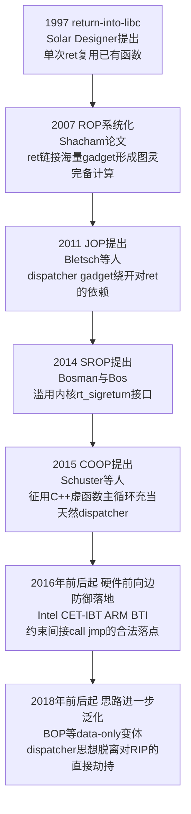
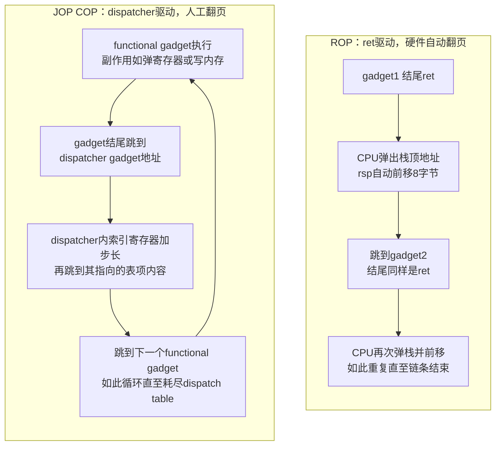
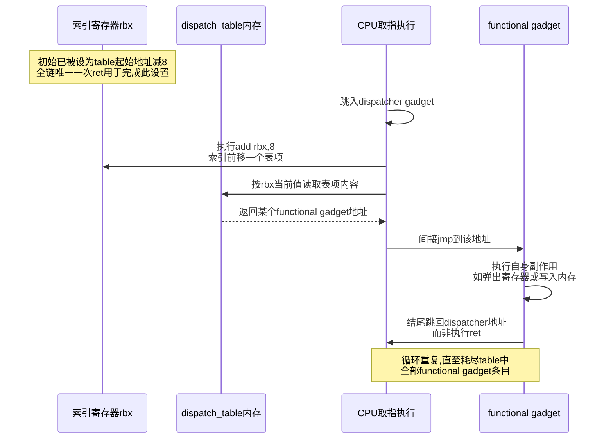
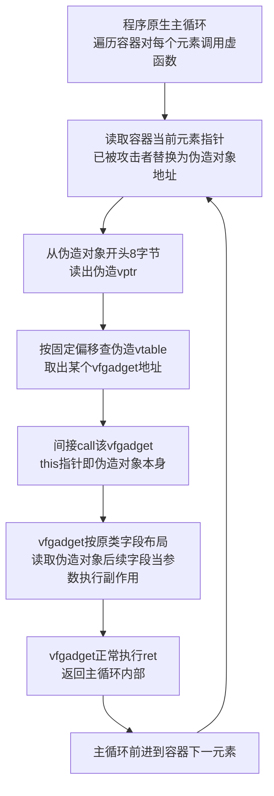

# 二进制漏洞与利用基础（13）· JOP与COP面向跳转与调用编程

> [!abstract] TL;DR
> - JOP（面向跳转编程）与 COP（面向调用编程）用间接 `jmp`/`call` 取代 `ret` 充当 gadget 之间的"粘合指令"，专门针对只保护"后向边"（`call`/`ret` 配对）的防御——影子栈、RAP 类方案对这类链条完全失明。
> - `ret` 能免费串联 gadget，是因为它一条指令同时完成"取下一跳地址"与"前移游标"两件事；`jmp`/`call` 没有这个副作用，JOP 必须靠一个专门构造的 **dispatcher gadget**（形如 `add idx, N; jmp [idx]`）人工补上这套"游标机制"，外加一张攻击者填好的 dispatch table。
> - COP 用 `call reg` 结尾的 gadget 串联，其在 C++ 场景下的特化形态 **COOP**（伪造面向对象编程）把程序里天然存在的虚函数调用主循环当成现成的 dispatcher，用伪造对象加伪造 vtable 串起一串"vfgadget"，能绕过只按类型/签名校验落点的前向边 CFI。
> - x86 上间接 `jmp`/`call reg` gadget 远比 `ret` 稀缺，JOP 链构造与自动化难度都高于 ROP；`__libc_csu_init` 里那条被 `ret2csu` 反复借用的 `call [r12+rbx*8]`，其实就是一个早已藏在 ROP 链里的 COP gadget。
> - Intel CET 的 IBT 与 ARM 的 BTI 是专门针对 JOP/COP"前向边"问题诞生的硬件防御，强制间接分支落点必须是 `ENDBR64`/`BTI` 指令；但合法虚函数入口本身就带有这些标记，COOP 在很大程度上仍能绕过纯落点级检查，需要类型敏感的细粒度 CFI 才能压制。
> - 本文只讲原理与检测/缓解视角，不提供可直接打真实目标的成品链，实践请限定在自有环境与 CTF 靶场。

## 概述与定位

JOP（Jump-Oriented Programming，面向跳转编程）与 COP（Call-Oriented Programming，面向调用编程）是同一思路的两个变体：都属于"代码复用攻击"（code-reuse attack）家族，都是在 NX/DEP 堵死"注入新代码"这条路之后，靠拼接目标程序或其依赖库里已经存在的指令片段来实现任意计算；但与前几章讲的经典 ROP 不同，JOP/COP 刻意避开 `ret` 指令，转而用间接 `jmp`（JOP）或间接 `call`（COP）把一个个 gadget 串起来。这个选择看似只是"换了一条粘合指令"，实际触及的是控制流劫持防御体系里一条相当根本的分界线——"后向边"（backward edge，典型是函数返回，`call`/`ret` 配对）与"前向边"（forward edge，典型是函数调用/跳转，控制流"向前"落到某个目标）。上一章 [[12.SROP信号帧伪造]] 讲的 SROP，是绕开"gadget 稀缺"问题的一条捷径——它压根不在 CPU 指令层面拼凑 gadget，而是直接找内核 `rt_sigreturn` 这个特权接口一次性覆写全部寄存器；本章的 JOP/COP 则是几乎相反的思路：仍然老老实实在指令级别拼接目标程序里现成的代码片段，只是换了一种不依赖 `ret` 的拼接方式。二者都可以归入"传统 ROP 之外的另类代码复用"，但一个是绕开 CPU 指令语义本身、一个是绕开 `ret` 这一种具体指令，值得对照理解，也是本系列把二者相邻编排的原因。

JOP 由 Tyler Bletsch、Xuxian Jiang 等人在 2011 年 ASIACCS 会议上以论文《Jump-Oriented Programming: A New Class of Code-Reuse Attack》系统提出，研究动机很直接：当时业界已经出现"专门检测/阻断 `ret` 序列"的防御思路——无论是硬件影子栈的早期研究原型，还是像 grsecurity RAP 那样用编译期插桩给返回地址加密/校验的方案，或者更简单的运行时启发式（监控短时间内是否发生了异常密集的 `ret` 执行）——这些方案统一把矛头指向"后向边"，因为经典 ROP 百分之百依赖 `ret` 链接 gadget。JOP 的应对方式是釜底抽薪：既然防御只盯着 `ret`，那就不用 `ret`。COP 及其在 C++ 场景下的特化形态 COOP（Counterfeit Object-oriented Programming，伪造面向对象编程，Felix Schuster 等人 2015 年 IEEE S&P 提出）沿着同一条思路继续往前走，把"前向边"本身也做出了细分：COOP 证明就算把 forward-edge CFI 做出来，只要校验逻辑停留在"类型/签名是否匹配"这个层面而不深究"这个对象是不是真的由程序合法创建的"，攻击者依然可以用完全合规的假对象把整条控制流悄悄接管。

放进本系列的坐标系里看，JOP/COP 与 ROP（[[06.ROP入门]]、[[07.ROP进阶：ret2csu与通用gadget]]）、SROP（[[12.SROP信号帧伪造]]）三者共同构成"控制流劫持之后如何把有限的代码复用能力兑现成图灵完备计算"这一问题的三种答案，是本系列从"基础栈/堆漏洞"迈向"现代防护绕过"（第 14 章起）之前的收尾章节。放进更大的防御史坐标系里看，JOP/COP 研究直接催生了 Intel CET 的 Indirect Branch Tracking（IBT）与 ARM 的 Branch Target Identification（BTI）——这两项如今在新款 CPU 上默认开启的硬件特性，本质上是"后向边有影子栈保护了，前向边也得补上等价的东西"这句话的工程落地。下面这张图给出从 `ret2libc` 到硬件级前向边防御的大致演进脉络，帮助把本章放进正确的时间坐标：



需要先说明本章的边界：JOP/COP 解决的是"链接机制"问题——也就是拿到一次控制流劫持原语之后，怎样在不依赖 `ret` 的前提下把零散 gadget 串成连贯执行序列；它不解决"如何拿到第一次控制流劫持"（仍然需要前面章节的栈溢出、堆漏洞等原语），也不天然绕过 ASLR/Canary/RELRO 等前置防御——这些仍是 [[14.Canary泄露与绕过]]、[[15.ASLR与PIE绕过技术]] 要讨论的独立问题。本章聚焦 x86-64 场景讲透原理与构造方法，ARM 上 `bx`/`blx` 间接分支带来的差异性只做机制性对比，架构专属细节留给 [[21.ARM64与MIPS架构利用差异]] 展开。

## 原理与机制

### 控制流劫持的三种"齿轮"：ret、间接jmp、间接call

从 CPU 微架构角度看，能让攻击者把执行流"掰"向任意地址的间接分支一共只有三类，理解它们各自的语义差异是理解 JOP/COP 存在意义的前提：

- **`ret`**：从当前栈顶弹出一个 8 字节（x86-64，32 位下为 4 字节）的值，把它当地址跳过去，同时栈指针 `rsp`/`esp` 自动加 8/4——一条指令同时完成"取跳转目标"和"把游标移到下一个位置"两件事。
- **间接 `jmp reg` / `jmp [mem]`**：把寄存器里的值，或从内存某处取出的值，当地址跳过去，除此之外**不产生任何附带效果**——不出栈、不移动任何"游标"、不保存任何返回信息。
- **间接 `call reg` / `call [mem]`**：跳转目标的取法和 `jmp` 一样，但会先把"该 `call` 指令的下一条指令地址"压入栈顶，作为将来某次 `ret` 的返回地址——这一点让它比 `jmp` 多了一丝和 `ret` 世界的联系。

ROP 之所以能把成百上千个零散 gadget 拼成一条连贯的执行序列，靠的正是 `ret` 这个"顺手"的副作用：只要攻击者把一串地址挨个码在栈上，每次 `ret` 弹出一个、`rsp` 自动前移到下一个，下一次 `ret` 弹出的自然就是下一个地址——攻击者完全不需要额外指令去维护游标，CPU 硬件本身就在替他做这件事。这也是 ROP gadget 的选取标准如此简单的原因："只要以 `ret` 结尾就能拼进链里"，因为链接动作本身是免费的，攻击者只需要关心每个 gadget 中间那一小段指令做了什么。

如果防御手段专门盯上了这条"免费的午餐"——影子栈把每次 `call` 压栈的返回地址额外记一份在攻击者摸不到的隔离栈上，每次 `ret` 都拿当前栈顶和影子栈顶比对，不一致就直接终止进程——`ret` 就从"免费的粘合剂"变成了"一碰就断的引信"：哪怕攻击者能在普通栈上摆好任意数据，只要这些数据不是由一次合法的 `call` 压栈产生的，`ret` 到它就会被硬件当场拦下。这正是 JOP/COP 要解决的问题：既然 `ret` 这条路不安全了，能不能只用 `jmp`/`call` 也拼出同样连贯的 gadget 链？

### 问题的核心：间接跳转不会自己"翻页"

把 `ret` 换成 `jmp reg` 看似只是换了一条指令，但立刻会撞上一个结构性障碍：`jmp reg` 执行完，控制流确实按攻击者意愿转移了，可**没有任何机制会自动把 `reg` 更新成"下一个该跳的地址"**——不像栈指针那样，CPU 电路里没有内建的"间接跳转索引寄存器自动递增"这回事。如果什么都不做，攻击者精心挑选的第一个 gadget 执行完、再次走到 `jmp reg` 时，`reg` 里还是原来那个值，控制流会原地死循环，而不是"前进到下一个 gadget"。

这正是 dispatcher gadget 要解决的确切问题：既然硬件不会替攻击者维护"下一跳在哪"，那就用一小段代码片段手工实现一个等价物——挑一个通用寄存器当作"伪程序计数器"（下文称索引寄存器），让它指向内存里一张攻击者提前布置好的地址表（dispatch table），每次跳转前先把索引寄存器加上一个固定步长（通常等于指针宽度，x86-64 下是 8 字节），再从表里当前位置取出下一个 gadget 地址、间接跳过去。只要每个"干活"的 gadget 完成自己的任务后都乖乖把控制流交还给这个 dispatcher，索引寄存器就会像 `rsp` 在 ROP 里那样一步步前移，整条链条就能连贯地跑下去。可以把它类比成：`ret` 驱动的 ROP 里，CPU 自带一台"自动翻页机"；`jmp`/`call` 驱动的 JOP/COP 里，这台翻页机不存在了，攻击者必须自己找一段代码充当"翻页员"——dispatcher gadget 就是这个翻页员的代码实现，dispatch table 就是被翻阅的那本"剧本"，某些资料也把这一整套结构叫作"跳板"（trampoline）。这一节先建立概念，下一节给出具体指令层面的构造。

### COP 与 ROP 世界的一丝联系：call 会压栈

COP 走的是另一条略有不同的路：既然 `call reg` 结尾的 gadget 在跳转前会先把返回地址压到当前栈顶，这就意味着"这次调用最终执行到某条 `ret` 时，会弹出这个压栈的地址"——如果攻击者恰好也控制着此刻的栈内容（比如整条链本来就建立在一次栈迁移之后的可控内存上），一个 `call reg` gadget 用完、其内部（或它调用到的函数）最终 `ret` 时，控制流会重新回到攻击者摆在栈上的下一个 ROP 地址，即 COP 的 `call` gadget 用完之后可以"跳回" ROP 世界，形成混合链（hybrid chain）。这也是为什么 COP 与经典 ROP 的界线在实战中并不像 JOP 那样泾渭分明：很多实战链条其实是"以 `ret` 为主、中间插入一两个 `call reg` 去触达某个只能通过寄存器间接调用的目标（比如某个函数指针、某个 vtable 项）"。[[07.ROP进阶：ret2csu与通用gadget]] 里反复借用的 `__libc_csu_init` 内部那条 `call qword ptr [r12+rbx*8]`，本质上正是一个教科书式的 COP gadget，只是当时没有专门点名它属于"COP"范畴——这也说明 COP 技巧在 x86-64 pwn 实战里其实早就无处不在，只是往往被当成"ret2csu 的一个步骤"而非独立技术看待。

三种链接机制放在一起横向对比，差异会更清楚：

| 技术 | 链接指令 | 核心链接机制 | 主要绕过的防御 | 典型弱点 / 仍会被什么挡住 |
| --- | --- | --- | --- | --- |
| ROP | `ret` | 栈指针由硬件自动前移 | NX/DEP | 影子栈、RAP 等后向边校验 |
| JOP | 间接 `jmp` | 手工 dispatcher gadget + dispatch table | 只护后向边的方案（影子栈等） | 索引寄存器约束导致 gadget 稀缺；CET-IBT/BTI 要求落点为 `ENDBR`/`BTI` 指令 |
| COP | 间接 `call` | 同 JOP，且 `call` 天生压栈可拼回 ROP | 同 JOP，并可复用 ROP 已有基础设施 | 同 JOP；落点若为普通函数中段同样受 IBT/BTI 约束 |
| COOP | C++ 虚函数间接 `call` | 程序原生虚调用主循环充当 dispatcher | 仅按类型/签名校验落点的前向边 CFI | 类型/实例敏感的细粒度 CFI；PAC 对 vtable 指针签名 |

下图把 ROP 与 JOP/COP 的链接过程摆在一起对比，直观呈现"硬件自动翻页"与"人工搭建翻页机制"这两种模式的区别：



## Dispatcher机制与Gadget链构造详解

### x86-64 下 dispatcher gadget 的典型形态

以 `rbx` 作索引寄存器、8 字节指针宽度为例，一个最小可用的 dispatcher gadget 大致长这样：

```asm
dispatcher:
    add     rbx, 8            ; 索引寄存器前移一个表项
    jmp     qword ptr [rbx]   ; 取出该表项内容(某functional gadget地址)并跳过去
```

与之配套，每个"干活"的 functional gadget 在完成自己的副作用后，末尾不再是 `ret`，而是直接跳回 dispatcher 的地址，把"翻页"这件事重新交还给它：

```asm
functional_pop_rax:
    pop     rax
    jmp     dispatcher        ; 而不是ret——把控制流交还dispatcher而非弹栈返回

functional_write_mem:
    mov     qword ptr [rdi], rax
    jmp     dispatcher
```

dispatch table 本身是一段攻击者完全掌控的可写内存，按执行顺序摆放各 functional gadget 的地址：

```
高地址
  ...
dispatch_table:
    +0x00: &functional_pop_rax     ; 索引寄存器第一次自增后落到这里
    +0x08: &functional_write_mem   ; 第二次自增后落到这里
    +0x10: &functional_set_arg     ; 依此类推
    +0x18: &cop_call_gadget        ; 末尾常是一个COP的call gadget,触达system/execve等
  ...
低地址
```

把这几段拼起来看，完整流程是：攻击者先把索引寄存器（这里是 `rbx`）设为 `dispatch_table - 8`，再把控制流交到 dispatcher 地址——dispatcher 执行 `add rbx,8`，`rbx` 恰好指向 `dispatch_table[0]`，随即 `jmp [rbx]` 跳到 `functional_pop_rax`；它弹出一个由攻击者预先摆在栈顶的值到 `rax`，随后 `jmp dispatcher` 把控制权还回去；dispatcher 再次 `add rbx,8`，`rbx` 指向 `dispatch_table[1]`，跳到 `functional_write_mem`……如此往复，直至耗尽整张表。这里有一个容易被忽略却很关键的细节：**JOP 并不意味着整条攻击链自始至终一次 `ret` 都不出现**，而是说负责把 functional gadget 串起来的核心链接机制不依赖 `ret`——如果攻击者最初就是通过栈溢出劫持了某次函数返回，那第一跳往往仍然是一次 `ret`（把 `rbx` 设好初值、再 `ret` 到 dispatcher 地址），只是这唯一一次 `ret` 之后，剩下所有链接动作全部改用 `jmp`。这对"运行时是否发生了异常密集的连续 `ret`"这类启发式检测依然有效，因为绝大多数链接动作确实不再产生 `ret`；但如果目标部署的是影子栈这种逐次强校验机制，这唯一一次初始 `ret` 同样会被挡下，此时必须找到一条完全不经过 `ret` 的路径直接进入 dispatcher（例如利用某个已经被攻击者控制内容的间接调用点直接触达），这对初始劫持原语提出了更高要求。

下面用时序图展示 dispatcher 循环内部若干轮迭代的执行顺序，帮助建立"索引寄存器如何一步步前移、每一步具体做了什么"的直观印象：



### 索引寄存器的"寄存器压力"：为什么 JOP 链比 ROP 链更难搭

ROP 中 `rsp` 由硬件托管，几乎不会被 gadget 意外破坏（除非 gadget 本身存在 `push`/`pop` 不平衡，这类 gadget 一般会在筛选阶段被直接排除）；JOP 中索引寄存器只是一个普通通用寄存器，一旦选定，整条链上所有 functional gadget 都必须"手下留情"——不能覆写这个寄存器（除了 dispatcher 自己那条 `add` 指令），这对 gadget 筛选构成了显著更强的约束。举例来说，如果选 `rbx` 作索引寄存器，整条链就不能再使用任何"顺带清空或覆写了 `rbx`"的 functional gadget，即便这个 gadget 其余部分的副作用正是攻击者需要的——要么放弃它，要么在使用前后插入额外 gadget 把 `rbx` 的值备份、恢复，这进一步拉长了链条、消耗了本就稀缺的可用 gadget 资源。这也解释了为什么给 JOP 做自动化编译工具远比给 ROP 做自动化工具难产：ROP 的搜索空间只需要保证"以 `ret` 结尾"这一个条件，JOP 的搜索空间则要同时满足"以间接 `jmp`/`call` 结尾"与"不破坏索引寄存器"两个条件的交集，可用 gadget 的绝对数量通常会有数量级的下降——Bletsch 等人在原始论文里也给出了一个配套的原型编译器（论文里称作"q"），但相比后来 ROP 领域出现的成熟自动化工具（如 angrop、ropium），JOP 链的自动合成至今仍更多停留在半手工、需要人工介入调整的阶段。

### x86 与 ARM 的 gadget 供给差异

在 x86 上，`ret` 出现在几乎每个函数的尾声（标准调用约定的函数收尾、C++ 析构函数、编译器生成的各种 thunk 都会用到它），而间接 `jmp`/`call reg` 相对少见得多，主要集中出现在几类场景：编译器为 `switch`-`case` 生成的跳转表（`jmp [table + reg*8]`）、动态链接的 PLT 桩（`jmp qword ptr [rip+disp]`，用于延迟绑定）、C++ 虚函数调用（`call qword ptr [rax+offset]`）、以及显式的函数指针回调调用。这意味着在同一个二进制里，可用作 JOP/COP 链接点的候选指令天然比可用作 ROP 链接点的候选指令少得多。相比之下，ARM 体系（尤其是 32 位）没有一条与 x86 `ret` 完全对等、专门"弹栈跳转"的指令，函数返回惯用 `bx lr`（跳转并与链接寄存器交换指令集状态）或 `pop {..., pc}` 这类形式实现，其中 `bx`/`blx reg` 本身就是一种间接分支，加上 ARM 上 PLT 桩、跨指令集互操作 veneer、函数指针回调同样普遍使用寄存器间接跳转/调用，使得"以间接分支结尾的片段"在 ARM 二进制里的密度天然高于 x86——这也是文献中常把 JOP 视为在 ARM 上更"顺手"的代码复用手段的原因，具体寄存器命名与触发指令上的差异留给 [[21.ARM64与MIPS架构利用差异]] 详细展开。

### 无独立 dispatcher 的变体与 gadget 挖掘的字节级本质

dispatcher gadget 不一定非要是一个独立、专门搭建的两条指令片段：只要某个 functional gadget 执行完之后自身末尾恰好就是"跳到索引寄存器指向的下一个地址"，并且它在结束前顺带完成了"让索引寄存器指向下一跳"的效果，就可以让 dispatcher 与 functional gadget 合二为一，省去专门找一段纯粹的 dispatcher。此外，与 ROP gadget 挖掘同源，x86 变长指令编码意味着间接 `jmp`/`call` gadget 同样可以从"非预期指令边界"里挖出来——`0xFF /4`（`jmp r/m`）、`0xFF /2`（`call r/m`）这类操作码字节，完全可能落在另一条更长指令的中间，被反汇编器从错位的字节偏移重新解释出一条全新的间接跳转/调用指令，这与 Shacham 2007 年论文对 x86 变长编码的经典利用如出一辙，只是目标操作码从 `0xC3`（`ret`）换成了 `0xFF` 系列。PLT 桩本身在动态链接程序里几乎必然存在，某些场景下可以被直接当作"现成的单跳 JOP 出口"使用——只要能控制对应 GOT 项的内容，一次跳到 PLT 桩就等价于一次间接跳转到攻击者指定地址，这某种意义上是 [[16.GOT劫持与ret2dlresolve]] 与 JOP 思路的交汇点。

### COOP 深潜：把 C++ 虚函数机制整体收编为 dispatcher

C++ 虚函数调用的标准实现（Itanium C++ ABI，几乎所有 x86-64 Linux 上的 g++/clang 都遵循）是：每个含虚函数的类实例，其对象内存布局最前面 8 字节（32 位下 4 字节）是一个隐藏的 vtable 指针（vptr），指向一张只读的虚函数表；每次通过基类指针/引用调用虚函数，编译器生成的代码大致是"从对象起始地址读出 vptr，再从 vptr 指向的表里按固定偏移取出函数地址，间接 `call` 这个地址，并把对象自身指针（`this`）作为隐式第一参数传入"。COOP 的洞察相当简练：如果程序里本就存在一段"遍历一个容器、对每个元素调用一次虚函数"的循环（这种写法在解析器、渲染引擎、序列化框架等大量真实 C++ 代码里极其常见，可以类比成对某个 `vector<Base*>` 逐个调用 `handle()` 编译出来的样子），这段循环本身在机器码层面就是一个天然、合法、不需要攻击者额外拼凑的"dispatcher"——它自带循环递增（容器下标或迭代器前移）、自带间接跳转（虚函数调用）、执行完一次虚调用后自动前进到下一个元素。

攻击者要做的只是：在自己能控制内容的堆内存上伪造一批"假对象"——每个假对象不需要任何真实字段，只需要开头 8 字节是一个指向"假 vtable"的指针；这张假 vtable 本身也是攻击者在可控内存里伪造出来的一张函数指针数组，但数组里填的每一项都不是攻击者凭空编的机器码，而是**目标程序或其依赖库里真实存在的、某个类的真实虚函数入口地址**——论文里称这些被选中复用的虚函数为 **vfgadget**（virtual function gadget）。只要能把这批假对象塞进程序原有的容器（例如通过一次 UAF、类型混淆或缓冲区溢出把容器元素替换成假对象的地址），主循环下一次跑到这个位置时，就会老老实实地把它当成一个合法对象，读出假 vptr、查假 vtable、间接 `call` 到攻击者选定的 vfgadget——虚调用天然携带的 `this` 指针（此刻指向攻击者伪造的假对象本身）还能充当"参数传递通道"：假对象里除了开头的假 vptr 字段，后面紧跟的字节完全由攻击者定义，vfgadget 内部如果按照它原本类的字段布局去读这些字节当参数用，攻击者就等于借用了原程序的类型系统，把参数悄悄塞了进去。每个 vfgadget 执行完照常 `ret`，函数返回后主循环继续前进到容器的下一个元素——下一个假对象、下一张假 vtable、下一个 vfgadget，如此往复，直到构造出完整的攻击链：

```
攻击者可控堆内存：

fake_obj_1:
    +0x00: &fake_vtable_1        ; 伪造vptr,指向下方伪造vtable
    +0x08: 参数字段A               ; vfgadget按原类字段偏移读取,充当隐式参数
    +0x10: 参数字段B

fake_vtable_1:
    +0x00: &real_vfgadget_alpha   ; 程序或依赖库里真实存在的虚函数入口
    ...

fake_obj_2:
    +0x00: &fake_vtable_2
    ...
```



这一机制之所以在学术上引发很大关注，根源在于它精准踩在了当时"forward-edge CFI"的软肋上：多数 CFI 方案对间接调用点的校验逻辑，本质是"调用点的静态类型允许调用哪些函数，就放行落在这些函数入口上的跳转"，这类校验完全建立在**类型/签名层面**，并不检查"当前这个对象是不是运行时真的由 `new` 出来、是不是真的经历过构造函数初始化"。COOP 里的假对象、假 vtable 全部由攻击者在数据段伪造，但由于假 vtable 里填的地址无一例外都是程序里真实存在、类型也确实匹配调用点期望的虚函数入口，任何只做"类型层面落点校验"的 forward-edge CFI 在 COOP 面前都形同虚设——这也是 Schuster 那篇论文标题《On the Difficulty of Preventing Code Reuse Attacks in C++ Applications》想说的核心结论：只要 C++ 虚函数分发机制本身不做运行时对象身份认证，单靠约束"跳转目标类型是否匹配"这条思路就注定有天花板。

从工程角度看，COOP 相比手工 JOP/COP 还有一个额外优势：dispatch table 的位置不必与最初触发溢出/UAF 的那块内存绑定在一起——只要容器本身可达、可写，假对象可以来自堆喷射、可以分批投放，攻击者甚至不需要在单次溢出里一次性写完整条链，这给了链条构造更大的时间和空间自由度，也是它比经典 JOP 更"工程友好"的地方之一。

## 工具视角与实战

### 寻找 JOP/COP gadget：ropper 与 ROPgadget

`ropper` 明确区分了 gadget 类别，可以直接按类型检索以间接 `jmp`/`call` 结尾的片段：

```bash
# --jop 专门检索以间接jmp/call结尾、适合JOP/COP的gadget
ropper --file ./vuln --jop

# 只关心call形式(COP)可以进一步用文本过滤
ropper --file ./vuln --jop | grep -i "call"
```

`ROPgadget` 默认更偏向以 `ret` 结尾的搜索，但可以放宽深度、配合文本过滤间接跳转/调用类片段；`objdump` 反汇编全文搜索也能直接定位裸的间接 `call`/`jmp` 到寄存器或内存的位置，这类位置往往正对应 PLT 桩或虚函数分发点：

```bash
ROPgadget --binary ./vuln --depth 8 | grep -E "jmp|call"

objdump -d ./vuln | grep -E "call\s+\*|jmp\s+\*|call\s+q?word|jmp\s+q?word"
```

### 手工构造骨架

拿到候选 gadget 之后，剩下的工作是把索引寄存器初值、dispatch table 内容、触发链一次性摆好。下面是一段教学示意的骨架（地址均为占位符，仅用于展示各部件如何拼接，不指向任何真实二进制）：

```python
from pwn import *

context.arch = 'amd64'
elf = context.binary = ELF('./vuln')
io = process(elf.path)

# 以下地址均为占位符,实战需结合目标二进制/libc实际gadget定位替换
dispatcher      = 0x401300   # "add rbx, 8; jmp qword ptr [rbx]"
pop_rbx_ret     = 0x4011f0   # 全链唯一一次ret,用来把rbx设为table_addr-8
table_addr      = 0x404500   # bss等可写内存,用于存放dispatch table
func_pop_rax    = 0x401320   # functional gadget: pop rax; jmp dispatcher
func_write_mem  = 0x401340   # functional gadget: mov [rdi], rax; jmp dispatcher
cop_call_gadget = 0x401360   # COP收尾: call qword ptr [rax],触达目标函数

# dispatch table按执行顺序摆放各functional gadget地址
dispatch_table = flat(
    func_pop_rax,
    func_write_mem,
    cop_call_gadget,
)

offset = 72   # 溢出到返回地址前的填充长度,需结合具体目标测定
payload  = b'A' * offset
payload += p64(pop_rbx_ret) + p64(table_addr - 8)   # 全链唯一一次ret,设置索引寄存器初值
payload += p64(dispatcher)                          # 首次跳入dispatcher,rbx自增后指向table[0]

io.send(payload)
io.interactive()
```

需要提醒的是，真实场景里 `dispatch_table` 所在的内存往往不能和触发溢出的那次 payload 一起摆好——`table_addr` 处的内容通常需要借助一次独立的任意写原语提前写入（或者利用格式化字符串、堆写等其它漏洞），上面的骨架只展示了"索引寄存器初值设置 + 首次跳入 dispatcher"这一段核心逻辑，完整攻击往往是多个原语配合的结果。

### 自动化现状与调试核查清单

与 ROP 领域已经出现 angrop、ropium 这类相对成熟的自动合成工具相比，JOP/COP 链的自动化程度明显落后：Bletsch 等人原始论文里配套的原型编译器"q"更多是概念验证；2018 年前后 Ispoglou 等人提出的 BOP（Block-Oriented Programming）与配套工具 BOPC，把 dispatcher gadget 的思想进一步推广到"整个基本块"甚至完全脱离传统控制流劫持的数据导向攻击（data-only attack），是这套"人工翻页机"思想在学术上走得最远的延伸，已经超出本章范围，感兴趣可自行检索。实战中构造 JOP/COP 链，调试环节比 ROP 更依赖对寄存器状态的持续跟踪：

- 用 `gdb`/`pwndbg` 在每次进入 dispatcher 前后下断点，核对索引寄存器是否按预期步长前移，比事后靠程序行为反推更可靠。
- 常见失败模式包括：某个 functional gadget 意外覆写了索引寄存器导致链条"跑偏"；dispatch table 条目步长与指针宽度不一致（例如误用 4 字节步长搭 64 位链）导致读出的"地址"其实是拼接了两个相邻表项的垃圾值；dispatch table 尚未写入完毕就已经触发了第一跳，读到的是未初始化内存；目标已开启 CET/BTI，落点缺少 `ENDBR`/`BTI` 标记直接触发保护异常，表现为看似"无厘头"的 `SIGSEGV`——遇到这种情况应优先用 `checksec`/`readelf -n` 检查二进制的 CET/BTI 相关 ELF 属性标记，确认是否真的启用了前向边保护，再决定要不要调整 gadget 落点策略。

## 安全性与正确使用

JOP/COP 与其它前置防护机制大体正交：它不需要可写可执行内存，因此与 NX/DEP 完全兼容，本身正是"NX 生效之后代码复用继续可行"的一个具体例证；它同样不解决地址泄露问题，构造 dispatch table 与 gadget 地址仍然需要先绕过 ASLR/PIE（参见 [[15.ASLR与PIE绕过技术]]）；能否发生控制流劫持、能否覆盖到返回地址或触发任意写，是比"用什么指令链接 gadget"更前置的问题，与 Canary（[[14.Canary泄露与绕过]]）、RELRO 是否只读 GOT（[[16.GOT劫持与ret2dlresolve]]）之间不存在依赖关系，只是在"经典 ROP 走不通时的备选方案"这个问题上，三者常被放在一起比较。

真正与本章直接相关、值得深入的是"前向边"这一侧的防御演进，这也是本章标题里"后向 CFI 之外的思路"想强调的核心：

- **粗粒度 CFI 的天花板**：早期/工业界常见的粗粒度 CFI（例如 Windows CFG）把"所有曾经被取过地址的函数入口"合并成一个大的等价类，任意间接调用/跳转只要落在这个集合里任意一个成员上就放行。这类方案能挡住大部分"落在函数中段任意偏移"的经典 JOP gadget（因为它们通常要求落点必须是函数入口），却挡不住"直接调用一整个合法函数"这种更粗放的复用——本质上是把 COP 用来触达整段现成函数（而不是函数中段的碎片），这与链式 `ret2libc` 在思路上已经非常接近，只是链接指令换成了 `call`。
- **Intel CET 的 IBT（Indirect Branch Tracking）**：这是专门针对 JOP/COP"前向边"问题诞生的硬件机制，与保护 `ret`/后向边的影子栈（Shadow Stack）是同一套 CET 特性的两个独立子集。IBT 的规则很直接：任何一次间接 `call`/`jmp` 执行后，CPU 落地的第一条指令必须是 `ENDBR64`（64 位下）或 `ENDBR32`，否则立刻触发一次 Control-Protection 异常（`#CP`，向量 21）。这条指令在不支持 CET 的旧 CPU 上会被当作无害的 NOP 执行，因而具备向后兼容性；编译器只在函数入口、以及switch跳转表等确实可能成为间接分支落点的位置插入它，绝大多数函数中段的字节偏移不会有这个标记。用文字表述这套判定逻辑大致如下：

```
合法的间接call/jmp落点(经CET重新编译的代码):
    endbr64                  ; 机器码 F3 0F 1E FA,旧CPU上当作NOP执行
    push rbp
    mov  rbp, rsp
    ...

不合法的落点(经典JOP常见的函数中段偏移):
    ...                      ; 任意一条被当作gadget起点复用的指令
    pop  rax
    jmp  qword ptr [rbx]

CPU执行一次间接call/jmp时(IBT已开启的前提下):
    若落点第一条指令不是endbr64/endbr32
        -> 触发 #CP (Control-Protection Exception,向量21)
        -> Linux下默认表现为进程收到SIGSEGV而终止
    否则
        -> 正常放行,继续执行
```

  这意味着经典的、落在函数中段任意偏移的 JOP/COP gadget，在 IBT 开启后基本会直接被判死刑——攻击者被迫退回到只能复用"合法函数入口"这一类目标（也就是上面提到的、粗粒度 CFI 同样挡不住的整函数复用），可用的落点集合被压缩到函数级粒度，构链难度显著上升。需要留意的现实约束是：如果二进制或其依赖的某个模块没有按 CET 重新编译（缺少对应的 ELF `GNU_PROPERTY` 属性标记），运行时环境通常会对该模块弱化甚至豁免 IBT 校验，这也是 CET 至今没能在所有目标上百分之百生效的现实原因之一，实战中值得用 `checksec` 之类工具先确认目标是否真的启用。
- **ARM BTI 与 PAC**：ARMv8.5-A 引入的 BTI（Branch Target Identification）与 CET-IBT 思路一致，要求特定"受保护页"上的间接分支必须落在 `BTI` 指令上，但比 CET 多了一层落点类型区分——`BTI c` 只允许 `call` 类间接分支落地、`BTI j` 只允许 `jmp` 类落地、`BTI jc` 两者都允许，粒度上比 CET 单一的 `ENDBR` 标记更细，理论上能在一定程度上分别约束 JOP 与 COP 两种变体各自的落点集合。ARM 同时提供的指针认证（PAC，Pointer Authentication Code）则是另一个维度的补强：它可以对返回地址之外的普通数据指针、函数指针乃至 vtable 指针本身做加密签名（例如苹果 arm64e ABI 里对 vtable 指针的签名保护），一旦某个指针的签名校验不通过，硬件会在真正解引用之前就产生异常。这个方向比单纯的落点检查更贴近 COOP 问题的本质，因为它验证的是**指针数据本身**的合法性，而不只是"最终落脚点恰好是哪种指令"——对付"vtable 指针是伪造的，但指向的函数确实合法"这类攻击，落点检查天生无能为力，指针签名才是对症的方向。
- **COOP 为何能穿透落点级检查**：这一点值得单独强调，也呼应本章开头提出的问题——COOP 里每一次间接 `call` 落地的都是**真实存在、类型也确实匹配**的虚函数入口，这些入口本来就需要支持被间接调用，编译器一定会在它们身上打上 `ENDBR`/`BTI` 标记，所以 CET-IBT、ARM 朴素版 BTI 这类只做"落点是否带有合法标记"检查的机制，对 COOP 基本不设防。真正能限制 COOP 的，是能把"调用点的静态类型上下文"与"运行时被调用对象的真实类型"关联起来的细粒度 forward-edge CFI（例如结合完整类层次分析、每个虚调用点单独维护允许目标集合），或者前面提到的对 vtable 指针本身做签名认证——二者思路不同，但共同点是都跳出了"只看落点指令"这个层面，开始关心"这次调用背后的对象身份是否可信"。
- **研究前沿的提醒**：即便同时部署了完整的前向边与后向边 CFI，也并不代表控制流劫持问题被彻底终结——Carlini 等人在《Control-Flow Bending: On the Effectiveness of Control-Flow Integrity》（USENIX Security 2015）中系统展示了即使面对相当完整的 CFI 部署，攻击者仍可能通过精心挑选"CFI 允许范围内的合法路径组合"或转向不直接劫持 `RIP`/`PC` 的数据导向攻击达成等价效果——这也是本系列反复强调"没有单一防护是银弹"的原因，前向边防御补齐了 JOP/COP 这一类攻击面，但防御与攻击的博弈并未就此终止。
- **CPI/CPS**：Kuznetsov 等人提出的 Code-Pointer Integrity/Separation 是另一条研究路线，思路是把所有代码指针（返回地址、函数指针、vtable 指针）集中存放在一块与普通数据隔离的安全内存区域，任何对代码指针的读写都强制经过校验——理论上能同时覆盖后向边与前向边，但需要较重的编译期改造与运行时开销，工业界落地程度不如 CET/BTI 广泛，这里作为研究参照一并提及。

> [!caution] 使用边界
> 本文所述 JOP/COP/COOP 原理、gadget 结构与代码骨架仅用于自有环境、经授权的安全研究以及 CTF/pwn 靶场的教学与练习。文中出现的地址、偏移、gadget 位置均为示意性占位符，不构成针对任何真实生产系统或他人资产的可用攻击载荷，也不提供绕过任何商业软件授权或保护机制的武器化步骤。将本文所述技术用于未经授权的目标属于违法行为；本章始终站在防御与教育视角讨论该技术的原理、检测与缓解方式，不应被用于对真实目标的武器化攻击配方。

从检测角度看，JOP/COP 链条在运行时会表现出与正常程序控制流明显不同的特征：短时间内密集出现的间接 `jmp`/`call`、频繁跳转到同一个"dispatcher 地址"、间接调用落点与调用点静态类型明显不符——基于 Intel PT（Processor Trace）等硬件级控制流追踪能力构建的运行时监控，理论上可以对这类模式做启发式识别，代价是较高的性能与工程开销，因此更多用于事后取证或高价值目标的重点防护，而非默认全量开启。作为一项在学术界被系统化研究、并在 CTF/pwn 教学中被广泛使用的技术，JOP/COP/COOP 的价值更多体现在帮助防御者理解"仅仅护住后向边远远不够"，从而在设计防护策略时把前向边 CFI、CET-IBT/BTI、指针签名这类机制纳入统一考量。

## 小结

JOP/COP 的核心心智模型可以浓缩成一句话：**`ret` 之所以能免费串联 gadget，是因为它把"取下一跳"与"游标前移"焊在了一条指令里；`jmp`/`call` 没有这个焊接，JOP 靠一个专门构造的 dispatcher gadget 外加一张攻击者填好的 dispatch table，人工把这套机制补齐，COP 则借 `call` 天生压栈的特性，让链条能在 ROP 与"面向调用"之间自由切换；COOP 进一步证明，当目标程序自身就存在一段合法的虚函数分发循环时，攻击者甚至不需要自己搭 dispatcher——直接征用程序原生的控制流结构充当免费的 dispatcher 即可**。这套思路之所以成立、之所以重要，根源都在于它精准踩在了"只保护后向边"这类防御的盲区上——这也是 CET-IBT、ARM BTI 这些前向边硬件防御被发明出来的直接原因，而 COOP 又反过来说明，仅仅约束"落点指令类型"依然不是终点，指针身份与对象身份层面的校验才是更根本的方向。实战中判断要不要上 JOP/COP，一个实用的经验法则是：当目标部署了影子栈或类似的强 `ret` 校验、经典 ROP 链的链接动作本身会被拦截，或者目标恰好缺乏足够的 `pop;ret` 类 gadget 却有不少间接 `jmp`/`call` 时，JOP/COP 值得一试；但受限于间接跳转/调用类 gadget 天然稀缺、索引寄存器带来的额外约束，构链复杂度与调试成本通常高于同等效果的 ROP 链，自动化工具链也远不如 ROP 成熟，这是实战中需要提前评估的成本。至此，本系列已经把 ROP、SROP、JOP/COP 三条"控制流劫持之后如何兑现代码复用能力"的路线讲完，往后几章要讨论的 Canary、ASLR、GOT 劫持等绕过技术，大多仍然构建在"已经能拼出一条 gadget 链"这一前提之上，JOP/COP 在其中扮演的角色，是当 `ret` 这条路被专门堵死时，仍能守住的最后一道代码复用手段。

## 相关阅读

- [[00.二进制漏洞与利用基础总览|系列总览]]
- [[06.ROP入门]] / [[07.ROP进阶：ret2csu与通用gadget]] — ROP 的 `ret` 链接方式与本章 dispatcher 机制的直接对照；`__libc_csu_init` 里的 `call [r12+rbx*8]` 就是一个隐藏的 COP gadget
- [[08.栈迁移与stack pivot]] — dispatch table 的可控内存布置常与栈迁移技巧配合使用
- [[12.SROP信号帧伪造]] — 同为"传统 ROP 之外的另类代码复用"，可对照理解"绕开 ret 指令"与"绕开 CPU 指令语义直接滥用内核接口"两条不同路线
- [[14.Canary泄露与绕过]] — 下一章
- [[16.GOT劫持与ret2dlresolve]] — PLT 桩作为现成单跳 JOP 出口，与 GOT 劫持思路的交汇点
- [[17.IO_FILE结构利用与FSOP]] — `_IO_FILE` 的 vtable 劫持与 COOP 的伪造对象加伪造 vtable 机制高度类似，可对照理解
- [[21.ARM64与MIPS架构利用差异]] — ARM `bx`/`blx reg` 间接分支带来的 gadget 供给差异、BTI/PAC 细节在此展开
- [[22.利用开发工具链：pwntools与ROPgadget]] — ropper/ROPgadget 检索 JOP/COP gadget 的工具细节
- [[34.现代二进制防护机制/00.现代二进制防护机制总览]] — CET-IBT/BTI/CFI 在整体防护体系中的位置
- [[11.ELF文件详解/17.got节]] — PLT/GOT 结构，理解间接跳转桩的前置知识
- [[52.Linux内核机制与内核利用/00.Linux内核机制与内核利用总览]] — 内核态同样存在的间接分支防护（如内核 CFI）可对照理解
- 学术与官方资料（不作外链，请自行检索）：Tyler Bletsch, Xuxian Jiang, Vince Freeh, Zhenkai Liang.《Jump-Oriented Programming: A New Class of Code-Reuse Attack》, ASIACCS 2011；Felix Schuster et al.《Counterfeit Object-oriented Programming: On the Difficulty of Preventing Code Reuse Attacks in C++ Applications》, IEEE S&P 2015；Nicholas Carlini et al.《Control-Flow Bending: On the Effectiveness of Control-Flow Integrity》, USENIX Security 2015；Kyriakos K. Ispoglou et al.《Block Oriented Programming: Automating Data-Only Attacks》, 2018；Intel® 64 and IA-32 Architectures Software Developer's Manual（CET 章节）；Arm Architecture Reference Manual（BTI/PAC 相关章节）；ropper 与 ROPgadget 官方文档

[[00.二进制漏洞与利用基础总览|⬆ 系列总览]] | [[12.SROP信号帧伪造|← 上一章]] | [[14.Canary泄露与绕过|→ 下一章]]
