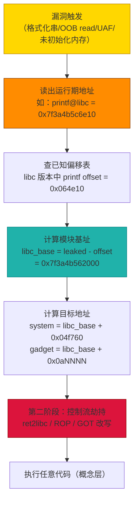
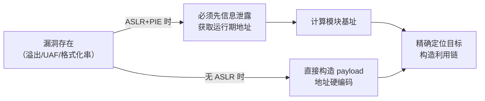
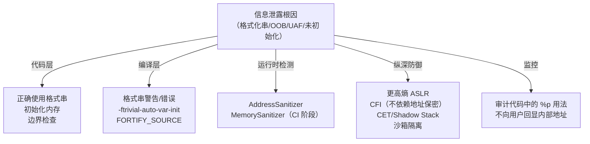

# 二进制漏洞与利用基础（13）· 现代利用与信息泄露

> [!abstract] TL;DR
> - **ASLR + PIE** 使程序每次加载地址随机，攻击者无法预知 gadget/函数/GOT 的位置，直接构造利用链已不再可行。
> - **信息泄露（information leak）** 是现代利用链的关键第一步：先通过漏洞读出一个"已知符号的运行期地址"，再用固定的模块内偏移反推基址，从而精确定位任意目标。
> - **一次泄露往往打穿整个模块**：模块内偏移在编译后固定，只需泄露一个 libc 函数地址，整个 libc 的地址空间就全部已知。
> - **防御重心因此前移**：阻止信息泄露（不回显指针、`%p` 审计、更高熵 ASLR、内存隔离），比"只加固后续控制流"更根本。

---

## 概述与定位

### 为什么"直接利用"在现代防护下失效

早期二进制利用的经典场景：找到栈溢出，把 shellcode 或 gadget 地址硬编码进 payload，覆盖返回地址，完成。这一范式的前提是**地址已知**——攻击者事先知道（或能预测）目标函数/gadget 在内存中的确切位置。

现代防护打破了这个前提：

| 防护机制 | 效果 | 状态 |
|---------|------|------|
| **ASLR**（地址空间布局随机化） | 每次运行各模块（库/栈/堆）加载地址不同 | Linux/macOS/Windows 默认开启 |
| **PIE**（位置无关可执行文件） | 主程序基址随机（`ET_EXEC` → `ET_DYN`） | 现代发行版默认 `-fPIE` |
| **RELRO**（重定位只读） | GOT 在启动后锁为只读，防止直接改写 | `-Wl,-z,relro,-z,now` |
| **Stack Canary** | 覆盖返回地址前需先绕过 canary | `-fstack-protector-strong` |
| **NX/DEP** | 栈/堆不可执行，shellcode 无法直接运行 | 硬件级支持，默认开启 |

这些机制协同运作后，攻击者面临的核心障碍从"找漏洞"变成了"找地址"。**信息泄露漏洞（information disclosure）的价值因此急剧上升**——它不直接劫持控制流，但它是让其他利用技术得以工作的前提条件。

> [!note] 本篇在系列中的位置
> [[12.缓解机制总览]] 介绍了各项防护机制的原理；本篇聚焦"这些防护如何被信息泄露绕过"这一进阶主题。防护机制的系统详解见 [[34.现代二进制防护机制/00.现代二进制防护机制总览]]。

### 与 ASLR/PIE 的关系

ASLR + PIE 的本质是**概率防御**：攻击者不知道地址，猜测成本极高（x86-64 上 libc 有约 28–30 bit 熵，直接暴力猜的成功率约 1/10 亿）。这套防护的弱点不在于随机化算法，而在于**依赖地址保密**。一旦程序在运行期泄漏了任何已知符号的地址，攻击者便可精确计算出模块基址，随机化的保护完全失效。

ASLR/PIE 机制详见 [[14.动态链接与加载器详解/09.ASLR与位置无关代码.md]]。

---

## 原理与机制

### 模块内偏移固定：一次泄露的破坏力

同一编译产物的模块内偏移在链接后就固定了。无论 ASLR 把 `libc.so` 加载到哪个基址，`libc.so` 内部 `system` 与 `printf` 之间的偏移永远相同。

```
libc 基址（每次随机）
  │
  ├─ printf    @ base + 0x064e10   ─── 可泄露，已知符号
  ├─ puts      @ base + 0x0809c0
  ├─ system    @ base + 0x04f760   ─── 利用目标
  ├─ __libc_start_main @ base + 0x021e40
  └─ /bin/sh   @ base + 0x1b3e1a   ─── 字符串，可作 execve 参数
```

> [!warning] 示例偏移为示意
> 上述偏移值仅为教学示意，真实偏移因 libc 版本不同而异；CTF 中常用 `libc-database`（pwntools）或 `one_gadget` 等工具查询特定版本的符号偏移。

结论：**只需泄露 `printf@libc` 的运行期地址 + 知道该 libc 版本中 `printf` 的符号偏移，就能立即算出 `system`、`/bin/sh` 字符串、任意 ROP gadget 在本次运行中的精确地址**。这就是"一次泄露打穿整个 ASLR"的原理。

### 现代利用范式：leak → calc base → hijack



> [!warning] 示例地址为示意，展示概念流程，非实际利用载荷。

这个范式可以简化为三个阶段：
1. **Leak 阶段**：利用信息泄露漏洞，读出至少一个"已知符号的运行期地址"。
2. **Calc 阶段**：用泄露值减去编译期已知的符号偏移，得到模块基址。
3. **Hijack 阶段**：用基址加上目标偏移，精确构造后续利用。

---

## 常见泄露原语

### 1. 格式化字符串 `%p` / `%x`（栈内容泄露）

见 [[08.格式化字符串漏洞]] 中对 `%p`/`%x` 的详细分析。核心机制：`printf(user_input)` 使攻击者控制格式串，`%p` 会按指针宽度打印对应参数槽的值，逐步扫描栈上内容。

```c
// 漏洞代码（教学 demo）
char buf[128];
fgets(buf, sizeof(buf), stdin);
printf(buf);    // BUG：buf 作为格式串
```

攻击者输入 `%p.%p.%p.%p.%p.%p` 时，会逐一打印寄存器（x86-64 前 5 个参数寄存器）及栈上内容。栈上通常有：
- 调用者的返回地址（指向 libc 或主程序某处）
- 已解析的 GOT 表项副本
- 指向 `__libc_start_main` 返回地址

任意一个已知的 libc 符号地址，都足以算出 libc 基址。

```
输入：%1$p.%2$p.%3$p.%6$p.%7$p.%15$p
输出（示意）：0x7f3a4b5c6e10.0x0.0x...（某个值落在 libc 地址范围）
```

> [!warning] 示例输出为示意，非本机实跑。

### 2. 越界读（Out-Of-Bounds Read）

缓冲区越界读是最宽泛的泄露原语之一：程序从一个数组/结构体读取数据，但边界检查不足，读到了相邻内存中的指针或敏感值。

```c
// 教学 demo（越界读）
// 编译（教学环境，关闭 FORTIFY）：gcc -fno-stack-protector -no-pie -o oob oob.c
#include <stdio.h>
#include <stdint.h>

struct Item {
    int  id;
    char name[16];
    // 紧邻：返回地址或其他结构
};

void show_item(struct Item *items, int idx) {
    // ⚠️ 未检查 idx 范围
    printf("id=%d name=%s\n", items[idx].id, items[idx].name);
}
```

> [!warning] 教学环境声明
> 以上示例需在关闭现代防护的教学环境中复现；生产环境默认开启防护。仅用于理解漏洞原理。

当 `idx` 超出合法范围，`items[idx]` 会读取相邻内存的内容，可能包含函数指针、返回地址或 libc 地址。

### 3. UAF 读（Use-After-Free 读）

UAF 漏洞通常以"写"的形态被讨论（控制 free 后的 chunk 实现任意写），但 UAF 的**读**形态同样可以构成信息泄露：

```c
// 教学 demo（UAF 读泄露 libc 地址）
// ⚠️ 前提：chunk 大小须 > 0x408 字节（超出 tcache 覆盖范围），
//         或对应 tcache bin 已满（默认 7 个），才会进入 unsorted bin。
//         glibc 2.26+ 引入 tcache：小 chunk free 后优先进 tcache，
//         tcache 中的 fd 存的是堆地址（非 libc 地址），无法泄露 libc！
struct Node *p = malloc(0x500);  // 0x500 > 0x408，确保绕过 tcache
free(p);   // 进入 unsorted bin，fd/bk 被写入 main_arena 指针（libc 内部地址）

// ⚠️ UAF：继续使用 p
printf("fd=%p\n", p->next);  // p->next 在 free 后被 glibc 写入了 libc 内部地址
```

> [!warning] 教学环境声明
> 以上示例需在教学环境下验证，glibc 堆内部布局因版本不同而异。仅用于理解原理。

在 glibc 的 unsorted bin 机制中，free 掉的 chunk 的 `fd`/`bk` 字段会被写入 `main_arena` 的地址，而 `main_arena` 位于 libc 的 `.data` 段中——读取这个 `fd` 字段即可拿到 libc 内部指针，换算出 libc 基址。这是堆利用中信息泄露最经典的手法。

**关键前提（glibc 2.26+）**：glibc 2.26 引入了 tcache（thread-local cache）。free 后的 chunk 默认先进 tcache，tcache 中的 `fd` 存的是**堆地址**（非 libc 地址），UAF 读此时只能得到堆指针，无法直接泄露 libc。只有满足以下任一条件，chunk 才会绕过 tcache 进入 unsorted bin，`fd`/`bk` 才指向 `main_arena`（libc 内）：

- chunk 大小超过 tcache 覆盖范围，通常需 **> 0x408 字节**（含 header 后 > 0x410）；
- 对应 size 的 tcache bin **已满**（同 size 的空闲 chunk 已达上限，默认 7 个）。

因此，并非任意大小 chunk 的 UAF 读都能得到 libc 地址；在 glibc 2.26+ 环境下，利用者须刻意分配足够大的 chunk，或先填满对应 tcache bin，再触发 free，才能使 fd/bk 落入 libc 地址范围。

### 4. 未初始化内存（Uninitialized Memory）

```c
// 教学 demo（未初始化栈变量泄露）
void vuln(void) {
    char buf[64];   // ⚠️ 未初始化，内容为上一帧残留
    read(0, buf, 4);   // 只读4字节，其余仍为残留值
    write(1, buf, 64); // 把全部64字节回显给攻击者
}
```

> [!warning] 教学环境声明
> 以上示例为概念演示，实际利用依赖栈帧的具体布局。

未初始化内存包含上一个函数调用遗留的指针、地址或 canary 的痕迹。如果程序将这段内存回显给用户（如网络协议的某个字段），攻击者即可从中提取地址信息。

### 泄露原语对比

| 泄露原语 | 典型漏洞形态 | 泄露内容来源 | 现代防护能否阻止 |
|---------|------------|------------|----------------|
| `%p`/`%x` 格式化串 | `printf(user_input)` | 栈/寄存器残留指针 | `-Wformat-security` 可阻止编译；FORTIFY 部分限制 |
| OOB Read | 数组索引越界 | 相邻内存（指针、返回地址） | 边界检查（AddressSanitizer 可检测） |
| UAF 读 | free 后继续读 | 堆 chunk 的 `fd/bk`（libc 内部） | 堆加固（tcache 保护/ASLR 堆） |
| 未初始化内存 | 变量未清零就回显 | 栈帧/堆残留指针 | `-ftrivial-auto-var-init`（GCC 12+）、MemorySanitizer |
| 错误信息回显 | 异常处理打印内部状态 | 任意内存（取决于打印逻辑） | 代码审查；不向用户回显内部指针 |

---

## 最小示例（教学 demo）

> [!warning] 教学环境声明
> 以下示例需关闭多项现代防护（`-fno-stack-protector`、`-no-pie`、`-z norelro`）来演示"没有防护时的漏洞行为"。**生产环境这些防护默认开启**，本示例仅用于理解原理。

### fmt_leak.c — 用格式化串泄露 libc 地址

```c
// fmt_leak.c  — 格式化字符串信息泄露教学 demo
// 演示：通过 %p 泄露栈上的 libc 地址，推算 libc 基址
// 编译（教学环境）：
// gcc -fno-stack-protector -pie -fPIE -o fmt_leak fmt_leak.c
// （保留 PIE，演示"泄露后 ASLR 失效"）
#include <stdio.h>
#include <stdlib.h>

void leak_demo(void) {
    char buf[128];
    printf("Input: ");
    fgets(buf, sizeof(buf), stdin);
    buf[__builtin_strlen(buf) - 1] = '\0';  // strip newline

    // ⚠️ 漏洞：用户输入作为格式串
    printf(buf);
    putchar('\n');
}

int main(void) {
    leak_demo();
    return 0;
}
```

**概念层操作流程**（不提供具体偏移或载荷）：

1. 输入 `%1$p.%2$p.%3$p...` 逐步枚举，观察哪些槽位的值落在 libc 地址范围（通常 `0x7f...`）。
2. 找到一个已知的 libc 符号对应的值后，用 `libc-database` 或 `pwntools` 的 `elf.symbols` 查出该符号在对应 libc 版本中的偏移。
3. 计算：`libc_base = leaked_addr - symbol_offset`。
4. 此时整个 libc 的所有符号地址均可精确计算，ASLR 对 libc 的保护彻底失效。

**用 checksec 验证防护状态**：

```bash
checksec --file=fmt_leak
```

```text
（示意输出）
[*] './fmt_leak'
    Arch:     amd64-64-little
    RELRO:    Full RELRO
    Stack:    Canary found
    NX:       NX enabled
    PIE:      PIE enabled
```

> [!warning] 示例输出为示意，非本机实跑。

即使 Full RELRO + PIE + Canary + NX 全部开启，**格式化字符串的 `%p` 泄露仍然有效**——这些防护阻止的是"控制流劫持的最后一步"，而不是"信息泄露本身"。这正是信息泄露在现代利用中不可替代的原因。

---

## 利用思路（原理层）

> [!warning]
> 本节仅在概念层描述"为什么需要信息泄露"以及"泄露如何被用于后续利用"。不提供具体利用代码、完整利用链或武器化载荷。

### 为什么信息泄露是现代利用的关键第一步

在有 ASLR + PIE 的环境中，利用链必须先解决"地址未知"问题，才能进入"控制流劫持"阶段。这使信息泄露从"加分项"变成了"必要条件"：



### 泄露 → 基址计算 → 定位目标的数学关系

设泄露到的值为 `leaked`，对应符号在模块中的偏移为 `sym_offset`（可用 `readelf -s` 或 `nm -D` 查询），则：

```
module_base  = leaked - sym_offset
target_addr  = module_base + target_offset
```

这两个公式是整个现代利用范式的数学核心。`sym_offset` 和 `target_offset` 在同一编译产物的同一版本中是常数，攻击者只需确定 libc 版本（通过 `leaked` 地址的低字节特征，或服务器返回的版本信息），即可从公开的 libc 数据库中查到所有偏移。

### 为什么"一次泄露打穿整个 ASLR"

ASLR 按模块随机化基址。模块内部的所有符号相对于基址的偏移是固定的（由编译/链接决定）。因此：
- 知道 libc 基址 → 知道整个 libc 的所有函数、字符串、gadget 的地址。
- 知道主程序基址 → 知道主程序所有函数、全局变量、GOT 表的地址。
- 知道栈地址 → 可精确计算 ROP 链中需要写入的位置。

**每个模块只需一次泄露**。这就是为什么防御方不能只靠"让利用更难一点"来应对信息泄露——一旦泄露发生，对应模块的整个随机化保护就瞬间归零。

### 信息泄露后的典型后续步骤（概念）

1. **ret2libc**：泄露 libc 基址后，直接调用 `system("/bin/sh")`（见 [[05.ret2libc]]）。
2. **ROP 链构建**：泄露程序基址或 libc 基址后，精确定位 gadget（见 [[06.ROP入门]]）。
3. **GOT 改写**：如果 Partial RELRO（`.got.plt` 可写），用任意写漏洞把 `puts@GOT` 改为 `system`（见 [[07.GOT劫持与ret2dl-resolve]]）。

---

## 缓解与防御

### 防御信息泄露的核心原则

> 防御信息泄露比防御控制流劫持更根本：如果攻击者永远无法获得运行期地址，ASLR + PIE 就能持续有效，后续利用步骤无从展开。

#### 1. 永远不向用户回显内部指针或地址

```c
// ❌ 错误：把内部地址泄露给用户
printf("debug: buf at %p\n", buf);
fprintf(stderr, "error at %p: ...", ptr);
memcpy(response, &internal_ptr, 8);  // 把指针复制进网络响应

// ✅ 正确：只回显必要的业务数据，不含地址
printf("error: invalid index\n");
```

任何将指针值、地址或内存内容以任何形式发送给不可信方的代码，都是潜在的泄露点。

#### 2. 修复格式化字符串漏洞（%p 审计）

格式化字符串漏洞是最直接的泄露渠道。根本防御：

```c
// ❌ 根本漏洞：用户输入当格式串
printf(user_input);

// ✅ 正确：格式串固定
printf("%s", user_input);
```

编译期审计：

```bash
gcc -Wall -Wformat -Wformat-security -Werror=format-security prog.c
```

CI/CD 中建议将 `-Werror=format-security` 加入默认构建选项，让格式化字符串漏洞在编译期即被拦截。

#### 3. 初始化所有变量，避免未初始化内存

```c
// ❌ 栈/堆未初始化
char buf[64];
send(fd, buf, sizeof(buf), 0);  // 把栈残留全部发出

// ✅ 初始化后再使用
char buf[64];
memset(buf, 0, sizeof(buf));
// 或使用 GCC 12+ 的 -ftrivial-auto-var-init=zero
```

GCC 12+ 选项 `-ftrivial-auto-var-init=zero` 自动将所有局部变量初始化为零，消除未初始化内存泄露这一类问题。代价是极小的运行时开销（绝大多数场景可忽略）。

#### 4. 更高熵的 ASLR

即使已有 ASLR，提高熵可以增大"猜测成功"的难度：

- **Linux**：确保 `randomize_va_space=2`（含 brk 随机化，虽然 brk 熵较低约 13 bit）。
- **x86-64 + 高版本内核**：使用 ASLR 熵增强补丁（部分发行版提供）。
- **macOS**：不要禁用 SIP，保持系统 ASLR 完整。
- **Windows**：确保所有模块均带 `/DYNAMICBASE` + `/HIGHENTROPYVA`（64 位，约 19 bit 熵）。

> [!note] ASLR 熵的局限
> ASLR 熵再高，也无法对抗信息泄露——攻击者读出一个地址，熵就变为零。提高熵的价值在于增大**无信息泄露时暴力猜测**的成本，不能替代对信息泄露本身的防护。

#### 5. CFI 不依赖地址保密

控制流完整性（CFI/CFG）机制应当**独立**于 ASLR，而不是以"攻击者不知道地址"为前提：

- **LLVM CFI / `-fsanitize=cfi`**：在间接调用/跳转前校验目标类型合法性，即使攻击者知道地址，CFI 也能阻止调用非预期目标。
- **Intel CET / Shadow Stack**：硬件级的返回地址完整性保护，与地址是否已知无关。
- **Windows CFG**：间接调用前通过位图验证目标合法性。

这些机制的设计哲学是"即使地址泄露，也不让攻击者利用"，而不是"依赖地址保密来阻止利用"。

#### 6. 内存隔离与最小权限

- **进程/沙箱隔离**：利用 seccomp、namespace、AppArmor/SELinux 限制进程能力，即使信息泄露和控制流劫持都成功，也无法执行高危操作（fork exec 等）。
- **地址空间分割（KASLR）**：内核地址空间随机化，阻止用户态信息泄露进一步转化为内核提权。

### 防御层次总览



---

## 检测与工具

### 静态检测：查找泄露源

```bash
# 格式化字符串漏洞（最直接的泄露路径）
gcc -Wall -Wformat -Wformat-security -Werror=format-security prog.c

# Semgrep：查找 printf(var) 模式
semgrep --config=p/c prog.c

# CodeQL（CI 中集成）：数据流分析，追踪用户输入流向 printf
```

### 动态检测：运行时发现越界读/未初始化

```bash
# AddressSanitizer：检测越界读（OOB read）
gcc -fsanitize=address -fno-omit-frame-pointer -o prog prog.c
./prog

# MemorySanitizer（Clang）：检测未初始化内存读
clang -fsanitize=memory -fno-omit-frame-pointer -o prog prog.c
./prog

# Valgrind：运行期内存错误（适合存量代码）
valgrind --tool=memcheck --leak-check=full ./prog
```

> [!warning] 示例输出为示意
> 上述工具输出和命令在 Linux 环境下执行；Windows 环境需使用 WSL 或等效工具。本机为 Windows，无法本机实跑。

### 验证二进制保护状态

```bash
checksec --file=binary
```

```text
（示意输出）
[*] './binary'
    Arch:     amd64-64-little
    RELRO:    Full RELRO        ← GOT 只读
    Stack:    Canary found      ← 栈 Canary
    NX:       NX enabled        ← 栈不可执行
    PIE:      PIE enabled       ← 基址随机化（ASLR 有效）
```

> [!warning] 示例输出为示意，非本机实跑。

即使全部防护均开启，仍需检查是否存在信息泄露漏洞——`checksec` 显示的防护不能替代对代码逻辑的审计。

### 检查运行期地址是否被回显

在测试阶段，可通过网络抓包或 strace 检查程序输出中是否包含看起来像地址的值：

```bash
# 观察程序所有输出
strace -e write ./binary < input.bin 2>&1 | grep -E '0x7f[0-9a-f]{10}'
```

> [!warning] 示例命令为示意，需在 Linux 系统执行。

---

## 小结

| 知识点 | 要点 |
|--------|------|
| **信息泄露的核心价值** | 打破 ASLR + PIE 的地址随机化，是现代利用链必不可少的第一步 |
| **一次泄露打穿整个模块** | 模块内偏移固定，泄露一个符号地址即可算出整个模块的地址空间 |
| **常见泄露原语** | 格式化串 `%p`、OOB read、UAF 读、未初始化内存 |
| **ASLR 的本质弱点** | 概率防御，依赖地址保密；信息泄露使熵归零 |
| **根本防御** | 不向用户回显指针；修复格式化串漏洞；初始化所有内存；边界检查 |
| **CFI 不依赖地址保密** | 控制流完整性机制应独立有效，不以"攻击者不知地址"为前提 |
| **纵深防御** | ASLR + PIE + Full RELRO + Canary + CFI/CET + 沙箱，层层叠加 |

> [!warning] 教学声明
> 本篇所有利用技术均在概念层描述，不提供具体利用代码、地址偏移或武器化载荷。所有内容用于理解"为何防止信息泄露至关重要"，目的是帮助开发者和安全工程师写出更安全的代码，请勿将相关技术用于未经授权的测试。

---

## 相关阅读

- **ASLR/PIE 机制详解**（信息泄露针对的防护原理）：[[14.动态链接与加载器详解/09.ASLR与位置无关代码.md]]
- **格式化字符串漏洞**（最直接的泄露原语）：[[08.格式化字符串漏洞]]
- **缓解机制总览**（ASLR/NX/Canary/RELRO/CFI 全景）：[[12.缓解机制总览]]
- **安全开发与防御**（如何从开发阶段消灭泄露点）：[[14.安全开发与防御]]
- **ret2libc**（利用信息泄露后的典型后续手法）：[[05.ret2libc]]
- **ROP 入门**（精确定位 gadget 依赖泄露的基址）：[[06.ROP入门]]
- **GOT 劫持**（泄露后的控制流劫持目标）：[[07.GOT劫持与ret2dl-resolve]]
- **GOT 结构与 RELRO**：[[11.ELF文件详解/17.got节.md]]
- **现代防护机制系统讲解**：[[34.现代二进制防护机制/00.现代二进制防护机制总览]]

---

⬅️ 上一篇 [[12.缓解机制总览]] ｜ 🏠 [[00.二进制漏洞与利用基础总览]] ｜ 下一篇 [[14.安全开发与防御]] ➡️
