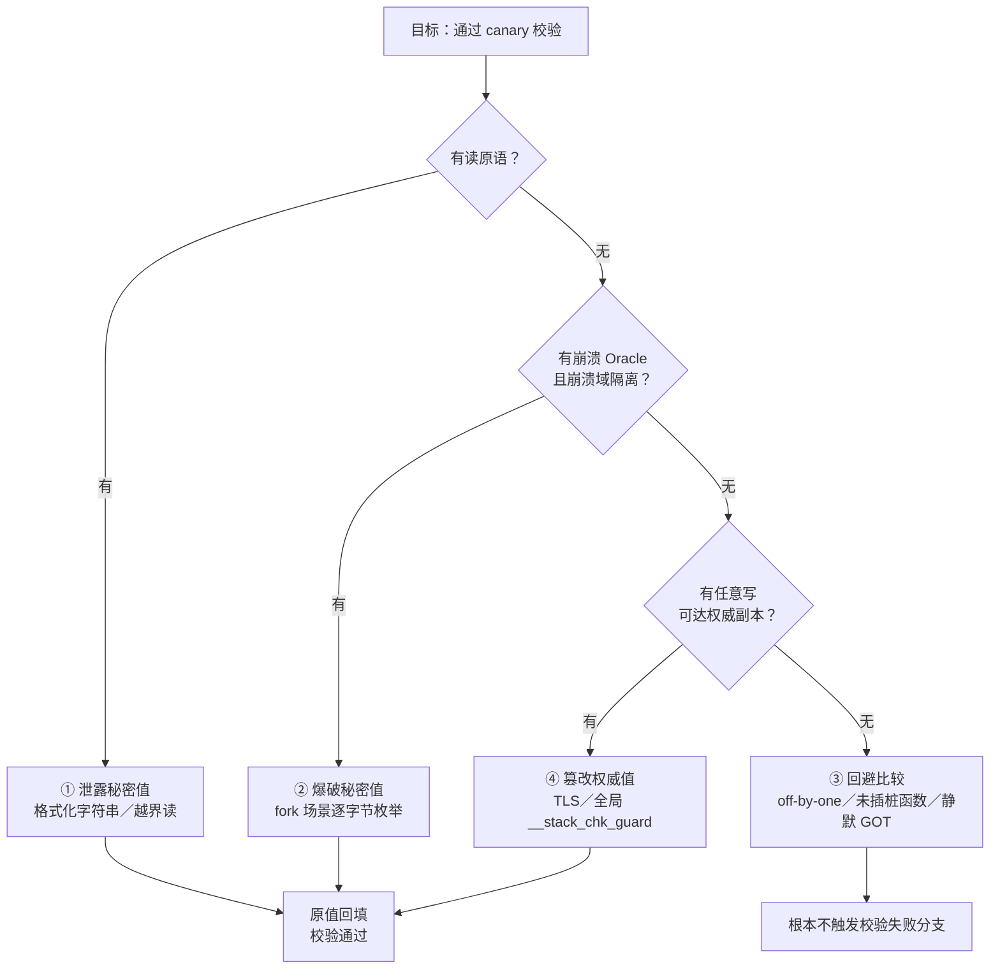
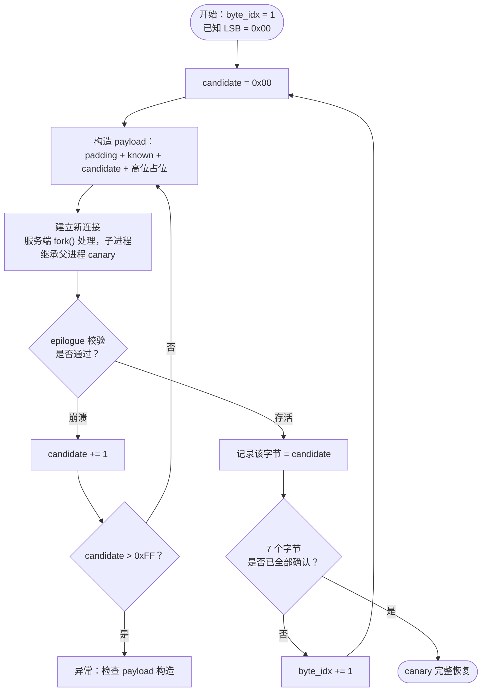
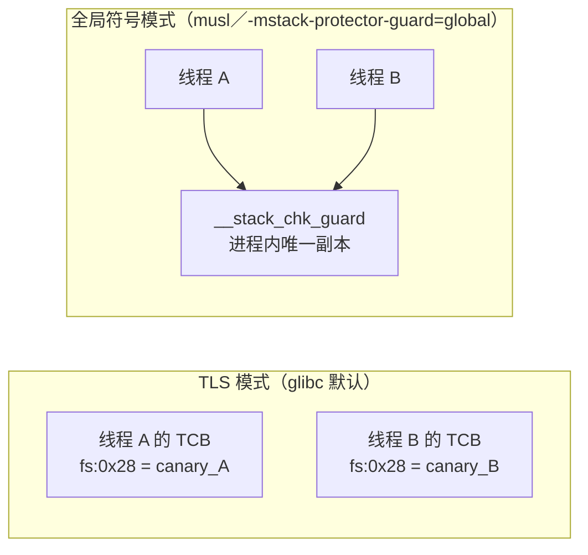
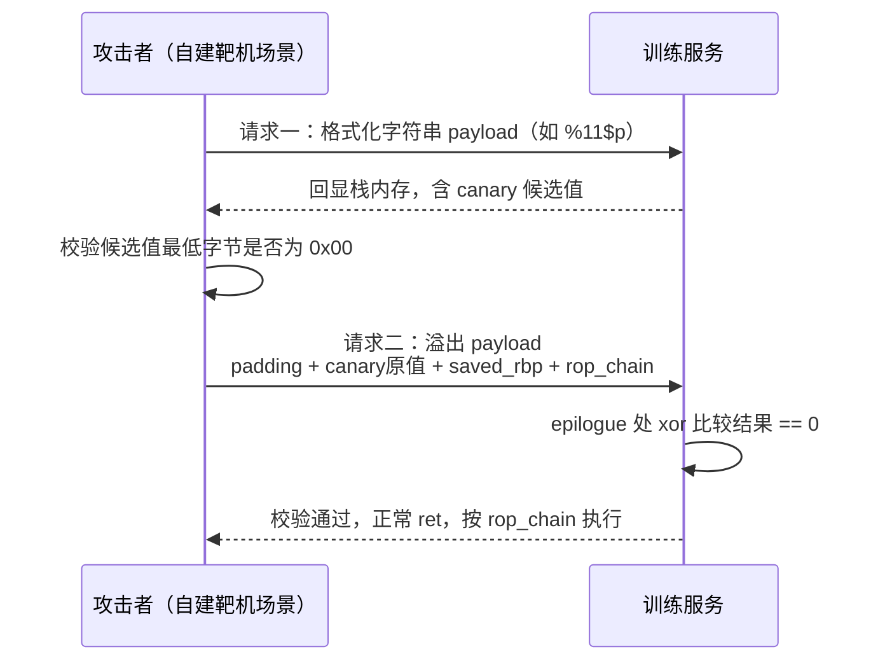

# 二进制漏洞与利用基础（14）· Canary泄露与绕过

> [!abstract] TL;DR
> - Canary 的安全性完全建立在"值保密"之上，校验本身（一次异或+跳转）没有任何抗攻击设计——一旦攻击者以任何方式获知或掌控该值，防护即彻底失效，这是本篇所有绕过技术的共同根基。
> - 逐字节爆破依赖 `fork()` 写时复制继承同一 canary、且崩溃被隔离到单个子进程这两个条件同时成立；8 字节 canary 中最低字节固定为 `0x00`，有效未知 7 字节，期望约 900 次请求即可枚举出全部随机字节。
> - 信息泄露既可来自格式化字符串 `%p`/`%N$p`，也可来自相邻缓冲区 off-by-one 覆盖空字节触发 `puts`/`printf` 越界读——后者是 CTF 入门中最常见的 canary 泄露路径。
> - glibc 默认将 canary 权威值存于 TLS（`%fs:0x28`），但 `-mstack-protector-guard=global`、musl libc 等场景改用全局符号 `__stack_chk_guard`；一旦这个"标准答案"本身可被任意写覆盖，攻击者无需泄露即可自定义 canary。
> - 绕过不总是要正面击穿比较逻辑——精确 off-by-one 只覆盖 `saved RBP`、挑选未被插桩的函数、或在 Partial/No RELRO 下改写 `__stack_chk_fail` 的 GOT 项使检查静默，都能让防线形同虚设。
> - canary 只挡"线性溢出到返回地址"这一条路径，必须与 ASLR/PIE、NX、Full RELRO 组成纵深防御；绕过 canary 之后紧接着要解决的通常就是下一篇的地址空间随机化问题。

## 概述与定位

《二进制漏洞与利用基础》系列走到这里，前十三篇已经把"如何在栈上获得一次可控的越界写"和"如何把这次越界写变成受控的控制流劫持"讲了个七七八八：从最朴素的 [[02.栈溢出原理与经典利用|栈溢出覆盖返回地址]]，到需要绕过 NX 的 [[05.ret2libc|ret2libc]] 与 [[06.ROP入门|ROP]]，再到 gadget 稀缺时的 [[07.ROP进阶：ret2csu与通用gadget|ret2csu]]、[[12.SROP信号帧伪造|SROP 信号帧伪造]]，直至上一篇专门讨论"干脆不走 `ret` 指令"的 [[13.JOP与COP面向跳转与调用编程|JOP/COP]]。这些技术有一个共同的隐含前提：它们都假设攻击者**已经能把精心构造的数据写到栈上、并让程序按这份数据继续执行**。但现实中，只要目标函数开启了 Stack Canary，"把数据写到栈上"和"让程序按这份数据继续执行"之间还隔着一次强制的完整性校验。

本篇要回答的问题很聚焦：**当溢出路径必须穿过 canary 才能抵达返回地址时，攻击者有哪些手段让这次校验"看起来"通过？** 这与上一篇 [[13.JOP与COP面向跳转与调用编程]] 恰好形成一组对照：JOP/COP 之所以能在不伪造合法 `ret` 的情况下劫持控制流，前提通常是初始劫持点本身就不经过"线性溢出到 saved RIP"这条路径（例如改写一个虚函数表指针、一个回调函数指针），此时 canary 从一开始就不在攻击链条上；但只要初始入口仍然是"溢出一个受 canary 保护的栈帧、指望改写它的 saved RIP"，无论后续跳转目标是传统 ROP 链还是 JOP dispatcher，都必须先解决本篇讨论的问题。换句话说，canary 卡在的是控制流劫持链条的**最前端**，而不是某一种具体的"跳转风格"。

本篇不重新推导 Stack Canary 本身的实现原理——序言写值、尾声比较、TLS 存储这些机制性内容只做必要的简要回顾，防御视角的系统对比见 [[34.现代二进制防护机制/00.现代二进制防护机制总览]]。全文的重心完全放在**利用侧**：给定 canary 已经开启这一前提，用什么条件、什么原语组合能让攻击者绕过它。行文围绕一套原创的四象限分类法展开——泄露、爆破、回避、篡改权威值——覆盖"逐字节爆破、泄露、fork 场景、覆盖 TLS"四个关键词，并补上业界实践中同样重要但容易被忽略的"根本不与 canary 正面交锋"这一类技巧。读完本篇，读者应当能够：面对一个开了 canary 的目标，判断当前手上的原语组合属于四象限中的哪一类、该类的可行前提是什么、绕过之后如何无缝衔接到 [[15.ASLR与PIE绕过技术|下一篇的 ASLR/PIE 绕过]]以及更早篇目里的 ret2libc/ROP 控制流劫持。

## 原理与机制

### 校验机制的极简回顾

Stack Canary 的运行时行为可以压缩成一句话：**函数序言从一个"只有运行时能读到、攻击者理论上读不到"的位置取一个随机值写入栈帧固定槽位，函数尾声在从栈上恢复控制流之前，把这个槽位的值与原始位置重新比较一次，不等就拒绝返回**。x86-64 下典型的序言/尾声形态：

```nasm
; 序言：取权威值，写入栈上副本
mov  rax, fs:0x28        ; 权威值：TLS 中的 stack_guard
mov  [rbp-0x8], rax      ; 栈上副本，紧邻 saved RBP 之下
xor  eax, eax            ; 清空寄存器，避免值滞留在寄存器中被侧信道探测

; 尾声：栈上副本与权威值异或比较
mov  rax, [rbp-0x8]
xor  rax, fs:0x28
je   .ok                 ; 结果为 0 → 相等 → 正常返回
call __stack_chk_fail    ; 不等 → 终止进程
.ok:
leave
ret
```

栈帧内的相对顺序保证了任何**从低地址向高地址**线性推进的溢出，要碰到 `saved RIP` 就必然先碰到 canary：

```
高地址
  saved RIP   ← 攻击者的最终目标
  saved RBP
  canary      ← 线性溢出必经此处，8 字节，最低字节固定 0x00
  局部变量 / 缓冲区
低地址（溢出起点）
```

这部分机制的完整推导，本系列 [[02.栈溢出原理与经典利用]] 与 [[34.现代二进制防护机制/00.现代二进制防护机制总览]] 均有更系统的展开，此处不再重复。

### 把 canary 当成一次"秘密相等性判断"

理解绕过技术的关键，在于换一个角度看待这次比较：`xor rax, fs:0x28; je .ok` 在做的事情，本质上和口令校验、消息认证码校验没有什么不同——都是"拿一个只有防御方掌握的秘密值，与另一处的值做相等性判断，相等则放行"。这个视角立刻带来两个推论。

**推论一**：canary 的安全性**完全**来自这个值的保密性与不可预测性，而不来自比较逻辑本身的复杂度——异或加条件跳转是整个指令集里最简单的操作之一，没有任何"抗攻击设计"，全部安全性押注在"攻击者猜不到、读不到、算不出"这一个假设上。这也是为什么 canary 从设计之初就与 ASLR、TLS 这类"藏起来"的机制强绑定，而不是依赖某种密码学强度的校验算法——校验强不强不重要，秘密守不守得住才重要。

**推论二**：既然是相等性判断，攻破它在逻辑上只有三条根本路径——**知道秘密值本身**（无论通过读还是通过猜）、**让判断根本不发生**（跳过或使之短路）、**让判断永远为真**（让参与比较的两侧都变成攻击者选定的同一个值）。前两条分别对应"泄露"与"爆破"，第三条进一步拆成"回避比较"（判断确实没有发生）与"篡改权威值"（判断发生了，但双方比的都是攻击者定的值）。四条路径合起来，正是本篇要系统展开的分类框架：



四个象限彼此并不互斥：现实中的一道 CTF 题目常常是"用格式化字符串泄露 canary（①），顺手也泄露了 libc 基址"，或者"没有直接读原语，但恰好有一个独立的任意写能改全局 canary（④）"。下一节按四个象限逐一展开实现细节、前提条件与边界陷阱。

## 绕过手法详解：爆破、泄露、篡改与规避

### 逐字节爆破与 fork 场景：秘密复用 × 崩溃域隔离

`fork()` 通过写时复制（copy-on-write）复制父进程的整个地址空间，TLS 页（含 `%fs:0x28` 处的 canary）在 fork 后对子进程**逐位相同**——子进程持有与父进程一模一样的 canary 值，除非子进程重新调用初始化逻辑，否则这个值在父进程生命周期内永远不变。这为攻击者提供了一件在其他场景里很少见的武器：**可以把针对同一个秘密值的多次独立尝试积累起来**，而不是每次都要重新面对一个全新的 256 选 1。

具体做法是逐字节枚举：每一轮只改动 canary 中的 1 个字节，观察这次请求对应的子进程是否崩溃——猜中则子进程正常处理完请求退出，猜错则 `__stack_chk_fail` 触发 `abort()`，进程收到 `SIGABRT`，这个差异通常能从连接是否被意外挂断、响应是否缺失等外部可观测行为中区分出来。

#### 单字节期望尝试次数的推导

设某字节的真实取值 $v$ 服从 $\{0, 1, \dots, 255\}$ 上的均匀分布——这本来就是 canary 生成算法追求的目标：若分布不均匀，攻击者反而可以按先验概率调整枚举顺序进一步降低期望次数。攻击者按固定顺序（例如从 `0x00` 递增到 `0xFF`）逐一尝试，命中 $v$ 所需的尝试次数是 $v + 1$（$v = 0$ 时第 1 次就命中，$v = 255$ 时需要 256 次）。对均匀分布的 $v$ 求期望：

$$E[\text{尝试次数}] = E[v + 1] = E[v] + 1 = \frac{255}{2} + 1 = 128.5$$

即平均每个字节需要约 **128.5 次**请求才能命中，最坏情况 256 次，最好情况 1 次。

#### 多字节总期望

glibc 在生成 random canary 时会把**最低字节固定为 `0x00`**（终止符字节，专门用来让 `strcpy`/`gets` 等遇 `\0` 停止的字符串函数无法把 canary 完整覆盖），这个字节攻击者无需猜测即可"免费"得知。因此 8 字节 canary 中真正需要枚举的只有高 7 字节：

```
有效未知字节数：7（最低字节固定 0x00，直接已知）
单字节期望尝试次数：128.5
总期望尝试次数：7 × 128.5 ≈ 900 次
理论最坏情况：7 × 256 = 1792 次
若保守地把 8 字节都当未知处理：8 × 128.5 = 1028 次
```

900 次左右的网络请求，对多数存在明显速率限制或异常监控的服务是极显眼的噪声；但在没有此类监控、且服务确实采用 fork 模型的场景下，这个量级完全在几分钟到几十分钟内可完成的范围。

#### 崩溃域隔离才是真正的成立条件

值得强调的是，真正让逐字节爆破成立的，并不是"调用了 `fork()` 这个系统调用"本身，而是 fork 顺带带来的两个性质同时满足：

1. **秘密复用**：父进程只在启动时生成一次 canary，之后所有子进程通过写时复制继承同一份秘密，即"秘密值在多次尝试之间保持不变"；
2. **崩溃域隔离**：每个请求的执行体运行在相互独立的子进程地址空间中，一次崩溃只终结一个子进程，不影响父进程与其他并发连接，即"一次错误猜测的代价被限制在极小的爆炸半径内"。

二者缺一都会使该技术失效：如果父进程每次 fork 前都重新生成 canary（性质 1 不成立），历史尝试积累的信息全部作废，退化为对每次独立的 256 选 1 猜测，不再可行；如果服务用线程而非进程处理并发（性质 2 不成立），一次崩溃很可能拖垮整个进程内所有线程共享的地址空间，导致所有在线连接同时中断——不仅异常行为极易被发现，也无法把"猜错的信号"限定在攻击者自己发起的那一次请求上。

因此更准确的表述是：**该技术利用的是"秘密复用 + 崩溃域隔离"这一组合性质，`fork()` 只是产生这一组合最常见的方式**。理解到这一层，才能推广判断其他并发模型是否存在同样的风险：

| 并发模型 | canary 是否跨请求复用 | 崩溃是否隔离 | 可否爆破 |
|---|---|---|---|
| fork-per-connection（inetd 风格） | 是，父进程存活期内 | 是，每连接独立子进程 | 可行，经典场景 |
| prefork worker 池 | 是，同一 worker 生命周期内 | 是，worker 粒度隔离 | 可行，窗口受 worker 回收周期限制 |
| thread-per-connection | 是，同进程所有线程 | 否，多数运行时一线程 abort 拖垮整进程 | 通常不可行 |
| 单进程事件驱动/协程 | 是 | 否，一次崩溃拖垮全部在线连接 | 不可行，且极易自曝 |
| 每请求短生命周期容器/重新 exec | 否，每次重新随机化 | 是 | 不可行（秘密复用被打破） |

#### 爆破流程与实现骨架



```python
# 教学示例：针对自建 fork-per-connection 训练靶机，非真实网络目标
from pwn import *

def try_byte(known: bytes, candidate: int) -> bool:
    p = remote('127.0.0.1', TRAINING_PORT)      # 每次连接对应服务端一次 fork()
    payload  = b'A' * PADDING_LEN + known + bytes([candidate])
    payload += b'\x00' * (8 - len(known) - 1)   # 高位暂填占位，不参与本轮判断
    payload += b'B' * 8 + p64(0x400000)         # saved RBP + 明显非法的返回地址
    p.send(payload)
    alive = b'ALIVE' in p.recvline(timeout=1)   # 按训练靶机约定的存活回显判断
    p.close()
    return alive

known = b'\x00'                                  # 最低字节固定已知
for _ in range(7):
    for candidate in range(0x100):
        if try_byte(known, candidate):
            known += bytes([candidate])
            log.info(f'字节确认，当前已知 = {known.hex()}')
            break
canary = known
```

需要留意的边界：ASLR 不直接影响该技术的可行性（爆破不依赖地址预测，只依赖崩溃/存活这个二元 Oracle）；但现代服务框架大量采用线程池、事件循环或短生命周期容器，真正符合"fork-per-connection 且长期不重启"这一前提的目标已经比十年前少得多。

### 信息泄露：格式化字符串与相邻缓冲区越界读

如果目标存在独立于溢出点的**读原语**，绕过 canary 的成本可以从"数百次请求"降到"一次交互"：先读出 canary 原值，再在溢出 payload 中原样填回，尾声校验自然通过。

**格式化字符串泄露**是最经典的路径：若程序存在 `printf(user_buf)` 这类漏洞（完整的 `%n` 任意写机制见 [[09.格式化字符串漏洞]]，此处只聚焦"如何用它定位并确认 canary"），可以用 `%N$p` 按参数位置枚举栈上的 QWORD，逐个比对哪个候选值具备 canary 的指纹特征——**最低字节固定为 `0x00`，其余 7 字节看起来随机且非零**。x86-64 SysV 调用规约下，`printf` 的前 6 个参数走寄存器（`rsi/rdx/rcx/r8/r9` 加上 `rdi` 本身是格式串指针），第 6 个参数往后才落到栈上，因此 `%N$p` 的偏移与调用约定直接相关，具体推导见 [[22.调用规约/06.SystemV_AMD64调用规约]]。

**相邻缓冲区越界读**是另一条更常见、门槛更低的路径，也是多数入门 CTF 里"泄露 canary"的标准桥段。核心是一次只多写 1 字节的 `off-by-one`：

```
栈帧（高地址在上）：
  [ saved RIP ]
  [ saved RBP ]
  [ canary    ]  8 字节，最低字节固定 0x00（字符串终止符）
  [ ... 其他局部变量／padding ... ]
  [ name[8]   ]  ← 声明的缓冲区，只有 8 字节合法空间

漏洞：read(0, name, 9) 允许写入第 9 个字节，
       该字节物理上正好落在紧邻 name 的高地址一侧，
       在典型布局中恰好是 canary 的最低字节
后果：原本是 0x00 的终止符被覆盖成任意非零值，
       name 不再以 \0 结尾
利用：puts(name) / printf("%s", name) 找不到终止符，
       持续向高地址读，把 canary 剩余 7 个随机字节
       一并打印出来，直到撞上更高地址某个恰好为
       0x00 的字节才停（通常落在 saved RBP 内部）
```

这条路径的优势在于**不依赖崩溃、不依赖 fork**，普适性明显强于逐字节爆破，是现代 CTF 与实战审计中最主流的 canary 突破口之一。此外还有两类不那么典型但同样存在的读原语：数组越界索引读（`arr[user_controlled_index]` 未做上界检查，恰好落在 canary 所在的栈偏移）、以及未初始化局部变量复用了此前某次调用遗留在同一栈帧位置的 canary 残留值（对应函数调用序列有严格要求，可靠性较低，但在特定场景下是唯一可用的原语）。生产环境中偶尔还会出现"崩溃日志/core dump 携带栈内存内容"这种侧信道——例如一个未经脱敏的异常处理器把寄存器和栈内容打进日志文件，等价于把 canary 主动送到了攻击者面前。

### 篡改权威值：TLS canary 与全局 __stack_chk_guard

前两类技术的共同前提，是攻击者去"猜"或"读"栈上副本背后那个**权威值**（TLS 中的 `stack_guard`）。第三类技术换了一个思路：**不关心原始的 canary 是什么，而是直接把标准答案本身改成攻击者知道的值**——只要能写这个权威值，之后任何函数的栈溢出，只需要在 canary 槽位填这个已知值即可通过校验，整个"需要先泄露"的前提被彻底移除。

#### GCC 的 guard 来源选项

x86/x86-64 后端的 GCC（以及兼容的 Clang）暴露了一组通常被忽视的机器相关选项，直接决定 canary 权威值到底存放在哪里：

| 选项 | 作用 |
|---|---|
| `-mstack-protector-guard=tls`（Linux 默认） | canary 通过段寄存器相对寻址读取，即前文反复出现的 `%fs:0x28` |
| `-mstack-protector-guard=global` | canary 改为一个普通全局符号 `__stack_chk_guard`，序言/尾声用 RIP 相对（PIE 下）或绝对地址（非 PIE 下）访问，不再经过段寄存器 |
| `-mstack-protector-guard-reg=<reg>` | 在 `tls` 模式下指定使用哪个段寄存器（`fs` 或 `gs`），用于与运行时约定的段语义保持一致（部分内核构建、自定义 runtime 会用到） |
| `-mstack-protector-guard-offset=<N>` | 自定义该寄存器指向结构体中的偏移，替代写死的 `0x28` |

这组选项存在的现实意义在于：并非所有运行环境都具备完整的 glibc/NPTL 风格 TLS 支持。裸机固件、内核自身完成每 CPU 数据结构初始化之前的早期启动阶段代码、以及一些体积敏感的 libc 实现，都倾向于用一个更简单的全局变量取代"每线程一份"的 TLS 方案。



#### musl 与 glibc 的横向对比

musl libc 的设计哲学是尽可能减少运行时状态与初始化复杂度，其栈保护实现走的正是 `global` 路线：`__stack_chk_guard` 是 `.data`/`.bss` 中的一个普通符号，由启动阶段的初始化逻辑用随机数填充一次，之后所有线程、所有函数共用这一份值——不存在"线程 A 的 canary 泄露不影响线程 B"这种隔离性。对攻击者而言，这意味着在基于 musl 的目标（Alpine Linux 容器是最常见的载体）上，只要拿到一次泄露或一次任意写，"战果"覆盖进程内的每一个受保护函数，不需要按线程重复劳动；反过来，这也是一个更集中的单点——只要这一个全局值所在的页被保护好（只读、地址被 ASLR/PIE 充分随机化），攻击面反而比"散落各处的 TLS 页"更容易统一加固。

#### 非 PIE / 静态链接下的固定地址风险

更现实的风险出现在**非 PIE 或静态链接**的二进制中：无论是显式选择了 `-mstack-protector-guard=global`，还是静态链接环境下退化为全局符号，`__stack_chk_guard` 这个符号的虚拟地址在这类二进制里是**编译期固定、不受 ASLR 影响**的常量——`readelf -s` 或 `nm` 可以直接读出其地址，无需任何信息泄露。此时若程序其他位置存在任意地址写原语（哪怕与栈溢出完全无关，比如一处独立的堆越界写、一个全局数组越界写），攻击者可以直接把 `__stack_chk_guard` 覆写为攻击者选定的已知值（例如全零），随后任意函数的栈溢出只需要在 canary 槽位填这个已知值即可通过校验。这是与"泄露""爆破"本质不同的第三条路径。

#### TLS 块内相邻 __thread 变量的越界写

即便运行在标准 glibc + TLS 模式下，"篡改权威值"依然可能成立，只是攻击面从"全局变量"转移到了"TLS 块内的相邻变量"。glibc 为每个线程分配的 TLS 区域，除了固定字段外，紧邻位置还会按声明顺序排布程序里所有 `__thread`（C11 `_Thread_local` / C++ `thread_local`）修饰的变量：

```
x86-64 线程控制块（TCB，%fs 寄存器指向此结构起始）：
  偏移 0x00  自引用指针（TCB 自身地址）
  偏移 0x28  stack_guard      canary 权威值（8 字节）
  偏移 0x30  pointer_guard    PTR_MANGLE 混淆函数指针用的第二把密钥
  偏移 ...   程序声明的 __thread 变量（按声明顺序排布）
```

如果某个线程本地变量恰好是一个数组，且程序对它的写入存在越界（这与普通栈上数组越界在漏洞成因上完全一致，只是承载数组的内存区域从栈换成了 TLS 块），溢出就可能直接越界写到相邻的 `stack_guard`/`pointer_guard` 字段——同样达成"不经泄露、直接指定 canary 值"的效果。这类漏洞不算常见（多线程 + 线程本地缓冲区 + 该缓冲区可控越界，三个条件同时满足的程序并不多），但一旦成立，破坏力与前述全局符号覆写完全等价，是审计多线程 C/C++ 程序时值得专门检查的一类攻击面。

### 回避比较：不与 canary 正面交锋的三条路径

最后一类技巧根本不去猜、读或改 canary，而是让"比较"这件事本身对攻击者的目标失去意义。

**精确 off-by-one，只碰 saved RBP**：某些漏洞的可控溢出长度精确已知且极其有限——例如经典的循环写入 `<=` 边界错误，只多写 1 字节。若这多出的 1 字节恰好只触及 `saved RBP` 的最低字节，而完全不接触 canary 与 `saved RIP`，那么当次调用的 epilogue 校验自然通过（canary 从未被动过），但 `saved RBP` 已被小幅篡改。这类利用不直接劫持当前函数的返回地址，而是利用被污染的 `RBP` 在**调用者**的 `leave; ret` 序列（`leave` 等价于 `mov rsp, rbp; pop rbp`）中制造的栈指针偏移，为后续的栈帧错位创造条件，具体链条见 [[08.栈迁移与stack pivot]]。它示范的是"根本不去动 canary，让防线本身失去用武之地"这一整个类别。

**挑选未被插桩的函数**：`-fstack-protector`（不带 `strong`/`all`/`explicit` 后缀的默认档位）只为满足特定判据的函数插入 canary——函数体内存在 `char` 数组、或调用了 `alloca()`。一个只含 `int` 数组、结构体数组，或仅通过指针间接操作缓冲区的函数，在这一档位下**完全不会被插桩**，即便它同样存在可被利用的越界写。审计目标时若发现整个程序只开了默认档位而非生产推荐的 `-fstack-protector-strong`，第一反应应是在反编译器里筛一遍哪些函数**没有**出现 `__stack_chk_fail` 引用，优先攻击这些"天然免疫"的函数。这也解释了为什么本系列与业界都反复强调应使用 `-strong` 而非裸 `-fstack-protector`。

**在 Partial/No RELRO 下静默 `__stack_chk_fail`**：`__stack_chk_fail` 本身是 libc 导出的普通函数，和其他外部符号一样经由 PLT 跳转到 `.got.plt` 中的槽位解析真实地址，具体机制见 [[11.ELF文件详解/17.got节]]。若二进制只开启 Partial RELRO 甚至 No RELRO（`.got.plt` 在运行期仍可写），而攻击者恰好握有一个与本次栈溢出无关的独立任意写原语，理论上可以把 `__stack_chk_fail@got.plt` 改写为任意目标——例如指向一段直接返回的 gadget、指向对参数不敏感的库函数、甚至指向后续 ROP 链的入口。改写完成后，即便 canary 校验在数值上确实失败，`call __stack_chk_fail` 跳转到的已经不是真正的终止逻辑，进程"带着错误的 canary"若无其事地继续执行。这条路径的边界很明确：其一，它依赖 Partial/No RELRO，Full RELRO（`-z relro -z now`）会让 `.got.plt` 在 `ld.so` 完成重定位后被置为只读，直接堵死这条路，详见 [[16.GOT劫持与ret2dlresolve]]；其二，直接修改 `.text` 中 `je .ok / call __stack_chk_fail` 这两条指令本身几乎不可行——代码段在 NX/W^X 语义下常年只读可执行、不可写，除非攻击者另外掌握一条针对代码段权限本身的独立漏洞，这已超出"绕过 canary"的讨论范围。

一个值得顺带指出的关联场景：不少真实题目里，攻击者用来泄露 canary 的同一个格式化字符串原语，往往也会顺手泄露堆上的指针（chunk 地址、`main_arena` 相关偏移），使得 canary 绕过与后续的堆利用（见 [[24.内存管理与堆分配器/06.ptmalloc2的chunk结构]]、[[24.内存管理与堆分配器/17.堆利用手法体系House_of系列]]）在同一次交互里被一并准备好——这是"综合利用链"里信息泄露原语被反复复用的典型例子，而非巧合。

## 工具视角与实战

### 静态分析：先判断"有没有、在哪、能不能静默"

IDA/Ghidra 反编译时会自动识别 `__stack_chk_fail` 调用，在伪代码里插入形如 `if ( v5 != *(_QWORD *)(__readfsqword(0x28)) ) __stack_chk_fail();` 的语句——这是判断"这个函数是否插了 canary"最快的方法，比逐条翻汇编效率高得多；一个函数若在反编译视图里完全没有这类语句，就直接落入前文"挑选未被插桩的函数"这一类攻击面。命令行场景下可以用 `objdump` 批量定位：

```bash
# 定位所有读取 TLS canary 的函数（x86-64 特征指令）
$ objdump -d target | grep -B5 "fs:0x28"

# 确认 __stack_chk_fail 是否经由 PLT/GOT 调用，及其 GOT 槽位地址
$ objdump -d target | grep -A3 "__stack_chk_fail"
```

`checksec` 是决定走哪条路径前必做的一步：

```bash
$ checksec --file=target
```

`Stack: Canary found` 决定了本篇技术是否用得上；`RELRO` 一栏则直接决定"静默 GOT"这条回避路径是否可行——只有 Partial RELRO 或 No RELRO 才给这条路留了口子。对非 PIE 目标，`readelf -s target | grep stack_chk_guard` 或 `nm target | grep stack_chk_guard` 可以直接读出权威值符号的固定地址，这是判断"篡改权威值"这条路径是否现实可行的第一步。

### 动态调试：本地验证 exploit 的正确性

pwndbg / GEF 等 GDB 插件提供了 `canary` 命令，可以在本地调试时直接打印当前进程的 canary 值——这只在**本地、有调试权限**的场景下有意义，用来验证"泄露到的值"或"爆破恢复出的值"是否与地面真值一致，而不代表远程攻击时也能这样直接读取。原生 GDB 同样可以手工核对：

```gdb
(gdb) p/x $fs_base
(gdb) x/gx $fs_base+0x28      # 直接读取 TLS 中的 canary 权威值（仅限本地调试）
(gdb) break *<epilogue 地址>
(gdb) x/gx $rbp-0x8           # 读取栈上副本，与权威值对比
```

pwntools 里常被滥用的 `cyclic()`/`cyclic_find()` 组合，在 canary 场景下要谨慎使用：`cyclic` 生成的 De Bruijn 序列一旦覆盖到 canary 槽位就会立即触发崩溃，攻击者拿不到"崩溃点对应的具体字节"这类可用于回填的信息——这一点和用 `cyclic` 定位到 `saved RIP` 偏移的经典用法不同。更可靠的做法通常是结合反汇编直接读出 `sub rsp, N` 与 `mov [rbp-8], rax` 之间的距离，静态确定"缓冲区到 canary"的精确偏移，而不是指望动态模糊定位。

### 一次完整的"泄露—回填"骨架（自建训练靶机）

```python
# 教学示例：针对自建 CTF 训练靶机（本地 process()，非真实网络目标）
from pwn import *

context.arch = 'amd64'
elf = ELF('./vuln_training_binary')
p = process(elf.path)

# 阶段一：利用格式化字符串原语泄露 canary（偏移已通过静态分析确定）
p.sendlineafter(b'> ', f'%{OFFSET}$p'.encode())
leak = int(p.recvline().strip(), 16)
assert leak & 0xff == 0, 'LSB 应为 0x00，偏移可能不对，重新确认'
log.info(f'canary = {hex(leak)}')

# 阶段二：在同一进程存活期内，用泄露到的原值回填溢出 payload
payload  = b'A' * PADDING_LEN
payload += p64(leak)          # 原值回填，通过 epilogue 校验
payload += b'B' * 8           # saved RBP，除非要借它做 stack pivot 否则可任意
payload += p64(ret_target)    # 真正的劫持目标：ROP 链 / one_gadget 等
p.sendlineafter(b'> ', payload)
p.interactive()
```

对应的两阶段交互可以用一张时序图概括：



## 安全性与正确使用

> [!caution] 合规边界
> 本篇涉及的所有绕过技术（逐字节爆破、格式化字符串/越界读泄露、TLS 与全局权威值篡改、回避比较）**仅适用于**：
> 1. 你自己拥有或已获得**书面授权**的系统与代码；
> 2. CTF 竞赛、专门搭建的靶场与安全研究实验环境；
> 3. 面向防御与教学目的的原理复现。
>
> 全文示例均针对自建教学靶机，不提供、也不适用于对任何真实生产系统或他人资产的攻击步骤；不得将本文内容用于未授权渗透，也不得用于绕过任何商业软件的授权/许可机制。理解这些技术的目的是**更早、更系统地堵住对应的攻击面**——下面每一类绕过都配有对应的加固建议，请对照落地。

### 加固清单

1. **编译期基线**：始终使用 `-fstack-protector-strong`（高敏感路径可用 `-all`），配合 `-D_FORTIFY_SOURCE=2` 或更高、`-Wl,-z,relro,-z,now`（锁死 GOT，堵住"静默检查"这条回避路径）、NX。避免裸 `-fstack-protector`，它对非 `char` 数组的溢出存在插桩盲区。
2. **消除信息泄露根因**：审计所有把用户可控数据直接传给 `printf`/`syslog` 等格式化函数的调用；对字符串/数组操作做严格边界检查；把 ASan/UBSan 纳入 CI，在越界读写发生的第一时间捕获，而不是等它被利用后才发现。
3. **审视 fork 模型的必要性**：如果服务确有 fork-per-connection 或 prefork 需求，需清楚这意味着 canary 在整个父进程生命周期内被所有子进程复用；应结合异常崩溃率监控与连接限速，缩小逐字节爆破的可用窗口，必要时考虑为高价值秘密引入 fork 边界上的重新随机化。
4. **默认使用 TLS guard，而非切到 global guard**：多线程场景下 TLS 天然做到"一个线程的 canary 泄露不殃及其他线程"，除非嵌入式或无完整 TLS 运行时的硬约束，不建议主动切换到 `-mstack-protector-guard=global`；使用 musl 等默认走全局符号路线的 libc 时，应格外重视该符号所在页的只读保护与地址随机化。
5. **保持 Full RELRO**：这是唯一能同时堵住"GOT 改写绕过 canary"与本系列其他 GOT 劫持类技术（见 [[16.GOT劫持与ret2dlresolve]]）的通用加固项，成本低、收益高，没有理由不开。
6. **根本修复优先于纵深防御**：canary、RELRO、NX、ASLR 都是"出了问题之后的兜底手段"，真正的第一道防线是安全编码与充分测试——边界条件单测、模糊测试覆盖率、代码审查中对危险字符串函数的重点关注，比任何编译期开关都更能从根上减少可利用的原语。

## 小结

- Canary 的安全模型是一次纯粹的"秘密相等性判断"，攻破它的路径在逻辑上只有四类：**泄露**秘密值、**爆破**秘密值、**回避**比较发生、**篡改**参与比较的权威值——本篇按这个原创的四象限框架逐一展开。
- 逐字节爆破的成立条件是"秘密复用"与"崩溃域隔离"同时满足，`fork()` 只是产生这一组合最常见的方式；8 字节 canary 有效未知 7 字节，期望约 900 次请求可完整恢复。
- 泄露既可以走格式化字符串这条"重装"路径，也可以走相邻缓冲区 off-by-one 触发 `puts`/`printf` 越界读这条更轻量、更常见的路径。
- 篡改权威值把攻击面从"栈上副本"转移到"TLS `stack_guard` 或全局 `__stack_chk_guard` 本身"，`-mstack-protector-guard=` 系列编译选项与 musl/glibc 的实现差异，决定了这条路径在具体目标上是否现实可行。
- 回避比较提醒我们绕过不总要正面击穿——精确 off-by-one、挑选未插桩函数、Partial/No RELRO 下静默 `__stack_chk_fail`，都能让这道防线形同虚设而不必知道 canary 究竟是什么。
- canary 只解决"线性溢出覆盖返回地址"这一条路径上的问题，绕过它之后，攻击者接下来面对的通常是地址空间随机化——这正是 [[15.ASLR与PIE绕过技术|下一篇]]的主题。

## 相关阅读

- [[02.栈溢出原理与经典利用]] — 栈帧布局与线性溢出的前驱知识
- [[09.格式化字符串漏洞]] — `%p`/`%n` 读写原语的完整机制
- [[05.ret2libc]] · [[06.ROP入门]] — canary 绕过之后典型的控制流劫持去向
- [[08.栈迁移与stack pivot]] — 精确 off-by-one／回避比较技术的延伸场景
- [[16.GOT劫持与ret2dlresolve]] — 静默 `__stack_chk_fail` 所依赖的 GOT 攻击面
- [[15.ASLR与PIE绕过技术]] — 下一篇，绕过 canary 后紧接着要处理的地址空间随机化
- [[34.现代二进制防护机制/00.现代二进制防护机制总览]] — NX/ASLR/Canary/RELRO/CFI/CET 的防护全景
- [[24.内存管理与堆分配器/17.堆利用手法体系House_of系列]] — 与栈内信息泄露常被同一原语一并利用的堆攻击面
- [[11.ELF文件详解/17.got节]] — GOT/PLT 结构与 RELRO 保护边界
- [[22.调用规约/06.SystemV_AMD64调用规约]] — 格式化字符串定位 canary 偏移所依赖的参数传递约定
- [[52.Linux内核机制与内核利用/00.Linux内核机制与内核利用总览]] — 内核态同样存在的栈保护机制与更高权限层的利用延伸

---

[[00.二进制漏洞与利用基础总览|⬆ 系列总览]] | [[13.JOP与COP面向跳转与调用编程|← 上一章]] | [[15.ASLR与PIE绕过技术|→ 下一章]]
