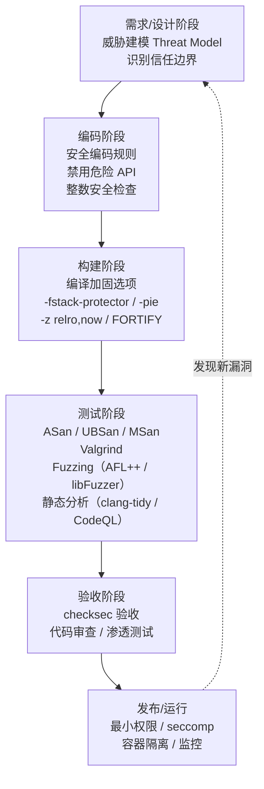
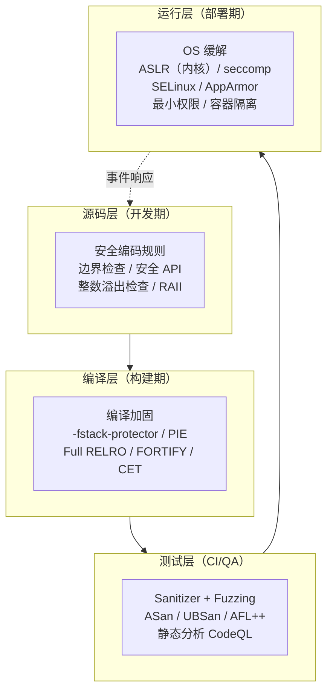
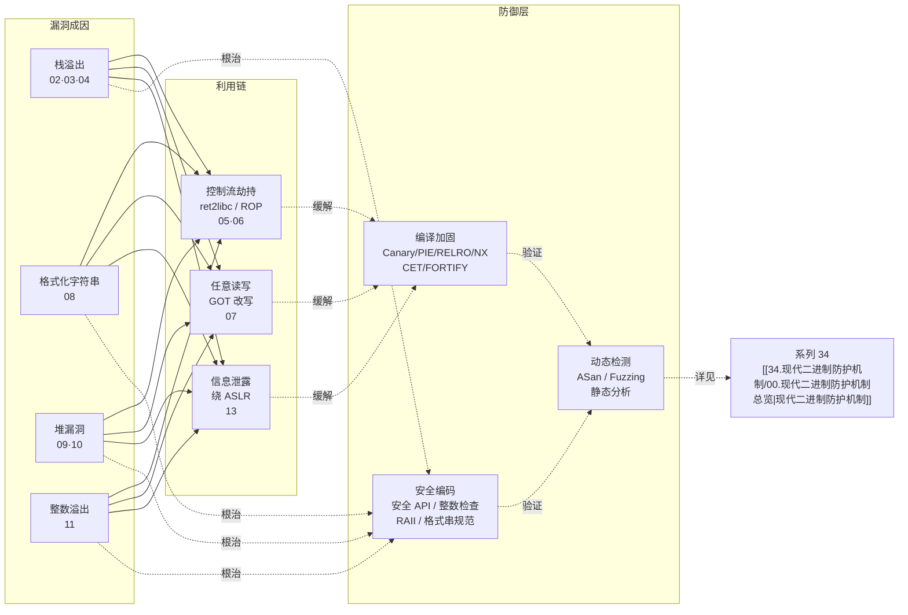

# 二进制漏洞与利用基础（14）· 安全开发与防御

> [!abstract] TL;DR
> 本系列前 13 篇把"漏洞如何形成、如何被利用"讲透了——本篇是**防御侧的总收官**：把每类漏洞对应的安全编码规则、编译加固选项、运行期检测工具、SDLC 流程节点**汇成可操作清单**，让你在动笔写代码的第一行就把攻击面挡在门外。核心结论：**防御不是打补丁，而是在每个开发环节都主动消除利用前提**。

---

## 概述与定位

回顾一下这 14 篇走过的路：

- **[[01.内存布局与漏洞概览]]** 建立了"进程内存地图 → 攻击者三类目标"的全景。  
- **[[02.栈溢出基础]] → [[04.栈Canary原理]]** 拆解了栈帧、覆盖返回地址、canary 的工作机制。  
- **[[05.ret2libc]] → [[06.ROP入门]]** 展示了 NX 出现后攻击者如何借 gadget 在不注入代码的情况下劫持控制流。  
- **[[07.GOT劫持与ret2dl-resolve]]** 说明了为什么 RELRO 不能只做一半——`ret2dl-resolve` 绕过 Partial RELRO、Full RELRO 才能堵死（与 [[14.动态链接与加载器详解/15.加载器视角的安全|加载器视角的安全]] 互补）。  
- **[[08.格式化字符串漏洞]]** 讲清了把用户输入当格式串会导致任意读写的根因。  
- **[[09.堆管理基础]] → [[10.堆漏洞入门]]** 解析了 glibc malloc 的元数据结构及 UAF/double-free/堆溢出的利用路径。  
- **[[11.整数溢出与类型混淆]]** 说明了整数运算的隐式转换如何成为内存越界的入口。  
- **[[12.缓解机制总览]] → [[13.现代利用与信息泄露]]** 给出了现代防护的全景与信息泄露在绕过 ASLR 中的核心地位。

现在，该把"看懂攻击"转化为"写不可攻击的代码"了。

---

## 安全开发流程总览



---

## 缓解与防御

## 安全编码规则

### 边界检查：永远不要信任长度

每一次将外部数据写入缓冲区，都必须在写入**之前**验证目标缓冲区是否足够。  
[[02.栈溢出基础]] 里的经典栈溢出，根因就是 `read()` 或 `memcpy()` 没有限制写入长度。

```c
/* ❌ 危险：未检查长度 */
void bad(char *user_input) {
    char buf[64];
    strcpy(buf, user_input);   /* user_input 超过 64 字节 → 栈溢出 */
}

/* ⚠️ strncpy 需手动补 NUL 终止（src 长度 ≥ n 时不补）：单独使用 strncpy 并不安全 */
void good_strncpy(const char *user_input) {
    char buf[64];
    strncpy(buf, user_input, sizeof(buf) - 1);
    buf[sizeof(buf) - 1] = '\0';   /* ⚠️ 必须！strncpy 在截断时不写 NUL，省略此行即栈溢出 */
}

/* ✅ 推荐：snprintf 总保证 NUL 终止，无需手动补 */
void good(const char *user_input) {
    char buf[64];
    snprintf(buf, sizeof(buf), "%s", user_input);
}
```

更推荐使用 `snprintf`/`strlcpy`（BSD/glibc 2.38+），它们在截断时**总会保证 NUL 终止**：

```c
strlcpy(buf, user_input, sizeof(buf));   /* 返回值 = 源字符串实际长度，可判断是否截断 */
snprintf(buf, sizeof(buf), "%s", user_input);
fgets(line, sizeof(line), stdin);        /* 代替 gets */
```

### 禁用危险 API

| 危险函数 | 根本问题 | 安全替代 |
|---|---|---|
| `gets` | 无长度限制，无可救药 | `fgets(buf, sizeof(buf), stdin)` |
| `strcpy` | 目标不检查长度 | `strlcpy` / `strncpy`（需手动补 NUL）|
| `strcat` | 同上 | `strlcat` / `strncat` |
| `sprintf` | 同上（格式串也危险）| `snprintf` |
| `scanf("%s", ...)` | 同 `gets` | `scanf("%63s", ...)` 限宽 |
| `system(user_str)` | 命令注入 + 继承当前权限 | `execve` + 参数数组 + 最小权限 |

> [!warning] 关于 `gets`
> C11 已将 `gets` 从标准移除，现代编译器对其报 warning/error。项目中绝不应出现 `gets`——它是 [[02.栈溢出基础]] 中最经典教学示例的罪魁祸首。

### 整数安全：用内建溢出检查

[[11.整数溢出与类型混淆]] 详述了整数运算如何悄悄"绕回"并作为内存分配大小，导致实际写入超出分配量。  
GCC/Clang 提供无 UB 的溢出检查内建函数：

```c
#include <stdint.h>

/* ❌ 危险：两个 size_t 相乘可能溢出，之后传给 malloc */
void *bad_alloc(size_t n, size_t elem_size) {
    return malloc(n * elem_size);
}

/* ✅ 安全：用 __builtin_mul_overflow 检查 */
void *safe_alloc(size_t n, size_t elem_size) {
    size_t total;
    if (__builtin_mul_overflow(n, elem_size, &total))
        return NULL;   /* 溢出，拒绝分配 */
    return malloc(total);
}
```

同族函数：`__builtin_add_overflow(a, b, &result)`、`__builtin_sub_overflow`，三者在 GCC 5+ / Clang 3.8+ 均可用，溢出时返回非零，结果存入第三个参数。

### 格式化字符串：永不把用户输入当格式串

[[08.格式化字符串漏洞]] 的根因只有一句话：把用户可控字符串直接传给 `printf` 的第一个参数。  
修复同样只需一句话：

```c
/* ❌ 触发任意读写 */
printf(user_str);

/* ✅ 永远用字面量格式串 */
printf("%s", user_str);
```

编译时加 `-Wformat-security`（见后文编译选项表），任何 `printf(non-literal)` 都会报 warning。

### 内存生命周期：释放后置空 / RAII

[[10.堆漏洞入门]] 里 UAF 的前提是指针在 `free()` 后仍然被使用。  
最简单的缓解：**free 之后立即把指针置 NULL**，再次 dereference 会触发 NULL deref（crash）而不是悄悄读写已重用的内存：

```c
free(ptr);
ptr = NULL;   /* 关键：阻断 UAF 的"重用"路径 */
```

C++ 中优先使用 RAII（`std::unique_ptr`/`std::shared_ptr`），从根本上杜绝手动 free 的时机问题。

---

## 编译加固选项汇总

> [!warning] 教学环境声明
> 本系列前几篇为了"复现教学现象"会用 `-fno-stack-protector -no-pie -z execstack` 等关闭防护。**下表是生产环境应当开启的选项**；Debian/Ubuntu 的 `dpkg-buildflags`、Fedora 的 RPM 宏均已默认包含大部分选项。

| 编译 / 链接选项 | 防御目标 | 对应系列篇章 |
|---|---|---|
| `-D_FORTIFY_SOURCE=2`（或 `=3`） | 为 `memcpy`/`strcpy` 等插入运行期长度检查；`=3` 进一步覆盖更多调用点 | [[02.栈溢出基础]] / [[10.堆漏洞入门]] |
| `-fstack-protector-strong` | 在含本地数组/指针的函数插入 canary，检测栈溢出；比 `-all` 开销低 | [[04.栈Canary原理]] |
| `-fstack-clash-protection` | 在栈增长时以探测页（probe）方式防止越过 guard page 跳入堆/映射区 | [[02.栈溢出基础]] |
| `-fPIE -pie` | 生成位置无关可执行文件，启用 ASLR 效果（代码段随机化） | [[05.ret2libc]] / [[06.ROP入门]] |
| `-Wl,-z,relro,-z,now` | Full RELRO：加载期解析全部符号后把 GOT 锁只读，堵 GOT 改写 | [[07.GOT劫持与ret2dl-resolve]] |
| `-Wl,-z,noexecstack` | 标记栈段 `PT_GNU_STACK` 不可执行（NX/W^X） | [[03.Shellcode概念]] |
| `-fcf-protection=full` | 启用 Intel CET（IBT + Shadow Stack），对 ROP/JOP 提供硬件级防护 | [[06.ROP入门]] / [[12.缓解机制总览]] |
| `-Wformat-security` | 对非字面量格式串发出 warning，默认开启；配合 `-Werror` 变编译错误 | [[08.格式化字符串漏洞]] |
| `-fno-delete-null-pointer-checks` | 阻止编译器以"指针不为 NULL"为由优化掉 NULL 检查，防止 NULL deref 被静默消除 | — |

**一行式模板**（Linux GCC/Clang，生产构建）：

```bash
CFLAGS="-O2 -D_FORTIFY_SOURCE=2 -fstack-protector-strong \
        -fstack-clash-protection -fPIE -Wformat-security -Werror=format-security"
LDFLAGS="-pie -Wl,-z,relro,-z,now -Wl,-z,noexecstack"
```

CET 支持（需 CPU 和内核同时支持 CET）：

```bash
CFLAGS+=" -fcf-protection=full"
```

---

## 分析工具：在 CI 中发现问题

### 运行期 Sanitizers（Address/Undefined/Memory）

| 工具 | 编译选项 | 检测目标 |
|---|---|---|
| **ASan**（AddressSanitizer）| `-fsanitize=address -g` | 越界访问、堆溢出、UAF、double-free、栈溢出 |
| **UBSan**（UndefinedBehaviorSanitizer）| `-fsanitize=undefined -g` | 有符号整数溢出、空指针解引用、非对齐访问等 UB |
| **MSan**（MemorySanitizer）| `-fsanitize=memory -g` | 未初始化内存读取（仅 Clang）|
| **LSan**（LeakSanitizer）| `-fsanitize=leak -g`（ASan 默认含）| 内存泄漏 |

> [!warning] 示例输出为示意
> ASan 典型报告如下，实际地址与偏移因版本/平台而异：
> ```
> ==12345==ERROR: AddressSanitizer: heap-buffer-overflow on address 0x602000000014
> READ of size 4 at 0x602000000014 thread T0
>     #0 0x401234 in vuln /tmp/vuln.c:10
>     #1 0x401300 in main /tmp/vuln.c:20
> ```

ASan 与 UBSan 可同时启用：`-fsanitize=address,undefined`。**不要在生产二进制中使用**（开销约 2x，且插入额外代码段），仅用于 CI/测试构建。

### Valgrind（内存错误检测）

```bash
valgrind --leak-check=full --track-origins=yes ./target
```

无需重新编译（仅需 `-g`）。对于 UAF / use-after-free 和内存泄漏检测完备，但速度较 ASan 慢约 10x，适合专项调试而非 CI 每次构建。

### Fuzzing：让随机输入暴露边界错误

结合 Sanitizer 使用 fuzzing，一旦 fuzzer 触发崩溃，Sanitizer 会提供精确的错误位置：

```bash
# libFuzzer（Clang 内建）
clang -O1 -fsanitize=address,fuzzer -g -o fuzz_target fuzz_target.c
./fuzz_target corpus/

# AFL++（支持 GCC/Clang，覆盖率引导）
CC=afl-clang-fast AFL_USE_ASAN=1 make
afl-fuzz -i seeds/ -o findings/ -- ./target @@
```

> [!warning] 示例输出为示意
> libFuzzer 发现崩溃后输出类似：
> ```
> ==CRASH== AddressSanitizer: heap-buffer-overflow
> MS: 2 ChangeByte-InsertByte; base unit: ...
> artifact_prefix='./'; Test unit written to ./crash-<hash>
> ```

fuzzing 对发现 [[08.格式化字符串漏洞]]、[[10.堆漏洞入门]] 类的边界条件特别有效——这些路径通过人工审计极难覆盖全。

### 静态分析

| 工具 | 特点 |
|---|---|
| **clang-tidy** | 基于 AST 的 C/C++ lint，含 `clang-analyzer-security.*` 检查器（`gets`/`strcpy` 等均有规则）|
| **cppcheck** | 轻量，支持增量分析，适合 CI 快速扫描；对整数截断、指针算术有专项检查 |
| **CodeQL** | 数据流分析 + 图查询，能追踪"用户输入流向 `strcpy` 目标"这类跨函数污点路径 |
| **Semgrep** | 基于语法模式的快速规则引擎，可自定义规则禁用危险 API |

```bash
# clang-tidy 示例（检查格式化字符串与缓冲区相关规则）
clang-tidy --checks='clang-analyzer-security.*,bugprone-*' src/*.c -- -I.

# cppcheck
cppcheck --enable=all --inconclusive --std=c11 src/
```

---

## checksec 验收

`checksec`（pwntools 附带或独立安装）一行命令读取 ELF 程序头，汇报所有关键加固状态：

```bash
checksec --file=./target
```

> [!warning] 示例输出为示意
> 完整加固的二进制输出（示意值）：
> ```
> [*] './target'
>     Arch:     amd64-64-little
>     RELRO:    Full RELRO
>     Stack:    Canary found
>     NX:       NX enabled
>     PIE:      PIE enabled
>     FORTIFY:  Enabled
> ```
> 若有任何一项为 `No`/`Disabled`，即对应某类利用路径仍开放——参照前文编译选项表补上对应选项重新构建。

各字段与本系列的对应：

| checksec 字段 | 对应篇章 | 开启选项 |
|---|---|---|
| Full RELRO | [[07.GOT劫持与ret2dl-resolve]] | `-Wl,-z,relro,-z,now` |
| Canary found | [[04.栈Canary原理]] | `-fstack-protector-strong` |
| NX enabled | [[03.Shellcode概念]] | `-Wl,-z,noexecstack` |
| PIE enabled | [[05.ret2libc]] / [[06.ROP入门]] | `-fPIE -pie` |
| FORTIFY | [[02.栈溢出基础]] | `-D_FORTIFY_SOURCE=2` |

### checksec 字段与攻击面逐一对应

`checksec` 的每个字段关闭后，**开放的不是模糊的"风险"，而是具体的利用路径**。下表把字段弱值与可直接使用的攻击技术对应，便于评估实际影响：

| checksec 字段 | 弱值 | 直接开放的利用路径 | 攻击难度变化 |
|---|---|---|---|
| **RELRO** | `No RELRO` | `.got.plt` 可写 → 任意函数调用后覆盖 GOT 条目 → 下次调用跳到任意地址（GOT 劫持，见 [[07.GOT劫持与ret2dl-resolve]]） | 有任意写即可完成，无需信息泄露 |
| **RELRO** | `Partial RELRO` | `.got.plt` 仍可写（仅 `.got` 只读）→ ret2dl-resolve 伪造 `link_map`/重定位结构骗加载器解析任意函数 | 需要堆/栈可写区域布置结构体 |
| **Stack** | `No canary found` | 栈上缓冲区溢出可直接线性覆盖返回地址 → ret2libc / ROP 一步到位（见 [[02.栈溢出基础]]、[[06.ROP入门]]） | 只需能溢出，无需先泄露 canary |
| **NX** | `NX disabled`（可执行栈） | 注入 shellcode 到栈/堆后直接跳转执行（见 [[03.Shellcode概念]]） | 极低：溢出控制 EIP/RIP 跳入 shellcode 即可 |
| **PIE** | `No PIE (0x400000)` | 主程序代码段、GOT、`.data`/`.bss` 地址固定 → ROP gadget 地址硬编码，无需泄露；GOT 改写目标地址已知 | ASLR 只随机化 libc/堆/栈，主程序部分完全确定 |
| **FORTIFY** | `Disabled` | `strcpy`/`memcpy`/`sprintf` 等无运行时长度校验 → 缓冲区溢出在越界时不触发 `__chk_fail`，也不阻断 `%n` 格式化写（见 [[08.格式化字符串漏洞]]） | 增加了可靠性：溢出更容易不崩溃地完成 |

**字段组合的乘数效应**：

- `No PIE` + `No canary`：ROP 链地址硬编码 + 无需泄露 canary → 仅凭栈溢出即可完成完整利用，几乎等同于 2000 年代难度。
- `Partial RELRO` + `No PIE`：GOT 地址固定且可写 → 最简单的 GOT 劫持，单次任意写即得 shell。
- `NX disabled` + `No PIE`：shellcode 注入最低难度场景，初学者的第一个"真实"靶机通常是这个配置。
- `Full RELRO` + `PIE` + `Canary`（缺 Fortify）：GOT/canary/地址随机化均就位，但 `strcpy` 无长度检查 → 溢出后 canary 检测会触发，可靠利用还需先泄露 canary（复杂度显著上升）。

**五绿之后的残余攻击面**：五项全绿仍不意味着无法利用——`.data`/`.bss` 中的函数指针、堆上 C++ vtable、`malloc_hook`/`free_hook`（glibc < 2.34）都在 checksec 覆盖范围之外。这是 [[12.缓解机制总览]] 的"纵深防御"理念的核心：checksec 五绿是**必要条件**，不是充分条件。

---

## 纵深防御架构

> 单点防御总会被绕过（[[13.现代利用与信息泄露]] 已经展示了信息泄露如何让 ASLR 失效）。纵深防御的核心是：**每一层失守后，下一层仍能阻断或提高利用成本**。



对应 [[34.现代二进制防护机制/00.现代二进制防护机制总览|系列 34]] 系统讲解每一层机制的实现原理。

---

## SDLC 安全节点

安全不是发布前的一次性检查，而是贯穿整个 SDLC（软件开发生命周期）的持续活动：

| 阶段 | 安全活动 | 产出 |
|---|---|---|
| **需求** | 威胁建模（STRIDE）、识别信任边界、定义"安全需求"| 威胁模型文档 |
| **设计** | 最小权限原则、输入验证架构、密钥管理设计 | 安全架构评审 |
| **编码** | 遵守安全编码规则（本篇第二节）、代码审查 checklist | PR 审查记录 |
| **构建** | 强制加固编译选项、checksec 门控（选项不达标则 CI 失败）| 构建产物报告 |
| **测试** | ASan/UBSan/fuzzing 集成到 CI、静态分析扫描 | 缺陷报告 |
| **发布** | 最终 checksec 验收、依赖组件漏洞扫描（SCA）| 安全发布报告 |
| **运行** | 监控异常崩溃（crash 日志）、seccomp 沙箱 | 事件响应 SOP |

---

## seccomp-bpf 工程配置方式

SDLC"运行层"提到了 seccomp 沙箱，本节给出从零到可用的工程配置步骤。seccomp-bpf 是编译加固之外**最重要的运行层防御**，实现方式有两种：裸 `prctl` 手写 BPF 字节码，以及 libseccomp 高层封装。

### 裸 prctl 方式

`prctl(PR_SET_SECCOMP, SECCOMP_MODE_FILTER, &prog)` 需要先用 `prctl(PR_SET_NO_NEW_PRIVS, 1, 0, 0, 0)` 关闭 `setuid`/`setcap` 等提权路径（否则 Linux 会拒绝安装过滤器），再传入一个 `struct sock_fprog`（BPF 字节码数组 + 长度）：

```c
// seccomp_raw_demo.c — 裸 prctl + BPF 字节码示例
// 编译：gcc -o seccomp_raw_demo seccomp_raw_demo.c
// 需要 Linux kernel 3.5+；本机 Windows 无法运行，以下为原理示意
#include <stdio.h>
#include <stdlib.h>
#include <unistd.h>
#include <sys/prctl.h>
#include <sys/syscall.h>
#include <linux/filter.h>
#include <linux/seccomp.h>
#include <linux/audit.h>  // AUDIT_ARCH_X86_64
#include <stddef.h>       // offsetof

// BPF 宏封装（标准写法，来自 kernel samples/seccomp）
#define VALIDATE_ARCH \
    BPF_STMT(BPF_LD | BPF_W | BPF_ABS, \
             offsetof(struct seccomp_data, arch)), \
    BPF_JUMP(BPF_JMP | BPF_JEQ | BPF_K, AUDIT_ARCH_X86_64, 1, 0), \
    BPF_STMT(BPF_RET | BPF_K, SECCOMP_RET_KILL_PROCESS)

#define ALLOW_SYSCALL(name) \
    BPF_JUMP(BPF_JMP | BPF_JEQ | BPF_K, __NR_##name, 0, 1), \
    BPF_STMT(BPF_RET | BPF_K, SECCOMP_RET_ALLOW)

#define KILL_PROCESS \
    BPF_STMT(BPF_RET | BPF_K, SECCOMP_RET_KILL_PROCESS)

static void install_seccomp_filter(void) {
    // 最小 allowlist：只允许 read/write/exit/exit_group/close/fstat/mmap/brk/munmap
    // 其余 syscall（execve、socket、open、clone 等）一律 KILL_PROCESS
    struct sock_filter filter[] = {
        VALIDATE_ARCH,
        // 加载 syscall 编号
        BPF_STMT(BPF_LD | BPF_W | BPF_ABS, offsetof(struct seccomp_data, nr)),
        ALLOW_SYSCALL(read),
        ALLOW_SYSCALL(write),
        ALLOW_SYSCALL(close),
        ALLOW_SYSCALL(fstat),
        ALLOW_SYSCALL(mmap),
        ALLOW_SYSCALL(brk),
        ALLOW_SYSCALL(munmap),
        ALLOW_SYSCALL(exit),
        ALLOW_SYSCALL(exit_group),
        KILL_PROCESS,  // 其余全部拒绝
    };
    struct sock_fprog prog = {
        .len    = (unsigned short)(sizeof(filter) / sizeof(filter[0])),
        .filter = filter,
    };

    // 步骤 1：关闭提权路径（必须在 PR_SET_SECCOMP 之前调用）
    if (prctl(PR_SET_NO_NEW_PRIVS, 1, 0, 0, 0) != 0) {
        perror("prctl(PR_SET_NO_NEW_PRIVS)");
        exit(1);
    }
    // 步骤 2：安装 BPF 过滤器
    if (prctl(PR_SET_SECCOMP, SECCOMP_MODE_FILTER, &prog) != 0) {
        perror("prctl(PR_SET_SECCOMP)");
        exit(1);
    }
}

int main(void) {
    install_seccomp_filter();
    printf("seccomp 已安装，execve 被禁止\n");
    // 以下调用会触发 SECCOMP_RET_KILL_PROCESS，进程立即终止
    // execve("/bin/sh", NULL, NULL);   // ← 取消注释测试
    return 0;
}
```

> [!warning] 以上代码需在 Linux 环境运行，本机为 Windows，为原理示意。实际部署时 allowlist 应根据程序实际需要的 syscall 收窄，可通过 `strace -c` 统计程序运行期间调用的 syscall 集合作为起点。

### libseccomp 封装方式

裸 BPF 字节码可读性差、维护困难。`libseccomp`（Ubuntu/Debian: `apt install libseccomp-dev`）提供更高层的 C API：

```c
// seccomp_libseccomp_demo.c — libseccomp 高层 API 示例
// 编译：gcc -o seccomp_libseccomp_demo seccomp_libseccomp_demo.c -lseccomp
// 需要 libseccomp >= 2.3；本机 Windows 无法运行，以下为原理示意
#include <stdio.h>
#include <stdlib.h>
#include <seccomp.h>  // libseccomp 头文件

static void install_seccomp_libseccomp(void) {
    scmp_filter_ctx ctx;

    // 步骤 1：初始化上下文，默认 action = SCMP_ACT_KILL_PROCESS
    // 所有未显式 allow 的 syscall 都会 KILL_PROCESS
    ctx = seccomp_init(SCMP_ACT_KILL_PROCESS);
    if (!ctx) {
        fprintf(stderr, "seccomp_init 失败\n");
        exit(1);
    }

    // 步骤 2：逐条添加 allowlist 规则
    // seccomp_rule_add(ctx, action, syscall_nr, arg_count, ...)
    // arg_count=0 表示不过滤参数，只按 syscall 号匹配
    seccomp_rule_add(ctx, SCMP_ACT_ALLOW, SCMP_SYS(read),       0);
    seccomp_rule_add(ctx, SCMP_ACT_ALLOW, SCMP_SYS(write),      0);
    seccomp_rule_add(ctx, SCMP_ACT_ALLOW, SCMP_SYS(close),      0);
    seccomp_rule_add(ctx, SCMP_ACT_ALLOW, SCMP_SYS(fstat),      0);
    seccomp_rule_add(ctx, SCMP_ACT_ALLOW, SCMP_SYS(mmap),       0);
    seccomp_rule_add(ctx, SCMP_ACT_ALLOW, SCMP_SYS(brk),        0);
    seccomp_rule_add(ctx, SCMP_ACT_ALLOW, SCMP_SYS(munmap),     0);
    seccomp_rule_add(ctx, SCMP_ACT_ALLOW, SCMP_SYS(exit),       0);
    seccomp_rule_add(ctx, SCMP_ACT_ALLOW, SCMP_SYS(exit_group), 0);

    // 步骤 3：加载（等价于 prctl(PR_SET_NO_NEW_PRIVS) + PR_SET_SECCOMP）
    if (seccomp_load(ctx) < 0) {
        fprintf(stderr, "seccomp_load 失败\n");
        seccomp_release(ctx);
        exit(1);
    }

    seccomp_release(ctx);
}

int main(void) {
    install_seccomp_libseccomp();
    printf("seccomp (libseccomp) 已安装\n");
    return 0;
}
```

### 最小 allowlist 集合参考

以下是常见场景的最小 syscall 集，可作为 allowlist 起点（不同程序实际需求有差异，务必用 `strace -c` 验证）：

| 场景 | 核心 syscall | 通常禁止的高危 syscall |
|------|------------|----------------------|
| 纯计算（无 IO） | `read`/`write`/`exit`/`exit_group`/`brk` | `execve`、`socket`、`clone`、`ptrace`、`open`/`openat` |
| 文件处理服务 | 上述 + `open`/`openat`/`close`/`fstat`/`lseek`/`mmap`/`munmap` | `execve`、`socket`、`clone`、`ptrace` |
| 网络服务（已建连后）| 上述（不含 `socket`）+ `send`/`recv`/`sendto`/`recvfrom` | `execve`、`clone`、`ptrace`、`open`/`openat`（若不需要文件访问） |
| 沙箱内子进程 | `read`/`write`/`exit`/`exit_group` | 其余全部 |

### 工程最佳实践

1. **在主逻辑初始化完成后、处理不可信输入之前**安装 seccomp 过滤器：初始化阶段可能需要 `open` 配置文件、`socket` 建立连接，这些在过滤器安装前完成，之后再锁定。

2. **先用 `SCMP_ACT_ERRNO(ENOSYS)` 代替 `SCMP_ACT_KILL_PROCESS` 调试**：拒绝时返回错误码而非杀进程，便于观察哪些 syscall 被触发，再切换到 KILL。

3. **`strace -c ./program` 统计 syscall 频率**：作为构建 allowlist 的数据来源，避免遗漏合法 syscall 导致程序功能异常。

4. **多线程程序注意 `clone`/`futex`/`set_robust_list` 等线程相关 syscall**：若程序使用线程，这些必须在 allowlist 中。

5. **与 Docker/容器的 seccomp profile 结合**：Docker 默认 seccomp profile 已禁用约 44 个高危 syscall，自定义 profile 可进一步收窄，详见 [[21.seccomp沙箱逃逸]] 的防御章节。

---

## 最小教学示例：从"有漏洞"到"加固"

以下展示一个包含多类缺陷的程序，以及加固后的对比。

**教学目标**：看清每条修改对应哪类漏洞。

```c
/* vuln.c —— 教学用，刻意包含多类问题 */
#include <stdio.h>
#include <string.h>
#include <stdlib.h>

void process(char *input) {
    char buf[64];
    strcpy(buf, input);        /* ① 栈溢出（见 02 篇）*/
    printf(buf);               /* ② 格式化字符串（见 08 篇）*/
}

int main(int argc, char *argv[]) {
    if (argc < 2) return 1;
    size_t n = atoi(argv[1]);
    char *heap = malloc(n * 8); /* ③ 整数溢出（见 11 篇）*/
    process(argv[2]);
    free(heap);
    process(argv[2]);           /* ④ UAF（heap 已 free，见 10 篇）*/
    return 0;
}
```

> [!warning] 教学环境声明
> 以下编译命令关闭了现代防护以复现教学现象；**生产环境绝不应如此编译**。

```bash
# 教学环境：关闭防护复现漏洞
gcc -O0 -fno-stack-protector -no-pie -z execstack -o vuln vuln.c
```

加固后：

```c
/* fixed.c —— 对应修复 */
#include <stdio.h>
#include <string.h>
#include <stdlib.h>
#include <stdint.h>

void process(const char *input) {
    char buf[64];
    snprintf(buf, sizeof(buf), "%s", input);   /* ① 限长 + ② 固定格式串 */
    printf("%s", buf);
}

int main(int argc, char *argv[]) {
    if (argc < 2) return 1;
    size_t n = (size_t)atoi(argv[1]);
    size_t total;
    if (__builtin_mul_overflow(n, (size_t)8, &total)) {  /* ③ 溢出检查 */
        fprintf(stderr, "size overflow\n");
        return 1;
    }
    char *heap = malloc(total);
    if (!heap) return 1;
    process(argv[2]);
    free(heap);
    heap = NULL;                 /* ④ 释放后置 NULL，后续不再使用 */
    return 0;
}
```

```bash
# 生产构建：开启全部加固
gcc -O2 -D_FORTIFY_SOURCE=2 -fstack-protector-strong -fstack-clash-protection \
    -fPIE -Wformat-security -Werror=format-security \
    -Wl,-z,relro,-z,now -Wl,-z,noexecstack \
    -pie -o fixed fixed.c
```

用 `checksec` 验收：

```bash
checksec --file=./fixed
```

> [!warning] 示例输出为示意
> ```
> [*] './fixed'
>     Arch:     amd64-64-little
>     RELRO:    Full RELRO
>     Stack:    Canary found
>     NX:       NX enabled
>     PIE:      PIE enabled
>     FORTIFY:  Enabled
> ```

五项全绿，对应本系列各篇讲述的所有主要利用路径均已封堵。

---

## 系列全景回顾：漏洞 → 利用 → 防御



---

## 小结

本篇是系列 33 的**防御收官**，核心结论：

1. **安全编码是第一道防线**：`gets`/`strcpy`/`sprintf`/`system` 永远不该出现在新代码里；格式串必须是字面量；整数运算涉及内存大小时用 `__builtin_*_overflow` 检查；堆指针 free 后立即置 NULL。

2. **编译加固是最低成本的系统性防御**：一行构建配置，开启 `-fstack-protector-strong -D_FORTIFY_SOURCE=2 -fPIE -pie -Wl,-z,relro,-z,now -Wl,-z,noexecstack`，就能覆盖 canary / FORTIFY / PIE / Full RELRO / NX 五项主要缓解（详见上文选项表）。

3. **Sanitizer + Fuzzing 是 CI 层的漏洞发现器**：ASan/UBSan 能捕获开发者肉眼看不到的越界；fuzzing 能找到覆盖率驱动下的深层边界条件——两者结合使用效果最佳。

4. **纵深防御**：没有单一机制能挡住所有攻击，[[13.现代利用与信息泄露]] 已经证明信息泄露能让 ASLR 失效。防御的价值在于让每一步利用都需要额外工作，直到整体利用链不再可行。

5. **`checksec` 验收是发布门控**：每个可交付二进制在发布前都应通过 checksec 验收，确保五项（RELRO/Canary/NX/PIE/FORTIFY）全部开启。

防护机制的原理详解见 [[34.现代二进制防护机制/00.现代二进制防护机制总览|系列 34：现代二进制防护机制]]。

---

## 相关阅读

- [[01.内存布局与漏洞概览]] — 系列入口，漏洞类型全景
- [[13.现代利用与信息泄露]] — 信息泄露如何让现代防护失效（上一篇）
- [[07.GOT劫持与ret2dl-resolve]] — GOT 改写与 Full RELRO 的必要性
- [[08.格式化字符串漏洞]] — 格式串漏洞根因与编译器防御
- [[11.整数溢出与类型混淆]] — 整数安全与 `__builtin_*_overflow`
- [[11.ELF文件详解/17.got节|GOT 节详解（ELF 系列 17）]] — GOT 结构与 RELRO 深度
- [[14.动态链接与加载器详解/15.加载器视角的安全|加载器视角的安全（14 系列 15）]] — RELRO 实现、ret2dl-resolve、AT_SECURE
- [[34.现代二进制防护机制/00.现代二进制防护机制总览|系列 34：现代二进制防护机制]] — 防护机制系统讲解

---

⬅️ 上一篇 [[13.现代利用与信息泄露]] ｜ 🏠 [[00.二进制漏洞与利用基础总览]] ｜ 下一篇 [[00.二进制漏洞与利用基础总览]] ➡️
