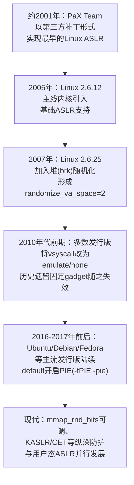
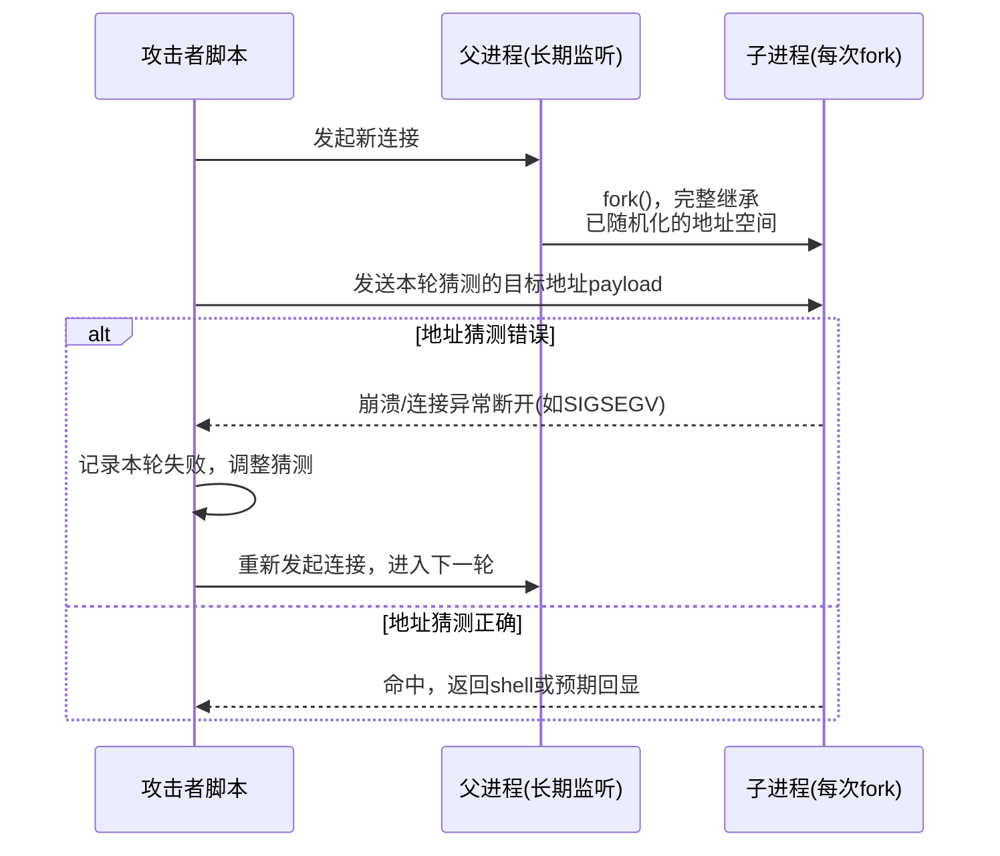
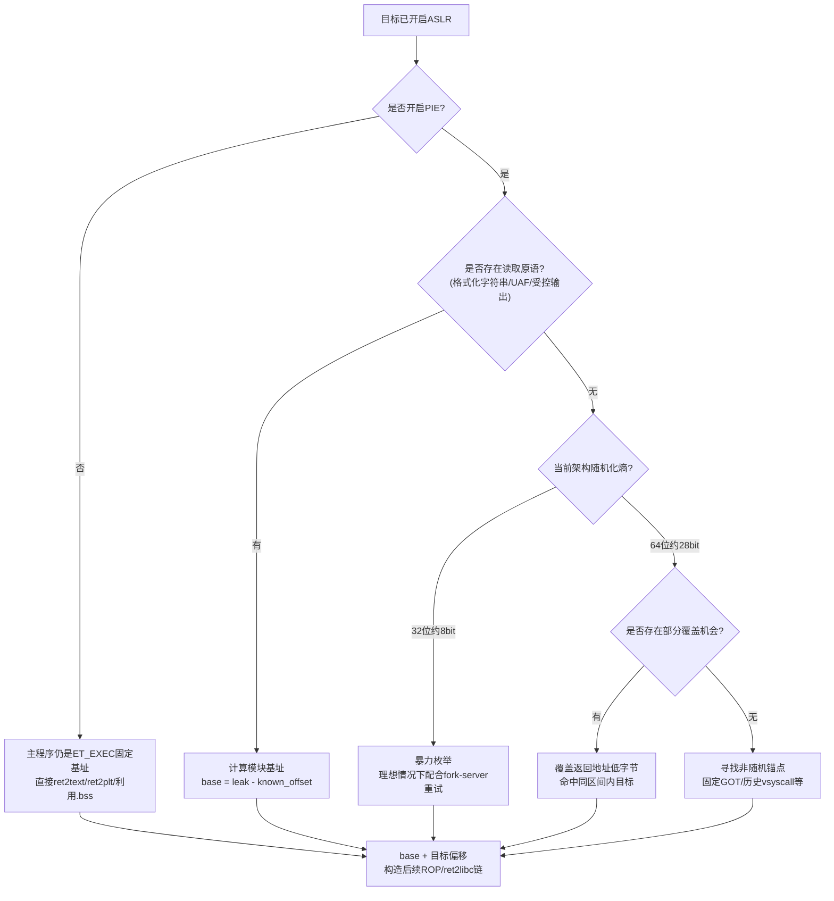

# 二进制漏洞与利用基础（15）· ASLR与PIE绕过技术

> [!abstract] TL;DR
> - ASLR是内核在进程创建时对栈、堆、mmap（含共享库与vdso）等内存区域基址做随机化的缓解机制，PIE则是让主可执行文件本身也能像共享库一样被随机化加载的编译期开关，二者叠加才能获得“全随机化”效果，缺一都会留下固定锚点。
> - Linux的ASLR随机化粒度是“页”而不是字节——基址低12位恒为0，这既是“部分覆盖”技术能够成立的根源，也是“只需泄露一个地址就能反推整个模块布局”的原理基础。
> - 信息泄露、部分覆盖、暴力枚举、非随机区利用这四类绕过手段，分别对应“有读原语”“写入宽度受限”“随机化熵不足”“某处根本没有随机化”四种不同的前提条件，实战中往往组合而非单独出现。
> - 64位约28 bit的mmap随机化熵使纯暴力现实中不可行，但32位约8 bit熵、以及fork-server架构下子进程共享父进程已随机化的地址空间，会让暴力枚举重新变得高效可行。
> - pwntools的`DynELF`、`ELF`符号计算、`checksec`等工具把“泄露地址→减偏移得基址→加偏移得目标”这套原理封装成了几行代码，理解其背后原理才能在工具失效、需要手工推导的场景中不至于卡死。

## 概述与定位

ASLR（Address Space Layout Randomization，地址空间布局随机化）与PIE（Position-Independent Executable，位置无关可执行文件）是Linux平台上覆盖面最广、几乎默认对所有程序生效的一对内存破坏缓解机制。它们既不修补漏洞本身，也不检测漏洞是否被触发，而是从利用链的最后一环——“控制流被劫持之后往哪跳”——釜底抽薪：哪怕攻击者已经完全控制了返回地址、函数指针或虚表指针，只要不知道栈、堆、共享库、甚至可执行文件本身被加载到了内存的哪个位置，这份控制权就无法转化为可预测的执行结果。

这与本系列前十四篇构成了直接的因果关系。第2至8篇讨论的栈溢出、shellcode注入、ret2text/ret2syscall、ret2libc、ROP、栈迁移，第9至13篇讨论的格式化字符串、整数溢出、堆漏洞、SROP、JOP/COP，几乎全部隐含一个共同前提：攻击者已知shellcode、libc函数、gadget序列或伪造栈帧在内存中的确切地址，或者目标程序根本没有开启地址随机化。一旦ASLR与PIE同时生效，这个前提就不再自动成立——本篇处理的正是“前提被拿走之后如何重新拿回来”，它是后续第16章GOT劫持、第17章IO_FILE利用、第18章one_gadget等技术能够继续推进的先决步骤，可以理解为整条利用链里承上启下的“定位”环节。

一个便于把握其本质的类比来自上一篇（[[14.Canary泄露与绕过]]）：Canary防御的是“栈被破坏之后能否被检测出来”，属于完整性校验类机制；ASLR/PIE防御的是“即使控制流已被劫持，攻击者是否知道该往哪跳”，属于不可预测性类机制。两者的共性远大于表面上的差异：都不改变漏洞本身是否存在，只是提高了利用所需付出的信息代价；也都存在同一处结构性弱点——只要出现哪怕一次信息泄露，防护强度就会断崖式下跌，从“理论上不可预测”退化为“确定可算”。理解这一共性，是理解本篇几乎所有绕过技术背后统一思想的钥匙。

本篇聚焦Linux用户态场景下ASLR与PIE的绕过原理与四类核心技术手法：信息泄露、部分覆盖、暴力枚举、非随机区利用。这四类技术彼此独立成体系却常常在真实利用链里组合出现。堆分配器内部结构与House of系列堆利用手法在[[24.内存管理与堆分配器/17.堆利用手法体系House_of系列]]等篇章详细展开，本文只在讨论“堆地址作为泄露来源”时略作涉及；GOT/PLT的具体劫持payload构造留给第16章，本文只讨论“GOT表项作为非随机锚点”这一层原理；内核态的KASLR机制与用户态ASLR原理相通但实现和攻击面完全不同，将在[[52.Linux内核机制与内核利用/00.Linux内核机制与内核利用总览]]中单独处理。

## 原理与机制

### ASLR的内核实现：随机化对象与粒度

ASLR不是可执行文件里内嵌的功能，而是内核在`execve()`装载程序、以及后续`mmap()`/`brk()`等系统调用申请内存时，对若干关键基址加入随机偏移的运行时行为。它由内核参数`/proc/sys/kernel/randomize_va_space`控制，取值有三档，理解这三档的区别是理解一切绕过技术前提的基础：

- `0`：完全关闭。栈、堆、mmap区域（含共享库、vdso）全部使用固定基址，即使可执行文件本身编译为PIE，其加载基址也会退化为一个固定值（不叠加随机偏移）。
- `1`：保守随机化。栈、mmap区域（共享库、vdso、匿名映射）会被随机化，但堆（通过`brk()`扩展的传统堆）紧跟在数据段之后，不做随机化。
- `2`：完全随机化（现代发行版默认值）。在档位1的基础上，额外对堆基址施加随机偏移，这一能力是Linux 2.6.25之后才加入的，实现方式是在`brk()`系统调用第一次为进程建立堆区间时叠加一个随机offset。

三档之间的差异本质上是“哪些内存区域参与随机化”，而不是“随机化强度的高低”——这个区分在实战中很关键：面对`randomize_va_space=1`的目标（某些精简容器、旧版发行版或人为调低的环境），堆地址是完全可预测的，可以直接作为攻击的突破口，无需任何堆地址泄露。

真正决定“随机化强度”的是另一个参数：`/proc/sys/vm/mmap_rnd_bits`，它规定了mmap基址的随机偏移量占用多少个有效比特位。x86-64平台的典型默认值在28 bit左右（不同发行版、不同内核配置允许调整，一般被限制在28~32 bit区间内），而32位x86平台的典型默认值仅8 bit左右。这一差距不是历史遗留的疏忽，而是有意为之的工程妥协：32位系统总线性地址空间只有4GB，内核通常还要切走1GB左右（常见3:1分割），留给用户态可供mmap自由伸缩的空间本就局促，如果给随机化偏移太大的取值范围，会显著提高地址空间碎片化、大块内存分配失败的概率；64位地址空间理论可用范围高达数十TB（x86-64实际有效虚拟地址是48位，用户态上限约`0x00007fffffffffff`），完全有余量分配更大的随机化熵而不担心碎片化问题。这也是“32位ASLR天生脆弱、更容易被暴力枚举击穿”这一广泛认知的根本原因——不是32位系统的随机化算法更差，而是地址空间本身容不下更多熵。

### PIE：让主程序也能“漂移”

ASLR只负责“在装载时给基址加随机偏移”，但它随机化的前提是这块内存区域本身允许被放在任意位置。传统的可执行文件在ELF头部的`e_type`字段标记为`ET_EXEC`，编译时链接器就把所有符号的地址按照一个固定基址（如`0x400000`）写死在了文件里，装载器只能按这个固定地址加载，没有随机化的余地——即使系统级ASLR已经打开，这类程序的`.text`、`.plt`、`.got.plt`、`.data`、`.bss`等区域仍然会出现在与不开ASLR时完全相同的地址上。

PIE正是为了打破这一限制而生的编译期选项（`gcc -fPIE -pie`）。开启PIE后，可执行文件的`e_type`变为`ET_DYN`，与普通共享库`.so`文件的类型完全相同，全部符号引用都通过GOT间接寻址或RIP相对寻址完成，不再有任何写死的绝对地址——这样一来，加载器（内核+动态链接器）就可以像加载共享库一样，把整个可执行镜像放到内存中的任意页对齐位置，内核为其选择基址时同样会调用随机化逻辑（具体常量是`ELF_ET_DYN_BASE`，在x86-64上大致位于用户态地址空间三分之二处，未叠加随机偏移前长期呈现为业内非常眼熟的`0x555555554000`附近；一旦ASLR开启，这个值上会叠加一个由`mmap_rnd_bits`决定范围的随机偏移）。

需要特别澄清一个容易混淆的概念：PIE和PIC（Position-Independent Code）是同一套底层机制（GOT/PLT重定位、RIP相对寻址）在不同产物上的两种应用——PIC面向共享库（`.so`），PIE面向可执行文件本身。历史上很长一段时间，只有共享库默认编译为位置无关代码，可执行文件默认仍然是`ET_EXEC`固定基址，原因是位置无关代码存在真实的性能代价：访问全局变量、调用外部函数都需要多一次通过GOT的间接寻址，在寄存器数量紧张、不支持高效PC相对寻址的32位x86上这个代价相对明显；到了64位x86，寄存器数量翻倍、且指令集原生支持RIP相对寻址，这一代价被压缩到几乎可忽略的水平。这也是为什么“发行版默认给所有程序开启PIE”这件事，是等到64位平台全面普及、性能顾虑基本消除之后才逐步铺开的——这不是一个纯安全决策，而是安全收益与性能代价长期博弈后的产物。

### 从固定地址到内存布局：0x55与0x7f为何而来

在任何一次实际调试或利用中，几乎都会观察到这样的规律：PIE主程序基址长得像`0x0000555555xxxxxx`，libc等共享库、vdso落在`0x00007fxxxxxxxxxx`附近，栈顶落在`0x00007ffcxxxxxxxx`或`0x00007fffxxxxxxxx`附近。这不是巧合，而是内核内存布局策略的直接体现：

```
用户态虚拟地址空间（x86-64，48位有效地址，上限约0x00007fffffffffff）从高到低大致排布：

0x00007ffxxxxxxxxxx   [栈 stack，向低地址增长]           <- 随机化(stack/mmap rnd)
0x00007fxxxxxxxxxxx   [mmap区：libc等共享库、vdso等]      <- 随机化(约28 bit典型熵)
        ...
0x0000555555xxxxxx    [PIE主程序：.text/.data/.bss]       <- 随机化(仅当编译为ET_DYN)
0x0000555555xxxxxx    [heap，紧跟PIE数据段之后向高地址增长] <- randomize_va_space=2时随机化
0xffffffffff600000     [vsyscall页，若内核仍保留]          <- 历史上固定不随机化
```

栈和mmap共享库区域都是从地址空间的高处向低处生长分配的，因此它们落在接近48位地址空间上限（`0x7fffffffffff`）的位置；PIE主程序使用的是`ELF_ET_DYN_BASE`这个专门为“位置无关可执行文件”预留的锚点常量，该常量被刻意设计在用户态地址空间大致三分之二处，与更靠近顶端的mmap区域区分开来，这样即使两者都参与随机化，也不会因为随机偏移量较大而互相“撞车”重叠；堆则简单地紧跟在PIE主程序的数据段之后向高地址增长，只是这个起点本身也会被brk随机化打散。理解这套布局逻辑，能让你在拿到任意一个泄露地址后迅速判断“这是栈地址、libc地址还是PIE地址”——单看地址开头的`0x55`还是`0x7f`几乎就能一眼定性，这是每个做pwn的人都会形成的条件反射。

### 演进简史

ASLR和PIE并非一开始就是Linux的默认配置，它们的落地经历了相当长的一段渐进过程：



这条时间线揭示了一个常被忽视的事实：ASLR和PIE的“完全体”（栈、堆、库、主程序全部随机化）是相当晚近才成为默认配置的，因此在CTF题目、遗留系统、嵌入式设备、以及为了性能刻意关闭部分防护的服务端程序中，经常能遇到只随机化了一部分区域、甚至完全没开随机化的“半成品”防护状态——这些不完整的状态正是“非随机区利用”这一类技术最主要的现实土壤，而不是纯粹的理论假设。

| 维度 | 32位（x86） | 64位（x86-64） |
|---|---|---|
| 用户态可用地址空间 | 约3GB（常见3:1切分） | 约128TB（48位有效地址） |
| mmap随机化典型熵 | 约8 bit | 约28 bit |
| 暴力枚举现实可行性 | 高，数百次尝试量级内可期望命中 | 极低，需配合信息泄露或部分覆盖才现实 |
| PIE的性能代价 | 相对明显（寄存器紧张，间接寻址开销占比高） | 很小（寄存器充裕，原生支持RIP相对寻址） |
| 默认全面开启PIE的时间 | 相对更晚、更保守 | 更早、更彻底 |

## 绕过技术详解：泄露、覆盖、枚举与非随机锚点

### 信息泄露：找到一个已知点，反推整个模块

信息泄露是绕过ASLR/PIE最直接、也是实战中出现频率最高的手段，其数学模型极其简单：

```
已知：某次泄露拿到的运行时地址 leaked_addr
已知：该地址对应的符号/位置，在ELF文件（未加载、未随机化）中的固定偏移 file_offset
则：模块加载基址 base = leaked_addr - file_offset
对任意目标符号，其运行时地址 target_addr = base + target_file_offset
```

整个绕过技术的核心难点因此被压缩成一句话：“想办法让程序告诉你至少一个运行时地址”。能够触发这一点的漏洞原语和途径非常多样，按泄露来源大致可以分为几类：

- **格式化字符串泄露**：`printf(user_input)`这类经典漏洞（参见[[09.格式化字符串漏洞]]）可以用`%p`/`%x`/`%s`系列格式符直接把栈上、甚至寄存器中残留的地址打印出来，是最“廉价”的泄露手段之一，因为往往一次触发就能拿到多个候选地址（返回地址、saved rbp、libc调用者地址等混杂在栈帧里）。
- **溢出后受控输出**：栈溢出配合`puts`/`printf`/`write`等尚未被破坏的函数调用，可以在真正劫持控制流之前，先利用一次“部分溢出+函数调用”把GOT表项内容、栈上某个已知偏移处的值打印出来，这是ret2libc两阶段利用（先泄露、再二次溢出跳转）的标准套路。
- **堆内存残留指针**：free后的chunk中，`fd`/`bk`等链表指针残留着堆基址或（在double-free为tcache/fastbin投毒后）libc基址的痕迹，UAF/OOB读（参见[[11.堆漏洞类型：UAF与double-free与OOB]]）读取这些残留数据是堆利用链中泄露libc/heap基址最常见的方式。
- **未初始化变量/结构体残留**：栈上或堆上尚未清零的旧数据，如果被错误地当作“新分配对象的初始状态”读出并回显给攻击者，同样会泄露地址——这类漏洞往往不是显式的读越界，而是“忘记初始化”这种逻辑缺陷，容易被忽视但同样致命。
- **异常/调试信息回显**：程序崩溃时打印的栈回溯、断言失败信息、core dump路径中偶尔携带的地址片段，都是调试便利性与安全性直接冲突的例子。
- **`/proc/self/maps`等旁路**：如果攻击者能诱导目标进程读取并回显自己的`/proc/self/maps`（例如存在任意文件读且目标恰好读了自己的maps文件），可以一次性拿到该进程当前所有模块的完整基址布局，是最“奢侈”但一击致命的泄露方式。
- **行为型/边信道泄露**：不直接读出地址值，而是通过程序“崩溃与否”“响应时间差异”“返回内容差异”等可观测行为，逐位/逐字节地推断出地址的部分信息——这本质上是把地址判定问题转化为一系列可重复的oracle查询，是后文暴力枚举、以及更进阶的BROP（Blind ROP）技术的理论基础。

拿到一个泄露地址之后，选择“泄露哪个符号”直接决定了后续利用链的走向：泄露libc内部函数地址（如`printf`/`puts`真实地址），是为了后续计算`system`、`/bin/sh`字符串、one_gadget等libc内部资源的运行时地址；泄露PIE主程序内部地址，是为了计算程序自身的gadget、GOT表项、全局变量地址；泄露栈地址，通常用于栈迁移（参见第8篇）或需要在栈上布置ROP链的场景；泄露堆地址，则是为了在UAF/double-free利用中构造能够通过校验的fake chunk。

在没有现成偏移表可查的场景下（比如目标libc版本未知、无法本地对照），pwntools提供的`pwnlib.dynelf.DynELF`工具类展示了信息泄露原理如何被自动化：它只需要攻击者提供一个“读取任意地址N字节内容”的回调函数（这本身就是对某个漏洞的封装），以及一个已知的运行时地址（哪怕只是该模块内某个固定符号，如no-PIE场景下GOT表项本身的地址），随后DynELF会以该地址为起点，按页向低地址扫描找到ELF Header的魔数，进而解析出`.dynamic`段、`.dynsym`、`.dynstr`等结构，在内存中重建出该模块完整的符号表，最终可以像查表一样调用`dynelf.lookup('system', 'libc')`得到目标函数的运行时地址——这一过程本质上就是把“信息泄露→计算基址→查符号偏移”这条推导链条，用一次次的内存读取原语自动化跑了一遍。

### 部分覆盖：字节级的确定性与随机性边界

部分覆盖（Partial Overwrite）针对的是一种非常具体的漏洞形态：溢出只能覆盖返回地址或函数指针的最低若干字节，无法触及更高位字节（例如`scanf("%2s", buf+offset)`这类被长度严格限制的写入，或者溢出恰好在返回地址中间被截断）。它之所以能够绕过ASLR，根源就在于前文反复强调的那条规律——**ASLR的随机化粒度是“页”，模块加载基址的低12 bit（3个十六进制位）恒为0，且同一模块内部各符号之间的相对偏移在编译时就已固定、不随随机化改变**。

以64位小端序的返回地址为例，8字节按内存低地址到高地址排列：

```
  内存偏移:   ret+0  ret+1  ret+2  ret+3  ret+4  ret+5  ret+6  ret+7
  原始字节:   0x14   0x55   0x14   0x55   0x55   0x55   0x00   0x00
              \____________/  \_______________________________/
              溢出能覆盖到的     溢出覆盖不到的高位字节——
              最低1~2字节        随机化基址主要体现在这里
```

如果溢出只能覆盖`ret+0`（1字节，可控范围`0x00~0xff`共256种取值），新地址的高7字节保持原值不变；只有当目标地址与原地址的高7字节完全相同——换句话说，目标符号与原返回地址所指向的位置处于同一个256字节对齐区间内——这次覆盖才能100%确定性命中，不需要任何爆破。如果溢出能覆盖`ret+0`和`ret+1`（2字节，可控范围`0x0000~0xffff`共65536种取值），判定条件相应放宽到“目标与原地址的高6字节相同”，即目标符号与原返回地址落在同一个64KB对齐区间内。

实战中更常见的推导方式不是直接比较绝对地址的高位是否相同，而是换一个角度：已知原返回地址对应函数A，想跳到同一镜像内函数B，A和B在ELF文件里的相对偏移`offset = addr(B) - addr(A)`可以直接用`readelf`/`objdump`/`nm`从静态文件里读出来，是一个完全不依赖运行时随机基址的固定值。此时只需要判断“把原地址的低N字节当作无符号整数加上`offset`，是否会产生向第N+1字节的进位”——如果不产生进位，直接把低N字节改写为`(原低N字节数值 + offset) mod 2^(8N)`即可精确命中；一旦产生进位，说明目标已经跨出了当前256字节（或65536字节）的可控范围，覆盖后落点将进入随机化位段，行为不可预测，通常表现为崩溃。

这也是“1字节覆盖几乎总能精确命中、2字节覆盖开始变得不确定”这一经验法则的真正来源，并且这一法则本身还需要区分两种前提：如果攻击者手上已经掌握了原返回地址的精确数值（比如刚刚经历过一次栈地址泄露），那么无论覆盖1字节还是2字节，是否产生进位都是可以静态计算清楚的，覆盖行为是完全确定性的，不需要猜测；只有当攻击者并不知道原地址的精确值、只是“大致知道目标符号在附近某处”时，才需要真正意义上的爆破——此时1字节覆盖的搜索空间只有256种可能，配合崩溃重试或fork-server在实践中开销很小；2字节覆盖的搜索空间膨胀到65536种，爆破成本显著上升，这才是“2字节部分覆盖不实用”这一说法的真实语境，而不是覆盖字节数本身决定了确定性。

部分覆盖技术在真实场景里最常见的落点，是ret2libc利用链中“已经泄露了A函数地址，但想调用的B函数与A在同一libc内、偏移差距很小（通常在一页甚至几十字节以内）”的情况——此时不需要二次泄露、不需要重新计算完整基址，一次部分覆盖就能省掉整条计算链路；以及PIE程序中“改写返回地址的最低1字节，让程序转而落入同一函数内部的另一条分支路径，或使漏洞点被重复触发形成循环利用”这类需要多次交互爆破的场景。

### 暴力枚举：当熵不足以抵御穷举

暴力枚举（Brute Force）看起来是最“笨”的手段，但在两种现实条件下反而是效率最高的选择：随机化熵本身不足，或者程序架构允许攻击者以极低成本反复重试。

**熵不足的场景**：前文已经给出，32位系统的mmap随机化典型熵只有约8 bit，即基址的有效随机取值大约只有256种。把地址随机化视为一次均匀分布的猜测游戏，命中目标值的期望尝试次数（几何分布的期望为成功概率的倒数）量级为`2^n`次——对于8 bit熵而言，期望在数百次以内的尝试量级上就能命中，这在自动化脚本面前几乎是瞬间完成的；而64位系统约28 bit熵对应`2^28`量级的期望尝试次数（超过2.6亿次），在正常的网络往返延迟和进程重启开销下是完全不现实的，纯暴力必须让位给信息泄露或部分覆盖。

**低成本重试的场景**：暴力枚举能否成立，另一个决定性因素是“每次尝试失败后，随机化基址是否会变化”。如果目标程序每次连接都完整地重新`exec()`一次（如传统inetd非fork模式、或每次由外部脚本重新拉起进程），那么每一次尝试都会重新触发一次独立的随机化，暴力枚举退化为纯粹的概率碰撞，对64位系统而言基本不可行。但如果目标是一个用`fork()`处理并发连接的网络服务（这是Linux服务端非常经典的并发模型），情况完全不同：父进程只在启动时完成一次地址空间随机化，此后每一个`fork()`出来的子进程都完整继承父进程已经确定下来的内存布局——地址随机化只发生了一次，之后所有子进程的地址都完全相同。这意味着攻击者可以针对同一个“随机化实例”反复尝试而不会重启随机化：一次尝试失败最多导致当前子进程崩溃退出，不影响父进程和后续新fork出来的子进程使用同一套地址布局继续尝试。



这一“fork不重新随机化”的性质，正是很多pwn题目和真实早期服务端软件里暴力枚举可行的根源，也是Blind ROP（BROP）等更高级的、完全不依赖任何显式信息泄露、只靠“崩溃/不崩溃”这一个bit的行为差异逐字节爆破出可用gadget地址的技术得以成立的底层前提——本篇不展开BROP的完整流程，但理解“fork-server不重新随机化”这一点，就理解了它为什么能work。

### 非随机区利用：根本不存在的随机化

前三类技术都在与“随机化”正面周旋，第四类技术则是绕开正面战场，直接寻找那些“根本没有被随机化，或者随机化后仍留有固定锚点”的内存区域：

- **未开启PIE的主程序本身**：这是CTF与真实遗留系统中最常见的情形。如果目标程序编译时没有加`-fPIE -pie`（`ET_EXEC`类型），即使系统级ASLR完全打开，该程序的`.text`、`.plt`、`.got.plt`、`.data`、`.bss`等区域依然会加载在与关闭ASLR时完全相同的固定地址——因为ASLR随机化的是“模块被放置的基址”，而`ET_EXEC`类型的模块根本没有“基址”这个自由度，它的加载地址在编译链接时就写死了。这种情况下，`ret2text`、`ret2plt`、利用`.bss`段作为可写空间做栈迁移等技术完全不需要任何信息泄露，可以像ASLR完全关闭时一样直接硬编码地址。
- **GOT表作为固定的泄露入口**：与上一条紧密相关但值得单独拆开理解——no-PIE场景下，`.got.plt`表本身的地址是固定的，但其中存放的内容（已解析后的libc函数真实地址）仍然是随机的，因为libc是共享库、依然参与mmap随机化。这意味着攻击者可以在不知道libc基址的情况下，直接读取一个地址固定、无需猜测的GOT表项，从中“顺手”拿到一个libc函数的运行时地址——这本质上是“非随机锚点”与“信息泄露”两个类别的结合：固定地址的GOT提供了稳定的读取入口点，读到的内容则完成了信息泄露的效果。理解这一点能帮助避免把这四类技术看作互斥的分类，而是理解为可以自由拼接的积木。
- **vsyscall页（历史技巧，现代大多失效）**：早期64位内核在固定虚拟地址`0xffffffffff600000`处映射了一个不受ASLR影响的特殊页面，其中包含`gettimeofday`、`time`、`getcpu`三个遗留系统调用的固定实现，页内可以找到`ret`等零散指令，在完全没有其它信息泄露手段的年代是极其珍贵的“永远固定”跳板。现代内核出于安全考虑，大多数发行版早已把vsyscall模式改为`emulate`（页面仍在固定地址，但被标记为不可执行，任何跳转过去的尝试会触发内核陷入并模拟执行，而不是真正按内容执行指令）甚至`none`（彻底不映射），这使得该技巧在现代默认配置下基本失效，只在老旧内核或刻意保留兼容模式的环境里还能见到——这是一个很好的例子，说明“防护”有时候不需要引入新的随机性，只需要收紧一个历史遗留特权的可用范围。
- **vdso的特殊性**：vdso（Virtual Dynamic Shared Object）本身作为一个mmap区域是参与随机化的，与vsyscall不可同日而语；之所以常被放在一起讨论，是因为vdso内部同样携带若干可用于ROP的固定内容（如`sigreturn`相关代码，参见第12篇SROP），只是定位它同样需要先完成一次针对mmap区域的信息泄露，并非天然不随机。
- **历史遗留的NULL页（拓展知识，用户态pwn中已很少见）**：更早期的内核允许`mmap_min_addr`为0，即普通用户态进程可以主动映射地址0附近的页面，这曾被用于配合内核态的NULL指针解引用漏洞完成提权，现代系统默认`mmap_min_addr`为一个正数（常见65536），已经彻底堵死了这条路径，这里仅作为理解“非随机区”这一分类边界的历史参照。

### 组合链条：真实利用往往是拼出来的

把上述四类技术并列讨论，容易给人一种“选一种用就够了”的错觉，但真实的利用链几乎总是多种技术首尾相接：


也可以从“手上有什么条件”出发，反过来梳理该走哪条路径：



在一次典型的完整利用中，这些环节常常首尾相连、循环出现：先靠一次格式化字符串泄露拿到栈地址，用栈地址上的某个已知函数返回地址反推出libc基址；如果读原语只能读到有限长度、覆盖不到完整地址，就退化为对该地址做部分覆盖，精确落到libc内`system`函数入口；如果目标同时是fork-server架构，即便某一步计算有微小误差（例如libc次要版本差异导致偏移表不准），也可以承受若干次崩溃重试而不必担心地址重新随机化。这种“泄露-计算-覆盖-重试”相互兜底的组合拳，才是真实CTF题目与历史漏洞报告中的常态，而不是任何单一技术的孤立表演。

## 工具视角与实战

### pwntools：把原理封装成几行代码

pwntools几乎是Linux pwn方向的事实标准工具链，围绕ASLR/PIE绕过提供了一整套贴合前述原理的封装：

```python
from pwn import *

context.binary = elf = ELF('./vuln')      # 自动读取PIE/RELRO/Canary/NX等状态
libc = ELF('./libc.so.6')

io = process('./vuln')
# ... 触发泄露, 假设拿到了 leaked_puts_addr

libc_base = leaked_puts_addr - libc.symbols['puts']   # leak - 文件内固定偏移 = 基址
system_addr = libc_base + libc.symbols['system']       # 基址 + 目标偏移 = 目标地址
binsh_addr  = libc_base + next(libc.search(b'/bin/sh\x00'))
```

这几行代码就是前文“信息泄露原理”小节里那条公式的直接落地：`ELF`对象在加载时会解析符号表，`.symbols['xxx']`给出的正是该符号在文件（未随机化状态）中的固定偏移，减法和加法运算的语义与手工推导完全一致。当没有现成的libc文件、也无法确定具体版本时，`pwnlib.dynelf.DynELF`则把“从一个已知读地址出发，扫描重建符号表”这一自动化过程封装出来：

```python
def leak(addr):
    # 把某个漏洞封装成“读取addr处若干字节”的oracle
    return read_memory_via_bug(addr)

d = DynELF(leak, elf=ELF('./vuln'))   # 从已知的no-PIE GOT表项等固定地址起步
system_addr = d.lookup('system', 'libc')
```

`checksec`（无论是pwntools内置的`checksec()`函数，还是独立的`checksec.sh`脚本）则是实战第一步必做的信息收集动作，典型输出中`PIE: PIE enabled`/`No PIE (0x400000)`一行直接决定了后续该走“非随机区利用”还是必须“先想办法泄露”这两条分叉路径，是整个绕过流程的起点判断。

### gdb/pwndbg调试与“假地址”陷阱

一个几乎所有初学者都会踩的坑：gdb在调试目标程序时，默认会关闭地址随机化（`show disable-randomization`默认为`on`），这是为了让每次重新运行、重新下断点时地址保持稳定、便于调试——但这意味着在gdb里观察到的PIE基址、libc基址，往往就是那个眼熟的`0x555555554000`固定值，与脱离gdb直接运行（每次都会重新随机化）时的真实地址完全不同。如果直接把gdb里看到的“固定地址”硬编码进exploit脚本，脚本在本地gdb调试环境里能跑通，一旦脱离调试器运行就会立刻失败——这不是利用逻辑有问题，而是验证环境本身失真了。

正确的实战流程通常分两步走：第一步在关闭随机化（`set disable-randomization on`，或直接`echo 0 | sudo tee /proc/sys/kernel/randomize_va_space`）的确定性环境下验证漏洞触发逻辑和payload结构本身是否正确，排除掉与随机化无关的低级错误；第二步重新打开随机化（`set disable-randomization off`），并在pwntools中用`process(..., aslr=True)`（pwntools默认不主动干预系统ASLR设置）或直接脱离gdb跑多次，验证信息泄露、基址计算、部分覆盖等绕过逻辑在真实随机化条件下的鲁棒性——尤其要多跑几轮观察是否存在小概率的偏移计算错误、部分覆盖进位判断遗漏等只有在地址值恰好落在边界情况时才会暴露的问题。

`pwndbg`/`gef`等gdb增强插件提供的`vmmap`命令能直接把当前进程完整的内存映射（含各区域基址、权限、所属文件）打印出来，是核对“手工推导出的基址是否与实际一致”的最快校验手段；`vmmap`结合`x/20xg $rsp`等命令逐字节查看栈内容，也是理解前文“部分覆盖”字节级布局最直观的实践方式。

### 手工推导与常用命令速查

在没有目标libc文件、或需要脱离pwntools手工核对偏移时，`readelf -s`、`nm -D`、`objdump -T`可以从静态文件中列出符号及其文件内偏移；`ldd ./vuln`能看出程序实际链接到哪一份libc（不同发行版、不同版本的libc同名函数偏移完全不同，一旦目标环境libc版本判断错误，前面计算的所有地址都会整体错位）；`readelf -h ./vuln`的`Type`字段直接给出`EXEC`还是`DYN`，是判断是否开启PIE最原始也最可靠的方式，比依赖工具封装更能锻炼对ELF结构本身的理解（可参照[[11.ELF文件详解/17.got节]]了解GOT/PLT在文件中的具体组织形式）。

## 安全性与正确使用

### 防御视角：纵深防御中的ASLR/PIE

ASLR与PIE从设计之初就不追求“根治”，而是“提高利用门槛、缩小攻击面、为其它防护争取生效空间”的缓解型机制，这一定位本身就决定了它必须与其它机制组合才有意义：NX（参见[[34.现代二进制防护机制/00.现代二进制防护机制总览]]）让攻击者即使跳转成功也无法直接在栈/堆上执行注入的shellcode，逼迫其转向ROP等更复杂的技术；Canary（第14篇）让最简单的连续覆盖式栈溢出在触及返回地址前就被检测出来；RELRO（尤其Full RELRO）让GOT表在装载完成后变为只读，堵死本篇提到的“读取GOT获取libc地址”之外的另一条常见路径——GOT表项覆盖劫持（这部分详细展开见第16章）。ASLR/PIE本身能提供的强度完全取决于“有没有信息泄露”这一个变量，一旦这个变量被攻破，防护效果几乎归零，这正是为什么单独依赖ASLR/PIE从未被认为是“安全的”，它必须是纵深防御链条里的一环而非终点。

从内核/系统配置层面，能够做的加固包括：确保`randomize_va_space=2`而非被误配置为0或1（多见于为了调试方便而临时调低、之后忘记恢复的生产环境）；在支持的内核上适当提高`mmap_rnd_bits`到允许范围的上限，为64位程序争取更多有效熵；容器化部署时注意某些运行时/沙箱环境可能默认或历史上默认关闭部分随机化能力，需要显式核实而不是假设“默认就是安全的”。

### 开发者可以做什么

回到本篇反复强调的核心结论——几乎所有绕过手段的先决条件都是“某处发生了信息泄露”——防御ASLR/PIE被绕过，最具性价比的落点从来不是内核参数调优，而是从根源上消灭泄露面：格式化字符串类API必须严格使用固定格式串，用户输入只能作为参数而非格式串本身；错误处理、日志、调试信息中不应包含内存地址、指针值等运行时布局信息，尤其是面向不可信客户端直接回显的错误页面/协议响应；涉及内存复用（对象池、chunk复用）的场景要注意清零或重新初始化，避免旧指针以“残留数据”的形式被新逻辑意外读出；网络服务如果使用`fork()`模型处理并发连接，需要清楚认识到这一架构本身会让暴力枚举变得可行，如果目标威胁模型中包含此类攻击，应考虑为关键子进程引入额外的随机化刷新机制，或限制单个父进程可承受的子进程崩溃次数。

> [!caution] 合规与使用边界
> 本文介绍的信息泄露、部分覆盖、暴力枚举、非随机区利用等技术，仅用于自有系统、经授权的安全评估环境以及CTF靶场等合法研究场景。文中原理讲解均以理解防护机制的工作方式与局限性为目的，采用的是防御与教育视角；本文不提供、也不应被用于针对未授权真实生产系统或他人系统的武器化利用步骤，不为绕过任何商业软件授权或访问控制提供可直接复用的攻击配方。在实际工作中应用这些原理时，请确保获得明确的书面授权，并遵守所在司法辖区的相关法律法规与行业规范。

## 小结

ASLR通过内核在装载与内存分配时引入随机偏移，PIE通过编译期把主可执行文件也变成可随机加载的`ET_DYN`类型，二者共同把“跳转到已知地址”这一利用链的最后一步变成了概率游戏。而“页粒度随机化”这一底层设计——基址低位恒为0、模块内部相对偏移恒定——既是这套防护体系的立身之本，也同时留下了信息泄露一旦发生就能整体反推、部分覆盖能够在受限写入宽度下精确命中的两条裂缝。本篇系统梳理的四类绕过手段——信息泄露解决“如何拿到一个已知点”，部分覆盖解决“写入宽度受限时如何利用页内固定偏移”，暴力枚举解决“随机化熵不足或可无成本重试时如何直接猜”，非随机区利用解决“某些区域根本没有参与随机化时如何直接借力”——彼此独立又高度互补，真实世界的利用链几乎总是这四者的组合拼接而非单一技术的孤立使用。掌握这套“定位”能力，是本系列后续GOT劫持、IO_FILE利用、one_gadget等一切需要“精确知道地址”的技术得以继续展开的前提。

## 相关阅读

- [[00.二进制漏洞与利用基础总览]] —— 系列全貌与各章定位
- [[09.格式化字符串漏洞]] —— 本篇“信息泄露”最常见的触发原语之一
- [[11.堆漏洞类型：UAF与double-free与OOB]] —— 堆地址泄露与残留指针利用的原理源头
- [[14.Canary泄露与绕过]] —— 与ASLR/PIE同属概率性防护，可对照理解共性弱点
- [[34.现代二进制防护机制/00.现代二进制防护机制总览]] —— NX/ASLR/Canary/RELRO/CFI/CET的整体防护图景
- [[11.ELF文件详解/17.got节]] —— GOT/PLT机制细节，理解“非随机锚点”与ret2plt的文件基础
- [[22.调用规约/06.SystemV_AMD64调用规约]] —— RIP相对寻址、寄存器传参与PIE代码生成的关联背景
- [[52.Linux内核机制与内核利用/00.Linux内核机制与内核利用总览]] —— 用户态ASLR与内核态KASLR的原理对比延伸

[[00.二进制漏洞与利用基础总览|⬆ 系列总览]] | [[14.Canary泄露与绕过|← 上一章]] | [[16.GOT劫持与ret2dlresolve|→ 下一章]]
