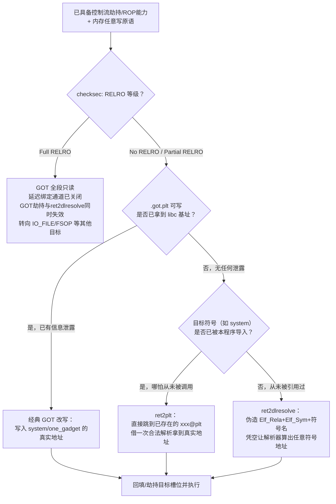
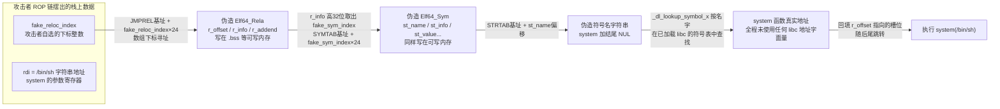
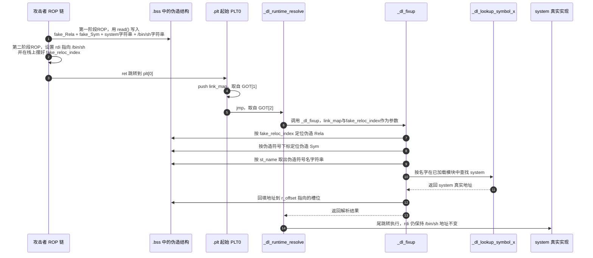

# 二进制漏洞与利用基础（16）· GOT劫持与ret2dlresolve

> [!abstract] TL;DR
> - **GOT 劫持**的本质是改写 `.got`/`.got.plt` 中某个函数槽位的值，让后续所有经该槽位的间接跳转转向攻击者指定地址；前提是该内存可写（受 RELRO 等级严格约束），常与格式化字符串、堆/栈溢出等任意写原语组合使用。
> - **ret2dlresolve** 解决的是"有 ROP 能力、但没有任何信息泄露、拿不到 libc 基址"的场景：伪造一条 `Elf_Rela` + 一个 `Elf_Sym` + 一段符号名字符串，利用 `_dl_fixup` 内部"基址 + 攻击者可控整数下标"的三层指针运算，把解析器指向自己写在内存里的假结构。
> - 核心洞察：动态链接器是**按名字查表**而非**读写死地址**来解析符号的，因此 ret2dlresolve 全程不接触任何 libc 地址字面量，天然绕过 libc 侧 ASLR；代价是需要知道目标二进制自身 `.dynsym`/`.dynstr`/`.got.plt`/`.plt` 的位置（非 PIE 下天然已知，PIE 下需要先泄露程序自身基址）。
> - 该技术存在明确的 **RELRO 门槛**：Partial RELRO（或无 RELRO）下 `.got.plt` 可写、延迟绑定通道仍在，两条路都能走；一旦 Full RELRO + `BIND_NOW`，GOT 全段只读且延迟绑定路径被彻底关闭，GOT 劫持与 ret2dlresolve 同时失效。
> - 目标符号"是否已被本程序导入"决定走哪条路：已导入（哪怕从未被调用过）可以直接 `ret2plt` 白嫖一次合法解析；从未被引用过的符号，必须靠 ret2dlresolve 凭空伪造。
> - 工程实现上 pwntools 的 `ROP.ret2dlresolve()` / `Ret2dlresolvePayload` 已把偏移计算自动化，理解原理后无需手拼字节。

## 概述与定位

本篇在系列中的坐标很明确：[[14.Canary泄露与绕过|上一章]]解决的是"如何绕开栈上的完整性哨兵拿到控制流劫持能力"，[[15.ASLR与PIE绕过技术|再上一章]]解决的是"地址空间被随机化之后怎么定位目标"。这两道关卡跨过去之后，摆在攻击者面前的实际问题是一个更具体的工程问题：**手上有一次控制流劫持、甚至一次任意内存写的机会，具体该覆写谁，才能用最低成本换来任意代码执行？** GOT（全局偏移表）之所以从 Linux 漏洞利用的早期就一直是首选目标，原因并不复杂——它是一张会被**无条件间接调用**的函数指针表，而且调用点往往早已替攻击者摆好了半个战场：程序原有逻辑设置进寄存器的参数（例如一个用户可控的字符串指针）依然有效，攻击者只需要换掉"跳去哪"，不需要重新构造"传什么参数"。这种"劫持点"与"参数来源"相互解耦的特性，是 GOT 类攻击相比其他控制流劫持手法性价比更高的根本原因。

但这张表的可写性并不是恒定的——它完全取决于 RELRO 等级，而 RELRO 又内在地和延迟绑定机制绑定在一起：只要程序还想享受"没调用过的函数不用解析"这个性能优化，`.got.plt` 就必须在某个时间窗口内保持可写。Full RELRO 的推广（现代主流发行版的软件包越来越多默认开启）让"改一发 GOT 直接拿 shell"的黄金年代逐渐落幕，也让"必须先泄露 libc 基址才能算出 `system` 的真实地址"变成了绝大多数利用链的默认前提。但当题目或场景连一次可用的输出/泄露原语都没有——只有一次溢出机会、程序里没有能回显内存内容的函数——攻击者就需要一条完全不依赖"知道地址数值"的路径。**ret2dlresolve 正是把"解析符号"这件事外包给动态链接器自己去做**：既然加载器本来就要在首次调用时按名字去 `.dynsym`/`.dynstr` 里查、在已加载模块的哈希表里找，那么只要能让它"查错地方"——查到攻击者自己伪造的名字上——就等于借用加载器的信任链，凭空把任意已加载符号的地址解析出来，而攻击者自己从头到尾不需要知道这个地址具体是多少。

本篇聚焦 Linux/ELF/glibc 动态链接场景、以 x86-64 为主要讲解架构（ARM64/MIPS 的调用规约与重定位类型差异见 [[21.ARM64与MIPS架构利用差异]]，不在本篇重复）。PLT/GOT 与延迟绑定的静态结构、`_dl_runtime_resolve` 的完整运行时流程，以及 RELRO 三档划分的加载器实现细节，属于必要的前置知识，本篇默认读者已通过 [[11.ELF文件详解/17.got节]] 建立起基础认识，正文中只做承接性回顾，重心完全放在**攻击者如何反过来利用这套机制**——如何构造、构造哪些字段、构造失败会怎样、以及构造成功之后该如何验证。这也是本篇与系列相邻篇章的分工边界：14 章给你"能覆写内存"的能力，15 章告诉你"覆写的目标地址怎么算"，本篇回答"覆写谁、以及在完全算不出地址时该怎么办"，17 章的 IO_FILE/FSOP 则是 Full RELRO 把这条路堵死之后的下一个可劫持结构。

## 原理与机制

### 延迟绑定回顾：一句话版

外部函数调用点从不直接 `call` 真实地址，而是 `call foo@plt`。`foo@plt` 只做一件事：`jmp` 到 `.got.plt` 里属于 `foo` 的那个槽位。首次调用前，该槽位回指 PLT 内部一段"扑空引导"代码，顺势把控制权交给 `_dl_runtime_resolve`，由它调用 `_dl_fixup` 按符号名查出真实地址、回填进同一个槽位、尾跳转执行；此后每次调用，`jmp` 直接命中已回填的真实地址，动态链接器不再介入。整套状态机压缩在这一个 8 字节槽位里，对调用方完全透明——这是 GOT 类攻击成立的地基，完整推导见 [[11.ELF文件详解/17.got节]]。

### RELRO 如何划定攻击面

RELRO 的三档划分直接决定了本篇两种技术各自的生死线：

| RELRO 等级 | `.got`（数据 GOT） | `.got.plt`（函数 GOT） | 延迟绑定通道 | GOT 劫持 | ret2dlresolve |
|---|---|---|---|---|---|
| 无 RELRO | 可写 | 可写 | 保留 | 可行 | 可行（且更自由） |
| Partial RELRO | 只读 | **可写** | 保留 | 可行 | **可行** |
| Full RELRO | 只读 | 只读 | **关闭** | 失效 | **失效** |

Partial RELRO 是一个常被低估的"半只脚门缝"——它确实锁死了 `GLOB_DAT`/`RELATIVE` 类型的数据 GOT，给人一种"GOT 已经保护"的错觉，但 `JUMP_SLOT` 类型的函数 GOT 完全不在保护范围内，原因很直接：延迟绑定还指望着首次调用时能回填这张表，提前只读就会让第一次调用直接 `SIGSEGV`。只有 `-z now` 关掉延迟绑定、把所有 `JUMP_SLOT` 在启动期一次性解析完，`.got.plt` 才有条件在随后被一并 `mprotect` 成只读——这正是 Full RELRO 同时也能封死 ret2dlresolve 的原因：它不是靠"识别出伪造的重定位表项"来防御，而是从根子上让运行期 `_dl_runtime_resolve` 调用路径永远不会被触发，伪造的东西自然没有了投喂对象。RELRO 机制本身的加载器实现细节、`PT_GNU_RELRO` 时序，见 [[34.现代二进制防护机制/00.现代二进制防护机制总览]]。

### GOT 劫持的两种触发形态

从"写"这个动作本身看，覆写一个**已经被解析过**（槽位里是真实地址）的函数槽位，和覆写一个**从未被调用过**（槽位里还回指 PLT 引导代码）的函数槽位，在字节层面没有任何区别——`.got.plt[n]` 就是内存里的 8 个字节，改写不关心它此刻的旧值是什么。真正有意义的区别在**触发时机**：

- 覆写已解析槽位：立即生效，程序里任何后续对该函数的调用都会走新地址。
- 覆写未解析槽位：同样立即生效于"内存状态"，但**必须保证该函数确实还会被再次调用**——如果程序此后再不调用它，劫持写入了也没有意义；同时也要留意，如果攻击者写入的新值本身不是一个合法的可执行地址，而程序恰好把这次调用当成了"首次解析路径"来处理，效果会与预期不同（因为程序不会再触发 `_dl_runtime_resolve`，它只会直接 `jmp` 向被写入的值）。

无论哪种形态，GOT 劫持要成立，攻击者都必须已经知道"写入的目标值"——这通常意味着已经拿到 libc 基址（配合 `system`/`one_gadget` 在 libc 内的固定偏移），是一条建立在**信息泄露**之上的技术路线。任意写原语的来源是多样的：格式化字符串 `%n`（详见 [[09.格式化字符串漏洞]]）、栈溢出配合已知偏移、堆溢出/UAF 产生的伪 chunk 写（详见 [[24.内存管理与堆分配器/17.堆利用手法体系House_of系列]]、[[24.内存管理与堆分配器/08.tcache机制]]、[[24.内存管理与堆分配器/06.ptmalloc2的chunk结构]]）——只要能把一个受控地址上的受控值写进去，GOT 就是候选目标之一。

### 免泄露的特例：借用已导入符号的 PLT 桩

在深入 ret2dlresolve 之前，有一个经常被忽略、但性价比极高的中间形态值得单独强调：**如果攻击者想调用的目标函数（例如 `system`）本来就已经在程序自身的导入表里挂了号**——哪怕源码里那处调用 `system` 的代码路径从未被实际执行到——那么二进制里就已经存在一个合法的 `system@plt` 桩和对应的 `JUMP_SLOT` 重定位条目。此时完全不需要伪造任何结构：只要让控制流跳到（或者把某个函数的 GOT 槽位改写为）`system@plt` 的地址即可。`system@plt` 是链接期就写死的一个静态地址（非 PIE 下是常量，PIE 下是相对程序基址的固定偏移），**不需要任何 libc 泄露**——控制流第一次真正落到 `system@plt` 时，会像任何一次正常的首次调用一样，自动触发 `_dl_runtime_resolve` 老老实实解析出 `system` 的真实地址、回填、尾跳转执行。这种"蹭"一次本来就合法、只是没被触发过的解析流程的做法，通常被称为 **ret2plt**。

ret2plt 能成立的充分必要条件只有一个：目标符号必须**已经**出现在本程序的 `.dynsym`/`.rela.plt` 中。这引出了一个非常关键的分岔点，也正是本章两大主题之间的桥梁——如果目标符号从未被程序引用过（很多 CTF 教学题故意不调用 `system`、不链接任何"送分函数"），二进制里根本不存在 `system@plt` 这个桩，`readelf -r` 也翻不出对应的重定位条目，此时 ret2plt 无米下锅，攻击者就必须往前迈一步：**自己伪造一整套本不存在的重定位结构，凭空让解析器相信"这里确实有一处需要解析 `system` 的合法请求"**——这就是 ret2dlresolve 存在的意义。



这张决策图把本章要讲的两条技术路线，安放进了一个统一的"有没有泄露、有没有现成导入"的判断框架里——这也是实战中 checksec 之后立刻要做的第一轮取舍。

## 结构伪造详解：ret2dlresolve的三件套与解析劫持

### 三层指针链：`_dl_fixup` 到底信谁

`_dl_runtime_resolve` 保存好易失寄存器后，唯一做的事就是调用 `_dl_fixup(struct link_map *l, ElfW(Word) reloc_index)`。它内部的逻辑可以拆成三步、每一步都是一次"基址 + 攻击者可控整数"的数组下标寻址：

1. 用 `reloc_index` 在 `.rela.plt`（`DT_JMPREL` 指向）里取第 `reloc_index` 条 `Elf64_Rela`：地址 = `JMPREL基址 + reloc_index × sizeof(Elf64_Rela)`。
2. 从这条 `Elf64_Rela` 的 `r_info` 高 32 位取出符号下标 `sym_index`，在 `.dynsym`（`DT_SYMTAB` 指向）里取第 `sym_index` 个 `Elf64_Sym`：地址 = `SYMTAB基址 + sym_index × sizeof(Elf64_Sym)`。
3. 从这个 `Elf64_Sym` 的 `st_name` 字段，在 `.dynstr`（`DT_STRTAB` 指向）里取符号名字符串：地址 = `STRTAB基址 + st_name`。

拿到名字字符串后，`_dl_fixup` 调 `_dl_lookup_symbol_x`，在当前模块的符号查找作用域内遍历所有已加载的共享对象（几乎必然包含 libc），按名字在各自的哈希表里找到定义该符号的模块与地址，返回真实值；随后把这个值写回第 1 步取到的 `Elf64_Rela.r_offset` 所指的位置，再尾跳转过去执行。`.plt`/`.got.plt`/`_dl_runtime_resolve` 的完整分工与三保留项细节见 [[11.ELF文件详解/17.got节]]。

### 三个自由度：可以被污染的整数与偏移

这三步里的每一次"基址 + 整数"运算，`_dl_fixup` 全部信任调用方传入的原始值，不做"这个下标是不是本来就该指向合法数据"的语义校验——它只管照着公式把地址算出来、把内容当结构体解释。这意味着只要攻击者能同时控制这三处输入：

| 自由度 | 正常语义 | 攻击者的操作空间 |
|---|---|---|
| `reloc_index`（传给 `_dl_fixup` 的第二参数） | `.rela.plt` 中某条合法重定位的下标 | 通过 ROP 直接把任意整数摆上栈，无需真的调用某个 `PLTn` |
| `Elf64_Rela.r_info` 高 32 位（符号下标） | `.dynsym` 中某个合法符号的下标 | 伪造的 `Elf64_Rela` 由攻击者自己写在可写内存里，此字段随意填 |
| `Elf64_Sym.st_name`（字符串偏移） | `.dynstr` 中某个合法符号名的偏移 | 伪造的 `Elf64_Sym` 同样由攻击者写入，此字段随意填 |

三层自由度叠加起来，就足以让整条查找链从"合法重定位表里的第几条"一路拐进"攻击者自己写在 `.bss` 里的一小段字节"，而 `_dl_fixup` 全程不会察觉自己解析的其实是一堆凭空捏造的数据。

```c
// .rela.plt 中每条 JUMP_SLOT 重定位（x86-64，sizeof == 24）
typedef struct {
    Elf64_Addr   r_offset;  // 解析结果要"回填"到的地址（正常情况下是某 .got.plt 槽位）
    Elf64_Xword  r_info;    // 高32位=.dynsym 符号下标；低32位=重定位类型，JUMP_SLOT恒为7
    Elf64_Sxword r_addend;  // JUMP_SLOT 类型通常为0
} Elf64_Rela;

// .dynsym 中每条符号表项（x86-64，sizeof == 24，凑巧与 Elf64_Rela 等大）
typedef struct {
    Elf64_Word    st_name;   // 符号名在 .dynstr 中的字节偏移
    unsigned char st_info;   // 高4位绑定属性 STB_*，低4位类型 STT_*
    unsigned char st_other;  // 可见性，伪造时通常填0即可
    Elf64_Half    st_shndx;  // 所属节区索引，未定义符号填 SHN_UNDEF(0)
    Elf64_Addr    st_value;  // 符号地址——伪造时可忽略，因为查找靠"名字"而非这个字段
    Elf64_Xword   st_size;   // 符号大小，可填0
} Elf64_Sym;
```

需要特别指出一点：伪造的 `Elf64_Sym.st_value` 完全不重要。因为最终解析靠的是 `_dl_lookup_symbol_x` 按**名字**在已加载模块（libc）里查到的**那个模块自己的**符号表项，我们伪造的 `st_value` 从未被采信——这正是"查表代替读地址"这句话的字面含义：攻击者提供的是一个字符串，返回的是加载器自己权威查出来的地址，二者之间没有攻击者可以塞入错误数值的环节。

### 手把手伪造：三件套的内存布局与字段取值

假设已经拿到一个能把 N 字节写入已知可写地址（例如 `.bss`）的原语——最常见的是通过 ROP 调用 `read(0, addr, N)`。伪造的目标是让最终查到的符号名字符串等于 `"system"`，且解析出来的地址被以攻击者控制的参数（`"/bin/sh"`）尾跳转调用。三件套的字段取值：

```text
设三段数据依次写在可写区域的 fake_rela_addr / fake_sym_addr / fake_name_addr：

fake_name  (写在 fake_name_addr)：
    原始字节 "system\0"

fake_sym   (写在 fake_sym_addr，Elf64_Sym)：
    st_name  = fake_name_addr - STRTAB基址        # 加到 strtab 上得到 fake_name_addr
    st_info  = 0（伪造时不敏感，可填0）
    st_other = 0
    st_shndx = 0
    st_value = 0（不被采信，可不填）
    st_size  = 0

fake_rela  (写在 fake_rela_addr，Elf64_Rela)：
    r_offset = 任意一处可写地址（解析结果会被写进这里，選一处不影响其他逻辑的暂存位置即可）
    r_info   = (fake_sym_index << 32) | 7          # 7 = R_X86_64_JUMP_SLOT
               其中 fake_sym_index = (fake_sym_addr - SYMTAB基址) / sizeof(Elf64_Sym)
    r_addend = 0

fake_reloc_index = (fake_rela_addr - JMPREL基址) / sizeof(Elf64_Rela)
    这是最终要通过 ROP 传给 _dl_fixup 的"重定位下标"
```

一个常被误认为"很难凑"的细节是：`fake_sym_index`、`fake_reloc_index` 都必须让除法整除——但这并不是运气问题。因为攻击者对可写区域里"具体把哪个字节当作结构体起始"拥有完全自由度，只需要在真正的伪造结构前面插入 0～23 字节的 padding，就总能把 `(目标地址 − 基址)` 凑成 `sizeof(Elf64_Rela)` 或 `sizeof(Elf64_Sym)`（均为 24）的整数倍。真正会成为障碍的，是可写区域本身太小、腾挪不出这些 padding 与三段数据的空间，或者伪造结构不慎覆盖了程序运行必需的其他全局变量导致解析发生前程序已经崩溃。

### 触发解析：ROP 如何把控制权交给 PLT0

伪造好内存里的数据后，还需要真正**触发**一次解析。做法是不走任何真实的 `xxx@plt`，而是直接把 ROP 链的控制流交给 `.plt` 的起始地址（即 PLT0，链接期固定，非 PIE 下是常量，PIE 下是"程序基址 + 固定偏移"）。PLT0 的前两条指令固定是"从 `GOT[1]` 取本模块 `link_map` 并压栈，再 `jmp` 到 `GOT[2]` 指向的 `_dl_runtime_resolve`"——这两步完全不需要攻击者插手，PLT0 会自己从 `.got.plt` 里读。攻击者唯一需要预先摆上栈的，是 `fake_reloc_index`：在跳向 PLT0 之前把这个整数放在 PLT0 即将压入 `link_map` 之下的位置，由 PLT0 自己完成"link_map 在上、reloc_index 在下"的栈布局，随后控制权连同这两个值一并交给解析器。

同时不要忘记——最终被解析出来的函数是"以当前寄存器状态被尾跳转调用"的，`_dl_runtime_resolve` 在整个过程中会小心保存并恢复所有传参寄存器，唯一目的就是让解析对调用方"隐身"。所以在跳向 PLT0 之前，攻击者必须已经用类似 `pop rdi; ret` 的 gadget（x86-64 下第一个整数参数走 `rdi`，完整寄存器约定见 [[22.调用规约/06.SystemV_AMD64调用规约]]）把 `system` 的参数（"/bin/sh" 字符串地址）设置好，并保证从那一刻起到最终尾跳转之间，没有任何中间 gadget 意外污染这个寄存器。精确的栈偏移和寄存器保存细节会因 glibc trampoline 的具体实现变体（是否使用 `xsave`/`xsavec` 保存扩展向量寄存器等）而略有出入，这部分工程上完全可以交给 pwntools 的自动化实现去计算，本节重点讲清楚"为什么这样能行"的原理链条，而非逐字节还原某一个 glibc 版本的汇编偏移。





### 为什么不需要 libc 基址，但可能仍需要程序自身基址

ret2dlresolve 全程涉及的四个地址——`.rela.plt`（`DT_JMPREL`）、`.dynsym`（`DT_SYMTAB`）、`.dynstr`（`DT_STRTAB`）、`.plt` 起始——全部落在**目标二进制自身**的地址空间里，而不是 libc 里。非 PIE 程序这四个地址在链接时就已经写死，`readelf -d` 直接能读到，利用时不需要任何运行期泄露。PIE 程序这四个地址相对程序自身加载基址是固定偏移，攻击者只需要拿到**程序自身**（而不是 libc）的加载基址即可换算出绝对地址——这依然算一次信息泄露，但难度远低于泄露 libc 基址：程序自身基址常常可以通过栈上残留的返回地址、`argv`/`envp` 指针、乃至一次"只覆盖低字节"的部分写就大致定位，很多"只有一次溢出机会"的题目里，泄露自身基址往往是唯一可行的信息获取动作。真正意义上"完全零泄露"的 ret2dlresolve，只发生在非 PIE 场景。这个区分很重要，也是把 ret2dlresolve 的"免泄露"卖点和 15 章讨论的"程序基址 vs 库基址"两类泄露区分开的关键。

### 32 位与 64 位的结构差异

历史上很多 ret2dlresolve 的经典教学案例选用 32 位二进制，原因和结构体大小直接相关：`Elf32_Sym` 只有 16 字节（`st_name(4)+st_value(4)+st_size(4)+st_info(1)+st_other(1)+st_shndx(2)`），且 32 位下 PLT 重定位常用不带 addend 的 `Elf32_Rel`（仅 `r_offset(4)+r_info(4)`，共 8 字节），两者都比 64 位对应结构更小，早期教学环境里"凑整除、腾挪空间"相对更宽松。64 位下 `Elf64_Rela` 与 `Elf64_Sym` 恰好都是 24 字节，两套除法的除数相同，是一个容易记的巧合。符号下标的编码宏也不同：64 位用 `ELF64_R_SYM(i) = i >> 32`、`ELF64_R_TYPE(i) = i & 0xffffffff`；32 位用 `ELF32_R_SYM(i) = i >> 8`、`ELF32_R_TYPE(i) = i & 0xff`——移植 exploit 模板时，字段宽度、移位量、`R_X86_64_JUMP_SLOT`（值 7）与 `R_386_JMP_SLOT`（值同为 7，但编码位置不同）都必须对应调整，直接照搬另一位数版本的偏移计算是最常见的低级错误来源。

### 常见构造陷阱

- **除法不整除**：如前所述，本质是可写空间够不够腾挪 padding，而不是"运气不好"，遇到时优先检查是否选错了太小的可写区域。
- **可写内存不足**：三件套加上符号名字符串、参数字符串，实际占用往往超过一百字节，若可写区域紧邻其他运行期必需的数据，写入时可能顺带破坏程序自身状态，导致还没走到解析就先崩了；应选择 `.bss` 尾部等"干净"区域。
- **误用于 Full RELRO 目标**：`.got.plt` 只读会让最后一步回填直接 `SIGSEGV`；更根本的是，Full RELRO 下 PLT 慢速路径本就从未被建立、`_dl_runtime_resolve` 也不会再被触碰，尝试构造本身就是南辕北辙，第一步该做的是 `checksec` 确认。
- **参数寄存器被中途污染**：两段 ROP 之间如果借用了会写 `rdi`/`rsi` 的 gadget（哪怕只是顺带的副作用），最终传给解析出的函数的参数就会出错。
- **混淆下标与字节偏移**：`reloc_index`/`sym_index` 是数组下标（会被自动乘以结构体大小），不是手算的字节偏移，二者混用是另一个常见低级错误。
- **忽视 glibc trampoline 版本差异**：不同 glibc 版本、不同 CPU 特性（是否支持 AVX 等）对应的 `_dl_runtime_resolve` 变体在寄存器保存细节上有差异，但这只影响"手写汇编级"的栈偏移计算，不影响本节讲的三层伪造结构这套攻击逻辑本身——这也是为什么建议把这部分精度要求较高的工作交给 pwntools 完成。

## 工具视角与实战

> [!warning] 示例输出与代码为示意
> 本节命令输出、地址、pwntools 字段名均为**代表性示意**，不代表任何真实运行结果；具体数值随工具链版本、编译选项、ASLR 而变，pwntools 的类名/方法签名也可能随版本迭代调整，请以本机实际输出与当前 pwntools 文档为准。

### 用 checksec / readelf 定位攻击面

```bash
checksec --file=./vuln
```

```text
[*] './vuln'
    Arch:     amd64-64-little
    RELRO:    Partial RELRO
    Stack:    Canary found
    NX:       NX enabled
    PIE:      No PIE
```

`RELRO: Partial RELRO` 是决策图里第一个分岔点的直接依据——它意味着 `.got.plt` 仍可写、延迟绑定通道仍在，本章两条技术路线都有施展空间；`PIE: No PIE` 则意味着 `.dynsym`/`.dynstr`/`.plt` 等地址全部静态已知，ret2dlresolve 甚至可以做到完全免泄露。

```bash
readelf -d ./vuln | grep -E 'JMPREL|SYMTAB|STRTAB|PLTGOT|PLTREL'
readelf -r ./vuln          # 看 .rela.plt 里已经有哪些 JUMP_SLOT（决定能否走 ret2plt）
objdump -d -j .plt ./vuln  # 找 PLT0 地址（.plt 节起始）
readelf -x .dynstr ./vuln  # 确认 .dynstr 里是否已有可复用的符号名片段
```

```text
 0x0000000000000006 (SYMTAB)   0x4003c8
 0x0000000000000005 (STRTAB)   0x400588
 0x0000000000000003 (PLTGOT)   0x601000
 0x0000000000000017 (JMPREL)   0x400648
 0x0000000000000014 (PLTREL)   RELA
```

四个基址一次性拿全，是手工构造或校验 pwntools 自动计算结果时最基础的一步。

### 手工 GOT 改写实战

```python
from pwn import *

elf = ELF('./vuln')
p = process('./vuln')

# 场景一：已通过其他手段拿到 libc 基址，直接覆写为真实地址
libc = ELF('./libc.so.6')
libc.address = leaked_libc_base                 # 由前置的信息泄露给出
target_got   = elf.got['printf']                # printf 的 .got.plt 槽位地址
new_value    = libc.symbols['system']            # system 在 libc 中的真实地址
payload = fmtstr_payload(offset, {target_got: new_value})
p.sendline(payload)
# 之后任何 printf(...) 调用都变成 system(...)，只需保证该调用点的实参可控为 "/bin/sh"

# 场景二：无需任何 libc 泄露——程序别处已经导入过 system，直接借用其 PLT 桩
target_got = elf.got['free']
new_value  = elf.plt['system']                   # 静态已知，链接期就写死
payload = fmtstr_payload(offset, {target_got: new_value})
```

两个场景的差别正对应前文的决策图：场景一是标准 GOT 改写，依赖泄露；场景二是 ret2plt 式的"借用已导入符号"，不依赖任何泄露，但要求 `system` 确实出现在这个二进制自己的导入表里。

### pwntools 自动化 ret2dlresolve

```python
from pwn import *

context.binary = elf = ELF('./vuln')
rop = ROP(elf)

# 声明希望"凭空"解析并调用的符号与参数——即使 system 从未被本程序导入
dlresolve = Ret2dlresolvePayload(elf, symbol='system', args=['/bin/sh'])

# 第一阶段：借助已有的溢出/ROP 调用 read()，
# 把 dlresolve.payload（伪造的 Rela+Sym+字符串三件套）写入 dlresolve.data_addr（通常落在 .bss）
rop.read(0, dlresolve.data_addr)

# 第二阶段：ret2dlresolve() 自动摆好 fake_reloc_index、参数寄存器，并把控制流交给 plt[0]
rop.ret2dlresolve(dlresolve)

payload_stage1 = flat({
    overflow_offset: rop.chain(),      # 第一段 ROP：先触发 read() 写入伪造结构
})
p.send(payload_stage1)
p.send(dlresolve.payload)              # 真正的伪造数据本体，紧随第一段 ROP 后发送
```

pwntools 内部替我们完成的，正是"结构伪造详解"一节手算的那几步除法与偏移拼接——理解原理之后，工程上完全没有必要手工还原这些字节。

### GDB 验证伪造结构是否被正确解析

```bash
gdb ./vuln
(gdb) break _dl_fixup
(gdb) run < payload
(gdb) p/x $rsi        # 第二个参数：应等于手算/pwntools 计算出的 fake_reloc_index
(gdb) finish
(gdb) p/x $rax        # _dl_fixup 返回值，应落在 libc 地址范围内，而非一个野指针
```

如果 `finish` 之后进程直接 `SIGSEGV` 而不是干净地停在返回值处，通常意味着三件套里某个偏移算错，或者目标恰好落在 Full RELRO 只读页上；如果解析器报"符号未定义"而不是段错误，通常意味着伪造的符号名字符串没有正确落地（例如写入被截断，或 `st_name` 偏移算错导致读到了乱码字符串）。

### 无泄露场景的利用步骤骨架

以一个只具备"一次栈溢出、无任何输出函数可用、Partial RELRO、64 位、非 PIE"的教学靶机为例，利用步骤骨架大致是：

1. `checksec` 确认 `RELRO=Partial`、`PIE=No`——具备伪造前提且四个基址均静态已知。
2. `readelf -d` 读出 `JMPREL`/`SYMTAB`/`STRTAB`/`PLTGOT`，`objdump -d -j .plt` 找到 PLT0 地址。
3. 在 `.bss` 尾部挑一段不影响程序自身运行的"干净"可写区域，作为伪造结构落脚点。
4. 第一段 ROP：调用 `read(0, 可写地址, N)`，一次性写入 `[伪造 Elf64_Rela][伪造 Elf64_Sym]["system\0"]["/bin/sh\0"]`。
5. 第二段 ROP：`pop rdi; ret` 设好 `/bin/sh` 地址，栈上摆好 `fake_reloc_index`，最后 `ret` 到 PLT0。
6. `_dl_fixup` 顺着伪造的三层结构查到 `system`，回填、尾跳转，等价于执行 `system("/bin/sh")`。

全程没有出现任何一次"读取内存并把结果回传给攻击者"的动作——这正是 ret2dlresolve 相对于"先泄露 libc 基址再改 GOT"这条经典路线的核心差异，也是它在教学与 CTF 中长期占有一席之地的原因。

## 安全性与正确使用

### 防御层次与残余风险

`Full RELRO + BIND_NOW` 是唯一能同时从根子上封死 GOT 改写与 ret2dlresolve 的手段：关闭延迟绑定路径本身，`_dl_runtime_resolve` 在运行期永远不会被调用，伪造结构失去了投喂对象；`.got.plt` 随后被一并 `mprotect` 成只读，改写直接触发 `SIGSEGV`。Partial RELRO 只保护数据 GOT，函数 GOT 依旧可写可伪造，是一个常被误判为"已加固"的中间状态。PIE 不能直接阻止这两种技术生效，但把"直接知道 `.dynsym`/`.plt` 等地址"变成"需要先泄露程序自身基址"，抬高了门槛——这是它在 PIE 场景下唯一残留的前置条件。

CFI/CET（IBT）在这里的实际覆盖范围也值得澄清：GOT 劫持与 ret2dlresolve 最终跳转的目标都是**合法函数的入口**——`system` 的起始地址天然带有 `endbr64`，因为它本来就是一个正常可以被 `call` 的函数——因此 IBT 并不会拦下这次跳转。IBT 防的是"跳到一个函数中间的任意 gadget"，不是"跳到另一个完全合法的函数开头"。这正是理解现代防护边界的重要一点：**控制流完整性防的是落点是否合法，而 GOT 类攻击跳去的地方本身完全合法，被劫持的只是"谁在什么时候跳过去"这件事**——更强的前向边 CFI（按调用点类型/函数签名分桶校验）才能进一步收窄这类攻击面，这也是为什么 GOT/PLT 这类攻击手法在 CET 已经相当普及的今天依然被作为基础必修内容讲解。

同样值得强调的是"读/写分离"：Full RELRO 只管住了"写"，不管"读"——即使 `.got.plt` 已只读，只要程序里还存在别的信息泄露漏洞，攻击者依然能读出已经填好的真实地址来计算 libc 基址，为其他利用链铺路。这提醒我们不能把 RELRO 当成内存安全问题的万灵药，消除越界读写本身永远是第一优先级。GOT/PLT 这种"信任一张可写函数指针表"的设计模式在内核态也有同构的对应物（系统调用表、各类回调注册表等），劫持思路一脉相承，延伸阅读见 [[52.Linux内核机制与内核利用/00.Linux内核机制与内核利用总览]]。

### 安全编码与加固建议

- 编译期默认开启 `-Wl,-z,relro,-z,now`，在 CI 中用 `checksec` 做门禁，避免发布版本意外落在 Partial RELRO。
- 不要因为开了 Full RELRO 就放松对任意读写漏洞本身的修复优先级——`.data`/`.bss` 中的函数指针、C++ vtable、`atexit`/析构回调等都是 RELRO 保护范围之外、依然可被劫持的控制流目标，这条线索会在 [[17.IO_FILE结构利用与FSOP]] 继续展开。
- 涉及堆的任意写通常源自 UAF/double free/OOB，理解分配器内部结构才能判断一次堆溢出究竟能不能演化成"任意地址写"进而威胁到 GOT，参见 [[24.内存管理与堆分配器/17.堆利用手法体系House_of系列]]、[[24.内存管理与堆分配器/08.tcache机制]]、[[24.内存管理与堆分配器/06.ptmalloc2的chunk结构]]。
- 防护机制的系统对比与选型建议见 [[34.现代二进制防护机制/00.现代二进制防护机制总览]]。

> [!caution] 合规边界
> 本篇讲解的 GOT 改写与 ret2dlresolve 构造原理，仅用于**自己搭建或已获授权的实验环境、CTF 靶场与安全研究**。所有示例均为通用原理与结构骨架，不针对任何真实生产系统或他人资产给出可直接使用的武器化利用链，也不为绕过任何商业授权提供武器化手段。将这些技术用于未授权系统即构成违法行为，请严格在授权范围内实践。理解攻击是为了写出无法被这样攻击的代码——本篇讲清楚的每一处"伪造为何能生效"，都对应一条可以在编译期或代码审计阶段就提前堵死的防线。

## 小结

GOT 之所以是经典目标，是因为它是一张会被无条件间接调用、且调用参数往往早已由程序自身逻辑摆好的函数指针表；它是否可写、延迟绑定是否还在跑，完全由 RELRO 等级决定，Partial RELRO 护数据 GOT 不护函数 GOT，是最常见的误判点。GOT 改写需要预先知道"写入的目标值"，本质上依赖一次信息泄露；ret2dlresolve 则反其道而行，通过伪造 `Elf_Rela`/`Elf_Sym`/符号名字符串三件套，利用 `_dl_fixup` 内部逐层"基址+攻击者可控整数下标"的寻址方式，把解析器指引到攻击者自己写下的假结构上，借加载器"按名字查表"的信任链凭空解析出任意已加载符号的真实地址，全程不接触任何 libc 地址字面量。目标符号是否已被本程序导入，决定了走性价比更高的 ret2plt（借用已存在的 PLT 桩白嫖一次合法解析）还是必须升级到完全的伪造。两条路线共同的生死线都是 RELRO：Full RELRO + BIND_NOW 关闭延迟绑定并把 GOT 整体只读化，是目前唯一能同时根治两者的手段；PIE 只抬高门槛、不根治问题；CFI/CET 对"跳到另一个合法函数开头"这类劫持覆盖有限。工程实现上，pwntools 的 `ROP.ret2dlresolve()`/`Ret2dlresolvePayload` 已经把手算偏移这一步自动化，理解原理后不必手工还原字节。

## 相关阅读

- [[00.二进制漏洞与利用基础总览|⬆ 系列总览]]
- [[11.ELF文件详解/17.got节]]：GOT/PLT 静态结构、延迟绑定与 RELRO 的基础前置
- [[22.调用规约/06.SystemV_AMD64调用规约]]：x86-64 传参寄存器约定，ret2dlresolve 最终尾跳转依赖的正是这份约定
- [[34.现代二进制防护机制/00.现代二进制防护机制总览]]：RELRO/CFI/CET 等防护机制的系统讲解
- [[24.内存管理与堆分配器/06.ptmalloc2的chunk结构]]、[[24.内存管理与堆分配器/08.tcache机制]]、[[24.内存管理与堆分配器/17.堆利用手法体系House_of系列]]：堆侧任意写原语的来源
- [[52.Linux内核机制与内核利用/00.Linux内核机制与内核利用总览]]：内核态同构的"可写函数指针表"劫持延伸
- [[09.格式化字符串漏洞]]、[[06.ROP入门]]、[[07.ROP进阶：ret2csu与通用gadget]]：本篇任意写与 ROP 能力的前置来源
- [[15.ASLR与PIE绕过技术]]、[[14.Canary泄露与绕过]]：本篇的直接前置章节
- [[17.IO_FILE结构利用与FSOP]]：Full RELRO 封死 GOT 之后的下一个可劫持结构目标
- [[21.ARM64与MIPS架构利用差异]]：本篇 x86-64 讨论之外的架构差异延伸
- 延伸阅读（库外）：glibc 源码 `elf/dl-runtime.c`（`_dl_fixup` 权威实现）与 `sysdeps/x86_64/dl-trampoline.h`（`_dl_runtime_resolve` 汇编 trampoline）；System V AMD64 ABI 补充手册（PLT/GOT 标准布局与重定位类型定义）

[[00.二进制漏洞与利用基础总览|⬆ 系列总览]] | [[15.ASLR与PIE绕过技术|← 上一章]] | [[17.IO_FILE结构利用与FSOP|→ 下一章]]
