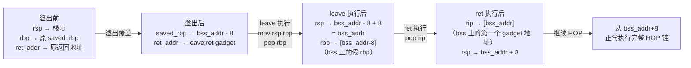
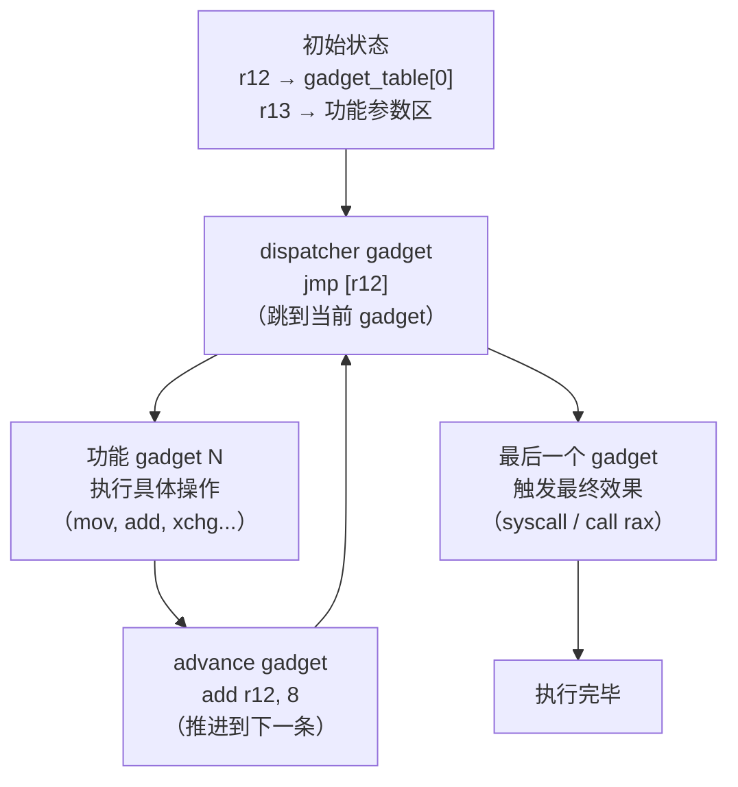

# 二进制漏洞与利用基础（16）· 栈迁移与 JOP/COP

> [!abstract] TL;DR
> - 栈迁移（Stack Pivoting）通过 `leave;ret` 或 `pop rsp;ret` 将 rsp 迁移到攻击者可控区域（BSS/堆/已知内存），解决溢出空间不足以容纳完整 ROP 链的问题。
> - `leave` 等价于 `mov rsp,rbp; pop rbp`，利用它可在溢出字节极少（仅覆盖 rbp+ret）的情况下完成完整 ROP。
> - JOP（Jump Oriented Programming）通过 `jmp [reg]` 串联 gadget，绕过基于 `ret` 检测的防护；COP（Call Oriented Programming）使用 `call [reg]`，原理类似。
> - Intel CET 引入 IBT（间接分支跟踪，endbr64）和 Shadow Stack，分别针对 JOP/COP 和 ROP，是当前最硬件级的 CFI 防御。
> - 理解这些技术是理解为何现代安全防护需要硬件支持（而非纯软件 CFI）的关键。

---

## 概述与定位

ROP 利用 `ret` 指令将控制流串联到不同 gadget，这已是耳熟能详的技术。但 ROP 有两个固有局限：第一，`ret` 需要在栈上有连续的 gadget 地址，因此需要足够大的溢出空间；第二，防御者可以监控 `ret` 指令的目标地址（如 ROPGuard、kBouncer 等工具），或者通过 Intel CET Shadow Stack 确保 `ret` 只能跳回合法的调用点。

本篇讨论两类应对思路：

**栈迁移**——当溢出空间极小（例如 off-by-one 或只有 16 字节可覆盖），导致栈上放不下完整 ROP 链时，先把 rsp 转移到可控的大空间内，再从那里执行完整的 ROP。

**JOP/COP**——当防护手段专门针对 `ret` 时，改用 `jmp [reg]` 或 `call [reg]` 串联 gadget，实现类似 ROP 的任意代码执行效果，但绕过基于 ret 的检测。

---

## 原理与机制

### leave;ret 的指令语义

`leave` 指令是 x86/x64 函数 epilogue 的标准组成部分，等价于两条指令的组合：

```asm
mov rsp, rbp    ; 将帧指针的值写入栈指针（"折叠"当前栈帧）
pop rbp         ; 从当前 rsp 处弹出值到 rbp，rsp += 8
```

紧跟其后的 `ret`：

```asm
pop rip         ; 从 rsp 弹出值到 rip，rsp += 8
```

因此 `leave; ret` 三步的净效果是：**rsp = 原 rbp + 8**（因为先把 rsp 设成 rbp，pop rbp 消耗 8 字节，再 pop rip 再消耗 8 字节，所以最终 rsp = 原 rbp + 16，而 rip = [原 rbp + 8]）。

这意味着：如果我们能**控制 rbp 的值**，那么 `leave; ret` 执行后，rsp 就会被设置为 rbp+8 所指向的地方，rip 则跳转到 rbp+8 处存放的值。控制了 rbp，就等于控制了下一条执行的指令以及此后 ROP 链的栈基址。

### 栈迁移的触发条件

栈迁移最常见于以下场景：

**场景一：off-by-one 漏洞**
只能溢出 1 字节，恰好覆盖 rbp 的最低字节。通过这 1 字节可以把 rbp 修改到一个"稍微低一点"的地址（partial overwrite），使其指向某个可控区域的 8 字节前方。当函数返回执行 `leave; ret` 时，rsp 迁移到该区域，后续从该区域读取 gadget 地址继续执行。

**场景二：溢出空间极小（如 16 字节）**
溢出只够覆盖 saved rbp + return address 共 16 字节。如果把 return address 覆盖为 `leave; ret` gadget，把 saved rbp 覆盖为目标区域地址 - 8，那么：
- 第一次 `leave; ret` 执行：rsp 迁移到 目标区域 - 8 + 8 = 目标区域
- 目标区域事先已布置好完整 ROP 链

**场景三：read 先写，再迁移**
程序先允许向某个固定地址（BSS/heap）读入任意数据，然后有一个小溢出。利用步骤：先把完整 ROP 链写到 BSS 段，再用小溢出触发栈迁移到 BSS。

### partial overwrite 配合栈迁移

在开了 ASLR 但没有开 PIE 的情况下，二进制本体地址固定，但 libc/栈/堆地址随机。此时 BSS 段地址已知，是绝佳的迁移目标。即使开了 PIE，栈上常常存在指向 BSS 附近的指针，通过部分覆盖（仅改低位字节）可以把这些指针"导向"到 BSS 的某个偏移。

partial overwrite 配合栈迁移的典型步骤：
1. 泄露一个栈地址（如通过格式化字符串）
2. 计算 BSS/heap 中布置数据的地址
3. 用小溢出改 rbp 为该地址 - 8
4. 用 `leave;ret` 触发迁移

### 两段式迁移链

有时候一次迁移不够，需要"二级跳"：

```
第一级 leave;ret：
  rbp → fake_rbp1（BSS 某处）
  ret addr → leave;ret gadget

第一次 leave;ret 后：
  rsp → fake_rbp1 + 8（第一个 fake 帧的 ret 位置）
  rip 执行 BSS 上第一段 gadget

第一段 gadget 末尾：
  调整 rbp 到第二段数据地址 - 8
  再次 ret 到 leave;ret gadget

第二次 leave;ret 后：
  rsp → 真正的完整 ROP 链起始
  从这里正常 ROP
```

这种"两段式"在溢出空间特别小（如仅能覆盖 8 字节 saved rbp，ret addr 固定不能变）时非常实用。

### JOP/COP 的动机与基本结构

ROP 的本质是滥用 `ret` 作为间接跳转。防御者意识到这一点后，开发了多种针对 `ret` 的监控和限制手段：Intel CET Shadow Stack 在硬件层面确保每次 `ret` 只能跳回对应 `call` 压入的地址；基于软件的 CFI（如 clang CFI、Microsoft XFG）检查间接调用/跳转的目标是否在合法集合内。

JOP 和 COP 的思路是：**既然 `ret` 被盯上了，就用 `jmp` 和 `call` 串联 gadget**。

**JOP（Jump Oriented Programming）** 使用 `jmp [reg]` 或 `jmp [reg+offset]` 在 gadget 间传递控制流。与 ROP 不同，JOP 不依赖栈来存储"下一条 gadget 地址"，而是依赖**寄存器**和**调度器 gadget（dispatcher gadget）**。

**COP（Call Oriented Programming）** 使用 `call [reg]` 串联，调用约定会把返回地址压栈，这在某种程度上又重新引入了栈，但控制流传递通过寄存器而非 `ret`。

### JOP 的 dispatcher gadget 机制

JOP 需要一个核心的"调度器 gadget"（dispatcher gadget），负责把下一个"功能 gadget"的地址从某个寄存器或内存表中取出来，并跳转过去。典型的 dispatcher 形如：

```asm
; dispatcher gadget（假设 r12 指向 gadget 地址表，rdi 是当前索引）
add r12, 8            ; 移动到下一条
jmp [r12]             ; 跳到下一个功能 gadget
```

**功能 gadget**（functional gadget）是执行实际操作的 gadget，末尾用 `jmp [dispatcher]` 或类似方式回到调度器，实现"循环执行下一条 gadget"的效果：

```asm
; 功能 gadget 1: rdi = 某值
mov rdi, [r13]
jmp [dispatcher]     ; 回到调度器取下一条

; 功能 gadget 2: 调用 rax 指向的函数
call rax
jmp [dispatcher]     ; 回到调度器
```

整个 JOP"程序"是一张放在可写内存中的 gadget 地址表，调度器从这张表中逐条取地址并跳转执行。这与 ROP 的"ret 从栈上弹地址"对应，但底层机制完全不同：JOP 不碰 `ret`，绕过了 Shadow Stack 的保护。

### JOP 与 ROP 的关键区别

| 维度 | ROP | JOP/COP |
|---|---|---|
| 串联机制 | `ret`（从栈弹地址） | `jmp/call [reg]`（从寄存器间接） |
| 地址存储 | 栈 | 寄存器 / 内存表 |
| 依赖结构 | 连续栈布局 | dispatcher gadget + 地址表 |
| Shadow Stack | 被阻断 | 不受影响（不用 ret） |
| IBT(endbr64) | 不受影响 | 被阻断（jmp 目标须有 endbr） |
| 寻找难度 | 较易（ret 遍布全二进制） | 较难（需要特定 jmp/call 模式） |

### Intel CET 的 IBT 与 Shadow Stack

Intel CET（Control-flow Enforcement Technology）是当前最完善的硬件 CFI 方案，包含两个独立组件：

**IBT（Indirect Branch Tracking，间接分支跟踪）**：处理器在执行 `jmp [reg]` 或 `call [reg]` 时，会验证目标指令的第一条是否为 `endbr64`（或 `endbr32`）。若不是，触发 `#CP` 异常。编译器在每个合法的间接跳转/调用目标（函数入口、跳表目标）处插入 `endbr64`。IBT 使 JOP/COP 无法使用任意 `jmp [reg]` 结束的 gadget——它们的目标必须有 `endbr64`，而这大幅减少了可用的 JOP gadget 数量。

**Shadow Stack（影子栈）**：处理器维护一个独立的只读内存区域（shadow stack），每次 `call` 时同时向 shadow stack 压入返回地址。`ret` 时，处理器比较栈上返回地址与 shadow stack 顶部的值，若不一致触发异常。这直接阻止了 ROP——攻击者能篡改普通栈，但无法修改只读的 shadow stack。

CET 的局限：IBT 不限制 `ret`（所以 ROP 不受 IBT 影响）；Shadow Stack 不限制 `jmp/call`（所以 JOP 不受 Shadow Stack 影响）。两者配合才能同时应对 ROP 和 JOP/COP。即便如此，研究者也在探索基于合法 `endbr64` 目标的 JOP 变体（"EROP/IBT-bypass JOP"），表明攻防对抗仍在继续。

---

## 结构/算法/伪代码详解

### leave;ret 触发的 rsp 迁移示意



### 栈迁移前后 rsp 变化（代码块布局）

```
迁移前（普通栈，溢出空间不足）：

  高地址
  +--------------------+
  |  ... 正常栈数据 ... |
  +--------------------+
  |  saved_rbp         |  <- rbp 指向这里
  +--------------------+  <- rbp + 8
  |  ret_addr          |  <- 需要在这里放 leave;ret
  +--------------------+  <- rbp + 16
  |  （溢出结束，空间不足放 ROP 链）
  低地址

迁移后（rsp 已迁到 BSS）：

  BSS 段（事先布置好）：
  +----------------------+
  |  fake_rbp (8字节)    |  <- bss_base + 0x00（任意值，被 pop rbp 消耗）
  +----------------------+
  |  gadget1_addr (8字节)|  <- bss_base + 0x08，leave;ret 后 rip 跳这里
  +----------------------+
  |  gadget2_addr (8字节)|  <- bss_base + 0x10
  +----------------------+
  |  ...                 |
  |  完整 ROP 链          |
  +----------------------+
  |  "/bin/sh\x00"       |  <- 字符串数据
  +----------------------+
```

### 栈迁移利用伪代码

```python
from pwn import *

elf = ELF('./target')
context.arch = 'amd64'

# 已知：
# bss_addr: BSS 段可写地址（elf.bss() 或 elf.bss()+0x100 避开全局变量）
# leave_ret_gadget: leave;ret 指令序列地址（ROPgadget 搜索）
# buf_addr: read 会把数据写入的 BSS 地址

# === 阶段 1：向 BSS 写入 ROP 链 ===
pop_rdi = elf.address + rop_offset_pop_rdi
ret_gadget = elf.address + rop_offset_ret   # 用于栈对齐

rop_chain  = b''
rop_chain += p64(0)                  # fake rbp（被第二次 leave 消耗）
rop_chain += p64(pop_rdi)
rop_chain += p64(next(elf.search(b'/bin/sh\x00')))
rop_chain += p64(ret_gadget)         # 16 字节对齐修正
rop_chain += p64(elf.plt['system'])

# 假设程序允许 read(0, bss_addr, len)
# 先通过某种方式把 rop_chain 写到 bss_addr 处

# === 阶段 2：小溢出触发栈迁移 ===
# 溢出 payload 只需 16 字节：
# - 8 字节覆盖 saved_rbp → bss_addr - 8
# - 8 字节覆盖 ret_addr  → leave_ret_gadget

payload  = b'A' * padding
payload += p64(bss_addr - 8)         # 新 rbp = bss_addr - 8
payload += p64(leave_ret_gadget)     # 触发迁移

io = process('./target')
io.send(rop_chain)        # 第一步写 BSS
io.send(payload)          # 第二步触发迁移
io.interactive()
```

### JOP dispatcher 循环工作流



### JOP gadget 链示例（x64，无 endbr）

```
假设找到以下 gadget（二进制中真实存在的指令序列）：

dispatcher:
  0x401234:  add rdi, 8        ; 移动 gadget 指针
             jmp [rdi]         ; 跳到下一个 gadget

functional_1 (设置 rax=59):
  0x402100:  mov rax, 59
             jmp [dispatcher]  ; 回到调度器

functional_2 (syscall):
  0x403000:  syscall
             ; （JOP 链结束，执行 execve）

gadget_table（写在可写内存中）：
  [0x500000] = 0x402100   ; functional_1
  [0x500008] = 0x403000   ; functional_2
  ...

初始状态：rdi = 0x500000 - 8（调度器 add 后指向第一条）
          rsi = binsh_addr
          rdx = 0
```

注意：以上是示意性的，真实 JOP 链的构造远比 ROP 复杂，需要找到合适的 dispatcher 模式，且 gadget 末尾必须有跳回 dispatcher 的 `jmp`。

---

## 工具视角与实战

### 用 ROPgadget 搜索 leave;ret

```bash
# 搜索 leave;ret gadget
ROPgadget --binary ./target --rop | grep "leave ; ret"

# 搜索 pop rsp;ret（另一种迁移方式）
ROPgadget --binary ./target --rop | grep "pop rsp"

# 搜索 xchg eax,esp（x86 常见迁移方式）
ROPgadget --binary ./target --rop | grep "xchg eax, esp"
```

`leave; ret` 几乎在所有有栈帧的函数末尾都存在（任何 `push rbp; mov rbp,rsp` 开头的函数都有对应的 `leave; ret` 结尾），因此这个 gadget 几乎总能找到。

### 搜索 JOP gadget（实验性）

```bash
# 搜索 jmp [reg] 形式
ROPgadget --binary ./target --jop | head -30

# 用 ropper
ropper --file ./target --type jop

# 搜索 call [reg]
ROPgadget --binary ./target --rop | grep "call rax"
ROPgadget --binary ./target --rop | grep "jmp rax"
```

JOP gadget 数量远少于 ROP gadget，且需要额外找到合适的 dispatcher，实际构造 JOP 链比 ROP 复杂得多。CTF 中 JOP 题目相对少见，但了解原理有助于理解防御技术的演进逻辑。

### pwntools 辅助栈迁移

pwntools 没有专门的栈迁移 API，但其 ROP 链构造功能完全适用于在 BSS 上布置 ROP 链：

```python
from pwn import *

elf = ELF('./target')
libc = ELF('./libc.so.6')
rop = ROP(elf)

# 在 BSS 上构造 ROP 链
bss_rop = ROP(elf)
bss_rop.raw(p64(0))                    # fake rbp
bss_rop.system(next(elf.search(b'/bin/sh')))  # system("/bin/sh")

# 得到字节序列
bss_payload = bytes(bss_rop)

# 栈迁移 payload
pivot_payload  = b'A' * offset
pivot_payload += p64(bss_addr - 8)     # 覆盖 saved rbp
pivot_payload += p64(leave_ret)        # 覆盖返回地址
```

### 实战：xchg rax,rsp 迁移（x64 特殊场景）

`xchg rax, rsp` 是另一种常见的栈迁移手段，与 `pop rsp; ret` 等价效果：

```python
# 如果 rax 可控（如 read 返回值，或 rax 残留某个地址）
# 找到 xchg rax, rsp ; ret gadget
xchg_gadget = rop.find_gadget(['xchg rax, rsp', 'ret'])[0]

# 令 rax = 目标 rsp 值
payload  = p64(pop_rax)
payload += p64(bss_rop_addr)
payload += p64(xchg_gadget)    # 执行后 rsp = bss_rop_addr，rax = 原 rsp
# 后续 ret 直接从 bss_rop_addr 取 gadget
```

---

## 安全性与正确使用

> [!caution]
> 本节涉及实际二进制利用技术（栈迁移、JOP/COP），用于 CTF 学习、漏洞分析和防御研究。实际复现须严格限定在以下场景：
> - 自己编写和编译的测试程序
> - 明确书面授权的渗透测试
> - CTF 官方靶机/离线题目
> - 隔离的安全研究虚拟机/容器环境
>
> 禁止在未授权系统上使用。本文所有代码均为教学示例，仅供防御研究和 CTF 学习，不构成攻击授权。

### 栈迁移的防御

- **Stack Canary**：保护的是函数返回时的 canary 检查，off-by-one 只改 rbp（不越过 canary 位置）时可绕过。因此 canary 对 off-by-one 型栈迁移防御效果有限。
- **SafeStack（Clang）**：将敏感数据（返回地址、rbp）放在单独的"安全栈"中，普通溢出无法覆盖到安全栈上的 rbp，有效防御 rbp 覆盖型栈迁移。
- **ASLR**：使 BSS/堆地址随机化，需要信息泄露才能确定迁移目标。
- **Full RELRO + PIE**：降低 BSS 地址可预测性，增加泄露要求。

### JOP/COP 与 Intel CET

**Intel CET IBT** 对 JOP 的影响最为直接：启用 IBT 后，所有 `jmp [reg]`/`call [reg]` 的目标地址处必须有 `endbr64` 指令（一个 4 字节的 NOP-like 指令），否则处理器触发 `#CP` 异常。这意味着：

- 普通函数中间某处的 gadget（如 `jmp rax` 结束的 gadget）无法作为 JOP 目标（它们前面没有 `endbr64`）
- 只有合法的函数入口和编译器标记的间接跳转目标可以作为 JOP gadget
- 大幅减少可用 gadget 数量

**局限**：IBT 不阻止 `ret`，所以 ROP 不受 IBT 影响；研究者已展示通过"gadget 链接合法 endbr64 目标"的 ROP-like 利用，IBT 提高门槛但非完美防御。

**Linux kernel CET 支持**：Linux 5.18+ 开始支持用户态 Shadow Stack（通过 `ARCH_SHSTK_SHSTK` prctl），glibc 2.39+ 已支持 shadow stack。随着支持范围扩大，ROP 在有 CET 的环境下将越来越难以实施。

---

## 小结

栈迁移从一个非常实用的角度解决了"溢出空间不足"的问题：与其在有限空间里塞 ROP 链，不如把"栈"本身移走。`leave; ret` 这个看似平凡的函数 epilogue 序列，在攻击者手中成为了"远程传送门"。理解这一点，也有助于反向思考为什么 SafeStack 能有效防御——分离了可被溢出的数据栈和受保护的控制流栈，攻击者即使溢出也找不到 rbp/ret addr。

JOP/COP 则代表了利用技术对防御技术的主动适应：当 ROP 的 `ret` 被针对时，攻击者换用 `jmp/call`。这种攻防迭代推动了 Intel CET 的落地——当软件 CFI 的开销和兼容性问题限制了其部署范围时，硬件层面的 IBT+Shadow Stack 提供了更低开销、更透明的防护。理解 JOP/COP 的原理，也就理解了 CET 两个组件为何各自针对不同的攻击向量，以及为何二者需要配合使用。

---

## 相关阅读

- [[06.ROP入门]]
- [[12.缓解机制总览]]
- [[13.现代利用与信息泄露]]
- [[15.SROP与ret2csu]]
- [[17.House-of堆利用系列]]

---

⬅️ 上一篇 [[15.SROP与ret2csu]] ｜ 🏠 [[00.二进制漏洞与利用基础总览]] ｜ 下一篇 [[17.House-of堆利用系列]] ➡️
