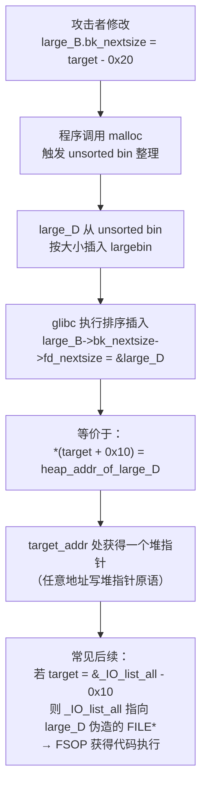

# 二进制漏洞与利用基础（17）· House of 系列堆利用

> [!abstract] TL;DR
> - House of 系列是针对 ptmalloc2（glibc 堆分配器）各类数据结构缺陷的具名利用技术集合，每种技术对应分配器一个特定的可滥用机制。
> - 堆风水（Heap Feng Shui）是所有堆利用的前置技能：通过精心控制 malloc/free 顺序，使内存布局处于可预测、可利用的状态。
> - 核心技术包括：House of Force（top chunk 篡改）、House of Orange（堆转 FSOP）、House of Einherjar（off-by-one 后向合并）、House of Spirit（伪造 fastbin chunk）、Largebin Attack（指针任意写）、Tcache Stashing Unlink 等。
> - 每种技术均已被 glibc 的后续版本通过各类检查修复，了解修复版本对判断题目 glibc 版本和选择利用路径至关重要。
> - 防御视角：理解这些技术是审查内存管理代码、评估堆相关漏洞风险等级的基础。

---

## 概述与定位

本篇是堆利用技术的进阶专题，聚焦于 ptmalloc2 中"有名字"的一系列利用手法——统称为"House of X"系列。这些技术由安全社区历年研究积累，命名风格类似武术招式，每种对应分配器数据结构的一个特定可滥用缺口。

**与前序篇目的关系**：09 篇（堆管理基础）详细讲解了 chunk 结构、bins 体系（fastbin/smallbin/largebin/tcache）、以及 `malloc`/`free` 的关键路径；10 篇（堆漏洞入门）覆盖了 heap overflow、UAF、double free 等基础原语。本篇假设读者已掌握这些基础，直接进入各种"house"技术的原理分析。

**学习目标**：理解每种技术"为何成立"（利用的是分配器哪个信任假设的缺失）、"被哪个版本修复"（修复加入了哪种检查）以及"典型效果"（能实现什么原语：任意分配/任意写/代码执行）。

---

## 原理与机制

### ptmalloc2 背景回顾

以下关键概念在本篇中频繁出现，简要提示（详见 09 篇）：

- **chunk**：堆内存分配单元，头部含 `prev_size`（前块大小）、`size`（含标志位 P/M/A）。`PREV_INUSE`（P 位）为 1 表示前块在使用中，为 0 则允许后向合并（backward consolidation）。
- **bins**：freed chunk 的链表。fastbin：LIFO 单链；smallbin：双向循环链（FIFO）；largebin：双向链（含 `fd_nextsize`/`bk_nextsize` 按大小排序）；unsorted bin：所有刚释放的 non-fast chunk 先入此链等待归类。tcache（glibc 2.26+）：每线程的 per-size 单链，最高优先级。
- **top chunk**：堆末尾未分配区域，`malloc` 在 bins 无合适块时从 top chunk 切割。
- **前向合并（forward consolidation）**：free 时检查下一块是否空闲，若是则合并。**后向合并（backward consolidation）**：检查前块 `PREV_INUSE` 位，若为 0 则把前块从 bins 中取出（unlink）并合并。

### 堆风水（Heap Feng Shui）

"堆风水"是一个形象的说法，指**通过精心设计 malloc/free 的调用顺序和大小**，使堆的内存布局处于攻击者期望的精确状态。它不是一种具体的利用技术，而是所有堆利用的前置步骤——就像在栈利用中必须先确定溢出偏移量一样，堆利用中必须先确保目标 chunk 和受控 chunk 的空间位置关系符合预期。

堆风水的核心操作：

1. **填充（Grooming）**：分配一批特定大小的 chunk，将已有 freed chunk 从 tcache/fastbin 中耗尽，迫使 `malloc` 从 top chunk 切割新块，从而精确控制新块位于堆的哪个位置。
2. **排列（Spraying）**：在目标 chunk 周围分配"防护 chunk"（通常称为 fence 或 guard），防止 consolidation 跨越到不想合并的区域。
3. **间隔控制（Gap control）**：确保溢出能精确命中目标 chunk header 而不因大小差异导致偏移错误。

CTF 中堆风水体现为 exploit 开头的一串 `malloc(size)` 和 `free(ptr)` 调用——表面上看与利用无关，实际上是在为后续的精确操作"整理地形"。

---

## 结构/算法/伪代码详解

### House of Force

**原理**：top chunk 的 `size` 字段（chunk header 中 `size` 的高位部分）决定了 `malloc` 能从 top chunk 切多大的块。攻击者若能篡改 top chunk 的 `size` 为极大值（如 `-1`/`0xffffffffffffffff`），则 `malloc` 对任意请求都认为 top chunk 够大，可以切割。通过两次 malloc，可以让分配器返回一个指向任意内存地址的指针。

**利用步骤**：
1. 通过 overflow 将 top chunk 的 `size` 覆盖为 `0xffffffffffffffff`（或任意大值）
2. 计算目标地址（如 `__malloc_hook`）与当前 top chunk 头部的距离 `delta`
3. 调用 `malloc(delta - 0x10)`（`0x10` 是 chunk header 大小，让 top chunk "移动"到目标前）
4. 再次调用 `malloc(任意大小)`，此时返回的是目标地址处的"chunk"——即 `&__malloc_hook` 附近的写入权限

**缓解版本**：glibc 2.29 加入了对 top chunk size 的合理性检查：top chunk 的 `size` 必须大于 `MINSIZE` 且小于等于整个系统内存大小（`system_mem`），否则触发 `malloc_printerr`。此后 House of Force 在现代 glibc 上不可用。

```
House of Force 示意：

堆布局（篡改前）：
  [chunk A | size=0x20] [chunk B | size=0x20] [top chunk | size=0x1000]

篡改 top chunk size 后：
  [chunk A | size=0x20] [chunk B | size=0x20] [top chunk | size=0xffffffff...]

malloc(delta) 后（top chunk "滑动"到目标附近）：
  [chunk A] [chunk B] [gap chunk (size=delta)] [top chunk → 现在紧贴目标]

再次 malloc → 返回 __malloc_hook 附近的地址
```

### House of Orange

**原理**：在没有显式 `free` 调用的程序中，通过溢出让 top chunk 的 `size` 变小（小于真实剩余大小），迫使 `malloc` 认为 top chunk 已不足，从而调用 `sysmalloc`。`sysmalloc` 会将"太小的"旧 top chunk 释放到 unsorted bin（它会作为一个普通 freed chunk 被插入）。此后对这个 chunk 可以利用 unsorted bin attack，最终触发 `_IO_flush_all_lockp`，实现 FSOP（File Stream Oriented Programming）。

House of Orange 是堆利用和 FSOP 之间的**桥梁**：它无需 free 操作，仅通过 overflow 即可向 unsorted bin 注入一个 fake chunk，然后利用 `_IO_list_all` 指针写完成代码执行。

**关键约束**：
- 伪造的 top chunk 大小必须页对齐（低 12 位为 0），且必须设 `PREV_INUSE` 位
- 新的 top chunk size 必须小于 `mp_.mmap_threshold`（避免走 mmap 路径）
- glibc 2.24 增加了 `vtable` 指针合法性检查（须在 `_IO_vtable_check` 段内），使基础的 House of Orange 在高版本 glibc 上被阻断

**缓解版本**：glibc 2.24（vtable 检查）、glibc 2.29（top chunk size 合法性检查）基本封堵了经典 House of Orange。但 FSOP 作为独立技术在有 free primitive 时仍可用（见 18 篇）。

### House of Einherjar

**原理**：利用 off-by-one 或 null-byte overflow，覆盖下一个 chunk 的 `size` 字段的最低位（`PREV_INUSE` 标志）为 0，同时伪造当前 chunk 的 `prev_size` 字段为一个特定值，使分配器在 free 下一个 chunk 时触发**后向合并**（backward consolidation），将一个"假前块"从 bins 中 unlink 并与之合并，最终得到一个覆盖了目标数据的大 chunk。

```
House of Einherjar 后向合并示意：

合并前堆布局：
  [fake_chunk（在可控内存，如 BSS）]
  [chunk A（正在使用）]
  [chunk B（即将 free，size 的 P 位被覆为 0）]

覆盖 chunk B.size 的 P 位为 0 后：
  free(chunk B) 触发后向合并
  → glibc 读取 chunk B.prev_size → 计算"前块"地址 = &chunk_B - prev_size
  → 如果 prev_size 被我们控制 = &chunk_B - &fake_chunk
  → glibc 认为 fake_chunk 是前块，将其从 bins unlink
  → 合并后产生一个从 fake_chunk 开始、覆盖 chunk A 数据的大 chunk

```

合并后，调用 `malloc(合适大小)` 可以得到一个指向 fake_chunk 附近的指针，进而对之前被 chunk A 占据的内存实施覆盖写（overlapping chunk）。

**前提**：
- 需要 off-by-one 或 null-byte overflow 能覆盖 `PREV_INUSE` 位
- 需要能在可控内存（BSS/已有 chunk 内部）伪造合法的 fake chunk（包括 size 字段和用于 unlink 的 fd/bk 指针）
- glibc 的 unlink 宏有检查：`P->fd->bk == P && P->bk->fd == P`，所以 fd/bk 需要能构造出一致的假链表

**缓解版本**：unlink 安全检查（`P->fd->bk == P`）在 glibc 2.4 就已引入，阻止了朴素的 unlink overwrite。House of Einherjar 需要精心构造绕过此检查的 fake chunk 链，在 glibc 2.26+ tcache 引入后复杂度进一步上升，但基本思路不变。

### House of Lore

**原理**：smallbin 采用 FIFO 双向循环链表，`malloc` 从 bk 端取 chunk（即最老的 chunk 先出）。如果攻击者能篡改一个 smallbin chunk 的 `bk` 指针，下一次 `malloc` 从该 bin 取 chunk 时，会错误地将 `bk` 所指的地址作为新的 bin 头部，并返回 `bk->fd` 处的地址作为分配结果——实现**任意地址分配**。

```
House of Lore 示意：

正常 smallbin 链（小块先进先出）：
  bin.fd → chunk_A ↔ chunk_B ↔ chunk_C ← bin.bk
  malloc 从 bin.bk (=chunk_C) 端取，返回 chunk_C

篡改 chunk_C.bk = fake_chunk_addr 后：
  bin.fd → chunk_A ↔ chunk_B → chunk_C
                                      ↓
                              fake_chunk（在可控内存）

malloc 一次（取 chunk_C）后，bin.bk 更新为 fake_chunk_addr
再次 malloc → 取出 fake_chunk → 返回攻击者控制的地址
```

**前提与局限**：需要 UAF/overflow 能修改 freed smallbin chunk 的 bk 指针。glibc 的 smallbin 取 chunk 时检查 `victim->bk->fd == victim`，需要伪造 `fake_chunk.fd` 为合法值才能绕过。tcache（2.26+）对 smallbin 的影响：tcache 优先满足分配请求，smallbin 触发路径需要 tcache 已满。

**缓解版本**：glibc 2.26 引入 tcache 后，smallbin 的利用窗口收窄；2.29+ 引入 `key` 字段和额外 check，进一步提高了难度。现代题目较少直接用 House of Lore，更多用 tcache poison。

### House of Spirit

**原理**：攻击者在**可控内存**（栈/BSS/已有 chunk 内部）伪造一个满足 fastbin 约束的 fake chunk，然后将其地址传给 `free()`。glibc 的 fastbin free 检查相对宽松（主要检查 size 字段落在 fastbin 范围内、chunk 对齐、下一个 chunk 的 size 不为 0 且合理），伪造满足条件后，fake chunk 会被插入对应的 fastbin 链。下次 `malloc` 相同大小时，返回该 fake chunk 的 `mem` 区域（即 `fake_chunk + 0x10`）——实现栈/BSS 上任意地址的可写指针。

```
House of Spirit 示意（栈上伪造）：

栈布局（攻击者控制）：
  [fake_chunk.prev_size = 0 ] 
  [fake_chunk.size      = 0x20 | PREV_INUSE] 
  [fake_chunk.fd        = 0（填充）]
  [fake_chunk.bk        = 0（填充）]
  [next_fake.prev_size  = 0]
  [next_fake.size       = 0x20（满足下一块 size 检查）]

free(fake_chunk_addr) 后 → fake_chunk 进入 fastbin[size=0x20]

malloc(0x10) 返回 fake_chunk + 0x10 （即栈上某地址）
→ 可向该栈地址写任意数据
```

**前提**：需要有任意 `free` 原语（能让我们传入自定义指针），且目标区域能被伪造出合法的 fake size。在 PIE 开启后，栈地址随机，但 BSS/全局数组地址已知（非 PIE）可以用。

**缓解版本**：glibc 2.26 引入 tcache 后，tcache 的 free 检查（2.27+ 的 `key` 字段防双释放）使 fake tcache chunk 更难伪造，但 tcache 的检查比 fastbin 更严格——需要额外满足 `key` 字段约束。经典 House of Spirit（基于 fastbin）在 2.28 后被进一步增强的检查限制。

### Largebin Attack

**原理**：largebin 的每个 chunk 除了普通双向链（fd/bk）外，还维护了一个按大小排序的额外指针对（`fd_nextsize`/`bk_nextsize`）。当一个新的 freed large chunk 被插入 largebin，需要按大小排序时，代码会修改相邻 chunk 的 `bk_nextsize->fd_nextsize = victim`。如果攻击者能篡改一个 large chunk 的 `bk_nextsize`，则在插入新 chunk 时会向 `attacker_ptr->fd_nextsize` 写入一个堆地址——实现**任意地址写一个堆指针**。

```
Largebin Attack 任意写示意：

正常 largebin 链（按大小降序）：
  large_A (size=0x500) ↔ large_B (size=0x400) ↔ large_C (size=0x300)
  fd_nextsize 链：large_A → large_B → large_C

攻击者修改 large_B.bk_nextsize = target_addr - 0x20：

向 unsorted bin 插入新 chunk large_D (size=0x450，介于 A 和 B 之间)：
  glibc 代码执行：large_B->bk_nextsize->fd_nextsize = large_D
  → (target_addr - 0x20)->fd_nextsize = large_D_addr
  → target_addr + 0x10 = large_D_addr
  → 即：*（target_addr + 0x10）= 堆地址（large_D 的 chunk 指针）
```

这个"任意写堆地址"的能力，常被用于：写 `_IO_list_all` 为伪造的 FILE 结构地址（FSOP）；写 `global_max_fast` 为大值（放大 fastbin 范围）；写各种函数指针附近的全局变量。

**前提**：需要能修改 large chunk 的 `bk_nextsize`（UAF/overflow），且程序后续会触发 large chunk 的 bin 插入操作（malloc 一个在 unsorted bin 中的 large chunk 被归类时触发）。

**缓解版本**：glibc 2.30 引入了 largebin 插入时的合理性检查，2.32+ 进一步收紧；在 tcache 优先的版本中，large chunk 必须绕过 tcache 才能走 largebin 路径。

### Largebin Attack 流程 Mermaid 示意



### Tcache Stashing Unlink

**原理**：glibc 2.26+ 的 tcache 有一个"stashing"机制：当 `malloc(size)` 命中 smallbin 时，如果 tcache[size] 未满，会将 smallbin 中剩余的 chunk（最多填满 tcache）也一并放入 tcache。这个过程中，代码对写入 tcache 的 chunk 检查较少，攻击者可以提前在 smallbin 的 bk 链中插入一个 fake chunk，使 stashing 时把 fake chunk 写入 tcache，下次 `malloc` 返回该 fake chunk 地址。

与 House of Lore 的区别：House of Lore 让 malloc 直接返回 fake smallbin chunk；Tcache Stashing Unlink 让 stashing 把 fake chunk 放进 tcache，然后 tcache malloc 返回，检查更少、更容易绕过。

**前提**：需要篡改 smallbin 中某 chunk 的 bk 指针，且能触发 stashing（malloc 相同 size 命中 smallbin 且 tcache 未满）。

**缓解版本**：glibc 2.32 在 tcache stashing 路径增加了 `count` 和 `key` 相关检查；2.34+ 进一步收紧了 smallbin 双向链完整性验证。

---

## 工具视角与实战

### 各技术版本适用矩阵

| 技术 | 最低 glibc | 修复版本 | 主要效果 |
|---|---|---|---|
| House of Force | 任意（古老） | 2.29 | top chunk → 任意地址分配 |
| House of Orange | 2.x | 2.24（vtable）/2.29 | 堆转 unsorted bin → FSOP |
| House of Einherjar | 任意 | 检查持续增强 | off-by-one → overlapping chunk |
| House of Lore | 任意 | 2.26（tcache 介入） | smallbin bk → 任意地址分配 |
| House of Spirit | 任意 | 2.28（检查增强） | 任意 free → fastbin 注入 |
| Largebin Attack | 2.x | 2.30（插入检查） | bk_nextsize → 任意写堆指针 |
| Tcache Stashing Unlink | 2.26+ | 2.32（stash 检查） | smallbin bk → tcache 注入 |

### 常用调试工具

**pwndbg**（GDB 插件，堆利用首选）：

```bash
# 查看所有 bins 状态
pwndbg> bins

# 查看 tcache 状态
pwndbg> tcache

# 查看 heap chunk 布局
pwndbg> heap

# 查找 libc 基址
pwndbg> info proc mappings | grep libc

# 打印某 chunk 结构
pwndbg> p *(struct malloc_chunk *)0x555555559000
```

**heapinfo**（pwndbg 内置命令）：可视化显示 unsorted/small/large bin 的完整链表。

**gef**（另一款 GDB 插件）：

```bash
gef> heap chunks      # 列出所有 chunk
gef> heap bins        # 列出所有 bin 链
gef> heap arenas      # 多线程时列出所有 arena
```

### pwntools 辅助构造 fake chunk

```python
from pwn import *

# 构造 House of Spirit 的 fake fastbin chunk
# 目标：向 target_addr 写入数据

chunk_size = 0x20   # 对应 malloc(0x10)
fake_chunk = flat(
    0,              # prev_size
    chunk_size | 1, # size（PREV_INUSE 置 1）
    0, 0,           # fd, bk（fastbin 只用 fd）
    0,              # next fake chunk: prev_size
    chunk_size | 1, # next fake chunk: size（检查用）
)

# 将 fake_chunk 写到可控内存（BSS + offset）
# 然后 free(target_addr)
# 再 malloc(chunk_size - 0x10) 返回 target_addr + 0x10

# 构造 House of Einherjar 的 fake prev chunk（用于 unlink bypass）
# fake_chunk.fd = &fake_chunk，fake_chunk.bk = &fake_chunk（绕过 P->fd->bk==P 检查）
fake_prev = flat(
    0,              # prev_size（不重要）
    0x80 | 1,       # size（fake 前块大小）
    target_addr,    # fd = &fake_chunk（让 fd->bk == fake_chunk 成立）
    target_addr,    # bk = &fake_chunk（让 bk->fd == fake_chunk 成立）
)
# 注意：这里 target_addr 必须是 fake_chunk 自身地址，构成自引用链绕过 unlink 检查
```

### CTF 工作流

典型堆利用 CTF 题的分析步骤：

1. **确认 glibc 版本**：`ldd --version` 或 `strings libc.so.6 | grep "GNU C Library"`。版本决定了哪些技术可用。
2. **识别漏洞原语**：overflow / UAF / double free / off-by-one——决定了能修改哪些数据。
3. **选择利用路径**：根据版本和原语选择合适的 House of X 技术。
4. **堆风水**：布置初始状态，使目标 chunk 和受控数据在内存中处于正确的相对位置。
5. **触发技术**：执行核心利用步骤（修改指针、触发合并等）。
6. **任意写/任意分配**：利用前面步骤获得的原语，写 `__malloc_hook`/`__free_hook` 或 one_gadget，或通过 FSOP 触发代码执行。

---

## 安全性与正确使用

> [!caution]
> House of 系列堆利用技术针对 glibc 内存分配器的内部数据结构，涉及伪造分配器元数据、触发任意写等高危操作。学习复现须严格限定在以下场景：
> - 自己编写和编译的测试程序（建议在 Docker 容器中固定 glibc 版本）
> - 明确书面授权的渗透测试目标
> - CTF 官方靶机（离线 docker/远程靶机）
> - 专用安全研究隔离虚拟机/容器
>
> 禁止在未授权的生产系统、共享主机或任何他人环境上使用。glibc 版本差异会导致技术失效，请始终在目标版本的 glibc 上验证。本文所有内容均以防御理解和 CTF 学习为目的，不构成任何形式的攻击授权。

### 防御视角：为何如此难防

ptmalloc2 的根本设计问题在于**元数据与数据混存**：chunk 的 size、fd、bk 等控制信息和用户数据紧邻，一个字节的越界写就可能破坏相邻 chunk 的元数据。glibc 多年来持续在各关键路径添加安全检查（double free 检测、unlink 完整性、size 合法性、tcache key 等），但这是被动修补，攻击者每次都能找到新的未被检查的路径。

**根本性防御措施**：

- **tcmalloc / jemalloc**：Facebook、Mozilla 等广泛部署的替代分配器，将元数据与数据物理隔离（metadata 在单独内存页），大幅提高了堆利用难度。
- **heap ASLR**：随机化堆基址（Linux 默认开启），使攻击者需要先泄露堆地址。
- **指针混淆（GLIBC_TUNABLES / safe-linking）**：glibc 2.32 引入 safe-linking，对 fastbin/tcache 的 fd 指针进行异或混淆（`fd ^ (ptr >> 12)`），使攻击者无法直接伪造链表指针而不知道当前 chunk 地址。
- **heap canary（实验性）**：在 chunk 之间插入随机值，溢出时必然破坏 canary，类似栈 canary。未进入 glibc 主线，但部分安全强化版 glibc 支持。
- **代码审计与 fuzzing**：从源头减少堆漏洞，定期用 AddressSanitizer（ASAN）、堆完整性检查工具扫描。

### 各版本主要修复时间线

```
glibc 2.4:   引入 unlink 安全检查（P->fd->bk == P）
glibc 2.11:  fastbin double free 基础检测
glibc 2.24:  IO_FILE vtable 合法性检查（封堵 House of Orange FSOP 路径）
glibc 2.26:  引入 tcache（per-thread 缓存），大幅改变利用路径
glibc 2.27:  tcache double free 检测（key 字段）
glibc 2.29:  top chunk size 合法性检查（封堵 House of Force）
             largebin/unsorted bin 额外检查
glibc 2.30:  largebin 插入检查（bk_nextsize 合法性）
glibc 2.32:  safe-linking（fastbin/tcache fd 指针混淆）
glibc 2.34:  __malloc_hook / __free_hook 移除（封堵 hook 改写路径）
glibc 2.35+: 持续强化各 bin 操作的合法性检查
```

了解这条时间线对于 CTF 题目分析至关重要：看到 `glibc 2.27` 就知道 tcache dup 利用仍可行但 key 检查需绕过；看到 `glibc 2.31` 就知道 `__free_hook` 仍存在；看到 `glibc 2.34+` 就需要改用 FSOP 或其他路径。

---

## 小结

House of 系列堆利用技术展示了 ptmalloc2 设计中一个深层的结构性问题：分配器为了性能，将控制元数据（size/fd/bk 指针）放在用户数据附近，并在各种路径上"信任"这些元数据的完整性。每当出现能破坏元数据的漏洞（overflow/UAF），这些信任假设就可能被滥用。

glibc 团队多年来的应对思路是"在关键操作前加检查"，这是被动防御。主动防御的方向是设计上的隔离——元数据与数据物理分离（jemalloc/tcmalloc 的思路）、混淆指针（safe-linking），以及从根本上减少攻击者触达分配器元数据的机会（内存安全语言、ASAN 等）。

理解 House of 系列不仅是 CTF 晋级的必要基础，也是评估任何使用 glibc 的 C/C++ 程序中堆漏洞风险的前提。当代码审计发现堆越界写或 UAF 时，分析者需要能够判断："这个漏洞在目标 glibc 版本上能利用到什么程度？"——这正是本篇知识的实际用途。

---

## 相关阅读

- [[09.堆管理基础]]
- [[10.堆漏洞入门]]
- [[12.缓解机制总览]]
- [[13.现代利用与信息泄露]]
- [[16.栈迁移与JOP-COP]]

---

⬅️ 上一篇 [[16.栈迁移与JOP-COP]] ｜ 🏠 [[00.二进制漏洞与利用基础总览]] ｜ 下一篇 [[18.FSOP与IO_FILE劫持]] ➡️
