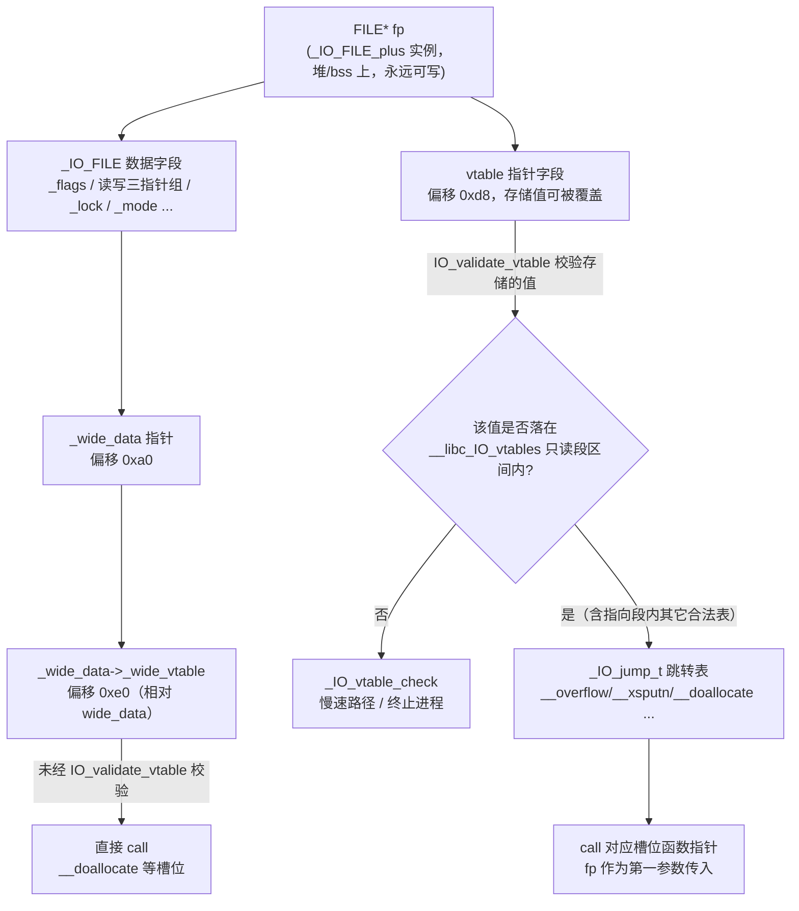
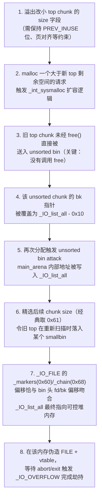
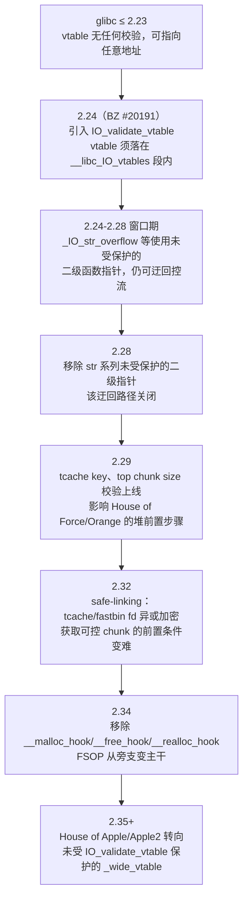

# 二进制漏洞与利用基础（17）· IO_FILE结构利用与FSOP

> [!abstract] TL;DR
> - glibc 用 `_IO_FILE_plus` + `_IO_jump_t` 手写的"虚表"是 stdio 全部 I/O 操作的分发核心，一旦攻击者能伪造或篡改 FILE 结构体，就能在 `puts`/`printf`/`fclose`/`exit` 这些日常调用里劫持控制流——这就是 FSOP（File Stream Oriented Programming）。
> - glibc 2.24 引入的 `IO_validate_vtable` 只检查 vtable 指针是否落在只读的 `__libc_IO_vtables` 段内，并不检查它是不是"正确的那张表"——攻击者仍可把 vtable 错位指向段内其它合法表（如 `_IO_str_jumps`/`_IO_wfile_jumps`）达到目的。
> - 不改 vtable 也能出事：仅篡改 `_IO_write_base`/`_IO_write_ptr`/`_flags`（经典的 `0xfbad1800` 组合）就能让下一次 `puts`/`exit` 把任意地址内容当作"stdout 缓冲区"写出，实现完全不涉及 vtable 伪造的信息泄露。
> - House of Orange 的精髓不在"泄露"本身，而在于用 unsorted bin attack 把不可控的 `main_arena` 地址，借助 chunk size 的精心选择"借位"重新导向到攻击者可控的堆内存，让 `_IO_list_all` 最终指向自己布置好的伪造 FILE。
> - glibc 2.34 移除 `__malloc_hook`/`__free_hook`/`__realloc_hook` 之后，FSOP 从"众多花活之一"变成"UAF/堆溢出通往任意代码执行"的主干道；2.35+ 的 House of Apple 系列进一步转向未受 `IO_validate_vtable` 保护的 `_wide_data->_wide_vtable`。
> - 本篇只讲原理、检测与加固思路，不提供可直接命中真实目标的成品 payload——理解"这条链为什么能走通"，才能理解 RELRO、vtable 校验、CFI 等防护各自在挡什么、又在哪里留了缝。

## 概述与定位

在本系列的利用链谱系里，前几章已经把"通用控制流劫持点"逐个排查过一遍：栈上的返回地址（第 02、05、06、07 章）、信号帧（第 12 章）、GOT 表项（第 16 章）。这些劫持点都有一个共同的前提——攻击者需要先拿到某种"写"原语，再找一个会被无条件执行、且内容可控的代码指针。GOT 是这类指针里最直接的一种，但 Full RELRO 早已把它钉死为只读；`__malloc_hook`/`__free_hook` 曾经是堆漏洞利用里最好用的"一次覆盖，直接拿 shell"的后门，但 glibc 2.34（2021 年 8 月发布）已经把它们从公开符号表里连根拔起。当这两条路都被堵上之后，攻击者退而求其次，把目光投向了一个体量更大、天生就必须保持可写、而且几乎每个 C 程序都会主动去触碰的数据结构——`_IO_FILE`，也就是 `FILE*` 背后的真身。

`_IO_FILE` 结构利用之所以在 2.34 之后从"小众技巧"变成"标配技能"，根源在于它满足了攻击者对通用劫持点的三个诉求：其一，**它必然存在**——只要程序调用过一次 `printf`、`puts` 或者干脆什么都没做只是正常 `return` 退出，`stdin`/`stdout`/`stderr` 这三个 FILE 对象就已经在内存里；其二，**它必然可写**——stdio 的读写指针、缓冲区指针要在每次 I/O 时被实时更新，这决定了它不可能被 RELRO 保护成只读；其三，**它自带一张函数指针表**——glibc 用手写的"虚函数表"（vtable）机制统一调度不同种类的流（文件、管道、内存字符串流、宽字符流），这套机制本身就是"通过数据驱动间接调用"，天然是控制流劫持的理想靶子。业内把针对这套机制展开的攻击统称为 **FSOP**（File Stream Oriented Programming，也写作 File-Structure Oriented Programming），它与格式化字符串漏洞（第 09 章）常常配合出现——后者提供任意地址读写原语，前者提供把原语变现为代码执行的落地点。

本篇聚焦三件事：`_IO_FILE`/`_IO_FILE_plus`/`_IO_jump_t` 的精确内存布局与调度机制；glibc 2.24 之后的 vtable 校验机制以及围绕它的攻防拉锯（含 House of Orange 完整复盘）；以及 2.34 之后 FSOP 如何取代 hook 劫持成为堆利用的收官步骤。与本知识库内 [[24.内存管理与堆分配器/17.堆利用手法体系House_of系列]] 的分工是：那一篇构建的是"整个 House of X 家族的族谱地图"，House of Orange 只是其中一个条目；本篇则专门解剖 `_IO_FILE` 这一个数据结构本身——它的字节布局、它的虚表调度宏、它的校验函数、它的触发路径——不管走的是哪一种 House，只要终点是"伪造 FILE 结构体拿控制流"，都要先理解这里讲的机制。下一章（第 18 章 one_gadget 与 magic_gadget）承接的正是"拿到 PC 控制之后跳去哪里"这个后续问题，两章合起来才是一条完整的现代堆利用链。

## 原理与机制

### stdio 缓冲模型：为什么 FILE 里有一堆指针

glibc 的 stdio 层在系统调用 `read`/`write` 之上叠了一层用户态缓冲，目的是减少昂贵的系统调用次数：连续的 `putchar` 调用不会每次都触发一次 `write(2)`，而是先攒进用户态缓冲区，缓冲区满了或者显式 `fflush` 时才真正落地。为了描述"缓冲区当前用到哪里、还剩多少、是在读还是在写"，`_IO_FILE` 里维护了三组指针：

- **读指针三元组**：`_IO_read_ptr`（下一次读取的位置）、`_IO_read_end`（已有数据的末尾）、`_IO_read_base`（缓冲区起始）；
- **写指针三元组**：`_IO_write_base`（缓冲区起始）、`_IO_write_ptr`（已写入数据的末尾，也是下次继续写的位置）、`_IO_write_end`（缓冲区容量上限）；
- **物理缓冲区**：`_IO_buf_base`/`_IO_buf_end`，标记实际分配的内存范围（读写指针必须落在这个范围内，但读写各自的"有效区间"由前两组指针单独描述）。

理解这三组指针的语义是理解后面"stdout 数据流攻击"的前提：`_IO_new_file_xsputn`（`puts`/`fwrite` 最终都会调用到它）判断是否需要把缓冲区内容刷到内核的依据，本质上就是比较这几个指针的相对大小。如果攻击者能直接改写这几个指针的值，哪怕完全不碰 vtable，也能让 glibc 把一段任意地址的内存当成"已经写好、待刷新的缓冲区"内容，随 `write(fd, ...)` 系统调用发送出去——这正是不涉及虚表伪造的"stdout 泄露"技巧的原理源头，本章第三节会展开。

### 手写虚表：_IO_FILE_plus 与 _IO_jump_t

C 语言没有虚函数，但 glibc 的 I/O 子系统需要用同一套 API（`fread`/`fwrite`/`fseek`/`fclose`……）驱动完全不同的底层实现——普通磁盘文件、管道、`/dev/null`、`sprintf` 背后的内存字符串流、`fmemopen`/`open_memstream`、宽字符流——这是典型的"同一接口、多种实现"的多态需求。glibc 的解法是手写一份 C++ 虚表机制的等价物：

```c
/* 简化自 glibc libio/libioP.h */
struct _IO_FILE_plus {
    FILE file;                       /* 传统 _IO_FILE，不含 vtable */
    const struct _IO_jump_t *vtable; /* 紧跟在 file 之后 */
};
```

之所以把 vtable 拆成独立的 `_IO_FILE_plus` 而不是直接塞进 `_IO_FILE` 本体，是历史包袱决定的：早期（gcc 2.95 时代）的 `libstdc++` 直接构造裸的 `_IO_FILE`，不知道 vtable 字段的存在；如果贸然在 `_IO_FILE` 里插入 vtable 指针会破坏这些老二进制的 ABI 兼容性。于是 glibc 把新增的 vtable 包在外层结构体 `_IO_FILE_plus` 里，并在 `_IO_FILE` 内部保留一个 `_vtable_offset` 字段作为"这份实例的 vtable 到底在哪个偏移"的间接层——正常情况下 `_vtable_offset` 为 0，vtable 就紧跟在 `_IO_FILE` 本体后面；但对于极少数需要兼容旧 ABI 的场景，这个字段可以让运行时从另一个偏移读取 vtable 指针。这是一处纯粹为二进制兼容性而生的设计妥协，理解它能解释为什么后文的 `IO_validate_vtable` 宏在取 vtable 时要"先加 `_vtable_offset` 再解引用"这种看起来绕了一圈的写法。

`vtable` 指向的 `_IO_jump_t` 就是真正的跳转表，本质是一个函数指针数组：

```c
struct _IO_jump_t {
    size_t __dummy;       /* 0x00 */
    size_t __dummy2;      /* 0x08 */
    void *__finish;       /* 0x10 */
    void *__overflow;     /* 0x18  ← _IO_OVERFLOW 宏调用的目标，FSOP 最常用的落点 */
    void *__underflow;    /* 0x20 */
    void *__uflow;        /* 0x28 */
    void *__pbackfail;    /* 0x30 */
    void *__xsputn;       /* 0x38  puts/fwrite 写入路径 */
    void *__xsgetn;       /* 0x40 */
    void *__seekoff;      /* 0x48 */
    void *__seekpos;      /* 0x50 */
    void *__setbuf;       /* 0x58 */
    void *__sync;         /* 0x60 */
    void *__doallocate;   /* 0x68  ← wide_vtable 里同名槽位是 House of Apple 落点 */
    void *__read;         /* 0x70 */
    void *__write;        /* 0x78 */
    void *__seek;         /* 0x80 */
    void *__close;        /* 0x88 */
    void *__stat;         /* 0x90 */
    void *__showmanyc;    /* 0x98 */
    void *__imbue;        /* 0xa0 */
};
```

每当代码里写 `fflush(fp)`、`fclose(fp)`，展开到最底层都会变成类似 `_IO_OVERFLOW(fp, ...)` 这样的宏调用，而这个宏做的事情就是"从 `fp` 指向的 vtable 里取出 `__overflow` 槽位的函数指针，传入 `fp` 自身作为第一个参数（对应 x86-64 下的 `rdi`），然后 `call`"。这正是控制流劫持的靶心：只要攻击者能同时控制 `fp` 指向的内存内容（伪造 `_IO_FILE` 数据）和 vtable 指针本身，就等价于拿到了一次"参数可控的间接调用"。

### 校验的引入：IO_validate_vtable

2015 到 2016 年间，安全社区开始批量利用上述"vtable 随便指"的弱点，glibc 官方随即在 2.24 版本（对应 glibc bug 20191，简称 BZ #20191）引入了运行时校验。其核心是把所有合法的 `_IO_jump_t` 实例（`_IO_file_jumps`、`_IO_str_jumps`、`_IO_wfile_jumps` 等）统一编译进一个专门命名的、位于只读段的 ELF section（`__libc_IO_vtables`），并在每次通过宏触发间接调用之前插入一次范围检查：

```c
static inline const struct _IO_jump_t *
IO_validate_vtable (const struct _IO_jump_t *vtable)
{
  uintptr_t section_length =
      __stop___libc_IO_vtables - __start___libc_IO_vtables;
  uintptr_t ptr = (uintptr_t) vtable;
  uintptr_t offset = ptr - (uintptr_t) __start___libc_IO_vtables;
  if (__glibc_unlikely (offset >= section_length))
    _IO_vtable_check ();   /* 越界：终止进程（或走兼容分支） */
  return vtable;
}
```

这里有一个容易被忽视但很关键的事实：**vtable 指针字段本身仍然是可写的**——它就躺在 `_IO_FILE_plus` 结构体里，和读写缓冲指针在同一块内存上，天然会随程序运行被覆盖。`IO_validate_vtable` 检查的是这个指针"存的值"是否落在 `[__start___libc_IO_vtables, __stop___libc_IO_vtables)` 这段地址区间内，而不是这个指针"所在的位置"是否只读。换句话说，这项加固能挡住的是"vtable 指向堆/栈上完全自定义的伪造函数表"，挡不住"vtable 指向 libc 内部某张真实存在、但不该被这个流类型使用的表"。这个区别正是下一节所有 vtable 层绕过技巧的立足点。

需要顺带说明的是，`_IO_vtable_check` 并非无条件终止进程：为了兼容极老版本 `libstdc++`（gcc 2.95 时代，会用自己的方式初始化 libio 流对象）注册的外部 vtable，glibc 保留了一个受指针保护（pointer-guard）加密的开关变量 `_IO_accept_foreign_vtables`，以及针对 `dlopen` 场景的 `_dl_open_hook`，二者共同构成了这项加固的"兼容性后门"。这类边界条件通常不是常规 CTF 场景的主战场，但作为逆向分析人员理解一份陌生 glibc 二进制的校验逻辑时，值得留意反汇编里出现的这些额外分支，避免误判某条路径"已被完全堵死"。



### 触发路径：什么时候会真的走到间接调用

伪造好 `_IO_FILE` 只是完成了一半，还需要一个"扳机"让 glibc 主动去访问它。常见的触发面有四类：

1. **程序正常退出**：`exit()`（包括 `main` 函数 `return`）会调用 `__run_exit_handlers`，其中包含 `_IO_cleanup()`，后者调用 `_IO_flush_all_lockp()`；
2. **异常终止**：`abort()`、`assert` 失败、未捕获信号的默认处理，很多路径最终也会汇聚到同一个清理流程；
3. **显式调用 `fflush(NULL)`**：语义就是"刷新所有打开的流"，直接触发 `_IO_flush_all_lockp`；
4. **缓冲区自然写满**：不需要任何清理逻辑介入，正常调用 `puts`/`printf` 写入的数据超过当前缓冲区剩余空间时，`_IO_new_file_xsputn` 内部就会自己调用 `_IO_OVERFLOW`。

其中最经典的是 `_IO_flush_all_lockp` 遍历全局链表 `_IO_list_all` 的过程，它对每个链上的 `fp` 做的判断（glibc 源码，简化版）大致是：

```c
if (((fp->_mode <= 0 && fp->_IO_write_ptr > fp->_IO_write_base)
     || (_IO_vtable_offset (fp) == 0 && fp->_mode > 0
         && (fp->_wide_data->_IO_write_ptr > fp->_wide_data->_IO_write_base)))
    && _IO_OVERFLOW (fp, EOF) == EOF)
  result = EOF;
```

这段代码直接决定了伪造 FILE 结构体时哪些字段是"刚需"：字节流模式下需要 `_mode <= 0` 且 `_IO_write_ptr > _IO_write_base`；宽字符模式则要满足 `_wide_data` 相关的等价条件。`_IO_list_all` 本身是一个单向链表的表头，所有通过 `fopen` 打开的流以及 `stdin`/`stdout`/`stderr` 都通过 `_IO_FILE._chain` 字段串在这条链上——这意味着攻击者不一定要覆盖 `stdout` 本身，只要能把自己伪造的一个节点"挂"到这条链上（哪怕是通过覆盖 `_IO_list_all` 这个头指针，让它直接指向伪造节点），退出时的清理流程就会主动找上门。

## 结构与利用链详解

### _IO_FILE 内存布局精解（x86-64）

下面是 x86-64 平台上 `_IO_FILE`/`_IO_FILE_plus` 的完整偏移表（现代 glibc，`sizeof(_IO_FILE) = 0xd8`，`sizeof(_IO_FILE_plus) = 0xe0`）。这张表是构造任何伪造 FILE 结构体的地基，实战中一般直接用 `gdb` 的 `ptype struct _IO_FILE_plus` 或 pwntools 的符号信息复核，但理解每个偏移"为什么在这里、管什么"比死记数字更重要：

```
偏移       字段                含义
0x00       _flags              状态标志位（宽/窄字符模式、错误位、_IO_MAGIC 等）
0x08       _IO_read_ptr        读游标
0x10       _IO_read_end        已读数据末尾
0x18       _IO_read_base       读缓冲区起始
0x20       _IO_write_base      写缓冲区起始 ← stdout 泄露技巧的核心字段
0x28       _IO_write_ptr       写游标（已写数据末尾）← 同上
0x30       _IO_write_end       写缓冲区容量上限
0x38       _IO_buf_base        物理缓冲区起始
0x40       _IO_buf_end         物理缓冲区末尾
0x48       _IO_save_base       回退/多字节转换相关
0x50       _IO_backup_base
0x58       _IO_save_end
0x60       _markers            标记链表指针
0x68       _chain              指向 _IO_list_all 链上的下一个 FILE ← House of Orange 关键偏移
0x70       _fileno             底层文件描述符（int）
0x74       _flags2             扩展标志位（int）
0x78       _old_offset         历史遗留偏移字段
0x88       _lock               流锁，必须是可写且不会导致崩溃的地址
0x90       _offset             当前文件偏移
0x98       _codecvt            多字节/宽字符转换描述符
0xa0       _wide_data          指向 _IO_wide_data ← House of Apple 关键偏移
0xa8       _freeres_list
0xb0       _freeres_buf
0xc0       _mode               <=0 表示窄字符流，>0 表示宽字符流
0xd8       vtable              （_IO_FILE_plus 独有）指向 _IO_jump_t
```

几个偏移值得单独强调设计动机：`_lock`（0x88）之所以必须是一个"安全"的地址（哪怕只是指向一段全零内存），是因为几乎所有对外暴露的 stdio 函数在触碰缓冲区之前都会先加锁——`fputs` 等函数内部会访问 `[lock+8]`，如果这里是 `NULL` 或者非法指针，还没走到真正的利用逻辑就先因为解引用崩了。这是实战中最常见的"明明构造对了 vtable，程序却直接段错误"的排错点之一。`_mode`（0xc0）则决定了 glibc 到底走窄字符路径还是宽字符路径——这个字段的取值直接决定了后文 House of Apple 系列走的是普通 vtable 还是 `_wide_data->_wide_vtable`，构造伪造结构体时选错 `_mode` 会导致整条链走向完全不同（甚至无法触发）的代码路径。

### 校验之下的缝隙：错位复用与历史上的二级指针

`IO_validate_vtable` 只保证"落点在段内"，不保证"落点是这个流类型该用的那张表"。这催生了两类经典绕过：

**技巧一：错位指向合法表内部**。`__libc_IO_vtables` 段里挤着好几张真实存在的表——服务于普通文件的 `_IO_file_jumps`、服务于内存字符串流（`sprintf`/`vsscanf` 背后使用）的 `_IO_str_jumps`、服务于宽字符文件流的 `_IO_wfile_jumps` 等等。这些表在内存里是连续排列的，段边界检查只在乎"整体偏移没有越出这一整段"，并不关心具体落在哪张表的哪个槽位上。于是攻击者可以把伪造 FILE 的 vtable 字段设置为"某张合法表的地址减去几个槽位"，让 `_IO_OVERFLOW` 实际取到的函数指针其实是隔壁表里语义完全不同的另一个槽位——只要这个槽位对应的函数在攻击者可控的参数下能产生有用效果（哪怕只是访问了一个可控的二级指针），这次校验就形同虚设。

**技巧二：str 系列的二级函数指针（2.24–2.28 窗口期，已修复）**。`_IO_str_overflow`（服务于 `sprintf` 类内存字符串流）在实现里需要动态扩容内部缓冲区，为此它会去读取伪造流对象自身数据区里存放的一个"分配器函数指针"并直接调用——这个二级指针根本不属于 vtable，自然也不在 `IO_validate_vtable` 的检查范围内。这意味着即便 vtable 校验完全生效、攻击者也拿不到自定义 vtable，仍然可以借道 `_IO_str_jumps` 走到 `_IO_str_overflow`，再通过这个未受保护的二级指针拿到任意函数调用。glibc 2.28 移除了这一批未受保护的二级指针，此路径自此关闭，但它是理解"vtable 检查不等于结构体检查"这一原则的最佳案例：**校验永远只覆盖它明确检查的那个字段，结构体里其它同样能影响控制流的字段未必跟着一起被保护**。这也是后面 `_wide_data->_wide_vtable` 仍然可用的根本原因——历史在重复。

### 不碰 vtable 也能出事：stdout 数据流攻击

如果说前面两类技巧还需要跟 `IO_validate_vtable` 正面周旋，还有一类攻击压根不需要伪造或修改 vtable，纯粹靠篡改 `_IO_FILE` 的数据字段就能拿到信息泄露。原理回到本章第二节提到的三组缓冲指针：`_IO_new_file_xsputn`（`puts`/`printf` 的底层写入路径）判断"有多少数据要刷给内核"的依据是 `_IO_write_ptr - _IO_write_base` 这个差值，并最终以 `write(fd, _IO_write_base, 差值)` 的形式落地成系统调用。如果攻击者能把 `_IO_write_base` 改成一个想要泄露的目标地址、把 `_IO_write_ptr` 改成"目标地址 + 想泄露的长度"，下一次任何触发 flush 的操作都会把目标地址开始的内存原样吐到标准输出——全程没有涉及一个字节的函数指针篡改，`IO_validate_vtable` 无从谈起。

实战中最常见的具体手法是覆盖 `_flags` 字段为魔数 `0xfbad1800`（这是 glibc 内部合法状态位的一种组合，能让流被判定为"处于可以被刷新的正常状态"），再配合把 `_IO_write_base` 的最低字节清零（一次单字节溢出即可做到）：这会让 glibc 误以为"缓冲区起点回到了更早的位置"，而 `_IO_write_ptr` 保持原值不变，二者之间凭空多出一大段"待刷新"的区间，其实际内容覆盖了 `_IO_FILE` 结构体自身后续字段乃至更远处的堆/libc 数据——一次调用就能把大段内存布局连本带利地泄露出来，这也是"House of Rust"等无泄露利用链里用来一步换取 libc、堆地址的关键第一击。这个技巧的价值在于它完全独立于 glibc 版本对 vtable 校验的强弱：不管 2.24、2.28 还是 2.34，`_IO_write_base`/`_IO_write_ptr` 这几个字段从来没有被任何一次加固单独保护过，因为保护它们就等于让正常的 stdio 缓冲功能失效。

### House of Orange：从"没有 free"到控制流劫持

House of Orange 是 FSOP 历史上最具代表性的完整利用链，最早在 2016–2017 年的 CTF 赛题（HITCON、0CTF 等）中被系统化。它的独特之处在于**全程不调用一次 `free()`**，这对应的场景是"程序只提供 `malloc` 类接口、完全没有释放功能"——传统依赖 `free` 的堆利用手法在这种场景下全部失效，House of Orange 提供了另一条路：



第 1–2 步是"没有 `free` 却能进 unsorted bin"的关键：`malloc` 在当前 top chunk 剩余空间不足以满足请求时，会把整个 top chunk 当作一个空闲 chunk 直接甩进 unsorted bin，然后再向操作系统申请新的一大块内存作为新 top——这本来是 ptmalloc 正常扩容逻辑的一部分，攻击者只是"借用"了这个必经流程，不需要漏洞本身提供 `free` 能力。第 3–5 步是标准的 unsorted bin attack（本知识库 [[24.内存管理与堆分配器/17.堆利用手法体系House_of系列]] 第 11 节有更通用的介绍）：由于 unsorted bin 是双向链表，`malloc` 扫描时会把链表头（对应 `main_arena` 内部地址）写入 `bck->fd`，如果 `bck` 被攻击者控制为 `_IO_list_all - 0x10`，这次"写入"的落点就精确对准了 `_IO_list_all` 全局变量本身。

第 6–7 步是全链条里最精巧、也最容易在阅读别人 exploit 时看不懂"为什么偏偏是这个 size"的部分。写入 `_IO_list_all` 的值是 `main_arena` 内部某个 bin 链表头的地址，这个地址本身攻击者并不能直接控制内容——但 `_IO_FILE` 结构体里 `_markers` 字段位于偏移 `0x60`、`_chain` 字段位于偏移 `0x68`，这一组偏移和 `main_arena.bins[]` 数组里某个 bin 头 `fd`/`bk` 指针的相对偏移恰好可以对齐。通过精心选择让旧 top chunk 重新入 bin 时使用的 size（经典配方是 `0x61`），可以让这个 bin 头节点的 `fd` 指针最终指向的，正是攻击者早先布置好、内容完全可控的那块旧 top chunk 起始地址。绕这么一圈的意义在于：`_IO_list_all` 本身写入的是不可控的 `main_arena` 地址，但**当 glibc 把这个地址当作 `FILE*` 解引用、读取其 `_chain` 字段去找链表下一个节点时**，读到的却是攻击者完全掌控的堆内存——这才是"伪造 FILE 结构体"真正落地的地方。第 8 步就是水到渠成：在这块可控内存里按照本章第一节的偏移表填好 `_flags`、写指针三元组、vtable 指针（此时的 glibc 版本还没有 `IO_validate_vtable`，vtable 可以直接指向包含 `system` 地址的任意可控内存），等待程序正常退出触发 `_IO_flush_all_lockp` 遍历到这个节点，`_IO_OVERFLOW` 就此变成一次参数可控的函数调用。

glibc 2.24 引入 vtable 校验后，这条链路里"vtable 随便指"的最后一环被堵上，但前 7 步（利用无 free 场景拿到 unsorted bin、劫持 `_IO_list_all` 得到可控 `fp`）本身并不依赖 vtable 的合法性，依然成立——变的只是第 8 步要换成本章前面讲的"错位复用合法表"或者"完全不碰 vtable 的数据流攻击"来收尾。这也是为什么 House of Orange 常被称为"半衰期很长"的技巧：它解决的是"如何在没有 `free` 的情况下拿到一个可控 `fp`"这个前置问题，而这个前置问题的答案至今没有被任何一版 glibc 加固废弃。

### glibc 2.34 之后：FSOP 从旁支到主干

2.34 之前，大多数堆利用教程的收官动作是"覆盖 `__free_hook` 为 `system`，再 `free("/bin/sh")`"——一次写入、零心智负担。2.34（2021 年 8 月）把 `__malloc_hook`、`__free_hook`、`__realloc_hook`、`__memalign_hook` 从公开符号里整体移除（保留的同名符号只是空壳兼容位，运行时完全不生效），这条捷径彻底断绝。此后但凡拿到了一个"任意地址写"原语、想要变现成代码执行，摆在面前的主流选项就剩下：劫持 `malloc`/`free` 内部使用的 `tcache`/`fastbin` 元数据配合已有的合法函数指针（如 GOT，但 Full RELRO 场景下不可写）、或者构造 FSOP。这正是 FSOP 在 2021 年之后的 CTF 赛题里出现频率陡增的直接原因——它不是因为技巧本身变强了，而是因为竞争对手（hook 劫持）被移除了。

### _wide_data 与 House of Apple 系列：另一张没被检查的表

`_mode` 字段大于 0 时，流进入"宽字符定向"模式，此后所有 I/O 操作实际都会转发到 `_wide_data`（偏移 `0xa0`）指向的 `_IO_wide_data` 结构体，其内部在偏移 `0xe0` 处同样存放着一张独立的虚表指针 `_wide_vtable`，`__doallocate` 槽位位于这张表的偏移 `0x68`。问题在于：`IO_validate_vtable` 检查的对象自始至终只是 `_IO_FILE_plus.vtable` 这一个字段，`_wide_data->_wide_vtable` 是完全独立的另一片内存、另一次间接调用，2.24 引入的校验机制从未覆盖过它。

这正是 2022 年前后由研究者提出的 **House of Apple** 系列技巧的立足点：把 `vtable` 字段依旧规规矩矩指向合法的 `_IO_wfile_jumps`（顺利通过 `IO_validate_vtable`），借此走到 `_IO_wfile_overflow` 或 `_IO_wfile_seekoff` 这类会进一步访问 `_wide_data` 的函数；而 `_wide_data` 本身及其 `_wide_vtable` 则完全指向攻击者自己控制的伪造内存，最终 `__doallocate` 槽位上的函数指针可以放心填成任意目标（比如 `system` 或某个 one_gadget）。调用链呈现为 `_IO_wfile_overflow → _IO_wdoallocbuf → _IO_WDOALLOCATE(fp) → *(fp->_wide_data->_wide_vtable + 0x68)(fp)`，这也印证了本章前面强调的原则：**校验只保护它明确覆盖的那一个指针，结构体里通向控制流的"第二条路"永远值得单独审视**。House of Apple 2 则换用 `_IO_wfile_seekoff` 触发 `_IO_switch_to_wget_mode` 内部的一次间接调用，本质上是同一漏隙的不同触发路径。研究这类技巧的价值不在于记住具体某一次的偏移数字（不同 glibc 小版本之间这些数值会漂移），而在于养成"看到一次通过校验的间接调用，反问一句它内部还读了哪些别的指针"的审查习惯——不少研究者（如 kylebot 的 "angry-FSROP" 工作）已经开始尝试用符号执行工具（如 angr）自动化搜索这类"藏在合法调用链背后的第二次未受检查跳转"，这本身也说明纯人工审查已经难以穷尽这类结构体里潜藏的分支。

## 工具视角与实战

### 静态确认加固版本

拿到一份陌生的 `libc.so.6`，第一步永远是确认它处于加固时间线的哪个位置，这决定了后续该往哪个方向构造：

```bash
# 查看 libc 版本字符串
strings libc.so.6 | grep "GNU C Library"

# 确认是否存在 vtable 校验相关符号（2.24+ 必然存在）
nm -D libc.so.6 | grep -i vtable

# 定位 __libc_IO_vtables 段的边界符号，其地址差即为合法 vtable 区间长度
readelf -sW libc.so.6 | grep -E '__start___libc_IO_vtables|__stop___libc_IO_vtables'

# 确认 hook 是否还生效（2.34+ 符号仍在，但运行时不再被调用）
python3 -c "
from pwn import ELF
libc = ELF('./libc.so.6')
print('__free_hook' in libc.symbols)
"
```

`__libc_IO_vtables` 段的边界一旦确定，就可以在调试器里手工枚举段内所有合法表的起始地址，逐一核对哪些表里存在可以为攻击所用的槽位组合——这一步是构造"错位复用"类 payload 前必须做的静态分析。

### 动态调试：手工解释 FILE 结构体

多数发行版的 libc 不带调试符号，`gdb` 默认无法直接 `print *stdout` 得到完整字段名，实战中通常退化为按偏移表手工解释内存，或者提前用 `ptype` 让 gdb 尝试用内建的类型信息补全：

```
(gdb) p &_IO_2_1_stdout_
(gdb) x/28gx &_IO_2_1_stdout_
(gdb) ptype struct _IO_FILE_plus
```

配合 pwndbg/GEF 这类增强插件，可以用其内建的堆命令（如 `heap`、`vis_heap_chunks`）先把 House of Orange 里涉及的 unsorted bin/smallbin 状态可视化出来，再单独用 `telescope &_IO_list_all` 观察链表头当前指向，这比纯手算偏移直观得多，也更不容易在多步骤利用链中途出错。

### 用 pwntools 组装伪造结构体（教学示意，非可直接投用的完整 payload）

实战构造伪造 FILE 结构体时，最常见的做法是用 pwntools 的 `flat()` 按偏移字典填充，字段与含义严格对应本章第三节给出的偏移表：

```python
from pwn import *
context.arch = 'amd64'
libc = ELF('./libc.so.6')

# 复用一张 libc 自带的合法表（示例：_IO_wfile_jumps），
# 使 IO_validate_vtable 检查通过；具体该用哪张表、是否需要错位，
# 取决于想触发的目标函数与该 libc 版本的表内容。
fake_vtable = libc.sym['_IO_wfile_jumps']

fake_file = flat({
    0x00: p64(0xfbad1800),   # _flags：满足内部状态检查所需的组合位
    0x20: p64(0),            # _IO_write_base
    0x28: p64(0x1000),       # _IO_write_ptr（示意：制造非零差值以满足触发条件）
    0x88: p64(0),            # _lock：必须可写非空，否则会在加锁处直接崩溃
    0xa0: p64(0),            # _wide_data：为 0 表示暂不启用宽字符路径
    0xd8: p64(fake_vtable),  # vtable：指向 libc 内合法表，通过 IO_validate_vtable
}, filler=b'\x00', length=0xe0)
```

这段代码只是把本章讲过的偏移语义翻译成可执行的构造过程，用于帮助读者把"字段—偏移—作用"的知识和实际内存布局对上号；它省略了目标函数指针的最终选择、`_wide_data` 链的进一步伪造、以及把 `fake_file` 写入内存并触发的具体漏洞原语（这些都高度依赖具体题目/程序的漏洞类型与已泄露的地址），并不构成一份"复制即可拿 shell"的完整利用脚本。

## 安全性与正确使用

> [!caution]
> 本文所有技术细节仅用于安全研究、CTF 训练与自有/授权测试环境下的学习目的。文中不提供、也不应被用于构造针对真实生产系统或他人系统的完整攻击载荷；所有代码片段均为帮助理解原理的教学性示意，其中的偏移量、字段取值需要结合具体 glibc 版本与调试信息重新推导，不能脱离授权环境"复制即用"。学习 FSOP 的目的是理解现代防护机制（RELRO、vtable 校验、CFI）各自在防御什么、又在哪些地方留有结构性空隙，从而设计出更扎实的防御方案；任何未经授权对他人系统实施攻击的行为均可能触犯《中华人民共和国网络安全法》等法律法规，请严格在合法合规范围内开展相关研究。

### 已有加固的效果边界

把本章涉及的加固时间线串起来看，能更清楚地看出"每一次加固都精确对应它当时能观察到的具体攻击手法"这一规律：



这条时间线揭示的核心认知是：**glibc 的加固始终是"打补丁"式的响应，而不是重新设计**。`IO_validate_vtable` 精确堵住了"vtable 指向任意内存"，但没有、也很难堵住"vtable 指向段内错误的合法表"，因为区分"这次调用该用哪张表"需要理解调用方的完整语义上下文，而不是一次简单的地址范围比较能做到的；`_wide_vtable` 至今未被同等力度校验，本质上是同一治理思路（"只校验已知被滥用过的那一个字段"）在新的字段上重演了一次历史。这也解释了为什么单点加固永远追不上手法演化——真正有效的防御必须是结构性的：要么让整个虚表机制在设计上不可伪造（比如结合硬件辅助的前向控制流完整性），要么从根源上消灭能篡改 `_IO_FILE` 内容的内存破坏漏洞本身。

### 为什么 RELRO 挡不住这条链

一个常见的误解是"开了 Full RELRO 就不用担心函数指针劫持"。Full RELRO 保护的是**加载后不再需要修改**的重定位数据（GOT、部分 `.data.rel.ro`），但 `stdin`/`stdout`/`stderr` 对应的 `_IO_FILE` 实例天生需要在每一次读写时被修改——读写指针、缓冲区状态、文件偏移量都是运行时热数据，把它们标记为只读会直接让 stdio 失去功能。这意味着无论 RELRO 力度多大，`_IO_FILE` 实例本身（包括其中的 vtable 指针字段）永远处于可写状态；真正提供防护的，只是"vtable 指向的那张表的内容"是只读的（因为合法的 `_IO_jump_t` 表本身编译进了只读段），以及在每次间接调用前额外插入的地址范围校验。理解这个区别，才能明白为什么格式化字符串漏洞、堆溢出这类"直接写数据"的原语在 Full RELRO + PIE + Canary 全开的现代二进制里依然有施展空间——它们瞄准的从来不是 GOT，防护对偶关系可参考 [[34.现代二进制防护机制/00.现代二进制防护机制总览]] 中对 RELRO 保护范围的界定。

### 面向防御工程师的建议

1. **升级到 2.34+ 只是移除了一条捷径，不是消灭了风险**：不要把"hook 已移除"等同于"堆溢出/UAF 不再危险"，评估堆相关漏洞的严重性时应默认攻击者具备构造 FSOP 的能力。
2. **控制流完整性（CFI）是结构性解法**：无论是编译器插桩的前向 CFI，还是硬件辅助的 Intel CET/ARM BTI，本质都是在每次间接调用时校验目标地址属于"合法目标集合"，比 `IO_validate_vtable` 这种"只认地址区间、不认语义"的检查更彻底，详见 [[34.现代二进制防护机制/00.现代二进制防护机制总览]]。
3. **消灭原语优先于加固落点**：本篇讨论的一切都建立在"攻击者已经拿到堆溢出或 UAF"这个前提上——真正的性价比最高的防御永远是上游的内存安全实践（边界检查、ASan/MSan 纳入 CI、内存安全语言）而不是持续给 `_IO_FILE` 打补丁，这一原则与堆漏洞防御（参见 [[24.内存管理与堆分配器/17.堆利用手法体系House_of系列]]）一致。
4. **纵深防御不可省略某一层**：即便攻击者成功构造出 FSOP 拿到任意代码执行，seccomp 一类的系统调用过滤（本系列第 20 章）仍能限制其能造成的实际破坏——不要把希望全部押在"某一层防护绝对不会被绕过"上。
5. **逆向分析时优先核对 `_lock`/`_mode`/`_wide_data` 这类"容易被忽略但决定崩溃与否"的字段**：多数实战失败案例并非因为 vtable 选错，而是这些辅助字段没配置成"不会提前崩溃"的安全值。

## 小结

`_IO_FILE` 结构利用的本质，是攻击者把 glibc 为支持多态 I/O 而设计的"数据驱动间接调用"机制，从良性的多态分发，扭转成恶性的控制流劫持——这套机制天生具备的"必然存在、必然可写、自带函数指针表"三个特征，使它在 GOT 被 RELRO 钉死、hook 函数被 2.34 移除之后，成为堆漏洞变现为代码执行的主干道。理解本篇的价值分三个层次：一是精确掌握 `_IO_FILE`/`_IO_FILE_plus`/`_IO_jump_t` 的字节布局与调度宏，这是阅读、构造任何一种伪造 FILE 结构体的基本功；二是理解 `IO_validate_vtable` 只做地址区间校验、不做语义校验，因而衍生出错位复用、二级未受检查指针（历史上的 `_IO_str_overflow`）、`_wide_data->_wide_vtable`（House of Apple 系列）这三类同一治理思路下反复出现的缝隙；三是理解 House of Orange 这条"无需 `free` 也能拿到可控 `fp`"的经典链路，它解决的前置问题至今仍然成立，变化的只是拿到 `fp` 之后如何收尾。下一章（one_gadget 与 magic_gadget）承接的正是"拿到间接调用之后跳去哪一个地址才能一步 getshell"这个问题，与本章合起来构成一条完整的现代堆利用收官路径。

## 相关阅读

- [[24.内存管理与堆分配器/17.堆利用手法体系House_of系列]] · House of Orange 在整个堆利用家族中的定位
- [[24.内存管理与堆分配器/06.ptmalloc2的chunk结构]] · unsorted bin attack 依赖的 chunk 元数据基础
- [[24.内存管理与堆分配器/08.tcache机制]] · 2.29/2.32 加固如何影响 FSOP 前置的堆布局能力
- [[34.现代二进制防护机制/00.现代二进制防护机制总览]] · RELRO 保护范围界定、CFI 作为结构性解法
- [[11.ELF文件详解/17.got节]] · GOT 与 vtable 两类函数指针表的横向对比
- [[22.调用规约/06.SystemV_AMD64调用规约]] · 间接调用时 `fp` 作为首参数传递所依据的调用约定
- [[52.Linux内核机制与内核利用/00.Linux内核机制与内核利用总览]] · 内核态是否存在同类"数据驱动间接调用"攻击面
- [[16.GOT劫持与ret2dlresolve]] · 上一章：Full RELRO 场景下的另一条控制流劫持路线
- [[19.ORW与读取flag]] · 拿到执行能力后在受限沙箱下落地的后续手段
- glibc 官方源码仓库（`libio/libioP.h`、`libio/vtables.c`、`libio/genops.c`）：https://sourceware.org/git/glibc.git
- glibc Bugzilla BZ #20191（vtable 校验机制的原始提案与讨论）：https://sourceware.org/bugzilla/show_bug.cgi?id=20191
- how2heap（shellphish）：各版本 glibc 堆与 IO_FILE 相关 PoC 合集：https://github.com/shellphish/how2heap

[[00.二进制漏洞与利用基础总览|⬆ 系列总览]] | [[16.GOT劫持与ret2dlresolve|← 上一章]] | [[18.one_gadget与magic_gadget|→ 下一章]]
