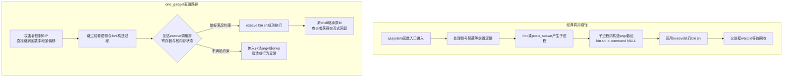
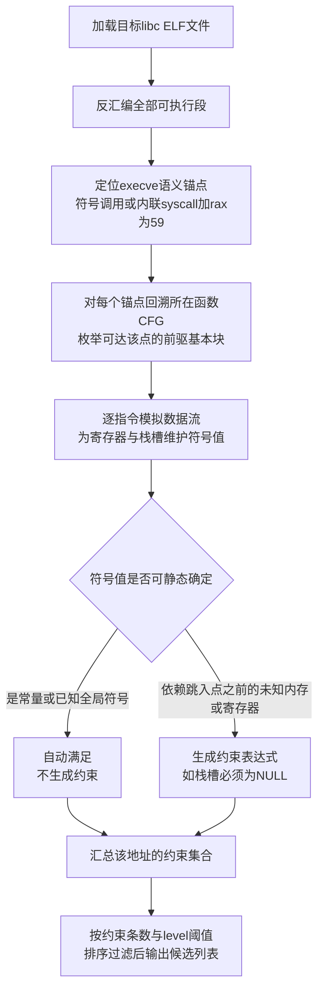
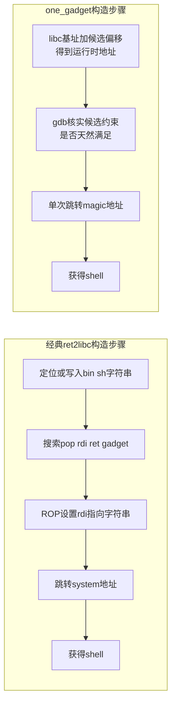
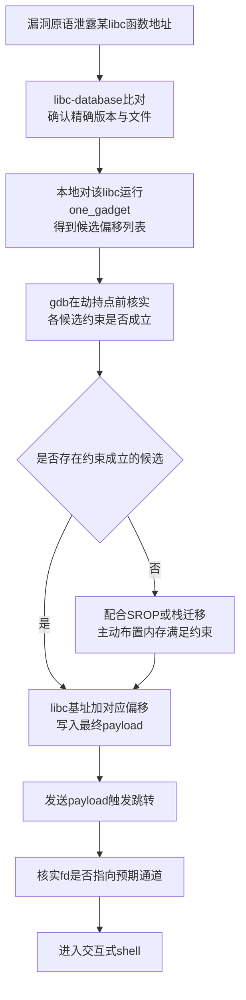

# 二进制漏洞与利用基础（18）· one_gadget与magic_gadget

> [!abstract] TL;DR
> - one_gadget 是静态扫描 libc、寻找"单次跳转即可让 `execve("/bin/sh", ...)` 成功执行"的代码位置的工具；这类地址业界统称 magic gadget / magic address，二者所指本质相同，one_gadget 是工具名兼产物俗称，magic gadget 是更宽泛的江湖叫法。
> - 它定位在利用链的**末端**：解决"已经能控制 RIP、也已经泄露出 libc 基址"之后如何用最少一次跳转拿到 shell，不解决控制流劫持或地址泄露这些前置问题——偏移量是相对 libc 基址的静态值，并不能单独绕过 ASLR。
> - 每个候选地址都带有一组约束（如某栈槽必须为 NULL、某寄存器必须为 0），这些约束源于函数被从中段跳入时寄存器复用与栈内容残留的巧合，是静态数据流分析的产物——工具只做约束的"提取"而非"求解"，满足约束要么靠巧合命中，要么靠 SROP/栈迁移主动布置。
> - 与 `pop rdi; ret` + `system` 的经典 ret2libc 相比，one_gadget 省去寻找参数 gadget、控制寄存器指向字符串的步骤，但代价是约束不一定天然满足、且地址随 libc 版本/发行版/编译选项剧烈变化，必须先用泄露地址比对 libc-database 精确定位版本。
> - 实战失败大多源于约束验证不到位——多个候选未逐一用 gdb 核实、栈对齐问题、或本地与远程环境的栈内容差异——排查思路与 SROP、栈迁移等技术相通；一旦 `execve` 被 seccomp 屏蔽，这条路会整体失效，需转向 ORW。

## 概述与定位

one_gadget 是一个由 david942j 用 Ruby 编写、以同名 gem 形式发布的静态分析工具，输入一份 libc（或任意 ELF）文件，输出一组"只需单次跳转就有较大概率直接获得 shell"的代码地址。这些地址在中文 pwn 圈子里常被直接称为"one_gadget"（工具名与产物名混用），在更宽泛的语境里也普遍被称为 "magic gadget" 或 "magic address"——冠以"魔法"二字，是因为从表面上看，攻击者只是把 `RIP` 改写成 libc 内部一个看起来毫不起眼的偏移量，不需要像经典 ret2libc 那样手工设置任何参数寄存器，程序就直接变成了一个交互式 shell，效果之直接、代价之低，像是变魔术一样。需要在概念上厘清的一点是：one_gadget（工具）与 magic gadget（俗称）不是两套并列的技术，而是同一件事的两种称呼——one_gadget 是"找魔法地址的工具"，它的输出结果就是人们口中的 magic gadget；反过来，在没有该工具、或者工具覆盖不到的场景（非 libc 二进制、其它平台）里，magic gadget 这个术语依然被用来泛指"一段已经存在于目标代码里、只需极少前置条件即可一步到位达成攻击目标的复用点"——例如 Windows 内核 pwn 领域讨论提权手法时，也常把某些一旦触发即可绕过关键检查、无需额外拼接的复用点笼统称为 magic gadget，思路同源但实现细节与本文讨论的 execve 场景完全不同。本篇标题把两者并列，意在覆盖这一整族"用一个跳转拿到大部分利用效果"的思路，但主体篇幅仍以 Linux glibc 场景、one_gadget 工具本身作为讲解主线，因为它是这一族技巧里工具链最成熟、CTF 实战里最常用的分支。

这项技巧的起源早于工具本身。在 one_gadget 出现之前的很长一段时间里，资深 pwn 选手已经知道反汇编 glibc 的 `system`/`__libc_system` 附近代码，能找到若干"巧合地址"——从这些地址开始向下走几条指令就会撞上一次 `execve` 调用，并且当时寄存器状态凑巧满足参数要求。这个过程完全靠手工读汇编、凭经验判断，效率低且极易出错；david942j 把这套"找 execve 调用点 + 反向推导寄存器/栈约束"的流程自动化并开源之后，`one_gadget /path/to/libc.so.6` 一条命令几秒钟内就能给出候选列表，这项原本只有少数人玩得转的技巧才真正在 CTF 社区普及开来，如今已经和 `checksec`、`ROPgadget`、`pwntools` 一样，是每个 pwn 手工具箱里的标配。

把 one_gadget 放进本系列的技术地图里看，它的位置非常明确——它处在利用链的**末端**，解决的是一个很具体的子问题："攻击者已经具备任意控制 RIP 的能力（通过 [[06.ROP入门]]、[[16.GOT劫持与ret2dlresolve]] 或其它手段建立起来的控制流劫持原语），也已经通过某种信息泄露拿到了目标 libc 在内存中的加载基址（参见 [[15.ASLR与PIE绕过技术]]），下一步要怎样最省事地把这个能力兑现成一个可交互的 shell？" 经典答案是 [[05.ret2libc]] 讲的路数——找一个 `pop rdi; ret` 把第一参数设为 `"/bin/sh"` 字符串地址，再跳到 `system`；one_gadget 提供的是另一个答案——如果幸运的话，libc 内部本来就存在某个地址，从那里直接往下执行就会触发一次参数已经"恰好摆好"的 `execve`，那就完全不需要控制任何寄存器，连 `"/bin/sh"` 字符串都不用自己找，一次 `ret`/一次跳转足矣。二者不是互斥关系，而是同一问题的两条可并行尝试的路径：实战中通常两手都要准备，one_gadget 优先尝试（构造量最小），一旦所有候选的约束都无法满足，再退回 ret2libc 的经典构造。

需要提前说明的是，one_gadget 本身**不解决**控制流劫持问题，也**不解决**地址泄露问题——它输出的是相对 libc 基址的静态偏移量，必须先有基址才能算出运行时真实地址，这一点跟 [[16.GOT劫持与ret2dlresolve]]、[[17.IO_FILE结构利用与FSOP]] 里讨论的"如何拿到控制流/如何拿到 leak"是完全独立的两件事，不能指望 one_gadget 单独绕过 ASLR。等到 `execve` 本身被 seccomp 屏蔽（参见后续 [[20.seccomp沙箱与逃逸]]），one_gadget 这条路会直接失效，此时才需要退回 [[19.ORW与读取flag]] 里讨论的 open-read-write 组合拳——这也是为什么本篇被安排在 ORW 之前：one_gadget 代表的是"libc/execve 可用"这一更宽松场景下的最优解，ORW 代表的是执行受限之后的退路。

## 原理与机制

### system 的内部实现：被复用的不是"函数"而是"函数中间的某个瞬间状态"

要理解 one_gadget，先要理解 `system("/bin/sh")` 内部实际发生了什么。glibc 的 `system()` 并不是直接调用一次 `execve` 那么简单，大致流程是：先屏蔽/恢复若干信号处理（避免子进程的信号处理干扰父进程），再 `fork`（或者较新版本走 `posix_spawn`/`clone` 系的优化路径以降低开销）产生一个子进程；子进程里，把传入的命令字符串拼装成 `{"/bin/sh", "-c", command, NULL}` 这样一个以 NULL 结尾的参数数组，调用 `execve("/bin/sh", argv, environ)` 把自己整个替换成一个 shell 进程去解释执行这条命令；父进程则调用 `waitpid` 等待子进程结束、回收状态。这一整套流程需要一定的栈空间去摆放局部变量（尤其是那个多元素的 `argv` 数组），也需要多次函数调用——如果攻击者的目标只是"给我一个 shell"，不关心命令返回值、不关心父进程善后，这一整套流程里九成的工作都是浪费的，真正有用的只有其中那一条 `execve` 调用指令，以及它执行那一刻三个参数寄存器/栈内容恰好是什么。

one_gadget 的核心洞察正在这里：一旦这段代码被编译成机器指令，它就只是内存里的一串字节，`RIP` 完全可以从这个函数的**任意一条指令**开始执行，而不必老老实实从函数入口进入。这其实是 ROP/JOP 一类"面向代码复用编程"技术共享的底层哲学在这里的极致体现——本系列前面章节讨论的 gadget（如 [[07.ROP进阶：ret2csu与通用gadget]] 里的 ret2csu）大多利用的是函数尾部几条指令加一个 `ret`，而 one_gadget 把这个思路推进了一步：它不再局限于"尾部片段"，而是直接把整个函数体当作一堆备选的中间入口点，只要某个中间点往下执行到 `execve` 调用之前恰好不需要额外修改任何寄存器就能满足调用约定，这个中间点就是一个可用的"单跳跳板"。换句话说，`system` 函数从来没有主动"开放"这些入口，它们是**编译器生成代码的必然副产物**——任何函数体内部都天然含有大量这样的中间状态，只是绝大多数中间状态所需要的前置条件（某寄存器必须等于只有该函数自己才知道的值）过于苛刻、实际不可利用；one_gadget 要做的，就是从数以万计的中间地址里，筛出那些前置条件恰好宽松到"可能只需要一小块内存为零"这种程度的极少数幸运点。

### 约束从何而来：寄存器复用与栈内容残留

一条 execve 语义的调用点，要求 `rdi` 指向文件名字符串、`rsi` 指向 `argv` 数组、`rdx` 指向 `envp` 数组（x86-64 调用规约下，参见 [[22.调用规约/06.SystemV_AMD64调用规约]]）。在 `system` 函数正常执行路径里，这三个寄存器在调用前都会被显式赋值——`rdi` 指向常量字符串 `"/bin/sh"`（这个字符串本来就以只读数据形式存在于 libc 内，不需要攻击者额外提供，这也是 one_gadget 比 ret2libc 省事的地方之一），`rsi`/`rdx` 则指向函数栈帧上早已构造好的 `argv`/`environ`。但如果攻击者不是从函数入口进入，而是从中间某处直接跳进来，`rdi` 有很大概率依然自然携带着 `"/bin/sh"` 的地址（因为这个字符串地址往往在函数较早阶段就被装载，且此后没有被覆盖，处于"顺路满足"的状态），而 `rsi`/`rdx` 则未必——如果跳入点位于"字符串已经准备好，但 `argv` 数组尚未完整构造"的这一小段窗口内，`rsi` 指向的那块栈内存，其内容就取决于**在这条执行路径生效之前，这块栈空间上一次被写入的是什么**，这完全是编译器安排局部变量布局与此前调用链留下的历史遗留决定的，不受攻击者控制，也不是 libc 开发者刻意设计的——纯属巧合。

这正是约束存在的根本原因：约束本质上是 one_gadget 对"这块内存/寄存器在运行时到底会是什么"这件事**无法在静态分析阶段确定**的一种如实反映。工具能确定的只是数据流关系（比如"`rsi` 在这条路径上等于 `[rsp+0x30]` 的值"），但 `[rsp+0x30]` 本身的具体数值，取决于运行到这里之前函数调用链在这块栈内存上留下的历史痕迹——可能是上一层调用者的某个局部变量，可能是某个已经返回的函数的返回地址，也可能确实是零（比如恰好是某次清零操作留下的，或者干脆是从未被写过的"新鲜"栈页面）。因此约束"`[rsp+0x40] == NULL`"翻译成人话就是："你的 exploit 必须自己想办法保证，当执行流跳到这个地址时，`rsp+0x40` 处的内存恰好是全零——工具没法替你保证这一点，因为这不是静态可判定的"。理解这一点，能帮助建立一个重要的心智模型：one_gadget 的约束不是"工具算出来一定成立的条件"，而是"工具算出来的必要条件清单"，它把"这个地址能不能用"这个问题，从"茫茫多条件都不知道"简化成了"只需要验证这几条是否成立"，这才是它真正提效的地方。

### execve 之后为什么还能"看到"shell：文件描述符继承

有一个经常被初学者忽略、但对理解"为什么这样就能拿到可交互 shell"至关重要的机制，是文件描述符的继承。`execve` 系统调用会把当前进程的用户态地址空间、代码段、堆栈等几乎全部替换成新程序（这里是 `/bin/sh`）的内容，但**默认情况下不会关闭已经打开的文件描述符**（除非该描述符被显式标记了 close-on-exec）。这意味着，如果受攻击的进程原本的标准输入/输出/错误就是与攻击者建立的那条 TCP 连接（CTF 里最常见的服务端模式），那么 `execve` 换入 `/bin/sh` 之后，新启动的 shell 依然使用同一组文件描述符作为它自己的标准输入输出——攻击者通过 socket 发送的数据变成了 shell 的输入命令，shell 的执行结果通过同一个 socket 回显给攻击者，形式上就构成了一个远程交互式 shell。这不是 one_gadget 或 `execve` 本身"特意支持"远程交互，而是 Unix 进程模型里"fork/exec 默认不清空文件描述符表"这一由来已久的设计决定的自然结果——理解了这一点，也就能理解为什么有些题目在拿到 shell 之后没有回显（往往是因为标准输出被重定向到了别处，或子进程/沙箱环境关闭了继承），需要额外用 `dup2` 之类的手段把 fd 修复回来。



## 扫描算法与约束满足详解

### 定位候选：从二进制里找出所有"execve 语义"的调用点

one_gadget 处理一份 libc 时，第一步是用 ELF 解析加反汇编扫描整个 `.text` 段（以及其它可执行段），找出所有可能触发 execve 语义的位置。这不只是简单地查找符号表里 `execve` 这个函数名——很多情况下 libc 内部并不通过符号跳转来调用系统调用，而是直接内联一段"设置 `rax=59`（`__NR_execve`）+ `syscall`"的裸机器码（这类内联系统调用包装在 libc 里俯拾皆是，`__execve`、`__libc_system` 内部实现、甚至一些不对外导出符号的静态辅助函数都可能包含），因此实际扫描目标是**所有语义上等价于发起一次 execve 系统调用的指令序列**，既包括通过符号直接 `call` 到 `execve` 函数体的位置，也包括内联的 `syscall` 指令。找到这些"锚点"之后，分析范围会圈定在锚点所在函数的控制流图内，以及能够到达该锚点的所有前驱基本块。

### 反向数据流分析：约束是怎样被"推导"出来的

定位到锚点后，核心工作是回答一个问题："如果攻击者把 RIP 直接设置到某个基本块的入口（而不是从函数正常入口进来），沿着这条路径执行到锚点时，`rdi`/`rsi`/`rdx` 三个寄存器（以及它们间接指向的内存）分别是什么？" one_gadget 采用的是一种轻量级的静态数据流追踪（可以理解为不做真实求解的抽象解释）：从候选跳入点开始顺着基本块往下模拟执行，给每个寄存器/栈槽位维护一个"符号值"标签，规则大致是：

- 如果某条指令把寄存器显式赋值为立即数 0（如 `xor esi, esi`、`mov edx, 0`），且此后一直没有被其它指令覆盖，一直保持到锚点处，则该寄存器的符号值就是常量 0，不需要生成约束（自动满足，呈现在 one_gadget 输出里就是这个位置根本不会提到该寄存器）。
- 如果某条指令把寄存器设为另一个寄存器/内存位置的值（如 `mov rsi, [rsp+0x30]`），则该寄存器的符号值等于源操作数的符号值——如果源操作数本身是"跳入点之前完全未知的栈内存"（因为攻击者是从中段跳进来的，跳入点之前发生过什么完全不在分析范围内），就把这个不确定性原样标记出来，最终呈现为一条约束，要求这个不确定的位置在运行时等于某个能让调用成功的值（通常是 NULL，因为这样 execve 会把它当作空 `argv`/`envp`，是最容易满足调用不崩溃的取值）。
- 如果某条指令的结果依赖多个可能路径（比如一个条件分支导致同一个寄存器在不同分支下被设成不同值），分析器要么保守地把两种可能都纳入约束，要么分别对每条路径单独生成一个候选地址——这也是为什么同一个大致位置附近，one_gadget 常常会给出好几个偏移量非常接近但约束略有不同的地址，它们对应的其实是同一段逻辑在不同分支下的不同执行路径。

这样反推得到的结果，就是一条形如下面格式的候选记录（以下地址、偏移仅为格式示意，不对应任何具体版本，实际请以本地对目标 libc 运行 one_gadget 的输出为准）：

```
0x4f2c5 execve("/bin/sh", rsp+0x40, environ)
constraints:
  [rsp+0x40] == NULL

0x4f322 execve("/bin/sh", rsp+0x40, environ)
constraints:
  [rsp+0x40] == NULL
  rax == NULL

0x10a38c execve("/bin/sh", rsp+0x70, environ)
constraints:
  [rsp+0x70] == NULL
  rbp is nonnull, but must be a valid argv
```

第一行是工具对"如果条件满足，这个地址实际会发生什么"的语义还原——文件名参数几乎总是常量字符串 `"/bin/sh"`（工具会自动识别出寄存器指向了 libc 内已知的这个只读字符串，不需要约束），第三个参数 `environ` 通常也是自动满足的（因为它是 libc 内部一个全局变量，`rdx` 在很多路径上会被自然装载为这个全局符号的地址），真正不确定、需要读者去核实的只有中间那个 `argv` 参数，约束部分明确写出了"这个位置必须是什么"。约束不满足会有两种典型后果：如果那块内存内容是一个看起来合法但实际指向非法地址的野指针，`execve` 在内核态解析 `argv` 数组时会尝试解引用它，大概率触发 `SIGSEGV`；如果内容凑巧还是合法可读的，但不是一个正确的以 NULL 结尾的指针数组，`execve` 本身可能返回错误（不崩溃，但也换不出 shell，程序会带着错误返回值继续往下走，通常紧接着就会因为后续代码假设了错误的执行路径而以别的方式崩溃）。

### 约束的分类与语义细读

实践中遇到的约束大致可以归纳为几类，理解每一类的实际含义有助于快速判断某个候选在具体场景下是否容易满足：

- **栈内存为空**（`[rsp+N] == NULL`）：最常见的一类，要求执行到跳入点时栈上某个相对偏移处的 8 字节为全零。是否天然满足高度依赖跳转发生前这块栈区域此前经历过什么——刚从 bss/新映射页跳过来往往天然是零，但如果是在原有栈基础上继续利用，那个位置是否为零取决于此前的函数调用留下了什么。
- **寄存器为空或存在特定关系**（`rax == NULL`、`rsi == NULL`、`rsi == rdi` 等）：要求某寄存器在跳入那一刻恰好是 0 或与另一寄存器相等，通常需要结合"跳转前最后一步操作是什么"来判断——如果劫持控制流的最后一步恰好是一次返回值为零的函数调用，该寄存器可能天然满足。
- **可写性/地址合法性**（要求某地址是可写内存）：要求这块地址处在当前进程合法映射且可写的内存区域内——正常栈上执行时这条几乎总是自动满足，只有在栈已经被大幅度迁移到不寻常区域时才需要额外留意。
- **较宽松的"仅需部分为合法值"约束**（如某寄存器为 NULL 或者是一个合法的 `argv` 数组）：这是约束里最不容易靠巧合满足、但一旦满足会非常稳的一类，通常需要配合额外的内存布置。

约束条数与"能否碰巧命中"大致成反比：零约束或单约束的地址，往往在很大比例的正常调用场景下就能直接使用，工具默认只输出这一类高置信度地址；约束条数越多，对运行时栈/寄存器状态的要求越苛刻，越需要攻击者主动去满足而非守株待兔——这也是为什么 one_gadget 提供了搜索深度/宽松度选项（`-l`/`--level`，数值越大越倾向于把约束更复杂、默认被过滤掉的地址也纳入输出），候选不够用时可以调高这个等级，代价是逐一验证的工作量也上升。

### 与符号执行/SMT 求解器的本质差异：只做提取，不做求解

从计算机科学的角度看，one_gadget 面对的其实是一个典型的约束满足问题（Constraint Satisfaction Problem）——给定一组变量（寄存器、栈槽）和一组必须同时成立的约束，判断是否存在、以及如何构造出一组赋值使全部约束成立。把 one_gadget 类比成一个"轻量符号执行工具"是理解它的一个有效角度，但要清楚它与 `angr` 这类通用符号执行框架的本质差异：angr 能够把"输入什么样的字节，能让 RIP 落到某地址且同时满足一组寄存器约束"整个过程自动化，包括**求解**这组约束需要的具体输入（依赖 SMT 求解器如 z3 在背后做真正的约束求解运算）；而 one_gadget 只做了 CSP 的"建模"这一半——从二进制里静态提取出"要满足什么条件"，把变量和约束列清楚，至于这些条件在具体的漏洞利用场景下能不能被满足、怎么被满足（也就是"求解"这一半），完全留给使用者结合自己手头的漏洞原语去判断和构造。这个设计选择是一种领域特定的取舍：一般化的符号执行框架为了通用性，要处理路径爆炸、状态空间管理等复杂问题，运行一次动辄几分钟到几十分钟；one_gadget 把问题收窄到"只找 execve 调用点"这一个具体子问题，舍弃了自动求解能力换来了秒级出结果的速度和无需理解符号执行理论就能直接上手的易用性，这正是它能在时间紧张的 CTF 比赛场景里大受欢迎的原因。

约束"谁来满足"这件事，实际上有两种思路，二者互为补充：

- **被动等待巧合**：直接尝试候选地址，靠运气（以及对目标程序此前执行路径的合理推测）让约束自然成立，这是最常见、成本最低的第一选择。
- **主动构造满足**：如果所有候选的约束都无法靠巧合满足，可以反过来利用其它原语**主动**把内存/寄存器布置成约束要求的样子——最直接的手段是配合 [[12.SROP信号帧伪造]]，用一顶伪造的 `sigcontext` 直接把 `rsp` 指向一块提前清零好的可控内存，再把 `rip` 设为 one_gadget 地址，相当于自己动手把约束"做"成立，而不是"找"一个已经成立的地址；栈迁移（参见 [[08.栈迁移与stack pivot]]）把栈指针整体迁移到一块攻击者完全掌控、内容确定为零的 bss/堆区域，也是同样的思路。这两种手段结合起来，能大幅提高 one_gadget 在约束普遍不满足场景下的可用性——这也正是"约束满足问题"在漏洞利用工程里的两种落地路径：要么在解空间里搜到一个天然可行解，要么用额外的原语把环境改造成可行解所要求的样子。





两条路径的直观差异一目了然：ret2libc 需要"找 gadget、控制寄存器、拼装参数"三个独立步骤，每一步都可能因为目标二进制/libc 缺少合适 gadget 而受阻；one_gadget 把这三步压缩成"算地址、核实约束"两步，跳转本身不需要携带任何额外的寄存器设置指令，因此在栈空间只够覆盖一个返回地址（比如格式化字符串单次写、SROP 单帧触发点）的极端场景下，往往是唯一可行的选择。

## 工具视角与实战

### 安装与基本命令行用法

one_gadget 以 Ruby gem 形式发布，标准安装方式是：

```bash
gem install one_gadget
```

最基本的用法是直接把目标 libc 路径作为参数：

```bash
one_gadget /path/to/libc.so.6
```

工具默认只输出约束条数较少、置信度较高的一小撮候选（通常三到六个），常用的命令行选项包括：用 `-l`/`--level` 调高搜索的宽松等级，把约束更复杂、默认被过滤掉的地址也纳入结果，适合默认候选全部验证失败、需要更多备选时使用；用 `-c`/`--command` 把目标命令从默认的 `"/bin/sh"` 换成 libc 内已经存在的其它字符串常量（不常用，多数场景保持默认即可）；工具还提供针对栈未对齐场景的调整选项，以及辅助验证候选是否可用的附加能力。具体参数名与行为请以所用版本的 `one_gadget --help` 输出为准，不同版本之间偶有增减。

### 结合 libc-database 精确定位目标版本

one_gadget 输出的偏移量与具体的 libc 构建强绑定——同一发行版不同小版本、不同架构、是否经过 strip、编译时的优化选项差异，都会导致候选地址集合完全不同。因此在能拿到目标确切 libc 文件的场景下（题目直接提供，或者通过已泄露的某个 libc 函数地址反查版本），应当直接对着这份确切的 libc 跑 one_gadget，而不是凭猜测的版本号去找一个"看起来差不多"的 libc——哪怕只是小版本号不同，候选偏移也可能完全对不上，跳过去就是直接崩溃。常见做法是借助 `libc-database`（niklasb/libc-database 是社区里最常用的一套离线/在线比对工具与数据集）：先用已泄露的某函数（如 `puts`/`printf` 在 GOT 表里解析出的真实地址）减去该函数在"猜测版本"里的已知偏移，验证等式是否在收录库里唯一匹配，匹配成功后既拿到了精确版本，也顺带拿到了这个函数在该版本里的偏移，可以反过来推出本次运行时的 libc 加载基址。这一步与 [[11.ELF文件详解/17.got节]] 讨论的 GOT 表解析机制直接相关——泄露出的正是延迟绑定后写入 GOT 表项的函数真实地址。

### 与 pwntools 组合使用

实战中 one_gadget 极少单独使用，通常紧跟在一次 libc 基址泄露之后，与 pwntools 组合成型：

```python
from pwn import *

context.arch = 'amd64'
elf  = context.binary = ELF('./vuln')
libc = ELF('./libc.so.6')          # 确认与目标一致的libc副本
io   = process([elf.path])

# ...(此处省略触发leak、拿到某libc函数真实地址的具体漏洞利用步骤)
leaked_puts = 0x00007fxxxxxxxxxx    # 示意:实际由漏洞原语泄露得到
libc.address = leaked_puts - libc.symbols['puts']

# one_gadget /path/to/libc.so.6 预先跑出的候选偏移列表,以示意值列出
og_offsets = [0x4f2c5, 0x4f322, 0x10a38c]
og_addrs   = [libc.address + off for off in og_offsets]

# 多数题目在写通exploit的调试阶段,会先用gdb逐个核实哪个候选约束成立
payload = flat({
    offset: og_addrs[0],   # 先试约束条数最少的一个
})
io.sendline(payload)
io.interactive()
```

如果第一个候选跳过去后没有反应（remote 场景常表现为连接卡住无输出，local 场景常直接看到进程崩溃退出），下一步是换用后续候选重新构造 payload 逐一尝试，而不是盲目怀疑漏洞原语本身出了问题——这是实战中排查顺序上很容易搞反的一点。

### 用 gdb 核实约束是否成立

比"挨个试"更可靠、更省时间的做法，是在真正发送 payload 之前，先用调试器验证候选地址的约束在当前上下文里到底成不成立。基本步骤是：在漏洞触发点（即将发生控制流劫持的那条指令）之前设置断点，单步执行到即将跳转的那一刻，此时按照候选地址的约束描述，直接查看对应寄存器或栈内存的实际内容：

```
pwndbg> break *0x555555554abc      # 断在即将ret/jmp到候选地址之前
pwndbg> run
pwndbg> x/gx $rsp+0x40             # 核对某条候选约束要求的栈槽是否为0
pwndbg> print $rax                 # 核对约束涉及的寄存器取值
```

如果这里显示的值确实是零（或约束要求的其它取值），就可以确信这个候选大概率可用，再放心把它写进最终 payload；如果不是，与其盲目发送等崩溃，不如直接换下一个候选继续核实，或者考虑用栈迁移把这块内存提前布置成约束要求的样子。这个"先在调试器里核实约束，再决定用哪个候选"的习惯，比无脑把所有候选都试一遍更贴近这项技术的本质——毕竟约束本来就是工具明确告诉你的"需要你自己验证的东西"，不是概率抽奖。

### 常见坑与排查思路

- **栈对齐问题**：部分候选地址内部的执行路径上会用到要求 16 字节对齐的指令（典型如某些用 SSE 寄存器搬运数据的 `movaps`），如果跳转发生时 `rsp` 没有正确对齐，会在真正执行到 `execve` 之前就先触发一次因未对齐访问导致的保护异常而崩溃，现象上很容易被误判为"约束不满足"，实际上是对齐问题——排查时可以检查跳转前后 `rsp` 是否是 16 的整数倍，必要时通过多塞入/去掉一次 `ret`（单纯"垫高"或"降低"栈指针 8 字节）来调整奇偶性。
- **本地调试通过、远程打不通**：这是 CTF pwn 里的经典现象之一，原因通常是本地与远程的环境变量、`argv` 数量不同，导致栈基址存在细微差异，进而波及那些依赖具体栈内容的约束是否成立。排查与规避的手段是本地调试时用 `env -i ./vuln` 或者用 pwntools 的空环境变量参数，尽量清空/对齐环境变量，让本地行为更贴近远程精简环境下的实际情况。
- **拿到 shell 但没有回显**：并非约束或跳转本身出了问题，而是文件描述符没有正确指向预期的通信通道，需要结合具体题目逻辑，必要时在能够额外控制寄存器的场景里搭配一次 `dup2` 调用修复 fd，而不是继续怀疑 one_gadget 候选选错了。
- **多个候选交叉污染判断**：不要把不同候选的调试结果混为一谈——每次只改变一个变量（只换一个候选地址）重新验证，避免因为同时改了好几处而无法定位到底是哪个环节出的问题。

### 与堆利用链的呼应

one_gadget 并非只能配合栈溢出/ret2libc 使用，在堆利用场景里同样常见：House_of 系列技巧（参见 [[24.内存管理与堆分配器/17.堆利用手法体系House_of系列]]）最终往往要落地到"劫持一个会被调用的函数指针"（如 `__free_hook`、`__malloc_hook`，或者伪造出的 `_IO_FILE` vtable 里的某个函数指针，参见 [[17.IO_FILE结构利用与FSOP]]），而这个函数指针具体指向哪里，是完全独立于"如何劫持"这个问题的——把它指向 `system` 需要额外控制传入的参数寄存器，把它指向某个 one_gadget 地址则只需要保证跳转发生时约束恰好满足，两条路殊途同归，选择哪一条纯粹看具体场景下哪个更容易满足前置条件。这也再次印证了 one_gadget 在整个利用链里"末端可插拔"的定位——不管前面用的是栈溢出、格式化字符串、UAF 还是双重释放拿到的控制流劫持能力，只要最终目标是"跳到 libc 里拿 shell"，one_gadget 都是一个值得优先尝试的选项。



## 安全性与正确使用

> [!caution] 使用边界
> 本文围绕 one_gadget/magic gadget 讨论的原理、算法与命令行示例，仅用于自有环境、经授权的安全研究以及 CTF/pwn 靶场的学习与练习。文中出现的偏移量、地址均为格式示意，不对应任何真实发行版的可用数值，也不构成针对任何真实生产系统或他人资产的可用攻击载荷。将本文所述技术用于未经授权的目标属于违法行为；本章始终站在防御与教育视角讨论这项技术的原理与局限，不提供、也不应被用于对真实目标的武器化攻击配方。

从防御者的角度审视 one_gadget，有一个容易被误解、需要澄清的点：one_gadget 依赖的"魔法地址"完全是特定 libc 构建的编译副产物，并非 glibc 开发者刻意设计或遗留的后门，因此不存在某个补丁可以专门针对性地"关闭"这些地址——它们会随着 libc 源码变化、编译器版本升级、优化选项调整而自然漂移，同一软件包的下一个小版本很可能候选地址就完全不同，甚至一个都不剩。这种"版本敏感性"客观上构成了一种脆弱的天然缓解：攻击者必须先精确匹配到目标运行的 libc 版本，才能让候选偏移生效，版本判断错一位，结果就是直接崩溃而非拿到 shell。但这绝不意味着可以依赖"我们的 libc 版本比较新/比较冷门"来获得安全感——这本质上是一种隐蔽式安全（security through obscurity），真正起系统性防护作用的，始终是本系列反复强调的那几层机制（参见 [[34.现代二进制防护机制/00.现代二进制防护机制总览]]）：

- **ASLR**：one_gadget 的偏移是相对 libc 加载基址的静态值，ASLR 开启且 libc 基址真正随机分布时，攻击者必须先有一次可靠的地址泄露才能算出运行时真实地址——这是 one_gadget 能够生效的前提而非它能绕过的对象，充分且工作正常的 ASLR（尤其是 64 位下足够的熵）本身就直接堵死了"盲打 one_gadget"的可能性。
- **FULL RELRO**：虽然 FULL RELRO 主要针对的是 [[16.GOT劫持与ret2dlresolve]] 里讨论的 GOT 表劫持，但它间接影响的是"攻击者能否找到一条不需要额外 leak 就能改写控制流的路径"；在需要精确 leak 才能拿到 libc 基址的场景下，RELRO 强化了"必须先合法泄露"这一前提，变相提高了 one_gadget 生效所需的攻击成本。
- **PIE**：主二进制自身开启 PIE 后，攻击者往往需要额外一次针对主二进制自身的地址泄露才能构造出完整的 ROP 链去触发对 libc 的跳转，这进一步叠加了信息泄露的门槛。
- **Seccomp**：是对 one_gadget 最直接、最釜底抽薪的防护手段——如果 `execve`（以及它可能间接触发的 `fork`/`clone`）已经被 seccomp 过滤规则拦截，不管 one_gadget 候选地址的约束多么容易满足，跳过去也只会在系统调用层面直接被判定拒绝，这也是为什么设置了严格 seccomp 白名单的题目/服务，即使存在完美的控制流劫持原语，也必须转而考虑 [[19.ORW与读取flag]] 这类不依赖 execve 的取值方式。
- **Canary/CFI 类机制**：与 one_gadget 关系相对间接，它们防的是"能否劫持控制流"这个更前置的环节（参见 [[14.Canary泄露与绕过]]），一旦控制流已经被劫持，这些机制就已经失效，不再能限制攻击者最终要跳到哪里。

从检测与审计的角度看，针对 one_gadget 这类"跳到库函数中段"的攻击特征，现代 CFI/CET 方案里的间接分支追踪与影子栈能提供一定程度的通用缓解——因为攻击者跳转的目标地址并非一个合法的函数入口点，也没有对应的落地标记，启用了这类机制的处理器在检测到跳转目标不是合法间接分支落地点时会直接触发保护异常；但这类机制的部署仍然受限于硬件支持与操作系统/编译器工具链的协同程度，在存量系统里的覆盖率仍然有限，不能替代 ASLR、RELRO、seccomp 这几层更基础也更成熟的防护。

## 小结

one_gadget 与 magic gadget 这一族技巧的核心心智模型可以概括为：**它不创造新的攻击能力，而是把"已经拿到的控制流劫持能力"兑现为 shell 这一步的成本降到最低**——通过静态扫描 libc 中所有语义上等价于发起 execve 调用的位置，反向推导出到达每个位置时寄存器与栈内存需要满足的必要条件，把原本需要人工通读反汇编才能发现的巧合地址，变成一条命令几秒钟就能拿到的候选列表。理解它，关键要抓住三层关系：第一，one_gadget（工具）与 magic gadget（俗称）说的是同一件事，只是叫法来源不同，后者还可以泛化到其它平台上"复用已有代码中间状态"的同类思路；第二，它处在利用链的末端，不解决控制流劫持与地址泄露这两个更前置的问题，偏移量必须叠加运行时 libc 基址才有意义；第三，约束是工具明确交给使用者的待验证清单而非自动成立的保证，是一个典型的约束满足问题——被动等待巧合与主动用 SROP/栈迁移构造满足，是解决它的两种互补思路。与经典 ret2libc 相比，one_gadget 省去了寻找参数 gadget、控制寄存器指向字符串这些步骤，在栈空间有限、gadget 稀缺的场景下价值尤其突出，但代价是高度依赖 libc 版本精确匹配、且约束不一定天然满足，实战中通常与 libc-database 版本识别、gdb 调试核实约束成对出现，而不是拿到候选地址就直接盲打。当目标环境用 seccomp 卡死了 execve 这条路时，这一整套技巧会彻底失效，此时才需要转向系列下一章要讨论的 ORW 思路。

## 相关阅读

- [[00.二进制漏洞与利用基础总览|系列总览]]
- [[05.ret2libc]] — one_gadget 是 ret2libc 经典构造之外的另一条更省事的路径，二者互补而非互斥
- [[06.ROP入门]] / [[07.ROP进阶：ret2csu与通用gadget]] — 控制流劫持与 gadget 拼接是 one_gadget 生效的前提能力
- [[08.栈迁移与stack pivot]] — 主动满足 one_gadget 约束时常与栈迁移配合，把栈指向可控且内容确定的区域
- [[12.SROP信号帧伪造]] — 用伪造寄存器现场主动构造满足约束的内存/寄存器状态，是"被动巧合"之外的另一种约束满足方式
- [[15.ASLR与PIE绕过技术]] — one_gadget 依赖的 libc 基址泄露前提
- [[16.GOT劫持与ret2dlresolve]] — 建立控制流劫持的另一条常见路径，也是 one_gadget 的替代/互补终点
- [[17.IO_FILE结构利用与FSOP]] — 劫持得到的函数指针既可指向 system 也可指向 one_gadget 地址，二者可组合
- [[19.ORW与读取flag]] — execve 被过滤后的退路，与 one_gadget 构成场景互补关系
- [[20.seccomp沙箱与逃逸]] — 对 one_gadget 最直接有效的防护手段
- [[11.ELF文件详解/17.got节]] — libc 函数地址泄露所依赖的 GOT/PLT 机制
- [[22.调用规约/06.SystemV_AMD64调用规约]] — execve 三参数寄存器约定的规范来源
- [[22.利用开发工具链：pwntools与ROPgadget]] — one_gadget 与 pwntools、libc-database 的联动细节
- [[24.内存管理与堆分配器/17.堆利用手法体系House_of系列]] — 堆利用链末端同样常以 one_gadget 收尾
- [[34.现代二进制防护机制/00.现代二进制防护机制总览]] — ASLR/RELRO/PIE/seccomp/CFI 对 one_gadget 的逐项制约
- 官方与社区资料（不提供外部链接，请自行检索）：david942j/one_gadget 项目 README 与源码（Ruby gem `one_gadget`）；`man 2 execve`、`man 3 system`；glibc 源码 `sysdeps/posix/system.c`；niklasb/libc-database 项目

[[00.二进制漏洞与利用基础总览|⬆ 系列总览]] | [[17.IO_FILE结构利用与FSOP|← 上一章]] | [[19.ORW与读取flag|→ 下一章]]
