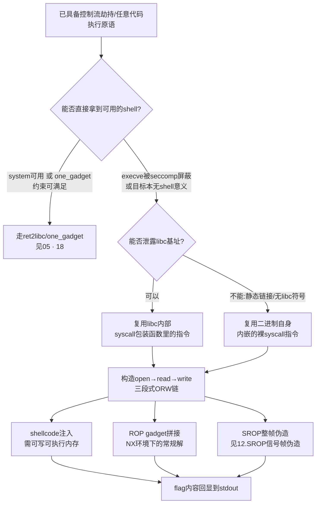
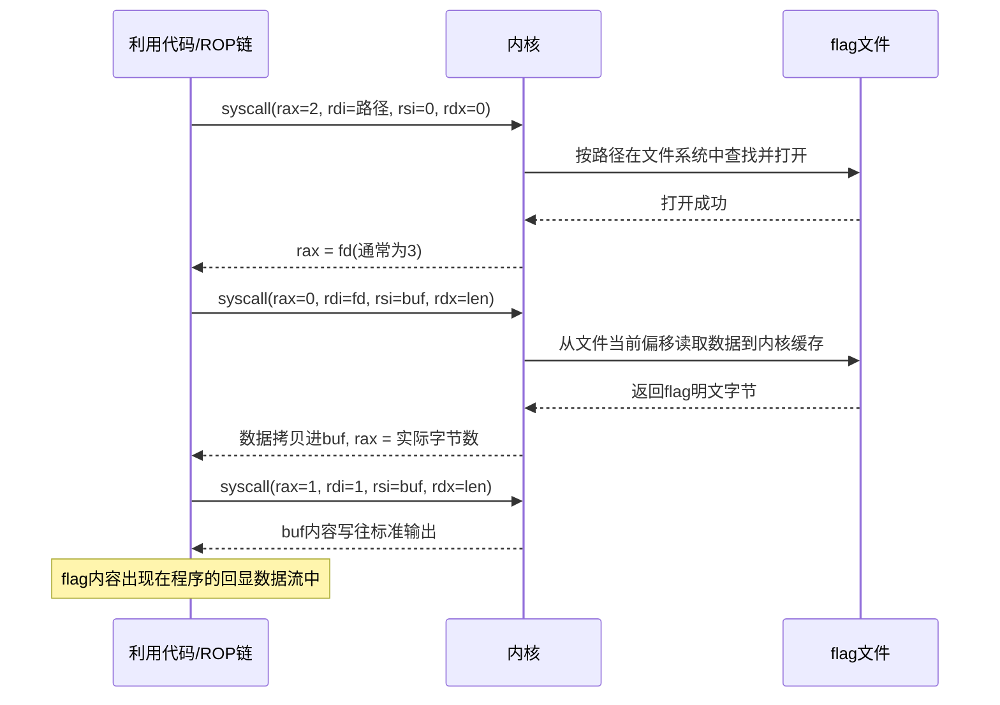
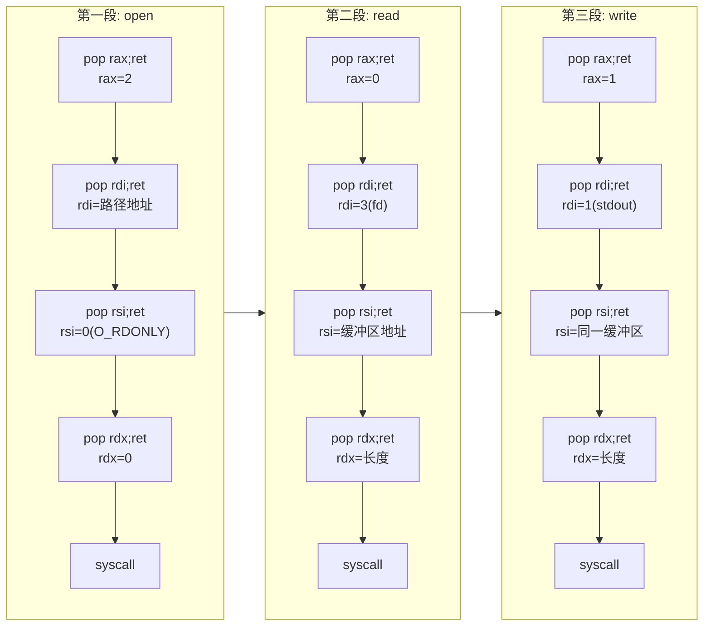

# 二进制漏洞与利用基础（19）· ORW与读取flag

> [!abstract] TL;DR
> - ORW（open-read-write）是把三个系统调用直接首尾相连拼成的最小化"取flag"payload，是"控制流已经劫持、但 `system()`/`execve` 不可用"这一具体约束下的标准终局手法——静态链接二进制没有 libc 基址可用、seccomp 专门屏蔽了 `execve`、目标环境压根没有 `/bin/sh` 的价值，都会把攻击者逼到这条路上。
> - 三个调用的语义链条是刚性的：`open` 拿文件描述符、`read` 把文件内容搬进可控内存、`write` 把内存内容送到能看见的地方（通常是标准输出）；x86-64 下三次 `syscall` 分别对应 `rax=2/0/1`，参数寄存器沿用 [[04.返回导向：ret2text与ret2syscall]] 确立的 `rdi/rsi/rdx/r10/r8/r9` 这套系统调用 ABI，而不是普通函数调用约定。
> - 构造这条链有三种可以互相替代的哲学：shellcode 注入（需要可写可执行内存）、纯 ROP gadget 拼接（NX 环境下的常规解，gadget 不全时可结合 [[07.ROP进阶：ret2csu与通用gadget]] 的通用 gadget）、以及 [[12.SROP信号帧伪造]] 式的整帧伪造（gadget 稀缺到极致时的兜底方案）——三者对 gadget 丰富度、可控内存大小的要求依次不同，没有绝对优劣，只有场景适配。
> - fd 具体是几号、flag 路径字符串从哪里来，是比"寄存器怎么摆"更容易翻车的实操细节：fd 通常假设为 3 但并非恒等式，路径字符串没有现成的就要先用一次 `read()` 把它"种"进可写内存，两者都要求对目标程序已有行为有基本认知，而不是死记模板。
> - `sendfile` 可以把 `read`+`write` 两次调用压成一次，但代价是引入了本系列第一次真正用到的第 4 个系统调用参数寄存器 `r10`——这正好兑现了 [[04.返回导向：ret2text与ret2syscall]] 结尾埋下的伏笔："参数更多的系统调用一定会用到 `r10` 而不是 `rcx`"。
> - ORW 不是 CTF 专属把戏：它是"进程创建类调用被沙箱/seccomp/无 shell 环境卡死之后，文件级读写依然是攻击者最后能拿到的原语"这一现实的缩影；对应防御必须落在路径级（Landlock/MAC）与权限最小化上，不能指望 seccomp 的参数过滤单独兜底——因为经典 seccomp-bpf 读不到指针参数指向的路径内容。

## 概述与定位

ORW 全称 open-read-write，字面意思就是把这三个系统调用按顺序拼在一起：先 `open` 打开目标文件拿到一个文件描述符，再 `read` 把文件内容读进一段自己能控制的内存，最后 `write` 把这段内存输出到自己能看到的地方——绝大多数情况下就是标准输出，于是 flag 的明文就这样直接打印在了交互式 shell 或者远程连接的回显里。它不是什么高深的新原语，本质上是 [[04.返回导向：ret2text与ret2syscall]] 里 ret2syscall 思路的直接平移：ret2syscall 拼一次 `execve` 的寄存器状态换一个 shell，ORW 拼三次（open/read/write）寄存器状态换一次文件内容的搬运。理解了 ret2syscall 的"把系统调用当函数调用手工拼参数"这件事，ORW 在机制上就没有任何新东西——真正值得单独成篇的，是"什么时候必须用它""三次调用怎么首尾相接不出错""字符串和文件描述符这些容易被忽视的细节怎么处理"这些工程性问题。

先把"为什么需要它"讲清楚。前面十几章铺陈的利用链，无论是 [[05.ret2libc]] 里复用 `system("/bin/sh")`，还是 [[18.one_gadget与magic_gadget]] 里找一发满足约束就能弹 shell 的魔法地址，终点都默认了两个前提：一是目标进程里存在一个能执行任意命令的入口（`system`/`execve`/`execl` 之一），二是执行这个入口不会被拦下来。这两个前提在很多现代场景里都不成立：程序可能是静态链接甚至完全不带 libc 符号的（Go/Rust 产物、`musl` 编译的精简二进制），没有 `system` 可用；程序可能启用了 seccomp（下一章 [[20.seccomp沙箱与逃逸]] 专门展开），把 `execve`/`fork`/`clone` 一类"进程创建"相关的调用直接列入黑名单，哪怕你把 `execve` 需要的寄存器摆得分毫不差，内核在真正执行前的过滤逻辑也会直接杀掉进程；题目设计本身可能就没有交互式 shell 的意义——flag 只是一个静态文件，题目原意就是"读出来打印"而不是"拿到 shell 再自己 `cat`"。这几种情形共同指向同一个结论：**当"制造一个新进程/新程序去执行任意命令"这条路走不通时，攻击者手里剩下的、几乎不可能被完全禁止的原语，就是文件级别的读和写**——因为哪怕是最克制的沙箱策略，也很难不允许目标程序读写它自己需要的配置文件、日志文件、临时文件，`open`/`read`/`write` 这三个调用的通用性使它们几乎必然出现在放行名单里，ORW 正是精确利用了这个"必要但难以彻底堵死"的缝隙。

### 本篇边界与前置知识

为避免与相邻章节重复，这里先划清边界。系统调用的基础 ABI（哪个寄存器放调用号、哪个放参数、`syscall` 指令本身如何陷入内核）已经在 [[04.返回导向：ret2text与ret2syscall]] 讲透，本篇只在涉及具体调用号时简要复用，不重新推导；如何搜集 gadget、如何用 `pop reg;ret` 拼寄存器属于 [[06.ROP入门]] 与 [[07.ROP进阶：ret2csu与通用gadget]] 的范畴；可控栈空间不够摆下整条链时如何搬家，见 [[08.栈迁移与stack pivot]]；用伪造 `sigcontext` 一次性摆好全部寄存器的 SROP 链式构造细节，已经在 [[12.SROP信号帧伪造]] 里给出完整的三帧示例代码，本篇不重复展开该结构体布局，只在对比小节里从"何时选它"的角度带过；seccomp 的规则语法、BPF 过滤器怎么写、怎么逃逸，是下一章 [[20.seccomp沙箱与逃逸]] 的主题，本篇把"execve 已经被禁"当作既成前提来处理；ARM64/MIPS 下系统调用号、寄存器命名的具体差异，留给 [[21.ARM64与MIPS架构利用差异]]，本篇除非另有说明均以 x86-64 Linux 为默认场景。本篇要穷尽的，是 ORW 这一具体载荷从"决定要不要用它"到"三条调用首尾相接不翻车"再到"字符串/描述符这些工程细节"的完整闭环。



这张图把 ORW 放在了整条利用链的"最后一公里"位置：它从不负责解决控制流劫持本身，也不负责绕过 Canary/ASLR 这些前置防护，它假设这些问题已经被前面的章节解决，只回答"控制流到手之后、`system`/`execve` 这条捷径走不通时，具体要往寄存器和内存里塞什么"这一个问题。

## 原理与机制

### Linux 文件 I/O 系统调用三剑客：open / read / write 的 ABI 语义

三个调用各自的寄存器摆位如下（x86-64，参数寄存器约定见 [[22.调用规约/06.SystemV_AMD64调用规约]] 与 [[04.返回导向：ret2text与ret2syscall]] 的系统调用专属版本）：

```text
open(const char *pathname, int flags, mode_t mode)
    rax = 2      系统调用号 SYS_open
    rdi = pathname 的地址（必须是以 \x00 结尾的C字符串）
    rsi = flags（只读用 O_RDONLY = 0 即可）
    rdx = mode（未使用 O_CREAT 时内核完全忽略这个值，填0最省心）
    返回：rax = 新分配的文件描述符（失败为负的 errno，如 -2 表示ENOENT文件不存在）

read(int fd, void *buf, size_t count)
    rax = 0      系统调用号 SYS_read
    rdi = fd（open 的返回值，实战中常直接假设为3）
    rsi = buf 的地址（必须指向可写内存，不需要可执行）
    rdx = count（期望读取的字节数，flag通常几十到上百字节，给0x100~0x200很宽裕）
    返回：rax = 实际读取的字节数（可能小于count，如遇到文件尾）

write(int fd, const void *buf, size_t count)
    rax = 1      系统调用号 SYS_write
    rdi = fd（通常填1，即标准输出，能被解题者直接看到回显）
    rsi = buf 的地址（与 read 写入的地址一致，或另一段已知内存）
    rdx = count（通常填与 read 相同或略大的长度）
    返回：rax = 实际写出的字节数
```

这份表面上朴素的对照表里，有两处细节值得专门展开。其一，`mode` 参数在只读打开场景下是彻头彻尾的"哑参数"——内核只有在 `flags` 里显式带了 `O_CREAT` 时才会去读这个字段决定新文件的权限位，读一个已经存在的 flag 文件完全用不上它，填 0 或者随便什么垃圾值都不影响结果，这也是为什么几乎所有公开的 ORW payload 里这个位置都懒得讲究。其二，`read`/`write` 的返回值语义上都允许"小于请求量"——对管道、socket、终端设备这类字节流对象，一次系统调用不保证吃满你要求的全部字节数是常见行为；但对普通磁盘文件（flag 文件几乎总是普通文件），Linux 的实现通常会在没有遇到文件尾或者信号打断的情况下一次性满足请求，所以 CTF 场景下"申请 0x100 字节、就认为拿到了 0x100 字节"这种不严谨但简单的写法，在实战里几乎从不出问题——写健壮的通用代码需要循环重试直到 `read` 返回 0 或负数为止，但对着一个体积已知、远小于请求长度的 flag 文件，这份健壮性通常是不必要的开销。

### 为什么恰好是这三个调用首尾相连

这条链没有办法再精简：`read` 依赖一个合法的文件描述符才能工作，而这个描述符只能来自前面一次成功的 `open`；`write` 要把"文件里到底写了什么"发出去，就必须先有一次 `read` 把这些字节从内核的文件缓存搬进进程自己的地址空间——系统调用之间不存在"直接把这份数据转给另一个调用"的捷径，所有跨调用的数据传递都得落地到一段用户态内存上做中转。理解了这一点，就理解了 ORW 三个字母的顺序本身就是数据流向的直接体现，不是随意的命名习惯。稍后会讲到，`sendfile` 这个系统调用把"从一个 fd 读、往另一个 fd 写"这个动作封装成了单次调用，某种意义上是内核直接承认了"read 完立刻 write 到别处"是一种足够常见的模式、值得专门开一个快捷通道——但即便如此，`sendfile` 的前提依然是先有一个来自 `open` 的合法 fd，三段式的骨架并没有被真正打破，只是中间两步被合并了。

### 两种执行哲学的分野：代码注入与代码复用在 ORW 上的对照

和前面章节反复强调的分野完全一致，ORW 的落地手段可以清晰地分成"往内存里塞会被执行的新字节"和"只移动控制流、复用早已存在的代码"两大阵营。前者是手写一段包含 `syscall` 指令的 shellcode，通过溢出或者其它写入原语塞进一块可写又可执行的内存（配合 [[03.shellcode编写与ret2shellcode]] 的编码技巧，或者先用 ret2syscall 调一次 `mprotect` 把某块内存临时改成可执行，这个变体常被称为 ret2mprotect），再让控制流跳过去；后者完全不写入任何新代码，只是把已经躺在二进制或者 libc 里的、原本用来实现 `open`/`read`/`write` 库函数的机器码片段（其中必然包含裸的 `syscall` 指令，这是任何用户态代码触达内核服务唯一的合法途径）当成一个个 gadget 摆弄。二者的选择标准和 ret2shellcode 与 ret2text/ret2syscall 之间的选择标准完全一致——取决于目标是否开启了 NX、攻击者是否已经有能力先绕开 NX（比如先用一次 `mprotect` 调用）。多数现代 CTF 题目默认 NX 开启，因此纯 ROP 或者 SROP 构造的 ORW 链是更常见的形态；早期或者刻意关闭 NX 的教学关卡，直接把 ORW shellcode 当普通 ret2shellcode 打反而更省事。



### 越过 libc：为什么不干脆调用 fopen/fread

一个自然会被问到的问题是：既然目标程序往往链接了 libc，为什么不直接伪造调用 `fopen`/`fread`/`fwrite` 这类更"高层"的库函数，而非要下沉到裸系统调用？答案在于 `FILE*` 这套流缓冲机制本身依赖一整套运行时基础设施：它需要在堆上分配 `_IO_FILE` 结构体、初始化 vtable 指针、维护内部缓冲区状态——这既多绕了一层间接（`_IO_FILE` 的 vtable 劫持本身是 [[17.IO_FILE结构利用与FSOP]] 的独立主题，构造伪造的 `FILE*` 结构体远比摆几个整数寄存器复杂得多），也隐含了"libc 这层抽象必须完好可用"这个额外前提。而本章讨论的前提恰恰是"`system` 不可用"所代表的更广泛处境——可能压根没有 libc 符号可用，也可能虽然有 libc 但担心触碰堆分配/vtable 分派引入新的不确定性。裸系统调用是操作系统提供给用户态代码的最底层接口，不依赖任何运行时初始化状态，也不需要知道任何 libc 内部数据结构的布局，这正是 ORW 选择直接下沉到 `syscall` 指令这一层的根本原因：越过所有可能出问题的中间层，直接和内核对话。

## ORW调用链构造与gadget选型详解

### 三段寄存器摆位逐条推导

把前面的语义表落到实际的 ROP 链上，理想情况下（假设 `pop rax;ret`、`pop rdi;ret`、`pop rsi;ret`、`pop rdx;ret`、裸 `syscall` 这五类 gadget 全部具备）三段调用可以画成一条线性的 gadget 序列：



这是"教科书理想情形"：15 个 gadget 地址加常量，一段接一段摆满栈即可。现实中最常见的落差是并非每个寄存器都能找到独立的 `pop reg;ret`——尤其 `rdx` 相关的 gadget 在很多精简过的二进制里比 `rdi`/`rsi` 更稀缺。此时的应对思路和 [[07.ROP进阶：ret2csu与通用gadget]] 讲的完全一致：退而求其次去找"一次性弹出多个寄存器"的复合 gadget（比如 `pop rsi;pop r15;ret` 这种编译器为了寄存器分配方便而生成的"搭车"组合，多弹出的 `r15` 填个无害值即可），或者干脆借用 `__libc_csu_init` 里那段专门为了间接调用而把 `rdx`/`rsi`/`edi` 一次摆齐的通用 gadget；如果连这条路都走不通，[[12.SROP信号帧伪造]] 里讲的整帧伪造是终极保底方案——用一次 `rt_sigreturn` 把十几个寄存器（自然包含 `rax`/`rdi`/`rsi`/`rdx`）一次性摆好，只需要一条能触达的 `syscall` 指令作为触发点，完全不依赖专门的 `pop` gadget 组合，该章节已经给出了针对 open→read→write 链式伪造三顶帧的完整代码模式，本篇不再重复。

### fd 的不确定性与应对策略

`open` 成功后返回的文件描述符具体是几号，很多教学材料里直接写死 3，但这背后有一个经常被略过的前提：**内核分配 fd 时永远选择当前进程里最小的、尚未被占用的非负整数**。一个刚启动、只做了标准的 `stdin(0)`/`stdout(1)`/`stderr(2)` 初始化、没有额外打开过其它文件的进程，下一次 `open` 拿到 3 是几乎确定的事；但如果目标程序在到达可利用点之前，自己的正常逻辑里已经打开过配置文件、日志文件、或者建立过 socket 连接，fd 3 很可能早被占用，真正可用的号码会往后顺延。严谨的做法是结合对目标程序启动流程的静态分析（`strace ./chal` 本地跑一遍，观察它自己主动 `open`/`socket` 了几次）来确定这个数字，而不是无脑套用 3。

如果实在无法确定，实战中有两条务实的路：一是找一个能把 `rax`（`open` 的返回值）搬进 `rdi`（`read` 的第一个参数）的 gadget（形如 `mov edi, eax; ...; ret`，或者更少见的 `xchg eax, edi; ret`），代价是这类"跨寄存器搬运"gadget 出现频率明显低于单纯的 `pop`，不一定找得到；二是承认猜错的代价很低——用一个错误的 fd 去 `read` 只会让该次系统调用返回一个负的 `errno`（比如 `-EBADF`），既不会让程序崩溃，也不会产生任何副作用，于是可以在同一份 payload 里"陪跑"多组假设不同 fd（3、4、5……）的 read+write 三连，蒙对的那一组自然会把 flag 内容打印出来，蒙错的几组只是安静地失败——这种"以量取胜"的策略在 gadget 预算充足、连接成本不高的场景里往往比精确推算更省心。

### flag 路径字符串从哪里来

`open` 的第一个参数要求是一段已经存在于内存中、以 `\x00` 结尾的路径字符串地址，这段数据从哪来是构造 payload 时第二个容易被忽视的环节，通常有三种来源，按可靠性从高到低：

- **二进制自带**：如果程序源码里本来就出现过对 flag 文件的引用（哪怕只是被过滤/替换掉的正常业务逻辑），这段字符串大概率原样躺在 `.rodata` 里，用 `ROPgadget --string 'flag'` 或者 pwntools 的 `elf.search(b'flag')` 就能直接定位到现成地址，是最省事的情形。
- **约定俗成的默认路径**：很多题目即便没有在二进制里留下字符串，也会遵循平台/赛题约定的默认路径（如 `/flag`、`./flag`），这类路径本身很短，即便二进制里没有现成的，自己拼出来的成本也很低。
- **运行时写入**：如果路径既不在二进制里、也不确定默认路径，就需要先用一次能控制目标地址的写入原语（最常见的是构造一次 `read(0, target_addr, len)`，从标准输入把攻击者自己发送的路径字符串写进一块已知可写内存，比如 `.bss` 某处）把它"种"进内存，再让后续 `open` 的 `rdi` 指向这个地址。这本质上是一次两阶段利用：第一阶段准备数据，第二阶段才是真正的 ORW 三连。

三种来源里，第三种最通用但也最占用 gadget/payload 预算，实战中优先检查前两种是否可行，逼不得已才上运行时写入。摆放这两块数据时也要注意彼此不要打架——路径字符串和 `read` 的输出缓冲区应该落在不同的地址，否则读回来的 flag 内容会覆盖掉还没被 `open` 使用的路径字符串（如果两次操作发生顺序不对的话），一份典型的 `.bss` 布局如下：

```text
.bss（可写、不需要可执行）：
  bss_base + 0x000 : "flag\x00"                 <- 第一阶段read()写入的路径字符串
  bss_base + 0x100 : [ 用于承载flag内容的缓冲区 ]  <- 与路径字符串隔开，避免相互踩踏
```

### 三种构造哲学的横向对比：shellcode / ROP / SROP

把前文分散讨论的三条路线放在一张表里对比，能更直观地看出各自的适用边界：

| 维度 | shellcode 注入 | 纯 ROP gadget 拼接 | SROP 整帧伪造 |
|---|---|---|---|
| 前提条件 | 需要一块可写可执行内存（或先用 ret2syscall/ROP 调 `mprotect` 开权限） | 需要凑齐 `pop`/`syscall` 系列 gadget，NX 环境下的常规解 | 只需要一条可触达的 `syscall`（或 vDSO 蹦床），几乎与二进制自身 gadget 丰富度无关 |
| 对 gadget 丰富度的要求 | 几乎为零（只要能让控制流跳过去执行这段代码即可） | 较高，静态链接二进制/大体积 libc 最友好 | 极低，是 gadget 稀缺时的标准兜底方案 |
| payload 体积 | 小（几十字节的手写指令） | 中等（每个寄存器一组 `pop`，15 个左右 gadget 地址） | 较大（每顶伪造帧几百字节，三段链需要三顶帧首尾相连） |
| 对可控内存大小的要求 | 需要连续的可写可执行区域 | 较低 | 较高，通常要求配合 [[08.栈迁移与stack pivot]] 把栈迁移到容量充足的区域 |
| 典型适用场景 | NX 关闭/已获得执行权限的教学关卡 | NX 开启、gadget 相对充足的常规题目 | gadget 稀缺、静态裁剪严重、或需要一次搞定多个寄存器的题目 |

这张表最重要的结论是：三条路线不是互相排斥的竞争关系，而是同一个问题在不同资源约束下的最优解——资源（可执行内存、gadget 数量、可控内存大小）越紧张，就越应该往表格右侧走。

### 静态链接二进制：ORW gadget 的天然富矿

和 [[04.返回导向：ret2text与ret2syscall]] 里讨论 ret2syscall 时的结论完全一致：一旦目标是静态链接的（CTF 教学关卡里非常偏爱这么做），整个 libc（或者 `musl`/`dietlibc` 这类精简实现）都会被打包进同一个 ELF 文件，`open`/`read`/`write`/`close` 这些库函数自身的实现内部，必然包含一条真正陷入内核的裸 `syscall` 指令——这是无法被优化掉的，因为它就是这些函数存在的意义。静态链接把这些原本分散在共享库里的指令全部纳入了同一个、地址固定（非 PIE 时）的地址空间，`ROPgadget --binary ./chal | grep syscall` 几乎总能在这类二进制里挖出好几处可用的 `syscall`/`syscall;ret`，`pop` 系列 gadget 的绝对数量也随代码总量膨胀而大幅增加。这里有一个值得单独提醒的横向差异：`musl` 编译的静态二进制虽然同样自带 `syscall` 指令，但整体代码量远小于 glibc 静态链接产物（`musl` 以精简著称），gadget 的绝对数量相应少得多，是比 glibc 静态二进制更"抠门"的 ORW 战场，构造 payload 时如果发现常规 `pop` 组合怎么也凑不齐，先确认一下目标到底链接的是哪个 libc 实现，往往能解释"为什么这题的 gadget 比想象中少"。

### sendfile 化简与 r10 参数的回归

`sendfile(int out_fd, int in_fd, off_t *offset, size_t count)` 是内核专门为"从一个 fd 读、直接写到另一个 fd"这种模式提供的快捷通道，系统调用号在 x86-64 上是 40。用它替换 `read`+`write` 两步，可以把 ORW 压缩成 `open`+`sendfile` 两次调用，省下整整五个 gadget 槽位：

```python
pop_r10 = rop.find_gadget(['pop r10', 'ret'])   # 第4个参数走r10,不是rcx
payload += flat(
    pop_rax.address, 40,       # SYS_sendfile
    pop_rdi.address, 1,        # out_fd = stdout
    pop_rsi.address, 3,        # in_fd = open()得到的fd
    pop_rdx.address, 0,        # offset=NULL,直接使用in_fd自身的文件偏移
    pop_r10.address, 0x100,    # count
    syscall_ret.address,
)
```

这里有一处值得专门点出的呼应：`sendfile` 是本篇第一个真正用满 4 个参数的系统调用，而它的第 4 个参数按照 [[04.返回导向：ret2text与ret2syscall]] 确立的规则，必须摆在 `r10` 而不是普通函数调用约定里的 `rcx`——那一篇当时留了一句"读到后面章节里参数更多的系统调用时一定会用到"，`sendfile` 正是这个伏笔第一次被兑现的地方。但便利是有代价的：`pop r10;ret` 在实际二进制里的出现频率明显低于 `pop rdi`/`pop rsi`/`pop rdx`——编译器为局部变量分配寄存器时较少选中 `r10`，这是一个调用者保存的临时寄存器，函数序言/尾声里刻意去 `pop` 它的场景本就不多。于是 `sendfile` 变体在实战中呈现出一个有趣的权衡：省下了一次完整的调用（连带省下四个 `pop`），却换来了一个更难找的 gadget 需求，是否划算取决于具体二进制里 `pop r10;ret` 到底存不存在，不能一概而论地说它总是更优解。

### 空间不足时的两段式 ORW：与栈迁移组合

一条完整的 ORW ROP 链（15 个 gadget 地址加上必要的常量，每项 8 字节，粗算下来轻松超过 120 字节，再加上路径字符串本身）经常会超出溢出点本身允许覆盖的空间——尤其当溢出点只是一个小型的固定长度栈缓冲区时。这正是 [[08.栈迁移与stack pivot]] 要解决的问题：先用一次小体积的迁移触发（例如常见的 `leave;ret`），把 `rsp` 转移到一块容量充足、攻击者能够提前布置好完整 ORW 链的内存（典型选择是 `.bss`），后续的三段调用就在迁移后的新栈上正常展开，不再受原始溢出点大小的限制。这也是为什么很多 ORW 相关的实战题目会和栈迁移成对出现——空间不够用是构造这条相对较长的调用链时最常见的物理约束，而不是逻辑上的难点。

### 常见踩坑清单

- **读写缓冲区与尚未执行的 ROP 链重叠**：如果 `read` 的目标缓冲区选在了栈上、恰好与后续还没执行到的 gadget 地址重叠，flag 内容一旦被写入就会直接覆盖掉链条自身，导致 `write` 还没来得及执行进程就已经跳进了被污染的数据、随即崩溃。稳妥的做法是始终把缓冲区选在 `.bss` 或者迁移后的新栈区域里明确与链条本身分开的位置，而不是"随便找一块看起来空着的栈空间"。
- **地址未映射或权限不符**：如果传给 `read`/`write` 的缓冲区地址根本没有被映射，或者只有可读没有可写权限，系统调用会返回负的 `errno`（如 `-EFAULT`）而不是崩溃——这也是调试时"payload 静默失败、程序看似正常退出"的常见原因之一，需要专门核对缓冲区地址的可写性。
- **路径字符串没有正确以 `\x00` 结尾**：如果第一阶段写入路径字符串时的长度计算有误，或者复用了一块之前存有残留数据的内存，`open` 可能会把无关的后续字节当成路径的一部分，导致 `ENOENT`（文件不存在）。
- **`syscall` 触发点选错**：裸 `syscall` 指令后面如果紧跟的不是一条 `ret`（而是别的、会打乱后续控制流的指令），链条会在第一次系统调用后就跑飞，需要用 `objdump`/`ROPgadget` 确认选中的 `syscall` 地址后面确实是可控的 `ret` 或者已知语义的下一条指令。
- **忽视 `close`**：几乎所有公开的 ORW payload 都不会在末尾专门调用 `close(fd)`——这不是遗漏，而是刻意的取舍：flag 内容一旦被 `write` 送到了标准输出，目的已经达成，进程接下来是崩溃、挂起还是正常退出都不再重要，花一次调用去"善后"资源泄漏，在这个场景下是纯粹的浪费。这个细节从侧面说明 ORW 追求的是"结果达成"而不是"程序继续健康运行"，与正常软件工程里"资源必须成对释放"的教条形成有意思的反差。

## 工具视角与实战

### pwntools shellcraft：一行生成 ORW shellcode

如果目标场景允许走 shellcode 注入路线（NX 关闭，或已经先用别的手段拿到可执行权限），pwntools 的 `shellcraft` 模块内建了几乎与 ORW 语义完全对应的模板，不需要手写任何汇编：

```python
from pwn import *

context.arch = 'amd64'
context.os = 'linux'

orw_asm = shellcraft.open('/flag', 0, 0)
orw_asm += shellcraft.read('rax', 'rsp', 0x100)   # 复用open返回的fd
orw_asm += shellcraft.write(1, 'rsp', 0x100)
orw_shellcode = asm(orw_asm)

# 更省事的等价写法:shellcraft.cat 直接封装了"打开-读-写到指定fd"这一整套模板
orw_shellcode2 = asm(shellcraft.cat('/flag'))
```

`shellcraft.cat(filename, fd=1)` 值得单独一提：它把 open/read/write 的组合直接封装成了一个模板，语义就是"把 `filename` 的内容原样搬到 `fd`"，几乎是 ORW 概念在工具层面的直接映射，也从侧面印证了这套三段式模式在实战中足够常见、常见到值得内建一个专门的生成器。

### 手工 ROP 链组装

不允许注入代码的常规场景下，手工用 `ROP` 类拼接是最直接的做法，延续 [[04.返回导向：ret2text与ret2syscall]] 里给出的 gadget 检索方式：

```python
from pwn import *

elf = context.binary = ELF('./chal')
rop = ROP(elf)

pop_rax = rop.find_gadget(['pop rax', 'ret'])
pop_rdi = rop.find_gadget(['pop rdi', 'ret'])
pop_rsi = rop.find_gadget(['pop rsi', 'ret'])
pop_rdx = rop.find_gadget(['pop rdx', 'ret'])
syscall_ret = rop.find_gadget(['syscall'])

bss = elf.bss(0x400)
flag_path = bss            # 假定已通过前置阶段写入 "flag\x00"
buf_addr  = bss + 0x100

payload  = b'A' * offset
payload += flat(
    pop_rax.address, 2,  pop_rdi.address, flag_path,
    pop_rsi.address, 0,  pop_rdx.address, 0,  syscall_ret.address,   # open
    pop_rax.address, 0,  pop_rdi.address, 3,
    pop_rsi.address, buf_addr, pop_rdx.address, 0x100, syscall_ret.address,  # read
    pop_rax.address, 1,  pop_rdi.address, 1,
    pop_rsi.address, buf_addr, pop_rdx.address, 0x100, syscall_ret.address,  # write
)
```

较新版本的 pwntools 还在 `ROP` 类上提供了更高层的 `rop.syscall(...)` 一类封装，能自动完成 gadget 查找与参数排布，理解了上面这份手工版本背后的寄存器语义之后，再用自动化接口出错时才知道该往哪个方向排查。

### seccomp-tools 预检：决定要不要走这条路

在真正投入精力构造 ORW 链之前，第一步应该是确认 `execve` 到底是不是真的不可用，以及 `open`/`read`/`write` 本身是否在放行名单里：

```bash
seccomp-tools dump ./chal
```

这条命令会把目标进程注册的 BPF 过滤规则反汇编成可读形式。如果输出里 `execve` 被显式 `KILL`/`ERRNO`，而 `open`/`openat`/`read`/`write` 都在允许名单内，就确认了本章技术路线的必要性；如果连 `open` 都被禁止（更严苛的沙箱设计里并不少见），说明程序可能已经在启动时预先打开了 flag 文件，此时的策略要退化为"跳过 open 阶段、直接猜测一个已经打开的 fd 去 read+write"，这属于下一章 [[20.seccomp沙箱与逃逸]] 要展开的更极端情形，本篇只作提示。

### gdb/pwndbg 与 strace 调试核查

本地调试永远优先于对着远程盲打。在触发第一次 `syscall` 指令的地址下断点，单步走过每一段 `pop`，用 `info registers`/`context` 核对 `rax`/`rdi`/`rsi`/`rdx` 在陷入内核前是否正好是预期值；`strace ./chal` 可以直接看到实际发生的系统调用序列与返回值，`open` 是否成功、`read`/`write` 实际传输了多少字节，一目了然，比事后靠程序输出反推可靠得多。确认本地能稳定打印出 flag 之后，再把同一份 payload 投给远程目标——这个"先预演、再实战"的习惯在本系列里反复出现，链条越长，调试环节的价值就越大。

## 安全性与正确使用

> [!caution] 使用边界
> 本文所述 ORW 原理与代码骨架仅用于自有环境、经授权的安全研究以及 CTF/pwn 靶场的教学与练习。文中出现的路径、地址、偏移均为示意性占位符，不构成针对任何真实生产系统或他人资产的可用攻击载荷。将本文所述技术用于未经授权的目标属于违法行为；本章始终站在防御与教育视角讨论该技术的原理、检测与缓解方式，不提供、也不应被用于对真实目标的武器化攻击配方。

理解 ORW 面对的防御手段，关键是先纠正一个常见的误解：**seccomp 对 `open` 参数的过滤能力比直觉想象的要弱得多**。经典 seccomp-bpf 过滤器只能读取系统调用号本身以及各参数寄存器里的原始数值，对于指针类型的参数（比如 `open` 的 `pathname`），BPF 程序看到的只是一个内存地址，没有能力跟着这个地址去解引用、读取指针指向的字符串内容——也就是说，"只允许 `open` 打开 `/tmp/` 目录下的文件、禁止打开 `/flag`"这类基于路径内容的过滤规则，用经典 seccomp-bpf 是写不出来的，它至多能按 `flags` 参数的数值做粗粒度限制（比如禁止携带 `O_WRONLY`/`O_RDWR` 以防止任意文件写，但挡不住任意文件读）。这个局限直接决定了针对 ORW 更完整的防御必须叠加别的机制：

- **seccomp 用户态通知（`SECCOMP_RET_USER_NOTIF`）**：较新内核提供的机制，把决策权转交给一个监督进程，该进程可以通过 `/proc/pid/mem`、`pidfd_getfd` 等接口真正读出目标进程即将访问的路径内容再做放行/拒绝决定——弥补了经典 BPF 读不懂指针内容的短板，但实现复杂度显著更高。
- **Landlock LSM**：Linux 5.13 引入的非特权路径级沙箱，专门用来补上"seccomp 管得了调用号、管不了路径"这个缺口，允许进程在启动时就声明"只能访问这些目录层级"，从文件系统语义而非系统调用参数语义上收紧访问面，是目前对付 ORW 类文件读取最贴合问题本质的机制。
- **AppArmor / SELinux 强制访问控制**：基于路径或标签的传统 MAC 方案，同样能在 `open` 真正执行前，从文件系统这一层挡住越权访问，与 seccomp 属于互补而非替代关系（[[34.现代二进制防护机制/00.现代二进制防护机制总览]] 对多层防护的正交关系有系统梳理）。
- **最小权限原则**：不依赖任何运行时过滤的最根本防御——运行目标进程的用户本身就不具备读取 flag 文件的文件系统权限，是唯一一种即便攻击者拿到完整的任意系统调用能力也无法绕过的防线，这也是生产环境里比任何 seccomp 规则都更该优先落实的一层。
- **命名空间/容器隔离**：把 flag 文件干脆放在目标进程所在挂载命名空间根本看不到的地方（`chroot`、独立 `mount namespace`），使得即便 `open`/`read`/`write` 全部放行，目标路径也压根不存在于这个进程的可见文件系统视图里。

从更宏观的视角看，ORW 之所以值得被当作一个独立的"利用范式"而非单纯的 CTF 技巧来理解，是因为它精确对应了真实世界里被 seccomp/沙箱大量使用的浏览器渲染进程、无服务器函数运行时、容器化服务这些场景下"进程创建类调用普遍被禁、文件读写类调用出于业务需要难以完全禁止"的现实处境——蓝队设计防护策略时，应当默认假设一旦攻击者拿到代码执行能力，`open`/`read`/`write` 大概率仍然可用，真正该守住的防线是文件系统权限与路径级访问控制，而不是寄望于系统调用过滤这一层单独兜底。

## 小结

ORW 是 ret2syscall 思路在"没有 shell 可拿、也没有 `system` 可用"这一具体处境下的自然延伸：把原本用来拼一次 `execve` 的技法，原样套用在 `open`→`read`→`write` 这三个几乎不可能被完全禁止的调用上，最终目的从"拿到一个交互式 shell"收缩为"把一个文件的内容送到攻击者能看见的地方"。三段调用的寄存器语义是刚性且可以逐条推导的，真正决定一次实战成败的往往不是这份语义表本身，而是三个容易被忽视的工程细节：gadget 是否齐全（不齐全时退回 ret2csu 或 SROP）、文件描述符具体是几号、路径字符串从哪里落地。`sendfile` 这类合并调用提醒我们内核本身也在为常见模式提供捷径，但捷径往往伴随着新的 gadget 门槛（`r10` 的回归）。往前看，ORW 的必要性通常直接源自 seccomp 对 `execve` 类调用的屏蔽——下一章 [[20.seccomp沙箱与逃逸]] 会正面展开这层过滤机制本身是如何工作的、规则可以写到多细，以及当 seccomp 收得比"只禁 execve"更紧（比如连 `open` 都不放行）时，攻击者还能剩下什么样的博弈空间，这正是本章"假设 execve 已被禁用"这一前提的直接来源，也是整条"进程创建被封锁后攻击者还能做什么"的故事线自然的下一步。

## 相关阅读

- [[00.二进制漏洞与利用基础总览|系列总览]]
- [[04.返回导向：ret2text与ret2syscall]] —— ORW 直接复用的系统调用寄存器 ABI 与 ret2syscall 构造思路
- [[05.ret2libc]] —— "system 可用时"的对照方案，理解 ORW 恰好是它不可用时的替代终局
- [[06.ROP入门]] / [[07.ROP进阶：ret2csu与通用gadget]] —— gadget 拼接基础与寄存器凑不齐时的通用手法
- [[08.栈迁移与stack pivot]] —— ORW 链体积超出可控空间时的搬家手段
- [[12.SROP信号帧伪造]] —— gadget 极度稀缺时的整帧伪造方案，含链式 ORW 的完整代码示例
- [[17.IO_FILE结构利用与FSOP]] —— 与直接走裸系统调用相对的另一条路：劫持libc流缓冲结构
- [[18.one_gadget与magic_gadget]] —— 仍有 libc 可用时更省事的一击成型方案，与 ORW 构成互补
- [[20.seccomp沙箱与逃逸]] —— execve 被屏蔽这一前提本身的成因与更深入的规则/逃逸讨论
- [[21.ARM64与MIPS架构利用差异]] —— 非 x86-64 架构下 openat 取代 open 等差异的完整展开
- [[22.利用开发工具链：pwntools与ROPgadget]] —— shellcraft、ROP 类等工具的系统介绍
- [[22.调用规约/06.SystemV_AMD64调用规约]] —— 系统调用参数寄存器与普通函数调用 ABI 的差异
- [[11.ELF文件详解/17.got节]] —— 静态/动态链接对 gadget 富集程度的影响背景知识
- [[34.现代二进制防护机制/00.现代二进制防护机制总览]] —— seccomp、Landlock、MAC 等多层防护的正交关系
- [[52.Linux内核机制与内核利用/00.Linux内核机制与内核利用总览]] —— 文件描述符表、VFS 等内核机制全貌
- 官方与工具资料（不提供外部链接，请自行检索）：`man 2 open`、`man 2 read`、`man 2 write`、`man 2 sendfile`、`man 2 syscall`；Linux 内核源码 `arch/x86/entry/syscalls/syscall_64.tbl`；pwntools 官方文档 `pwnlib.shellcraft`、`pwnlib.rop`；`seccomp-tools`、`ROPgadget`、`ropper` 项目文档

[[00.二进制漏洞与利用基础总览|⬆ 系列总览]] | [[18.one_gadget与magic_gadget|← 上一章]] | [[20.seccomp沙箱与逃逸|→ 下一章]]
