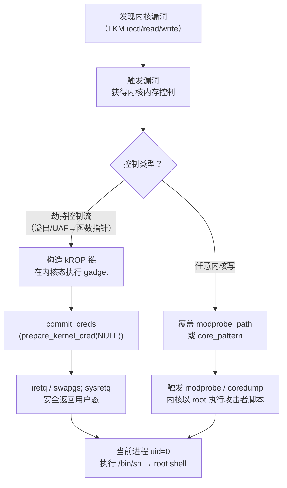

# 二进制漏洞与利用基础（20）· Linux 内核利用入门

> [!abstract] TL;DR
> - **内核态利用**与用户态利用共享同一物理地址空间但特权级完全不同：崩溃即全系统 panic，利用目标通常不是 shell 而是**权限提升（提权）**——让攻击者控制的进程以 root 身份运行。
> - 经典提权原语包括：`commit_creds(prepare_kernel_cred(NULL))` 直接覆写进程凭证结构；覆盖 `modprobe_path` 在内核触发 modprobe 时执行任意脚本；覆盖 `core_pattern` 在进程崩溃时执行任意命令。
> - 典型内核漏洞类型：栈/堆溢出、UAF（Use-After-Free）、double fetch 条件竞争（TOCTOU）。
> - 主要防护机制：SMEP（禁内核执行用户页）、SMAP（禁内核访问用户数据）、KPTI（页表隔离）、KASLR（基址随机化）、kCFI（内核控制流完整性）。
> - 经典利用路径 ret2usr 被 SMEP 封堵后，演化出 kROP、栈迁移到内核可控区域、`pt_regs` 伪造等绕过手法。
> - **本篇一切技术均仅在自建 qemu 虚拟机或 CTF 授权靶机中演示，防御/教学用途。**

---

## 概述与定位

在前面的篇章中，我们的利用对象始终是运行在用户态（Ring 3）的程序。用户态程序的崩溃顶多导致该进程死亡，不影响系统其他部分；利用成功后，我们通常以该进程权限执行命令。

**内核态利用（kernel exploitation）**，或俗称 **kernel pwn**，是对在 Ring 0 运行的 Linux 内核本身或内核模块（LKM）发起利用。它的特殊性体现在以下几个方面：

1. **崩溃即 kernel panic**：内核中一个空指针解引用、一个越界访问，会触发整个系统宕机（`Oops` 或 `BUG`，严重时 `panic`），无法只是"段错误然后重新运行"。
2. **与用户态共享地址空间（pre-KPTI）**：在 KPTI 出现之前，内核与用户态进程共享同一虚拟地址空间的高地址段，用户态内存和内核内存在同一个页表中。KPTI 之后两套页表独立，但利用时仍需理解这一历史背景。
3. **提权而非 getshell**：内核利用的典型目标不是执行 `/bin/sh`（你已经可以执行了），而是**把你的进程变成 root 进程**——修改内核中代表你进程权限的 `cred` 结构，将其 uid/gid 全部改为 0。
4. **内核模块是主要攻击面**：CTF 中的 kernel pwn 题目通常提供一个存在漏洞的内核模块（`.ko` 文件），通过 `/dev/xxx` 设备节点与内核交互，漏洞就在模块的 `ioctl`/`read`/`write` 实现中。

本篇是内核利用的**入门级导引**，目的是建立概念框架。我们将依次讲解：用户态与内核态的关键差异、典型内核漏洞类型、三种经典提权原语、主要防护机制与绕过思路，以及如何搭建 CTF kernel pwn 的 qemu 实验环境。

---

## 原理与机制

### 用户态与内核态的利用差异

理解差异，是入门内核利用的第一步。

**地址空间划分**

在 x86-64 Linux 中，虚拟地址空间按 bit 47 的符号位被分为两段：低 128TB（`0x0000000000000000`–`0x00007fffffffffff`）是用户态地址，高 128TB（`0xffff800000000000`–`0xffffffffffffffff`）是内核地址。内核代码、内核栈、内核堆（slab 分配器）都在高地址段。

**特权级与寄存器**

CPU 在执行 `syscall`/`int 0x80` 时从 Ring 3 切换到 Ring 0，保存用户态寄存器，切换到内核栈，执行系统调用处理函数。内核代码可以直接读写所有物理内存（通过 `copy_from_user`/`copy_to_user` 安全接口，或绕过安全接口直接访问用户指针——后者是很多漏洞的根源）。

**崩溃后果不同**

用户态程序崩溃 → `SIGSEGV` → 进程终止 → 不影响其他进程。
内核崩溃 → 无人捕获异常 → `kernel oops`（可能继续运行但状态污染）或 `kernel panic`（系统挂起，需重启）。

在 CTF 环境中，panic 后 qemu 重启，利用失败需要重跑。因此**稳定性**比用户态利用更关键。

**`cred` 结构：提权的核心目标**

Linux 内核用 `struct cred`（定义于 `include/linux/cred.h`）记录每个进程的权限信息：

```c
struct cred {
    atomic_t    usage;
    kuid_t      uid;    /* 真实 UID */
    kgid_t      gid;    /* 真实 GID */
    kuid_t      suid;   /* 保存的 UID */
    kgid_t      sgid;
    kuid_t      euid;   /* 有效 UID（权限检查用） */
    kgid_t      egid;
    kuid_t      fsuid;  /* 文件系统 UID */
    kgid_t      fsgid;
    /* ... capabilities, security hooks ... */
};
```

每个进程的 `task_struct` 通过 `cred` 指针指向其凭证结构。**提权的本质**是将当前进程的 `cred` 中的所有 uid/gid 字段改为 0（root）。

### 典型内核漏洞类型

**1. 栈溢出（Kernel Stack Overflow）**

内核函数的局部变量也在栈上。若内核代码向局部缓冲区写入超过其大小的数据，就发生内核栈溢出。与用户态栈溢出类似，可以覆盖返回地址，劫持内核控制流。

内核有 `CONFIG_STACKPROTECTOR`（相当于用户态 canary），但并非所有函数都被保护，且 canary 在内核中也可通过信息泄露绕过。

典型示例：设备驱动的 `ioctl` 处理函数中，`copy_from_user` 把用户提供的长度不加验证地用于 `memcpy` 到内核栈缓冲区。

**2. 堆溢出与 slab 相关漏洞**

Linux 内核使用 slab 分配器（`SLUB`/`SLAB`/`SLOB`）管理内核对象的内存分配，类似于用户态的 ptmalloc，但结构不同。

slab 按对象大小分类（kmem_cache），同一缓存中的多个对象紧邻存放。**slab 堆溢出**可以溢出到同缓存的下一个对象，覆盖其关键字段（如函数指针、`cred` 指针、`ops` 指针）。

slab 漏洞中的 UAF（见下）与用户态堆 UAF 原理相同，但利用手法因 slab 结构而有所不同。

**3. UAF（Use-After-Free）**

内核对象被 `kfree` 后，其内存返回 slab。如果代码仍保留指向该内存的指针并随后访问，就是 UAF。

利用手法：在对象被释放后，立即通过某个分配路径（如打开文件、创建 socket）分配一个新对象占据该内存区域，然后通过原悬垂指针操纵新对象的内容。

CTF 中常见的"堆喷（heap spray）"：大量分配特定大小的内核对象（如 `pipe_buffer`、`msg_msg`、`seq_operations`），使其占据被释放对象的 slab slot，从而控制敏感字段。

**4. double fetch（条件竞争 / TOCTOU）**

Double fetch 是内核特有的漏洞模式，属于 TOCTOU（Time-Of-Check-Time-Of-Use）条件竞争。

内核代码先从用户空间**读取**一个值做合法性检查（check），再**第二次读取**同一地址的值来使用（use）。攻击者用另一个线程在两次读取之间修改该内存，使内核使用了通过检查的"善意值"却实际处理了恶意值。

```
    内核线程 (check)          攻击者线程
         ↓
    读取 user_ptr→size        ↓
    检查 size ≤ MAX_SIZE    修改 *size 为超大值
         ↓
    读取 user_ptr→size（已被修改）
    使用恶意 size 执行 memcpy → 溢出
```

防御：一次 `copy_from_user` 将数据拷贝到内核栈局部变量，后续只使用局部变量，不再访问用户指针。

---

## 结构/算法/伪代码详解

### 提权原语一：`commit_creds(prepare_kernel_cred(NULL))`

这是 CTF kernel pwn 中最经典的提权一步操作，利用两个内核导出函数：

- `prepare_kernel_cred(task)`：创建一个新的 `cred` 结构。若参数为 `NULL`，返回一个 uid/gid 全为 0（root）的新 cred 对象。
- `commit_creds(cred)`：将当前进程（`current` 任务）的 `cred` 替换为传入的 cred，并更新相关安全模块状态。

在获得内核代码执行（例如通过 ROP 链在内核态跑 gadget）后，将这两个调用串起来：

```c
/* 伪代码，在内核态执行 */
commit_creds(prepare_kernel_cred(NULL));
/* 执行到此处时，当前进程的 euid/uid/gid 等全部变为 0 */
```

对应的 kROP 链（在内核 gadget 中调用）：

```
gadget: pop rdi; ret
值: 0 (NULL)
↓
prepare_kernel_cred 地址
↓
; rax 现在 = 指向新 root cred 的指针
gadget: mov rdi, rax; ret   (或 pop rdi; ret + mov rdi,rax)
↓
commit_creds 地址
↓
; 提权完成，返回用户态
```

两个函数的地址可从 `/proc/kallsyms` 读取（需要 `kptr_restrict=0` 或 root 权限），或通过内核符号泄露获取。CTF 靶机通常开放 `/proc/kallsyms`。

### 提权原语二：覆盖 `modprobe_path`

`modprobe_path` 是内核中的一个全局字符数组，存储 `modprobe` 可执行文件路径，默认值为 `/sbin/modprobe`。

当内核尝试加载未知的文件格式（即执行一个内核不认识 magic bytes 的文件时）或通过 `request_module` 动态加载模块时，内核会**以 root 权限调用** `call_usermodehelper` 执行 `modprobe_path` 所指程序。

利用步骤：

1. **获得内核任意写权限**（通常已通过漏洞控制内核内存）。
2. 将 `modprobe_path` 的内容改写为攻击者自定义脚本路径，例如 `/tmp/x`。
3. 创建 `/tmp/x`，内容为 shell 脚本，如：
   ```bash
   #!/bin/sh
   chmod +s /bin/sh
   ```
4. 执行一个内核不认识 magic 的二进制文件（例如构造一个特殊头部的文件 `/tmp/trigger`）来触发 `modprobe` 调用。
5. 内核以 root 权限执行 `/tmp/x`，`/bin/sh` 被设上 setuid bit，攻击者随后 `/bin/sh -p` 获得 root shell。

```
  /tmp/x（攻击者脚本）                  /tmp/trigger（未知magic文件）
         |                                      |
         |    执行 trigger                      |
         |←—— 内核调用 call_usermodehelper ——→|
         |    以 root 权限运行 /tmp/x           |
         ↓
  chmod +s /bin/sh
  ↓
  /bin/sh -p → root shell
```

**优点**：不需要精确的 ROP 链，只需能写内核任意地址（例如通过 UAF 覆写一个可写内核变量）。
**注意**：需要内核编译时启用了 `CONFIG_MODULES`（允许 modprobe），大多数发行版默认启用。

### 提权原语三：覆盖 `core_pattern`

`core_pattern` 是内核的另一个全局字符数组，控制进程 coredump 文件的命名规则。若值以 `|` 开头，内核会将其后的字符串当作程序路径，在进程崩溃时**以 root 权限执行该程序并将 core 内容通过管道传入**。

利用步骤：

1. 将 `core_pattern` 覆写为 `|/tmp/x`（`/tmp/x` 为攻击者脚本）。
2. 设置 `ulimit -c unlimited`（允许 coredump）。
3. 让任意进程崩溃（如执行 `kill -SIGSEGV $$`）。
4. 内核以 root 权限执行 `/tmp/x`。

与 `modprobe_path` 类似，这两种技术都是将"内核拥有的 root 权限通道"重定向到攻击者控制的脚本。

### 内核提权完整链路



### 从内核态安全返回用户态

执行完提权操作后，如果是通过劫持控制流进入内核 gadget 的，需要安全地返回用户态继续执行 shell。

**方式一：`swapgs; sysretq`**（推荐，速度快）

```asm
swapgs              ; 恢复用户态 GS 寄存器
sysretq             ; 返回用户态，从 rcx 恢复 rip，从 r11 恢复 rflags
```
需要提前在 gadget 中设置 rcx（用户态 rip）和 r11（rflags）。

**方式二：`iretq`**（更通用）

`iretq` 从栈上依次弹出：`rip`、`cs`、`rflags`、`rsp`、`ss`，回到用户态。需在内核栈上布置这五个值。

```python
# 返回用户态的伪代码（已保存的用户态上下文）
user_rip   = <后续在用户态执行的函数地址>
user_cs    = 0x33   # 用户态代码段
user_rflags = <利用前保存的 rflags>
user_rsp   = <利用前保存的 rsp>
user_ss    = 0x2b   # 用户态数据段

# 在利用开始时保存用户态上下文（在 C exploit 中）:
# unsigned long save_cs, save_rflags, save_rsp;
# __asm__ volatile (
#   "mov %%cs, %0\n"
#   "pushfq; pop %1\n"
#   "mov %%rsp, %2\n"
#   : "=r"(save_cs), "=r"(save_rflags), "=r"(save_rsp)
# );
```

---

## 工具视角与实战

### CTF kernel pwn 环境搭建：qemu + 自编内核 + initramfs

CTF 中的 kernel pwn 题目通常提供以下文件：

| 文件 | 说明 |
|------|------|
| `bzImage` | 压缩的 Linux 内核镜像 |
| `rootfs.cpio` / `initramfs.cpio.gz` | 根文件系统，包含 init 脚本和存在漏洞的 LKM |
| `vuln.ko` | 存在漏洞的内核模块 |
| `run.sh` | 启动 qemu 的脚本 |

**典型 `run.sh` 内容**：

```bash
#!/bin/bash
qemu-system-x86_64 \
    -kernel bzImage \
    -initrd rootfs.cpio.gz \
    -append "console=ttyS0 root=/dev/ram rw oops=panic panic=1 kaslr quiet" \
    -cpu kvm64,+smep,+smap \
    -m 256M \
    -nographic \
    -no-reboot \
    -snapshot \
    -monitor /dev/null \
    2>/dev/null
```

关键参数含义：

- `-cpu kvm64,+smep,+smap`：开启 SMEP/SMAP 防护（注意：去掉这两个 flag 即可关闭，便于调试）
- `kaslr`：开启内核 ASLR（内核基址随机化）
- `oops=panic panic=1`：任何 oops 直接 panic 并重启（不留 exploitable 的半死机状态）
- `-snapshot`：写入不持久化，每次重启干净环境

**提取和修改 initramfs**：

```bash
# 解压 initramfs 以检查 init 脚本和模块
mkdir rootfs && cd rootfs
cpio -idmv < ../rootfs.cpio.gz
# 查看 init 文件：模块如何加载，权限如何配置

# 重新打包（在 rootfs 目录内）
find . | cpio -o -H newc | gzip > ../rootfs_new.cpio.gz
```

**常见 CTF 操作**：修改 `init` 脚本将 `/ # setsid cttyhack setuidgid 1000 sh` 改为 `setuidgid 0 sh`，或将 kptr_restrict/dmesg_restrict 改为 0，便于调试。

### 使用 gdb 调试内核

```bash
# 在 run.sh 中添加 -s -S 参数（-s 开启 gdbserver 在 1234 端口，-S 暂停等待 attach）
qemu-system-x86_64 ... -s -S

# 在另一个终端
gdb vmlinux
(gdb) target remote :1234
(gdb) break commit_creds
(gdb) c
```

需要有带符号的 `vmlinux`（CTF 题目通常提供，或从 `bzImage` 提取）。

### 常用内核信息收集命令（在 qemu 内）

```bash
# 查看内核符号地址（需要足够权限）
cat /proc/kallsyms | grep commit_creds
cat /proc/kallsyms | grep modprobe_path
cat /proc/kallsyms | grep core_pattern

# 查看已加载的内核模块
lsmod

# 查看 KASLR 基址（通过 /proc/kallsyms 的 _stext 地址计算偏移）
cat /proc/kallsyms | grep " _stext"

# 检查 SMEP/SMAP（CPU flags）
grep flags /proc/cpuinfo | head -1
```

### 查找内核 gadget

```bash
# 提取 vmlinux 后使用 ROPgadget
ROPgadget --binary vmlinux --rop | grep "pop rdi"

# 或使用专用工具 ropr/ropelf
ropr vmlinux | grep "swapgs"

# 常用固定 gadget（无 KASLR 时直接用，有 KASLR 时需加基址偏移）
# swapgs; popfq; ret
# iretq
# commit_creds 和 prepare_kernel_cred 的地址
```

### KASLR 泄露手段

有 KASLR 时，需要泄露内核基址或某个已知符号的运行时地址。常见手段：

1. **`/proc/kallsyms`**：若 `kptr_restrict=0`（CTF 默认），直接读取所有符号地址。
2. **内核信息泄露漏洞**：通过漏洞的 `read` 接口读取内核栈/堆上的内核地址（类似用户态 info leak）。
3. **`dmesg`（`/proc/kmsg`）**：内核打印信息有时包含内核地址（若 `dmesg_restrict=0`）。
4. **`/sys/kernel/notes`**：包含内核构建 ID，可辅助识别版本。
5. **side-channel**：某些 CPU 微架构攻击（如早期 Meltdown）可泄露内核内存内容，但已被 KPTI 修复。

---

## 安全性与正确使用

> [!caution] 教学声明与使用限制
> **本篇所有内核利用技术均以安全教育、防御研究和 CTF 学习为目的。** 内核漏洞利用在未授权的真实系统上实施构成严重违法行为（我国《网络安全法》《计算机信息系统安全保护条例》等均有明确规定）。
>
> **本篇技术仅适用于以下场景**：
> - 个人自建的 qemu 虚拟机环境（所有操作在虚拟机内，不影响宿主系统）
> - 官方 CTF 比赛授权靶机（如 pwn.college、各大 CTF 平台的 kernel pwn 题目）
> - 企业/学校授权的内核安全研究实验室
> - 针对自己开发的内核模块做安全审计
>
> **严禁将本篇技术用于任何未经授权的真实系统。**

### SMEP 与 ret2usr 的封堵

**ret2usr** 是 SMEP 出现之前最经典的内核利用路径：在用户空间布置 shellcode（调用 `commit_creds` 的机器码），然后劫持内核控制流跳转到该用户空间地址执行。

**SMEP（Supervisor Mode Execution Prevention）**：由 Intel CPU 的 CR4 寄存器第 20 位控制。开启后，内核（Supervisor 模式）**无法执行**用户空间页面（`U/S` 位为 1 的页面）的代码。若尝试执行，触发 #PF 异常导致 panic。

`+smep` 在 qemu 中开启后，ret2usr 直接失效。绕过方式：
- **kROP**：不跳用户空间代码，改为纯 ROP 链调用内核 gadget 完成 `commit_creds` 调用。
- **修改 CR4**（已被内核加固）：早期可通过 ROP 执行 `mov cr4, rdi`（rdi=原值 & ~SMEP_bit）关闭 SMEP，但现代内核对 CR4 写操作有 `native_write_cr4` 保护，若试图清除关键 bit 会被拦截。

**SMAP（Supervisor Mode Access Prevention）**：CR4 第 21 位。开启后，内核**无法读写**用户空间内存（除非用 `stac`/`clac` 指令临时开关访问权限）。这意味着内核无法直接解引用用户态指针——当然正规的内核代码本来就应该用 `copy_from_user` 而不是直接访问用户指针，SMAP 强制执行了这一要求，同时也阻止攻击者在用户空间布置 fake 内核对象供内核代码使用。

**KPTI（Kernel Page-Table Isolation）**：Meltdown 漏洞修复引入。用户态和内核态各有独立的页表集合（CR3 指向不同页目录）：
- 用户态页表（user CR3）：只映射少量内核代码（系统调用入口 trampoline），大量内核地址在用户态不可见。
- 内核态页表（kernel CR3）：完整映射内核和用户空间。

KPTI 的副作用是 `syscall`/`iretq` 时需要切换 CR3，有性能开销（约 5–30% 视工作负载）。对利用的影响：进一步隔离用户态和内核态内存视图，某些泄露手法（通过用户态时间差推断内核地址）被阻断。

**KASLR（Kernel Address Space Layout Randomization）**：每次启动时，内核被加载到随机基址（`0xffffffff80000000` 的随机偏移），内核符号地址全部随机化。绕过依赖信息泄露（见上文）。

**kCFI（Kernel Control-Flow Integrity）**：较新防护，对间接函数调用（`call *ptr`）插入类型检查，确保调用目标具有正确的函数签名。与用户态 CFI 类似，限制了 kROP 中能用的 gadget 集合。目前在主线内核（KCFI / 基于 LLVM 的 FineIBT）正在推进。

### pt_regs 伪造技术

当 SMEP 阻止 ret2usr，且内核 gadget 稀缺时，`pt_regs` 伪造是一种精妙的绕过手法：

Linux 内核在处理系统调用时，会在内核栈上保存一个 `struct pt_regs` 结构，记录系统调用前的所有通用寄存器值（包括 rdi/rsi/rdx/rcx/r8/r9 等参数寄存器）。这些值由用户态传入，内核栈上是可控的。

攻击者可以利用此结构将用户控制的寄存器值"暴露"到内核栈的固定偏移处，从而在 kROP 链中找到 `pop rdi; ret` 效果不足的情况下，通过 `mov rdi, [rsp+偏移]; ret` 类 gadget 从 `pt_regs` 取值。

具体细节因内核版本而异，需结合具体题目分析。

---

## 小结

1. **内核利用的核心差异**在于特权级与崩溃后果：任何错误即全系统 panic，利用目标是修改 `cred` 结构提权而非执行 shell。

2. **三类典型漏洞**（栈溢出、slab UAF/溢出、double fetch）覆盖了绝大多数 CTF kernel pwn 题目的漏洞类型，背后都是"内核代码信任了来自用户态的不可信数据"这一根本原因。

3. **三种经典提权原语**各有适用场景：`commit_creds` 方式需要控制流劫持后执行 kROP；`modprobe_path` 和 `core_pattern` 覆写只需任意内核写权限，操作更简单，是更推荐的"懒人提权"方式。

4. **防护机制层层叠加**：SMEP 封堵 ret2usr，SMAP 防止内核访问用户内存，KPTI 隔离页表，KASLR 随机化地址——每一层都对应着攻击者需要解决的一个问题（信息泄露 + kROP 是当前主流绕过路径）。

5. **环境搭建是学习的基础**：qemu + initramfs + 内核符号，是 CTF kernel pwn 的标准实验环境。能够独立解包 initramfs、修改 init 脚本、附加 gdb 调试，是入门的必要技能。

6. **与后续章节的联系**：掌握内核利用基础后，[[21.seccomp沙箱逃逸]] 将讲解如何在内核强制的 seccomp 沙箱中突破系统调用限制——这是现代容器和沙箱环境下的另一重要攻击面。

---

## 相关阅读

- [[19.利用自动化与工具链]] — pwntools/GDB 自动化利用基础
- [[21.seccomp沙箱逃逸]] — 内核 seccomp 机制与绕过
- [[12.缓解机制总览]] — 用户态缓解机制总览（与内核防护对比）
- [[15.SROP与ret2csu]] — SROP 技术（可用于 kROP 链构造）
- [[06.ROP入门]] — ROP 基础，kROP 的前提知识
- [[13.现代利用与信息泄露]] — 信息泄露技术（内核 KASLR 绕过的基础）

---

⬅️ 上一篇 [[19.利用自动化与工具链]] ｜ 🏠 [[00.二进制漏洞与利用基础总览]] ｜ 下一篇 [[21.seccomp沙箱逃逸]] ➡️
