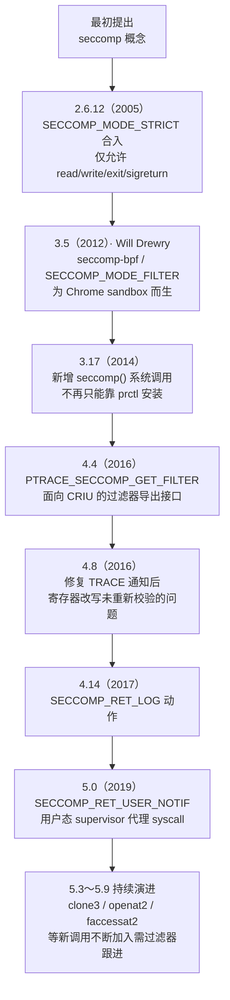
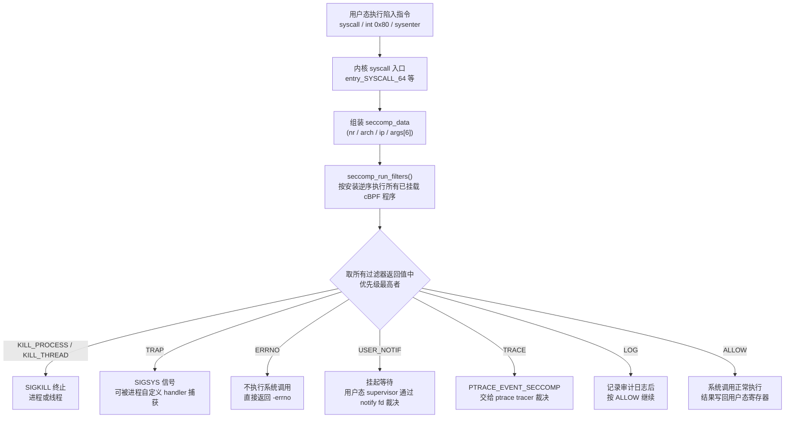
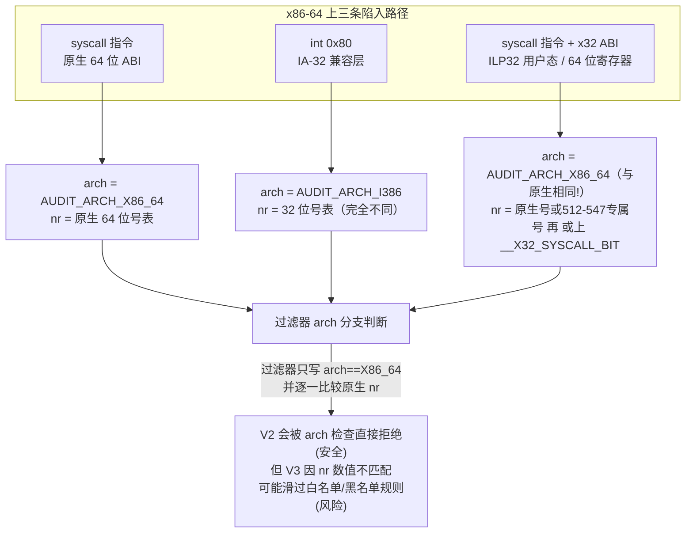
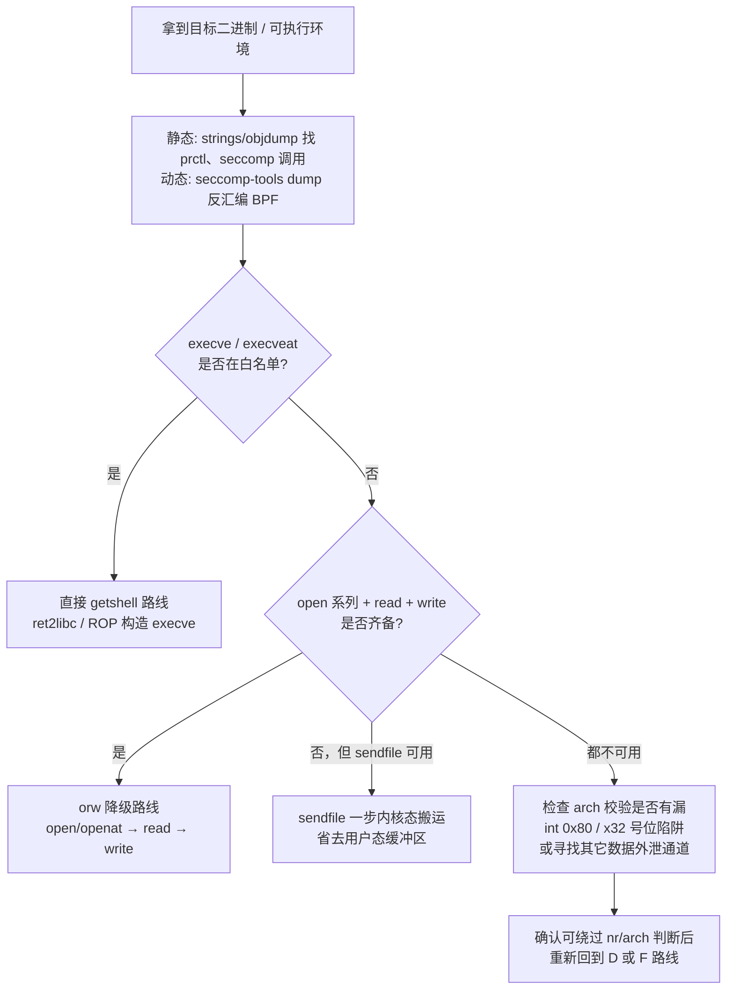

# 二进制漏洞与利用基础（20）· seccomp沙箱与逃逸
> [!abstract] TL;DR
> - seccomp 是内核系统调用入口处的"关卡"：filter 模式下进程提交一段 cBPF 程序，内核对 `seccomp_data`（`nr`/`arch`/`args[6]`）逐条比较后返回 `ALLOW`/`ERRNO`/`KILL_PROCESS`/`TRACE`/`USER_NOTIF` 等动作，多个叠加过滤器取"最严格者优先"且不可撤销。
> - 沿用 tcpdump/libpcap 同源的经典 cBPF 而非 eBPF 是刻意的攻击面收窄——无循环、不可解引用、指令数硬上限，用表达力换"过滤器本身不会成为新漏洞源"。
> - 绕过的本质是找过滤器的"遗漏"：等价系统调用别名（`open→openat→openat2`）、多架构入口混淆（`int 0x80` 的 IA-32 号表、x32 ABI 里 `__X32_SYSCALL_BIT` 号位陷阱）、参数只是寄存器数值而非可解引用内容（TOCTOU）、白名单必然滞后于内核新增系统调用。
> - `execve` 被封时，目标从"拿 shell"降级为 orw（`open`/`openat` + `read` + `write`，或一次 `sendfile`）读 flag——这是 CTF 场景下最常见的应对策略。
> - 健壮过滤器 = 默认 `KILL_PROCESS`（白名单）+ 强校验 `arch`（含拒绝 x32 号位陷阱）+ 用 libseccomp 并理解其架构信任模型 + 语义家族全覆盖 + 参数级过滤，且只是纵深防御的一层，需配合 Landlock/LSM/namespaces。
> - 本篇一切绕过分析仅用于 CTF 授权靶机与自有沙箱的安全测试，防御视角讲解，不提供针对真实生产系统的武器化步骤。

## 概述与定位

本篇处理的问题和前面几篇有本质不同。第 02 至 19 篇的所有技术——不管是栈溢出、ROP、堆利用还是 one_gadget/ORW——都共享一个隐含前提：只要拿到了控制流劫持能力，进程能调用的系统调用集合不受额外限制，唯一的约束来自 CPU 特权级、libc 符号可见性、ASLR/NX/Canary 这类**通用**缓解机制。但现实中（尤其是 CTF pwn 题和生产沙箱环境）经常还叠着**专门针对系统调用本身的白名单/黑名单**：即便已经把 RIP 完全劫持到自己布置的 shellcode 上，一条 `execve` 下去，进程可能应声被 `SIGKILL`——这就是 seccomp（Secure Computing Mode）在起作用。

理清本篇与前两篇的关系有助于把系列的知识点串起来：第 18 篇（one_gadget/magic_gadget）和第 19 篇（[[19.ORW与读取flag]]）解决的是"没有好用的 libc 符号、参数不可控"时如何靠**裸系统调用**兜底；这两篇都默认"只要 `rax`/`rip` 落到正确位置，syscall 就会执行"。本篇要打破这个默认——如果目标进程装了 seccomp 过滤器，裸系统调用本身也可能被拒绝，必须先把过滤器"翻译"成一张明确的能力清单，再回头决定第 18、19 篇里哪条技术路线还能走通。许多"babyheap + seccomp"类型的 CTF 题目正是这种组合：前半程用堆漏洞拿到执行控制权，后半程才是本篇的内容——分析沙箱、找到裂缝、把 orw 这样的降级目标塞进裂缝里。

系列内的位置也可以这样理解：第 19 篇讲的是"execve 不可用时退而求其次"，却没解释"execve 为什么不可用"；本篇把这一步的原因讲透。下一篇（[[21.ARM64与MIPS架构利用差异]]）会在本篇建立的分析框架上做横向扩展——本篇聚焦 x86/x86-64 语境下 seccomp 的结构、`AUDIT_ARCH_*`、调用号表这些细节，到了 ARM64/MIPS，架构常量、调用号分配、甚至是否存在类似 x32 的"次级 ABI"都会不同；读者应把本篇当作"如何分析任意 seccomp 沙箱"的通用方法论，把下一篇当作"换一套指令集会有什么不同"的补充读物。

seccomp 并非 pwn 题专属机制。Chrome/Chromium 的渲染进程、OpenSSH 的特权分离子进程、Docker/containerd 的默认容器 profile、systemd 的 `SystemCallFilter=`、Firefox 的内容进程都在生产环境大规模使用它。这意味着本篇讲的分析方法同样是安全审计的基本功——评估一个自建沙箱是否足够健壮，本质上就是在问"攻击者能否用本篇列出的手法之一穿过它"。这也是本篇与 [[34.现代二进制防护机制/16.沙箱与隔离防护]] 互为镜像的原因：那一篇站在防御者角度讲"如何正确配置"，本篇站在攻击者/审计者角度讲"配置错在哪会被打穿"，两篇合起来才是完整的攻防视角。如果拿到执行点本身依赖复杂的堆漏洞利用链，可以先参考 [[24.内存管理与堆分配器/17.堆利用手法体系House_of系列]] 打好前置基础——本篇假设读者已经站在"任意代码执行，但 syscall 受限"这个起点上。

---

## 原理与机制

### strict 与 filter：两种模式

seccomp 最初只有一种形态：`SECCOMP_MODE_STRICT`。进程调用 `prctl(PR_SET_SECCOMP, SECCOMP_MODE_STRICT)` 之后，内核只允许四个系统调用通过——`read`、`write`、`_exit`、`rt_sigreturn`，其余一律 `SIGKILL`。这个设计初衷很直白：把一段不受信任的计算代码（最初面向"出卖闲置 CPU 算力"一类分布式计算场景）关进一个只能读写既有文件描述符、不能新开资源、不能等待信号的盒子里，连 `mmap`、`open` 都不给——安全但几乎没有实用性，任何需要动态内存或打开新文件的程序都无法在 strict 模式下运行。

`SECCOMP_MODE_FILTER`（业界俗称 seccomp-bpf）在 Linux 3.5（2012 年）由 Will Drewry 引入，直接动机是 Chrome/Chromium 的沙箱需求——渲染进程需要比 strict 模式宽松得多、又比"完全不限制"严格得多的中间态。filter 模式把"允许哪些系统调用"的决定权交还给进程自己：进程提交一段 cBPF（classic Berkeley Packet Filter）字节码，内核在每次系统调用发生时执行这段程序，由返回值决定放行还是拦截。这是当前 CTF 题目、Docker、gVisor、systemd 服务几乎唯一会遇到的形态，也是本篇的主角。

### 历史演进

seccomp 的能力不是一次性设计好的，而是跟随真实需求逐版本长出来的——理解这条演进线，能帮你判断"某道题/某个沙箱能用的绕过手法是否受内核版本限制"。



这条时间线上有几个节点值得单独说明。3.17 引入的独立 `seccomp()` 系统调用在此之前，安装过滤器只能通过 `prctl(PR_SET_SECCOMP, ...)`；`seccomp()` 把这一操作独立出来，同时补充了 `SECCOMP_FILTER_FLAG_TSYNC` 这样的标志位，用于在多线程进程中把过滤器原子地同步到所有线程，避免线程之间过滤器不一致的竞态窗口。4.4 与 4.8 这两个相邻版本合起来讲的是同一个故事的两半：4.4 开放了通过 `PTRACE_SECCOMP_GET_FILTER` 导出已安装过滤器字节码的能力（本是为 CRIU 检查点/恢复设计），而 4.8 修复了 `SECCOMP_RET_TRACE` 场景下一个明确记录在案的缺陷——在此之前，tracer 通过 `PTRACE_SETREGS` 改写寄存器（包括系统调用号本身）后，内核**不会**针对修改后的新值重新执行一遍 seccomp 检查，过滤器审查的是修改前的调用，真正落地执行的却可能是被换过的另一个调用。5.0 引入的 `SECCOMP_RET_USER_NOTIF` 则是对这一整类"裁决权转移后如何保证一致性"问题更彻底的正面回应，后文绕过手法部分会展开讲这几者的差异。

### 安装接口与不可逆特性

进程通过两种等价方式安装过滤器：

```c
/* 方式一：prctl（历史悠久，两种模式通用） */
prctl(PR_SET_NO_NEW_PRIVS, 1, 0, 0, 0);
prctl(PR_SET_SECCOMP, SECCOMP_MODE_FILTER, &prog);

/* 方式二：seccomp() 系统调用（3.17+，支持 TSYNC 等标志位） */
syscall(SYS_seccomp, SECCOMP_SET_MODE_FILTER, SECCOMP_FILTER_FLAG_TSYNC, &prog);
```

有三条约束决定了 seccomp 的"不可逆"特性，也是理解后续所有绕过手法边界的前提：

1. **权限前提**：非 root 进程要安装过滤器，必须先 `prctl(PR_SET_NO_NEW_PRIVS, 1, ...)`。`no_new_privs` 的语义很精确——**当前进程及其所有后代，此后通过 `execve` 执行任何程序时都不能获得比当前更高的权限**：setuid/setgid 位失效，文件能力（file capabilities）也不再生效。这条前提直接堵死了一条看起来很自然的绕过思路——"exec 一个 setuid-root 的系统程序来提权、绕过沙箱"；不设这条前提的话，任何非特权进程都能靠自装过滤器绕过"只有特权进程能装 seccomp"的权限检查，而 `no_new_privs` 把"能自装过滤器"和"能借 exec 提权"这两件事在设计上互斥掉了。
2. **不可撤销、只能叠加**：过滤器一旦安装就不能卸载，只能再装一个新的。多个过滤器同时存在时，**每次系统调用都会把所有已安装的过滤器（按安装的逆序，最后装的先跑）全部执行一遍**，最终动作取所有返回值中优先级最高（最严格）的那个：`KILL_PROCESS > KILL_THREAD > TRAP > ERRNO > USER_NOTIF > TRACE > LOG > ALLOW`。这个"只能收紧、优先级取严格者"的设计保证了叠加过滤器不会互相拆台——后续代码永远不能通过"再装一个更宽松的过滤器"来放宽已有限制，这是 seccomp 作为安全边界的核心不变量。
3. **随 fork/exec 继承**：过滤器附着在线程组的过滤器链表上，`fork`/`clone` 出的子进程自动继承父进程的过滤器集合，`execve` 替换程序镜像后过滤器依然生效——这也是它能真正当沙箱用的原因，如果 exec 新程序就能甩掉限制，沙箱就没有意义。

### seccomp_data 结构与内核挂载点

内核在系统调用入口——x86-64 上是 `entry_SYSCALL_64` 之后的早期路径——组装一个只读的输入结构体交给 BPF 程序：

```c
struct seccomp_data {
    int   nr;                   /* 系统调用号（当前 ABI 下的原始值） */
    __u32 arch;                 /* AUDIT_ARCH_* 常量，标识触发调用的 ABI */
    __u64 instruction_pointer;  /* 发起 syscall 指令那一刻的用户态 RIP */
    __u64 args[6];              /* 系统调用的最多 6 个参数，均为原始寄存器值 */
};
```

这个结构体只有 4 个字段，却决定了 seccomp 能"看见"什么、"看不见"什么——这是理解后面所有绕过手法的钥匙。`nr`/`arch` 是标量整数，可以被精确比较；`args[]` 里如果某个参数本质是指针（比如 `open` 的路径名、`write` 的缓冲区），BPF 程序拿到的只是这个指针的**数值**，无法解引用去看指针指向的内容。换句话说，seccomp **能限制"调用哪个函数、传的整数参数是多少"，但原则上无法实现"只允许打开某个特定路径"这类基于内容的访问控制**——这正是 Landlock、AppArmor、SELinux 这类路径感知型 MAC 机制存在的意义，二者是互补而非竞争关系（详见 [[34.现代二进制防护机制/16.沙箱与隔离防护]]、[[52.Linux内核机制与内核利用/11.LSM与SELinux与AppArmor]]）。



BPF 程序对 `seccomp_data` 的读取通过 `BPF_LD | BPF_W | BPF_ABS` 指令按**字节偏移**寻址——过滤器代码因此与该结构体的内存布局强耦合，`offsetof` 出来的偏移量必须精确匹配内核对这个结构体的定义（该结构体自引入以来字段没有变过，这一层相当稳定）。系统调用的参数传递本身遵循 Linux x86-64 syscall ABI（`rdi/rsi/rdx/r10/r8/r9`，第 4 个参数用 `r10` 而非用户态调用规约的 `rcx`，因为 `syscall` 指令执行时硬件会把返回地址写入 `rcx`、把 `RFLAGS` 写入 `r11`，详见 [[22.调用规约/08.系统调用规约]] 与更基础的 [[22.调用规约/06.SystemV_AMD64调用规约]]）——但这层区别对 seccomp 本身是透明的：内核组装 `seccomp_data.args[]` 时已经把这几个寄存器的值搬进了结构体，BPF 程序看到的始终是统一格式，不需要关心底层是从哪个寄存器读来的。

### 为什么是 cBPF 而不是 eBPF

seccomp 用的 BPF 是"classic BPF"（cBPF）——和 tcpdump/libpcap 做抓包过滤的是同一套指令集、同一个历史源头（Steven McCanne 与 Van Jacobson 1992/1993 年提出的 BSD Packet Filter），而不是近十年爆发式发展的 eBPF。这个选择在今天看略显复古，但是刻意的：

cBPF **没有循环、没有函数调用、只能访问输入结构体这一块固定的只读内存**，指令集小到可以一眼审计完，单个过滤器指令数存在硬上限。这些限制放在"通用可编程性"上是缺陷，放在"内核里跑在每次系统调用热路径上的守门程序"这个角色上却是优点——**不可能因为过滤器本身写挂而让内核陷入死循环或者读到不该读的内存**，正确性证明和性能上界都是显然的。eBPF 表达力强得多（有界循环、helper 函数、map），但代价是更复杂的验证器（verifier）——而 eBPF 验证器本身在过去多年是内核本地提权（LPE）漏洞的高发地带之一。把"这个进程能不能调用 execve"这种安全判定建立在一个更庞大、历史上 bug 更多的验证器之上，等于是在收窄一个攻击面的同时打开另一个更大的，这与 seccomp 本身"最小可信计算基"的设计哲学相悖。因此 seccomp 的用户态 API 至今仍是 cBPF 字节码格式；内核内部执行引擎虽然已经统一（加载时会把 cBPF 转换为内部表示复用同一套解释器/JIT），但这是实现细节上的性能优化，并不改变"用户提交的接口形态是 cBPF"这一事实。两套 BPF 验证器复杂度与可信边界的权衡，可以对照 [[52.Linux内核机制与内核利用/12.eBPF架构与验证器]]、[[52.Linux内核机制与内核利用/03.系统调用实现与入口]] 来理解。

---

## cBPF规则结构、多架构语义与绕过手法详解

### cBPF 指令集与过滤器的物理结构

每条 cBPF 指令是定长 8 字节的 `struct sock_filter`：

```c
struct sock_filter {
    __u16 code;   /* 操作码：BPF_LD|BPF_W|BPF_ABS、BPF_JMP|BPF_JEQ|BPF_K 等的组合 */
    __u8  jt;     /* 条件为真时向前跳过的指令数 */
    __u8  jf;     /* 条件为假时向前跳过的指令数 */
    __u32 k;      /* 立即数，或作为 BPF_LD_ABS 的偏移量 */
};
```

`jt`/`jf` 都只有 1 字节宽，意味着**单条跳转指令最多只能向前跨越 255 条指令**。这个限制看似琐碎，却直接决定了过滤器生成工具的实现方式：如果白名单只覆盖三四十个系统调用，用最朴素的"逐一 `if (nr == X) goto ALLOW`"线性比较链完全可行，但通用沙箱框架要覆盖数百个系统调用的精细规则时，线性比较会迅速超出单跳跳转范围、也逼近整体指令数上限。libseccomp 面对这种规模时，会把比较逻辑组织成**按调用号排序后的二分决策树**而非线性链，跳转距离和总指令数都是对数级的，不会顶到硬限制。这也是官方文档反复强调"用 libseccomp 而不是手写字节码"的现实原因之一——手写时很容易因为规则一多就悄悄触达这些边界，进而在截断或异常报错时留下认知盲区。

另一个手写 cBPF 时容易忽略的细节：`args[]` 每个元素是 64 位，而 `BPF_LD | BPF_W | BPF_ABS` 每次只能加载 32 位。要比较一个 64 位参数（比如某些 flags 组合，或者指针值本身），必须拆成两条加载指令分别取低 32 位与高 32 位偏移再分别比较——遗漏高 32 位比较、只比较低 32 位，是手写规则里一个隐蔽但真实存在的疏漏模式（构造一个低 32 位匹配、高 32 位不同的参数值即可让判断失真）。libseccomp 的 64 位参数比较 API 会自动生成这两条指令，这也是更推荐使用库而非手写字节码的原因之一。

### 多路径入口与架构语义：从 int 0x80 到 x32 的号位陷阱

seccomp 过滤器必须先确认"这次系统调用是从哪种 ABI 发起的"，再去比较调用号——因为**同一个整数在不同 ABI 下可能代表完全不同的系统调用**。这正是 `seccomp_data.arch` 字段存在的原因，也是本篇标题里"架构切换"的核心含义。以 x86-64 Linux 为例，同一个 64 位内核实际上要同时支持三条陷入路径：



第一条路径（原生 `syscall` 指令，64 位 ABI）没有歧义。第二条路径——`int 0x80` 触发的 IA-32 兼容层——反而是三条里**最容易被正确防御**的一条：因为它会让 `arch` 字段变成 `AUDIT_ARCH_I386`，与原生的 `AUDIT_ARCH_X86_64` 完全不同，只要过滤器开头有一条"`arch` 不等于预期值就直接 KILL"的规则，这条路径就被彻底堵死。很多写得潦草的过滤器恰恰漏掉这一条防御——比如只检查了"`arch == X86_64` 就跳到规则判断"，却没有在**判断失败**的分支上显式写"否则 KILL"，而是任由控制流落到默认动作，如果默认动作又恰好宽松，`int 0x80` 就成了现成的绕过入口（原理性示意，非针对具体目标的成品 payload）：

```asm
; 过滤器只封堵了 64 位 execve（nr=59），未处理 arch 校验失败后的默认行为
xor eax, eax
mov al, 11        ; IA-32 表里 execve 的号是 11，不是 64 位的 59
lea ebx, [rip + binsh]   ; int 0x80 下参数走 32 位寄存器，字符串地址必须在低 4GB
xor ecx, ecx
xor edx, edx
int 0x80          ; arch 变成 AUDIT_ARCH_I386，走的是完全不同的号表
```

真正隐蔽的是第三条路径——**x32 ABI**（ILP32-on-x86-64：用户态指针是 32 位以节省内存带宽和 cache 占用，但依然使用 x86-64 的全部寄存器和 `syscall` 指令陷入）。x32 进程触发系统调用时，`seccomp_data.arch` 汇报的**依然是 `AUDIT_ARCH_X86_64`**——与原生 64 位进程完全相同，单看 `arch` 字段根本无法区分。x32 标识自己的方式不在 `arch`，而在 `nr`，且这里有两种不同的编号策略：对于用户态数据结构在 32 位指针与 64 位指针语境下布局完全一致的系统调用（只接收标量整数和单个平坦指针，比如 `read`/`write`/`close` 一类），内核直接复用原生 64 位实现，调用号是原生号再或上 **`__X32_SYSCALL_BIT`**（`0x40000000`，第 30 位）；但对于参数里包含指针数组或内嵌长度字段随 ABI 变化的系统调用——`execve` 的 `argv`/`envp` 就是典型例子，32 位指针数组和 64 位指针数组的内存步长完全不同，不能直接复用原生实现——内核在 **512 到 547** 这段专门预留的号段里放了一整套 x32 专属入口（各自对应独立的 `compat_sys_*` 实现）。`execve` 的 x32 专属号是 520，用户态发起时真正落进 `rax` 的数值是 `520 | __X32_SYSCALL_BIT = 0x40000208`，既不是原生 `execve` 的 59，也不是简单的 `59 | 0x40000000`。

这个细节对绕过分析很关键：一份只检查"`nr == 59` 就 KILL execve"的规则，无论有没有考虑到号位混淆，都不会命中 `0x40000208`，因为压根不是同一个数字；真正需要覆盖 `execve` 全部语义的过滤器，必须同时处理原生号（59）和它在 512–547 段内的 x32 专属号（520），逐一记忆"哪些调用走位运算、哪些调用走专属号段"极易出错且难以审计——这也是为什么更稳妥的工程实践是**直接拒绝任何 `nr & __X32_SYSCALL_BIT` 非零的调用**（如果应用本身不需要 x32），把"不信任这条 ABI"作为默认立场，而不是指望每一条规则都记得正确处理它。这个陷阱之所以比 `int 0x80` 更容易被漏防，就在于它绕过了"检查 `arch` 是否符合预期"这道最常见的第一道防线——`arch` 字段看起来完全正常，问题出在开发者没意识到"符合预期的 `arch` 之下，`nr` 的取值范围也可能超出自己以为的那张表"。正因如此，很多强调安全的沙箱实现（以及部分发行版的加固内核配置）会选择在编译期直接禁用 x32 支持（`CONFIG_X86_X32=n`），把攻击面从源头上关掉。

顺带一提，32 位遗留 ABI 里还有一个容易被忽视的"号复用"陷阱：i386 上很长一段时间里，`socket`/`bind`/`connect`/`send`/`recv` 等几十个网络相关操作被压缩进**同一个** `socketcall`（102 号）系统调用，具体做哪个操作由 `args[0]` 里的子操作码决定，真正的参数再通过一个指针指向的数组间接传入。这意味着仅仅按 `nr` 过滤（"允许/拒绝 102 号"）是粗粒度到失去意义的——必须连带检查 `args[0]` 才能区分"只读的 `getsockopt`"和危险的 `connect`。这个问题只在 32 位原生程序或者上面提到的 `int 0x80` 兼容路径被打通时才会出现，但恰恰因为容易被忽略"这份过滤器要不要覆盖兼容层"，这条隐患经常和架构混淆问题同时存在、互相放大。

### 绕过手法分类总览

把前面的原理落到实际分析工作里，绕过一个 seccomp 过滤器本质上都是在寻找下面五类"遗漏"之一：

**1. 语义等价的系统调用别名遗漏。** 同一个操作系统内核往往为了兼容性、性能或者扩展新参数，给同一件事保留多套系统调用入口。过滤器只按"常见教科书列表"写白名单，很容易漏掉后来居上的变体：

| 被过滤的常见调用 | 语义等价、可能未被过滤 |
| --- | --- |
| `open`(2) | `openat`(257)、`openat2`(437) |
| `execve`(59) | `execveat`(322) |
| `read`(0) | `pread64`(17)、`readv`(19)、`preadv`(295)、`preadv2`(327) |
| `write`(1) | `pwrite64`(18)、`writev`(20)、`pwritev`(296)、`pwritev2`(328) |
| `fork`(57) | `vfork`(58)、`clone`(56)、`clone3`(435) |
| `access`(21) | `faccessat`(269)、`faccessat2`(439) |
| 无直接读文件调用 | `sendfile`(40) —— 内核态直接搬运，跳过用户态缓冲区 |

这类遗漏的根源往往是过滤器编写时间早于某个新 syscall 被加入内核——`clone3`（5.3）、`openat2`（5.6）、`faccessat2`（5.8）都是近几年才出现的（三者在内核源码的系统调用表里依次占据 435、437、439 号，中间 436、438 分别是同批加入的 `close_range`、`pidfd_getfd`）。一份写于更早内核版本、且采用"黑名单危险调用、其余放行"思路的过滤器，天然不可能预见到之后才诞生的调用号，这些新调用会自动落入"未被列入黑名单"从而被默认放行的境地。

**2. 多架构入口混淆。** 即前一节详细展开的 `int 0x80`/IA-32 兼容层与 x32 ABI 号位陷阱——本质是过滤器只验证了"当前这次调用看起来是从哪条路径来的"这一表面信号（`arch` 字段），却没有意识到同一个信号背后可能对应不止一种数值编码规则。

**3. 参数盲区与 TOCTOU。** `args[]` 只是原始寄存器数值，涉及指针的参数（路径名、缓冲区地址）在 BPF 层面完全不可能做"内容级"过滤——参数比较规则匹配的是地址数值本身，几乎不可能被攻击者的 payload 恰好命中，但反过来说，这也意味着**任何试图靠 seccomp 参数过滤来限制"只能打开这个路径"的设计从原理上就是无效的**，必须依赖 Landlock/AppArmor/SELinux 这类能感知文件系统语义的机制来补位。

`SECCOMP_RET_TRACE` 把这个盲区问题变得更复杂：当过滤器对某条调用返回 `TRACE` 时，内核在真正执行前把控制权转给 `ptrace` tracer（通过 `PTRACE_EVENT_SECCOMP` 停住线程），由 tracer 读取寄存器/内存做二次判断后再 `PTRACE_CONT` 放行。这个流程历史上有一个明确记录在案的缺陷：**Linux 4.8 之前，tracer 在放行前通过 `PTRACE_SETREGS` 改写寄存器（包括系统调用号本身）之后，内核不会针对修改后的新值重新执行一遍 seccomp 检查**——过滤器审查的是修改前的调用，真正落地执行的却可能是修改后的另一个完全不同的调用；4.8 之后内核修复为重新校验。即便在修复之后的内核上，多线程场景下的 TOCTOU 依然没有被根治：如果目标进程是多线程的，未被停住的其它线程仍然可以在 tracer 检查内存和内核真正取用内存之间修改共享内存内容，构成经典 TOCTOU。`SECCOMP_RET_USER_NOTIF`（5.0+）正是为解决这类问题而设计的更安全替代——它把裁决权交给一个用户态 supervisor 进程，通过专用的 notify 文件描述符（`SECCOMP_IOCTL_NOTIF_RECV`/`_SEND`）交换请求与响应，并提供 `SECCOMP_IOCTL_NOTIF_ID_VALID` 用来在真正生效前确认"目标进程与这次请求的上下文没有在中途发生变化"（防止 PID 复用或状态漂移引发裁决错位），比 `TRACE` 的裸 ptrace 模型更能收窄这个竞态窗口，也是容器运行时代理执行 `mknod`、`mount` 等特权调用的标准做法。

**4. 借道 `rt_sigreturn` 的 SROP 联动。** 几乎所有过滤器都必须放行 `rt_sigreturn`（15 号）——信号处理返回依赖它，禁掉会让任何依赖信号机制的正常功能失效。但 `rt_sigreturn` 允许攻击者从栈上一段伪造的 `sigcontext` 里恢复**全部寄存器**，这正是 [[12.SROP信号帧伪造]] 的核心原语。它本身并不能让某个被 seccomp 拒绝的系统调用凭空放行——伪造上下文后真正落地执行的下一条系统调用仍然要过同一套 BPF 过滤器——但它能让攻击者在 **gadget 稀缺**的场景下，零 ROP 链地把 `rdi/rsi/rdx/r10/r8/r9/rax` 一次性设成任意值去调用某个已经在白名单内、但正常情况下很难凑齐全部参数的调用，是"过滤器允许的调用集合虽小，但参数没做精细过滤"这一类残余风险的放大器。构造这类攻击链时通常仍需要一些跳板才能把控制流引导到 `rt_sigreturn`，参见 [[06.ROP入门]]、[[07.ROP进阶：ret2csu与通用gadget]]。

**5. 白名单必然滞后于内核演进。** 这是前四类问题背后的元问题：内核的系统调用表不是静态的，新版本不断新增（有时也标记废弃）系统调用；任何基于"枚举已知危险调用并拉黑"的黑名单思路，在设计上就注定会被未来新增的调用绕过，因为新调用在黑名单写成的那一刻还不存在。这也是为什么本文和几乎所有权威文档都反复强调"默认拒绝、白名单模式"是唯一在时间维度上站得住脚的设计——放行清单需要主动维护，但至少新增调用的默认命运是被拒绝而不是被放行。

---

## 工具视角与实战

### 判断目标是否处于 seccomp 之下

在动用任何工具之前，最快的确认方式是读 `/proc/[pid]/status` 里的两行：

```bash
grep -i seccomp /proc/$(pidof target)/status
# Seccomp:          2      # 0=未启用 1=strict 2=filter
# Seccomp_filters:  1      # 已挂载的过滤器数量（较新内核才有此字段）
```

`Seccomp` 字段的取值与 `prctl(PR_GET_SECCOMP)` 的返回值一致，`2` 就意味着接下来必须先弄清楚过滤器的具体规则，再决定利用路径。

### seccomp-tools：一线分析工具

`seccomp-tools`（Ruby gem，`david942j/seccomp-tools`）是 CTF 分析 seccomp 的事实标准：

```bash
gem install seccomp-tools
seccomp-tools dump ./target        # 运行目标，拦截安装动作，反汇编已挂载的 BPF 规则
seccomp-tools dump -f ./target     # 若目标会 fork，跟踪子进程
seccomp-tools disasm filter.bpf    # 直接反汇编一段已 dump 下来的 BPF 字节码文件
```

示例输出（截断）：

```
 line  CODE  JT   JF      K
=================================
 0000: 0x20 0x00 0x00 0x00000004  A = arch
 0001: 0x15 0x00 0x09 0xc000003e  if (A != ARCH_X86_64) goto 0011
 0002: 0x20 0x00 0x00 0x00000000  A = sys_number
 0003: 0x15 0x07 0x00 0x00000000  if (A == read) goto 0011
 0004: 0x15 0x06 0x00 0x00000001  if (A == write) goto 0011
 0005: 0x15 0x05 0x00 0x0000003b  if (A == execve) goto 0011
 ...
 0010: 0x06 0x00 0x00 0x00000000  return KILL
 0011: 0x06 0x00 0x00 0x7fff0000  return ALLOW
```

拿到这份反汇编，分析工作基本就是照着前一节的五类遗漏逐条核对：`arch` 检查是否在开头就把非预期架构挡死、白名单里有没有漏掉 `openat`/`sendfile`、`execve` 允许的话直接判赢。

值得说明的是，`seccomp-tools dump` 并不是黑魔法——它的原理是用 `ptrace` 附加到目标进程，拦截 `prctl`/`seccomp` 系统调用，再用内核提供的标准请求 `PTRACE_SECCOMP_GET_FILTER`（Linux 4.4+，要求调用方具备 `CAP_SYS_ADMIN`）把已安装的 `struct sock_filter` 数组原样取出来重新反汇编。这个 ptrace 请求本身是为 CRIU（Checkpoint/Restore In Userspace）这类需要完整还原进程状态的工具而设计的，seccomp-tools 只是复用了这个官方接口——这意味着理解了这一层原理后，自己写几十行 ptrace 代码也能做到同样的事，不必依赖某一个特定工具。

### 静态定位与离线验证

拿不到可运行环境时（纯静态题），在 IDA/Ghidra 里定位 `prctl`（调用号 157）或 `seccomp`（调用号 317）调用点，顺着 `filter`/`prog.filter` 指针参数找到 `struct sock_filter` 数组的地址，手工按 `BPF_LD`/`BPF_JMP`/`BPF_RET` 的编码规则解码即可——`seccomp-tools disasm` 同样接受一段裸字节码文件，不要求真的跑起来。

如果只是想验证"我认为过滤器存在的这个漏洞是否成立"，不需要每次都拿真实目标反复试错——cBPF 本来就是 tcpdump/libpcap 抓包过滤复用的同一套指令集，libpcap 自带的用户态 cBPF 解释器可以直接加载同一份 `struct sock_filter` 数组，喂入自己构造的 `seccomp_data`（伪造 `nr`/`arch`/`args[]`）作为"抓包内容"，观察返回值来验证判断是否正确。这种离线验证方式比反复重启真实目标进程更快，也更适合在批量分析多个候选绕过路径时做筛选。

### 最小可复现实验

在本地先写一个简化沙箱，验证"过滤器漏掉 `openat`"这一具体假设：

```c
/* sandbox_demo.c：只拉黑 open/execve，验证 openat 是否可用 */
#include <stdio.h>
#include <fcntl.h>
#include <unistd.h>
#include <sys/syscall.h>
#include <seccomp.h>

int main(void) {
    scmp_filter_ctx ctx = seccomp_init(SCMP_ACT_ALLOW); /* 教学示例：故意用默认放行体现问题 */
    seccomp_rule_add(ctx, SCMP_ACT_KILL, SCMP_SYS(open),   0);
    seccomp_rule_add(ctx, SCMP_ACT_KILL, SCMP_SYS(execve), 0);
    seccomp_load(ctx);
    seccomp_release(ctx);

    int fd = syscall(SYS_openat, AT_FDCWD, "/etc/hostname", O_RDONLY);
    printf("openat fd = %d (>0 说明规则确有遗漏)\n", fd);
    return 0;
}
```

这里故意使用 `SCMP_ACT_ALLOW` 作为默认动作，是为了在教学上把"黑名单模式为什么危险"具象化——生产/CTF 中见到的沙箱几乎不会这样写，但正是这种反例能让"默认拒绝"原则的必要性一目了然。

用 pwntools 的 `shellcraft` 把 orw（open-read-write）思路落成 shellcode，是过滤器确认 `execve` 被封而文件 I/O 尚存时的标准动作：

```python
from pwn import *
context.arch = 'amd64'

# execve 被杀、openat 存活时的降级路线
sc  = shellcraft.openat(-100, "/flag", 0)   # -100 = AT_FDCWD
sc += shellcraft.read('rax', 'rsp', 0x100)
sc += shellcraft.write(1, 'rsp', 0x100)
payload = asm(sc)

# 若 sendfile 未被拦截，可以省去中间的 read/write 两步
sc2  = shellcraft.openat(-100, "/flag", 0)
sc2 += shellcraft.syscall('SYS_sendfile', 1, 'rax', 0, 0x100)
payload2 = asm(sc2)
```

### CTF 实战流程

把上述工具串成一条可重复的分析流程：



---

## 安全性与正确使用

> [!caution] 使用边界与合规声明
> 本篇分析的所有绕过手法——等价系统调用枚举、架构混淆、TOCTOU、SROP 联动——均以**理解沙箱设计缺陷、评估自建过滤器健壮性**为目的，只应在以下场景使用：
> - CTF 授权靶机与训练环境；
> - 个人或团队自建沙箱/容器方案的对抗性安全测试；
> - 安全研究场景下对开源沙箱实现的漏洞分析与负责任披露。
>
> **严禁将本篇内容用于绕过任何真实生产系统（浏览器渲染进程沙箱、容器运行时、移动端应用沙箱等）的安全边界，或对未授权系统发起攻击。** 本篇不提供针对具体真实目标的可直接投放的利用配方，所有代码示例均为教学性质的最小复现。

### 健壮过滤器的五条设计原则

结合前面拆解的每一类绕过手法，可以反推出写（或审计）一份健壮 seccomp 过滤器要满足的条件——这五条不是孤立的清单，而是分别针对前文五类漏洞的直接回应：

**原则一：默认动作用 `SECCOMP_RET_KILL_PROCESS`，而不是 `KILL_THREAD`。** 旧版本语义（`SECCOMP_RET_KILL`，等价今天的 `KILL_THREAD`）只终止触发违规的那一个线程——如果进程是多线程的，其余线程仍在运行，攻击者理论上可以让触发点发生在一个"可牺牲"的线程上，把真正的恶意逻辑放在别的线程继续执行或掩盖痕迹。`KILL_PROCESS` 直接终止整个线程组，消灭这个残留窗口，是内核后来专门为此新增的更安全选项。

**原则二：`arch` 校验必须是"非预期则显式 KILL"，而不是"预期则放行、否则隐式落到默认动作"。** 二者在多数情况下效果一样，但只有前者在**任何**默认动作配置下都成立——即便有人后续把默认动作改宽松了，`arch` 校验这一条独立防线依然生效。同时，校验逻辑要意识到"预期架构"不是只有一种数值就够了，还要考虑同一 `arch` 数值下是否存在 x32 这类需要靠 `nr` 高位区分的情况，必要时显式拒绝任何 `nr & __X32_SYSCALL_BIT` 非零的调用。

**原则三：优先用 libseccomp，理解它的信任模型而不是盲目信任它。** libseccomp 能自动生成正确的 `arch` 校验、二分决策树、64 位参数的双段加载，大幅降低手写字节码的出错概率——但它的默认行为是**只为调用 `seccomp_init()` 时进程的当前（native）架构生成规则**，不会主动帮你覆盖 32 位兼容层或 x32。这本身是安全的默认状态（未被显式加入的架构，一律在 `arch` 校验阶段就落入默认动作），但如果因为要兼容遗留 32 位程序而主动调用架构添加接口引入了额外架构，就必须对这个新架构重新走一遍完整的规则审查——否则等于自己在其中一条兼容路径上开了后门，库不会替你自动补全。

**原则四：按语义家族而不是按单个调用封堵。** 表格里列出的每一组等价调用要么全禁要么全开，零散地只禁掉列表里最常见的那个名字，基本等于没禁。

**原则五：能做参数级过滤就不要止步于调用级过滤。** 参数比较能把"允许 `write`"收紧成"只允许向 `fd<=2` 写"，在标量参数（fd、flags、长度）上收益明显；但要清醒地知道它在指针类参数上无能为力，这类需求应转交 Landlock/LSM。

### 纵深防御中的位置

seccomp 只回答"能不能调用某个系统调用、参数的整数值是否符合预期"这一个维度的问题，不负责文件路径级的访问控制（Landlock/AppArmor/SELinux 的职责，参见 [[52.Linux内核机制与内核利用/11.LSM与SELinux与AppArmor]]）、不负责资源与视图隔离（namespaces/cgroups 的职责）、更不负责阻止已经在允许范围内的系统调用被恶意参数滥用到触发内核自身的漏洞——真正把内核攻击面压到最低的方案（如 gVisor 的用户态 Sentry、Firecracker 的 microVM）选择的是"根本不把大部分系统调用转发给宿主内核"，而不是"过滤转发哪些"。这几种机制的组合关系与各自适用场景，[[34.现代二进制防护机制/16.沙箱与隔离防护]] 有更完整的展开。

容器安全研究里一个反复出现的教训是：允许 `unshare`/`clone` 携带 `CLONE_NEWUSER` 看起来是在"降权"（进程在新建的 user namespace 里被映射成非特权用户），但新 namespace 内该进程往往重新拥有了 `CAP_SYS_ADMIN` 等一整套能力——如果内核里恰好存在某个未充分考虑 namespace 隔离场景的接口，这套"namespace 内的高权限"就可能被拼接成完整的容器逃逸链。这也是主流容器运行时的默认 seccomp profile 普遍会限制或特殊处理 `unshare`/`clone(CLONE_NEWUSER)`、`mount`、`keyctl` 这类调用的原因——它们本身不是"直接拿 shell"的调用，但会打开一扇让攻击者重新站到更高权限视角的门。内核态相关机制的系统讲解见 [[52.Linux内核机制与内核利用/00.Linux内核机制与内核利用总览]]。

### CTF 与生产环境的目标差异

CTF 里"绕过 seccomp 读出 flag 内容"就是终点，orw 三步走通即可收工；生产环境的目标完全不同——沙箱配置需要经得起时间考验（能不能扛住三年后新增的系统调用）、需要多层防御互相兜底（单靠 seccomp 从来不是生产环境的合理终态）、还需要能被持续审计（过滤器是否随应用功能变化同步更新）。把本篇的分析方法用在自己维护的沙箱上做定期复查，比只在打题时想起它更能体现这些技术的真正价值。

---

## 小结

1. **seccomp-bpf 的本质**是内核在系统调用入口处执行一段用户提交的 cBPF 程序，依据 `seccomp_data`（`nr`/`arch`/`args[6]`）的比较结果返回 `ALLOW`/`ERRNO`/`KILL_PROCESS`/`TRACE`/`USER_NOTIF` 等动作，多个过滤器叠加时"最严格者优先"且不可撤销。
2. **沿用 cBPF 而非 eBPF 是安全取舍**：牺牲表达力换取"过滤器指令集本身足够简单、不会成为新的内核攻击面"——这条设计哲学解释了 seccomp 为什么至今看起来"简陋"。
3. **绕过的通用方法论是找"遗漏"**：等价系统调用别名、架构入口混淆（`int 0x80` 相对好防，x32 的 `__X32_SYSCALL_BIT` 号位陷阱因为 `arch` 字段看起来正常而更隐蔽，且部分调用如 `execve` 还需额外处理 512–547 专属号段）、指针参数的 TOCTOU 盲区、`rt_sigreturn` + SROP 的免 gadget 参数构造、黑名单永远滞后于内核新增调用——五类问题分别对应五条防御原则，一一对应记忆效率更高。
4. **`execve` 被封时，orw（或一次 `sendfile`）是标准降级路线**，这是 CTF 场景下几乎必然要用到的思路转换。
5. **健壮过滤器 = 默认 `KILL_PROCESS`（白名单）+ 强 `arch` 校验（含 x32）+ 优先 libseccomp 并理解其信任边界 + 语义家族全覆盖 + 参数级过滤**，而 libseccomp 的默认安全性来自"不显式添加的架构直接被拒绝"，不是自动帮你堵住所有漏洞。
6. **seccomp 只是纵深防御的一层**，不能替代 Landlock/LSM 的路径级控制，也不能替代 namespaces/cgroups 的资源隔离，更不能替代 gVisor/microVM 级别的内核面隔离——理解它的边界，和理解它的能力同样重要。

---

## 相关阅读

- man-pages：`man 2 seccomp`、`man 2 prctl`、`man 2 ptrace`、`man 2 seccomp_unotify`
- Linux Kernel Documentation：`Documentation/userspace-api/seccomp_filter.rst`
- libseccomp 项目文档与源码（GitHub：`seccomp/libseccomp`）
- seccomp-tools 项目（GitHub：`david942j/seccomp-tools`）
- McCanne, S. & Jacobson, V., *The BSD Packet Filter: A New Architecture for User-level Packet Capture*, USENIX 1993（cBPF 设计的原始论文）
- [[19.ORW与读取flag]] —— execve 被封后的标准降级路线，本篇绕过分析的直接下游
- [[21.ARM64与MIPS架构利用差异]] —— 同一套 seccomp 分析方法论在其它指令集上的调用号表、arch 常量差异
- [[12.SROP信号帧伪造]] —— `rt_sigreturn` 联动绕过依赖的寄存器伪造原语
- [[06.ROP入门]]、[[07.ROP进阶：ret2csu与通用gadget]] —— 在受限系统调用集合内仍需拼接调用链时的基础技术
- [[22.调用规约/08.系统调用规约]]、[[22.调用规约/06.SystemV_AMD64调用规约]] —— syscall ABI 与用户态调用规约的寄存器差异
- [[11.ELF文件详解/17.got节]] —— 控制流劫持落地后仍需通过 seccomp 约束的系统调用能力边界
- [[24.内存管理与堆分配器/17.堆利用手法体系House_of系列]] —— 到达"任意代码执行但 syscall 受限"这一起点常见的前置利用链
- [[34.现代二进制防护机制/00.现代二进制防护机制总览]]、[[34.现代二进制防护机制/16.沙箱与隔离防护]] —— 本篇的防御视角镜像，含 Landlock/namespaces/gVisor 的完整讨论
- [[52.Linux内核机制与内核利用/00.Linux内核机制与内核利用总览]]、[[52.Linux内核机制与内核利用/03.系统调用实现与入口]]、[[52.Linux内核机制与内核利用/12.eBPF架构与验证器]]、[[52.Linux内核机制与内核利用/11.LSM与SELinux与AppArmor]] —— 内核态实现细节与相邻机制的系统讲解
- [[00.二进制漏洞与利用基础总览]] —— 系列总览

---
[[00.二进制漏洞与利用基础总览|⬆ 系列总览]] | [[19.ORW与读取flag|← 上一章]] | [[21.ARM64与MIPS架构利用差异|→ 下一章]]
