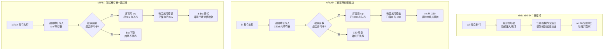
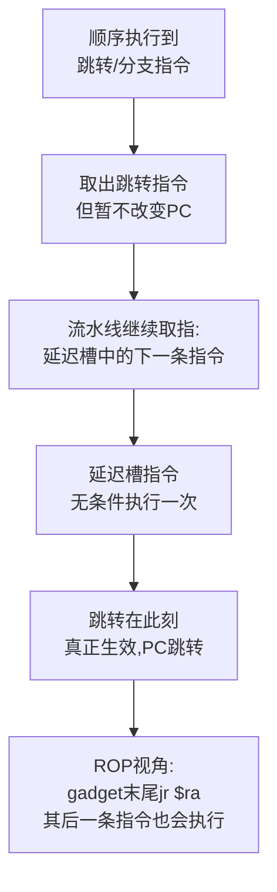
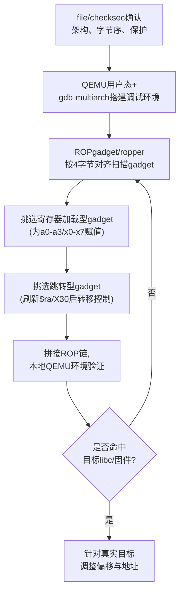

# 二进制漏洞与利用基础（21）· ARM64与MIPS架构利用差异

> [!abstract] TL;DR
> - ARM64/MIPS 用 LR(X30)/`$ra` 寄存器承载返回地址，`bl`/`jal` 不像 x86 的 `call` 那样隐式压栈；只有非叶子函数才会在序言里把它 spill 到栈上，栈溢出能否劫持控制流，第一步就取决于目标函数是否真的把返回地址落了盘。
> - 前若干个整数参数全部经寄存器传递（ARM64 最多 8 个 X0-X7，MIPS O32 下 4 个 `$a0-$a3`），ROP 链必须先用"弹寄存器"型 gadget 把参数摆进对应寄存器再跳转，不能像 x86 cdecl 那样直接把参数摞在栈上等着被读出。
> - ARM64/MIPS 都是定长 4 字节、强制对齐的指令集，不存在 x86 那种"从任意字节偏移切入产生全新语义"的非对齐 gadget，可用 gadget 密度远低于 x86，因而更依赖寄存器跳板（`br`/`blr`、`jr`/`jalr`）拼出的 JOP 式链条。
> - MIPS 分支延迟槽（branch delay slot）让跳转指令之后紧跟的一条指令必定先于跳转生效执行，构造 ROP 链或手写 shellcode 时必须把这条"免费指令"纳入设计，是 x86、ARM64 都不存在的独有陷阱。
> - MIPS 的 PIC 调用约定要求被调函数地址预先放进 `$t9` 供其自行推导 `$gp`；直接跳到 libc 函数地址而不设置 `$t9`，函数内部对全局数据/GOT 的访问就会跑飞。ARM64 的 PLT/延迟绑定结构与 x86 更接近，`ret2dlresolve` 类思路移植成本低，MIPS 则要另起炉灶。
> - ARM64 有 PAC、BTI 等 MIPS 完全没有的现代硬件级防护，但大量嵌入式/路由器 MIPS 设备连 ASLR、NX 都配置不全且常年不打补丁——两条技术路线在"防护强度"与"现实暴露面"上呈现出反差鲜明的两极。

## 概述与定位

本系列前 20 章讨论的几乎所有技术——栈溢出、ret2text/ret2syscall、ret2libc、ROP/ret2csu、栈迁移、格式化字符串、堆漏洞、SROP、JOP/COP、Canary、ASLR/PIE、GOT 劫持与 ret2dlresolve、IO_FILE/FSOP、one_gadget、ORW、seccomp——在举例时几乎都默认了一个隐藏前提：目标是 x86 或 x86-64。这不是偶然，而是因为教学材料、CTF 题目、公开 writeup 长期以 x86 系为主流样本。但这个前提在真实世界里正在迅速失效：手机与平板的应用层几乎全是 ARM64（AArch64），云厂商的 ARM 服务器（如 AWS Graviton）已经规模化落地，而路由器、机顶盒、摄像头、工控网关这类 IoT 设备则长期是 MIPS（尤其是 32 位 O32 ABI）的地盘，近年才逐步被 ARM 蚕食。真正做二进制安全研究，迟早要跳出 x86 舒适区。

本章不重复讲解任何一种利用技术"是什么"——那些内容留给第 1~20 章——而是把视角横过来，做一次系统性的**架构差异对照**：同一个利用原语（控制流劫持、参数传递、间接跳转、动态链接解析）在 x86/x86-64、ARM64、MIPS 三条路线上分别落地成什么样的具体机制，差异点在哪里，坑在哪里。范围限定在**用户态应用层利用**的 ISA/ABI 层面：调用约定、控制转移指令语义、gadget 可搜索性、PIC 链接模型、系统调用 ABI。内核态 ARM64/MIPS 利用（比如内核 ROP 里同样会遇到的链接寄存器问题，但叠加了特权级切换、页表隔离等新维度）属于另一个话题域，留给内核利用相关笔记展开。下一章（工具链）会在本章打下的概念基础上，讲解 pwntools、ROPgadget 等工具具体怎么支持多架构。

## 原理与机制

理解 ARM64/MIPS 利用差异，本质上要回答一个问题：**当"函数调用"这件事的硬件实现方式变了，围绕"函数调用"设计的所有利用技术要跟着怎么变？**

x86/x86-64 上，`call` 指令是一个复合动作：把返回地址压栈，再跳转到目标。这个"压栈"是指令语义的一部分，无条件发生，不受被调函数是否需要它影响。于是任何一次函数调用，返回地址必然出现在栈上某个确定偏移处——这是几乎所有经典栈溢出利用（覆盖返回地址、ret2libc、ROP）能够成立的物理基础。

ARM64 和 MIPS 走的是另一条路：**返回地址只是被写进一个通用寄存器**（ARM64 的 X30/LR，MIPS 的 `$ra`），指令本身（`bl`/`jal`/`jalr`）不touch 栈。栈上是否存在这份返回地址的副本，完全取决于**编译器生成的被调函数序言是否主动把它 spill 下去**——而编译器只有在被调函数自己还要再调用别的函数（即"非叶子函数"）、或者需要复用 LR/`$ra` 做别的事时，才会这么做。纯粹的叶子函数（不调用任何其他函数、寄存器压力不大）经常从头到尾都不把返回地址写入栈内存。

这个差异是本章几乎所有后续内容的源头：



再往下一层：x86-64 的 System V ABI（详见 [[22.调用规约/06.SystemV_AMD64调用规约]]）其实已经把前 6 个整数参数放进了 RDI/RSI/RDX/RCX/R8/R9，这是 RISC 化调用约定在 CISC 指令集上的一次"预演"——所以 x86-64 上才会出现 `pop rdi; ret` 这类 gadget 成为 ROP 链标配的现象。ARM64（最多 8 个参数寄存器 X0-X7）和 MIPS（O32 下 4 个 `$a0-$a3`，N32/N64 下 8 个）把这条路线走到了尽头：**没有任何参数是"默认在栈上"的**，栈上参数只在超出寄存器容量时才出现。这意味着为 ARM64/MIPS 构造利用链时，"往栈上摞参数"这个 x86-32 时代的直觉完全失效，必须先解决"怎么把值搬进正确的寄存器"，再解决"怎么跳转"。

最后一层是指令编码本身。x86 是变长指令集，一段字节流可以从任意偏移开始重新解码出完全不同的指令序列，这正是 x86 ROP gadget 极其丰富的根本原因——任何一个 `0xC3`（`ret`）字节都可能是某个可用 gadget 的结尾，不需要对齐。ARM64 和 MIPS 都是**定长 4 字节指令、强制 4 字节对齐**，CPU 取指令时根本不允许从非对齐地址开始解码，也就没有"跳进指令中间"这种把戏可玩。这直接导致两件事：可用 gadget 的候选起点只有 x86 的四分之一（只有对齐地址算数），且每个候选地址只对应唯一确定的语义（没有"重新解读字节流"的自由度）。gadget 库因此天然稀薄，逼着利用思路从纯 ROP 向 JOP/寄存器跳板倾斜。

顺带一提，本系列此前讨论的很多**手法体系**在移植到 ARM64/MIPS 时，逻辑框架本身并不需要重新发明——比如堆利用中的 chunk 头部结构（[[24.内存管理与堆分配器/06.ptmalloc2的chunk结构]]）、tcache 机制（[[24.内存管理与堆分配器/08.tcache机制]]），以及建立在二者之上的 House_of 系列手法（[[24.内存管理与堆分配器/17.堆利用手法体系House_of系列]]），在 32 位 MIPS 上只是把 `size_t` 从 8 字节变成 4 字节、chunk 最小 overhead 随之减半，漏洞触发与利用的整体套路完全不变。真正需要重新设计的，永远是控制流劫持这一步——也就是本章接下来要深入的寄存器传参、返回地址落点、以及跳转/跳板指令这三件事。

## 指令与执行详解

### AAPCS64：寄存器分工与栈帧惯例

ARM64 的用户态调用约定叫 AAPCS64（Procedure Call Standard for the Arm 64-bit Architecture）。核心寄存器分工：

- `X0-X7`：整数/指针参数与返回值（`X0` 兼任主返回值，大结构体返回时 `X8` 存放隐藏的目标地址指针）
- `X9-X15`：调用者保存的临时寄存器
- `X16(IP0)`、`X17(IP1)`：**链接器保留**的过程内临时寄存器，专门给 PLT 桩代码、超远跳转 veneer 使用
- `X19-X28`：被调用者保存寄存器
- `X29`：帧指针 FP
- `X30`：链接寄存器 LR，存放返回地址
- `SP`：栈指针，AAPCS64 要求在函数调用边界保持 **16 字节对齐**

典型非叶子函数的序言/尾声：

```asm
; AArch64, GNU 汇编语法
some_func:
    stp     x29, x30, [sp, #-32]!   ; 把 FP、LR 一次性存入栈，sp 先减 32
    mov     x29, sp                 ; 建立新的帧指针
    str     x19, [sp, #16]          ; 视寄存器压力保存被调者保存寄存器
    ...
    bl      helper                  ; X30 被覆盖为 bl 下一条指令的地址
    ...
    ldr     x19, [sp, #16]
    ldp     x29, x30, [sp], #32     ; 从栈中恢复 FP、LR，sp 再加 32
    ret                             ; 跳转到 X30 中的地址
```

这里有个新手极易踩的坑：ARM64 上想把多个 ROP gadget"链"起来，光找到一堆 `ret` 结尾的片段是不够的——**`ret` 只跳向当前 X30 的值，它本身不会像 x86 的 `ret` 那样天然从栈顶弹出下一跳地址**。所以一个能真正"续接"链条的 gadget，必须自己先用 `ldp`/`ldr` 把 X30 从（伪造的）栈上重新加载一遍，再执行 `ret`，例如：

```asm
gadget:
    ldp x0, x30, [sp], #0x10   ; 弹出参数到 x0，同时把下一跳地址弹进 x30
    ret                        ; 立即跳到刚加载的 x30
```

对应的伪栈布局（低地址在上）：

```
sp+0x00  gadget 地址              <- 初始被劫持的返回地址跳到这里
sp+0x08  "/bin/sh" 字符串地址     <- 被装入 x0
sp+0x10  system 函数地址          <- 被装入 x30，gadget 内 ret 随即跳过去
```

真实二进制里很少能凑出这么"整齐"的单个 gadget（更常见的是 `ldp x19,x20,[sp,#0x10]; ldp x29,x30,[sp],#0x20; ret` 这种只刷新被调者保存寄存器+X30 的通用尾声），实战中通常需要两段接力：先用一个只操作寄存器搬运（`mov x0, x19` 之类）的 gadget 把早先摆好的值倒进 X0，再用一个刷新 X30 的尾声 gadget 跳到目标函数——这也是为什么 ARM64 上 `__libc_csu_init` 风格的"通用寄存器搬运块"（参见 [[07.ROP进阶：ret2csu与通用gadget]]）依然有价值：思路可移植，但具体字节必须针对每个架构、每份 libc 重新去找。

栈对齐这件事在 ARM64 上不是摆设。栈迁移（stack pivot）或者伪造栈帧时，一旦 `sp` 没能维持 16 字节对齐，某些用到 NEON 向量 load/store 的优化过 libc 例程（典型如 `memcpy`、`strlen` 的向量化实现）会直接触发对齐异常崩溃，而不是像 x86 上那样大概率只是性能损失。这是编写 ARM64 利用链时必须时刻记在心里的边界条件。

### MIPS O32/N32/N64：寄存器分工、`$gp` 与 `$t9`

MIPS 传统 32 位 ABI 叫 O32，寄存器分工大致是：

- `$a0-$a3`：前 4 个整数参数（超出部分溢出到栈）
- `$v0-$v1`：返回值
- `$t0-$t9`：调用者保存临时寄存器，其中 `$t9` 有特殊含义（见下）
- `$s0-$s7`：被调用者保存寄存器
- `$gp`：全局指针，PIC 代码访问全局数据/GOT 表项时以它为基址
- `$sp`：栈指针
- `$fp`/`$s8`：帧指针
- `$ra`：返回地址寄存器

64 位的 N32/N64 ABI 把参数寄存器扩展到 `$a0-$a7`（8 个），语义上更接近 ARM64 的 X0-X7，但在嵌入式/路由器这个 MIPS 最大的实战场景里，O32 仍然是绝对主流。

MIPS 最独特、也最容易被忽视的一条规则是 **PIC 调用约定强制要求被调函数地址预先放进 `$t9`**。原因在于 MIPS 共享库函数的标准序言里有一段等价于 `.cpload $t9` 的代码，作用是用"当前函数自身地址（即调用前放进 `$t9` 的值）"减去链接时已知的"函数在段内偏移"，反推出运行时的 `$gp`。如果跳转到某个 libc 函数时没有同步把它的地址写进 `$t9`，函数内部一旦要通过 `$gp` 访问任何全局变量或经 GOT 调用其他 PIC 函数（`system()` 内部几乎必然会这么做），就会用错误的 `$gp` 算出野指针，行为直接跑飞。这是 MIPS ret2libc/ROP 链里一条几乎所有实战 writeup 都会强调的检查项——跳 `system` 前，别忘了同时把它的地址塞进 `$t9`。

### 分支延迟槽：MIPS 独有的流水线遗产

MIPS 经典 5 级流水线设计里，为了避免分支指令带来的流水线气泡，架构规定：**跳转/分支指令之后紧跟的那一条指令，无条件先于跳转生效执行**，这就是分支延迟槽（branch delay slot）。也就是说 `jr $ra` 并不是"立刻"跳转，而是"再执行一条指令之后"才跳转：



编译器很擅长"榨干"这条延迟槽——最典型的例子就是函数尾声把栈指针回收指令塞进 `jr $ra` 的延迟槽里：

```asm
# MIPS O32，GNU 汇编语法
some_func:
    addiu   $sp, $sp, -32
    sw      $ra, 28($sp)        # 保存返回地址到栈
    sw      $s0, 24($sp)
    ...
    move    $t9, $a0            # PIC 调用约定：目标函数地址先放入 $t9
    jalr    $t9                 # 跳转并链接
    nop                         # 延迟槽：jalr 生效前必定先执行这条
    ...
    lw      $ra, 28($sp)
    lw      $s0, 24($sp)
    jr      $ra                 # 跳转到 $ra
    addiu   $sp, $sp, 32        # 延迟槽：栈恢复指令先于跳转"生效"执行
```

对利用开发来说，延迟槽既是陷阱也是机会。陷阱在于：挑选 ROP gadget 时不能只看 `jr $ra` 前面那一条指令，还必须核实它后面（延迟槽里）那条指令不会破坏你精心摆好的寄存器状态——很多人第一次写 MIPS ROP 链会忘记这一条，导致链条在某一跳莫名其妙"多做了一步"而崩溃。机会在于：延迟槽指令是无条件执行的"免费一条"，经验丰富的 MIPS 利用开发者会专门挑选延迟槽里恰好是有用算术/加载操作的 gadget，相当于每个 gadget 都自带一条隐藏的额外指令，可以用来压缩链条长度。

### 定长对齐指令集下的 gadget 稀缺问题

把前面几点合起来看：x86 上任意字节偏移都可能开出新语义，`ROPgadget`/`ropper` 之类工具对 x86 二进制做的是逐字节滑动窗口扫描；而 ARM64、MIPS 都要求指令 4 字节对齐取指，工具必须**只在 4 的整数倍偏移上**做窗口扫描，候选起点直接少了四分之三。再加上定长指令集下不存在"字节复用出新指令"的空间，同一份代码在 RISC 架构上能挖出的 gadget 种类和数量通常远少于同等大小的 x86 二进制。这也是为什么 ARM64/MIPS 的实战利用更依赖：libc 体量本身带来的"总量红利"（libc 越大，哪怕密度低，绝对数量也够用）、JOP/寄存器跳板对 ROP 的补充、以及函数尾声这种"结构性稳定"的天然 gadget 来源（几乎每个非叶子函数结尾都会有 `ldp ..., x30, [sp], #N; ret` 或 `lw $ra, N($sp); ... ; jr $ra` 形状的可用片段）。

### 跳板差异：从 `jmp esp` 到 `br`/`blr` 与 `jr`/`jalr`

x86 时代的经典"跳板" gadget——`jmp esp`、`call eax`、`push reg; ret`——本质上都是**单条指令、单个字节序列**就能完成"把控制流转移到某个已知寄存器/栈位置"的效果，之所以好用，是因为 x86 允许把任意寄存器当通用地址使用，且指令编码短、密度高，几乎每个稍大的二进制里都能找到。

ARM64/MIPS 的等价物是间接分支指令：ARM64 的 `br xN`（跳转不留返回地址）/`blr xN`（跳转并留返回地址），MIPS 的 `jr $reg`/`jalr $reg`。它们同样能把控制权转移到寄存器里的任意地址，但用法上有一个本质区别：**这些指令本身不会替你把"想要的地址"放进那个寄存器**——x86 的 `jmp esp` 之所以是"跳板"，是因为 `esp` 本来就指向攻击者刚刚布置好的栈数据；而 ARM64/MIPS 里，寄存器的内容需要**前置的 gadget 主动加载**，跳板因此从"单条指令扫描"变成了"两段式：先找一个能把可控值搬进目标寄存器的 gadget，再找一个跳转到该寄存器的 gadget"。这正是 JOP（Jump-Oriented Programming，见 [[13.JOP与COP面向跳转与调用编程]]）在 RISC 架构上比在 x86 上更有存在感的原因——两段式跳板本来就更贴近"用寄存器接力"的 JOP 思路，而不是纯栈驱动的 ROP 思路。

动态链接层面的"跳板"也不同。ARM64 的 PLT 桩沿用了和 x86 类似的思路：`ADRP`+`LDR`+`BR` 组合，通过 GOT 表项做延迟绑定跳转，结构上与 x86 的 PLT+GOT（见 [[11.ELF文件详解/17.got节]]）足够相似，第 16 章讲的 `ret2dlresolve` 思路（利用延迟绑定解析器、伪造重定位表项）经过调用约定层面的适配（参数走寄存器而非栈）基本能够移植。MIPS 则完全是另一套逻辑：它有一个专门的 `.MIPS.stubs` 节和围绕 `$t9`/`$gp` 展开的解析流程，并不是标准意义上的"PLT0 桩 + `_dl_runtime_resolve`"模式，很多工具链上 MIPS 动态符号解析甚至倾向于在加载时直接一次性完成（而非 x86 式的按需懒解析），这意味着 `ret2dlresolve` 在 MIPS 上不能照搬 x86 的思路，需要针对 MIPS 动态链接器的具体实现重新分析可利用点。另外，ARM64 的 `BL` 立即数跳转范围有限（±128MB），一旦目标超出这个范围，链接器会插入使用 `X16`/`X17` 的**跳转桩（veneer）**做二次间接跳转——这类链接器自动生成的桩代码本身有时也会成为可复用的"免费跳板"，是 ARM64 逆向时值得留意的一类特殊 gadget 来源。MIPS 侧类似的问题体现在 `j`/`jal` 的 26 位伪直接寻址只能覆盖当前 256MB 对齐区段，跨区段跳转必须换成 `lui`+`ori` 拼出完整 32 位地址再 `jr`/`jalr`，这也是为什么几乎所有 MIPS 共享库代码都直接用 `$t9` 间接跳转而不是用直接跳转指令。

### 寄存器传参、系统调用约定与架构对照表

汇总一张跨架构寄存器分工对照表，便于速查：

| 用途 | x86-64（SysV） | ARM64（AAPCS64） | MIPS O32 |
|---|---|---|---|
| 整数参数 1-4 | rdi, rsi, rdx, rcx | x0, x1, x2, x3 | $a0, $a1, $a2, $a3 |
| 整数参数 5-6/5-8 | r8, r9 | x4-x7 | 超出 4 个溢出到栈 |
| 返回值 | rax（:rdx） | x0（:x1） | $v0（:$v1） |
| 返回地址落点 | 隐式压栈（call） | X30/LR 寄存器 | $ra 寄存器 |
| 栈指针 | rsp | sp（需 16 字节对齐） | $sp |
| 帧指针 | rbp（可选） | x29/FP | $fp/$s8 |
| 间接调用暂存 | 任意寄存器 | x16/x17（链接器保留） | $t9（PIC 约定强制） |
| 系统调用号 | rax | x8 | $v0 |
| 系统调用参数 | rdi,rsi,rdx,r10,r8,r9 | x0-x5 | $a0-$a3（+ 栈） |
| 系统调用出错标识 | rax 为负值 | x0 为负值 | **$a3 非零**，$v0 存 errno |

最后一行是个常被忽略的 MIPS 专属细节：x86-64/ARM64 上 Linux 系统调用出错时统一约定"返回值是 `-errno`"，而 **MIPS 走的是完全不同的约定**——`$v0` 恒定存放结果或 errno 本身（非负数），是否出错要看 `$a3` 是否非零。手写 ORW（见 [[19.ORW与读取flag]]）或 `ret2syscall`（见 [[04.返回导向：ret2text与ret2syscall]]）链时，如果照搬 x86/ARM64 的"看返回值符号判断成败"的检查逻辑，在 MIPS 上会直接判断错误，这是一处非常具体、非常容易踩的移植陷阱。

## 工具视角与实战

跨架构利用开发的第一步永远是确认目标：`file`/`checksec` 先拿到架构、字节序（MIPS 历史上大端 `mipseb`、小端 `mipsel` 两种都常见，很多路由器固件是小端；ARM64 实践中几乎清一色小端）、保护开关。接下来典型工作流：



pwntools 对多架构是一等公民支持，切换目标只需要改 `context`：

```python
from pwn import *

context.arch     = 'mips'      # 或 'aarch64'
context.bits     = 32          # aarch64 对应 64
context.endian   = 'little'    # 常见路由器固件多为 mipsel
context.os       = 'linux'

sh = context.arch == 'mips' and shellcraft.mips.linux.sh() \
     or shellcraft.aarch64.linux.sh()
payload = asm(sh)              # 底层走 keystone 汇编、capstone 反汇编
```

gadget 搜索工具同样原生支持按架构对齐扫描：

```bash
# ROPgadget：自动按4字节窗口扫描，而不是x86式逐字节扫描
ROPgadget --binary ./target --arch ARM64 | grep 'ldp x0'
ROPgadget --binary ./target --arch MIPS  | grep 'jr \$ra'

# ropper 同理，--arch 显式指定
ropper --file ./target --arch ARM64 --search "blr x"
```

调试环境上，QEMU 用户态模拟是跨架构 pwn 的事实标准：`qemu-aarch64-static`/`qemu-mipsel-static` 等静态链接的模拟器既能直接运行目标架构二进制（配合 `binfmt_misc` 甚至能做到"看起来像本机程序"），也能开一个 gdbstub 端口配合 `gdb-multiarch` 远程调试：

```bash
qemu-mipsel -g 1234 -L /path/to/mips-sysroot ./chall &
gdb-multiarch -q -ex "set architecture mips" -ex "target remote :1234" ./chall
```

`-L` 指定的 sysroot 必须包含与目标匹配的动态链接器和 libc——这里还有个实战中常见的坑：路由器/IoT 固件里跑的往往不是 glibc，而是 **uClibc 或 musl**，第 18 章讲的 `one_gadget`（专门解析 glibc 内部结构找"万能跳板"）在这些 libc 上直接不可用，需要退回手工翻找可用的执行序列。

静态分析（Ghidra/IDA）反编译 MIPS PIC 二进制时，还有一个经验性的坑：反编译器如果没能正确推断出当前函数的 `$gp` 取值，所有经 `$gp` 相对寻址访问的全局变量/字符串都会显示成一堆无意义的偏移垃圾——Ghidra 里通常需要手动在函数属性里"设置寄存器值"把 `$gp` 钉死，反编译结果才会变得可读；这也是为什么前面强调"优先挑选只碰寄存器/栈、不碰全局数据的 gadget"——脱离原函数上下文单独拼接的 gadget，一旦内部依赖 `$gp` 相对寻址，行为往往和静态分析看到的不一致。固件层面的前置工作通常还包括用 `binwalk` 之类工具从固件镜像里提取文件系统，定位真实跑在设备上的 libc 版本和二进制本身。

## 安全性与正确使用

架构差异不只体现在"怎么打"，也体现在"怎么防"，而且两条路线的防护现状呈现出相当割裂的画面。

ARM64 近年在硬件层面新增了两项 x86、MIPS 都没有的能力：**PAC（Pointer Authentication，ARMv8.3-A）**在函数序言/尾声插入 `paciasp`/`autiasp` 之类指令，用密钥和上下文对 LR 等指针做一次带认证码的"签名"，返回前校验签名，一旦栈溢出篡改了 LR，认证失败的指针在使用时会因为不再是合法的规范地址而触发异常，而不会真的把控制流转移到攻击者构造的地址——这直接针对本章反复讨论的"覆盖已保存的 X30"这条路径。**BTI（Branch Target Identification，ARMv8.5-A）**则要求间接跳转（`br`/`blr`）的落点必须是一条 `bti` 标记指令，否则触发异常，专门限制 JOP 式攻击能够合法落地的跳转目标数量——这也正好对应本章"跳板差异"一节讨论的寄存器间接跳转。这两项防护与 NX/ASLR/Canary/RELRO/CFI 等通用机制（详见 [[34.现代二进制防护机制/00.现代二进制防护机制总览]]）叠加后，现代 ARM64 设备（尤其移动端）上做纯粹的 ROP/JOP 已经相当吃力。

MIPS 这一侧几乎是另一个时代。32 位地址空间本身就把 ASLR 能提供的熵压得很低（远不如 64 位 ARM64/x86-64）；大量路由器/IoT 厂商基于老旧、深度改造过的 Linux 内核出货，NX、ASLR 配置不全甚至完全缺失并不罕见；PAC、BTI 这类硬件级 CFI 在 MIPS 生态里基本不存在对应物。更现实的问题是运维层面：消费级路由器往往在生命周期内只打极少数补丁甚至从不打补丁，这意味着哪怕是本系列第 2~10 章讲的"教科书级"栈溢出/ret2libc，在大量真实在网设备上仍然完全有效，不需要考虑任何现代缓解措施。这也是"架构差异"这个话题在安全研究里的现实意义：面对 ARM64 目标可能要正面硬刚 PAC/BTI，面对 MIPS 目标则更可能是"经典手法直接生效，难点在信息收集和固件逆向而不是绕过防护"。

> [!caution] 合规边界
> 本章内容仅用于自有设备、经授权的测试环境、CTF 靶场与安全研究场景，采用防御与教育视角。文中所有代码片段均为架构机制的原理性示例（寄存器分工、延迟槽、调用约定），不构成针对任何真实生产系统、他人设备或商业固件的可直接使用的武器化利用链；对真实路由器/IoT/移动设备的渗透测试，必须在获得明确书面授权的范围内进行，并遵守当地法律法规与厂商负责任披露流程。

## 小结

本章的核心结论可以浓缩成一句话：**当返回地址从"栈上固定偏移"变成"寄存器，视情况才落栈"，当参数从"栈上排列"变成"寄存器优先"，当指令从"变长可拼接"变成"定长强制对齐"，整个利用开发的重心就从"栈布局的猜谜游戏"转移到了"寄存器接力 + 控制转移指令选型"的工程问题**。具体到 ARM64 与 MIPS 两条路线：ARM64 更接近 x86-64 已经开启的寄存器化调用约定的延伸，PLT/动态链接结构与 x86 相似度较高，但同时叠上了 PAC/BTI 这类现代硬件防护，实战中"能不能打"往往取决于目标编译时是否启用了这些特性；MIPS 保留了大量经典 RISC 设计遗产（分支延迟槽、`$gp`/`$t9` 驱动的 PIC 调用约定、独特的系统调用出错约定），且现实世界里防护缺位、补丁缺位的老旧嵌入式设备大量存在，经典手法往往依然有效，难点更多落在架构本身的细节陷阱与固件逆向工程上。无论目标是哪种架构，第 1~20 章建立的核心利用原语（覆盖控制数据、构造调用链、绕过内存保护）都是不变的公分母，变的只是"如何在具体指令集上落地"这一层——这正是本章存在的意义。

## 相关阅读

- [[34.现代二进制防护机制/00.现代二进制防护机制总览]] — PAC/BTI 与 NX/ASLR/Canary/RELRO/CFI 的整体防护图景，对照本章"新老架构防护落差"一节
- [[22.调用规约/06.SystemV_AMD64调用规约]] — x86-64 寄存器传参的"前身"，理解 ARM64/MIPS 寄存器化调用约定的最佳参照系
- [[11.ELF文件详解/17.got节]] — GOT/PLT 结构详解，对照本章 ARM64 PLT 与 MIPS `.MIPS.stubs` 的差异
- [[24.内存管理与堆分配器/06.ptmalloc2的chunk结构]] — chunk 头部结构随指针宽度变化，32 位 MIPS 与 64 位 ARM64 的堆利用移植基础
- [[24.内存管理与堆分配器/08.tcache机制]] — 跨架构依然成立的堆利用手法层
- [[24.内存管理与堆分配器/17.堆利用手法体系House_of系列]] — 手法体系的架构无关性佐证
- [[52.Linux内核机制与内核利用/00.Linux内核机制与内核利用总览]] — 本章仅涉及用户态；内核态 ARM64/MIPS 利用（内核 ROP 中同样的 LR/`$ra` 问题叠加特权级维度）见此
- [[04.返回导向：ret2text与ret2syscall]] — MIPS/ARM64 系统调用号寄存器与出错返回约定的差异
- [[07.ROP进阶：ret2csu与通用gadget]] — "通用寄存器搬运 gadget" 思路在不同架构上的移植
- [[16.GOT劫持与ret2dlresolve]] — ret2dlresolve 技术在 ARM64 与 MIPS 上的可移植性对比
- [[19.ORW与读取flag]] — ORW 链在寄存器传参架构下的参数摆放方式与 MIPS 出错约定陷阱
- 官方标准参考：《Procedure Call Standard for the Arm 64-bit Architecture (AAPCS64)》、《Arm Architecture Reference Manual for A-profile architecture》、《System V Application Binary Interface MIPS RISC Processor Supplement》

[[00.二进制漏洞与利用基础总览|⬆ 系列总览]] | [[20.seccomp沙箱与逃逸|← 上一章]] | [[22.利用开发工具链：pwntools与ROPgadget|→ 下一章]]
